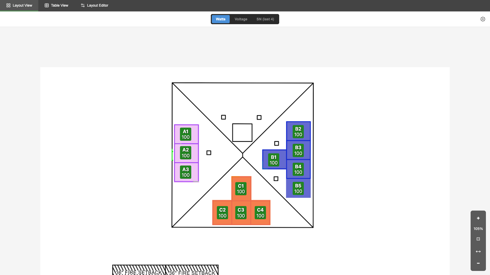
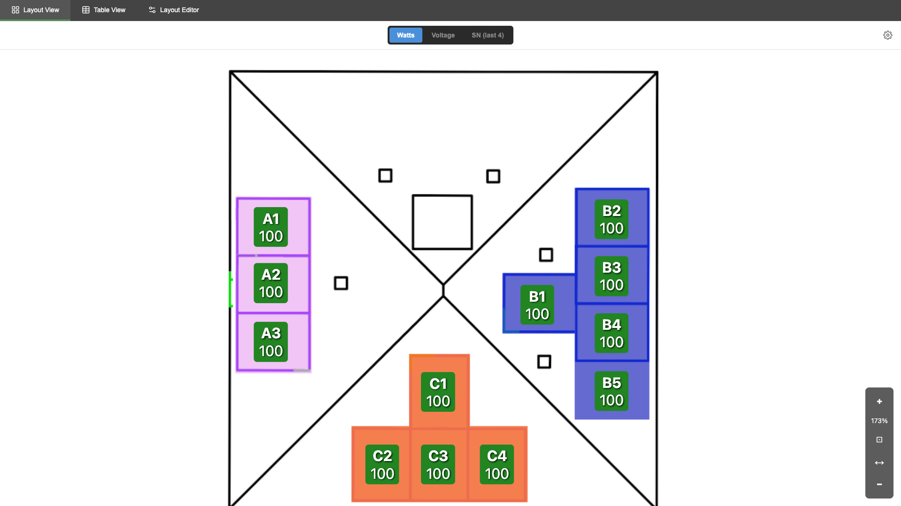
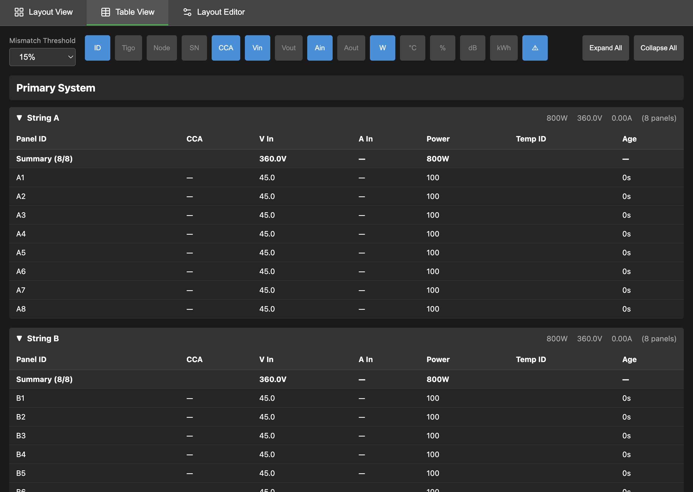
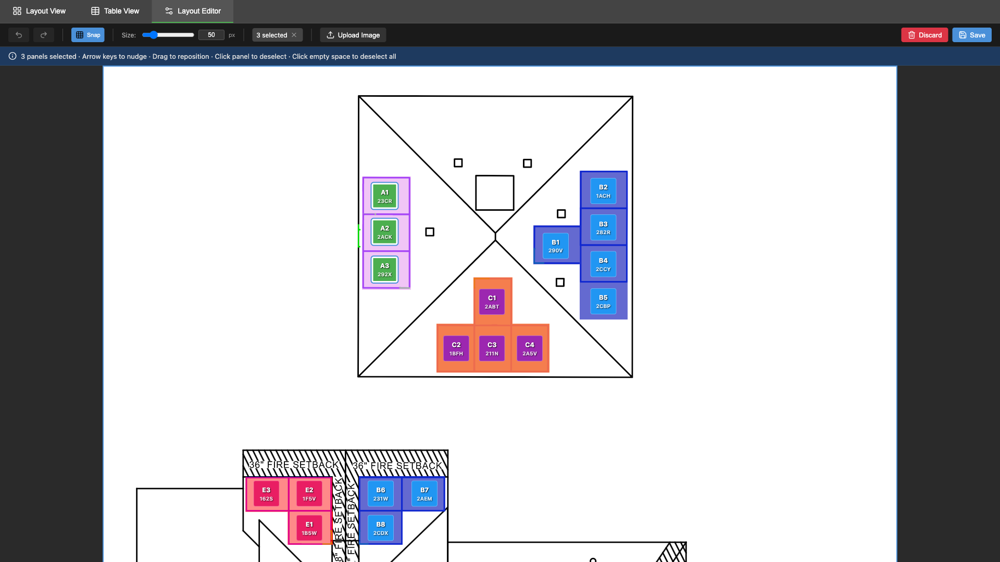
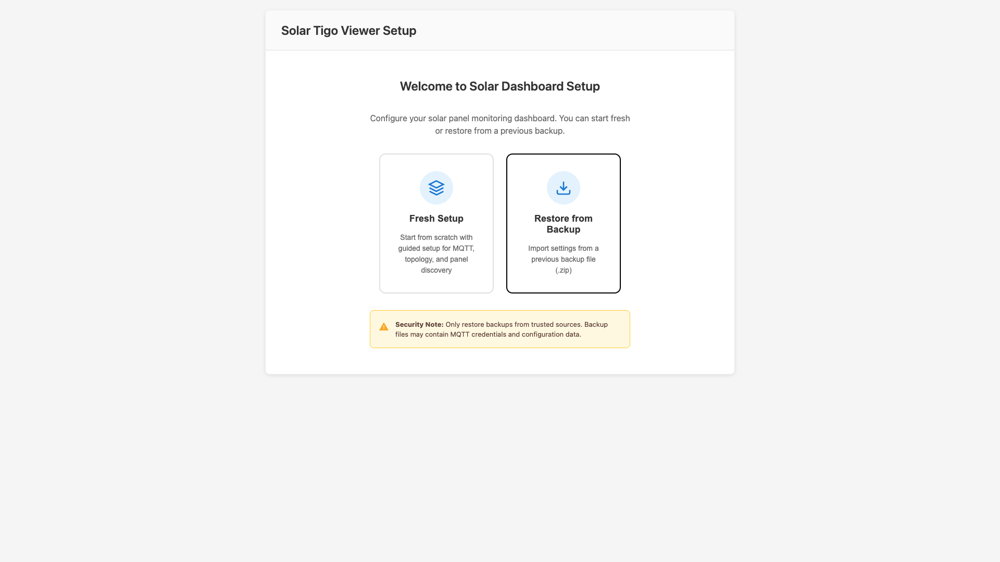
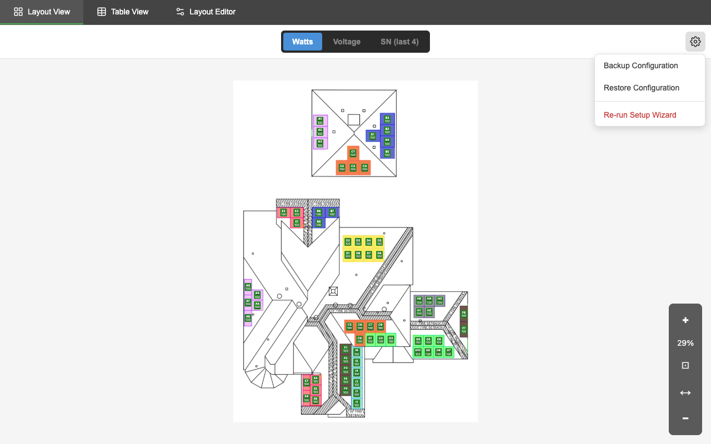
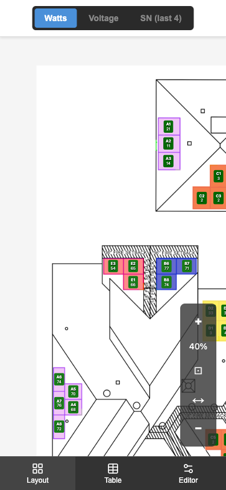
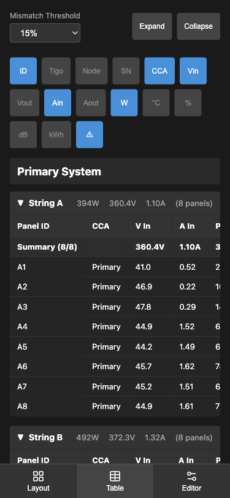

# Solar Tigo Viewer

A real-time visualization dashboard for Tigo Energy solar panel monitoring systems. Monitor your solar array with **5-10 second updates** — all running 100% locally on your network.



## Why Solar Tigo Viewer?

| Feature | Solar Tigo Viewer | Tigo Cloud |
|---------|-------------------|------------|
| **Update Speed** | 5-10 seconds | 30-60 minutes |
| **Data Location** | 100% local | Cloud servers |
| **Internet Required** | No (after setup) | Yes |
| **Privacy** | Your data stays home | Shared with Tigo |

**See your solar production change in real-time** — watch power output respond as clouds pass overhead, instantly identify shaded panels, and monitor your system without waiting for cloud sync.

## Features

### Real-Time Monitoring
- **Live WebSocket updates** every 5-10 seconds
- Color-coded panel status (green = producing, yellow = low output, red = offline)
- Multiple display modes: watts, voltage, serial numbers, or labels
- Stale data detection with configurable thresholds
- Temporary ID alerts when optimizers need attention

### Layout View
Upload your own solar array image and overlay live panel data:
- Drag-and-drop panel positioning
- Pan and zoom (25%-200%)
- Pinch-to-zoom on touch devices
- Responsive scaling on any device



### Table View
Detailed metrics organized by string with aggregation:
- Real-time voltage, current, power, temperature
- String-level summaries and totals
- Sortable columns with configurable visibility
- Mismatch detection for panels on wrong inverter



### Layout Editor
Intuitive visual editor for positioning panels:
- Snap-to-align guides for precise placement
- Multi-select with bulk operations
- Keyboard shortcuts (arrows to nudge, Ctrl+Z to undo)
- 50-state undo/redo history
- Auto-save drafts to prevent lost work



### Setup Wizard
Guided configuration for first-time setup:
- MQTT broker connection
- CCA device topology configuration
- Automatic panel discovery
- Panel validation and matching



### Backup & Restore
Protect your configuration:
- Export complete configuration as ZIP
- Restore on new installations
- Includes layout image and all settings



### Mobile-Friendly
Works great on phones and tablets:
- Responsive design with bottom navigation
- Touch-optimized controls
- Check your panels from anywhere on your network

<p align="center">
  
  
</p>

## Panel Data Fields

Every panel reports the following metrics:

| Field | Description | Unit |
|-------|-------------|------|
| Power | Current power output | Watts |
| Voltage In | Input voltage from panel | Volts |
| Voltage Out | Output voltage to string | Volts |
| Current In | Input current | Amps |
| Current Out | Output current | Amps |
| Temperature | Optimizer temperature | °C |
| Duty Cycle | Optimizer duty cycle | % |
| RSSI | Wireless signal strength | dB |
| Energy | Cumulative production | kWh |
| Online | Currently communicating | Yes/No |
| Last Update | Time since last report | seconds |
| Temp ID | Using temporary node ID | Yes/No |

## System Architecture

```
┌─────────────────────────────────────────────────────────────────┐
│                    Data Collection Device                        │
│                    (Raspberry Pi or similar)                     │
│                                                                  │
│   ┌──────────────┐    ┌──────────────┐                          │
│   │   Tigo CCA   │    │   Tigo CCA   │    ... (1 or more)       │
│   │   Device     │    │   Device     │                          │
│   └──────┬───────┘    └──────┬───────┘                          │
│          │ USB               │ USB                              │
│   ┌──────▼───────┐    ┌──────▼───────┐                          │
│   │   taptap     │    │   taptap     │                          │
│   │  container   │    │  container   │                          │
│   └──────┬───────┘    └──────┬───────┘                          │
│          └────────────┬──────┘                                  │
│                       │ MQTT Publish                            │
└───────────────────────┼─────────────────────────────────────────┘
                        ▼
                 ┌─────────────┐
                 │ MQTT Broker │  (Home Assistant, Mosquitto, etc.)
                 └──────┬──────┘
                        │ MQTT Subscribe
┌───────────────────────┼─────────────────────────────────────────┐
│                       ▼           Dashboard Server              │
│                ┌─────────────┐                                  │
│                │   Backend   │  FastAPI + WebSocket             │
│                │  (Python)   │                                  │
│                └──────┬──────┘                                  │
│                       │                                         │
│                ┌──────▼──────┐                                  │
│                │  Frontend   │  React SPA                       │
│                │   (nginx)   │                                  │
│                └─────────────┘                                  │
└─────────────────────────────────────────────────────────────────┘
```

The system supports **1 or more CCA devices** — configure as many as your installation requires. Each CCA connects via USB to the data collection device.

## Hardware Requirements

### Tigo Equipment
- **Tigo CCA (Cloud Connect Advanced)** — 1 or more units
- **Tigo TS4-A-O Optimizers** — one per solar panel
- USB cables to connect CCA units

### Computing
- **Data Collection Device** — Raspberry Pi (3B+ or newer) or similar
- **Dashboard Server** — Can run on the same Pi or a separate server/NAS
- **MQTT Broker** — Home Assistant's built-in broker, standalone Mosquitto, or any MQTT 3.1.1+ broker

## Quick Start

### Prerequisites
- Docker and Docker Compose installed
- Access to an MQTT broker ([setup guide](docs/DEPLOYMENT.md#mqtt-broker-setup))
- Raspberry Pi with Tigo CCA connected via USB

### 1. Clone the Repository

```bash
git clone https://github.com/yourusername/solar_tigo_viewer.git
cd solar_tigo_viewer
```

### 2. Deploy the tigo-mqtt Service

On your Raspberry Pi (or data collection device):

```bash
cd tigo-mqtt
# The setup wizard will generate configuration files for you
docker compose up --build -d
```

### 3. Deploy the Dashboard

On your dashboard server (can be the same Pi or different machine):

```bash
cd dashboard
cp backend/.env.example backend/.env
# Edit .env with your MQTT broker details
docker compose up --build -d
```

### 4. Run the Setup Wizard

Open `http://your-server:5174` and follow the setup wizard to:
1. Configure MQTT connection
2. Define your CCA topology
3. Discover and validate panels
4. Position panels on your layout image

For detailed instructions, see the [Deployment Guide](docs/DEPLOYMENT.md).

## Documentation

- **[Deployment Guide](docs/DEPLOYMENT.md)** — Detailed setup instructions
- **[Troubleshooting](docs/TROUBLESHOOTING.md)** — Common issues and solutions
- **[Configuration Reference](docs/CONFIGURATION.md)** — Environment variables and YAML schemas

## Technology Stack

- **Backend**: Python 3.11, FastAPI, Pydantic, aiomqtt
- **Frontend**: React 18, TypeScript, Vite
- **Data Collection**: Python, taptap binary, paho-mqtt
- **Infrastructure**: Docker, Docker Compose, nginx

## Contributing

1. Fork the repository
2. Create a feature branch (`git checkout -b feature/amazing-feature`)
3. Make your changes
4. Run tests: `cd dashboard && docker compose exec backend pytest`
5. Commit your changes (`git commit -m 'Add amazing feature'`)
6. Push to the branch (`git push origin feature/amazing-feature`)
7. Open a Pull Request

## License

This project is licensed under the MIT License — see the [LICENSE](LICENSE) file for details.

## Acknowledgments

- [taptap](https://github.com/taptap) — Tigo CCA communication binary
- [Tigo Energy](https://www.tigoenergy.com/) — Solar optimizer hardware
