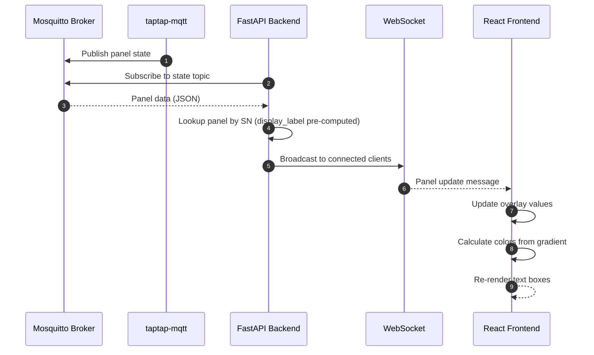

# Solar Panel Real-Time Viewer

A web application for visualizing real-time solar panel output data from a Tigo Energy monitoring system. The application displays panel wattage or voltage values overlaid on a layout diagram, with color gradients indicating relative performance.

## Motivation

The existing Tigo Energy monitoring system provides data through CCAs (Cloud Connect Advanced gateways), but lacks a customized visualization that matches the physical panel layout. Additionally, some panels have been physically relocated but the Tigo system has not been updated to reflect these changes. This application provides:

1. Real-time visualization matching the actual physical layout
2. Panel label translation to map Tigo-reported labels to actual positions
3. Color-coded performance indicators for quick identification of underperforming panels
4. Responsive design for monitoring on mobile or desktop

## Functional Requirements

### FR-1: Panel Data Mapping

**FR-1.1:** The system SHALL maintain a mapping data structure that associates:
- Panel serial number (SN) → Tigo-reported label → Display label → X,Y coordinates

**FR-1.2:** The mapping SHALL be stored in a JSON configuration file (`config/panel_mapping.json`) with the following structure:
```json
{
  "panels": [
    {
      "sn": "4-C3F23CR",
      "tigo_label": "A1",
      "display_label": "A1",
      "string": "A",
      "system": "primary",
      "position": {
        "x_percent": 15.523,
        "y_percent": 23.871
      }
    }
  ],
  "translations": {
    "G1": "C9",
    "G2": "G1",
    "B9": "F6"
  }
}
```

**Note:** Position values are floating-point numbers representing percentages (0.0 - 100.0). JSON natively supports arbitrary decimal precision for numbers.

**FR-1.3:** The system SHALL apply translations from the `translations` object to convert Tigo-reported labels to display labels. Translations SHALL be applied exactly once; the result of a translation is NOT checked against the translation table again (no chaining).

**Clarification:** The `display_label` in each panel record is pre-computed (translations already applied when building the JSON). The `translations` object is included for documentation and validation purposes. At runtime, the backend looks up panels by `sn` (serial number) and uses the `display_label` directly—no runtime translation lookup occurs.

**FR-1.4:** The system SHALL support 69 panels across 9 strings (A-I) distributed between primary and secondary systems.

**FR-1.5:** At startup, the system SHALL validate `panel_mapping.json`:
- All required fields (`sn`, `tigo_label`, `display_label`, `string`, `system`, `position`) SHALL be present
- Serial numbers SHALL be unique (no duplicates)
- Position coordinates SHALL be within valid range (0.0 - 100.0)
- Validation failures SHALL prevent application startup with a descriptive error message

### FR-2: MQTT Data Subscription

**FR-2.1:** The backend SHALL subscribe to the taptap-mqtt service topics on a local Mosquitto broker.

**FR-2.2:** The system SHALL parse the state topic JSON payload containing:
- `nodes[node_name].power` (watts)
- `nodes[node_name].voltage_in` (voltage)
- `nodes[node_name].node_serial` (for panel identification)
- `nodes[node_name].timestamp` (for staleness detection)

**FR-2.3:** Until MQTT integration is complete, the system SHALL provide mock data: 100W for watts and 45V for voltage (sent together per FR-3.3 message format).

**FR-2.4:** The system SHALL map incoming MQTT data by serial number to the correct panel using the mapping defined in FR-1.1.

**FR-2.5:** When the system receives data for a serial number not found in `panel_mapping.json`, it SHALL:
- Log a warning with the unknown serial number (once per session, not per message)
- Ignore the data (do not display or forward to clients)
- Continue processing other panels in the message

**FR-2.6:** The system SHALL detect stale data using the following criteria:
- **Staleness threshold:** 120 seconds (2 minutes) since last update for a panel
- The backend SHALL track the last update timestamp per panel
- The WebSocket message SHALL include a `stale` boolean flag per panel when data exceeds the threshold

**FR-2.7:** The backend SHALL handle MQTT connection lifecycle:
- **Startup failure:** If broker is unavailable, retry with exponential backoff (1s, 2s, 4s, 8s... max 60s)
- **Disconnection:** Automatically reconnect with same exponential backoff strategy
- **Logging:** Log all connection state changes (connected, disconnected, reconnecting, error)
- **No message buffering:** Messages received during disconnection are lost (acceptable for monitoring data)

**FR-2.8:** The system SHALL handle panel online state from taptap-mqtt:
- **Known values for `state_online`:** "online", "offline" (panel not responding to gateway)
- **Offline panels:** Backend SHALL include `online: false` flag in WebSocket message
- **Frontend treatment:** Offline panels SHALL display with gray background and "OFFLINE" text instead of value

### FR-3: Real-Time Data Delivery

**FR-3.1:** The backend SHALL expose a WebSocket endpoint at `/ws/panels` for real-time data streaming.

**FR-3.2:** The WebSocket SHALL push panel updates to connected clients within 1-5 seconds of receiving MQTT data. Updates SHALL be batched: collect changes for 500ms, then broadcast full state to all clients.

**FR-3.3:** The WebSocket message format SHALL be (full state, not delta):
```json
{
  "timestamp": "2026-01-17T10:30:00Z",
  "panels": [
    {
      "display_label": "A1",
      "string": "A",
      "watts": 385,
      "voltage": 42.5,
      "online": true,
      "stale": false,
      "position": {
        "x_percent": 15.5,
        "y_percent": 23.2
      }
    }
  ]
}
```

**Note:** The backend sends **both** `watts` and `voltage` values for each panel. The frontend controls display mode locally via toggle button (no backend round-trip required for mode changes).

**FR-3.4:** The backend SHALL manage WebSocket connections with the following requirements:
- **Connection health:** Implement ping/pong heartbeat every 30 seconds to detect stale connections
- **Error handling:** Log all connection errors with client identifier before disconnecting
- **Thread safety:** Collect failed connections and remove after broadcast iteration completes (avoid modifying list while iterating)

### FR-4: Frontend Visualization

**FR-4.1:** The frontend SHALL display the layout image (`layout.png`) as a responsive background.

**FR-4.2:** The frontend SHALL overlay text boxes on each panel position showing the current value.

**FR-4.3:** Text box positions SHALL be specified as floating-point percentages of the image dimensions (e.g., `x_percent: 15.523`, `y_percent: 42.871`) to maintain correct positioning during resize/zoom. CSS percentage values support arbitrary decimal precision, allowing sub-pixel positioning accuracy.

**FR-4.4:** Each text box SHALL display:
- Panel ID on the first line (e.g., "A1", "C9")
- The numeric value with unit indicator on the second line (e.g., "385W" or "42V")

**FR-4.5:** The frontend SHALL provide a toggle button to switch between "Watts" and "Voltage" display modes.

**FR-4.6:** The toggle button SHALL be positioned at the top of the viewport.

**FR-4.7:** The frontend SHALL visually indicate data states:
- **Stale data:** Panel box SHALL display with 50% opacity and show "⏱" indicator next to the value
- **No data received:** Panel box SHALL display "—" (em dash) instead of a value with gray background
- **Recovery:** When fresh data arrives for a stale/missing panel, normal display SHALL resume immediately

**FR-4.8:** The frontend SHALL display connection status:
- **Before WebSocket connects:** Show layout image with "Connecting..." overlay
- **Connected:** No indicator (normal operation)
- **Disconnected:** Show "Reconnecting..." badge at top of viewport; retain last known values with stale indicators
- **Connection error:** Show error message with retry button

**FR-4.9:** The frontend SHALL handle layout image load failures:
- **On load error:** Display error message "Failed to load layout image" with retry button
- **On retry:** Attempt to reload the image
- **No silent failure:** User SHALL always receive feedback if the layout cannot be displayed

### FR-5: Color Gradient

**Note:** Color calculation SHALL occur in the **frontend only**. The backend sends raw numeric values; the frontend calculates colors based on the current display mode and max values. This allows for future theme customization without backend changes.

**FR-5.1:** Panel text boxes SHALL use a color gradient based on value:
- Higher values → Lighter colors
- Lower values → Darker colors

**FR-5.2:** For watts mode:
- Maximum value (lightest): 420W
- Minimum value (darkest): 0W
- **Clamping:** Values exceeding 420W SHALL be displayed with the maximum color (light green). The numeric value SHALL still show the actual reading (e.g., "450W" displays with light green background).

**FR-5.3:** For voltage mode:
- Maximum value (lightest): 50V
- Minimum value (darkest): 0V
- **Clamping:** Same behavior as watts mode - values exceeding 50V display with max color while showing actual reading.

**FR-5.4:** The gradient SHALL use a green color scale:
- 100% output: `#90EE90` (light green)
- 0% output: `#006400` (dark green)

**FR-5.5:** Text color SHALL be white with a dark shadow for readability against any background.

### FR-6: Responsive Layout

**FR-6.1:** The layout SHALL be fully responsive, supporting:
- Mobile portrait (375px - 767px width)
- Tablet (768px - 1023px width)
- Desktop (1024px+ width)

**FR-6.2:** The image SHALL scale proportionally while maintaining aspect ratio.

**FR-6.3:** Text box overlays SHALL maintain their relative positions on the image at all viewport sizes.

**FR-6.4:** Text box font size SHALL scale proportionally with the image size.

### FR-7: Docker Deployment

**FR-7.1:** The application SHALL be deployable via Docker Compose.

**FR-7.2:** The Docker Compose configuration SHALL define:
- Backend service (Python/FastAPI) - exposes port 8000
- Frontend service (React/Vite with nginx) - serves static files on port 80
- Network configuration for MQTT broker connectivity

**Note:** Production nginx reverse proxy configuration (SSL termination, port mapping, WebSocket upgrade headers) is handled externally by the deployment environment. For development, the frontend connects directly to backend:8000.

**FR-7.3:** Configuration SHALL be externalized via environment variables:

**Backend environment variables:**
- `MQTT_BROKER_HOST` - Mosquitto broker hostname (default: `mosquitto`)
- `MQTT_BROKER_PORT` - Mosquitto broker port (default: `1883`)
- `MQTT_TOPIC_PREFIX` - Topic prefix (default: `taptap`)
- `MQTT_USERNAME` - Optional broker authentication username
- `MQTT_PASSWORD` - Optional broker authentication password
- `LOG_LEVEL` - Logging level (default: `INFO`)

**Frontend build-time variables:**
- `VITE_WS_URL` - WebSocket backend URL (default: `ws://localhost:8000/ws/panels`)

**FR-7.4:** Required volume mounts for Docker Compose:
- `./config/panel_mapping.json:/app/config/panel_mapping.json:ro` - Panel mapping configuration
- `./assets/layout.png:/app/static/layout.png:ro` - Layout diagram image

## Non-Functional Requirements

**NFR-1:** The UI SHALL update within 5 seconds of data arriving at the MQTT broker.

**NFR-2:** The application SHALL support at least 5 concurrent browser connections.

**NFR-3:** The frontend bundle SHALL be less than 500KB gzipped.

**NFR-4:** The application SHALL function without requiring authentication for this initial version.

**NFR-5:** All panel positions SHALL remain correctly aligned with the layout image across browser zoom levels (50% - 200%).

**NFR-5.1:** The frontend SHALL wait for the layout image to fully load (onLoad event) before rendering panel overlays to ensure correct positioning calculations.

**NFR-5.2:** Panel overlay positioning SHALL work correctly regardless of parent container constraints (e.g., sidebars, headers). The overlay container SHALL be sized relative to the image, not the viewport.

**NFR-6:** Panel position coordinates SHALL support floating-point precision to at least 3 decimal places (e.g., `42.857%`), providing positioning accuracy of approximately 0.01-0.1 pixels on typical displays.

## Test Requirements

### Acceptance Criteria

**Connection Tests:**
- [ ] Application starts successfully when MQTT broker is available
- [ ] Application retries connection when MQTT broker is unavailable at startup
- [ ] Application reconnects automatically when MQTT connection is lost
- [ ] MQTT reconnection uses exponential backoff (1s, 2s, 4s... up to 60s max)
- [ ] WebSocket serves multiple concurrent clients (verify 5 connections)
- [ ] WebSocket heartbeat keeps connections alive (FR-3.4)
- [ ] Failed WebSocket connections are cleaned up properly
- [ ] Multiple rapid MQTT updates result in a single batched WebSocket broadcast (FR-3.2)

**Data Flow Tests:**
- [ ] Panel data appears in UI within 5 seconds of MQTT publish
- [ ] Unknown serial numbers are logged but don't crash the application
- [ ] Stale panels display correctly after 120 seconds without updates
- [ ] Stale panel returns to normal display when fresh data arrives
- [ ] Offline panels display "OFFLINE" indicator
- [ ] Offline panel returns to normal display when it comes back online

**UI Tests:**
- [ ] All 69 panels display on the layout image
- [ ] Watts/Voltage toggle switches display mode without page reload
- [ ] Panel overlays align correctly at 50%, 100%, and 200% zoom
- [ ] Responsive layout works at 375px, 768px, and 1024px widths
- [ ] Panel ID labels display above values
- [ ] Panel overlays only render after layout image onLoad event fires (NFR-5.1)
- [ ] "Connecting..." overlay displays before WebSocket connects
- [ ] "Reconnecting..." badge appears when WebSocket disconnects
- [ ] Last known values are retained during reconnection
- [ ] Error message with retry button appears on connection failure
- [ ] Retry button successfully re-establishes connection
- [ ] Panel text remains readable at all breakpoints - font scales between 8px minimum and 14px maximum (FR-6.4)
- [ ] Image load failure displays error message with retry button (FR-4.9)

**Startup Validation Tests:**
- [ ] Application fails to start with invalid panel_mapping.json (missing required fields)
- [ ] Application fails to start with duplicate serial numbers
- [ ] Application fails to start with out-of-range position coordinates (< 0 or > 100)

**Edge Case Tests:**
- [ ] Values exceeding max (>420W, >50V) display with clamped color AND show actual numeric reading
- [ ] Negative or null values handled gracefully
- [ ] Malformed MQTT messages don't crash the backend
- [ ] Translation chaining does NOT occur (G2→G1 stays G1, not G2→G1→C9)

**Calibration Tests:**
- [ ] All 69 panels have position coordinates in panel_mapping.json
- [ ] All position coordinates are within valid range (0-100)
- [ ] Panel overlays visually align with layout.png at 100% zoom (manual verification)
- [ ] Panel labels remain readable and visually distinguishable at 100% zoom (some overlap acceptable at extreme zoom levels)

**Build Tests:**
- [ ] Frontend production bundle is less than 500KB gzipped (`npm run build` and check dist size) (NFR-3)

**Unit Tests (Implementation Detail):**
- [ ] `interpolateColor(0)` returns dark green `rgb(0, 100, 0)` / `#006400` (FR-5.4)
- [ ] `interpolateColor(1)` returns light green `rgb(144, 238, 144)` / `#90EE90` (FR-5.4)
- [ ] `interpolateColor()` clamps values outside 0-1 range

**Browser Support:**
- [ ] Chrome (latest 2 versions)
- [ ] Firefox (latest 2 versions)
- [ ] Safari (latest 2 versions)
- [ ] Mobile Safari and Chrome on iOS/Android

## Security Considerations

**Deployment Context:**
- This application is designed for **internal network deployment only** (home LAN or VPN-protected network)
- Not intended for public internet exposure without additional security measures

**Data Sensitivity:**
- Solar panel power data may reveal occupancy patterns (low power = no one home)
- Consider this when deciding network exposure

**Current Implementation (v1):**
- No authentication required (NFR-4)
- No HTTPS/WSS requirement for initial deployment
- CORS configured to allow local network access

**Future Security Enhancements (if internet-exposed):**
- Add authentication (Basic Auth, OAuth, or API keys)
- Require WSS for WebSocket connections
- Implement rate limiting on WebSocket connections
- Restrict CORS to specific origins
- Consider reverse proxy with HTTPS termination

## High Level Design



### Architecture Overview

```
┌─────────────────────────────────────────────────────────────────┐
│                        Docker Compose                            │
├─────────────────────────────────────────────────────────────────┤
│  ┌─────────────────┐    ┌─────────────────┐                     │
│  │   Frontend      │    │    Backend      │                     │
│  │   (nginx)       │    │   (FastAPI)     │                     │
│  │                 │    │                 │                     │
│  │  - React SPA    │    │  - MQTT Sub     │                     │
│  │  - Static files │◄──►│  - WebSocket    │◄──► Mosquitto       │
│  │  - Port 80      │    │  - REST API     │     (external)      │
│  │                 │    │  - Port 8000    │                     │
│  └─────────────────┘    └─────────────────┘                     │
└─────────────────────────────────────────────────────────────────┘
```

### Panel Mapping Data Flow

```
Tigo CCA → taptap-mqtt → MQTT Broker
                              │
                              ▼
                    Backend receives message
                              │
                              ▼
              ┌───────────────────────────────┐
              │     Panel Mapping Lookup      │
              │                               │
              │  SN: "4-C3F34CZ"              │
              │       ↓ (direct lookup by SN) │
              │  Panel Record:                │
              │    display_label: "C9"        │
              │    (pre-computed, no runtime  │
              │     translation lookup)       │
              │    position: {x: 45%, y: 12%} │
              └───────────────────────────────┘
                              │
                              ▼
                    WebSocket broadcast
                              │
                              ▼
                    Frontend renders overlay
```

### Frontend Overlay Architecture

The frontend uses CSS percentage-based positioning to maintain overlay alignment during resize:

```jsx
// PanelOverlay.jsx
const PanelOverlay = ({ panel, mode, maxValue }) => {
  // Handle offline panels (FR-2.8)
  if (!panel.online) {
    return (
      <div style={{
        position: 'absolute',
        left: `${panel.position.x_percent}%`,
        top: `${panel.position.y_percent}%`,
        transform: 'translate(-50%, -50%)',
        backgroundColor: '#808080',
        color: 'white',
        padding: '2px 4px',
        borderRadius: '3px',
        fontSize: 'clamp(8px, 1.5vw, 14px)',
        textAlign: 'center',
      }}>
        <div style={{ fontWeight: 'bold' }}>{panel.display_label}</div>
        <div>OFFLINE</div>
      </div>
    );
  }

  // Get value based on display mode (FR-3.3: backend sends both watts and voltage)
  const value = mode === 'watts' ? panel.watts : panel.voltage;

  // Handle no data received yet (FR-4.7)
  if (value === null || value === undefined) {
    return (
      <div style={{
        position: 'absolute',
        left: `${panel.position.x_percent}%`,
        top: `${panel.position.y_percent}%`,
        transform: 'translate(-50%, -50%)',
        backgroundColor: '#808080',
        color: 'white',
        padding: '2px 4px',
        borderRadius: '3px',
        fontSize: 'clamp(8px, 1.5vw, 14px)',
        textAlign: 'center',
      }}>
        <div style={{ fontWeight: 'bold' }}>{panel.display_label}</div>
        <div>—</div>
      </div>
    );
  }

  const percentage = value / maxValue;
  const backgroundColor = interpolateColor(percentage);

  // Apply stale styling (FR-4.7: 50% opacity + ⏱ indicator)
  const staleStyle = panel.stale ? { opacity: 0.5 } : {};

  return (
    <div
      style={{
        position: 'absolute',
        left: `${panel.position.x_percent}%`,
        top: `${panel.position.y_percent}%`,
        transform: 'translate(-50%, -50%)',
        backgroundColor,
        color: 'white',
        textShadow: '1px 1px 2px rgba(0,0,0,0.8)',
        padding: '2px 4px',
        borderRadius: '3px',
        fontSize: 'clamp(8px, 1.5vw, 14px)',
        whiteSpace: 'nowrap',
        textAlign: 'center',
        lineHeight: '1.2',
        ...staleStyle,
      }}
    >
      <div style={{ fontWeight: 'bold' }}>{panel.display_label}</div>
      <div>{value}{mode === 'watts' ? 'W' : 'V'}{panel.stale ? ' ⏱' : ''}</div>
    </div>
  );
};
```

The container uses relative positioning to anchor overlays:

```jsx
// SolarLayout.jsx
const SolarLayout = ({ panels, mode }) => {
  const [imageLoaded, setImageLoaded] = useState(false);
  const [imageError, setImageError] = useState(false);
  const imgRef = useRef(null);

  // Defensive pattern: handle cached images that load synchronously
  useEffect(() => {
    if (imgRef.current?.complete && !imageError) {
      setImageLoaded(true);
    }
  }, [imageError]);

  // Handle image load error (FR-4.9)
  if (imageError) {
    return (
      <div style={{ padding: '20px', textAlign: 'center', color: '#dc3545' }}>
        <p>Failed to load layout image</p>
        <button onClick={() => { setImageError(false); setImageLoaded(false); }}>
          Retry
        </button>
      </div>
    );
  }

  return (
    <div style={{ position: 'relative', width: '100%' }}>
       setImageLoaded(true)}
        onError={() => setImageError(true)}
      />
      {/* NFR-5.1: Only render overlays after image loads for correct positioning */}
      {imageLoaded && panels.map(panel => (
        <PanelOverlay
          key={panel.display_label}
          panel={panel}
          mode={mode}
          maxValue={mode === 'watts' ? 420 : 50}
        />
      ))}
    </div>
  );
};
```

### Color Gradient Implementation

**Note:** This is reference algorithm for frontend implementation (JavaScript equivalent).

```javascript
// frontend/src/utils/colors.js
function interpolateColor(percentage) {
  // Clamp to 0-1 range
  const pct = Math.min(Math.max(percentage, 0), 1);

  // Dark green: RGB(0, 100, 0) -> Light green: RGB(144, 238, 144)
  const r = Math.round(0 + (144 - 0) * pct);
  const g = Math.round(100 + (238 - 100) * pct);
  const b = Math.round(0 + (144 - 0) * pct);

  return `rgb(${r}, ${g}, ${b})`;
}
```

### WebSocket Connection Management

**Note:** This is a simplified example showing core connection handling. Production implementation requires:
- 500ms batching mechanism (FR-3.2): Collect MQTT updates and broadcast periodically
- Ping/pong heartbeat every 30 seconds (FR-3.4): Use FastAPI's WebSocket ping frames or application-level heartbeat

```python
# backend/websocket.py
import logging
from fastapi import WebSocket
from typing import List

logger = logging.getLogger(__name__)

class ConnectionManager:
    def __init__(self):
        self.active_connections: List[WebSocket] = []

    async def connect(self, websocket: WebSocket):
        await websocket.accept()
        self.active_connections.append(websocket)
        logger.info(f"WebSocket client connected: {websocket.client}")

    def disconnect(self, websocket: WebSocket):
        if websocket in self.active_connections:
            self.active_connections.remove(websocket)
            logger.info(f"WebSocket client disconnected: {websocket.client}")

    async def broadcast(self, message: dict):
        # Collect failed connections to avoid modifying list while iterating
        failed_connections = []
        for connection in self.active_connections:
            try:
                await connection.send_json(message)
            except Exception as e:
                logger.warning(f"Failed to send to {connection.client}: {e}")
                failed_connections.append(connection)

        # Remove failed connections after iteration
        for connection in failed_connections:
            self.disconnect(connection)

manager = ConnectionManager()
```

### MQTT Integration

**Topic Structure:**
The taptap-mqtt service publishes to topics with the following structure:
- Pattern: `{prefix}/{system}/state` where `{system}` is the CCA identifier
- Example topics:
  - `taptap/primary/state` - Primary system (CCA 1)
  - `taptap/secondary/state` - Secondary system (CCA 2)
- The `+` wildcard subscribes to all systems: `taptap/+/state`
- Default `MQTT_TOPIC_PREFIX`: `taptap`
- Both systems send the same message format; no different handling required per system

**Note:** This is a simplified example. Production implementation requires:
- Authentication support (FR-7.3): Pass `username` and `password` to aiomqtt.Client if configured
- Exponential backoff reconnection (FR-2.7): Wrap in retry loop with delays 1s, 2s, 4s... max 60s

```python
# backend/mqtt_client.py
import asyncio
import aiomqtt
from config import settings

async def mqtt_listener(on_message_callback):
    # Simplified example - see FR-2.7 for reconnection requirements
    async with aiomqtt.Client(
        hostname=settings.MQTT_BROKER_HOST,
        port=settings.MQTT_BROKER_PORT,
        username=settings.MQTT_USERNAME,  # Optional, from FR-7.3
        password=settings.MQTT_PASSWORD,  # Optional, from FR-7.3
    ) as client:
        topic = f"{settings.MQTT_TOPIC_PREFIX}/+/state"
        await client.subscribe(topic)

        async for message in client.messages:
            payload = json.loads(message.payload.decode())
            await on_message_callback(payload)
```

### taptap-mqtt Message Format Reference

The taptap-mqtt service publishes to a state topic with this structure:

**Important:** The node key in the `nodes` object (e.g., "A1") is the **Tigo-reported label**. The backend uses the **`node_serial` field** inside each node object for panel mapping (per FR-2.4). The key is ignored for lookup purposes but may be logged for debugging.

```json
{
  "time": "2026-01-17T10:30:00Z",
  "uptime": "5T12:30:45",
  "nodes": {
    "A1": {                            // <- Tigo label (key) - NOT used for lookup
      "state_online": "online",
      "timestamp": "2026-01-17T10:30:00Z",
      "voltage_in": 42.5,
      "voltage_out": 40.2,
      "current_in": 9.1,
      "power": 385,
      "temperature": 45.2,
      "node_serial": "4-C3F23CR",      // <- Serial number - USED for panel mapping
      "gateway_address": "04:C0:5B:30:00:04:B3:8C"
    }
  },
  "stats": {
    "overall": {
      "power": {"sum": 25000, "avg": 362, "min": 280, "max": 410}
    }
  }
}
```

## Task Breakdown

### Phase 1: Project Setup
1. Initialize Python backend project with FastAPI
2. Initialize React frontend project with Vite
3. Create Docker Compose configuration
4. Set up project directory structure

### Phase 2: Data Model & Configuration
5. Create panel mapping JSON schema
6. Build panel mapping JSON file with all 69 panels (SNs from `all` file)
7. Implement translation logic (apply translations.md mappings)
8. Create placeholder X,Y coordinates (to be refined later)

### Phase 3: Backend Development
9. Implement FastAPI application structure
10. Create panel mapping loader service
11. Implement mock data service (100W / 45V)
12. Implement WebSocket endpoint (`/ws/panels`)
13. Create MQTT client subscription (disabled initially, use mock)
14. Implement message transformation (MQTT → WebSocket format)

### Phase 4: Frontend Development
15. Create React application shell with Vite
16. Implement responsive image container component
17. Implement panel overlay component with percentage positioning
18. Implement color gradient utility
19. Implement WebSocket client hook
20. Implement Watts/Voltage toggle button
21. Connect components and test with mock data

### Phase 5: Integration & Testing
22. Connect frontend to backend WebSocket
23. Test responsive behavior at mobile/tablet/desktop breakpoints
24. Validate overlay positioning maintains alignment during resize
25. Test zoom behavior (50%-200%)

### Phase 6: Docker Deployment
26. Create backend Dockerfile
27. Create frontend Dockerfile with nginx
28. Configure Docker Compose networking
29. Test full stack deployment locally

### Phase 7: Panel Position Calibration

**Calibration Process:**
1. Open `layout.png` in an image editor (e.g., GIMP, Photoshop)
2. For each panel, determine the center pixel coordinates (x, y) - most editors show cursor coordinates in the status bar
3. Calculate percentage: `x_percent = (x_pixel / image_width) * 100`, `y_percent = (y_pixel / image_height) * 100`
4. Update `panel_mapping.json` with calculated percentages

**Efficiency Tips:**
- For evenly-spaced panels within a string, measure anchor points (first/last) and interpolate intermediate positions
- Use image editor's grid overlay for alignment reference
- Create a temporary layer to mark measured positions for verification

**Validation Script:**
```bash
# Verify panel count
jq '.panels | length' config/panel_mapping.json  # Should output 69

# Check for out-of-range coordinates
jq '.panels[] | select(.position.x_percent < 0 or .position.x_percent > 100 or .position.y_percent < 0 or .position.y_percent > 100)' config/panel_mapping.json
# Should return empty
```

**Tasks:**
30. Measure pixel coordinates for all 69 panels from layout.png
31. Calculate percentage coordinates using image dimensions
32. Update panel_mapping.json with calibrated positions
33. Build and test frontend with calibrated positions
34. Verify alignment at multiple viewport sizes (mobile, tablet, desktop)
35. Verify alignment at zoom levels (50%, 100%, 200%)

**Recalibration:** If `layout.png` is modified, repeat the calibration process. Consider adding a build step to validate that all panel IDs in mapping have corresponding positions.

### Phase 8: MQTT Integration (Future)
36. Configure connection to Mosquitto broker
37. Enable MQTT subscription in backend
38. Test with live taptap-mqtt data
39. Remove mock data fallback

## Context / Documentation

### Project Files
- `/path/to/solar_tigo_viewer/layout.png` - Visual layout diagram
- `/path/to/solar_tigo_viewer/docs/imports/all` - Panel SN to label mapping
- `/path/to/solar_tigo_viewer/docs/imports/primary.json` - Primary system panel data
- `/path/to/solar_tigo_viewer/docs/imports/secondary.json` - Secondary system panel data
- `/path/to/solar_tigo_viewer/docs/imports/translations.md` - Panel relocation translations

### External References
- [taptap-mqtt Repository](https://github.com/litinoveweedle/taptap-mqtt) - MQTT publisher for Tigo data
- [FastAPI WebSocket Documentation](https://fastapi.tiangolo.com/advanced/websockets/)
- [aiomqtt Documentation](https://sbtinstruments.github.io/aiomqtt/)
- [Vite React Setup](https://vitejs.dev/guide/)

### Panel Inventory Summary

The table below shows **final display label counts** after all translations are applied:

| String | System    | Panel Count | Notes                                      |
|--------|-----------|-------------|--------------------------------------------|
| A      | Primary   | 8           | A1-A8                                      |
| B      | Primary   | 8           | B1-B8 (original B9→F6, B10→F7)            |
| C      | Primary   | 9           | C1-C8 + C9 (from G1 translation)          |
| D      | Primary   | 8           | D1-D8                                      |
| E      | Primary   | 8           | E1-E8                                      |
| F      | Secondary | 7           | F1-F5 + F6 (from B9) + F7 (from B10)      |
| G      | Secondary | 10          | G1-G10 (translated from Tigo G2-G11)      |
| H      | Secondary | 5           | H1-H5                                      |
| I      | Primary   | 6           | I1-I6 (translated from Tigo F6-F11)       |
| **Total** |        | **69**      |                                            |

### Translation Summary (from translations.md)
```
G1 -> C9
G2 -> G1
G3 -> G2
G4 -> G3
G5 -> G4
G6 -> G5
G7 -> G6
G8 -> G7
G9 -> G8
G10 -> G9
G11 -> G10
F6 -> I1
F7 -> I2
F8 -> I3
F9 -> I4
F10 -> I5
F11 -> I6
B9 -> F6
B10 -> F7
```

---

**Specification Version:** 1.0
**Last Updated:** January 2026
**Authors:** Claude (AI Assistant)

## Changelog

### v1.0 (January 2026)
**Summary:** Initial specification

**Changes:**
- Initial specification created
- Defined panel mapping data structure with SN → Tigo label → display label → position
- Specified client-side percentage-based overlay positioning for responsive behavior
- Documented taptap-mqtt message format and integration approach
- Included mock data mode for initial development
