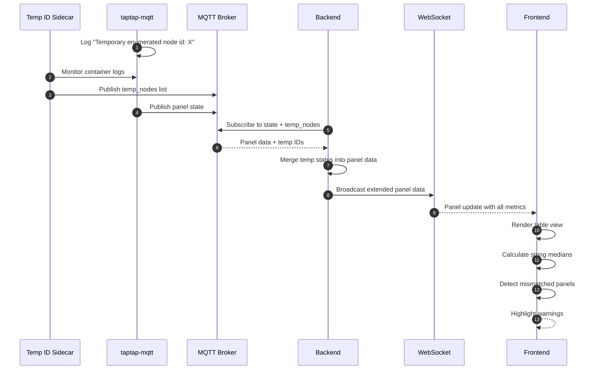

# Tabular View with String Mismatch Detection

A secondary tabular view for the Solar Tigo Viewer that displays detailed panel metrics in a structured table format organized by system and string. Includes client-side detection of misconfigured panels based on power output variance within strings.

## Motivation

The existing GUI layout view provides a visual representation of panel positions but lacks:

1. **Detailed metrics visibility** - The GUI only shows one metric at a time (watts OR voltage). Installers need to see all metrics simultaneously (voltage_in, voltage_out, current_in, current_out, power, temperature, etc.)

2. **String-level aggregation** - No summary of string totals for quick health assessment

3. **Misconfiguration detection** - When panels are physically connected to wrong strings, they produce values significantly different from other panels in that string. This is currently not detectable from the GUI view.

4. **Temporary enumeration visibility** - When taptap state files are missing/invalid, panels are temporarily enumerated with random IDs. This condition should be clearly visible per-panel.

## Functional Requirements

### FR-1: Tab Navigation

**FR-1.1:** The application SHALL provide two top-level tabs:
- "Layout" - The existing GUI visualization (current behavior)
- "Table" - The new tabular view

**FR-1.2:** Desktop navigation SHALL display tabs as a horizontal tab bar at the top of the viewport, below the existing header.

**FR-1.3:** Mobile navigation SHALL display a fixed bottom navigation bar with tab icons/labels for "Layout" and "Table".

**FR-1.4:** Tab state SHALL be preserved during the session. Switching tabs SHALL NOT reload data or disconnect the WebSocket.

**FR-1.5:** The default tab on initial load SHALL be "Layout" to preserve existing behavior.

### FR-2: Tabular View Layout

**FR-2.1:** The table view SHALL organize data hierarchically:
1. **System level** (Primary / Secondary) - collapsible sections
2. **String level** (A, B, C, etc.) - subsections within each system
3. **Panel level** - individual rows within each string

**FR-2.2:** Each system section SHALL display the system name as a section header ("Primary System" / "Secondary System").

**FR-2.3:** Each string section SHALL display:
- String identifier header (e.g., "String A")
- Summary row with aggregated totals (see FR-3)
- Individual panel rows

**FR-2.4:** Panel rows SHALL be sorted by display_label within each string (A1, A2, A3... or natural alphanumeric sort).

### FR-3: String Summary Tables

**FR-3.1:** Each string section SHALL include a summary row displaying:
- String Voltage: Sum of voltage_in for all panels (represents series-connected string voltage)
- String Power: Sum of watts for all panels in string
- String Current: Average of current_in (in series, current is same through all panels; average accounts for measurement variance)
- Panel Count: Number of online panels / total panels in string

**Note:** Panels in a string are series-connected, so voltage sums while current remains constant. The average current provides a representative value accounting for measurement tolerances.

**FR-3.2:** The summary row SHALL be visually distinct from panel rows (e.g., bold text, different background color).

**FR-3.3:** Summary values SHALL update in real-time as panel data updates.

### FR-4: Panel Data Columns

**FR-4.1:** The panel table SHALL include the following columns:

| Column | Field | Description |
|--------|-------|-------------|
| Panel ID | display_label | Translated panel ID (e.g., "A1", "C9") |
| Tigo ID | tigo_label | Original Tigo-reported label |
| Node ID | node_id | Internal node identifier from taptap |
| Serial | sn | Panel serial number (e.g., "4-C3F23CR") |
| V In | voltage_in | Input voltage (V) |
| V Out | voltage_out | Output voltage (V) |
| A In | current_in | Input current (A) |
| A Out | current_out | Output current (A) |
| Power | watts | Power output (W) |
| Temp | temperature | Temperature (°C) |
| Duty | duty_cycle | Duty cycle (%) |
| RSSI | rssi | Signal strength (dB) |
| Energy | energy | Daily energy (kWh) |
| Temp ID | is_temporary | Flag if temporarily enumerated |

**FR-4.2:** All data columns (V In through Energy) SHALL be user-configurable to show/hide. The UI SHALL provide a column visibility toggle control.

**FR-4.3:** Column visibility preferences SHALL persist to localStorage for cross-session persistence.

**FR-4.4:** Default visible columns SHALL be: Panel ID, V In, A In, Power, Temp ID.

**FR-4.5:** Columns SHALL NOT be sortable. Rows are always sorted by Panel ID (display_label) within each string.

### FR-5: Temporary ID Detection

**FR-5.1:** The backend SHALL detect temporary enumeration state by integrating with a sidecar service that monitors taptap logs.

**FR-5.2:** A new sidecar container SHALL be added to the tigo_docker compose that:
- Monitors taptap container logs in real-time via Docker API
- Parses log lines for "Temporary enumerated" vs "Permanently enumerated" messages
- Publishes a list of temporarily-enumerated node IDs to MQTT
- On startup, parses historical logs (without `-f`) to recover state before switching to follow mode
- Requires Docker socket access (`/var/run/docker.sock`) - documented in docker-compose volume mounts
- Handles container restarts gracefully by re-parsing logs when the followed process exits

**FR-5.3:** The MQTT topic for temporary enumeration status SHALL be:
- `taptap/{system}/temp_nodes` where payload is JSON array of node IDs

**FR-5.4:** The backend SHALL subscribe to temp_nodes topics and include `is_temporary: boolean` in the WebSocket panel data.

**FR-5.5:** The frontend table SHALL display the "Temp ID" column:
- **Blank** if `is_temporary` is false (panel properly enumerated)
- **Warning indicator** if `is_temporary` is true, with accessibility support:
  - Visual: Warning triangle icon with yellow/amber background (#FFC107)
  - Text label visible to screen readers: `<span role="img" aria-label="Temporarily enumerated - panel ID may be incorrect">⚠</span>`
  - Minimum contrast ratio of 4.5:1 (WCAG AA) for icon against background
  - Tooltip on hover: "Panel is temporarily enumerated. ID may change when state file is updated."

**FR-5.6:** Rows with temporary IDs SHALL have a distinct background color (e.g., light yellow) to draw attention.

### FR-6: String Mismatch Detection

**FR-6.1:** The frontend SHALL implement client-side detection of panels that may be misconfigured (connected to wrong string).

**FR-6.2:** Detection logic:
1. For each string, calculate the **median** power value of all online panels
2. For each panel in the string, calculate variance from median: `|power - median| / median * 100`
3. Flag panels where variance exceeds the configurable threshold

**FR-6.3:** The threshold SHALL be user-configurable via a toggle at the top of the table view with options: 5%, 10%, 20%, 30%. Default: 15%.

**Usage guidance** (displayed as tooltip or help text):
- **5%**: Clean, unshaded arrays with minimal variance
- **10%**: Arrays with minor shading or soiling
- **20%**: Arrays with partial shading (recommended starting point)
- **30%**: Arrays with significant shading; only flags severe mismatches

**FR-6.3.1:** The threshold setting SHALL persist to localStorage alongside column visibility.

**FR-6.4:** Panels flagged as potential misconfigurations SHALL:
- Have their row highlighted with a distinct background color (e.g., light red/pink)
- Display a warning indicator in a dedicated column or tooltip

**FR-6.5:** When any panel in a string is flagged, the entire string section SHALL:
- Display a red border around the string section
- Show a warning notice at the top of that string section with details:
  - Single mismatch: "String may be misconfigured. Panel A3 shows 185W while median is 105W."
  - Multiple mismatches: "String may be misconfigured. Panels A3, A7 show significant variance from median (105W)."
  - List all mismatched panel IDs with their individual values in the detailed view

**FR-6.6:** The mismatch detection SHALL only apply to panels where:
- `online` is true
- `watts` is not null and > 50W (minimum threshold to filter out noisy low-light periods at dawn/dusk)
- String has at least 2 panels with valid power readings

**FR-6.6.1:** For strings with exactly 2 valid panels:
- Use a higher threshold of 30% variance between the two panels
- If exceeded, flag BOTH panels as potential mismatches (since we cannot determine which is correct)
- Display message: "String has only 2 panels - unable to determine which may be misconfigured"

**FR-6.6.2:** For strings with only 1 valid panel, display: "Insufficient data for mismatch detection" in the string header (no panels flagged).

**FR-6.6.3 Known Limitation:** Median-based detection assumes the majority of panels in a string are correctly configured. If multiple panels are misconfigured such that they form the majority, the correctly-configured panels will be flagged instead. Installers should use physical inspection to verify flagged panels rather than assuming the unflagged panels are correct.

**FR-6.7:** Detection SHALL recalculate in real-time as panel data updates.

### FR-7: Extended Backend Data

**FR-7.1:** The backend SHALL be extended to pass through all available taptap-mqtt metrics to the WebSocket message.

**FR-7.2:** The extended PanelData model SHALL include:

```python
class PanelData(BaseModel):
    display_label: str
    tigo_label: Optional[str] = None
    string: str
    system: str
    sn: str
    node_id: Optional[str] = None
    watts: Optional[float] = None
    voltage_in: Optional[float] = None
    voltage_out: Optional[float] = None
    current_in: Optional[float] = None
    current_out: Optional[float] = None
    temperature: Optional[float] = None
    duty_cycle: Optional[float] = None
    rssi: Optional[int] = None
    energy: Optional[float] = None
    online: bool = True
    stale: bool = False
    is_temporary: bool = False
    position: Position
```

> **Note:** This is the logical model. For backward compatibility during migration, apply aliasing from FR-M.5 (e.g., `voltage_in` with alias `"voltage"`).

**FR-7.3:** The MQTT client SHALL extract all available fields from the taptap-mqtt message payload.

### FR-8: Mobile Table View

**FR-8.1:** On mobile viewports (< 768px width), the table SHALL be horizontally scrollable to accommodate all visible columns.

**FR-8.2:** The Panel ID column SHALL be sticky (frozen) on the left side during horizontal scroll.

**FR-8.2.1:** System and String headers SHALL be sticky at the top during vertical scroll within the table container. Implementation note: Use `position: sticky; top: 0` with appropriate z-index layering.

**FR-8.2.2:** String mismatch warning banners SHALL be positioned inside the horizontal scroll container (scroll with table content) to maintain association with their string.

**FR-8.3:** The fixed bottom navigation bar SHALL remain visible and accessible above any page content.

**FR-8.4:** Touch targets for column visibility toggles SHALL meet minimum 44x44px size.

## Non-Functional Requirements

**NFR-1:** Tab switching SHALL complete within 100ms (no perceptible delay).

**NFR-2:** Table view SHALL support displaying all 69+ panels without performance degradation (smooth scrolling, responsive updates).

**NFR-3:** Table view updates SHALL reflect new WebSocket data within 200ms of message receipt (including mismatch recalculation, React re-render, and DOM paint). This SHALL be validated via Performance API measurements in integration tests.

**NFR-4:** The table view SHALL be accessible via keyboard navigation (tab through rows, toggle columns).

**NFR-5:** Column visibility toggle state SHALL persist across tab switches within the same session.

## Migration Strategy

This specification extends the existing WebSocket message format with additional fields. To ensure backward compatibility during rollout:

**FR-M.1:** All new fields in PanelData SHALL be Optional with sensible defaults:
- `voltage_out`, `current_in`, `current_out`, `temperature`, `duty_cycle`, `energy`: `Optional[float] = None`
- `rssi`: `Optional[int] = None`
- `node_id`, `tigo_label`: `Optional[str] = None`
- `is_temporary`: `bool = False`
- `system`: `str` (required, but already implied by existing data flow)

**FR-M.2:** The existing Layout view SHALL continue to function with the extended message format:
- Layout view only uses: `display_label`, `string`, `sn`, `watts`, `voltage` (as `voltage_in`), `online`, `stale`, `position`
- All these fields remain unchanged in structure
- The `voltage` field is renamed to `voltage_in` - frontend SHALL accept both for transition period

**FR-M.3:** Frontend SHALL handle missing Optional fields gracefully:
- Display "—" for null/undefined numeric fields
- Hide columns that have no data available
- Mismatch detection skips panels with null `watts`

**FR-M.4:** Rollout sequence:
1. Deploy backend with extended fields (existing clients unaffected)
2. Deploy frontend with Table view (uses new fields if available)
3. Deploy sidecar for temp ID detection (optional, enables is_temporary field)

**FR-M.5:** The `voltage` → `voltage_in` rename SHALL use aliasing (Pydantic v2):
```python
class PanelData(BaseModel):
    voltage_in: Optional[float] = Field(None, alias="voltage")
    # ... other fields

    model_config = ConfigDict(
        populate_by_name=True,  # Accept both "voltage" and "voltage_in" as INPUT
    )

# IMPORTANT: Serialization behavior
# - By default, model_dump() outputs field names ("voltage_in")
# - During transition, use model_dump(by_alias=True) to output "voltage" for backward compatibility
# - After frontend migration complete, switch to model_dump() to output "voltage_in"
```

**Note:** This project uses Pydantic v2. The v1 equivalent would use `allow_population_by_field_name` in `class Config`.

## Terminology Glossary

| Term | Description | Example |
|------|-------------|---------|
| **sn** (Serial Number) | Unique hardware identifier for a Tigo optimizer, printed on the device. Used as the primary key for panel lookup. | `4-C3F23CR` |
| **node_id** | Internal taptap identifier assigned to a node during enumeration. This is the numeric ID logged in "Temporary/Permanently enumerated node id: X" messages. Used to match temp_nodes from the sidecar. | `42` |
| **tigo_label** | The label reported by the Tigo system (from taptap-mqtt). May differ from display_label due to physical panel relocations. | `G1` |
| **display_label** | The user-facing label shown in the UI after translations are applied. Represents the panel's physical/logical position. | `C9` (translated from `G1`) |
| **Temporary enumeration** | When taptap cannot match a node to a known serial number (state file missing/invalid), it assigns a temporary node_id. Data may be associated with wrong panels. | Logged as: "Temporary enumerated node id: 42" |
| **Permanent enumeration** | When taptap successfully matches a node to its serial number from the state file. Panel identification is reliable. | Logged as: "Permanently enumerated node id: 42 to... serial: 4-C3F23CR" |

**Relationships:**
- `sn` → unique hardware ID (never changes)
- `node_id` → runtime ID assigned by taptap (may change between restarts)
- `tigo_label` → Tigo's name for the panel (based on Tigo cloud config)
- `display_label` → our translated name (based on `panel_mapping.json` translations)

The sidecar publishes `node_id` values in the `temp_nodes` list. The backend matches these against the `node_id` field received in MQTT messages to set `is_temporary` on the corresponding panel (identified by `sn`).

**Example Data Flow:**
```
1. taptap logs: "Temporary enumerated node id: 42 to node name: A7"
2. Sidecar publishes: {"topic": "taptap/primary/temp_nodes", "payload": [42, 57, 63]}
3. taptap-mqtt publishes panel data: {..., "node_id": "42", "sn": "4-C3F23CR", ...}
4. Backend receives both:
   - Panel with node_id="42" and sn="4-C3F23CR"
   - temp_nodes list containing 42
5. Backend sets: is_temporary=true for panel with sn="4-C3F23CR"
6. WebSocket broadcasts: {..., "sn": "4-C3F23CR", "is_temporary": true, ...}
```

This clarifies that:
- `node_id` is the matching key between sidecar output and panel data
- `sn` is used to identify the panel in the final output
- The backend must maintain a node_id→sn mapping

## High Level Design



### Tab Navigation Component

```tsx
// components/TabNavigation.tsx
import { useState, useEffect } from 'react';
import { LayoutGrid, Table } from 'lucide-react';
// Alternative: import { BsGrid, BsTable } from 'react-icons/bs';

// Custom hook for responsive breakpoints
function useMediaQuery(query: string): boolean {
  const [matches, setMatches] = useState(
    () => typeof window !== 'undefined'
      && typeof window.matchMedia === 'function'
      && window.matchMedia(query).matches
  );

  useEffect(() => {
    // Guard for SSR and old browsers without matchMedia
    if (typeof window === 'undefined' || typeof window.matchMedia !== 'function') {
      return;
    }
    const mql = window.matchMedia(query);
    const handler = (e: MediaQueryListEvent) => setMatches(e.matches);
    mql.addEventListener('change', handler);
    return () => mql.removeEventListener('change', handler);
  }, [query]);

  return matches;
}

interface TabNavigationProps {
  activeTab: 'layout' | 'table';
  onTabChange: (tab: 'layout' | 'table') => void;
}

const TabNavigation: React.FC<TabNavigationProps> = ({ activeTab, onTabChange }) => {
  // FR-8.1: Mobile breakpoint at < 768px (max-width: 767px matches this)
  const isMobile = useMediaQuery('(max-width: 767px)');

  if (isMobile) {
    return (
      <nav style={{
        position: 'fixed',
        bottom: 0,
        left: 0,
        right: 0,
        height: '56px',
        display: 'flex',
        backgroundColor: '#333',
        borderTop: '1px solid #555',
        zIndex: 1000,
      }}>
        <button
          onClick={() => onTabChange('layout')}
          style={{
            flex: 1,
            display: 'flex',
            flexDirection: 'column',
            alignItems: 'center',
            justifyContent: 'center',
            backgroundColor: activeTab === 'layout' ? '#444' : 'transparent',
            color: 'white',
            border: 'none',
            minHeight: '44px',
          }}
        >
          <LayoutGrid size={20} />
          <span style={{ fontSize: '12px' }}>Layout</span>
        </button>
        <button
          onClick={() => onTabChange('table')}
          style={{
            flex: 1,
            display: 'flex',
            flexDirection: 'column',
            alignItems: 'center',
            justifyContent: 'center',
            backgroundColor: activeTab === 'table' ? '#444' : 'transparent',
            color: 'white',
            border: 'none',
            minHeight: '44px',
          }}
        >
          <Table size={20} />
          <span style={{ fontSize: '12px' }}>Table</span>
        </button>
      </nav>
    );
  }

  return (
    <div style={{
      display: 'flex',
      backgroundColor: '#444',
      borderBottom: '1px solid #555',
    }}>
      <button
        onClick={() => onTabChange('layout')}
        style={{
          padding: '12px 24px',
          backgroundColor: activeTab === 'layout' ? '#555' : 'transparent',
          color: 'white',
          border: 'none',
          borderBottom: activeTab === 'layout' ? '2px solid #4CAF50' : 'none',
          cursor: 'pointer',
        }}
      >
        Layout View
      </button>
      <button
        onClick={() => onTabChange('table')}
        style={{
          padding: '12px 24px',
          backgroundColor: activeTab === 'table' ? '#555' : 'transparent',
          color: 'white',
          border: 'none',
          borderBottom: activeTab === 'table' ? '2px solid #4CAF50' : 'none',
          cursor: 'pointer',
        }}
      >
        Table View
      </button>
    </div>
  );
};
```

### String Mismatch Detection Logic

```typescript
// utils/mismatchDetection.ts
interface MismatchResult {
  panelId: string;
  power: number;
  median: number;
  variance: number; // percentage
  isMismatched: boolean;
}

interface StringAnalysis {
  stringId: string;
  median: number;
  panels: MismatchResult[];
  hasMismatch: boolean;
  mismatchedPanels: string[];
  insufficientData?: boolean;
  warningMessage?: string;
}

// Minimum power threshold to filter out noisy low-light periods (FR-6.6)
const MIN_POWER_THRESHOLD = 50;

function calculateMedian(values: number[]): number {
  if (values.length === 0) return 0;
  const sorted = [...values].sort((a, b) => a - b);
  const mid = Math.floor(sorted.length / 2);
  return sorted.length % 2 !== 0
    ? sorted[mid]
    : (sorted[mid - 1] + sorted[mid]) / 2;
}

export function analyzeStringForMismatches(
  panels: PanelData[],
  thresholdPercent: number = 15
): StringAnalysis {
  // Filter to valid panels for analysis (FR-6.6: online, non-null, > 50W)
  const validPanels = panels.filter(p =>
    p.online &&
    p.watts !== null &&
    p.watts > MIN_POWER_THRESHOLD
  );

  const baseResult = {
    stringId: panels[0]?.string || '',
  };

  // Handle 1-panel case (FR-6.6.2)
  if (validPanels.length < 2) {
    return {
      ...baseResult,
      median: 0,
      panels: panels.map(p => ({
        panelId: p.display_label,
        power: p.watts ?? 0,
        median: 0,
        variance: 0,
        isMismatched: false,
      })),
      hasMismatch: false,
      mismatchedPanels: [],
      insufficientData: true,
    };
  }

  // Handle 2-panel special case (FR-6.6.1)
  // Fixed at 30% rather than configurable because:
  // 1. With only 2 data points, variance is inherently noisier
  // 2. We flag BOTH panels (can't determine which is wrong), so false positives are more disruptive
  // 3. 30% represents a clear mismatch regardless of array conditions
  if (validPanels.length === 2) {
    const [p1, p2] = validPanels;
    const avg = (p1.watts! + p2.watts!) / 2;
    const variance = Math.abs(p1.watts! - p2.watts!) / avg * 100;
    const TWO_PANEL_THRESHOLD = 30;

    if (variance > TWO_PANEL_THRESHOLD) {
      // Flag BOTH panels - can't determine which is wrong
      return {
        ...baseResult,
        median: avg,
        panels: panels.map(p => ({
          panelId: p.display_label,
          power: p.watts ?? 0,
          median: avg,
          variance: validPanels.some(vp => vp.display_label === p.display_label) ? variance : 0,
          isMismatched: validPanels.some(vp => vp.display_label === p.display_label),
        })),
        hasMismatch: true,
        mismatchedPanels: validPanels.map(p => p.display_label),
        warningMessage: "String has only 2 panels - unable to determine which may be misconfigured",
      };
    }

    // Under threshold - no mismatch
    return {
      ...baseResult,
      median: avg,
      panels: panels.map(p => ({
        panelId: p.display_label,
        power: p.watts ?? 0,
        median: avg,
        variance: 0,
        isMismatched: false,
      })),
      hasMismatch: false,
      mismatchedPanels: [],
    };
  }

  // Standard case: 3+ panels
  const powerValues = validPanels.map(p => p.watts!);
  const median = calculateMedian(powerValues);

  const results: MismatchResult[] = panels.map(panel => {
    const power = panel.watts ?? 0;
    const variance = median > 0
      ? Math.abs(power - median) / median * 100
      : 0;
    const isMismatched = panel.online &&
      panel.watts !== null &&
      panel.watts > MIN_POWER_THRESHOLD &&
      variance > thresholdPercent;

    return {
      panelId: panel.display_label,
      power,
      median,
      variance,
      isMismatched,
    };
  });

  const mismatchedPanels = results
    .filter(r => r.isMismatched)
    .map(r => r.panelId);

  // Generate warning message per FR-6.5
  let warningMessage: string | undefined;
  if (mismatchedPanels.length === 1) {
    const m = results.find(r => r.isMismatched)!;
    warningMessage = `String may be misconfigured. Panel ${m.panelId} shows ${Math.round(m.power)}W while median is ${Math.round(median)}W.`;
  } else if (mismatchedPanels.length > 1) {
    warningMessage = `String may be misconfigured. Panels ${mismatchedPanels.join(', ')} show significant variance from median (${Math.round(median)}W).`;
  }

  return {
    ...baseResult,
    median,
    panels: results,
    hasMismatch: mismatchedPanels.length > 0,
    mismatchedPanels,
    warningMessage,
  };
}
```

### Table View Component Structure

```tsx
// components/TableView.tsx

// Position type for panel placement (matches backend Position model)
interface Position {
  x_percent: number;
  y_percent: number;
}

// PanelData interface matching FR-7.2 WebSocket message format
// Optional fields (?) support exclude_unset=True serialization per FR-M.3
interface PanelData {
  display_label: string;
  tigo_label?: string;
  string: string;
  system: string;
  sn: string;
  node_id?: string;
  watts?: number | null;
  voltage_in?: number | null;
  voltage_out?: number | null;
  current_in?: number | null;
  current_out?: number | null;
  temperature?: number | null;
  duty_cycle?: number | null;
  rssi?: number | null;
  energy?: number | null;
  online?: boolean;   // Defaults to true if missing
  stale?: boolean;    // Defaults to false if missing
  is_temporary?: boolean;  // Defaults to false if missing
  position: Position;
}

interface TableViewProps {
  panels: PanelData[];
}

// All available columns for validation
const ALL_COLUMNS = new Set([
  'display_label', 'tigo_label', 'node_id', 'sn',
  'voltage_in', 'voltage_out', 'current_in', 'current_out',
  'watts', 'temperature', 'duty_cycle', 'rssi', 'energy', 'is_temporary'
]);
const DEFAULT_COLUMNS = new Set(['display_label', 'voltage_in', 'current_in', 'watts', 'is_temporary']);
const VALID_THRESHOLDS = [5, 10, 15, 20, 30];
const DEFAULT_THRESHOLD = 15;

const TableView: React.FC<TableViewProps> = ({ panels }) => {
  // State management for threshold and column visibility
  // Persisted to localStorage for cross-session persistence with validation
  const [threshold, setThreshold] = useState<number>(() => {
    try {
      const saved = localStorage.getItem('mismatchThreshold');
      if (saved) {
        const parsed = parseInt(saved, 10);
        // Validate against allowed values
        if (VALID_THRESHOLDS.includes(parsed)) {
          return parsed;
        }
      }
    } catch {
      // localStorage may throw SecurityError in private browsing mode
    }
    return DEFAULT_THRESHOLD;
  });

  const [visibleColumns, setVisibleColumns] = useState<Set<string>>(() => {
    try {
      const saved = localStorage.getItem('tableColumns');
      if (saved) {
        const parsed = JSON.parse(saved);
        if (Array.isArray(parsed)) {
          // Filter to only valid column names
          const validColumns = parsed.filter(col => ALL_COLUMNS.has(col));
          if (validColumns.length > 0) {
            return new Set(validColumns);
          }
        }
      }
    } catch (e) {
      console.warn('Invalid tableColumns in localStorage, using defaults');
    }
    return DEFAULT_COLUMNS;
  });

  // Persist to localStorage on change
  useEffect(() => {
    localStorage.setItem('mismatchThreshold', threshold.toString());
  }, [threshold]);

  useEffect(() => {
    localStorage.setItem('tableColumns', JSON.stringify([...visibleColumns]));
  }, [visibleColumns]);

  // Note: Multi-tab sync is a nice-to-have enhancement. If desired, add:
  // useEffect(() => {
  //   const handler = (e: StorageEvent) => {
  //     if (e.key === 'mismatchThreshold' && e.newValue) {
  //       const parsed = parseInt(e.newValue, 10);
  //       if (VALID_THRESHOLDS.includes(parsed)) setThreshold(parsed);
  //     }
  //     if (e.key === 'tableColumns' && e.newValue) {
  //       try {
  //         const parsed = JSON.parse(e.newValue);
  //         if (Array.isArray(parsed)) {
  //           const valid = parsed.filter(c => ALL_COLUMNS.has(c));
  //           if (valid.length > 0) setVisibleColumns(new Set(valid));
  //         }
  //       } catch { /* ignore invalid JSON */ }
  //     }
  //   };
  //   window.addEventListener('storage', handler);
  //   return () => window.removeEventListener('storage', handler);
  // }, []);

  // Group panels by system, then by string
  const grouped = useMemo(() => {
    const bySystem: Record<string, Record<string, PanelData[]>> = {
      primary: {},
      secondary: {},
    };

    panels.forEach(panel => {
      const system = panel.system;
      const string = panel.string;
      // Defensive: create bucket for unexpected system values
      if (!bySystem[system]) {
        bySystem[system] = {};
      }
      if (!bySystem[system][string]) {
        bySystem[system][string] = [];
      }
      bySystem[system][string].push(panel);
    });

    // Sort panels within each string
    Object.values(bySystem).forEach(systemStrings => {
      Object.values(systemStrings).forEach(stringPanels => {
        stringPanels.sort((a, b) =>
          a.display_label.localeCompare(b.display_label, undefined, { numeric: true })
        );
      });
    });

    return bySystem;
  }, [panels]);

  return (
    <div data-testid="panel-table" style={{ padding: '16px', paddingBottom: '72px' /* space for mobile nav */ }}>
      <ThresholdSelector value={threshold} onChange={setThreshold} />
      <ColumnVisibilityToggle
        visibleColumns={visibleColumns}
        onChange={setVisibleColumns}
      />

      {/* Filter out empty systems for single-inverter deployments */}
      {['primary', 'secondary']
        .filter(system => Object.keys(grouped[system]).length > 0)
        .map(system => (
          <SystemSection key={system} system={system}>
            {Object.entries(grouped[system])
              .sort(([a], [b]) => a.localeCompare(b))
              .map(([stringId, stringPanels]) => (
                // StringSection internally calls analyzeStringForMismatches(panels, threshold)
                // to compute mismatch warnings and row highlighting
                <StringSection
                  key={stringId}
                  stringId={stringId}
                  panels={stringPanels}
                  threshold={threshold}
                  visibleColumns={visibleColumns}
                />
            ))}
        </SystemSection>
      ))}
    </div>
  );
};
```

> **Component Implementation Note:** The following child components are referenced but not fully specified:
> - `SystemSection` - Collapsible section header per FR-2.2 (e.g., "Primary System")
> - `StringSection` - String header + warning banner + panel rows per FR-2.3, FR-6.5
> - `StringSummaryRow` - Aggregated totals per FR-3.1, FR-3.2
> - `PanelRow` - Individual panel data row per FR-4.1
> - `ThresholdSelector` - Dropdown for threshold selection per FR-6.3
> - `ColumnVisibilityToggle` - Column show/hide UI per FR-4.2
>
> These are implementation details that should follow their respective FR requirements. The component hierarchy is: `TableView` → `SystemSection` → `StringSection` → (`StringSummaryRow` + `PanelRow[]`).

### Sidecar Container for Temp ID Detection

```dockerfile
# tigo_docker/temp-id-monitor/Dockerfile
FROM python:3.11-slim

WORKDIR /app
COPY temp_id_monitor.py .
COPY requirements.txt .

RUN pip install -r requirements.txt

CMD ["python", "temp_id_monitor.py"]
```

```txt
# tigo_docker/temp-id-monitor/requirements.txt
aiomqtt>=2.0.0
```

```python
# tigo_docker/temp-id-monitor/temp_id_monitor.py
import asyncio
import json
import logging
import os
import re
from typing import Set

import aiomqtt

# Configuration via environment variables (set in docker-compose.yml)
MQTT_HOST = os.environ.get("MQTT_HOST", "localhost")
MQTT_PORT = int(os.environ.get("MQTT_PORT", "1883"))
MQTT_USER = os.environ.get("MQTT_USER")
MQTT_PASS = os.environ.get("MQTT_PASS")

# Pattern: "Temporary enumerated node id: 42 to node name: A7"
TEMP_PATTERN = re.compile(r"Temporary enumerated node id: (\d+)")
PERM_PATTERN = re.compile(r"Permanently enumerated node id: (\d+)")

logger = logging.getLogger(__name__)

async def monitor_container(container_name: str, system: str):
    """Monitor a container's logs and publish temp node status."""
    temp_nodes: Set[int] = set()

    # Phase 1: Parse historical logs to recover state on startup
    try:
        hist_process = await asyncio.create_subprocess_exec(
            "docker", "logs", container_name,
            stdout=asyncio.subprocess.PIPE,
            stderr=asyncio.subprocess.STDOUT,
        )
        stdout, _ = await hist_process.communicate()
        for line in stdout.decode().splitlines():
            if temp_match := TEMP_PATTERN.search(line):
                temp_nodes.add(int(temp_match.group(1)))
            elif perm_match := PERM_PATTERN.search(line):
                temp_nodes.discard(int(perm_match.group(1)))
        logger.info(f"Recovered {len(temp_nodes)} temp nodes from {container_name} history")
        # Check subprocess return code for Docker errors
        if hist_process.returncode != 0:
            logger.warning(f"Docker logs failed for {container_name} (exit code {hist_process.returncode})")
            logger.warning("Container may not exist yet - will retry in follow phase")
    except FileNotFoundError:
        logger.error("Docker CLI not found - is Docker installed?")
        raise
    except PermissionError as e:
        logger.error(f"Docker socket permission denied: {e}")
        logger.error("Ensure /var/run/docker.sock is mounted and readable")
        raise
    except Exception as e:
        logger.warning(f"Failed to parse historical logs for {container_name}: {e}")

    # Phase 2: Follow logs in real-time with retry loop
    while True:
        try:
            process = await asyncio.create_subprocess_exec(
                "docker", "logs", "-f", "--since", "0s", container_name,
                stdout=asyncio.subprocess.PIPE,
                stderr=asyncio.subprocess.STDOUT,
            )

            async with aiomqtt.Client(
                hostname=MQTT_HOST,
                port=MQTT_PORT,
                username=MQTT_USER,
                password=MQTT_PASS,
            ) as mqtt:
                # Publish initial state on connect (retained for new subscribers)
                await publish_temp_nodes(mqtt, system, temp_nodes)

                async for line in process.stdout:
                    line_str = line.decode().strip()

                    # Check for temporary enumeration
                    if temp_match := TEMP_PATTERN.search(line_str):
                        node_id = int(temp_match.group(1))
                        temp_nodes.add(node_id)
                        await publish_temp_nodes(mqtt, system, temp_nodes)

                    # Check for permanent enumeration (node is now properly identified)
                    elif perm_match := PERM_PATTERN.search(line_str):
                        node_id = int(perm_match.group(1))
                        temp_nodes.discard(node_id)
                        await publish_temp_nodes(mqtt, system, temp_nodes)

            # MQTT context closes when stdout exhausted
            await process.wait()

        except aiomqtt.MqttError as e:
            logger.error(f"MQTT connection failed for {system}: {e}")
        except Exception as e:
            logger.error(f"Error monitoring {container_name}: {e}")

        # Retry after 5s - handles both Docker and MQTT failures
        logger.warning(f"Restarting monitor for {container_name} in 5s...")
        await asyncio.sleep(5)

async def publish_temp_nodes(mqtt: aiomqtt.Client, system: str, nodes: Set[int]):
    """Publish current list of temporarily enumerated nodes with retain flag."""
    topic = f"taptap/{system}/temp_nodes"
    payload = json.dumps(list(nodes))
    # Retained message ensures new subscribers get current state immediately
    await mqtt.publish(topic, payload, retain=True)

# Container names configurable via environment (supports single-inverter setups)
# Environment variable precedence:
#   1. SECONDARY_CONTAINER=custom-name → uses custom container name for secondary
#   2. SECONDARY_CONTAINER unset + ENABLE_SECONDARY=true (default) → uses "taptap-secondary"
#   3. SECONDARY_CONTAINER unset + ENABLE_SECONDARY=false → no secondary monitoring
#
# Example docker-compose.yml configurations:
#   Single-inverter:     environment: [ENABLE_SECONDARY=false]
#   Custom container:    environment: [SECONDARY_CONTAINER=my-custom-taptap]
CONTAINERS = {
    os.environ.get("PRIMARY_CONTAINER", "taptap-primary"): "primary",
}
# Only add secondary if configured
if os.environ.get("SECONDARY_CONTAINER"):
    CONTAINERS[os.environ["SECONDARY_CONTAINER"]] = "secondary"
elif os.environ.get("ENABLE_SECONDARY", "true").lower() == "true":
    CONTAINERS["taptap-secondary"] = "secondary"

async def main():
    tasks = [
        monitor_container(container, system)
        for container, system in CONTAINERS.items()
    ]
    await asyncio.gather(*tasks)

if __name__ == "__main__":
    asyncio.run(main())
```

### Extended WebSocket Message Format

> **Format Note:** This example shows the **post-migration format** using `voltage_in`. During the transition period (per FR-M.5), the backend outputs `"voltage"` via `model_dump(by_alias=True)`. The frontend should accept both field names until migration is complete.

```json
{
  "timestamp": "2026-01-17T10:30:00Z",
  "panels": [
    {
      "display_label": "A1",
      "tigo_label": "A1",
      "string": "A",
      "system": "primary",
      "sn": "4-C3F23CR",
      "node_id": "42",
      "watts": 385,
      "voltage_in": 42.5,
      "voltage_out": 40.2,
      "current_in": 9.1,
      "current_out": 9.0,
      "temperature": 45.2,
      "duty_cycle": 95.5,
      "rssi": -65,
      "energy": 2.45,
      "online": true,
      "stale": false,
      "is_temporary": false,
      "position": {
        "x_percent": 15.5,
        "y_percent": 23.2
      }
    }
  ]
}
```

## Task Breakdown

### Phase 1: Tab Navigation Infrastructure
1. Create TabNavigation component with desktop/mobile layouts
2. Add useMediaQuery hook or CSS media query detection
3. Update App.tsx to manage activeTab state
4. Implement tab switching without data reload
5. Add mobile bottom navigation styling with proper z-index
6. Test tab persistence during navigation

### Phase 2: Backend Data Extension
7. Extend PanelData model with new fields (voltage_out, current_in/out, temperature, duty_cycle, rssi, energy, node_id, is_temporary)
8. Update MQTT client to extract all available fields from taptap-mqtt payload
9. Update WebSocket message serialization
10. Add tigo_label and system fields to WebSocket output
11. Update mock data generator to include new fields
12. Write unit tests for extended data model

### Phase 3: Temporary ID Sidecar
13. Create temp-id-monitor Python script
14. Create Dockerfile for sidecar container
15. Add sidecar to tigo_docker docker-compose.yml
16. Subscribe backend to temp_nodes MQTT topics
17. Merge temporary enumeration status into panel data
18. Test sidecar with simulated log output

### Phase 4: Table View - Basic Structure
19. Create TableView component with system/string hierarchy
20. Create SystemSection collapsible component
21. Create StringSection component with header
22. Create PanelRow component
23. Implement panel sorting by display_label within strings
24. Style table with proper spacing and borders

### Phase 5: Table View - String Summaries
25. Implement string summary calculation (total V, W, A)
26. Create StringSummaryRow component
27. Style summary row distinct from panel rows
28. Connect summary to real-time updates

### Phase 6: Table View - Column Configuration
29. Create ColumnVisibilityToggle component
30. Implement column show/hide state management
31. Set default visible columns
32. Apply column visibility to table rendering
33. Style column toggle for mobile (touch-friendly)

### Phase 7: Mismatch Detection
34. Implement calculateMedian utility function
35. Implement analyzeStringForMismatches function
36. Create ThresholdSelector component (5/10/15%)
37. Apply mismatch styling to flagged panel rows
38. Add string-level warning banner for mismatched strings
39. Add red border styling for mismatched string sections
40. Test edge cases (< 3 panels, all zeros, offline panels)

### Phase 8: Mobile Optimization
41. Implement horizontal scroll container for table
42. Make Panel ID column sticky on scroll
43. Test bottom navigation doesn't overlap content
44. Verify touch targets meet 44x44px minimum
45. Test on real mobile device

### Phase 9: Integration Testing
46. Test with mock data for all scenarios
47. Test tab switching preserves state
48. Test column visibility persists across tab switches
49. Test mismatch detection at different thresholds
50. Verify real-time updates work in table view

## Test Plan

### Unit Tests

**Mismatch Detection (`mismatchDetection.test.ts`):**
- [ ] `calculateMedian` returns correct median for odd-length arrays
- [ ] `calculateMedian` returns correct median for even-length arrays
- [ ] `calculateMedian` returns 0 for empty arrays
- [ ] `analyzeStringForMismatches` returns no mismatches for uniform values
- [ ] `analyzeStringForMismatches` flags outlier at 10% threshold
- [ ] `analyzeStringForMismatches` respects configurable threshold (5%, 20%, 30%)
- [ ] `analyzeStringForMismatches` handles 2-panel strings with 30% rule
- [ ] `analyzeStringForMismatches` skips panels with power < 50W
- [ ] `analyzeStringForMismatches` skips offline panels
- [ ] `analyzeStringForMismatches` handles majority-wrong case: 3 panels (200W, 200W, 100W) → flags 100W panel (FR-6.6.3 known limitation - algorithm incorrectly flags the correctly-configured panel when majority is wrong; this is EXPECTED but INCORRECT behavior that should be documented in test)

**2-Panel String Tests:**
- [ ] 2-panel string: 100W vs 150W (40% variance: |100-150|/125*100) → flags BOTH panels
- [ ] 2-panel string: 100W vs 120W (20% variance) → no flag (under 30% threshold)
- [ ] 2-panel string: warning message shows "unable to determine which may be misconfigured"

**50W Threshold Tests:**
- [ ] Panel at exactly 50W → excluded from analysis
- [ ] Panel at 51W → included in analysis
- [ ] All panels 10-40W (dawn/dusk) → no false positives, shows "insufficient data"

**localStorage Validation Tests:**
- [ ] localStorage.getItem returns null → uses DEFAULT_COLUMNS
- [ ] localStorage contains invalid JSON → graceful fallback to defaults
- [ ] localStorage threshold=25 (not in valid options) → falls back to default
- [ ] localStorage columns is empty array `[]` → uses DEFAULT_COLUMNS (validColumns.length check)
- [ ] localStorage columns has mix of valid/invalid `['watts', 'invalid_col', 'temperature']` → keeps only valid columns
- [ ] localStorage columns is non-array object `{"foo": "bar"}` → uses defaults (Array.isArray check)
- [ ] localStorage threshold is float string "15.5" → parseInt gives 15, which is valid
- [ ] localStorage threshold=999 (very large) → correctly rejected, uses default

**String Summary (`stringSummary.test.ts`):**
- [ ] Sum of voltage_in calculated correctly
- [ ] Sum of watts calculated correctly
- [ ] Average of current_in calculated correctly
- [ ] Handles null/undefined values in calculations
- [ ] Handles all-offline panels in string

### Integration Tests (Playwright)

**Tab Navigation:**
- [ ] Desktop: tabs display in horizontal bar
- [ ] Mobile: tabs display in bottom navigation
- [ ] Tab switching preserves WebSocket connection
- [ ] Active tab indicator updates on switch
- [ ] Layout view renders correctly after switching from Table

**Keyboard Navigation (NFR-4):**
- [ ] Tab key navigates between Layout and Table buttons
- [ ] Enter/Space activates focused tab button
- [ ] Focus indicator visible on tab buttons (outline or ring)
- [ ] Tab key navigates through column visibility toggles
- [ ] Tab key navigates through threshold selector options

**Table View Rendering:**
- [ ] All 69 panels render in table
- [ ] Panels grouped correctly by system (Primary/Secondary)
- [ ] Panels grouped correctly by string within system
- [ ] Panels sorted by display_label within string
- [ ] String summary rows display calculated totals

**Column Visibility:**
- [ ] Column toggle shows/hides columns
- [ ] Column preference persists to localStorage
- [ ] Column preference survives page reload
- [ ] Default columns visible on first load

**Mismatch Detection UI:**
- [ ] Mismatched panel rows have red/pink background
- [ ] String with mismatch has red border
- [ ] Warning banner displays with correct panel IDs
- [ ] Threshold selector changes detection sensitivity
- [ ] Threshold persists to localStorage

**Mobile Behavior:**
- [ ] Table scrolls horizontally
- [ ] Panel ID column stays sticky during scroll
- [ ] System/String headers sticky during vertical scroll
- [ ] Bottom navigation doesn't overlap content
- [ ] Touch targets meet 44x44px minimum

**Real-Time Updates:**
- [ ] Table values update when WebSocket receives new data
- [ ] Performance: update completes within 200ms (measure via Performance API)
- [ ] Mismatch indicators update as values change
- [ ] String summaries update in real-time

**Performance Test Implementation:**

**Test Setup Requirements:**
Before the test can run, the application must expose the WebSocket instance for testing. Add this to your app initialization:
```typescript
// In useWebSocket.ts or equivalent - expose for testing
if (process.env.NODE_ENV === 'test' || process.env.REACT_APP_EXPOSE_WS) {
  (window as any).__testWebSocket = wsInstance;
}
```

Alternatively, intercept WebSocket at construction time via Playwright:
```typescript
// In your test setup (beforeEach or global setup)
await page.addInitScript(() => {
  const OriginalWebSocket = window.WebSocket;
  window.WebSocket = function(url: string) {
    const ws = new OriginalWebSocket(url);
    (window as any).__testWebSocket = ws;
    return ws;
  } as any;
});
```

```typescript
// Example Playwright test for NFR-3 (200ms update latency)
test('table updates within 200ms of WebSocket message', async ({ page }) => {
  await page.goto('/');
  await page.click('[data-testid="table-tab"]');

  // Inject performance marker when WebSocket message received
  // Note: This approach works for ws.onmessage = handler pattern.
  // If your app uses ws.addEventListener('message', handler), you'll need
  // to monkey-patch the WebSocket constructor to wrap addEventListener instead.
  await page.evaluate(() => {
    const ws = (window as any).__testWebSocket;
    const originalOnMessage = ws.onmessage;
    ws.onmessage = function(event: MessageEvent) {
      performance.mark('ws-message-received');
      originalOnMessage?.call(this, event);
    };
  });

  // Wait for update cycle and measure
  const latency = await page.evaluate(() => {
    return new Promise<number>((resolve) => {
      const observer = new MutationObserver(() => {
        performance.mark('dom-updated');
        performance.measure('update-latency', 'ws-message-received', 'dom-updated');
        const measure = performance.getEntriesByName('update-latency')[0];
        observer.disconnect();
        resolve(measure.duration);
      });

      observer.observe(document.querySelector('[data-testid="panel-table"]')!, {
        childList: true,
        subtree: true,
        characterData: true,
      });
    });
  });

  expect(latency).toBeLessThan(200);
});
```
**Hardware & CI Guidance:**
- **Representative hardware**: Test on mid-range devices (e.g., 2020 Intel i5 laptop, mid-range 2023 Android phone) - not just high-end development machines
- **CI environments**: Allow extra latency headroom in CI (containers are often slower):
  ```typescript
  const maxLatency = process.env.CI ? 300 : 200; // 300ms for CI, 200ms locally
  expect(latency).toBeLessThan(maxLatency);
  ```
- **Reliability**: Consider testing for p90 (90th percentile) across multiple runs rather than single-run pass/fail

**Edge Cases:**
- [ ] String with exactly 2 panels shows appropriate warning
- [ ] String with 1 panel shows "Insufficient data" message
- [ ] All panels at 0W (night) - no false positives
- [ ] All panels at low power (<50W) - detection disabled
- [ ] WebSocket disconnect while on Table view - reconnecting indicator shown
- [ ] WebSocket reconnect - table resumes updates

### Sidecar Tests

**Log Parsing:**
- [ ] Correctly parses "Temporary enumerated" log lines
- [ ] Correctly parses "Permanently enumerated" log lines
- [ ] Handles mixed log output (temp → perm transitions)
- [ ] Historical log parsing on startup populates initial state

**Startup Sequence Tests (Log Recovery):**
- [ ] Startup with existing logs containing 3 temp, 1 perm → recovers 2 temp nodes
- [ ] Startup with no historical logs → starts with empty set
- [ ] Startup with temp→perm→temp sequence for same node → final state is temp
- [ ] Startup when container doesn't exist yet → logs warning, continues to follow phase which retries every 5s

> **Sidecar Startup Behavior:** The sidecar handles missing containers gracefully. If historical log parsing fails (container not found), it logs a warning and proceeds to the follow phase. The follow phase has a retry loop with 5s delay, so it will keep attempting to monitor the container until it becomes available. For guaranteed startup order, use `depends_on` in docker-compose.yml to ensure taptap containers start before the sidecar.

**State Consistency Tests:**
- [ ] Sidecar restart: publishes current state immediately on reconnect
- [ ] Backend restart: receives retained MQTT message with current temp_nodes
- [ ] Both restart simultaneously: eventual consistency achieved

**MQTT Publishing:**
- [ ] Publishes to correct topic (`taptap/{system}/temp_nodes`)
- [ ] Payload is valid JSON array of node IDs
- [ ] Message has retain flag set
- [ ] Empty array published when no temp nodes

**Container Handling:**
- [ ] Gracefully handles missing container (single-inverter setup)
- [ ] Recovers when followed container restarts
- [ ] Logs appropriate warnings on errors

**Single-Inverter Deployment:**
- [ ] `ENABLE_SECONDARY=false` → only monitors primary container
- [ ] Backend handles missing `taptap/secondary/temp_nodes` topic gracefully (MQTT subscription succeeds but no messages arrive - this is standard MQTT behavior)
- [ ] Table view renders with only Primary System section (no empty Secondary section)

> **Implementation Note:** Backend should use wildcard subscription (`taptap/+/temp_nodes`) which automatically receives messages from whichever systems exist. Non-existent topics simply produce no messages - MQTT clients handle this gracefully without errors.

### Manual Testing Checklist

- [ ] Test on actual mobile device (not just responsive simulation)
- [ ] Verify sticky columns work across iOS Safari, Chrome, Firefox
- [ ] Test with real taptap-mqtt data (not just mock)
- [ ] Verify temporary ID indicator appears when state file is missing
- [ ] Stress test: rapid WebSocket updates don't cause UI lag

## Context / Documentation

### Related Specifications
- `2026-01-17-solar-panel-viewer.md` - Original specification for GUI layout view

### Project Files
- `/path/to/solar_tigo_viewer/frontend/src/App.tsx` - Main app component (add tab state)
- `/path/to/solar_tigo_viewer/frontend/src/hooks/useWebSocket.ts` - WebSocket hook (update PanelData interface)
- `/path/to/solar_tigo_viewer/backend/app/models.py` - Backend models (extend PanelData)
- `/path/to/solar_tigo_viewer/backend/app/mqtt_client.py` - MQTT client (extract additional fields)
- `/path/to/solar_tigo_viewer/tigo_docker/docker-compose.yml` - Add sidecar container

### Sidecar Docker Compose Example

```yaml
# tigo_docker/docker-compose.yml - add this service
services:
  temp-id-monitor:
    build: ./temp-id-monitor
    restart: unless-stopped
    environment:
      - MQTT_HOST=${MQTT_HOST:-mosquitto}  # Use Docker network name or env var
      - MQTT_PORT=${MQTT_PORT:-1883}
      - MQTT_USER=${MQTT_USER}
      - MQTT_PASS=${MQTT_PASS}
      # Single-inverter setup: set to false
      - ENABLE_SECONDARY=true
      # Or use custom container names:
      # - PRIMARY_CONTAINER=my-taptap-primary
      # - SECONDARY_CONTAINER=my-taptap-secondary
    volumes:
      - /var/run/docker.sock:/var/run/docker.sock:ro
    depends_on:
      - taptap-primary
      - taptap-secondary  # Remove for single-inverter
```

### External References
- [taptap-mqtt Repository](https://github.com/litinoveweedle/taptap-mqtt) - Source MQTT publisher
- [React CSS Sticky Columns](https://developer.mozilla.org/en-US/docs/Web/CSS/position#sticky) - For sticky Panel ID column

---

**Specification Version:** 1.7
**Last Updated:** January 2026
**Authors:** Claude (AI Assistant)

## Changelog

### v1.7 (January 2026)
**Summary:** Final polish - TypeScript defensiveness, documentation clarity, and test coverage

**Changes:**
- Made `watts`, `online`, `stale`, `is_temporary` optional in TypeScript interface for FR-M.3 compatibility
- Changed docker-compose MQTT_HOST to use env var substitution with default (`${MQTT_HOST:-mosquitto}`)
- Added WebSocket `addEventListener` vs `onmessage` caveat in performance test
- Added rationale comment for why 2-panel threshold is fixed at 30%
- Added keyboard navigation test cases for NFR-4 compliance

### v1.6 (January 2026)
**Summary:** Code robustness - type consistency, defensive coding, and developer experience improvements

**Changes:**
- Fixed `tigo_label` type to `Optional[str] = None` in FR-7.2 to match FR-M.1
- Added try-catch around threshold localStorage access for private browsing mode
- Added defensive bucket creation for unexpected system values in grouping logic
- Added comment showing `StringSection` internally calls `analyzeStringForMismatches`
- Added format note clarifying WebSocket example shows post-migration format
- Added complete docker-compose.yml service example in Context/Documentation section

### v1.5 (January 2026)
**Summary:** Code completeness - guards, type definitions, component hierarchy, and deployment guidance

**Changes:**
- Added `matchMedia` guard to `useEffect` for SSR/old browser compatibility
- Fixed multi-tab sync code with proper validation (null checks, try-catch, column validation)
- Added filter for empty systems to prevent empty "Secondary System" section in single-inverter setups
- Added `Position` and `PanelData` TypeScript interface definitions
- Added MQTT wildcard subscription guidance for single-inverter deployments
- Added environment variable precedence documentation with docker-compose.yml examples
- Added component implementation note documenting child component hierarchy
- Added `requirements.txt` contents (`aiomqtt>=2.0.0`)

### v1.4 (January 2026)
**Summary:** Review comment fixes - math corrections, edge case tests, deployment guidance

**Changes:**
- Fixed 2-panel variance calculation in test case (40% not 50%: |100-150|/125*100)
- Added `matchMedia` defensive check for old browsers without the API
- Rounded power values in warning messages (Math.round) for cleaner display
- Added `data-testid="panel-table"` to TableView for performance test selector
- Added specific `aiomqtt.MqttError` exception handling in sidecar
- Added multi-tab localStorage sync as optional enhancement (commented code example)
- Added single-inverter deployment test cases with `ENABLE_SECONDARY=false` guidance

### v1.3 (January 2026)
**Summary:** Code completeness - added missing hook implementations, warning messages, and test guidance

**Changes:**
- Added `useMediaQuery` hook implementation with SSR-safe initial value
- Added `warningMessage` generation for 3+ panel mismatch case per FR-6.5
- Added note clarifying FR-7.2 logical model vs FR-M.5 aliased model
- Added test setup requirements for WebSocket exposure in performance tests
- Expanded Docker socket error handling (PermissionError, returncode checks)
- Clarified majority-wrong test case as EXPECTED but INCORRECT behavior
- Added 5 additional localStorage edge case tests (empty array, mixed columns, non-array, float threshold, large threshold)
- Added sidecar startup behavior documentation (graceful retry with depends_on guidance)
- Added hardware/CI guidance for performance tests (p90 percentile, CI headroom)

### v1.2 (January 2026)
**Summary:** Code quality improvements - fixed code examples to match spec requirements

**Changes:**
- Fixed Pydantic aliasing with serialization notes (`model_dump(by_alias=True)`) and Pydantic v2 version requirement
- Fixed sidecar code indentation and async context structure
- Fixed mismatch detection code to implement 50W threshold per FR-6.6
- Fixed mismatch detection to handle 2-panel strings per FR-6.6.1
- Added missing `os`, `logging` imports to sidecar code
- Added detailed test cases for 2-panel strings, 50W threshold, and localStorage validation
- Added sidecar startup sequence and state consistency tests
- Added data flow example to terminology glossary
- Added FR-6.6.3 known limitation for median-based detection when majority is misconfigured
- Added localStorage validation code to reject invalid/corrupted values
- Fixed default threshold to 15% (was 10%)
- Added performance test implementation guidance with Playwright example

### v1.1 (January 2026)
**Summary:** Address review feedback - improved reliability, accessibility, and edge case handling

**Changes:**
- Fixed string summary to use average current (not sum) for series-connected panels
- Added sidecar reliability improvements: historical log parsing on startup, container restart handling, retained MQTT messages
- Removed hardcoded credentials - all config via environment variables
- Added 2-panel string handling with 30% threshold rule
- Added 50W minimum power threshold to filter low-light noise
- Fixed `power` → `watts` field name consistency
- Added localStorage persistence for column visibility and threshold
- Expanded threshold options to 5%/10%/20%/30% with usage guidance
- Added accessibility improvements for temporary ID indicator (ARIA labels, contrast)
- Added lucide-react icon imports for tab navigation
- Added comprehensive error handling for sidecar Docker operations
- Added terminology glossary explaining node_id, sn, tigo_label, display_label relationships
- Added sticky header behavior for mobile vertical scroll
- Added comprehensive test plan section
- Fixed multi-panel mismatch warning message format
- Added Migration Strategy section for backward compatibility
- Updated NFR-3 to realistic 200ms end-to-end timing requirement

### v1.0 (January 2026)
**Summary:** Initial specification for tabular view with string mismatch detection

**Changes:**
- Initial specification created
- Defined two-tab navigation (Layout/Table) with desktop and mobile variants
- Specified hierarchical table layout by system → string → panel
- Added all taptap-mqtt metrics as configurable columns
- Implemented median-based mismatch detection with configurable threshold
- Added sidecar container approach for temporary ID detection
- Specified string-level summary rows and warning banners
