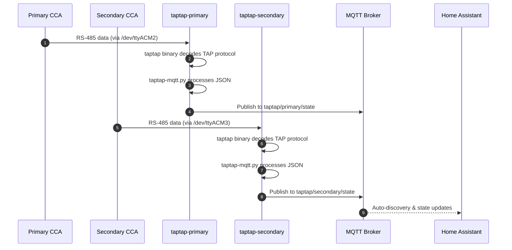

# TapTap-MQTT Docker Setup

A Docker-based deployment for running two instances of taptap-mqtt to collect real-time solar panel data from two Tigo CCA (Cloud Connect Advanced) gateways, publishing to an MQTT broker for Home Assistant integration.

## Motivation

The existing Tigo monitoring system provides data through cloud services, but local real-time access is required for the Solar Panel Viewer application. The taptap-mqtt project enables local data collection by passively listening to the RS-485 communication between Tigo CCAs and their TAP optimizers.

This setup requires:
1. Two separate container instances (one per CCA)
2. Each container mapped to its respective serial port
3. Centralized configuration management
4. Integration with the existing MQTT broker and Home Assistant

## Functional Requirements

### FR-1: Container Architecture

**FR-1.1:** The system SHALL deploy two Docker containers:
- `taptap-primary` - Connected to primary CCA via `/dev/ttyACM2`
- `taptap-secondary` - Connected to secondary CCA via `/dev/ttyACM3`

**FR-1.2:** Each container SHALL include:
- The `taptap` binary (ARM64 Linux build)
- The `taptap-mqtt.py` Python script
- Required Python dependencies (paho-mqtt, python-dateutil, uptime)

**FR-1.3:** The container image SHALL be based on Python 3.11+ with minimal footprint.

**FR-1.4:** Each container SHALL run continuously with automatic restart on failure (`restart: unless-stopped`).

**FR-1.5:** Each container SHALL have access to serial devices by adding the `dialout` group (`group_add: - dialout`) to ensure proper device permissions without requiring privileged mode.

### FR-2: Binary Distribution

**FR-2.1:** The taptap binary SHALL be downloaded from:
```
https://github.com/litinoveweedle/taptap/releases/download/v0.2.6/taptap-Linux-musl-arm64.tar.gz
```

**FR-2.2:** The binary SHALL be extracted and included in the Docker image at build time.

**FR-2.3:** The taptap-mqtt.py script SHALL be downloaded from a pinned commit for reproducible builds:
```
https://github.com/litinoveweedle/taptap-mqtt/archive/bbac4720d50fc2b73f4d4190a0601f9b49ee2990.tar.gz
```

**Note:** The commit SHA `bbac472` (Jan 6, 2026) should be verified against the latest stable release before production deployment. Check for updates at https://github.com/litinoveweedle/taptap-mqtt/releases

### FR-3: Configuration Management

**FR-3.1:** Each instance SHALL have a separate configuration file:
- `config-primary.ini` - Configuration for primary CCA
- `config-secondary.ini` - Configuration for secondary CCA

**FR-3.2:** Configuration files SHALL be mounted as volumes from the host to allow runtime changes without rebuilding.

**FR-3.3:** The configuration file format SHALL follow taptap-mqtt's INI format with these sections:

```ini
[mqtt]
server = 192.168.1.100
port = 1883
user = mqtt_username
pass = mqtt_password
qos = 1
timeout = 30

[taptap]
log_level = INFO
binary = /usr/local/bin/taptap
serial = /dev/ttyUSB0
# Module definitions: STRING:LABEL:SERIAL
# Example: A:01:4-C3F23CR
modules = <module_definitions>
topic_prefix = taptap
topic_name = primary
timeout = 300
update = 60
state_file = /data/taptap.state

[ha]
discovery_prefix = homeassistant
discovery_legacy = false
birth_topic = homeassistant/status
availability_nodes = true
availability_strings = true
availability_stats = true
# Recorder settings control Home Assistant long-term statistics
# See table below for valid values
nodes_sensors_recorder = energy
strings_sensors_recorder = energy_daily
stats_sensors_recorder = energy_daily

[runtime]
max_error = 15
run_file = /run/taptap/taptap.run
```

**Recorder Values Reference:**

| Value | Description | Use Case |
|-------|-------------|----------|
| `energy` | Records cumulative energy values | Long-term energy tracking per panel |
| `energy_daily` | Records daily energy totals | Daily production summaries |
| (empty) | Disables statistics recording | Reduce Home Assistant database size |

**Important:** taptap-mqtt.py spawns the taptap binary as a subprocess using the `binary` and `serial` configuration options. The script does NOT read from stdin—it manages the taptap process internally.

**State file behavior:** If the state file does not exist on first startup, taptap-mqtt creates it automatically. If the file is corrupted, taptap-mqtt will log an error and start fresh with an empty state (optimizer discovery will restart). This is acceptable as state is rebuilt over time. *(Behavior inferred from source code patterns; verify during testing phase.)*

**FR-3.4:** The `serial` setting SHALL be set to `/dev/ttyUSB0` inside the container, with Docker device mapping handling the actual host device.

**FR-3.5:** Each configuration SHALL specify a unique `state_file` path for persistent state storage.

**FR-3.6:** Each configuration SHALL specify a unique `topic_name` to differentiate MQTT topics:
- Primary: `topic_name = primary` → publishes to `taptap/primary/state`
- Secondary: `topic_name = secondary` → publishes to `taptap/secondary/state`

**Note:** The `topic_prefix` and `topic_name` keys have been verified against taptap-mqtt.py source at commit `bbac472`. Topics are constructed as `{topic_prefix}/{topic_name}/state`.

**FR-3.7:** Configuration files SHALL contain actual credential values (not environment variable references) as taptap-mqtt.py does not support variable substitution. Credentials SHALL be protected by:
- Setting file permissions to `600` (owner read/write only)
- Excluding config files from version control via `.gitignore`
- Providing a `config-template.ini` with placeholder values for documentation

### FR-4: Module Definitions

**FR-4.1:** Module definitions SHALL map Tigo-reported labels to serial numbers using the format:
```
STRING:LABEL:SERIAL
```

**FR-4.2:** The primary configuration SHALL include all nodes from the primary CCA: 41 panels across strings A-E, plus 6 panels in string I (I1-I6), totaling **47 panels**.

**FR-4.3:** The secondary configuration SHALL include all nodes from the secondary CCA (22 panels across strings F-H, plus additional G panels).

**FR-4.4:** Module definitions SHALL use the **Tigo-reported labels** (before translation), as taptap-mqtt reports these labels to MQTT. The Solar Panel Viewer backend handles translation to display labels.

### FR-5: MQTT Integration

**FR-5.1:** Both containers SHALL connect to the same MQTT broker.

**FR-5.2:** Each instance SHALL publish to topics with its system identifier:
- Primary: `taptap/primary/state`
- Secondary: `taptap/secondary/state`

**FR-5.3:** Home Assistant auto-discovery SHALL be enabled for both instances.

**FR-5.4:** MQTT credentials SHALL be stored directly in the configuration files (as taptap-mqtt.py does not support environment variable substitution). Configuration files SHALL be protected per FR-3.7.

### FR-6: Docker Compose Configuration

**FR-6.1:** The docker-compose.yml SHALL define both services with appropriate device mappings.

**FR-6.2:** Volume mounts SHALL include:
- Configuration file (read-only): `./config-{system}.ini:/app/config.ini:ro`
- State directory (read-write): `./data/{system}:/data`
- Run directory (read-write): `./run/{system}:/run/taptap`

**FR-6.3:** Device mappings SHALL be:
- Primary: `/dev/ttyACM2:/dev/ttyUSB0`
- Secondary: `/dev/ttyACM3:/dev/ttyUSB0`

**FR-6.4:** Both containers SHALL use the `host` network mode to ensure MQTT broker connectivity, or a custom bridge network with explicit MQTT host configuration.

### FR-7: Health Monitoring

**FR-7.1:** Each container SHALL expose a run file at `/run/taptap/taptap.run` for external health monitoring.

**FR-7.2:** The run file SHALL be updated periodically by taptap-mqtt to indicate the process is alive.

**FR-7.3:** Docker health checks SHALL be configured to verify the run file is being updated:
```yaml
healthcheck:
  test: ["CMD", "sh", "-c", "test -f /run/taptap/taptap.run && find /run/taptap/taptap.run -mmin -2 | grep -q ."]
  interval: 60s
  timeout: 10s
  retries: 3
  start_period: 120s
```

### FR-8: Failure Handling

**FR-8.1:** When the serial port disconnects or becomes unavailable, the taptap binary will exit with an error. The taptap-mqtt.py script SHALL detect this (broken pipe / subprocess exit) and terminate with a **non-zero exit code**, allowing Docker's restart policy to restart the container.

**Clarification:** Exit code 0 = clean shutdown (Docker may not restart). Exit code non-zero = failure (Docker will restart with `unless-stopped` policy).

**FR-8.2:** When the MQTT broker becomes unreachable, taptap-mqtt.py SHALL retry connection with exponential backoff as implemented in its internal reconnection logic.

**FR-8.3:** The `restart: unless-stopped` policy SHALL ensure automatic recovery from transient failures. For persistent failures (e.g., hardware disconnection), manual intervention is expected.

**FR-8.4:** If the serial device does not exist at container start (e.g., CCA unplugged), Docker SHALL fail to start the container with a device mapping error. The operator SHOULD verify device presence before running `docker compose up`:
```bash
# Verify devices exist before starting
ls -la /dev/ttyACM2 /dev/ttyACM3
```

**FR-8.5:** When MQTT authentication fails (wrong username/password), taptap-mqtt.py behavior depends on paho-mqtt's implementation. The operator SHOULD monitor logs for authentication errors (`CONNACK` with non-zero return code). Authentication failures typically result in repeated connection attempts—if credentials are known to be wrong, stop the container and fix the configuration rather than allowing infinite retries.

## Non-Functional Requirements

**NFR-1:** Container startup SHALL complete within 30 seconds of `docker-compose up`.

**NFR-2:** Memory usage per container SHALL not exceed 256MB under normal operation. This is enforced via `mem_limit: 256m` in docker-compose.yml.

**NFR-3:** The setup SHALL support ARM64 architecture (for Raspberry Pi or similar SBC deployment).

**NFR-4:** Configuration changes SHALL take effect after container restart without rebuilding the image.

**NFR-5:** All sensitive credentials (MQTT password) SHALL be stored in configuration files with restricted permissions (`chmod 600`), not committed to version control.

## High Level Design



### Architecture Overview

```
┌─────────────────────────────────────────────────────────────────────┐
│                         Host System                                  │
├─────────────────────────────────────────────────────────────────────┤
│                                                                      │
│  /dev/ttyACM2 ──────┐          /dev/ttyACM3 ──────┐                │
│  (Primary CCA)      │          (Secondary CCA)     │                │
│                     ▼                              ▼                │
│  ┌──────────────────────────┐  ┌──────────────────────────┐        │
│  │   taptap-primary         │  │   taptap-secondary       │        │
│  │   Container              │  │   Container              │        │
│  │                          │  │                          │        │
│  │  ┌─────────────────┐     │  │  ┌─────────────────┐     │        │
│  │  │ taptap binary   │     │  │  │ taptap binary   │     │        │
│  │  │ (observe mode)  │     │  │  │ (observe mode)  │     │        │
│  │  └────────┬────────┘     │  │  └────────┬────────┘     │        │
│  │           │ JSON stdout  │  │           │ JSON stdout  │        │
│  │           ▼              │  │           ▼              │        │
│  │  ┌─────────────────┐     │  │  ┌─────────────────┐     │        │
│  │  │ taptap-mqtt.py  │     │  │  │ taptap-mqtt.py  │     │        │
│  │  └────────┬────────┘     │  │  └────────┬────────┘     │        │
│  │           │              │  │           │              │        │
│  └───────────┼──────────────┘  └───────────┼──────────────┘        │
│              │                             │                        │
│              └──────────┬──────────────────┘                        │
│                         │ MQTT                                      │
│                         ▼                                           │
│              ┌──────────────────────┐                               │
│              │   MQTT Broker        │                               │
│              │   (192.168.x.x)      │                               │
│              └──────────────────────┘                               │
│                                                                      │
└─────────────────────────────────────────────────────────────────────┘
```

### Directory Structure

```
tigo_docker/
├── docker-compose.yml
├── Dockerfile
├── .gitignore                # Excludes config-*.ini, data/, run/
├── config-template.ini       # Template with placeholder values (committed)
├── config-primary.ini        # Primary CCA configuration (gitignored, chmod 600)
├── config-secondary.ini      # Secondary CCA configuration (gitignored, chmod 600)
├── data/
│   ├── primary/              # State files for primary
│   └── secondary/            # State files for secondary
└── run/
    ├── primary/              # Run files for primary
    └── secondary/            # Run files for secondary
```

### Dockerfile Design

```dockerfile
FROM python:3.11-slim-bookworm

# Install dependencies
RUN apt-get update && apt-get install -y --no-install-recommends \
    curl \
    tar \
    && rm -rf /var/lib/apt/lists/*

# Download and extract taptap binary (pinned version)
# NOTE: This downloads ARM64 binary. Image MUST be built on ARM64 host
# or using: docker buildx build --platform linux/arm64 .
ARG TAPTAP_VERSION=v0.2.6
RUN curl -L "https://github.com/litinoveweedle/taptap/releases/download/${TAPTAP_VERSION}/taptap-Linux-musl-arm64.tar.gz" \
    | tar -xz -C /usr/local/bin/ \
    && chmod +x /usr/local/bin/taptap

# Download taptap-mqtt from pinned commit for reproducibility
ARG TAPTAP_MQTT_COMMIT=bbac4720d50fc2b73f4d4190a0601f9b49ee2990
WORKDIR /app
RUN curl -L "https://github.com/litinoveweedle/taptap-mqtt/archive/${TAPTAP_MQTT_COMMIT}.tar.gz" \
    | tar -xz --strip-components=1

# requirements.txt verified to exist at pinned commit bbac472
# Contains: paho-mqtt==1.6.1, python-dateutil==2.8.1, uptime==3.0.1
RUN pip install --no-cache-dir -r requirements.txt

# Create directories for state and run files
RUN mkdir -p /data /run/taptap

# Set unbuffered output for real-time logging
ENV PYTHONUNBUFFERED=1

# taptap-mqtt.py spawns taptap internally using BINARY config option
# Config file is mounted at /app/config.ini
ENTRYPOINT ["python3", "taptap-mqtt.py", "config.ini"]
```

**Note on architecture:** The `taptap-mqtt.py` script spawns the `taptap` binary as a subprocess, reading from its stdout internally. The config file specifies `BINARY = /usr/local/bin/taptap` and `SERIAL = /dev/ttyUSB0` to configure this subprocess.

### Docker Compose Configuration

```yaml
# Note: 'version' key is deprecated in Docker Compose v2+ but included for
# backward compatibility with older Docker Compose versions
version: '3.8'

services:
  taptap-primary:
    build: .
    container_name: taptap-primary
    restart: unless-stopped
    network_mode: host
    mem_limit: 256m
    group_add:
      - dialout
    devices:
      - /dev/ttyACM2:/dev/ttyUSB0
    volumes:
      - ./config-primary.ini:/app/config.ini:ro
      - ./data/primary:/data
      - ./run/primary:/run/taptap
    logging:
      driver: json-file
      options:
        max-size: "10m"
        max-file: "3"
    healthcheck:
      test: ["CMD", "sh", "-c", "test -f /run/taptap/taptap.run && find /run/taptap/taptap.run -mmin -2 | grep -q ."]
      interval: 60s
      timeout: 10s
      retries: 3
      start_period: 120s

  taptap-secondary:
    build: .
    container_name: taptap-secondary
    restart: unless-stopped
    network_mode: host
    mem_limit: 256m
    group_add:
      - dialout
    devices:
      - /dev/ttyACM3:/dev/ttyUSB0
    volumes:
      - ./config-secondary.ini:/app/config.ini:ro
      - ./data/secondary:/data
      - ./run/secondary:/run/taptap
    logging:
      driver: json-file
      options:
        max-size: "10m"
        max-file: "3"
    healthcheck:
      test: ["CMD", "sh", "-c", "test -f /run/taptap/taptap.run && find /run/taptap/taptap.run -mmin -2 | grep -q ."]
      interval: 60s
      timeout: 10s
      retries: 3
      start_period: 120s
```

**Note:** `network_mode: host` is used to ensure the MQTT broker (on the local network) is directly reachable. The `group_add: dialout` ensures the container process can access serial devices without requiring `privileged: true`.

### Configuration File Structure

The module definitions follow the pattern `STRING:LABEL:SERIAL` where:
- `STRING` is the string identifier (A-I)
- `LABEL` is the two-digit position within the string (01-11)
- `SERIAL` is the Tigo optimizer barcode/serial number

Example for primary CCA (partial):
```ini
[taptap]
# Modules are comma-separated (verified against taptap-mqtt.py source)
# Format: STRING:LABEL:SERIAL,STRING:LABEL:SERIAL,...
modules = A:01:4-C3F23CR,A:02:4-C3F2ACK,A:03:4-C3F282R,...
```

**Note:** The `modules` value is parsed using `split(",")` in taptap-mqtt.py. Multi-line continuation with indentation is NOT supported—all modules must be on a single comma-separated line.

## Task Breakdown

### Phase 1: Project Setup
1. Create `tigo_docker/` directory structure:
   ```bash
   mkdir -p tigo_docker/{data/{primary,secondary},run/{primary,secondary}}
   ```
2. Create `config-template.ini` with placeholder values
3. Create `.gitignore` to exclude `config-*.ini`, `data/`, and `run/` directories

### Phase 2: Docker Configuration
4. Write Dockerfile with taptap binary download and pinned taptap-mqtt commit
5. Write docker-compose.yml with both services, health checks, and network configuration
6. Test Docker build on target architecture (ARM64)

### Phase 3: Configuration Files
7. Create config-primary.ini with all primary CCA modules (copy from template, add credentials)
8. Create config-secondary.ini with all secondary CCA modules
9. Populate module definitions from imports/primary.json and imports/secondary.json
10. Set file permissions: `chmod 600 config-*.ini`
11. Ensure data directories are writable (Docker may create as root):
    ```bash
    chmod 755 data/primary data/secondary run/primary run/secondary
    ```
12. (Optional) Validate INI syntax before starting containers:
    ```bash
    python3 -c "import configparser; c = configparser.ConfigParser(); c.read('config-primary.ini'); print('Primary config OK')"
    python3 -c "import configparser; c = configparser.ConfigParser(); c.read('config-secondary.ini'); print('Secondary config OK')"
    ```

### Phase 4: Functional Testing
13. Build Docker images
14. Test primary container with `/dev/ttyACM2`
15. Test secondary container with `/dev/ttyACM3`
16. Verify MQTT messages appear on broker with correct topic paths (`taptap/primary/state`, `taptap/secondary/state`)
17. Verify Home Assistant auto-discovery creates entities

### Phase 5: Failure Scenario Testing
18. Test serial port disconnection:
    - **Safe method:** `sudo chmod 000 /dev/ttyACM2` (simulate permission loss)
    - **Alternative:** USB unbind (find path first: `ls -la /sys/class/tty/ttyACM2`, then `echo '<device-id>' > /sys/bus/usb/drivers/cdc_acm/unbind`)
    - **Expected behavior:** Container exits within ~60s, restarts automatically
    - **Recovery:** `sudo chmod 666 /dev/ttyACM2` or replug USB
19. Test MQTT broker unavailability: Stop broker for 5+ minutes, then restart broker and verify reconnection occurs (may take 30-60 seconds based on retry backoff)
20. Test container restart: `docker restart taptap-primary`, verify data flow resumes
21. Verify both containers don't conflict on MQTT topics (unique topic_name)

### Phase 6: Performance Testing
22. Monitor memory usage over 24 hours: Verify stays under 256MB (NFR-2)
23. Verify health check detects stale containers (stop taptap-mqtt, check health status)

### Phase 7: Integration
24. Capture and document MQTT message format:
    - Subscribe to `taptap/+/state` and capture sample messages
    - Document JSON structure (expected fields: per-panel watts, voltage, online status, serial)
    - Verify field names match Solar Panel Viewer WebSocket format
25. Confirm Solar Panel Viewer can subscribe to both topic paths
26. Validate panel data mapping between taptap output and viewer
27. Document any translation adjustments needed

## Context / Documentation

### Project Files
- `/path/to/solar_tigo_viewer/docs/imports/primary.json` - Primary CCA node inventory
- `/path/to/solar_tigo_viewer/docs/imports/secondary.json` - Secondary CCA node inventory
- `/path/to/solar_tigo_viewer/docs/imports/translations.md` - Label translation mappings
- `/path/to/solar_tigo_viewer/docs/specs/2026-01-17-solar-panel-viewer.md` - Related viewer spec

### External References
- [taptap Repository](https://github.com/litinoveweedle/taptap) - TAP protocol decoder binary
- [taptap-mqtt Repository](https://github.com/litinoveweedle/taptap-mqtt) - MQTT publisher script
- [taptap Releases](https://github.com/litinoveweedle/taptap/releases) - Binary downloads

### Hardware Configuration
| System | Serial Port | CCA Role | Panel Count |
|--------|-------------|----------|-------------|
| Primary | /dev/ttyACM2 | Main array | 47 panels |
| Secondary | /dev/ttyACM3 | Extension | 22 panels |

**Stable Device Naming (Recommended):** USB serial devices can swap names after reboot. For production reliability, create udev rules to assign stable symlinks:

```bash
# /etc/udev/rules.d/99-tigo-cca.rules
# Find serial numbers: udevadm info -a -n /dev/ttyACM2 | grep serial
SUBSYSTEM=="tty", ATTRS{serial}=="<PRIMARY_CCA_SERIAL>", SYMLINK+="tigo-primary"
SUBSYSTEM=="tty", ATTRS{serial}=="<SECONDARY_CCA_SERIAL>", SYMLINK+="tigo-secondary"
```

After creating or modifying the rules file, reload udev:
```bash
sudo udevadm control --reload-rules
sudo udevadm trigger
```

Then update docker-compose.yml to use `/dev/tigo-primary` and `/dev/tigo-secondary` instead of `/dev/ttyACM2` and `/dev/ttyACM3`.

### Operations & Troubleshooting

**View container logs:**
```bash
docker logs taptap-primary -f        # Follow primary container logs
docker logs taptap-secondary -f      # Follow secondary container logs
docker logs taptap-primary --tail 100 # Last 100 lines
```

**Check container health:**
```bash
docker ps                            # Shows health status
docker inspect taptap-primary --format='{{.State.Health.Status}}'
```

**Restart containers (preserves state):**
```bash
docker restart taptap-primary
docker compose restart               # Restart all
```

**Debug configuration issues:**
```bash
docker exec -it taptap-primary cat /app/config.ini  # View mounted config
docker exec -it taptap-primary ls -la /data/        # Check state files
docker exec -it taptap-primary ls -la /dev/ttyUSB0  # Verify device access
```

**Force rebuild after Dockerfile changes:**
```bash
docker compose build --no-cache
docker compose up -d
```

---

**Specification Version:** 1.6
**Last Updated:** January 2026
**Authors:** Claude (AI Assistant)

## Changelog

### v1.6 (January 2026)
**Summary:** Final review - added optional config validation step

**Changes:**
- Added optional step 12 in Phase 3 to validate INI syntax before starting containers
- Renumbered task breakdown steps 13-27 to accommodate new optional step
- Review confirmed FR-8 failure handling, task numbering, udev docs, and permissions are all complete

### v1.5 (January 2026)
**Summary:** Additional failure handling and operational completeness

**Changes:**
- Added FR-8.5: MQTT authentication failure behavior and monitoring guidance
- Added udev reload commands (`udevadm control --reload-rules && udevadm trigger`)
- Added directory permission step (step 11) to ensure data/run directories are writable
- Renumbered task breakdown steps 12-26 to accommodate new step

### v1.4 (January 2026)
**Summary:** Production hardening - resource limits, logging, device stability

**Changes:**
- **BREAKING:** Fixed modules syntax - must be comma-separated on single line (verified against taptap-mqtt.py source using `split(",")`)
- Added FR-8.4: Serial device unavailability at startup behavior and verification command
- Added `mem_limit: 256m` to docker-compose.yml to enforce NFR-2
- Added log rotation configuration (`max-size: 10m`, `max-file: 3`) to prevent disk exhaustion
- Added explicit directory creation command in Phase 1 task breakdown
- Added MQTT message format verification step in Phase 7 (capture and document JSON structure)
- Added udev rules documentation for stable device naming (production reliability)
- Updated task numbering in Phase 7 (now 22-25)

### v1.3 (January 2026)
**Summary:** Final polish - consistency fixes and documentation improvements

**Changes:**
- Fixed config section header `[TAPTAP]` to lowercase `[taptap]` in Configuration File Structure example
- Updated `docker-compose` to modern `docker compose` command syntax throughout Operations section
- Added USB device path discovery instructions for unbind testing method
- Added recorder values reference table documenting `energy`, `energy_daily`, and empty options
- Added verification note to state file behavior (verify during testing)
- Added timing details to MQTT broker unavailability test (5+ min outage, 30-60s reconnect)

### v1.2 (January 2026)
**Summary:** Polish config format, add operational guidance

**Changes:**
- Changed config keys to lowercase for consistency with actual taptap-mqtt format
- Fixed recorder key names: `nodes_sensors_recorder`, `strings_sensors_recorder`, `stats_sensors_recorder`
- Added comments explaining empty recorder values (statistics disabled)
- Added ARM64 build requirement comment in Dockerfile
- Added verification note for requirements.txt existence
- Tightened health check threshold from 5 minutes to 2 minutes (matches 60s update interval)
- Added Docker Compose version deprecation note
- Clarified exit code behavior in FR-8.1 (non-zero for restart)
- Documented state file behavior (auto-create, corruption recovery)
- Added verification note for topic_prefix/topic_name keys
- Added safer serial disconnect testing methods
- Added Operations & Troubleshooting section with common commands

### v1.1 (January 2026)
**Summary:** Address review comments - fix architecture, add failure handling

**Changes:**
- **BREAKING:** Corrected entrypoint - taptap-mqtt.py spawns taptap as subprocess (not piped)
- Added FR-1.5: Serial device permissions via `group_add: dialout`
- Added FR-3.6: TOPIC_NAME configuration for unique MQTT topics
- Added FR-3.7: Credential protection requirements (no env var support)
- Added FR-8: Failure handling requirements (serial disconnect, MQTT unavailable)
- Updated FR-5.4: Removed .env file approach (not supported by taptap-mqtt)
- Updated FR-7.3: Changed health check from MAY to SHALL with example
- Pinned taptap-mqtt to commit `bbac472` for reproducible builds
- Added `network_mode: host` and health checks to docker-compose.yml
- Added PYTHONUNBUFFERED=1 for real-time logging
- Clarified panel count: 41 + 6 = 47 panels in primary system
- Expanded testing phases with failure scenarios and performance tests

**Rationale:** Review identified that taptap-mqtt.py manages the taptap subprocess internally, not via stdin pipe. This required architectural corrections to Dockerfile and configuration.

### v1.0 (January 2026)
**Summary:** Initial specification

**Changes:**
- Initial specification created
- Defined dual-container Docker architecture
- Specified taptap binary integration approach
- Documented configuration file structure with module mappings
- Included MQTT integration with Home Assistant discovery
