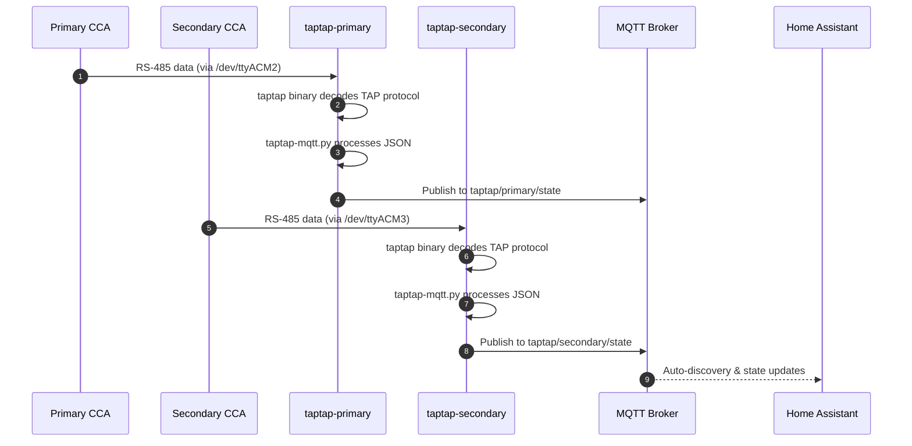

# TapTap-MQTT Docker Setup

A Docker-based deployment for running two instances of taptap-mqtt to collect real-time solar panel data from two Tigo CCA (Cloud Connect Advanced) gateways, publishing to an MQTT broker for Home Assistant integration.

## Motivation

The existing Tigo monitoring system provides data through cloud services, but local real-time access is required for the Solar Panel Viewer application. The taptap-mqtt project enables local data collection by passively listening to the RS-485 communication between Tigo CCAs and their TAP optimizers.

This setup requires:
1. Two separate container instances (one per CCA)
2. Each container mapped to its respective serial port
3. Centralized configuration management
4. Integration with the existing MQTT broker and Home Assistant

## Functional Requirements

### FR-1: Container Architecture

**FR-1.1:** The system SHALL deploy two Docker containers:
- `taptap-primary` - Connected to primary CCA via `/dev/ttyACM2`
- `taptap-secondary` - Connected to secondary CCA via `/dev/ttyACM3`

**FR-1.2:** Each container SHALL include:
- The `taptap` binary (ARM64 Linux build)
- The `taptap-mqtt.py` Python script
- Required Python dependencies (paho-mqtt, python-dateutil, uptime)

**FR-1.3:** The container image SHALL be based on Python 3.11+ with minimal footprint.

**FR-1.4:** Each container SHALL run continuously with automatic restart on failure (`restart: unless-stopped`).

### FR-2: Binary Distribution

**FR-2.1:** The taptap binary SHALL be downloaded from:
```
https://github.com/litinoveweedle/taptap/releases/download/v0.2.6/taptap-Linux-musl-arm64.tar.gz
```

**FR-2.2:** The binary SHALL be extracted and included in the Docker image at build time.

**FR-2.3:** The taptap-mqtt.py script SHALL be cloned from the repository:
```
https://github.com/litinoveweedle/taptap-mqtt
```

### FR-3: Configuration Management

**FR-3.1:** Each instance SHALL have a separate configuration file:
- `config-primary.ini` - Configuration for primary CCA
- `config-secondary.ini` - Configuration for secondary CCA

**FR-3.2:** Configuration files SHALL be mounted as volumes from the host to allow runtime changes without rebuilding.

**FR-3.3:** The configuration file format SHALL follow taptap-mqtt's INI format with these sections:

```ini
[MQTT]
server = <broker_host>
port = 1883
user = <username>
password = <password>
qos = 1

[TAPTAP]
# Module definitions: STRING:NAME:SERIAL
# Example: A:01:4-C3F23CR
modules = <module_definitions>
connection = serial
serial_port = /dev/ttyUSB0
state_file = /data/taptap.state

[HA]
discovery = true
legacy = false
availability_node = true
availability_string = true
availability_stat = true
statistics = true

[RUNTIME]
errors = 15
run_file = /run/taptap/taptap.run
```

**FR-3.4:** The `serial_port` setting SHALL be set to `/dev/ttyUSB0` inside the container, with Docker device mapping handling the actual host device.

**FR-3.5:** Each configuration SHALL specify a unique `state_file` path for persistent state storage.

### FR-4: Module Definitions

**FR-4.1:** Module definitions SHALL map Tigo-reported labels to serial numbers using the format:
```
STRING:LABEL:SERIAL
```

**FR-4.2:** The primary configuration SHALL include all nodes from the primary CCA (41 panels across strings A-E, plus I1-I6).

**FR-4.3:** The secondary configuration SHALL include all nodes from the secondary CCA (22 panels across strings F-H, plus additional G panels).

**FR-4.4:** Module definitions SHALL use the **Tigo-reported labels** (before translation), as taptap-mqtt reports these labels to MQTT. The Solar Panel Viewer backend handles translation to display labels.

### FR-5: MQTT Integration

**FR-5.1:** Both containers SHALL connect to the same MQTT broker.

**FR-5.2:** Each instance SHALL publish to topics with its system identifier:
- Primary: `taptap/primary/state`
- Secondary: `taptap/secondary/state`

**FR-5.3:** Home Assistant auto-discovery SHALL be enabled for both instances.

**FR-5.4:** MQTT credentials SHALL be stored in an environment file (`.env`) to avoid hardcoding in configuration files.

### FR-6: Docker Compose Configuration

**FR-6.1:** The docker-compose.yml SHALL define both services with appropriate device mappings.

**FR-6.2:** Volume mounts SHALL include:
- Configuration file (read-only): `./config-{system}.ini:/app/config.ini:ro`
- State directory (read-write): `./data/{system}:/data`
- Run directory (read-write): `./run/{system}:/run/taptap`

**FR-6.3:** Device mappings SHALL be:
- Primary: `/dev/ttyACM2:/dev/ttyUSB0`
- Secondary: `/dev/ttyACM3:/dev/ttyUSB0`

**FR-6.4:** Both containers SHALL use the `host` network mode to ensure MQTT broker connectivity, or a custom bridge network with explicit MQTT host configuration.

### FR-7: Health Monitoring

**FR-7.1:** Each container SHALL expose a run file at `/run/taptap/taptap.run` for external health monitoring.

**FR-7.2:** The run file SHALL be updated periodically by taptap-mqtt to indicate the process is alive.

**FR-7.3:** Docker health checks MAY be configured to verify the run file is being updated.

## Non-Functional Requirements

**NFR-1:** Container startup SHALL complete within 30 seconds of `docker-compose up`.

**NFR-2:** Memory usage per container SHALL not exceed 256MB under normal operation.

**NFR-3:** The setup SHALL support ARM64 architecture (for Raspberry Pi or similar SBC deployment).

**NFR-4:** Configuration changes SHALL take effect after container restart without rebuilding the image.

**NFR-5:** All sensitive credentials (MQTT password) SHALL be stored in environment variables, not committed to version control.

## High Level Design



### Architecture Overview

```
┌─────────────────────────────────────────────────────────────────────┐
│                         Host System                                  │
├─────────────────────────────────────────────────────────────────────┤
│                                                                      │
│  /dev/ttyACM2 ──────┐          /dev/ttyACM3 ──────┐                │
│  (Primary CCA)      │          (Secondary CCA)     │                │
│                     ▼                              ▼                │
│  ┌──────────────────────────┐  ┌──────────────────────────┐        │
│  │   taptap-primary         │  │   taptap-secondary       │        │
│  │   Container              │  │   Container              │        │
│  │                          │  │                          │        │
│  │  ┌─────────────────┐     │  │  ┌─────────────────┐     │        │
│  │  │ taptap binary   │     │  │  │ taptap binary   │     │        │
│  │  │ (observe mode)  │     │  │  │ (observe mode)  │     │        │
│  │  └────────┬────────┘     │  │  └────────┬────────┘     │        │
│  │           │ JSON stdout  │  │           │ JSON stdout  │        │
│  │           ▼              │  │           ▼              │        │
│  │  ┌─────────────────┐     │  │  ┌─────────────────┐     │        │
│  │  │ taptap-mqtt.py  │     │  │  │ taptap-mqtt.py  │     │        │
│  │  └────────┬────────┘     │  │  └────────┬────────┘     │        │
│  │           │              │  │           │              │        │
│  └───────────┼──────────────┘  └───────────┼──────────────┘        │
│              │                             │                        │
│              └──────────┬──────────────────┘                        │
│                         │ MQTT                                      │
│                         ▼                                           │
│              ┌──────────────────────┐                               │
│              │   MQTT Broker        │                               │
│              │   (192.168.x.x)      │                               │
│              └──────────────────────┘                               │
│                                                                      │
└─────────────────────────────────────────────────────────────────────┘
```

### Directory Structure

```
tigo_docker/
├── docker-compose.yml
├── Dockerfile
├── .env                      # MQTT credentials (gitignored)
├── .env.example              # Template for .env
├── config-primary.ini        # Primary CCA configuration
├── config-secondary.ini      # Secondary CCA configuration
├── data/
│   ├── primary/              # State files for primary
│   └── secondary/            # State files for secondary
└── run/
    ├── primary/              # Run files for primary
    └── secondary/            # Run files for secondary
```

### Dockerfile Design

```dockerfile
FROM python:3.11-slim-bookworm

# Install dependencies
RUN apt-get update && apt-get install -y --no-install-recommends \
    curl \
    tar \
    && rm -rf /var/lib/apt/lists/*

# Download and extract taptap binary
ARG TAPTAP_VERSION=v0.2.6
RUN curl -L "https://github.com/litinoveweedle/taptap/releases/download/${TAPTAP_VERSION}/taptap-Linux-musl-arm64.tar.gz" \
    | tar -xz -C /usr/local/bin/ \
    && chmod +x /usr/local/bin/taptap

# Clone taptap-mqtt and install dependencies
WORKDIR /app
RUN curl -L "https://github.com/litinoveweedle/taptap-mqtt/archive/refs/heads/main.tar.gz" \
    | tar -xz --strip-components=1

RUN pip install --no-cache-dir -r requirements.txt

# Create directories for state and run files
RUN mkdir -p /data /run/taptap

# Entry point runs taptap piped to taptap-mqtt.py
ENTRYPOINT ["sh", "-c", "taptap observe --serial /dev/ttyUSB0 --state-file /data/taptap-infra.state | python3 taptap-mqtt.py"]
```

### Docker Compose Configuration

```yaml
version: '3.8'

services:
  taptap-primary:
    build: .
    container_name: taptap-primary
    restart: unless-stopped
    devices:
      - /dev/ttyACM2:/dev/ttyUSB0
    volumes:
      - ./config-primary.ini:/app/config.ini:ro
      - ./data/primary:/data
      - ./run/primary:/run/taptap
    environment:
      - MQTT_SERVER=${MQTT_SERVER}
      - MQTT_USER=${MQTT_USER}
      - MQTT_PASSWORD=${MQTT_PASSWORD}

  taptap-secondary:
    build: .
    container_name: taptap-secondary
    restart: unless-stopped
    devices:
      - /dev/ttyACM3:/dev/ttyUSB0
    volumes:
      - ./config-secondary.ini:/app/config.ini:ro
      - ./data/secondary:/data
      - ./run/secondary:/run/taptap
    environment:
      - MQTT_SERVER=${MQTT_SERVER}
      - MQTT_USER=${MQTT_USER}
      - MQTT_PASSWORD=${MQTT_PASSWORD}
```

### Configuration File Structure

The module definitions follow the pattern `STRING:LABEL:SERIAL` where:
- `STRING` is the string identifier (A-I)
- `LABEL` is the two-digit position within the string (01-11)
- `SERIAL` is the Tigo optimizer barcode/serial number

Example for primary CCA (partial):
```ini
[TAPTAP]
modules = A:01:4-C3F23CR
          A:02:4-C3F2ACK
          A:03:4-C3F282R
          ...
```

## Task Breakdown

### Phase 1: Project Setup
1. Create `tigo_docker/` directory structure
2. Create `.env.example` template file
3. Create `.gitignore` to exclude `.env` and data directories

### Phase 2: Docker Configuration
4. Write Dockerfile with taptap binary download
5. Write docker-compose.yml with both services
6. Test Docker build on target architecture

### Phase 3: Configuration Files
7. Create config-primary.ini with all primary CCA modules
8. Create config-secondary.ini with all secondary CCA modules
9. Populate module definitions from imports/primary.json and imports/secondary.json

### Phase 4: Testing
10. Build Docker images
11. Test primary container with `/dev/ttyACM2`
12. Test secondary container with `/dev/ttyACM3`
13. Verify MQTT messages appear on broker
14. Verify Home Assistant auto-discovery

### Phase 5: Integration
15. Confirm Solar Panel Viewer can subscribe to both topic paths
16. Validate panel data mapping between taptap output and viewer
17. Document any translation adjustments needed

## Context / Documentation

### Project Files
- `/path/to/solar_tigo_viewer/docs/imports/primary.json` - Primary CCA node inventory
- `/path/to/solar_tigo_viewer/docs/imports/secondary.json` - Secondary CCA node inventory
- `/path/to/solar_tigo_viewer/docs/imports/translations.md` - Label translation mappings
- `/path/to/solar_tigo_viewer/docs/specs/2026-01-17-solar-panel-viewer.md` - Related viewer spec

### External References
- [taptap Repository](https://github.com/litinoveweedle/taptap) - TAP protocol decoder binary
- [taptap-mqtt Repository](https://github.com/litinoveweedle/taptap-mqtt) - MQTT publisher script
- [taptap Releases](https://github.com/litinoveweedle/taptap/releases) - Binary downloads

### Hardware Configuration
| System | Serial Port | CCA Role | Panel Count |
|--------|-------------|----------|-------------|
| Primary | /dev/ttyACM2 | Main array | 47 panels |
| Secondary | /dev/ttyACM3 | Extension | 22 panels |

---

**Specification Version:** 1.0
**Last Updated:** January 2026
**Authors:** Claude (AI Assistant)

## Changelog

### v1.0 (January 2026)
**Summary:** Initial specification

**Changes:**
- Initial specification created
- Defined dual-container Docker architecture
- Specified taptap binary integration approach
- Documented configuration file structure with module mappings
- Included MQTT integration with Home Assistant discovery
