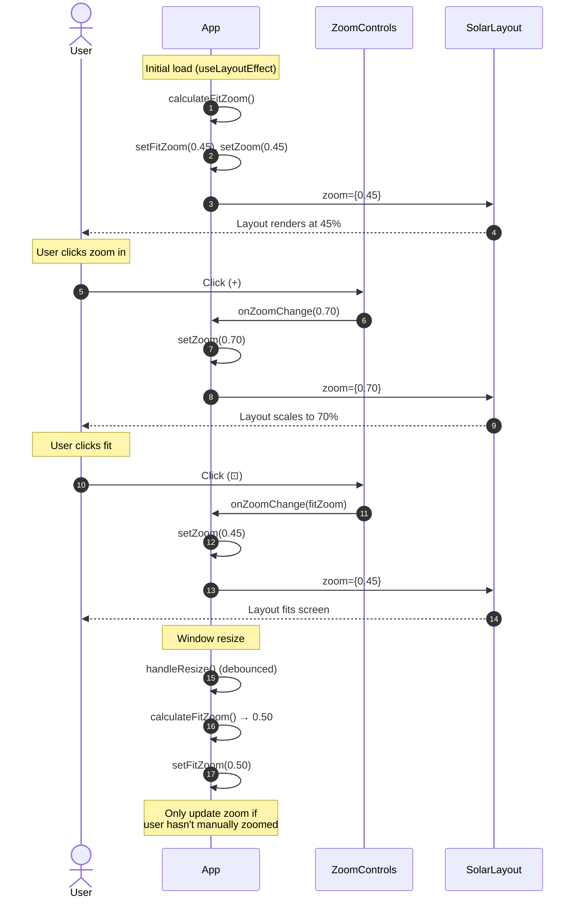

# Zoom Controls for Layout View

Add zoom in/out functionality to the solar panel layout view with fixed-position control buttons, enabling users to view the entire layout on screen or zoom in for detail.

## Motivation

The current layout view renders the 1526x2131 pixel image at its native resolution, requiring scrolling on most devices. Users need the ability to:
- Zoom out to see the entire solar array layout at once
- Zoom in to see detailed panel information
- Quickly fit the layout to their screen size

## Functional Requirements

### Scope

**In scope for v1.0:**
- Button-based zoom controls (+, −, fit)
- Keyboard accessibility (Tab navigation, Enter/Space activation)
- Mouse wheel zoom (Ctrl+scroll on desktop)
- Pinch-to-zoom gestures on touch devices

**Out of scope for v1.0 (may be added in future versions):**
- Keyboard shortcuts (Ctrl+Plus/Minus, Cmd+Plus/Minus)
- Double-tap to zoom on mobile

### FR-1: Zoom Control Buttons

**FR-1.1:** A zoom control component SHALL be displayed as a fixed-position panel in the bottom-right corner of the viewport.

**FR-1.2:** The zoom control component SHALL contain three buttons stacked vertically:
- Zoom in (+)
- Fit to screen (⊡)
- Zoom out (−)

**FR-1.3:** The zoom control component SHALL only be visible when the Layout tab is active.

**FR-1.4:** The zoom control component SHALL have a semi-transparent background (#333333 at 80% opacity) with rounded corners.

**FR-1.5:** The zoom control component SHALL be positioned 16px from the right edge and 16px from the bottom edge of the viewport.

**FR-1.6:** On mobile devices (viewport width ≤ 767px), the zoom controls SHALL be positioned above the bottom tab navigation bar:
- Bottom offset: `TAB_HEIGHT_MOBILE + 16px + env(safe-area-inset-bottom)` = 72px minimum
- Right offset: `16px + env(safe-area-inset-right)`
- The mobile breakpoint matches the existing `useMediaQuery('(max-width: 767px)')` check

**Safe area implementation note:** React inline styles don't support `env()` CSS function. Use a CSS class or CSS-in-JS solution:
```css
/* ZoomControls.css */
.zoom-controls {
  position: fixed;
  right: calc(16px + env(safe-area-inset-right, 0px));
}

.zoom-controls--mobile {
  bottom: calc(72px + env(safe-area-inset-bottom, 0px));
}

.zoom-controls--desktop {
  bottom: 16px;
}
```

**FR-1.7:** On device rotation (landscape ↔ portrait), the fit zoom SHALL be recalculated and the zoom controls repositioned appropriately.

**FR-1.8:** Button touch targets SHALL be 44x44px minimum (outer clickable area including padding), with visible button size of 36x36px and 4px padding.

### FR-2: Zoom Behavior

**FR-2.1:** The zoom range SHALL be 25% to 200% of the native image size.

**FR-2.2:** Each click of the zoom in (+) button SHALL increase zoom by 25 percentage points (e.g., 50% → 75%).

**FR-2.3:** Each click of the zoom out (−) button SHALL decrease zoom by 25 percentage points (e.g., 75% → 50%).

**FR-2.4:** The zoom in button SHALL be disabled when zoom level reaches 200%.

**FR-2.5:** The zoom out button SHALL be disabled when zoom level reaches 25%.

**FR-2.6:** The current zoom level SHALL be displayed between the zoom in and fit buttons (e.g., "75%").

### FR-3: Fit to Screen

**FR-3.1:** Clicking the fit button (⊡) SHALL calculate and apply the zoom level that fits the entire layout within the visible viewport.

**FR-3.2:** The fit calculation SHALL account for the following offsets:
- **Viewport**: `window.innerWidth` and `window.innerHeight`
- **Header**: 50px (sticky header with ModeToggle)
- **Tab navigation**: 48px on desktop (top tabs), 56px on mobile (bottom tab bar)
- **Padding**: 16px on all sides (32px total horizontal, 32px total vertical)
- **Scrollbar**: 17px horizontal on desktop (when content overflows vertically)
- **Safe areas**: On notched devices, use `env(safe-area-inset-bottom)` for bottom offset

**Fit calculation formula:**
```
availableWidth = innerWidth - (2 × VIEWPORT_PADDING) - SCROLLBAR_WIDTH
availableHeight = innerHeight - HEADER_HEIGHT - tabHeight - (2 × VIEWPORT_PADDING)
fitZoom = min(availableWidth / LAYOUT_WIDTH, availableHeight / LAYOUT_HEIGHT)
fitZoom = clamp(fitZoom, MIN_ZOOM, MAX_ZOOM)
```

**FR-3.3:** The fit zoom level SHALL be clamped to the valid range (25% - 200%).

**FR-3.4:** On initial page load, the layout SHALL automatically apply the fit-to-screen zoom level.

### FR-4: Zoom Implementation

**FR-4.1:** Zoom SHALL be implemented using CSS `transform: scale()` on the layout container.

**FR-4.2:** The layout container SHALL use `transform-origin: top left` to ensure consistent positioning.

**FR-4.3:** Panel overlays SHALL continue to use percentage-based positioning, which will scale proportionally with the transform.

**FR-4.4:** The container wrapper SHALL adjust its dimensions to match the scaled content size to enable proper scrolling when zoomed in.

### FR-5: Scroll Position

**FR-5.1:** When zooming in or out via +/− buttons, wheel, or gesture, the scroll position SHALL maintain the center of the current view using the following algorithm:

```typescript
// Define in frontend/src/utils/zoom.ts and import where needed
// import { adjustScrollForZoom } from '../utils/zoom';

function adjustScrollForZoom(
  scrollContainer: HTMLElement,
  oldZoom: number,
  newZoom: number
): void {
  const viewport = {
    width: scrollContainer.clientWidth,
    height: scrollContainer.clientHeight,
  };

  // Calculate center point in content coordinates at old zoom
  const centerX = (scrollContainer.scrollLeft + viewport.width / 2) / oldZoom;
  const centerY = (scrollContainer.scrollTop + viewport.height / 2) / oldZoom;

  // Calculate new scroll position to keep same center point
  const newScrollLeft = (centerX * newZoom) - viewport.width / 2;
  const newScrollTop = (centerY * newZoom) - viewport.height / 2;

  // Apply clamped to valid scroll range
  scrollContainer.scrollLeft = Math.max(0, newScrollLeft);
  scrollContainer.scrollTop = Math.max(0, newScrollTop);
}
```

**FR-5.2:** When using fit-to-screen, scroll position SHALL reset to (0, 0) to show the top-left of the layout.

**FR-5.3:** Scroll adjustment applies to all zoom operations (buttons, wheel, gesture), but NOT to fit-to-screen.

### FR-6: Wheel and Gesture Zoom

**FR-6.1:** Mouse wheel zoom SHALL be enabled when the user holds Ctrl (Windows/Linux) or Cmd (macOS) while scrolling:
- Scroll up (with modifier): zoom in by `ZOOM_STEP` (25%)
- Scroll down (with modifier): zoom out by `ZOOM_STEP` (25%)
- Without modifier: normal scroll behavior (pan the view)

**FR-6.2:** Wheel zoom SHALL respect the same min/max bounds as button zoom (25% - 200%).

**FR-6.3:** Wheel zoom SHALL be debounced to prevent rapid-fire zoom changes:
- Debounce interval: 50ms
- Each debounced event triggers one zoom step

**FR-6.4:** Pinch-to-zoom gesture SHALL be supported on touch devices:
- Pinch outward: zoom in
- Pinch inward: zoom out
- Gesture SHALL use continuous zoom (not stepped) for smooth visual feedback
- On gesture end, zoom SHALL snap to nearest `ZOOM_STEP` increment

**FR-6.5:** Pinch gesture zoom SHALL use the same center-preservation scroll behavior as button zoom (via `adjustScrollForZoom`). Focal-point zoom (zooming toward the pinch center) is deferred to a future version.

**FR-6.6:** The `touch-action` CSS property SHALL be set to `pan-x pan-y` on the scroll container to prevent browser default pinch-zoom while allowing custom gesture handling.

**FR-6.7:** Wheel and gesture zoom SHALL set `hasManuallyZoomed.current = true` to prevent auto-fit on window resize. For pinch gestures, this flag is set only on gesture end (not during continuous zoom).

**Wheel zoom implementation:**

```typescript
// frontend/src/hooks/useWheelZoom.ts

import { useEffect, useRef, useCallback, type RefObject } from 'react';
import {
  ZOOM_STEP, MIN_ZOOM, MAX_ZOOM,
  WHEEL_DELTA_PER_STEP, WHEEL_DEBOUNCE_MS
} from '../constants';

interface UseWheelZoomOptions {
  zoom: number;
  onZoomChange: (newZoom: number, isManualZoom: boolean) => void;
  scrollRef: RefObject<HTMLDivElement>;
}

export function useWheelZoom({ zoom, onZoomChange, scrollRef }: UseWheelZoomOptions) {
  const lastWheelTime = useRef(0);
  const accumulatedDelta = useRef(0);

  const handleWheel = useCallback((e: WheelEvent) => {
    // Only handle zoom when Ctrl (Win/Linux) or Meta (Mac) is held
    // Note: macOS trackpad pinch gestures send Ctrl+wheel events,
    // resulting in stepped zoom. This is acceptable UX for v1.0.
    if (!e.ctrlKey && !e.metaKey) return;

    e.preventDefault(); // Prevent browser zoom

    // Accumulate delta for smoother trackpad experience
    accumulatedDelta.current += e.deltaY;

    const now = Date.now();
    if (now - lastWheelTime.current < WHEEL_DEBOUNCE_MS) return;
    lastWheelTime.current = now;

    // Calculate zoom steps from accumulated delta
    const steps = Math.round(accumulatedDelta.current / WHEEL_DELTA_PER_STEP);

    if (steps === 0) return; // Keep accumulating if no full step yet

    accumulatedDelta.current = 0; // Only reset after successful step calculation

    const direction = steps < 0 ? 1 : -1; // Negative delta = scroll up = zoom in
    const stepCount = Math.abs(steps);
    const newZoom = Math.max(MIN_ZOOM, Math.min(MAX_ZOOM, zoom + direction * stepCount * ZOOM_STEP));

    if (newZoom !== zoom) {
      onZoomChange(newZoom, true); // true = manual zoom
    }
  }, [zoom, onZoomChange]);

  useEffect(() => {
    const container = scrollRef.current;
    if (!container) return;

    // passive: false required to call preventDefault()
    container.addEventListener('wheel', handleWheel, { passive: false });
    return () => container.removeEventListener('wheel', handleWheel);
  }, [handleWheel, scrollRef]);
}
```

**Pinch gesture implementation:**

```typescript
// frontend/src/hooks/usePinchZoom.ts

import { useEffect, useRef, useCallback, type RefObject } from 'react';
import { ZOOM_STEP, MIN_ZOOM, MAX_ZOOM, PINCH_THRESHOLD_PX } from '../constants';

interface UsePinchZoomOptions {
  zoom: number;
  onZoomChange: (newZoom: number, isManualZoom: boolean) => void;
  scrollRef: RefObject<HTMLDivElement>;
}

interface TouchState {
  initialDistance: number;
  initialZoom: number;
}

function getTouchDistance(touches: TouchList): number {
  const dx = touches[0].clientX - touches[1].clientX;
  const dy = touches[0].clientY - touches[1].clientY;
  return Math.sqrt(dx * dx + dy * dy);
}

export function usePinchZoom({ zoom, onZoomChange, scrollRef }: UsePinchZoomOptions) {
  const touchState = useRef<TouchState | null>(null);
  const currentZoom = useRef(zoom);
  const isPinching = useRef(false); // Track if we've started pinching (past threshold)

  // Keep ref in sync with prop
  useEffect(() => {
    currentZoom.current = zoom;
  }, [zoom]);

  const handleTouchStart = useCallback((e: TouchEvent) => {
    if (e.touches.length !== 2) return;

    touchState.current = {
      initialDistance: getTouchDistance(e.touches),
      initialZoom: currentZoom.current,
    };
    isPinching.current = false; // Reset pinch state
  }, []);

  const handleTouchMove = useCallback((e: TouchEvent) => {
    if (e.touches.length !== 2 || !touchState.current) return;

    const currentDistance = getTouchDistance(e.touches);
    const distanceChange = Math.abs(currentDistance - touchState.current.initialDistance);

    // Don't treat as pinch until threshold exceeded (allows two-finger pan)
    if (!isPinching.current && distanceChange < PINCH_THRESHOLD_PX) {
      return; // Let browser handle as pan
    }

    // Once threshold exceeded, we're pinching
    isPinching.current = true;
    e.preventDefault(); // Block browser pinch zoom

    const scale = currentDistance / touchState.current.initialDistance;
    const newZoom = Math.max(MIN_ZOOM, Math.min(MAX_ZOOM,
      touchState.current.initialZoom * scale
    ));

    // Apply continuous zoom during gesture (don't set hasManuallyZoomed yet)
    onZoomChange(newZoom, false);
  }, [onZoomChange]);

  const handleTouchEnd = useCallback((e: TouchEvent) => {
    // Only process when we were actively pinching and dropping from 2 to fewer fingers
    if (!touchState.current || !isPinching.current) {
      touchState.current = null;
      return;
    }

    // Still have 2+ fingers? Not done pinching
    if (e.touches.length >= 2) return;

    // Snap to nearest step on gesture end
    const snappedZoom = Math.round(currentZoom.current / ZOOM_STEP) * ZOOM_STEP;
    const clampedZoom = Math.max(MIN_ZOOM, Math.min(MAX_ZOOM, snappedZoom));

    // Final zoom change with isManualZoom=true to set hasManuallyZoomed
    onZoomChange(clampedZoom, true);

    touchState.current = null;
    isPinching.current = false;
  }, [onZoomChange]);

  useEffect(() => {
    const container = scrollRef.current;
    if (!container) return;

    container.addEventListener('touchstart', handleTouchStart, { passive: true });
    container.addEventListener('touchmove', handleTouchMove, { passive: false });
    container.addEventListener('touchend', handleTouchEnd, { passive: true });
    container.addEventListener('touchcancel', handleTouchEnd, { passive: true });

    return () => {
      container.removeEventListener('touchstart', handleTouchStart);
      container.removeEventListener('touchmove', handleTouchMove);
      container.removeEventListener('touchend', handleTouchEnd);
      container.removeEventListener('touchcancel', handleTouchEnd);
    };
  }, [handleTouchStart, handleTouchMove, handleTouchEnd, scrollRef]);
}
```

**CSS for disabling browser pinch zoom:**

```css
/* Add to SolarLayout.css or scroll container styles */
.scroll-container {
  touch-action: pan-x pan-y;
  /* pan-x pan-y enables: one-finger scroll (pan), two-finger pan
     Disables: browser pinch-zoom, double-tap zoom
     Our custom pinch handler (usePinchZoom) takes over pinch gestures.
     Safari requires this on the scroll container itself, not a parent. */
}
```

## Non-Functional Requirements

**NFR-1.1:** Zoom controls SHALL have touch-friendly button sizes (minimum 44x44px touch targets).

**NFR-1.2:** Zoom transitions SHALL be smooth (CSS transition of 150ms).

**NFR-1.3:** The zoom control panel SHALL minimize obstruction of panel overlays:
- Semi-transparent background (80% opacity) allows partial visibility of content behind
- Compact vertical layout minimizes footprint
- Fixed bottom-right position avoids the center of the layout where most panels are located
- Note: If critical panels exist in the bottom-right corner, users can zoom/pan to view them

**NFR-1.4:** Zoom level SHALL be preserved when switching display modes (watts/voltage/sn).

**NFR-1.5:** Zoom state persistence:
- **Tab switches** (Layout → Table → Layout): Zoom level SHALL be preserved
- **Page reload / browser refresh**: Zoom SHALL reset to fit-to-screen (no persistence)
- **Browser sessions**: No cross-session persistence (no localStorage)

Rationale: Fit-to-screen is the optimal default for most users. Persisting zoom across reloads adds complexity without significant UX benefit for this monitoring dashboard use case.

**NFR-1.6:** Zoom transitions SHALL respect the `prefers-reduced-motion` media query. When reduced motion is preferred, transitions SHALL be instant (0ms) instead of 150ms.

**NFR-1.7:** Zoom controls SHALL be keyboard accessible:
- Focusable via Tab key with visible focus indicator (2px solid outline)
- Activatable via Enter or Space keys
- Focus order: Zoom in → Fit → Zoom out (percentage display is NOT focusable)
- Percentage display uses `aria-live="polite"` to announce changes to screen readers without being in tab order

## Constants

All magic numbers SHALL be defined as named constants in `frontend/src/constants.ts`:

```typescript
// Layout image dimensions (from assets/layout.png)
export const LAYOUT_WIDTH = 1526;
export const LAYOUT_HEIGHT = 2131;

// Zoom configuration
export const MIN_ZOOM = 0.25;  // 25%
export const MAX_ZOOM = 2.0;   // 200%
export const ZOOM_STEP = 0.25; // 25 percentage points

// UI measurements (measured from current implementation)
export const HEADER_HEIGHT = 50;           // Sticky header with ModeToggle
export const TAB_HEIGHT_DESKTOP = 48;      // Desktop tab navigation
export const TAB_HEIGHT_MOBILE = 56;       // Mobile bottom tab bar
export const VIEWPORT_PADDING = 16;        // Padding on all sides
export const SCROLLBAR_WIDTH = 17;         // Standard scrollbar width (Windows/Linux)
// Note: macOS uses overlay scrollbars (0px width) by default. This constant
// may over-compensate on Mac, resulting in slightly conservative fit zoom.
// For pixel-perfect accuracy, detect scrollbar width at runtime:
//
// function getScrollbarWidth(): number {
//   const div = document.createElement('div');
//   div.style.cssText = 'width:100px;height:100px;overflow:scroll;position:absolute;top:-9999px';
//   document.body.appendChild(div);
//   const width = div.offsetWidth - div.clientWidth;
//   document.body.removeChild(div);
//   return width;
// }
//
// For v1.0, we accept the tradeoff of slightly smaller fit zoom on Mac.

// Mobile breakpoint (matches useMediaQuery)
export const MOBILE_BREAKPOINT = 767;

// Wheel zoom input handling
export const WHEEL_DELTA_PER_STEP = 100;  // Pixels of scroll delta per zoom step
export const WHEEL_DEBOUNCE_MS = 50;       // Debounce interval for wheel events

// Pinch gesture handling
export const PINCH_THRESHOLD_PX = 10;  // Min distance change before treating as pinch vs pan
```

## High Level Design



### Component Structure

```
App.tsx
├── ZoomControls (fixed position, only when Layout tab active)
└── SolarLayout (must have explicit height, e.g., flex-grow: 1 or calc())
    └── Scroll container (ref={scrollRef}, overflow: auto, width/height: 100%)
        └── Sizer div (width: LAYOUT_WIDTH * zoom, height: LAYOUT_HEIGHT * zoom)
            └── Transform wrapper (scale transform, native dimensions)
                ├── img (layout.png)
                └── PanelOverlay[] (percentage positioned)
```

**Parent container note:** The scroll container uses `width: 100%` and `height: 100%`, so SolarLayout's root element must have explicit dimensions. This is achieved by App.tsx using flexbox layout where the main content area has `flex-grow: 1` to fill remaining viewport height after header and tabs.

### Zoom State Management

Zoom state will be managed in `App.tsx` and passed to both `ZoomControls` and `SolarLayout`:

```typescript
// App.tsx
import { useState, useLayoutEffect, useCallback, useRef } from 'react';
import { useMediaQuery } from './hooks/useMediaQuery';
import {
  LAYOUT_WIDTH, LAYOUT_HEIGHT, HEADER_HEIGHT, TAB_HEIGHT_DESKTOP,
  TAB_HEIGHT_MOBILE, VIEWPORT_PADDING, SCROLLBAR_WIDTH, MIN_ZOOM,
  MAX_ZOOM, MOBILE_BREAKPOINT
} from './constants';

// Inside App component:
const [zoom, setZoom] = useState<number>(1); // 1 = 100%
const [fitZoom, setFitZoom] = useState<number>(1);
const hasManuallyZoomed = useRef(false); // Track if user has manually changed zoom
const scrollRef = useRef<HTMLDivElement>(null); // Reference to scroll container
const isMobile = useMediaQuery(`(max-width: ${MOBILE_BREAKPOINT}px)`);

const calculateFitZoom = useCallback(() => {
  const tabHeight = isMobile ? TAB_HEIGHT_MOBILE : TAB_HEIGHT_DESKTOP;
  const scrollbarOffset = isMobile ? 0 : SCROLLBAR_WIDTH;

  const availableWidth = window.innerWidth - (2 * VIEWPORT_PADDING) - scrollbarOffset;
  const availableHeight = window.innerHeight - HEADER_HEIGHT - tabHeight - (2 * VIEWPORT_PADDING);

  const scaleX = availableWidth / LAYOUT_WIDTH;
  const scaleY = availableHeight / LAYOUT_HEIGHT;
  const fit = Math.min(scaleX, scaleY);

  return Math.max(MIN_ZOOM, Math.min(MAX_ZOOM, fit));
}, [isMobile]);

// Handle zoom changes from ZoomControls or hooks (wheel/pinch)
// isManualZoom: true = set hasManuallyZoomed, false = don't (used during pinch gesture)
const handleZoomChange = useCallback((newZoom: number, isManualZoom: boolean = true) => {
  // Note: Direct === comparison is safe here because fitZoom is passed by reference
  // from state to ZoomControls and back. No arithmetic happens in between.
  // If floating-point issues arise, use: Math.abs(newZoom - fitZoom) < 0.0001
  const isFitAction = newZoom === fitZoom;

  // Adjust scroll position to keep center in view (except for fit-to-screen)
  if (scrollRef.current && !isFitAction) {
    adjustScrollForZoom(scrollRef.current, zoom, newZoom);
  }

  // Track whether user manually zoomed (fit resets this)
  // During pinch gesture, isManualZoom=false so we don't set flag until gesture ends
  if (isManualZoom) {
    hasManuallyZoomed.current = !isFitAction;
  }

  // Reset scroll to top-left for fit-to-screen
  if (isFitAction && scrollRef.current) {
    scrollRef.current.scrollLeft = 0;
    scrollRef.current.scrollTop = 0;
  }

  setZoom(newZoom);
}, [fitZoom, zoom]);

// useLayoutEffect prevents flash of incorrectly-sized content on initial render
useLayoutEffect(() => {
  const fit = calculateFitZoom();
  setFitZoom(fit);
  setZoom(fit);
  hasManuallyZoomed.current = false;
}, [calculateFitZoom]);

// Recalculate fit zoom on window resize (debounced)
useLayoutEffect(() => {
  let timeoutId: ReturnType<typeof setTimeout>;

  const handleResize = () => {
    clearTimeout(timeoutId);
    timeoutId = setTimeout(() => {
      const newFit = calculateFitZoom();
      setFitZoom(newFit);
      // Only update zoom if user hasn't manually zoomed
      if (!hasManuallyZoomed.current) {
        setZoom(newFit);
      }
    }, 150); // 150ms debounce
  };

  window.addEventListener('resize', handleResize);
  return () => {
    window.removeEventListener('resize', handleResize);
    clearTimeout(timeoutId);
  };
}, [calculateFitZoom]);

// JSX (inside return statement):
return (
  <div style={appStyle}>
    <SystemWarningBanner />

    {!isMobile && (
      <TabNavigation activeTab={activeTab} onTabChange={setActiveTab} />
    )}

    <main style={mainStyle}>
      <ConnectionStatusDisplay status={status} error={error} onRetry={retry} />

      {activeTab === 'layout' && (
        <div style={modeToggleContainerStyle}>
          <ModeToggle mode={mode} setMode={setMode} />
        </div>
      )}

      {activeTab === 'layout' ? (
        <SolarLayout
          panels={panels}
          mode={mode}
          zoom={zoom}
          scrollRef={scrollRef}
          onZoomChange={handleZoomChange}
        />
      ) : (
        <TableView panels={panels} />
      )}
    </main>

    {/* Zoom controls only visible on layout tab */}
    {activeTab === 'layout' && (
      <ZoomControls
        zoom={zoom}
        fitZoom={fitZoom}
        minZoom={MIN_ZOOM}
        maxZoom={MAX_ZOOM}
        step={ZOOM_STEP}
        isMobile={isMobile}
        onZoomChange={handleZoomChange}
      />
    )}

    {isMobile && (
      <TabNavigation activeTab={activeTab} onTabChange={setActiveTab} />
    )}
  </div>
);
```

### CSS Transform Approach

The zoom implementation uses a two-container architecture to separate scrolling from scaling:

```typescript
// SolarLayout.tsx
import type { CSSProperties, RefObject } from 'react';
import { LAYOUT_WIDTH, LAYOUT_HEIGHT } from '../constants';
import { useMediaQuery } from '../hooks/useMediaQuery';
import { useWheelZoom } from '../hooks/useWheelZoom';
import { usePinchZoom } from '../hooks/usePinchZoom';
import type { PanelData } from '../hooks/useWebSocket';
import type { DisplayMode } from './PanelOverlay';
import './SolarLayout.css'; // For .scroll-container touch-action

interface SolarLayoutProps {
  panels: PanelData[];
  mode: DisplayMode;
  zoom: number;
  scrollRef: RefObject<HTMLDivElement>;  // Ref passed from App.tsx for scroll adjustment
  onZoomChange: (newZoom: number, isManualZoom: boolean) => void;  // Callback for zoom changes
}

export function SolarLayout({ panels, mode, zoom, scrollRef, onZoomChange }: SolarLayoutProps) {
  // ... existing image loading state (imageLoaded, imageError, retryCount) ...

  // Hook up wheel and pinch zoom handlers
  useWheelZoom({ zoom, onZoomChange, scrollRef });
  usePinchZoom({ zoom, onZoomChange, scrollRef });

  // Image styling - fills container at native size
  const imageStyle: CSSProperties = {
    display: 'block',
    maxWidth: 'none',  // Allow image to render at natural size
    height: 'auto',
  };

  // Outer scroll container - has scaled dimensions for scrollbar positioning
  const scrollContainerStyle: CSSProperties = {
    width: '100%',
    height: '100%',
    overflow: 'auto',
  };

  // Inner sizer - sets the scrollable area to match scaled content
  const sizerStyle: CSSProperties = {
    width: `${LAYOUT_WIDTH * zoom}px`,
    height: `${LAYOUT_HEIGHT * zoom}px`,
    position: 'relative',
  };

  // Check for reduced motion preference using existing useMediaQuery hook
  const prefersReducedMotion = useMediaQuery('(prefers-reduced-motion: reduce)');

  // Transform wrapper - applies visual scaling, stays at native dimensions
  const transformWrapperStyle: CSSProperties = {
    width: `${LAYOUT_WIDTH}px`,
    height: `${LAYOUT_HEIGHT}px`,
    transform: `scale(${zoom})`,
    transformOrigin: 'top left',
    transition: prefersReducedMotion ? 'none' : 'transform 150ms ease-out',
    position: 'absolute',
    top: 0,
    left: 0,
  };

  // Component JSX structure:
  return (
    <div ref={scrollRef} style={scrollContainerStyle} className="scroll-container">
      <div style={sizerStyle}>
        <div style={transformWrapperStyle}>
          
          {panels.map(panel => (
            <PanelOverlay key={panel.display_label} panel={panel} mode={mode} />
          ))}
        </div>
      </div>
    </div>
  );
}
```

**Architecture rationale:**
- **Scroll container**: Has `overflow: auto` and fills available space
- **Sizer div**: Has explicit dimensions (`width * zoom`, `height * zoom`) to create correct scrollable area
- **Transform wrapper**: Stays at native dimensions (1526x2131), CSS transform scales visually without affecting layout
- Scrollbars appear at correct positions because the sizer creates the scrollable area, while the transform wrapper handles visual scaling

### Why Percentage Overlays Still Work

Panel overlays use percentage-based positioning relative to their container:

```typescript
// PanelOverlay.tsx (existing code)
const positionStyle: CSSProperties = {
  left: `${panel.position.x_percent}%`,  // e.g., 35.5%
  top: `${panel.position.y_percent}%`,   // e.g., 11.75%
};
```

When CSS `transform: scale()` is applied to the parent container:
1. The container's layout dimensions remain unchanged (1526x2131)
2. Percentage positions still calculate correctly (35.5% of 1526 = 541.7px)
3. The entire container (image + overlays) is then scaled visually
4. Overlays maintain their relative positions to the image

**Transform compatibility note:** PanelOverlay uses `transform: translate(-50%, -50%)` for centering. This is compatible with the parent `scale()` transform since they operate on different DOM elements - CSS transforms on different elements stack independently.

**Pointer event alignment:** CSS `transform: scale()` scales both visual rendering AND the hit-test area. The browser's event system automatically maps pointer coordinates through the transform matrix, so overlays remain clickable at their visual positions at all zoom levels. This must be verified at 25% and 200% zoom during testing.

### ZoomControls Component

```typescript
// components/ZoomControls.tsx
import type { CSSProperties } from 'react';
import './ZoomControls.css';

interface ZoomControlsProps {
  zoom: number;
  fitZoom: number;
  minZoom: number;  // 0.25
  maxZoom: number;  // 2
  step: number;     // 0.25
  isMobile: boolean;  // For responsive positioning
  onZoomChange: (zoom: number, isManualZoom?: boolean) => void;  // Aligned with hooks signature
}

const getButtonStyle = (disabled: boolean): CSSProperties => ({
  width: '44px',
  height: '44px',
  padding: '4px',
  fontSize: '20px',
  fontWeight: 'bold',
  border: 'none',
  borderRadius: '4px',
  backgroundColor: 'transparent',
  color: 'white',
  cursor: disabled ? 'not-allowed' : 'pointer',
  opacity: disabled ? 0.4 : 1,
  // Focus handled via CSS class - see ZoomControls.css
});

// Add to ZoomControls.css:
// .zoom-button:focus-visible {
//   outline: 2px solid #4A90D9;
//   outline-offset: 2px;
// }

const containerStyle: CSSProperties = {
  display: 'flex',
  flexDirection: 'column',
  alignItems: 'center',
  gap: '4px',
  padding: '8px',
  backgroundColor: 'rgba(51, 51, 51, 0.8)', // #333 at 80%
  borderRadius: '8px',
  // Position handled by CSS class for safe-area support
};

export function ZoomControls({ zoom, fitZoom, minZoom, maxZoom, step, isMobile, onZoomChange }: ZoomControlsProps) {
  const canZoomIn = zoom < maxZoom;
  const canZoomOut = zoom > minZoom;

  return (
    <div
      style={containerStyle}
      className={`zoom-controls ${isMobile ? 'zoom-controls--mobile' : 'zoom-controls--desktop'}`}
      data-testid="zoom-controls"
    >
      <button
        onClick={() => onZoomChange(Math.min(maxZoom, zoom + step))}
        disabled={!canZoomIn}
        aria-label="Zoom in"
        className="zoom-button"
        style={getButtonStyle(!canZoomIn)}
        data-testid="zoom-in"
      >
        +
      </button>
      <span
        aria-live="polite"
        data-testid="zoom-level"
        style={{ color: 'white', fontSize: '14px', padding: '4px 0' }}
      >
        {Math.round(zoom * 100)}%
      </span>
      <button
        onClick={() => onZoomChange(fitZoom)}
        aria-label="Fit to screen"
        className="zoom-button"
        style={getButtonStyle(false)}
        data-testid="zoom-fit"
      >
        ⊡
      </button>
      <button
        onClick={() => onZoomChange(Math.max(minZoom, zoom - step))}
        disabled={!canZoomOut}
        aria-label="Zoom out"
        className="zoom-button"
        style={getButtonStyle(!canZoomOut)}
        data-testid="zoom-out"
      >
        −
      </button>
    </div>
  );
}
```

## Task Breakdown

1. **Create ZoomControls component**
   - Create `frontend/src/components/ZoomControls.tsx`
   - Implement three buttons with proper styling
   - Add disabled states for min/max zoom
   - Display current zoom percentage

2. **Add zoom state to App.tsx**
   - Add `zoom` and `fitZoom` state variables
   - Implement `calculateFitZoom` function
   - Add `useEffect` for initial calculation and window resize listener
   - Set initial zoom to fit-to-screen value

3. **Update SolarLayout for zoom support**
   - Add `zoom` prop to component
   - Wrap content in zoom container with CSS transform
   - Add outer container with scaled dimensions for scrolling

4. **Integrate ZoomControls in App.tsx**
   - Render ZoomControls only when Layout tab is active
   - Position with fixed styling in bottom-right
   - Adjust position for mobile (above tab bar)

5. **Add smooth transitions**
   - Add CSS transition for transform changes
   - Test zoom behavior at various levels

6. **Testing**

   **Edge zoom level tests:**
   - Verify overlay positioning at 25% zoom (all panels visible and aligned)
   - Verify overlay positioning at 200% zoom (panels aligned, clickable)
   - Verify scrollbars appear at correct positions at both extremes

   **Viewport tests:**
   - Very narrow viewport (320px width)
   - Very wide viewport (2560px width)
   - Very short viewport (480px height)
   - Device rotation: portrait → landscape → portrait

   **Zoom + scroll tests:**
   - Verify center-preservation: scroll to bottom-right, zoom in, verify same area visible
   - Verify fit resets scroll to (0, 0)
   - Rapid clicking: Each click immediately updates zoom level; animation interpolates smoothly without blocking input. Verify 5 rapid clicks in <1 second correctly increments zoom 5 steps (state updates are not debounced)

   **Resize tests:**
   - Window resize while zoomed: verify fitZoom recalculates
   - Resize while at fit zoom: verify zoom updates to new fit value
   - Resize while manually zoomed: verify zoom preserved, only fitZoom updates

   **Browser zoom interaction:**
   - At 150% browser zoom, verify fit-to-screen calculates correctly for the reduced logical viewport (browser zoom affects `window.innerWidth/Height` values)
   - Verify CSS transform zoom remains functional - 150% browser × 50% CSS = 75% effective visual scale
   - Zoom controls should remain usable at browser zoom levels from 50% to 200%

   **Mobile tests:**
   - Touch targets are 44x44px minimum
   - Zoom controls positioned above tab bar
   - Safe area insets respected on notched devices

   **Wheel zoom tests:**
   - Ctrl+scroll up zooms in by 25%
   - Ctrl+scroll down zooms out by 25%
   - Cmd+scroll works on macOS
   - Regular scroll (no modifier) pans normally
   - Wheel zoom respects 25%-200% bounds
   - Wheel zoom sets hasManuallyZoomed flag
   - Delta accumulation test:
     - Dispatch 10 wheel events (deltaY: 30 each) within 40ms window (all within debounce)
     - Expected: All 300px accumulates, 3 zoom steps on debounce (300 / 100 = 3)
   - Debounce timing test:
     - Dispatch 10 wheel events in 40ms (all within one 50ms debounce window)
     - Expected: Only 1 zoom operation (accumulated delta processed once)
     - Dispatch 10 wheel events over 600ms (60ms apart, each outside debounce)
     - Expected: Up to 10 zoom operations (bounded by zoom limits)

   **Pinch gesture tests (mobile/touch):**
   - Pinch outward zooms in continuously
   - Pinch inward zooms out continuously
   - Zoom snaps to nearest 25% on gesture end
   - Pinch respects 25%-200% bounds
   - Two-finger pan still works (distance change <10px is not treated as pinch)
   - Browser default pinch-zoom is disabled (touch-action: pan-x pan-y)
   - Pinch zoom sets hasManuallyZoomed flag only on gesture end
   - One finger lift mid-pinch test:
     - Start two-finger pinch at 100%
     - Zoom to ~150% (still touching)
     - Lift one finger
     - Expected: Zoom snaps to 150% (nearest 25%), gesture ends cleanly
   - Touch cancel test:
     - Start pinch gesture
     - Trigger touch cancel (e.g., incoming call, browser takes over)
     - Expected: Zoom snaps to nearest step, state cleaned up
   - Immediate re-pinch test:
     - Complete pinch gesture (snaps to 75%)
     - Immediately start new pinch (<100ms later)
     - Expected: New gesture uses 75% as baseline, not pre-snap value

   **Accessibility tests:**
   - Tab navigation reaches all zoom buttons
   - Focus indicators visible
   - Screen reader announces button purposes
   - Reduced motion preference respected

   **Data attributes:**
   - Add `data-testid="zoom-in"`, `data-testid="zoom-out"`, `data-testid="zoom-fit"`, `data-testid="zoom-level"` for testing

## Context / Documentation

### Files to Modify
- `frontend/src/App.tsx` - Add zoom state, ZoomControls, handleZoomChange, pass scrollRef to SolarLayout
- `frontend/src/components/SolarLayout.tsx` - Add zoom and scrollRef props, implement three-container architecture

### Files to Create
- `frontend/src/components/ZoomControls.tsx` - Zoom control component with buttons
- `frontend/src/components/ZoomControls.css` - Safe-area positioning and focus-visible styles
- `frontend/src/components/SolarLayout.css` - scroll-container touch-action styles
- `frontend/src/constants.ts` - Layout dimensions, zoom configuration, and input handling constants
- `frontend/src/utils/zoom.ts` - adjustScrollForZoom utility function
- `frontend/src/hooks/useWheelZoom.ts` - Mouse wheel zoom handler hook
- `frontend/src/hooks/usePinchZoom.ts` - Touch pinch gesture zoom handler hook

### Reference Files
- `frontend/src/components/PanelOverlay.tsx` - Percentage positioning implementation
- `config/panel_mapping.json` - Panel position data (x_percent, y_percent)
- `assets/layout.png` - Source image (1526x2131 pixels)

---

**Specification Version:** 2.5
**Last Updated:** January 2026
**Authors:** Claude

## Changelog

### v2.5 (January 2026)
**Summary:** Finalized constants and fixed delta accumulation bug

**Changes:**
- Aligned ZoomControlsProps.onZoomChange signature with hooks (`isManualZoom?: boolean`)
- Fixed delta accumulation bug: reset now happens after early return, preserving partial deltas
- Extracted hook constants to constants.ts: `WHEEL_DELTA_PER_STEP`, `WHEEL_DEBOUNCE_MS`, `PINCH_THRESHOLD_PX`
- Updated hook imports to use centralized constants
- Clarified delta accumulation test case with explicit timing (40ms window)
- Updated Files to Create description for constants.ts

**Impact:**
- All zoom-related constants now in constants.ts for easy tuning
- Delta accumulation now correctly preserves remainder when < 100px

### v2.4 (January 2026)
**Summary:** Refined wheel/pinch implementations based on detailed code review

**Changes:**
- Added delta accumulation to wheel zoom for smoother trackpad experience (100px per step)
- Added `isManualZoom` parameter to `onZoomChange` callback signature
- Fixed pinch touchend to properly handle one-finger-lift mid-gesture
- Added touchcancel event listener for browser gesture takeover
- Added 10px threshold to distinguish pinch from two-finger pan
- Added isPinching ref to track when pinch gesture has started
- Fixed FR-6.5: Changed from focal-point zoom to center-preservation (deferred focal-point to future)
- Updated FR-6.7: Clarified that pinch sets hasManuallyZoomed only on gesture end
- Added trackpad pinch note (macOS sends Ctrl+wheel events)
- Added RefObject import to both hook files
- Added SolarLayout.css import and scroll-container class for touch-action
- Added hook integration calls (useWheelZoom, usePinchZoom) to SolarLayout code
- Added onZoomChange prop to SolarLayoutProps interface
- Enhanced touch-action CSS comment explaining Safari requirements
- Added precise debounce timing test cases with expected behavior
- Added pinch edge case tests (one finger lift, touch cancel, immediate re-pinch)

**Impact:**
- `handleZoomChange` signature now includes optional `isManualZoom` parameter
- SolarLayoutProps requires new `onZoomChange` prop
- SolarLayout.tsx needs accompanying SolarLayout.css file

### v2.3 (January 2026)
**Summary:** Added mouse wheel zoom and pinch-to-zoom gesture support

**Changes:**
- Added FR-6: Wheel and Gesture Zoom section with 7 new requirements
- Added useWheelZoom hook with Ctrl/Cmd modifier detection and 50ms debounce
- Added usePinchZoom hook with continuous zoom and snap-on-release behavior
- Added touch-action CSS for disabling browser default pinch-zoom
- Added wheel zoom test cases (Ctrl+scroll, debouncing, bounds)
- Added pinch gesture test cases (continuous zoom, snap behavior, touch-action)
- Updated FR-5.1 and FR-5.3 to include wheel/gesture in scroll preservation
- Updated Files to Create section with useWheelZoom.ts and usePinchZoom.ts
- Updated Scope section to move wheel/gesture from out-of-scope to in-scope
- Added useMediaQuery import to App.tsx code example
- Added CSSProperties import and CSS import to ZoomControls code
- Added complete App.tsx JSX example showing component integration
- Added imageStyle definition to SolarLayout code
- Fixed prefersReducedMotion to use useMediaQuery hook pattern
- Added useMediaQuery import to SolarLayout code

**Impact:**
- Two new hook files to create: useWheelZoom.ts, usePinchZoom.ts
- Scroll container needs touch-action CSS for mobile gesture support
- SolarLayout now uses useMediaQuery for reduced motion detection

### v2.2 (January 2026)
**Summary:** Code example completeness and implementation detail refinements

**Changes:**
- Added adjustScrollForZoom import/location note (utils/zoom.ts)
- Added complete SolarLayoutProps interface with zoom and scrollRef props
- Added full SolarLayout JSX showing ref attachment and three-container structure
- Added focus-visible CSS class reference and .zoom-button class for accessibility
- Added containerStyle definition with all styling properties
- Added isMobile prop to ZoomControlsProps for responsive positioning
- Added conditional className for mobile/desktop positioning
- Added note explaining float comparison safety for isFitAction check
- Updated Files to Create/Modify section with all required files (ZoomControls.css, constants.ts, utils/zoom.ts)

**Impact:**
- Implementation now has complete code examples for all components
- All files to create are explicitly listed

### v2.1 (January 2026)
**Summary:** Bug fixes and implementation refinements based on code review

**Changes:**
- Fixed stale closure bug in resize handler - now uses `hasManuallyZoomed` ref instead of comparing state values
- Added `handleZoomChange` callback integrating scroll adjustment with zoom state updates
- Added `scrollRef` for scroll container reference management
- Added reduced motion support to CSS transform code example
- Fixed component structure diagram to show correct nesting (scroll → sizer → transform)
- Added parent container note explaining flex layout requirements
- Fixed accessibility focus order - percentage display is now non-focusable with `aria-live="polite"`
- Added scrollbar width platform note acknowledging macOS overlay scrollbar differences
- Added safe-area CSS implementation example using CSS classes
- Added disabled button styling with opacity and cursor changes
- Added `data-testid` attributes to all interactive elements
- Fixed browser zoom test case to specify expected behavior
- Fixed rapid clicking test case - state updates immediately, animation interpolates

**Impact:**
- ZoomControls now requires CSS class for safe-area support (inline styles don't support `env()`)
- Must pass `scrollRef` to SolarLayout for scroll container reference

### v2.0 (January 2026)
**Summary:** Comprehensive revision addressing architecture, mobile, accessibility, and testing gaps

**Changes:**
- Fixed CSS transform architecture: two-container approach (scroll container + sizer + transform wrapper)
- Added named constants section with all magic numbers extracted
- Specified exact viewport offsets (header 50px, desktop tabs 48px, mobile tabs 56px, scrollbar 17px)
- Added safe area inset support for notched devices
- Specified scroll center-preservation algorithm with code example
- Added window resize handling with 150ms debounce
- Changed to useLayoutEffect to prevent layout flash on initial render
- Added mobile-specific requirements (FR-1.6-1.8): bottom offset, rotation handling, touch targets
- Explicitly scoped out pinch-zoom, keyboard shortcuts, mouse wheel zoom for v1.0
- Added zoom state persistence requirements (preserved on tab switch, reset on reload)
- Added accessibility requirements (NFR-1.6-1.7): reduced motion support, keyboard navigation
- Added transform compatibility note for PanelOverlay's translate transform
- Fixed sequence diagram to show App owns fit calculation
- Expanded testing section with edge cases, viewport tests, mobile tests, accessibility tests

**Impact:**
- Implementation must use two-container architecture, not single container
- Must create constants.ts file with all extracted values
- Must use useLayoutEffect instead of useEffect for initial zoom calculation

### v1.0 (January 2026)
**Summary:** Initial specification

**Changes:**
- Initial specification created
- Defined zoom range (25%-200%) with 25% step increments
- Specified fit-to-screen as default zoom on load
- Confirmed percentage-based overlays will scale correctly with CSS transform
