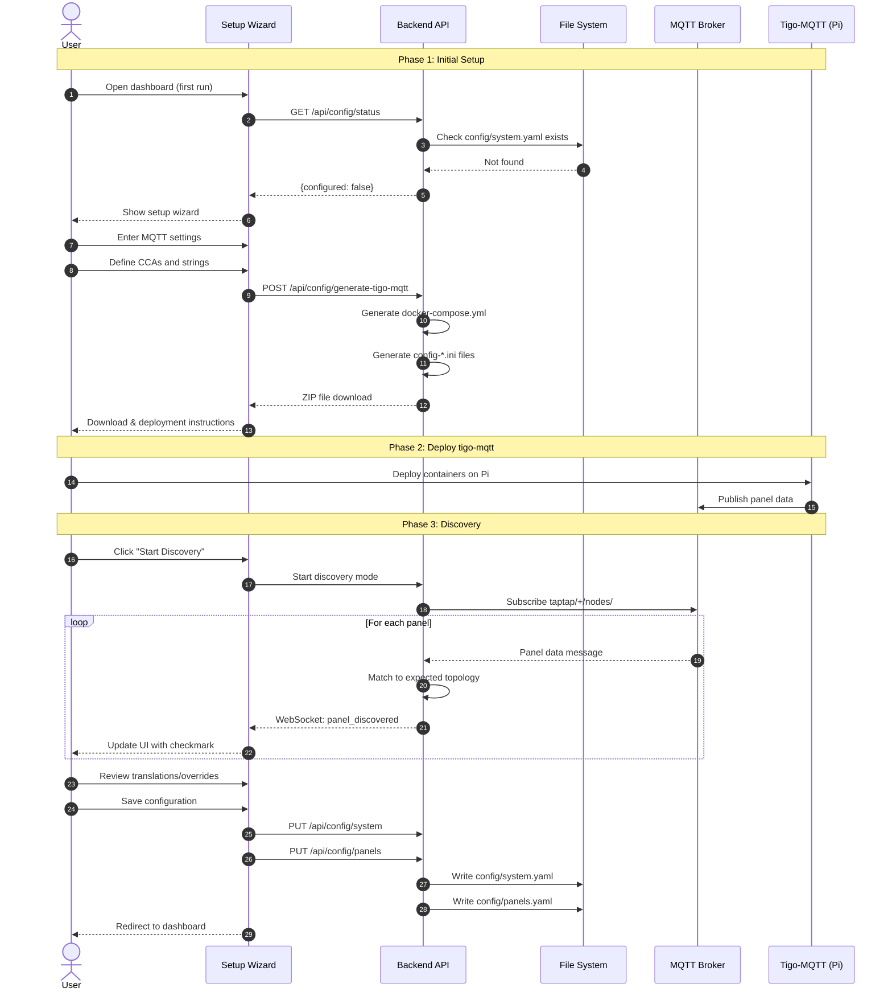

# Multi-User Configuration - Phase 1: Setup Wizard & Configuration Infrastructure

This specification defines the configuration infrastructure and setup wizard that enables multiple users to deploy Solar Tigo Viewer with their own unique Tigo CCA setups. Phase 1 delivers a complete end-to-end configuration experience including auto-discovery and validation. Phase 2 (separate spec) will add the visual layout editor.

## Motivation

The current Solar Tigo Viewer is hardcoded for a specific installation (2 CCAs, 71 panels across 9 strings). To enable sharing with other users who have different setups (e.g., 1 CCA, 22 panels across 2 strings), the application needs:

1. A flexible configuration system that survives git updates
2. Tools to generate tigo-mqtt deployment configurations
3. A guided setup experience for new users
4. Auto-discovery and validation to ensure configuration matches reality

## Functional Requirements

### FR-1: Configuration File System

**FR-1.1: Git-Ignored User Configuration**

The repository MUST use git-ignored user configuration files:
- User config files are stored in `config/` directory
- All user-specific files MUST be listed in `.gitignore`
- Repository MUST ship example templates with `.example` suffix
- User copies `*.example` files and removes the suffix to create their config

**FR-1.2: YAML Configuration Format**

All user configuration MUST use YAML format:
- Primary config file: `config/system.yaml`
- Example template: `config/system.example.yaml`
- Panel mapping: `config/panels.yaml` (generated during setup)
- Example template: `config/panels.example.yaml`

**FR-1.3: System Configuration Schema**

`config/system.yaml` MUST support the following structure:

```yaml
# Solar Tigo Viewer System Configuration
mqtt:
  server: "192.168.1.100"
  port: 1883
  username: "mqtt_user"
  password: "mqtt_password"

# List of Tigo CCA devices
ccas:
  - name: "primary"           # User-defined name (used in MQTT topics)
    serial_device: "/dev/ttyACM2"
    strings:
      - name: "A"
        panel_count: 8
      - name: "B"
        panel_count: 10

  - name: "secondary"
    serial_device: "/dev/ttyACM3"
    strings:
      - name: "F"
        panel_count: 11
      - name: "G"
        panel_count: 11
      - name: "H"
        panel_count: 5
```

**FR-1.4: Panel Configuration Schema**

`config/panels.yaml` MUST support the following structure:

```yaml
# Panel definitions - generated during setup, can be manually edited
panels:
  - serial: "4-C3F23CR"
    cca: "primary"
    string: "A"
    tigo_label: "A1"        # Label as reported by Tigo
    display_label: "A1"     # Label shown in UI (can differ for translations)

  - serial: "4-C3F277H"
    cca: "primary"
    string: "B"
    tigo_label: "B9"
    display_label: "F6"     # Translation: Tigo reports B9, display as F6

# Translations for label overrides (optional, for documentation)
translations:
  "B9": "F6"
  "B10": "F7"
```

**FR-1.5: Backward Compatibility**

The backend MUST support reading from both:
- New YAML format (`config/system.yaml`, `config/panels.yaml`)
- Legacy JSON format (`config/panel_mapping.json`) for existing installations

If both formats exist, YAML takes precedence with a warning logged.

### FR-2: Tigo-MQTT Configuration Generation

**FR-2.1: Docker Compose Generation**

The dashboard MUST generate a complete `docker-compose.yml` for tigo-mqtt based on the system configuration:
- One service per CCA defined in `system.yaml`
- Service names derived from CCA `name` field (e.g., `taptap-primary`)
- Serial device paths from config
- Common settings (restart policy, logging, healthcheck) applied to all services

**FR-2.2: INI Config File Generation**

For each CCA, the dashboard MUST generate a `config-{name}.ini` file containing:
- MQTT connection settings from `system.yaml`
- MODULES line generated from panel definitions
- TOPIC_NAME set to the CCA name
- Standard settings from template

**FR-2.3: Environment File Template**

The dashboard MUST generate a `.env.example` file:
```
MQTT_SERVER=192.168.1.100
MQTT_PORT=1883
MQTT_USER=your_mqtt_username
MQTT_PASS=your_mqtt_password
```

**FR-2.4: Download as ZIP**

The dashboard MUST provide generated files as a downloadable ZIP containing:
- `docker-compose.yml`
- `config-{name}.ini` for each CCA
- `.env.example`
- `README.md` with deployment instructions

### FR-3: Setup Wizard

**FR-3.1: First-Run Detection**

The dashboard MUST detect first-run state:
- If `config/system.yaml` does not exist, redirect to setup wizard
- Provide option to skip wizard and use example config for demo mode

**FR-3.2: Wizard Step 1 - MQTT Configuration**

The wizard MUST collect MQTT broker settings:
- Server address (required)
- Port (default: 1883)
- Username (optional)
- Password (optional, masked input)
- Test connection button with success/failure feedback

**FR-3.3: Wizard Step 2 - System Topology**

The wizard MUST collect system topology:
- Add/remove CCA devices
- For each CCA:
  - Name (alphanumeric, used in MQTT topics)
  - Serial device path (e.g., `/dev/ttyACM2`)
  - Add/remove strings
  - For each string:
    - Name (single letter recommended, e.g., "A", "B")
    - Expected panel count

Visual display: Collapsible cards for each CCA showing strings and panel counts.

**FR-3.4: Wizard Step 3 - Generate & Download Configs**

The wizard MUST:
- Display summary of configuration
- Generate tigo-mqtt files
- Provide download button for ZIP file
- Show deployment instructions:
  1. Copy files to your Raspberry Pi
  2. Copy `.env.example` to `.env` and fill in credentials
  3. Run `docker compose up -d`
  4. Return to this wizard to continue

**FR-3.5: Wizard Step 4 - Discovery Monitoring**

The wizard MUST wait for MQTT data and show discovery progress:
- Display expected panels from topology (grayed out initially)
- As panels report in via MQTT:
  - Show checkmark icon next to discovered panels
  - Display serial number, current power, voltage
  - Update in real-time
- Progress indicator: "Discovered X of Y expected panels"
- "All panels discovered" celebration state
- Manual "Continue anyway" option if some panels don't report

**FR-3.6: Wizard Step 5 - Validation & Translations**

The wizard MUST show validation results:

**Matched Panels:**
- Panels where Tigo label matches expected string/position
- Displayed with green checkmark

**Translation Needed:**
- Panels where Tigo reports unexpected labels
- Example: "Tigo reports B9, but topology expects string F. Should this panel display as F6?"
- Allow user to specify display_label override
- Common for installations where physical wiring differs from logical grouping

**Unexpected Panels:**
- Panels discovered that weren't in expected topology
- Option to add to configuration

**Missing Panels:**
- Expected panels that weren't discovered
- Warning displayed, option to wait longer or proceed

**FR-3.7: Wizard Step 6 - Review & Save**

The wizard MUST:
- Show final configuration summary
- Save `config/system.yaml`
- Save `config/panels.yaml` with discovered serial numbers and translations
- Redirect to main dashboard

### FR-4: Dashboard Grid View (Phase 1 Display)

**FR-4.1: Panel Grid Layout**

Until the layout editor is implemented (Phase 2), the dashboard MUST display panels in a grid/tile view:
- Panels grouped by string
- Strings grouped by CCA
- Each panel tile shows: label, watts, voltage
- Tiles colored by status (producing, low output, offline)

**FR-4.2: Grid Sorting**

The grid MUST support sorting:
- By string (default)
- By power output (high to low)
- By voltage
- By label (alphabetical)

### FR-5: Backend Configuration API

**FR-5.1: Configuration Endpoints**

The backend MUST expose REST endpoints:

| Endpoint | Method | Description |
|----------|--------|-------------|
| `/api/config/system` | GET | Get current system configuration |
| `/api/config/system` | PUT | Update system configuration |
| `/api/config/panels` | GET | Get panel configuration |
| `/api/config/panels` | PUT | Update panel configuration |
| `/api/config/generate-tigo-mqtt` | POST | Generate and return tigo-mqtt files |
| `/api/config/status` | GET | Check if configuration exists |

**FR-5.2: Configuration Validation**

All configuration updates MUST be validated:
- Required fields present
- CCA names are unique
- String names are unique within a CCA
- Serial device paths are valid format
- Panel serial numbers are unique

Return validation errors with field-level detail.

### FR-6: MQTT Discovery Service

**FR-6.1: Discovery Mode**

The backend MUST support a discovery mode:
- Subscribe to `taptap/+/nodes/#` wildcard topic
- Collect unique panel serial numbers and their reported data
- Track which CCA (primary/secondary/etc.) reported each panel
- Expose discovered panels via WebSocket to frontend

**FR-6.2: Discovery WebSocket Events**

During setup wizard, the backend MUST emit WebSocket events:

```json
{
  "type": "panel_discovered",
  "data": {
    "serial": "4-C3F23CR",
    "cca": "primary",
    "tigo_label": "A1",
    "watts": 245,
    "voltage": 32.5
  }
}
```

**FR-6.3: Expected vs Discovered Matching**

The backend MUST provide matching logic:
- Match discovered panels to expected topology by serial number (if previously known)
- Match by Tigo label to expected string/position
- Flag mismatches for user review

## Non-Functional Requirements

**NFR-1: Configuration Persistence**

- Configuration files MUST survive Docker container restarts
- Files stored in mounted volume (`config/`)
- Atomic writes to prevent corruption (write to temp, then rename)

**NFR-2: Setup Time**

- Setup wizard MUST be completable in under 10 minutes (excluding tigo-mqtt deployment time)
- Each wizard step MUST load in under 2 seconds

**NFR-3: Discovery Performance**

- Discovery MUST detect panels within 5 seconds of receiving first MQTT message
- UI MUST update within 500ms of panel discovery

**NFR-4: Backward Compatibility**

- Existing installations with `panel_mapping.json` MUST continue working without changes
- Migration path: run wizard to generate new YAML files

## High Level Design



### Configuration File Structure

```
solar_tigo_viewer/
├── config/
│   ├── system.yaml              # User config (git-ignored)
│   ├── system.example.yaml      # Template (checked in)
│   ├── panels.yaml              # User config (git-ignored)
│   ├── panels.example.yaml      # Template (checked in)
│   └── panel_mapping.json       # Legacy format (git-ignored, backward compat)
├── assets/
│   └── layout.png               # User layout image (git-ignored in Phase 2)
└── .gitignore                   # Updated to ignore user files
```

### Docker Compose Generation Logic

```python
def generate_docker_compose(system_config: SystemConfig) -> str:
    """Generate docker-compose.yml for tigo-mqtt deployment."""
    services = {}

    for cca in system_config.ccas:
        service_name = f"taptap-{cca.name}"
        services[service_name] = {
            "build": ".",
            "container_name": service_name,
            "restart": "unless-stopped",
            "network_mode": "host",
            "mem_limit": "256m",
            "group_add": ["dialout"],
            "env_file": [".env"],
            "devices": [cca.serial_device],
            "volumes": [
                f"./config-{cca.name}.ini:/app/config-template.ini:ro",
                f"./data/{cca.name}:/data",
                f"./run/{cca.name}:/run/taptap"
            ],
            "logging": {
                "driver": "json-file",
                "options": {"max-size": "10m", "max-file": "3"}
            },
            "healthcheck": {
                "test": ["CMD", "sh", "-c",
                    "test -f /run/taptap/taptap.run && "
                    "find /run/taptap/taptap.run -mmin -2 | grep -q ."],
                "interval": "60s",
                "timeout": "10s",
                "retries": 3,
                "start_period": "120s"
            }
        }

    return yaml.dump({"services": services}, default_flow_style=False)
```

### INI Config Generation Logic

```python
def generate_ini_config(cca: CCAConfig, panels: list[Panel], mqtt: MQTTConfig) -> str:
    """Generate config-{name}.ini for a single CCA."""
    # Build MODULES line from panels
    modules = []
    for panel in panels:
        if panel.cca == cca.name:
            # Format: STRING:LABEL_NUM:SERIAL
            label_num = panel.tigo_label[1:]  # A1 -> 1
            modules.append(f"{panel.string}:{label_num}:{panel.serial}")

    modules_line = ",".join(modules)

    return f"""[MQTT]
SERVER = ${{MQTT_SERVER}}
PORT = ${{MQTT_PORT}}
USER = ${{MQTT_USER}}
PASS = ${{MQTT_PASS}}
QOS = 1
TIMEOUT = 30

[TAPTAP]
LOG_LEVEL = info
BINARY = /usr/local/bin/taptap
SERIAL = {cca.serial_device}
ADDRESS =
PORT = 502
MODULES = {modules_line}
TOPIC_PREFIX = taptap
TOPIC_NAME = {cca.name}
TIMEOUT = 300
UPDATE = 5
STATE_FILE = /data/taptap.state

[HA]
DISCOVERY_PREFIX = homeassistant
DISCOVERY_LEGACY = false
BIRTH_TOPIC = homeassistant/status
NODES_AVAILABILITY_ONLINE = true
NODES_AVAILABILITY_IDENTIFIED = true
STRINGS_AVAILABILITY_ONLINE = true
STRINGS_AVAILABILITY_IDENTIFIED = true
STATS_AVAILABILITY_ONLINE = true
STATS_AVAILABILITY_IDENTIFIED = true
NODES_SENSORS_RECORDER = energy
STRINGS_SENSORS_RECORDER = energy_daily
STATS_SENSORS_RECORDER = energy_daily

[RUNTIME]
MAX_ERROR = 15
RUN_FILE = /run/taptap/taptap.run
"""
```

### Panel Discovery Matching Algorithm

```python
def match_discovered_panel(
    discovered: DiscoveredPanel,
    expected_topology: SystemConfig,
    known_panels: list[Panel]
) -> MatchResult:
    """Match a discovered panel to expected configuration."""

    # First, try matching by serial number (if we've seen this panel before)
    for panel in known_panels:
        if panel.serial == discovered.serial:
            return MatchResult(
                status="matched",
                panel=panel,
                confidence="high"
            )

    # Try matching by Tigo label to expected string/position
    tigo_label = discovered.tigo_label  # e.g., "A1"
    string_name = tigo_label[0]  # "A"
    position = tigo_label[1:]  # "1"

    for cca in expected_topology.ccas:
        if cca.name == discovered.cca:
            for string in cca.strings:
                if string.name == string_name:
                    pos_num = int(position)
                    if pos_num <= string.panel_count:
                        return MatchResult(
                            status="matched",
                            suggested_label=tigo_label,
                            confidence="medium"
                        )

    # No match - might need translation
    return MatchResult(
        status="unmatched",
        tigo_label=discovered.tigo_label,
        needs_translation=True
    )
```

### Frontend Wizard State Machine

```typescript
type WizardStep =
  | 'mqtt-config'
  | 'system-topology'
  | 'generate-download'
  | 'discovery'
  | 'validation'
  | 'review-save';

interface WizardState {
  currentStep: WizardStep;
  mqttConfig: MQTTConfig | null;
  systemTopology: SystemConfig | null;
  discoveredPanels: Map<string, DiscoveredPanel>;
  translations: Map<string, string>;  // tigo_label -> display_label
  validationResults: ValidationResult | null;
}
```

## Task Breakdown

### Backend Tasks

1. **Create configuration models and schemas**
   - Define Pydantic models for SystemConfig, CCAConfig, PanelConfig
   - Add YAML serialization/deserialization
   - Add validation logic

2. **Implement configuration file service**
   - Read/write YAML config files
   - Support legacy JSON format reading
   - Atomic file writes

3. **Create configuration REST endpoints**
   - GET/PUT /api/config/system
   - GET/PUT /api/config/panels
   - GET /api/config/status
   - POST /api/config/generate-tigo-mqtt

4. **Implement tigo-mqtt config generation**
   - Docker Compose generator
   - INI config file generator
   - ZIP file assembly with README

5. **Add discovery mode to MQTT service**
   - Wildcard subscription support
   - Panel discovery event emission
   - Expected vs discovered matching

6. **Update existing backend to use new config format**
   - Refactor panel loading to support both formats
   - Add config format migration warnings

### Frontend Tasks

7. **Create wizard component framework**
   - Step navigation
   - State management
   - Progress indicator

8. **Implement MQTT configuration step**
   - Form with validation
   - Connection test button

9. **Implement system topology step**
   - CCA add/remove UI
   - String add/remove within CCA
   - Panel count inputs

10. **Implement generate & download step**
    - Summary display
    - ZIP download button
    - Deployment instructions

11. **Implement discovery monitoring step**
    - Real-time panel discovery display
    - Progress indicator
    - WebSocket integration

12. **Implement validation & translations step**
    - Display match results
    - Translation input for mismatches
    - Add unexpected panels option

13. **Implement review & save step**
    - Configuration summary
    - Save and redirect

14. **Implement grid view dashboard**
    - Panel tiles grouped by string/CCA
    - Sorting options
    - Status-based coloring

### Infrastructure Tasks

15. **Update .gitignore**
    - Add config/system.yaml
    - Add config/panels.yaml
    - Keep config/*.example.yaml tracked

16. **Create example configuration templates**
    - config/system.example.yaml
    - config/panels.example.yaml

17. **Update docker-compose for dashboard**
    - Mount config/ directory
    - Handle missing config gracefully

18. **Update CLAUDE.md and documentation**
    - Document new configuration system
    - Update setup instructions

## Context / Documentation

### Files to Reference During Implementation

| File | Purpose |
|------|---------|
| `config/panel_mapping.json` | Current format to maintain compatibility with |
| `tigo-mqtt/config-template.ini` | INI format reference for generation |
| `tigo-mqtt/docker-compose.yml` | Docker Compose format reference |
| `dashboard/backend/app/mqtt_service.py` | Current MQTT subscription implementation |
| `dashboard/backend/app/main.py` | API endpoint patterns |
| `dashboard/frontend/src/App.tsx` | Frontend routing patterns |

### External Documentation

- [PyYAML Documentation](https://pyyaml.org/wiki/PyYAMLDocumentation)
- [Pydantic Settings](https://docs.pydantic.dev/latest/concepts/pydantic_settings/)
- [React Hook Form](https://react-hook-form.com/) - Recommended for wizard forms

---

**Specification Version:** 1.0
**Last Updated:** January 2026
**Authors:** Claude (AI Assistant)

## Changelog

### v1.0 (January 2026)
**Summary:** Initial specification for multi-user configuration support

**Changes:**
- Initial specification created
- Defined YAML configuration schema
- Specified setup wizard flow
- Defined tigo-mqtt config generation
- Specified discovery and validation workflow
