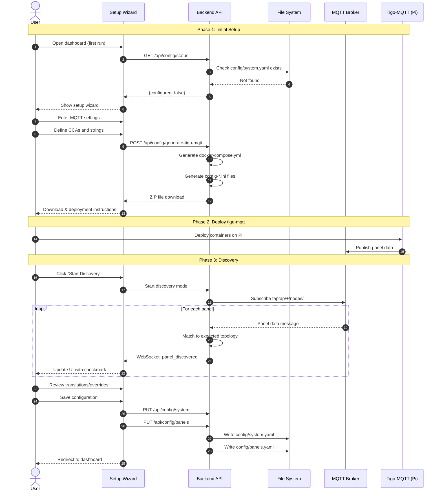

# Multi-User Configuration - Phase 1: Setup Wizard & Configuration Infrastructure

This specification defines the configuration infrastructure and setup wizard that enables multiple users to deploy Solar Tigo Viewer with their own unique Tigo CCA setups. Phase 1 delivers a complete end-to-end configuration experience including auto-discovery and validation. Phase 2 (separate spec) will add the visual layout editor.

## Motivation

The current Solar Tigo Viewer is hardcoded for a specific installation (2 CCAs, 71 panels across 9 strings). To enable sharing with other users who have different setups (e.g., 1 CCA, 22 panels across 2 strings), the application needs:

1. A flexible configuration system that survives git updates
2. Tools to generate tigo-mqtt deployment configurations
3. A guided setup experience for new users
4. Auto-discovery and validation to ensure configuration matches reality

## Functional Requirements

### FR-1: Configuration File System

**FR-1.1: Git-Ignored User Configuration**

The repository MUST use git-ignored user configuration files:
- User config files are stored in `config/` directory
- All user-specific files MUST be listed in `.gitignore`
- Repository MUST ship example templates with `.example` suffix
- User copies `*.example` files and removes the suffix to create their config

**FR-1.2: YAML Configuration Format**

All user configuration MUST use YAML format:
- Primary config file: `config/system.yaml`
- Example template: `config/system.example.yaml`
- Panel mapping: `config/panels.yaml` (generated during setup)
- Example template: `config/panels.example.yaml`

**FR-1.3: System Configuration Schema**

`config/system.yaml` MUST support the following structure:

```yaml
# Solar Tigo Viewer System Configuration
version: 1  # Schema version for forward/backward compatibility

mqtt:
  server: "192.168.1.100"
  port: 1883
  username: "mqtt_user"
  password: "mqtt_password"

# List of Tigo CCA devices
ccas:
  - name: "primary"           # User-defined name (used in MQTT topics)
    serial_device: "/dev/ttyACM2"
    strings:
      - name: "A"
        panel_count: 8
      - name: "B"
        panel_count: 10

  - name: "secondary"
    serial_device: "/dev/ttyACM3"
    strings:
      - name: "F"
        panel_count: 11
      - name: "G"
        panel_count: 11
      - name: "H"
        panel_count: 5
```

**FR-1.4: Panel Configuration Schema**

`config/panels.yaml` MUST support the following structure:

```yaml
# Panel definitions - generated during setup, can be manually edited
panels:
  - serial: "4-C3F23CR"
    cca: "primary"
    string: "A"
    tigo_label: "A1"        # Label as reported by Tigo
    display_label: "A1"     # Label shown in UI (can differ for translations)

  - serial: "4-C3F277H"
    cca: "primary"
    string: "B"
    tigo_label: "B9"
    display_label: "F6"     # Translation: Tigo reports B9, display as F6

# Translations for label overrides (optional, for documentation)
translations:
  "B9": "F6"
  "B10": "F7"
```

**FR-1.5: Backward Compatibility**

The backend MUST support reading from both:
- New YAML format (`config/system.yaml`, `config/panels.yaml`)
- Legacy JSON format (`config/panel_mapping.json`) for existing installations

**Precedence rules:**
- If YAML files exist, use YAML (ignore JSON)
- If only JSON exists, use JSON and show migration banner

**Migration workflow:**
1. Dashboard detects legacy JSON config on startup
2. Shows banner: "Legacy configuration detected. [Migrate to YAML] [Dismiss]"
3. "Migrate to YAML" button opens migration wizard:
   - Pre-fills MQTT settings (user must provide, not in JSON)
   - Infers CCA topology from existing panel data
   - Converts panel positions/labels to YAML format
   - Offers preview before saving
4. After migration, JSON file is renamed to `panel_mapping.json.backup`

**Edge cases:**
- Malformed JSON: Show error with option to start fresh with setup wizard
- JSON panels not in YAML (after partial migration): Ignored with warning log
- Phase 2 layout editor: Requires YAML format; migration required first
- Existing backup file: Overwrite with warning log "Existing backup file replaced"
- Config directory read-only: Migration fails with error "Cannot write to config directory"

**YAML error handling:**
- Malformed YAML (parse error): Show error "Configuration file is corrupted" with options:
  - "Reset configuration" - deletes YAML, falls back to JSON or starts fresh
  - "Edit manually" - shows file path for user to fix
- YAML schema validation failure: Show specific field errors with line numbers

### FR-2: Tigo-MQTT Configuration Generation

**FR-2.1: Docker Compose Generation**

The dashboard MUST generate a complete `docker-compose.yml` for tigo-mqtt based on the system configuration:
- One service per CCA defined in `system.yaml`
- Service names derived from CCA `name` field (e.g., `taptap-primary`)
- Serial device paths from config
- Common settings (restart policy, logging, healthcheck) applied to all services

**FR-2.2: INI Config File Generation**

For each CCA, the dashboard MUST generate a `config-{name}.ini` file containing:
- MQTT connection settings from `system.yaml`
- MODULES line generated from panel definitions
- TOPIC_NAME set to the CCA name
- Standard settings from template

**FR-2.3: Environment File Template**

The dashboard MUST generate a `.env.example` file:
```
MQTT_SERVER=192.168.1.100
MQTT_PORT=1883
MQTT_USER=your_mqtt_username
MQTT_PASS=your_mqtt_password
```

**FR-2.4: Download as ZIP**

The dashboard MUST provide generated files as a downloadable ZIP containing:
- `docker-compose.yml`
- `config-{name}.ini` for each CCA
- `.env.example`
- `README.md` with deployment instructions

Note: The ZIP assumes the user will clone the tigo-mqtt repository to get the Dockerfile and taptap binary. The README MUST include:
1. Clone instructions for the tigo-mqtt repository
2. Instructions to copy generated configs into the cloned directory
3. Build and run commands

### FR-3: Setup Wizard

**FR-3.1: First-Run Detection**

The dashboard MUST detect first-run state:
- If `config/system.yaml` does not exist, redirect to setup wizard
- Provide option to skip wizard and use example config for demo mode

**FR-3.2: Wizard Step 1 - MQTT Configuration**

The wizard MUST collect MQTT broker settings:
- Server address (required)
- Port (default: 1883)
- Username (optional)
- Password (optional, masked input)
- Test connection button with success/failure feedback

**FR-3.3: Wizard Step 2 - System Topology**

The wizard MUST collect system topology:
- Add/remove CCA devices
- For each CCA:
  - Name (alphanumeric, used in MQTT topics)
  - Serial device path (e.g., `/dev/ttyACM2`)
  - Add/remove strings
  - For each string:
    - Name (1-2 letters recommended, e.g., "A", "B", "AA")
    - Expected panel count

Note: Per-string configuration (voltage thresholds, HA prefixes) is not required. The taptap-mqtt binary handles all string-level settings automatically based on the MODULES definition.

Visual display: Collapsible cards for each CCA showing strings and panel counts.

**FR-3.4: Wizard Step 3 - Generate & Download Configs**

The wizard MUST:
- Display summary of configuration
- Generate tigo-mqtt files
- Provide download button for ZIP file
- Show deployment instructions:
  1. Copy files to your Raspberry Pi
  2. Copy `.env.example` to `.env` and fill in credentials
  3. Run `docker compose up -d`
  4. Return to this wizard to continue

**FR-3.5: Wizard Step 4 - Discovery Monitoring**

The wizard MUST wait for MQTT data and show discovery progress:
- Display expected panels from topology (grayed out initially)
- As panels report in via MQTT:
  - Show checkmark icon next to discovered panels
  - Display serial number, current power, voltage
  - Update in real-time via WebSocket (no polling needed)
- Progress indicator: "Discovered X of Y expected panels"
- "All panels discovered" celebration state
- Manual "Continue anyway" option if some panels don't report

**Discovery Timing:**
- **Suggestion timeout**: After 2 minutes with no new discoveries, show "Continue anyway" button prominently
- **Stale panel warning**: If a discovered panel stops reporting for >60 seconds, show warning icon (may indicate intermittent connection)
- **Restart discovery**: Button to clear discovered panels and restart (preserves topology config)
- **Partial success thresholds**:
  - 100% discovered: Green "All panels found!" message
  - 90-99% discovered: Yellow "Most panels found" - safe to continue
  - 50-89% discovered: Orange warning - "Some panels missing, check connections"
  - <50% discovered: Red warning - "Many panels missing, verify tigo-mqtt is running"

**FR-3.6: Wizard Step 5 - Validation & Translations**

The wizard MUST show validation results:

**Matched Panels:**
- Panels where Tigo label matches expected string/position
- Displayed with green checkmark

**Translation Needed:**
- Panels where Tigo reports unexpected labels
- Display context to help user decide:
  - "Panel with serial 4-C3F277H reports as **B9** from CCA 'primary'"
  - "Your topology doesn't have a B9 position. What should this panel display as?"
- Input field for display_label with suggestions based on unassigned positions
- **Default behavior**: If left blank, uses Tigo label as-is
- **Skip option**: "I'll configure this later" - panel saved with `display_label = tigo_label`
- **Bulk translation**: Simple offset-based option for common scenarios:
  - "Rename B-string panels to F-string"
  - Input: Source string "B", Target string "F", Offset (integer)
  - Preview shown before applying: "B9 → F6, B10 → F7"
  - **Offset rules:**
    - Can be positive, negative, or zero
    - Zero offset: changes string letter only (B9 → F9)
    - Positive offset: shifts position up (B1 → F4 with offset +3)
    - Negative offset: shifts position down (B9 → F6 with offset -3)
    - No maximum offset (validated per-result, not per-offset)
  - **Application scope:** Applied to ALL discovered panels matching source string
    - Non-contiguous panels are fine (B9, B11 both get translated, B10 skipped if absent)
  - **Validation:** Rejects if ANY result would have position ≤ 0
    - Error example: "B1 with offset -3 would result in F-2 (invalid)"

**Translation UX Notes:**
- User may not know correct labels during initial setup
- Emphasize that translations can be edited later in Settings
- Show physical context if available (e.g., "This panel is currently producing 245W")

**Unexpected Panels:**
- Panels discovered that weren't in expected topology
- Option to add to configuration with suggested string assignment

**Missing Panels:**
- Expected panels that weren't discovered
- Warning displayed, option to wait longer or proceed
- "Mark as offline" option to acknowledge and continue

**FR-3.7: Wizard Step 6 - Review & Save**

The wizard MUST:
- Show final configuration summary
- Save `config/system.yaml`
- Save `config/panels.yaml` with discovered serial numbers and translations
- Redirect to main dashboard

### FR-4: Dashboard Grid View (Phase 1 Display)

**FR-4.1: Panel Grid Layout**

Until the layout editor is implemented (Phase 2), the dashboard MUST display panels in a grid/tile view:
- Panels grouped by string
- Strings grouped by CCA
- Each panel tile shows: label, watts, voltage
- Tiles colored by status (producing, low output, offline)

**FR-4.2: Grid Sorting**

The grid MUST support sorting:
- By string (default)
- By power output (high to low)
- By voltage
- By label (alphabetical)

### FR-5: Backend Configuration API

**FR-5.1: Configuration Endpoints**

The backend MUST expose REST endpoints:

| Endpoint | Method | Description |
|----------|--------|-------------|
| `/api/config/system` | GET | Get current system configuration |
| `/api/config/system` | PUT | Update system configuration |
| `/api/config/panels` | GET | Get panel configuration |
| `/api/config/panels` | PUT | Update panel configuration |
| `/api/config/generate-tigo-mqtt` | POST | Generate and return tigo-mqtt files |
| `/api/config/status` | GET | Check if configuration exists |
| `/api/config/mqtt/test` | POST | Test MQTT broker connectivity |
| `/api/config/validate` | POST | Validate discovered panels against topology |

**HTTP Status Codes:**
- `200 OK` - Success (unless otherwise specified)
- `400 Bad Request` - Validation error or invalid request
- `500 Internal Server Error` - Server-side error (disk full, permission denied, etc.)

**Standard Error Response Format:**

All error responses use this format:
```json
{
  "success": false,
  "error": "error_code",           // Machine-readable error code
  "message": "Human-readable message",
  "details": []                    // Optional, for validation errors
}
```

Error codes: `validation_error`, `no_config`, `permission_denied`, `disk_full`, `parse_error`, `auth_failed`, `connection_refused`, `timeout`, `dns_error`

**Config Status Endpoint Details:**

```
GET /api/config/status

Response (200 OK):
{
  "configured": boolean,        // true if system.yaml exists and is valid
  "has_panels": boolean,        // true if panels.yaml exists and has panels
  "legacy_detected": boolean,   // true if panel_mapping.json exists
  "migration_available": boolean // true if legacy exists and no YAML
}
```

This endpoint is used for first-run detection (FR-3.1). If `configured` is false, redirect to setup wizard.

**System Config Endpoint Details:**

```
GET /api/config/system
Response (200 OK): SystemConfig object (see Backend Models)

PUT /api/config/system
Request Body: SystemConfig object
Response (200 OK): { "success": true }
Response (400 Bad Request): Standard error format with error="validation_error"
```

**Panels Config Endpoint Details:**

```
GET /api/config/panels
Response (200 OK): { "panels": Panel[] }

PUT /api/config/panels
Request Body: { "panels": Panel[] }
Response (200 OK): { "success": true }
Response (400 Bad Request): Standard error format with error="validation_error"
```

**Generate Tigo-MQTT Endpoint Details:**

```
POST /api/config/generate-tigo-mqtt
Content-Type: application/json

Request Body (option 1 - provide full config):
{
  "mqtt": { "server": "...", "port": 1883, ... },
  "ccas": [ ... ],
  "panels": [ ... ]  // Optional - may be empty for initial setup
}

Request Body (option 2 - use saved config):
{}

Response (success):
Content-Type: application/zip
Content-Disposition: attachment; filename="tigo-mqtt-config.zip"
Body: Binary ZIP stream

Response (error - no config available):
Status: 400 Bad Request
{
  "error": "no_config",
  "message": "No saved configuration found. Provide config in request body."
}
```

Note: During wizard step 3, the frontend MUST always send full config inline (option 1) since no config is saved until step 6.

**MQTT Test Endpoint Details:**

```
POST /api/config/mqtt/test
Content-Type: application/json

Request Body:
{
  "server": "192.168.1.100",
  "port": 1883,
  "username": "mqtt_user",
  "password": "mqtt_password"
}

Response (200 OK - success):
{
  "success": true,
  "message": "Connected successfully"
}

Response (400 Bad Request - failure):
{
  "success": false,
  "error": "auth_failed",  // or: connection_refused, timeout, dns_error
  "message": "Authentication failed: bad username or password"
}
```

**Panel Validation Endpoint Details:**

Used by the wizard in step 5 to match discovered panels against expected topology.

```
POST /api/config/validate
Content-Type: application/json

Request Body:
{
  "discovered_panels": [
    {
      "serial": "AB12345678",
      "cca": "primary",
      "tigo_label": "A1",
      "watts": 245.7,
      "voltage": 32.5
    }
  ],
  "topology": {
    "ccas": [
      {
        "name": "primary",
        "serial_device": "/dev/ttyACM2",
        "strings": [
          { "name": "A", "panel_count": 12 }
        ]
      }
    ]
  }
}

Response (200 OK):
{
  "success": true,
  "results": [
    {
      "status": "matched",
      "panel": { "serial": "AB12345678", "cca": "primary", "string": "A", "tigo_label": "A1", "display_label": "A1" },
      "confidence": "high",
      "tigo_label": "A1",
      "needs_translation": false
    }
  ],
  "summary": {
    "total": 12,
    "matched": 10,
    "unmatched": 1,
    "possible_wiring_issues": 1
  }
}
```

**FR-5.2: Configuration Validation**

All configuration updates MUST be validated:
- Required fields present
- CCA names are unique
- String names are unique within a CCA
- Serial device paths are valid format (e.g., `/dev/ttyACM0`, `/dev/ttyUSB0`)
- Panel serial numbers are unique

**CCA Name Validation:**
- Lowercase alphanumeric and hyphens only: `^[a-z][a-z0-9-]*$`
- Must start with a letter (not number or hyphen)
- Maximum 32 characters (Docker service name limit)
- Reserved names not allowed: `build`, `test`, `temp`, `default`, `host`, `none`, `bridge`
- Names starting with underscore not allowed (Docker internal convention)
- Validation tested with `docker compose config` for edge cases

**String Name Validation:**
- Uppercase letters only: `^[A-Z]{1,2}$`
- 1-2 characters (e.g., "A", "B", "AA", "AB")
- Must be valid for MQTT topic segments
- **Case normalization:** Both UI and API normalize input to uppercase. User enters "a" → stored as "A". This aligns with `parse_tigo_label()` which also normalizes to uppercase.

Return validation errors with field-level detail.

### FR-6: MQTT Discovery Service

**FR-6.1: Discovery Mode**

The backend MUST support a discovery mode:
- Subscribe to `taptap/+/nodes/#` wildcard topic
- Collect unique panel serial numbers and their reported data
- Track which CCA (primary/secondary/etc.) reported each panel
- Expose discovered panels via WebSocket to frontend

**FR-6.2: Discovery WebSocket Events**

During setup wizard, the backend MUST emit WebSocket events.

**WebSocket connection handling:**
- Auto-reconnect with exponential backoff (1s, 2s, 4s, max 30s)
- Discovered panels persist in frontend state across reconnects
- Show "Connection lost, reconnecting..." banner during disconnection
- If reconnect fails after 5 attempts: show "Discovery paused. [Retry] [Continue anyway]"
  - **[Retry]**: Resets attempt counter to 0 and immediately attempts reconnection
  - **[Continue anyway]**: Proceeds to validation step (step 5) with panels discovered so far
- On successful reconnect: resume discovery, existing panels preserved
- **Note:** Panels that report during WebSocket disconnection are not retroactively discovered. They will appear on their next MQTT update (typically within 5 seconds per UPDATE interval in INI config).

```json
{
  "type": "panel_discovered",
  "data": {
    "serial": "4-C3F23CR",
    "cca": "primary",
    "tigo_label": "A1",
    "watts": 245,
    "voltage": 32.5
  }
}
```

**Frontend timestamp handling:** The `panel_discovered` event does NOT include timestamps. The frontend is responsible for adding them when storing in state:

```typescript
function handlePanelDiscovered(event: PanelDiscoveredEvent) {
  const now = new Date().toISOString();
  const existing = state.discoveredPanels[event.data.serial];

  const panel: DiscoveredPanel = {
    ...event.data,
    discovered_at: existing?.discovered_at ?? now,  // Preserve original discovery time
    last_seen_at: now  // Always update last seen
  };
  state.discoveredPanels[event.data.serial] = panel;
}
```

**FR-6.3: Expected vs Discovered Matching**

The backend MUST provide matching logic:
- Match discovered panels to expected topology by serial number (if previously known)
- Match by Tigo label to expected string/position
- Flag mismatches for user review

## Non-Functional Requirements

**NFR-1: Configuration Persistence**

- Configuration files MUST survive Docker container restarts
- Files stored in mounted volume (`config/`)
- Atomic writes to prevent corruption (write to temp, then rename)

**Backup and error handling:**
- Before overwriting any config file, create backup: `{filename}.bak`
- Only one backup kept (most recent)
- If temp file write fails (disk full), return error without modifying original
- If rename fails (permissions), attempt to restore from temp file, return error
- Log all config write operations with timestamp

**NFR-2: Setup Time**

- Setup wizard MUST be completable in under 10 minutes (excluding tigo-mqtt deployment time)
- Each wizard step MUST load in under 2 seconds

**NFR-3: Discovery Performance**

- Discovery MUST detect panels within 5 seconds of receiving first MQTT message
- UI MUST update within 500ms of panel discovery

**NFR-4: Backward Compatibility**

- Existing installations with `panel_mapping.json` MUST continue working without changes
- Migration path: run wizard to generate new YAML files

## High Level Design



### Configuration File Structure

```
solar_tigo_viewer/
├── config/
│   ├── system.yaml              # User config (git-ignored)
│   ├── system.example.yaml      # Template (checked in)
│   ├── panels.yaml              # User config (git-ignored)
│   ├── panels.example.yaml      # Template (checked in)
│   └── panel_mapping.json       # Legacy format (git-ignored, backward compat)
├── assets/
│   └── layout.png               # User layout image (git-ignored in Phase 2)
└── .gitignore                   # Updated to ignore user files
```

### Docker Compose Generation Logic

```python
def generate_docker_compose(system_config: SystemConfig) -> str:
    """Generate docker-compose.yml for tigo-mqtt deployment."""
    services = {}

    for cca in system_config.ccas:
        service_name = f"taptap-{cca.name}"
        services[service_name] = {
            "build": ".",
            "container_name": service_name,
            "restart": "unless-stopped",
            "network_mode": "host",
            "mem_limit": "256m",
            "group_add": ["dialout"],
            "env_file": [".env"],
            # Device mapping: host_path:container_path
            # Container path matches host path for simplicity
            "devices": [f"{cca.serial_device}:{cca.serial_device}"],
            "volumes": [
                f"./config-{cca.name}.ini:/app/config-template.ini:ro",
                f"./data/{cca.name}:/data",
                f"./run/{cca.name}:/run/taptap"
            ],
            "logging": {
                "driver": "json-file",
                "options": {"max-size": "10m", "max-file": "3"}
            },
            # Healthcheck: file must be modified within last minute
            # start_period allows 2 minutes for taptap initialization
            # (CCA handshake and module discovery can be slow)
            "healthcheck": {
                "test": ["CMD", "sh", "-c",
                    "test -f /run/taptap/taptap.run && "
                    "find /run/taptap/taptap.run -mmin -1 | grep -q ."],
                "interval": "60s",
                "timeout": "10s",
                "retries": 3,
                "start_period": "120s"
            }
        }

    return yaml.dump({"services": services}, default_flow_style=False)
```

### Tigo Label Parsing Utility

```python
import re

def parse_tigo_label(label: str) -> tuple[str, int] | None:
    """
    Parse a Tigo label into string name and position number.
    String names are normalized to uppercase (Tigo reports uppercase).

    Valid inputs:
        "A1" -> ("A", 1)
        "AA12" -> ("AA", 12)
        "B10" -> ("B", 10)
        "a1" -> ("A", 1)     # lowercase normalized to uppercase
        "A01" -> ("A", 1)    # leading zeros stripped by int()

    Invalid inputs (returns None):
        "" -> None           # empty string
        "1A" -> None         # number first
        "A" -> None          # no number
        "123" -> None        # no letters
        "A-1" -> None        # hyphen
        "A 1" -> None        # space
        "A1B" -> None        # letter after number
    """
    match = re.match(r'^([A-Za-z]+)(\d+)$', label)
    if match:
        string_part, num_part = match.groups()
        return (string_part.upper(), int(num_part))  # Normalize to uppercase
    return None
```

### INI Config Generation Logic

```python
def generate_ini_config(cca: CCAConfig, panels: list[Panel], mqtt: MQTTConfig) -> str:
    """Generate config-{name}.ini for a single CCA.

    Raises:
        ValueError: If CCA has no panels configured or label parsing fails.
    """
    # Build MODULES line from panels
    modules = []
    for panel in panels:
        if panel.cca == cca.name:
            # Format: STRING:POSITION:SERIAL (verified against taptap-mqtt source)
            parsed = parse_tigo_label(panel.tigo_label)
            if parsed is None:
                raise ValueError(f"Invalid tigo_label format: {panel.tigo_label}")
            string_name, position = parsed
            modules.append(f"{string_name}:{position}:{panel.serial}")

    if not modules:
        raise ValueError(f"CCA '{cca.name}' has no panels configured. "
                        "Each CCA must have at least one panel.")

    modules_line = ",".join(modules)

    return f"""[MQTT]
SERVER = ${{MQTT_SERVER}}
PORT = ${{MQTT_PORT}}
USER = ${{MQTT_USER}}
PASS = ${{MQTT_PASS}}
QOS = 1
TIMEOUT = 30

[TAPTAP]
LOG_LEVEL = info
BINARY = /usr/local/bin/taptap
SERIAL = {cca.serial_device}
ADDRESS =
PORT = 502
MODULES = {modules_line}
TOPIC_PREFIX = taptap
TOPIC_NAME = {cca.name}
TIMEOUT = 300
UPDATE = 5
STATE_FILE = /data/taptap.state

[HA]
DISCOVERY_PREFIX = homeassistant
DISCOVERY_LEGACY = false
BIRTH_TOPIC = homeassistant/status
NODES_AVAILABILITY_ONLINE = true
NODES_AVAILABILITY_IDENTIFIED = true
STRINGS_AVAILABILITY_ONLINE = true
STRINGS_AVAILABILITY_IDENTIFIED = true
STATS_AVAILABILITY_ONLINE = true
STATS_AVAILABILITY_IDENTIFIED = true
NODES_SENSORS_RECORDER = energy
STRINGS_SENSORS_RECORDER = energy_daily
STATS_SENSORS_RECORDER = energy_daily

[RUNTIME]
MAX_ERROR = 15
RUN_FILE = /run/taptap/taptap.run
"""
```

### Backend Models

The following Pydantic models define the configuration data structures. These parallel the Frontend Types.

```python
from pydantic import BaseModel

# JSON Serialization Convention:
# All API responses use snake_case for consistency. Both Python and TypeScript
# interfaces use snake_case field names (tigo_label, panel_count, etc.).
# This simplifies implementation - no alias conversion needed.

class StringConfig(BaseModel):
    """A string of panels connected in series."""
    name: str           # 1-2 uppercase letters (A, B, AA)
    panel_count: int

class CCAConfig(BaseModel):
    """Configuration for a Tigo CCA device."""
    name: str           # lowercase alphanumeric + hyphens
    serial_device: str  # e.g., /dev/ttyACM2
    strings: list[StringConfig]

class MQTTConfig(BaseModel):
    """MQTT broker connection settings."""
    server: str
    port: int = 1883
    username: str | None = None
    password: str | None = None

class SystemConfig(BaseModel):
    """Top-level system configuration."""
    version: int = 1
    mqtt: MQTTConfig
    ccas: list[CCAConfig]

class Panel(BaseModel):
    """A configured panel with serial and label info.

    Note: No alias_generator - uses snake_case to match TypeScript interface.
    Serialized to frontend as-is (snake_case fields).
    """
    serial: str
    cca: str
    string: str
    tigo_label: str
    display_label: str
```

### Panel Discovery Types

```python
from dataclasses import dataclass
from typing import Literal, Optional

@dataclass
class DiscoveredPanel:
    """A panel discovered via MQTT during the setup wizard.

    Note: This is a backend-internal type used for tracking discovered panels.
    It is NOT directly serialized to the frontend. The frontend builds its own
    DiscoveredPanel objects from PanelDiscoveredEvent data + client-side timestamps
    (see "Frontend timestamp handling" section).
    """
    serial: str
    cca: str
    tigo_label: str
    watts: float       # Can be decimal (e.g., 245.7)
    voltage: float
    discovered_at: str   # ISO timestamp (backend tracking)
    last_seen_at: str    # For stale panel detection (backend tracking)

@dataclass
class MatchResult:
    """Result of matching a discovered panel to expected configuration.

    Return semantics by status:
    - 'matched' with confidence='high': panel field populated (known serial)
    - 'matched' with confidence='medium': suggested_label populated (new panel by topology)
    - 'possible_wiring_issue': tigo_label, reported_cca, expected_cca, warning populated
    - 'unmatched': tigo_label populated, may have needs_translation=True or error set

    Note: Serialized to frontend via POST /api/config/validate endpoint as JSON.
    Uses snake_case field names to match frontend TypeScript interface.
    Manual serialization: dataclasses.asdict(match_result)
    """
    status: Literal['matched', 'unmatched', 'possible_wiring_issue']
    panel: Optional[Panel] = None             # Set for high-confidence serial match (Panel defined in Backend Models)
    suggested_label: Optional[str] = None     # Set for medium-confidence topology match
    confidence: Optional[Literal['high', 'medium', 'low']] = None
    tigo_label: Optional[str] = None
    needs_translation: bool = False
    error: Optional[str] = None
    reported_cca: Optional[str] = None        # For wiring issue detection
    expected_cca: Optional[str] = None        # For wiring issue detection
    warning: Optional[str] = None
```

### Panel Discovery Matching Algorithm

```python
def match_discovered_panel(
    discovered: DiscoveredPanel,
    expected_topology: SystemConfig,
    known_panels: list[Panel]
) -> MatchResult:
    """Match a discovered panel to expected configuration."""

    # First, try matching by serial number (if we've seen this panel before)
    for panel in known_panels:
        if panel.serial == discovered.serial:
            return MatchResult(
                status="matched",
                panel=panel,
                confidence="high"
            )

    # Parse the Tigo label using robust regex
    parsed = parse_tigo_label(discovered.tigo_label)
    if parsed is None:
        return MatchResult(
            status="unmatched",
            tigo_label=discovered.tigo_label,
            error="Invalid label format - expected pattern like 'A1' or 'AA12'"
        )

    string_name, position = parsed

    # Try matching to the CCA that reported this panel first
    for cca in expected_topology.ccas:
        if cca.name == discovered.cca:
            for string in cca.strings:
                if string.name == string_name:
                    if position <= string.panel_count:
                        return MatchResult(
                            status="matched",
                            suggested_label=discovered.tigo_label,
                            confidence="medium"
                        )

    # Fallback: Check ALL CCAs - might be a wiring issue
    for cca in expected_topology.ccas:
        if cca.name != discovered.cca:  # Skip already-checked CCA
            for string in cca.strings:
                if string.name == string_name:
                    if position <= string.panel_count:
                        return MatchResult(
                            status="possible_wiring_issue",
                            tigo_label=discovered.tigo_label,
                            reported_cca=discovered.cca,
                            expected_cca=cca.name,
                            warning=f"Panel reports from '{discovered.cca}' but "
                                    f"string '{string_name}' is configured on '{cca.name}'"
                        )

    # No match in any CCA - needs translation
    return MatchResult(
        status="unmatched",
        tigo_label=discovered.tigo_label,
        needs_translation=True
    )
```

### Frontend Types

The following TypeScript types mirror the backend Pydantic models and are used throughout the wizard and dashboard.

```typescript
// Configuration types (mirror backend Pydantic models)
interface MQTTConfig {
  server: string;
  port: number;      // Required field; form defaults to 1883, backend validates as required
  username?: string;
  password?: string;
}

// Note: Port is required in both frontend and backend. The form pre-fills 1883 as the
// default value, but users must explicitly submit it. Backend does not auto-default.

interface StringConfig {
  name: string;        // 1-2 uppercase letters (A, B, AA)
  panel_count: number;
}

interface CCAConfig {
  name: string;           // lowercase alphanumeric + hyphens
  serial_device: string;  // e.g., /dev/ttyACM2
  strings: StringConfig[];
}

interface SystemConfig {
  version: number;
  mqtt: MQTTConfig;
  ccas: CCAConfig[];
}

interface Panel {
  serial: string;
  cca: string;
  string: string;
  tigo_label: string;
  display_label: string;
}

interface DiscoveredPanel {
  serial: string;
  cca: string;
  tigo_label: string;
  watts: number;
  voltage: number;
  discovered_at: string;  // ISO timestamp (added by frontend)
  last_seen_at: string;   // For stale panel detection (added by frontend)
}

// WebSocket events emitted during discovery
interface PanelDiscoveredEvent {
  type: 'panel_discovered';
  data: {
    serial: string;
    cca: string;
    tigo_label: string;
    watts: number;
    voltage: number;
  };
}

interface DiscoveryCompleteEvent {
  type: 'discovery_complete';
  data: { total_panels: number };
}

interface PanelStaleEvent {
  type: 'panel_stale';
  data: { serial: string; last_seen: string };
}

// Connection status events for UI feedback
interface ConnectionStatusEvent {
  type: 'connection_status';
  data: {
    status: 'connected' | 'disconnected';
    reason?: string;  // Present when status is 'disconnected'
  };
}

// Timeout event when discovery takes too long
interface DiscoveryTimeoutEvent {
  type: 'discovery_timeout';
  data: {
    panels_found: number;
    expected: number;  // From topology configuration
    elapsed_seconds: number;
  };
}

type WizardWebSocketEvent =
  | PanelDiscoveredEvent
  | DiscoveryCompleteEvent
  | PanelStaleEvent
  | ConnectionStatusEvent
  | DiscoveryTimeoutEvent;
```

### Frontend Wizard State Machine

```typescript
type WizardStep =
  | 'mqtt-config'
  | 'system-topology'
  | 'generate-download'
  | 'discovery'
  | 'validation'
  | 'review-save';

type MatchStatus = 'matched' | 'unmatched' | 'possible_wiring_issue';

// Note: Corresponding Python dataclass is defined in the backend section below
interface MatchResult {
  status: MatchStatus;
  panel?: Panel;
  suggested_label?: string;
  confidence?: 'high' | 'medium' | 'low';
  tigo_label?: string;
  needs_translation?: boolean;
  error?: string;
  reported_cca?: string;
  expected_cca?: string;
  warning?: string;
}

interface WizardState {
  currentStep: WizardStep;
  /**
   * furthestStep tracks the highest step completed successfully.
   * Used for:
   * 1. Step indicator styling (completed vs future steps)
   * 2. Preventing skip-ahead (can only navigate to steps <= furthestStep + 1)
   * Reset to 'mqtt-config' when starting fresh.
   * On invalidation: furthestStep = min(furthestStep, invalidatedStep - 1)
   */
  furthestStep: WizardStep;
  mqttConfig: MQTTConfig | null;
  systemTopology: SystemConfig | null;
  // Use Record instead of Map for JSON serialization to localStorage
  discoveredPanels: Record<string, DiscoveredPanel>;
  translations: Record<string, string>;  // tigo_label -> display_label
  validationResults: MatchResult[] | null;
  configDownloaded: boolean;  // Track if user downloaded tigo-mqtt configs
}

// Persisted state wrapper with versioning
interface PersistedWizardState {
  version: 1;
  state: WizardState;
  savedAt: string;  // ISO timestamp
}
```

**Wizard Navigation & Persistence:**

1. **Back navigation**: Users can navigate back to any previously completed step. State is preserved. Forward navigation requires re-validation if data changed.

2. **State invalidation on back-edit**: When user modifies a previous step, downstream steps are invalidated:
   ```typescript
   function invalidateDownstreamState(stepChanged: WizardStep, state: WizardState): void {
     // MQTT config changes affect everything downstream
     if (stepChanged === 'mqtt-config') {
       state.configDownloaded = false;
       state.discoveredPanels = {};
       state.validationResults = null;
       // Warning: "MQTT settings changed. You'll need to re-download and redeploy."
     }

     // Topology changes affect download, discovery, and validation
     if (stepChanged === 'system-topology') {
       state.configDownloaded = false;
       state.discoveredPanels = {};
       state.validationResults = null;
       // Warning: "Your config changes require re-downloading and re-discovery"
     }

     // Note: Editing translations in step 5 does NOT require re-validation
     // of step 6's summary - translations are purely display-layer changes
   }

   // Discovery restart (button click, not back navigation)
   function restartDiscovery(state: WizardState): void {
     state.discoveredPanels = {};
     state.validationResults = null;
     // Note: translations preserved - user can re-use if panels match
     // Note: configDownloaded preserved - no need to re-download
   }
   ```

3. **Browser persistence**: Wizard state is persisted to `localStorage` after each step completion:
   - Key: `solar-tigo-wizard-state`
   - Storage size: ~20KB for 100 panels (well under 5MB limit)
   - Wrap `localStorage.setItem()` in try/catch for Safari private mode
   - State expiry check:
     ```typescript
     function isStateExpired(state: PersistedWizardState): boolean {
       const savedAt = new Date(state.savedAt);
       const now = new Date();
       const daysDiff = (now.getTime() - savedAt.getTime()) / (1000 * 60 * 60 * 24);
       return daysDiff > 7;
     }
     ```
   - **Expired state UX:** Auto-clear with message "Your previous setup session expired. Starting fresh." (stale state is likely invalid anyway - MQTT settings may have changed, panels may have been added/removed)
   - On page load, check for existing state and offer "Resume setup" or "Start over"
   - **Concurrent sessions:** Multiple browser tabs are NOT supported. Last-write-wins for localStorage. On final save (step 6), if another tab has saved config, show warning: "Configuration was modified in another session. Overwrite?"

4. **Cancel flow**: "Cancel Setup" button available on all steps:
   - Confirmation dialog: "Your progress will be lost. Continue?"
   - Clears localStorage state
   - Redirects to demo mode or blank state

5. **Re-entry after download**: If user completed step 3 (generate-download) and returns:
   - Detect `configDownloaded: true` in saved state
   - Show: "Welcome back! Have you deployed tigo-mqtt? [Yes, start discovery] [No, re-download configs]"

6. **Error recovery**: If save fails in step 6:
   - Show error with retry button
   - State remains in localStorage
   - Option to download config as YAML files manually

**UI handling for `possible_wiring_issue`:** Displayed in a separate "Wiring Warnings" section (orange) between "Matched Panels" and "Translation Needed". Shows the warning message and allows user to confirm the panel assignment or flag for investigation.

## Task Breakdown

### Backend Tasks

1. **Create configuration models and schemas**
   - Define Pydantic models for SystemConfig, CCAConfig, PanelConfig
   - Add YAML serialization/deserialization
   - Add validation logic

2. **Implement configuration file service**
   - Read/write YAML config files
   - Support legacy JSON format reading
   - Atomic file writes

3. **Create configuration REST endpoints**
   - GET/PUT /api/config/system
   - GET/PUT /api/config/panels
   - GET /api/config/status
   - POST /api/config/generate-tigo-mqtt

4. **Implement tigo-mqtt config generation**
   - Docker Compose generator
   - INI config file generator
   - ZIP file assembly with README

5. **Add discovery mode to MQTT service**
   - Wildcard subscription support
   - Panel discovery event emission
   - Expected vs discovered matching

6. **Update existing backend to use new config format**
   - Refactor panel loading to support both formats
   - Add config format migration warnings

### Frontend Tasks

7. **Create wizard component framework**
   - Step navigation
   - State management
   - Progress indicator

8. **Implement MQTT configuration step**
   - Form with validation
   - Connection test button

9. **Implement system topology step**
   - CCA add/remove UI
   - String add/remove within CCA
   - Panel count inputs

10. **Implement generate & download step**
    - Summary display
    - ZIP download button
    - Deployment instructions

11. **Implement discovery monitoring step**
    - Real-time panel discovery display
    - Progress indicator
    - WebSocket integration

12. **Implement validation & translations step**
    - Display match results
    - Translation input for mismatches
    - Add unexpected panels option

13. **Implement review & save step**
    - Configuration summary
    - Save and redirect

14. **Implement grid view dashboard**
    - Panel tiles grouped by string/CCA
    - Sorting options
    - Status-based coloring

### Infrastructure Tasks

15. **Update .gitignore**
    - Add config/system.yaml
    - Add config/panels.yaml
    - Keep config/*.example.yaml tracked

16. **Create example configuration templates**
    - config/system.example.yaml
    - config/panels.example.yaml

17. **Update docker-compose for dashboard**
    - Mount config/ directory
    - Handle missing config gracefully

18. **Update CLAUDE.md and documentation**
    - Document new configuration system
    - Update setup instructions

### Testing Tasks

19. **Unit tests for configuration validation**
    - Test CCA name validation rules
    - Test string name validation rules
    - Test YAML schema validation
    - Test legacy JSON parsing

20. **Unit tests for config generation**
    - Test docker-compose.yml generation
    - Test INI file generation
    - Test ZIP assembly
    - Test `parse_tigo_label()` with edge cases:
      ```python
      # Valid inputs
      assert parse_tigo_label("A1") == ("A", 1)
      assert parse_tigo_label("AA12") == ("AA", 12)
      assert parse_tigo_label("Z99") == ("Z", 99)
      assert parse_tigo_label("a1") == ("A", 1)  # lowercase normalized

      # Invalid inputs (should return None)
      assert parse_tigo_label("") is None
      assert parse_tigo_label("1A") is None      # number first
      assert parse_tigo_label("A") is None       # no number
      assert parse_tigo_label("123") is None     # no letters
      assert parse_tigo_label("A-1") is None     # hyphen
      assert parse_tigo_label("A 1") is None     # space
      assert parse_tigo_label("A1B") is None     # letter after number
      ```

21. **Integration tests for wizard flow**
    - Mock MQTT broker for discovery testing
    - Test each wizard step transition
    - Test state persistence/recovery
    - Test stale panel detection:
      - Simulate panel reporting for 30 seconds
      - Stop panel reports for 65 seconds
      - Verify `PanelStaleEvent` is emitted
      - Verify UI shows warning icon
      - Resume panel reports
      - Verify warning clears and `last_seen_at` updates

22. **E2E tests for complete wizard flow**
    - Use Playwright MCP to test full wizard
    - Verify generated configs are valid

23. **Migration tests**
    - Test JSON → YAML migration
    - Test malformed JSON handling
    - Test backup file creation

24. **Unit tests for wizard state persistence**
    - Test localStorage save/restore cycle
    - Test state versioning (v1 → v2 migration path if version increments)
    - Test 7-day expiry detection
    - Test Safari private mode error handling (localStorage unavailable)
    - Test state invalidation on back-edit (editing step 2 clears steps 3-5)
    - Test `furthestStep` tracking (increments on step completion, decrements on invalidation)

25. **Integration tests for bulk translation**
    - Test offset application (positive: +3, negative: -3, zero: 0)
    - Test preview generation accuracy (B9 → F6 with offset -3)
    - Test validation rejection (offset that would create position ≤0)
    - Test non-contiguous panel handling (B9, B11 both translated)
    - Test mixed translations (some bulk, some individual overrides)

## Acceptance Criteria

| Criterion | Measurement |
|-----------|-------------|
| All 6 wizard steps complete without errors | Manual test with configurations from test matrix below |
| Generated `docker-compose.yml` passes validation | `docker compose config` exits 0 for configs with 1, 2, 4 CCAs, hyphenated names, max-length names |
| Generated INI files are parseable | Python ConfigParser loads without error |
| Each panel appears in UI within 5s of MQTT message | Per NFR-3, automated test per-panel latency |
| All test panels discovered within 30s of broker connection | Automated test with 20-panel mock MQTT scenario |
| Config saves atomically | Kill process during 100 sequential saves; verify no partial/corrupt files |
| Backward compatibility with JSON | Dashboard displays panels correctly using only legacy `panel_mapping.json` (tested with 3 sample configs - see below) |
| MQTT test correctly identifies auth failures | Returns `error_type: "auth_failed"` |
| Translation bulk offset works correctly | Offset of -3 transforms B9→F6, B10→F7 accurately in preview and save |
| Translation validates position bounds | Offset that would create position ≤0 shows validation error before apply |
| State persistence survives browser close | Close browser at step 4, reopen, resume prompt appears with correct state |
| State expiry is enforced | State older than 7 days is auto-cleared with informational message |

**7-day expiry test approach:**
```typescript
// Test state expiry by manipulating savedAt timestamp
it('clears state older than 7 days', () => {
  const oldState: PersistedWizardState = {
    version: 1,
    state: { currentStep: 'discovery', mqttConfig: { server: 'test', port: 1883 } },
    savedAt: new Date(Date.now() - 8 * 24 * 60 * 60 * 1000).toISOString() // 8 days ago
  };
  localStorage.setItem('solar-tigo-wizard-state', JSON.stringify(oldState));

  mount(<SetupWizard />);

  expect(screen.getByText(/previous setup session expired/i)).toBeVisible();
  expect(localStorage.getItem('solar-tigo-wizard-state')).toBeNull();
});
```

**Sample configs for backward compatibility testing:**

1. **Minimal config**: 1 CCA, 1 string (A), 5 panels - tests simplest case
2. **Production-like config**: 2 CCAs, 5 strings (A, B, F, G, H), 71 panels - based on current installation
3. **Edge case config**: 1 CCA, 2 strings, panels with translations, non-sequential positions (A1, A3, A7)

**Test scenarios for docker-compose validation:**
- Single CCA with name "solar"
- Two CCAs with names "primary", "secondary"
- CCA with hyphenated name "my-solar-array"
- CCA with 32-character name (maximum length)
- Different serial device paths (`/dev/ttyACM0`, `/dev/ttyUSB0`)

**Wizard test matrix:**

| CCAs | Strings/CCA | Panels/String | String Names | Translations | Notes |
|------|-------------|---------------|--------------|--------------|-------|
| 1    | 1           | 5             | A            | None         | Minimal |
| 2    | 3           | 10-15         | A, B, C      | Partial      | Typical small |
| 2    | 5           | 8-20          | A, B, F, G, H| All          | Production-like |
| 4    | 2           | 20            | AA, AB       | None         | Multi-letter strings |
| 1    | 2           | 50            | Z, ZZ        | Mixed        | Large string, edge names |
| 2    | 1 each      | 5             | A on both    | None         | Wiring issue detection (see below) |

**Additional test variations:**
- **String name edge cases:** Single-letter (A), double-letter (AA), mixed (A + AA in same CCA)
- **CCA name edge cases:** 32-character name (max length), hyphenated name (my-solar)
- **Panel counts:** Min (1 panel per string), Max (50+ panels per string)
- **Translation scenarios:** No translations, all translations, mixed (some translated, some not)

**Wiring issue detection test:**
- Configure: String "A" on "primary" CCA, String "A" on "secondary" CCA
- Simulate: Panel "A1" reports from "secondary" CCA but was configured on "primary"
- Expected: `possible_wiring_issue` status with warning: "Panel reports from 'secondary' but string 'A' is configured on 'primary'"

**Error handling test cases:**

| Scenario | Error Code | Expected Behavior |
|----------|------------|-------------------|
| localStorage unavailable (Safari private mode) | N/A (frontend-only) | Wizard works, shows warning "Progress won't be saved between sessions" |
| Config write permission denied | `permission_denied` | Error message with file path, no data loss, retry option |
| MQTT connection timeout | `timeout` | Shows error, suggests checking firewall/network |
| MQTT auth failure | `auth_failed` | Shows error, suggests checking credentials |
| Partial panel discovery (<50%) | N/A (warning) | Red warning, "Many panels missing, verify tigo-mqtt is running", can proceed |
| Disk full during atomic write | `disk_full` | Original file preserved, error message, retry after clearing space |
| Malformed YAML detected | `parse_error` | Options: "Reset configuration" or "Edit manually" with file path |
| Schema validation failure | `validation_error` | Specific field errors with line numbers |
| WebSocket disconnect during discovery | N/A (connection) | "Connection lost, reconnecting..." banner, auto-retry |

**Testing disk full scenario:**
```python
# Use unittest.mock to simulate disk full:
from unittest.mock import patch

def test_disk_full_preserves_original():
    with patch('builtins.open', side_effect=OSError(28, 'No space left on device')):
        result = config_service.save_config(config)
        assert result.error == "disk_full"
        assert original_file_unchanged()
```

## Context / Documentation

### Files to Reference During Implementation

| File | Purpose |
|------|---------|
| `config/panel_mapping.json` | Current format to maintain compatibility with |
| `tigo-mqtt/config-template.ini` | INI format reference for generation |
| `tigo-mqtt/docker-compose.yml` | Docker Compose format reference |
| `dashboard/backend/app/mqtt_service.py` | Current MQTT subscription implementation |
| `dashboard/backend/app/main.py` | API endpoint patterns |
| `dashboard/frontend/src/App.tsx` | Frontend routing patterns |

### External Documentation

- [PyYAML Documentation](https://pyyaml.org/wiki/PyYAMLDocumentation) - YAML parsing for Python
- [Pydantic Settings](https://docs.pydantic.dev/latest/concepts/pydantic_settings/) - Environment-based config (Pydantic v2 syntax)
- [React Hook Form](https://react-hook-form.com/) - Recommended for wizard forms (performant, minimal re-renders)
- [Docker Compose Specification](https://docs.docker.com/compose/compose-file/) - For validating generated compose files

**Note:** Verify link validity before implementation. Documentation URLs may change over time.

---

**Specification Version:** 1.5
**Last Updated:** January 2026
**Authors:** Claude (AI Assistant)

## Changelog

### v1.5 (January 2026)
**Summary:** Address review comments - serialization, API consistency, and testing clarity

**Changes:**
- Removed `alias_generator` from Python Panel model (snake_case matches TypeScript)
- Clarified DiscoveredPanel dataclass is backend-internal (not serialized to frontend)
- Standardized ALL types on snake_case convention for simplicity
- Added HTTP status codes section (200 OK for success, 400/500 for errors)
- Standardized error response format across all endpoints with error codes
- Clarified WebSocket [Retry] resets counter, [Continue anyway] proceeds with partial discovery
- Documented that panels reporting during WebSocket disconnect are not retroactively discovered
- Added disk full simulation test approach using `unittest.mock`
- Added error codes to error handling table (permission_denied, disk_full, parse_error, validation_error)
- Added ConnectionStatusEvent and DiscoveryTimeoutEvent WebSocket event types
- Added 7-day state expiry test approach using timestamp manipulation
- Clarified MatchResult serialization via POST /api/config/validate endpoint
- Clarified port default handling (form pre-fills 1883, required in API)
- Added POST /api/config/validate endpoint for discovered panel matching

### v1.4 (January 2026)
**Summary:** API schemas, Python models, WebSocket handling, and error recovery

**Changes:**
- Added Backend Models section with Pydantic models: `StringConfig`, `CCAConfig`, `MQTTConfig`, `SystemConfig`, `Panel`
- Added JSON serialization convention note (snake_case → camelCase via Pydantic alias_generator)
- Added frontend timestamp handling for WebSocket events (discoveredAt/lastSeenAt added client-side)
- Added discovery restart invalidation function (`restartDiscovery`)
- Added WebSocket reconnection handling (exponential backoff, state preservation)
- Added complete response schemas for CRUD endpoints (`/api/config/status`, `/api/config/system`, `/api/config/panels`)
- Added concurrent session handling note (last-write-wins, overwrite warning on final save)
- Added wiring issue detection test scenario to test matrix
- Added stale panel detection test case
- Added error handling test cases table (8 scenarios)
- Clarified string name case normalization (UI and API auto-uppercase)
- Noted watts/voltage can be decimal values

### v1.3 (January 2026)
**Summary:** Complete type definitions, enhance test coverage, and clarify implementation details

**Changes:**
- Added Python `DiscoveredPanel` and `MatchResult` dataclasses with docstrings explaining return field semantics
- Added complete Frontend Types section: `MQTTConfig`, `StringConfig`, `CCAConfig`, `SystemConfig`, `Panel`, `DiscoveredPanel`
- Added WebSocket event types: `PanelDiscoveredEvent`, `DiscoveryCompleteEvent`, `PanelStaleEvent`, `WizardWebSocketEvent`
- Added MQTT config invalidation rule (MQTT changes require re-download/redeploy)
- Clarified `furthestStep` usage: step indicator styling, preventing skip-ahead, reset behavior
- Clarified bulk translation edge cases: offset can be positive/negative/zero, non-contiguous panels handled, validation rejects position ≤0
- Added state expiry check implementation with UX (auto-clear with message)
- Specified 3 sample configs for backward compatibility testing (minimal, production-like, edge case)
- Added comprehensive wizard test matrix with string/panel variations
- Added test tasks 24-25 for state persistence and bulk translation
- Added acceptance criteria for translations and state persistence
- Added Docker Compose Specification link, noted link validity verification

### v1.2 (January 2026)
**Summary:** Refine implementation details and improve testability

**Changes:**
- Enhanced `parse_tigo_label()` docstring with all edge cases, added uppercase normalization
- Added explicit test cases for `parse_tigo_label()` in testing section
- Changed WizardState to use `Record<>` instead of `Map<>` for JSON serialization compatibility
- Added `PersistedWizardState` wrapper with version and timestamp for localStorage
- Added localStorage error handling (Safari private mode), size estimation, 7-day expiry
- Added state invalidation rules for back navigation (editing step 2 invalidates steps 3-5)
- Defined `MatchStatus` and `MatchResult` TypeScript types
- Added UI handling for `possible_wiring_issue` status
- Clarified generate-tigo-mqtt API behavior when no config saved (returns 400)
- Simplified MQTT test endpoint (removed unreliable broker_info)
- Simplified bulk translation to offset-based (removed expression parsing complexity)
- Expanded reserved CCA names list (added `default`, `host`, `none`, `bridge`)
- Added YAML error handling (malformed YAML, schema validation)
- Added backup overwrite behavior and config directory write check
- Improved acceptance criteria with specific test scenarios
- Fixed timing inconsistency: 5s per-panel latency vs 30s total discovery

### v1.1 (January 2026)
**Summary:** Address review feedback - validation, error handling, and UX improvements

**Changes:**
- Added schema version field to YAML config for future migrations
- Added robust `parse_tigo_label()` utility for multi-character string names (e.g., "AA12")
- Added CCA and string name validation rules with regex patterns
- Added cross-CCA matching to detect possible wiring issues
- Added discovery timing specs (timeouts, thresholds, stale panel warnings)
- Added wizard navigation and state persistence (localStorage, back navigation)
- Expanded translation UX with bulk translation patterns and skip options
- Added detailed migration workflow for legacy JSON configs
- Added API request/response schemas for generate-tigo-mqtt and mqtt/test endpoints
- Fixed healthcheck timing (-mmin -1 instead of -mmin -2)
- Added config backup and error handling specs
- Added validation for empty MODULES line (CCA must have panels)
- Clarified Docker build approach (user clones tigo-mqtt repo)
- Added Testing Tasks and Acceptance Criteria sections

### v1.0 (January 2026)
**Summary:** Initial specification for multi-user configuration support

**Changes:**
- Initial specification created
- Defined YAML configuration schema
- Specified setup wizard flow
- Defined tigo-mqtt config generation
- Specified discovery and validation workflow
