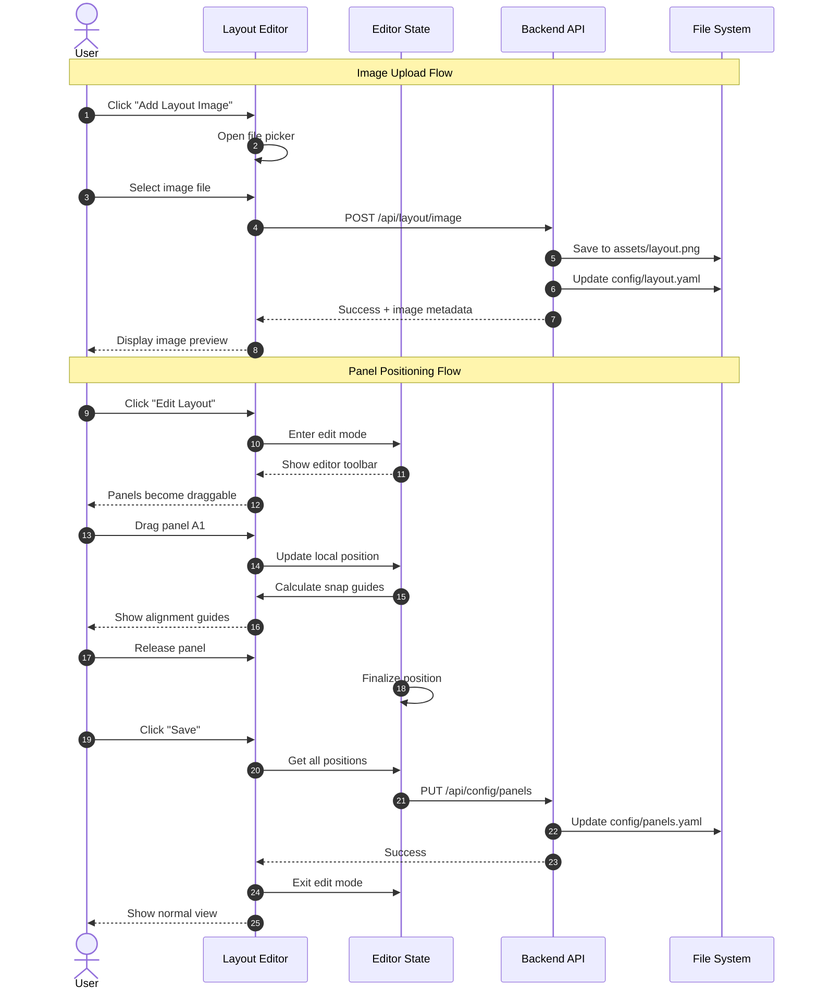

# Multi-User Configuration - Phase 2: Layout Editor

This specification defines the interactive layout editor that enables users to visually position solar panel overlays on their custom layout images. This is Phase 2 of the multi-user configuration feature, building on the configuration infrastructure established in Phase 1.

## Motivation

Phase 1 delivers a functional setup wizard with a grid/tile view for monitoring panels. However, the core value proposition of Solar Tigo Viewer is visualizing panel performance overlaid on an actual layout image (floor plan, roof diagram, aerial photo).

Phase 2 enables users to:
1. Upload their own layout image
2. Visually position panel overlays using drag-and-drop
3. Align panels precisely with snap-to-align helpers
4. Adjust overlay sizes to match their image resolution

This transforms the generic grid view into a personalized, spatial visualization of their solar installation.

## Functional Requirements

### FR-1: Layout Image Management

**FR-1.1: Image Upload**

The dashboard MUST support layout image upload:
- Accepted formats: PNG, JPEG, WebP
- Maximum file size: 10MB
- Image stored in `assets/layout.png` (git-ignored)
- Previous image backed up as `assets/layout.backup.png` before overwrite

**FR-1.2: Image Preview**

After upload, the dashboard MUST display:
- Image preview at actual aspect ratio
- Image dimensions (width x height pixels)
- File size
- Option to re-upload or remove

**FR-1.3: No Image State**

If no layout image exists:
- Dashboard displays grid/tile view (Phase 1 behavior)
- "Add Layout Image" button prominently displayed
- Tooltip explains benefit of adding a layout image

**FR-1.4: Image Configuration Storage**

Layout image metadata MUST be stored in `config/layout.yaml`:

```yaml
layout:
  image_path: "assets/layout.png"
  image_width: 1920
  image_height: 1080
  overlay_size: 50  # Base overlay size in pixels (adjustable)
```

### FR-2: Layout Editor Mode

**FR-2.1: Editor Mode Toggle**

The dashboard MUST provide an "Edit Layout" mode:
- Toggle button in header/toolbar
- When active, panels become draggable
- Visual indicator that edit mode is active (e.g., border, badge)
- Exit edit mode via "Done" button or Escape key

**FR-2.2: Editor Toolbar**

When in edit mode, display a toolbar with:
- Overlay size slider (FR-3)
- Snap-to-grid toggle (FR-4)
- Reset positions button (with confirmation)
- Save button
- Cancel button (discard unsaved changes)

**FR-2.3: Unsaved Changes Warning**

If user attempts to exit edit mode with unsaved changes:
- Display confirmation dialog
- Options: "Save", "Discard", "Cancel"

### FR-3: Panel Overlay Positioning

**FR-3.1: Drag-and-Drop**

In edit mode, each panel overlay MUST be draggable:
- Click and drag to move
- Visual feedback during drag (slight opacity, shadow)
- Position updates in real-time
- Constrained to image boundaries (cannot drag outside)

**FR-3.2: Position Storage**

Panel positions MUST be stored as percentages in `config/panels.yaml`:

```yaml
panels:
  - serial: "4-C3F23CR"
    # ... other fields from Phase 1
    position:
      x_percent: 35.5
      y_percent: 11.75
```

Percentage-based positioning ensures positions remain valid across different display sizes.

**FR-3.3: Touch Support**

Drag-and-drop MUST work on touch devices:
- Touch and drag gesture
- Prevent page scroll while dragging
- Visual feedback for touch targets

**FR-3.4: Keyboard Positioning**

Selected panels MUST support keyboard positioning:
- Arrow keys: Move by 1 pixel
- Shift + Arrow keys: Move by 10 pixels
- Tab: Select next panel
- Shift + Tab: Select previous panel

**FR-3.5: Multi-Select**

Users MUST be able to select and move multiple panels:
- Ctrl/Cmd + Click to add to selection
- Shift + Click to select range (by string order)
- Drag selection box to select multiple
- Move all selected panels together
- Visual indication of selected panels (highlight border)

### FR-4: Snap-to-Align

**FR-4.1: Alignment Guides**

When dragging a panel, display alignment guides:
- Vertical guide when panel center aligns with another panel's center (X)
- Horizontal guide when panel center aligns with another panel's center (Y)
- Edge guides when panel edges align
- Guides appear as thin colored lines (e.g., cyan)

**FR-4.2: Snap Behavior**

Panels MUST snap to alignment guides when within threshold:
- Snap threshold: 10 pixels (configurable)
- Magnetic snap when approaching alignment point
- Hold Shift while dragging to temporarily disable snap

**FR-4.3: Grid Snap (Optional)**

Optional grid snap mode:
- Toggle in toolbar
- When enabled, panels snap to invisible grid
- Grid size derived from overlay size
- Useful for creating uniform arrangements

**FR-4.4: Smart Distribution**

When multiple panels are selected, provide distribution options:
- "Distribute Horizontally" - Equal horizontal spacing
- "Distribute Vertically" - Equal vertical spacing
- "Align Left/Right/Top/Bottom" - Align edges
- "Align Center" - Align centers

### FR-5: Overlay Size Control

**FR-5.1: Global Size Slider**

The editor toolbar MUST include an overlay size slider:
- Range: 20px to 200px (base size)
- Default: 50px
- Real-time preview as slider moves
- Affects all panel overlays uniformly

**FR-5.2: Size Persistence**

Selected overlay size MUST be saved in `config/layout.yaml`:
- Persists across sessions
- Applied on dashboard load

**FR-5.3: Aspect Ratio**

Panel overlays MUST maintain consistent aspect ratio:
- Default: Square (1:1)
- Size slider controls the base dimension
- All panels use same size for visual consistency

**FR-5.4: Responsive Scaling**

Overlay size MUST scale proportionally with image display size:
- If image displays at 50% of actual size, overlays display at 50%
- Maintains visual relationship at any zoom level

### FR-6: Panel Identification During Editing

**FR-6.1: Panel Labels**

During edit mode, each panel overlay MUST display:
- Display label (e.g., "A1", "F6")
- String color coding (same color for panels in same string)
- Serial number on hover/long-press

**FR-6.2: Unpositioned Panel Indicator**

Panels without positions MUST be clearly indicated:
- Listed in a "Panels to Position" sidebar/drawer
- Can be dragged from sidebar onto the layout image
- Count badge showing "X panels need positioning"

**FR-6.3: Panel Search**

In edit mode, provide panel search:
- Search by label, serial number, or string
- Matching panel highlighted/flashing on layout
- Search result shows panel details

### FR-7: Layout View (Non-Edit Mode)

**FR-7.1: Live Data Display**

In normal view mode, panel overlays MUST show live data:
- Current power output (watts)
- Color-coded by status:
  - Green: Producing normally
  - Yellow: Low output
  - Red: Offline/error
  - Gray: No data
- Value updates in real-time via WebSocket

**FR-7.2: View Options**

Users MUST be able to toggle overlay display content:
- Watts (default)
- Voltage
- Label only
- Hidden (show layout image only)

**FR-7.3: Hover/Click Details**

Interacting with a panel overlay MUST show details:
- Hover: Tooltip with label, watts, voltage, serial
- Click: Expanded panel card with full details and history

### FR-8: Initial Panel Placement

**FR-8.1: Auto-Arrange for New Setups**

When entering edit mode with unpositioned panels:
- Offer "Auto-Arrange" option
- Place panels in a grid pattern, grouped by string
- Grid positioned in center of image
- User then drags to actual positions

**FR-8.2: Import from Phase 1 Grid**

If panels have no positions but Phase 1 grid view was in use:
- Offer to derive initial positions from grid arrangement
- Maps grid positions to percentage-based image positions
- Provides starting point for refinement

### FR-9: Configuration Persistence

**FR-9.1: Auto-Save Draft**

While editing, periodically auto-save draft positions:
- Save to browser localStorage every 30 seconds
- Restore draft if browser closes unexpectedly
- Clear draft when user explicitly saves or discards

**FR-9.2: Save to Config**

When user clicks "Save":
- Update panel positions in `config/panels.yaml`
- Update overlay size in `config/layout.yaml`
- Show success notification
- Exit edit mode

**FR-9.3: Version History (Optional)**

Maintain position history for rollback:
- Store last 5 saved configurations
- "Undo" option to revert to previous save
- History stored in `config/.layout-history/`

## Non-Functional Requirements

**NFR-1: Editor Performance**

- Drag operations MUST render at 60fps
- Snap calculations MUST complete in <16ms
- Layout with 100+ panels MUST remain responsive

**NFR-2: Touch Responsiveness**

- Touch drag MUST initiate within 100ms
- No touch delay or ghost clicks
- Support for common tablet sizes (iPad, Android tablets)

**NFR-3: Image Loading**

- Layout images up to 10MB MUST load within 3 seconds
- Progressive loading for large images
- Placeholder shown during load

**NFR-4: Accessibility**

- All editor controls MUST be keyboard accessible
- Screen reader announcements for drag operations
- Sufficient color contrast for alignment guides
- Focus indicators for selected panels

**NFR-5: Mobile Responsiveness**

- Editor usable on tablet (768px+)
- On phone (<768px), show warning that editor works best on larger screens
- Grid view remains fully functional on phone

## High Level Design



### Component Architecture

```
┌─────────────────────────────────────────────────────────────────┐
│                        Layout Editor                             │
├─────────────────────────────────────────────────────────────────┤
│  ┌─────────────────┐  ┌─────────────────┐  ┌─────────────────┐ │
│  │  Editor Toolbar │  │  Overlay Size   │  │   Snap Toggle   │ │
│  │                 │  │     Slider      │  │                 │ │
│  └─────────────────┘  └─────────────────┘  └─────────────────┘ │
├─────────────────────────────────────────────────────────────────┤
│  ┌─────────────────────────────────────────────────────────┐   │
│  │                                                         │   │
│  │                    Layout Canvas                        │   │
│  │                                                         │   │
│  │   ┌─────────────────────────────────────────────────┐  │   │
│  │   │              Layout Image                        │  │   │
│  │   │                                                  │  │   │
│  │   │    ┌────┐  ┌────┐  ┌────┐                       │  │   │
│  │   │    │ A1 │  │ A2 │  │ A3 │  Panel Overlays      │  │   │
│  │   │    └────┘  └────┘  └────┘                       │  │   │
│  │   │                                                  │  │   │
│  │   │         ═══════════════  Alignment Guide        │  │   │
│  │   │                                                  │  │   │
│  │   │    ┌────┐  ┌────┐                               │  │   │
│  │   │    │ B1 │  │ B2 │                               │  │   │
│  │   │    └────┘  └────┘                               │  │   │
│  │   └─────────────────────────────────────────────────┘  │   │
│  │                                                         │   │
│  └─────────────────────────────────────────────────────────┘   │
├─────────────────────────────────────────────────────────────────┤
│  ┌─────────────────────────────────────────────────────────┐   │
│  │  Unpositioned Panels: [D1] [D2] [D3] (drag to place)    │   │
│  └─────────────────────────────────────────────────────────┘   │
└─────────────────────────────────────────────────────────────────┘
```

### Snap-to-Align Algorithm

```typescript
interface Point {
  x: number;
  y: number;
}

interface SnapResult {
  position: Point;
  guides: AlignmentGuide[];
}

interface AlignmentGuide {
  type: 'vertical' | 'horizontal';
  position: number;  // x for vertical, y for horizontal
  start: number;
  end: number;
}

const SNAP_THRESHOLD = 10;  // pixels

function calculateSnap(
  draggingPanel: Panel,
  dragPosition: Point,
  otherPanels: Panel[],
  snapEnabled: boolean
): SnapResult {
  if (!snapEnabled) {
    return { position: dragPosition, guides: [] };
  }

  const guides: AlignmentGuide[] = [];
  let snappedX = dragPosition.x;
  let snappedY = dragPosition.y;

  const dragCenterX = dragPosition.x + draggingPanel.width / 2;
  const dragCenterY = dragPosition.y + draggingPanel.height / 2;

  for (const panel of otherPanels) {
    if (panel.serial === draggingPanel.serial) continue;

    const panelCenterX = panel.position.x + panel.width / 2;
    const panelCenterY = panel.position.y + panel.height / 2;

    // Check vertical alignment (X centers match)
    const xDiff = Math.abs(dragCenterX - panelCenterX);
    if (xDiff < SNAP_THRESHOLD) {
      snappedX = panelCenterX - draggingPanel.width / 2;
      guides.push({
        type: 'vertical',
        position: panelCenterX,
        start: Math.min(dragPosition.y, panel.position.y),
        end: Math.max(
          dragPosition.y + draggingPanel.height,
          panel.position.y + panel.height
        )
      });
    }

    // Check horizontal alignment (Y centers match)
    const yDiff = Math.abs(dragCenterY - panelCenterY);
    if (yDiff < SNAP_THRESHOLD) {
      snappedY = panelCenterY - draggingPanel.height / 2;
      guides.push({
        type: 'horizontal',
        position: panelCenterY,
        start: Math.min(dragPosition.x, panel.position.x),
        end: Math.max(
          dragPosition.x + draggingPanel.width,
          panel.position.x + panel.width
        )
      });
    }

    // Check edge alignments (left, right, top, bottom)
    // ... similar logic for edges
  }

  return {
    position: { x: snappedX, y: snappedY },
    guides: deduplicateGuides(guides)
  };
}
```

### Position Percentage Conversion

```typescript
function pixelToPercent(
  pixelPos: Point,
  imageSize: { width: number; height: number }
): { x_percent: number; y_percent: number } {
  return {
    x_percent: (pixelPos.x / imageSize.width) * 100,
    y_percent: (pixelPos.y / imageSize.height) * 100
  };
}

function percentToPixel(
  percentPos: { x_percent: number; y_percent: number },
  displaySize: { width: number; height: number }
): Point {
  return {
    x: (percentPos.x_percent / 100) * displaySize.width,
    y: (percentPos.y_percent / 100) * displaySize.height
  };
}
```

### Draft Auto-Save

```typescript
const DRAFT_KEY = 'solar-tigo-layout-draft';
const AUTO_SAVE_INTERVAL = 30000;  // 30 seconds

interface LayoutDraft {
  timestamp: number;
  positions: Map<string, { x_percent: number; y_percent: number }>;
  overlaySize: number;
}

function startAutoSave(editorState: EditorState) {
  return setInterval(() => {
    const draft: LayoutDraft = {
      timestamp: Date.now(),
      positions: editorState.panelPositions,
      overlaySize: editorState.overlaySize
    };
    localStorage.setItem(DRAFT_KEY, JSON.stringify(draft));
  }, AUTO_SAVE_INTERVAL);
}

function checkForDraft(): LayoutDraft | null {
  const saved = localStorage.getItem(DRAFT_KEY);
  if (!saved) return null;

  const draft = JSON.parse(saved) as LayoutDraft;

  // Only restore drafts less than 24 hours old
  if (Date.now() - draft.timestamp > 24 * 60 * 60 * 1000) {
    localStorage.removeItem(DRAFT_KEY);
    return null;
  }

  return draft;
}

function clearDraft() {
  localStorage.removeItem(DRAFT_KEY);
}
```

## Task Breakdown

### Backend Tasks

1. **Create layout image upload endpoint**
   - POST /api/layout/image
   - Validate file type and size
   - Save to assets/layout.png
   - Return image metadata

2. **Create layout configuration endpoints**
   - GET /api/layout - Get layout config
   - PUT /api/layout - Update layout config (overlay size)
   - Extend panels.yaml schema for positions

3. **Add layout.yaml configuration support**
   - Define schema
   - Read/write service
   - Default values

4. **Serve layout image via API**
   - GET /api/layout/image
   - Proper caching headers
   - Handle missing image gracefully

### Frontend Tasks

5. **Create Layout Editor component**
   - Editor mode state management
   - Toolbar component
   - Mode toggle button

6. **Implement image upload flow**
   - File picker
   - Upload progress
   - Preview display
   - Error handling

7. **Implement draggable panel overlays**
   - React DnD or custom drag implementation
   - Position state management
   - Boundary constraints

8. **Implement snap-to-align system**
   - Alignment guide rendering
   - Snap calculation logic
   - Toggle control

9. **Implement overlay size slider**
   - Range input with live preview
   - Debounced updates
   - Persistence

10. **Implement multi-select functionality**
    - Selection state management
    - Ctrl/Cmd + Click handling
    - Drag selection box
    - Group movement

11. **Implement distribution/alignment tools**
    - Distribute horizontally/vertically
    - Align edges and centers
    - UI buttons in toolbar

12. **Implement keyboard navigation**
    - Arrow key positioning
    - Tab selection cycling
    - Keyboard shortcuts

13. **Implement unpositioned panels drawer**
    - List unpositioned panels
    - Drag from drawer to canvas
    - Panel count badge

14. **Implement auto-save draft system**
    - localStorage persistence
    - Draft recovery prompt
    - Clear on save/discard

15. **Implement save/cancel flow**
    - Save to backend
    - Unsaved changes warning
    - Success/error notifications

16. **Update Layout View for live data**
    - Panel overlay with watts display
    - Color-coded status
    - View options toggle
    - Hover/click details

17. **Implement touch support**
    - Touch event handlers
    - Scroll prevention during drag
    - Touch-friendly targets

### Integration Tasks

18. **Integrate editor with Phase 1 wizard**
    - Add optional "Set up layout" step after wizard completion
    - Link to editor from grid view

19. **Update .gitignore for layout assets**
    - Add assets/layout.png
    - Add config/layout.yaml
    - Add config/.layout-history/

20. **Create layout.example.yaml template**
    - Document all options
    - Provide sensible defaults

21. **Update documentation**
    - Layout editor user guide
    - Keyboard shortcuts reference

## Context / Documentation

### Files to Reference During Implementation

| File | Purpose |
|------|---------|
| `config/panel_mapping.json` | Current position format reference |
| `dashboard/frontend/src/components/` | Existing component patterns |
| `dashboard/frontend/src/App.tsx` | Routing and state management patterns |
| Phase 1 spec | Panel configuration schema |

### Libraries to Evaluate

| Library | Purpose | Notes |
|---------|---------|-------|
| `@dnd-kit/core` | Drag and drop | Modern, accessible, touch support |
| `react-draggable` | Alternative DnD | Simpler but less features |
| `use-gesture` | Touch gestures | Works with any drag solution |

### External Documentation

- [@dnd-kit Documentation](https://docs.dndkit.com/)
- [React Drag and Drop Patterns](https://react.dev/learn/responding-to-events)
- [Touch Events MDN](https://developer.mozilla.org/en-US/docs/Web/API/Touch_events)

---

**Specification Version:** 1.0
**Last Updated:** January 2026
**Authors:** Claude (AI Assistant)

## Changelog

### v1.0 (January 2026)
**Summary:** Initial specification for layout editor

**Changes:**
- Initial specification created
- Defined image upload and management
- Specified drag-and-drop positioning with snap-to-align
- Defined overlay size controls
- Specified multi-select and distribution tools
