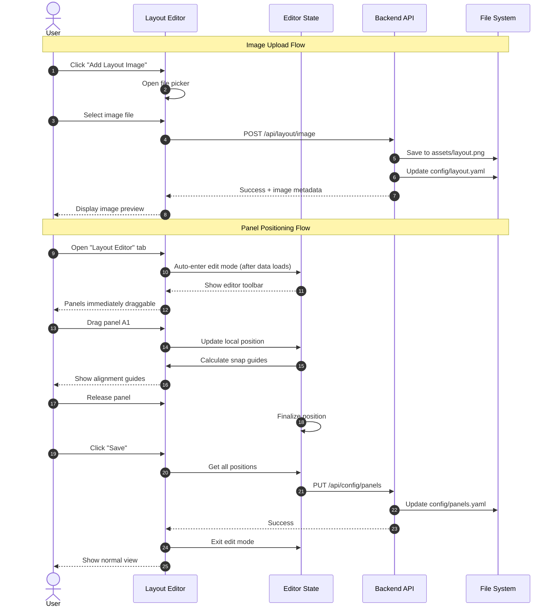

# Multi-User Configuration - Phase 2: Layout Editor

This specification defines the interactive layout editor that enables users to visually position solar panel overlays on their custom layout images. This is Phase 2 of the multi-user configuration feature, building on the configuration infrastructure established in Phase 1.

## Motivation

Phase 1 delivers a functional setup wizard with a grid/tile view for monitoring panels. However, the core value proposition of Solar Tigo Viewer is visualizing panel performance overlaid on an actual layout image (floor plan, roof diagram, aerial photo).

Phase 2 enables users to:
1. Upload their own layout image
2. Visually position panel overlays using drag-and-drop
3. Align panels precisely with snap-to-align helpers
4. Adjust overlay sizes to match their image resolution

This transforms the generic grid view into a personalized, spatial visualization of their solar installation.

## Functional Requirements

### FR-1: Layout Image Management

**FR-1.1: Image Upload**

The dashboard MUST support layout image upload:
- Accepted formats: PNG, JPEG, WebP
- Maximum file size: 10MB
- Image stored in `assets/layout.png` (git-ignored)
- Previous image backed up as `assets/layout.backup.png` before overwrite

**FR-1.2: Image Preview**

After upload, the dashboard MUST display:
- Image preview at actual aspect ratio
- Image dimensions (width x height pixels)
- File size
- Option to re-upload or remove

**FR-1.3: No Image State**

If no layout image exists:
- Dashboard displays grid/tile view (Phase 1 behavior)
- "Add Layout Image" button prominently displayed
- Tooltip explains benefit of adding a layout image

**FR-1.4: Image Configuration Storage**

Layout image metadata MUST be stored in `config/layout.yaml`:

```yaml
layout:
  image_path: "assets/layout.png"
  image_width: 1920
  image_height: 1080
  image_hash: "sha256:a1b2c3..."  # Detect if image changed
  aspect_ratio: 1.778             # Width/height ratio (for validation)
  overlay_size: 50                # Base overlay size in pixels (adjustable)
  last_modified: "2026-01-19T12:00:00Z"
```

**Image Change Detection:**
- On image upload, compute SHA256 hash and store
- On dashboard load, compare current image hash with stored hash
- If hash differs: prompt user "Layout image has changed. Panel positions may need adjustment."
- Aspect ratio change > 5% triggers stronger warning about position validity

**Image Change Warning UX Flow:**
1. User uploads new image → Upload succeeds, hash is computed
2. If previous image existed AND hash differs:
   - Modal appears: "Layout image has changed. Panel positions may need adjustment."
   - If aspect ratio changed >5%: "Warning: Aspect ratio has significantly changed. Positions may appear distorted."
3. User options:
   - **"Keep Positions"** (default): Close modal, positions preserved, user can adjust in editor
   - **"Reset All Positions"**: Clear all positions, close modal, automatically enter Edit Layout mode with all panels in unpositioned sidebar
4. After choosing either option, user can enter Edit Layout mode to adjust/position panels

### FR-2: Layout Editor Mode

**FR-2.1: Auto-Enter Edit Mode**

The Layout Editor tab MUST automatically enter edit mode on load:
- When the "Layout Editor" tab is selected, edit mode is entered immediately after data loads
- No separate "Edit Layout" button is required (the tab name itself implies editing intent)
- Panels are immediately draggable upon tab load
- Exit edit mode via "Discard" button or Escape key (returns to previous tab)

**FR-2.2: Editor Toolbar**

The toolbar displays editing controls immediately (no non-edit-mode state):
- Undo/Redo buttons
- Snap-to-align toggle (FR-4)
- Overlay size slider (FR-3)
- Upload Image button
- Selection info (when panels are selected)
- Discard button (exit without saving)
- Save button

**FR-2.3: Unsaved Changes Warning**

If user attempts to exit edit mode with unsaved changes:
- Display confirmation dialog
- Options: "Save", "Discard", "Cancel"

### FR-3: Panel Overlay Positioning

**FR-3.1: Drag-and-Drop**

In edit mode, each panel overlay MUST be draggable:
- Click and drag to move
- Visual feedback during drag (slight opacity, shadow)
- Position updates in real-time
- Constrained to image boundaries (cannot drag outside)

**FR-3.2: Position Storage**

Panel positions MUST be stored as percentages in `config/panels.yaml`:

```yaml
panels:
  - serial: "4-C3F23CR"
    # ... other fields from Phase 1
    position:
      x_percent: 35.5
      y_percent: 11.75
```

Percentage-based positioning ensures positions remain valid across different display sizes.

**FR-3.3: Touch Support**

Drag-and-drop MUST work on touch devices:
- Touch drag initiates after 250ms hold OR 8px movement (prevents scroll conflicts)
- Prevent page scroll while dragging (`touch-action: none` on drag area)
- Visual feedback for touch targets (scale up 1.1× on touch start)
- Minimum touch target size: 48×48px (Material Design guideline)

**Touch Sensor Configuration:**
```typescript
const touchSensor = useSensor(TouchSensor, {
  activationConstraint: {
    delay: 250,
    tolerance: 8,
  },
});
```

**Gesture Conflicts:**
- Pinch-to-zoom (if enabled): Panel drag only activates with single touch
- Pull-to-refresh: Disabled on editor canvas via CSS `overscroll-behavior: none`
- Haptic feedback: Optional vibration on snap events (if device supports)

**FR-3.4: Keyboard Positioning**

Selected panels MUST support keyboard positioning:
- Arrow keys: Move by 1 pixel
- Shift + Arrow keys: Move by 10 pixels
- Tab: Select next panel
- Shift + Tab: Select previous panel

**FR-3.5: Multi-Select**

Users MUST be able to select and move multiple panels:
- Ctrl/Cmd + Click to add to selection
- Shift + Click to select range (by string order)
- Drag selection box to select multiple (canvas-based for performance)
- Move all selected panels together
- Visual indication of selected panels (highlight border)

**Selection Enhancements for Large Layouts:**
- Selection counter badge showing "N selected" in toolbar
- "Select All" / "Deselect All" buttons
- "Select String..." dropdown to select all panels in a specific string
- Lasso mode: selection box selects panels that intersect, not just fully contained
- Warning if group move would cause overlapping positions

**Touch Multi-Select:**
- Long-press (500ms) on panel enters multi-select mode
- Tap additional panels to add/remove from selection
- "Done" button or tap empty area to exit multi-select mode
- Two-finger tap as alternative to Ctrl+Click

**FR-3.6: Single-Pointer Positioning Alternative (WCAG 2.2 Compliance)**

Per WCAG 2.2 Success Criterion 2.5.7 (Level AA), all drag functionality MUST have a single-pointer alternative:

- Click/tap panel to select it (shows selection highlight)
- Click/tap destination location on canvas to move selected panel there
- Visual indicator shows where panel will land before confirming
- Alternative: Arrow buttons appear around selected panel for incremental 10px moves

**Confirmation Mechanism:**
1. Click panel to select → panel shows highlight
2. Click destination on canvas → ghost preview appears at destination
3. To confirm: click the ghost preview OR press Enter
4. To cancel: click elsewhere OR press Escape
5. Auto-cancel after 3 seconds of no interaction

This two-step confirm ensures users don't accidentally move panels and enables users who cannot perform drag gestures to still reposition panels.

### FR-4: Snap-to-Align

**FR-4.1: Alignment Guides**

When dragging a panel, display center-to-center alignment guides:
- Vertical guide when panel center aligns with another panel's center (X)
- Horizontal guide when panel center aligns with another panel's center (Y)
- Guides appear as thin colored lines (dark cyan #008B8B with white outline for visibility on any background)

**Note:** Edge alignment (left-to-left, right-to-right) is intentionally omitted for simplicity. Center alignment is sufficient for typical solar panel layout editing. Edge alignment can be added as a future enhancement if needed.

**Implementation Approach:**
Use @dnd-kit's modifier pattern with callbacks for guide state:
```typescript
import { createSnapModifier } from '@dnd-kit/modifiers';

// Grid snap using built-in modifier
const gridSize = overlaySize;
const snapToGridModifier = createSnapModifier(gridSize);

// Smart guide modifier: PURE FUNCTION (no setState inside!)
const smartGuideModifier = useMemo(() => {
  return ({ transform, activeNodeRect }) => {
    if (!activeNodeRect) return transform;
    // Convert transform delta to absolute position for snap calculation
    const dragPosition = {
      x: activeNodeRect.left + transform.x,
      y: activeNodeRect.top + transform.y
    };
    const { position } = calculateSnap(
      { width: activeNodeRect.width, height: activeNodeRect.height },
      dragPosition,
      spatialIndex,
      true
    );
    return {
      ...transform,
      x: position.x - activeNodeRect.left,
      y: position.y - activeNodeRect.top
    };
  };
}, [spatialIndex]);

// Guide state updates via callback (NOT inside modifier)
// Use initial rect + delta to match modifier's position calculation
// Note: Do NOT use `translated` + delta (double-counting transform)
const handleDragMove = useCallback(({ active, delta }) => {
  const initialRect = active.rect.current.initial;
  if (!initialRect) return;
  // initial rect + delta = same position modifier calculates
  const dragPosition = {
    x: initialRect.left + delta.x,
    y: initialRect.top + delta.y
  };
  const { guides } = calculateSnap(
    { width: initialRect.width, height: initialRect.height },
    dragPosition,
    spatialIndex,
    true
  );
  setActiveGuides(guides);
}, [spatialIndex]);

// Implementation note: @dnd-kit's `active.rect.current` provides:
// - `initial`: Original bounding rect before any transform
// - `translated`: Bounding rect WITH current transform applied
// The modifier receives `activeNodeRect` which is the initial rect,
// so callback must use `initial + delta` (not `translated + delta`).

<DndContext
  onDragMove={handleDragMove}
  modifiers={[smartGuideModifier]}
>
```
This separates pure snap calculation (modifier) from React state updates (callback).

**FR-4.2: Snap Behavior**

Panels MUST snap to alignment guides when within threshold:
- Snap threshold: 10 pixels at 100% zoom (scales with zoom level)
- Immediate snap when entering threshold (not gradual/magnetic)
- Hold Shift while dragging to temporarily disable snap

**Snap Priority (when multiple alignments possible):**
1. Center alignment (highest priority)
2. Edge alignment
3. Closest distance wins ties

**Threshold Scaling:**
- At 50% zoom: effective threshold = 20 image pixels
- At 200% zoom: effective threshold = 5 image pixels
- Formula: `effectiveThreshold = SNAP_THRESHOLD / currentZoom`

**Optional Feedback:**
- Haptic vibration on snap (touch devices, if supported)
- Subtle audio click (configurable, default off)

**FR-4.3: Grid Snap (Optional)**

Optional grid snap mode:
- Toggle in toolbar
- When enabled, panels snap to invisible grid
- Grid size derived from overlay size
- Useful for creating uniform arrangements

**FR-4.4: Smart Distribution**

When multiple panels are selected, provide distribution options:
- "Distribute Horizontally" - Equal horizontal spacing
- "Distribute Vertically" - Equal vertical spacing
- "Align Left/Right/Top/Bottom" - Align edges
- "Align Center" - Align centers

### FR-5: Overlay Size Control

**FR-5.1: Global Size Slider**

The editor toolbar MUST include an overlay size slider:
- Range: 20px to 200px (base size)
- Default: 50px
- Real-time preview as slider moves
- Affects all panel overlays uniformly

**FR-5.2: Size Persistence**

Selected overlay size MUST be saved in `config/layout.yaml`:
- Persists across sessions
- Applied on dashboard load

**FR-5.3: Aspect Ratio**

Panel overlays MUST maintain consistent aspect ratio:
- Default: Square (1:1)
- Size slider controls the base dimension
- All panels use same size for visual consistency

**FR-5.4: Responsive Scaling**

Overlay size MUST scale proportionally with image display size:
- If image displays at 50% of actual size, overlays display at 50%
- Maintains visual relationship at any zoom level

**Zoom Interaction (with react-zoom-pan-pinch):**
- Overlay scaling compounds with zoom: `renderedSize = baseSize × displayScale × zoomLevel`
- At very low zoom (10%), overlays may become too small to read
- At very high zoom (200%+), overlays may become too large relative to image

**Size Constraints:**
```typescript
const MIN_RENDERED_SIZE = 20;  // pixels - minimum for readability
const MAX_RENDERED_SIZE = 150; // pixels - maximum for usability

const renderedSize = Math.max(
  MIN_RENDERED_SIZE,
  Math.min(MAX_RENDERED_SIZE, baseSize * displayScale * zoomLevel)
);
```

**Clickability at High Zoom:**
- Panels remain clickable/draggable at all zoom levels
- Hit area scales with visual size (no fixed minimum for interaction)

### FR-6: Panel Identification During Editing

**FR-6.1: Panel Labels**

During edit mode, each panel overlay MUST display:
- Display label (e.g., "A1", "F6")
- String color coding (same color for panels in same string)
- Serial number on hover/long-press

**FR-6.2: Unpositioned Panel Indicator**

Panels without positions MUST be clearly indicated:
- Listed in a "Panels to Position" sidebar/drawer
- Can be dragged from sidebar onto the layout image
- Count badge showing "X panels need positioning"

**Sidebar Enhancements:**
- Sidebar state (collapsed/expanded) persists in localStorage
- Filter by string: dropdown to show "All", "String A", "String B", etc.
- "Place All Remaining" button: auto-arranges all unpositioned panels (uses FR-8.1 logic)
- Drag from sidebar uses @dnd-kit's multiple droppable containers pattern

**Sidebar-to-Canvas Drag:**
```typescript
// Sidebar panels use Draggable from @dnd-kit
// Canvas is a DroppableContainer
// On drop outside existing panel area, panel gets positioned at drop point
<DndContext onDragEnd={handleDragEnd}>
  <UnpositionedPanelsSidebar panels={unpositioned} />
  <LayoutCanvas panels={positioned} />
</DndContext>
```

**FR-6.3: Panel Search**

In edit mode, provide panel search:
- Search by label, serial number, or string
- Matching panel highlighted/flashing on layout
- Search result shows panel details

### FR-7: Layout View (Non-Edit Mode)

**FR-7.1: Live Data Display**

In normal view mode, panel overlays MUST show live data:
- Current power output (watts)
- Color-coded by status:
  - Green: Producing normally
  - Yellow: Low output
  - Red: Offline/error
  - Gray: No data
- Value updates in real-time via WebSocket

**FR-7.2: View Options**

Users MUST be able to toggle overlay display content:
- Watts (default)
- Voltage
- Percentage of peak (panel's current output vs. historical max)
- Label only
- Hidden (show layout image only)

**View Option Enhancements:**
- Selected view option persists in localStorage (UI preference, not config file)
- Keyboard shortcuts: 1=Watts, 2=Voltage, 3=Percentage, 4=Label, 5=Hidden
- Show active view option in toolbar with dropdown

**FR-7.3: Hover/Click Details**

Interacting with a panel overlay MUST show details:
- Hover: Tooltip with label, watts, voltage, serial
- Click: Expanded panel card with full details and history

### FR-8: Initial Panel Placement

**FR-8.1: Auto-Arrange for New Setups**

When entering edit mode with unpositioned panels:
- Offer "Auto-Arrange" option
- Place panels in a grid pattern, grouped by string (mirrors Phase 1 grid view layout)
- Grid positioned in center of image
- User then drags to actual positions

**Auto-Arrange Algorithm:**
1. Group panels by string (A, B, C, etc.)
2. Calculate grid dimensions based on panel count and overlay size
3. Place each string group as a row
4. Center the entire arrangement on the layout image
5. Add small gaps between strings for visual separation

This provides a starting point similar to how panels appear in the Phase 1 grid view, making the transition intuitive.

### FR-9: Configuration Persistence

**FR-9.1: Auto-Save Draft (Local Only)**

While editing, auto-save draft positions to localStorage on every change:
- Save to browser localStorage on every position change (event-driven, not interval-based)
- Draft is LOCAL ONLY - not saved to server until explicit Save
- Clear draft when user explicitly saves or discards

**Visual Draft Indicator:**
- Yellow dot indicator when unsaved changes exist
- Tooltip clarifies: "Changes saved locally. Click Save to persist."

**Draft Recovery on Tab Load:**
- If draft exists, show banner at top of editor: "Unsaved layout changes from [timestamp]"
- Options: "Resume Draft", "Discard"

**Multi-Tab Conflict:**
- Use BroadcastChannel API to detect concurrent editing
- If another tab is editing, show warning: "Layout is being edited in another tab"
- Last-write-wins for localStorage (same as Phase 1)

**Server State Conflict:**
- On draft restore, compare server timestamp with draft timestamp
- If server state is newer: "Warning: Layout was modified on [date]. Your draft may overwrite those changes."

**Draft Recovery Edge Cases:**
- **Panel deleted in another session:** On draft restore, filter out positions for panels that no longer exist. Show info message: "Note: X panels in draft no longer exist and were skipped."
- **Panel added in another session:** New panels appear in unpositioned sidebar as normal.

**FR-9.2: Save to Config**

When user clicks "Save":
- Update panel positions in `config/panels.yaml`
- Update overlay size in `config/layout.yaml`
- Show success notification
- Exit edit mode

**FR-9.3: Version History (Optional)**

Maintain position history for rollback:
- Store last 5 saved configurations
- "Undo" option to revert to previous save
- History stored in `config/.layout-history/`

**FR-9.4: Undo/Redo (Required)**

In-session undo/redo for position changes:
- Ctrl+Z / Cmd+Z to undo
- Ctrl+Y / Cmd+Shift+Z to redo
- History stack tracks position changes during edit session
- History cleared on Save or Cancel
- Multi-select group moves count as ONE history entry

**Scope:** Undo/redo applies to panel positions only. Overlay size changes are NOT undoable (they're applied immediately and can be manually reverted via slider).

**Implementation:**
```typescript
interface EditHistory {
  states: PanelPositionMap[];  // Array of position snapshots
  currentIndex: number;        // Current position in history
}

// IMPORTANT: Initialize with starting positions when entering edit mode
function initializeHistory(positions: PanelPositionMap): EditHistory {
  return {
    states: [structuredClone(positions)],  // Index 0 = initial state
    currentIndex: 0
  };
}

// Record state after each drag ends (or group move ends)
function recordHistoryState(history: EditHistory, positions: PanelPositionMap) {
  // Truncate any "future" states if we've undone then made new changes
  history.states = history.states.slice(0, history.currentIndex + 1);
  history.states.push(structuredClone(positions));
  history.currentIndex = history.states.length - 1;

  // Limit history depth (memory: 50 states × 100 panels × 50 bytes ≈ 250KB)
  if (history.states.length > 50) {
    history.states.shift();
    history.currentIndex--;
  }
}

function canUndo(history: EditHistory): boolean {
  return history.currentIndex > 0;
}

function canRedo(history: EditHistory): boolean {
  return history.currentIndex < history.states.length - 1;
}

function undo(history: EditHistory): PanelPositionMap | null {
  if (!canUndo(history)) return null;
  history.currentIndex--;
  return history.states[history.currentIndex];
}

function redo(history: EditHistory): PanelPositionMap | null {
  if (!canRedo(history)) return null;
  history.currentIndex++;
  return history.states[history.currentIndex];
}
```

**UI Indicators:**
- Undo button disabled when `!canUndo()` (at initial state)
- Redo button disabled when `!canRedo()` (at latest state)
- Keyboard shortcuts shown in tooltip: "Undo (Ctrl+Z)" / "Redo (Ctrl+Y)"

## Non-Functional Requirements

**NFR-1: Editor Performance**

- Drag operations MUST render at 60fps
- Snap calculations MUST complete in <16ms
- Layout with 100+ panels MUST remain responsive

**Performance Measurement:**
```typescript
// Add performance marks for critical paths
performance.mark('snap-calc-start');
const result = calculateSnap(...);
performance.mark('snap-calc-end');
performance.measure('snap-calc', 'snap-calc-start', 'snap-calc-end');
```

**Test Fixture:**
- Create test layout with 100 panels in worst-case arrangement (linear row = maximum snap checks)
- Measure via React DevTools Profiler + Chrome Performance tab

**Graceful Degradation:**
If performance targets are missed on slow devices:
1. Disable alignment guide rendering (keep snap behavior)
2. Reduce guide line visual quality (no anti-aliasing)
3. Skip every other frame for guide updates
4. Show warning: "Editor may be slow with many panels"

**NFR-2: Touch Responsiveness**

- Touch drag MUST initiate within 100ms
- No touch delay or ghost clicks
- Support for common tablet sizes (iPad, Android tablets)

**NFR-3: Image Loading**

- Layout images up to 10MB MUST load within 3 seconds
- Progressive loading for large images
- Placeholder shown during load

**NFR-4: Accessibility**

- All editor controls MUST be keyboard accessible
- Screen reader announcements for drag operations
- Sufficient color contrast for alignment guides
- Focus indicators for selected panels

**ARIA Live Regions:**
- Announce snap events: "Aligned with panel A3"
- Announce selection changes: "3 panels selected"
- Announce save status: "Layout saved successfully"

**@dnd-kit Announcements (context-appropriate for free positioning):**
```typescript
const announcements = {
  onDragStart: ({ active }) =>
    `Picked up panel ${active.data.current?.label}. Use arrow keys to fine-tune position.`,
  onDragOver: () => '', // No discrete drop areas in free positioning
  onDragEnd: ({ active }) => {
    const label = active.data.current?.label;
    const wasSnapped = active.data.current?.wasSnapped;
    return wasSnapped
      ? `Placed panel ${label}. Aligned with nearby panel.`
      : `Placed panel ${label}.`;
  },
  onDragCancel: ({ active }) =>
    `Cancelled. Panel ${active.data.current?.label} returned to original position.`,
};
```

**High Contrast Mode:**
- Support `prefers-contrast: more` media query
- Default guides: dark cyan #008B8B with white 1px outline (works on most backgrounds)
- High contrast: black guide with 2px white outline
- Ensure all text meets WCAG AA contrast ratios (4.5:1 minimum)

```css
.alignment-guide {
  background: #008B8B;
  box-shadow: 0 0 0 1px white;
}

@media (prefers-contrast: more) {
  .alignment-guide {
    background: black;
    box-shadow: 0 0 0 2px white;
  }
}
```

**Reduced Motion:**
- Respect `prefers-reduced-motion: reduce`
- Disable drag animations, snap animations
- Instant transitions instead of smooth

**NFR-5: Mobile Responsiveness**

- Editor usable on tablet (768px+)
- On phone (<768px), show warning that editor works best on larger screens
- Grid view remains fully functional on phone

## API Specification

### Layout Image Endpoints

**POST /api/layout/image**

Upload a new layout image.

Request:
```
Content-Type: multipart/form-data
Body: image (file) - PNG, JPEG, or WebP, max 10MB
```

Response (200 OK):
```json
{
  "success": true,
  "metadata": {
    "width": 1920,
    "height": 1080,
    "size_bytes": 524288,
    "hash": "sha256:a1b2c3...",
    "aspect_ratio": 1.778
  }
}
```

Error Responses:
- 400: `{ "error": "invalid_format", "message": "File must be PNG, JPEG, or WebP" }`
- 400: `{ "error": "file_too_large", "message": "File exceeds 10MB limit" }`
- 500: `{ "error": "save_failed", "message": "Failed to save image" }`

---

**GET /api/layout/image**

Retrieve the current layout image.

Response (200 OK):
```
Content-Type: image/png (or jpeg/webp)
Cache-Control: max-age=3600
Body: (binary image data)
```

Error Responses:
- 404: `{ "error": "not_found", "message": "No layout image configured" }`

---

**DELETE /api/layout/image**

Remove the current layout image.

Response (200 OK):
```json
{
  "success": true
}
```

Error Responses:
- 404: `{ "error": "not_found", "message": "No layout image to delete" }`

**Note:** Panel positions are preserved when image is deleted. If a new image is uploaded later, positions may need adjustment (especially if aspect ratio differs). The dashboard will fall back to grid view until a new image is uploaded.

### Layout Configuration Endpoints

**GET /api/layout**

Get layout configuration.

Response (200 OK):
```json
{
  "image_path": "assets/layout.png",
  "image_width": 1920,
  "image_height": 1080,
  "image_hash": "sha256:a1b2c3...",
  "aspect_ratio": 1.778,
  "overlay_size": 50,
  "last_modified": "2026-01-19T12:00:00Z"
}
```

Response (200 OK, no layout configured):
```json
{
  "image_path": null,
  "overlay_size": 50
}
```

---

**PUT /api/layout**

Update layout configuration (overlay size).

Request:
```json
{
  "overlay_size": 60
}
```

Response (200 OK):
```json
{
  "success": true,
  "layout": {
    "image_path": "assets/layout.png",
    "overlay_size": 60,
    "last_modified": "2026-01-19T12:05:00Z"
  }
}
```

Error Responses:
- 400: `{ "error": "invalid_overlay_size", "message": "Overlay size must be between 20 and 200" }`

### Panel Position Endpoints

Panel positions are managed via the existing `/api/config/panels` endpoint from Phase 1, extended with position data:

**PUT /api/config/panels** (extended)

Request body includes position for each panel:
```json
{
  "panels": [
    {
      "serial": "4-C3F23CR",
      "label": "A1",
      "string": "A",
      "position": {
        "x_percent": 35.5,
        "y_percent": 11.75
      }
    },
    {
      "serial": "4-D4G34DS",
      "label": "B1",
      "string": "B",
      "position": null
    }
  ]
}
```

**Position Schema:**
```typescript
position: {
  x_percent: number;  // 0.0 to 100.0 (clamped, not rejected)
  y_percent: number;  // 0.0 to 100.0 (clamped, not rejected)
} | null  // null = unpositioned panel (shows in sidebar)
```

**Validation Rules:**
- `position: null` or missing `position` field = unpositioned panel
- Values outside 0-100 are clamped (not rejected) to allow edge placement
- Both `x_percent` and `y_percent` required if `position` is not null

## High Level Design



### Component Architecture

```
┌─────────────────────────────────────────────────────────────────┐
│                        Layout Editor                             │
├─────────────────────────────────────────────────────────────────┤
│  ┌─────────────────┐  ┌─────────────────┐  ┌─────────────────┐ │
│  │  Editor Toolbar │  │  Overlay Size   │  │   Snap Toggle   │ │
│  │                 │  │     Slider      │  │                 │ │
│  └─────────────────┘  └─────────────────┘  └─────────────────┘ │
├─────────────────────────────────────────────────────────────────┤
│  ┌─────────────────────────────────────────────────────────┐   │
│  │                                                         │   │
│  │                    Layout Canvas                        │   │
│  │                                                         │   │
│  │   ┌─────────────────────────────────────────────────┐  │   │
│  │   │              Layout Image                        │  │   │
│  │   │                                                  │  │   │
│  │   │    ┌────┐  ┌────┐  ┌────┐                       │  │   │
│  │   │    │ A1 │  │ A2 │  │ A3 │  Panel Overlays      │  │   │
│  │   │    └────┘  └────┘  └────┘                       │  │   │
│  │   │                                                  │  │   │
│  │   │         ═══════════════  Alignment Guide        │  │   │
│  │   │                                                  │  │   │
│  │   │    ┌────┐  ┌────┐                               │  │   │
│  │   │    │ B1 │  │ B2 │                               │  │   │
│  │   │    └────┘  └────┘                               │  │   │
│  │   └─────────────────────────────────────────────────┘  │   │
│  │                                                         │   │
│  └─────────────────────────────────────────────────────────┘   │
├─────────────────────────────────────────────────────────────────┤
│  ┌─────────────────────────────────────────────────────────┐   │
│  │  Unpositioned Panels: [D1] [D2] [D3] (drag to place)    │   │
│  └─────────────────────────────────────────────────────────┘   │
└─────────────────────────────────────────────────────────────────┘
```

### Snap-to-Align Algorithm

The snap algorithm uses spatial indexing for O(1) average-case lookups instead of O(n) per frame. Currently implements **center-to-center alignment** which is sufficient for most layout editing needs.

**Note:** This section shows the **optimized implementation** using spatial indexing. The @dnd-kit modifier code in FR-4.1 uses the same `calculateSnap` function. Function signature: `calculateSnap({ width, height }, dragPosition, spatialIndex, snapEnabled)`.

```typescript
interface Point {
  x: number;
  y: number;
}

interface SnapResult {
  position: Point;
  guides: AlignmentGuide[];
}

interface AlignmentGuide {
  type: 'vertical' | 'horizontal';
  position: number;  // x for vertical, y for horizontal
  start: number;
  end: number;
}

const SNAP_THRESHOLD = 10;  // pixels

// Pre-compute spatial index (memoized, updates only when panels change)
interface SpatialIndex {
  xCenters: Map<number, Panel[]>;  // Panels by center X (bucketed)
  yCenters: Map<number, Panel[]>;  // Panels by center Y (bucketed)
}

function buildSpatialIndex(panels: Panel[]): SpatialIndex {
  const xCenters = new Map<number, Panel[]>();
  const yCenters = new Map<number, Panel[]>();

  for (const panel of panels) {
    // Index by center positions (rounded to snap threshold for bucketing)
    const centerX = Math.round((panel.position.x + panel.width / 2) / SNAP_THRESHOLD);
    const centerY = Math.round((panel.position.y + panel.height / 2) / SNAP_THRESHOLD);

    if (!xCenters.has(centerX)) xCenters.set(centerX, []);
    if (!yCenters.has(centerY)) yCenters.set(centerY, []);
    xCenters.get(centerX)!.push(panel);
    yCenters.get(centerY)!.push(panel);
  }

  return { xCenters, yCenters };
}

function calculateSnap(
  draggingPanel: { width: number; height: number; serial?: string },
  dragPosition: Point,
  spatialIndex: SpatialIndex,
  snapEnabled: boolean
): SnapResult {
  if (!snapEnabled) {
    return { position: dragPosition, guides: [] };
  }

  const guides: AlignmentGuide[] = [];
  let snappedX = dragPosition.x;
  let snappedY = dragPosition.y;

  const dragCenterX = dragPosition.x + draggingPanel.width / 2;
  const dragCenterY = dragPosition.y + draggingPanel.height / 2;

  // Only check nearby buckets (±1 bucket range)
  // This handles edge cases where panel is near bucket boundary
  const centerXBucket = Math.round(dragCenterX / SNAP_THRESHOLD);
  const centerYBucket = Math.round(dragCenterY / SNAP_THRESHOLD);

  // Check X alignment (vertical guides) - center-to-center
  for (let b = centerXBucket - 1; b <= centerXBucket + 1; b++) {
    const candidates = spatialIndex.xCenters.get(b) || [];
    for (const panel of candidates) {
      if (panel.serial === draggingPanel.serial) continue;

      const panelCenterX = panel.position.x + panel.width / 2;
      const xDiff = Math.abs(dragCenterX - panelCenterX);

      if (xDiff < SNAP_THRESHOLD) {
        snappedX = panelCenterX - draggingPanel.width / 2;
        guides.push({
          type: 'vertical',
          position: panelCenterX,
          start: Math.min(dragPosition.y, panel.position.y),
          end: Math.max(
            dragPosition.y + draggingPanel.height,
            panel.position.y + panel.height
          )
        });
      }
    }
  }

  // Check Y alignment (horizontal guides) - center-to-center
  for (let b = centerYBucket - 1; b <= centerYBucket + 1; b++) {
    const candidates = spatialIndex.yCenters.get(b) || [];
    for (const panel of candidates) {
      if (panel.serial === draggingPanel.serial) continue;

      const panelCenterY = panel.position.y + panel.height / 2;
      const yDiff = Math.abs(dragCenterY - panelCenterY);

      if (yDiff < SNAP_THRESHOLD) {
        snappedY = panelCenterY - draggingPanel.height / 2;
        guides.push({
          type: 'horizontal',
          position: panelCenterY,
          start: Math.min(dragPosition.x, panel.position.x),
          end: Math.max(
            dragPosition.x + draggingPanel.width,
            panel.position.x + panel.width
          )
        });
      }
    }
  }

  return {
    position: { x: snappedX, y: snappedY },
    guides: deduplicateGuides(guides)
  };
}

// Note: Edge case - if ALL panels are aligned (all in same bucket),
// this degrades to O(n). Acceptable for typical solar layouts.

// Usage with React memoization
const spatialIndex = useMemo(
  () => buildSpatialIndex(panels.filter(p => p.serial !== draggingPanel?.serial)),
  [panels, draggingPanel?.serial]
);
```

**Performance Notes:**
- Spatial index is rebuilt only when panel positions change (not on every drag frame)
- Bucket lookup is O(1), checking ~3 buckets × ~few panels each
- For 100 panels, worst case is ~10 checks instead of 100

### Position Percentage Conversion

```typescript
function pixelToPercent(
  pixelPos: Point,
  imageSize: { width: number; height: number }
): { x_percent: number; y_percent: number } {
  return {
    x_percent: (pixelPos.x / imageSize.width) * 100,
    y_percent: (pixelPos.y / imageSize.height) * 100
  };
}

function percentToPixel(
  percentPos: { x_percent: number; y_percent: number },
  displaySize: { width: number; height: number }
): Point {
  return {
    x: (percentPos.x_percent / 100) * displaySize.width,
    y: (percentPos.y_percent / 100) * displaySize.height
  };
}
```

### Draft Auto-Save

```typescript
const DRAFT_KEY = 'solar-tigo-layout-draft';

interface LayoutDraft {
  timestamp: number;
  positions: Record<string, { x_percent: number; y_percent: number }>;
  overlaySize: number;
}

// Event-driven: save draft whenever positions change while in edit mode
useEffect(() => {
  if (isEditMode && hasUnsavedChanges) {
    saveDraft(positions, overlaySize);
  }
}, [isEditMode, hasUnsavedChanges, positions, overlaySize]);

function saveDraft(positions: Record<string, PanelPosition | null>, size: number) {
  const draft: LayoutDraft = {
    timestamp: Date.now(),
    positions: positions as Record<string, PanelPosition>,
    overlaySize: size,
  };
  localStorage.setItem(DRAFT_KEY, JSON.stringify(draft));
}

function checkForDraft(): LayoutDraft | null {
  const saved = localStorage.getItem(DRAFT_KEY);
  if (!saved) return null;

  const draft = JSON.parse(saved) as LayoutDraft;

  // Only restore drafts less than 24 hours old
  if (Date.now() - draft.timestamp > 24 * 60 * 60 * 1000) {
    localStorage.removeItem(DRAFT_KEY);
    return null;
  }

  return draft;
}

function clearDraft() {
  localStorage.removeItem(DRAFT_KEY);
}
```

## Task Breakdown

### Backend Tasks

1. **Create layout image upload endpoint**
   - POST /api/layout/image
   - Validate file type and size
   - Save to assets/layout.png
   - Return image metadata

2. **Create layout configuration endpoints**
   - GET /api/layout - Get layout config
   - PUT /api/layout - Update layout config (overlay size)
   - Extend panels.yaml schema for positions

3. **Add layout.yaml configuration support**
   - Define schema
   - Read/write service
   - Default values

4. **Serve layout image via API**
   - GET /api/layout/image
   - Proper caching headers
   - Handle missing image gracefully

### Frontend Tasks

5. **Create Layout Editor component**
   - Editor mode state management
   - Toolbar component
   - Mode toggle button

6. **Implement image upload flow**
   - File picker
   - Upload progress
   - Preview display
   - Error handling

7. **Implement draggable panel overlays**
   - React DnD or custom drag implementation
   - Position state management
   - Boundary constraints

8. **Implement snap-to-align system**
   - Alignment guide rendering
   - Snap calculation logic
   - Toggle control

9. **Implement overlay size slider**
   - Range input with live preview
   - Debounced updates
   - Persistence

10. **Implement multi-select functionality**
    - Selection state management
    - Ctrl/Cmd + Click handling
    - Drag selection box
    - Group movement

11. **Implement distribution/alignment tools**
    - Distribute horizontally/vertically
    - Align edges and centers
    - UI buttons in toolbar

12. **Implement keyboard navigation**
    - Arrow key positioning
    - Tab selection cycling
    - Keyboard shortcuts

13. **Implement unpositioned panels drawer**
    - List unpositioned panels
    - Drag from drawer to canvas
    - Panel count badge

14. **Implement auto-save draft system**
    - localStorage persistence
    - Draft recovery prompt
    - Clear on save/discard

15. **Implement save/cancel flow**
    - Save to backend
    - Unsaved changes warning
    - Success/error notifications

16. **Update Layout View for live data**
    - Panel overlay with watts display
    - Color-coded status
    - View options toggle
    - Hover/click details

17. **Implement touch support**
    - Touch event handlers
    - Scroll prevention during drag
    - Touch-friendly targets

### Integration Tasks

18. **Integrate editor with Phase 1 wizard**
    - Add optional "Set up layout" step after wizard completion
    - Link to editor from grid view

19. **Update .gitignore for layout assets**
    - Add assets/layout.png
    - Add config/layout.yaml
    - Add config/.layout-history/

20. **Create layout.example.yaml template**
    - Document all options
    - Provide sensible defaults

21. **Update documentation**
    - Layout editor user guide
    - Keyboard shortcuts reference

### Testing Tasks

22. **Unit tests for snap-to-align algorithm**
    - Test center-to-center alignment detection
    - Test spatial index building and bucketing
    - Test bucket boundary conditions (panel near bucket edge)
    - Test multiple simultaneous alignments (X and Y snapping together)
    - Test performance with 100+ panels (worst case: all aligned)
    - Test edge cases: no other panels, single panel

23. **Unit tests for percentage conversion**
    - Test pixel to percent conversion
    - Test percent to pixel conversion
    - Test boundary values (0%, 100%)
    - Test rounding behavior

24. **Integration tests for image upload**
    - Test valid image formats (PNG, JPEG, WebP)
    - Test file size limits (reject >10MB)
    - Test invalid formats (reject GIF, BMP, etc.)
    - Test image metadata extraction
    - Test image hash generation

25. **Integration tests for position persistence**
    - Test saving panel positions to config
    - Test loading panel positions from config
    - Test partial position updates
    - Test null position handling (unpositioned panels)
    - Test position clamping (values outside 0-100)

26. **E2E tests with Playwright**
    - Test full editor workflow: enter edit mode → drag panel → save
    - Test image upload flow
    - Test undo/redo functionality
    - Test keyboard navigation
    - Test multi-select and group move
    - Test draft recovery flow (close with unsaved → reopen → verify prompt)
    - Test single-pointer positioning alternative (WCAG 2.5.7)

27. **Performance tests**
    - Create 100-panel test fixture
    - Measure snap calculation time (<16ms target)
    - Measure drag frame rate (60fps target)
    - Test snap threshold scaling with zoom
    - Test on low-powered devices (graceful degradation)

28. **Touch device testing**
    - Test on real iPad (Safari)
    - Test on Android tablet (Chrome)
    - Verify touch drag activation delay (250ms)
    - Verify no scroll conflicts
    - Test touch multi-select mode

29. **Unit tests for draft persistence**
    - Test localStorage save/restore
    - Test 24-hour draft expiry
    - Test multi-tab conflict detection via BroadcastChannel
    - Test server state conflict warning (draft vs server timestamp)

30. **Unit tests for undo/redo**
    - Test history initialization on edit mode entry
    - Test history truncation after undo + new action
    - Test max depth limit (50 states)
    - Test canUndo/canRedo helpers

31. **Accessibility tests**
    - Verify ARIA live region announcements trigger correctly
    - Test with prefers-reduced-motion enabled
    - Test high contrast mode guide visibility
    - Test single-pointer positioning alternative (FR-3.6): click-to-select, click-destination, confirm/cancel
    - Manual screen reader testing checklist (VoiceOver, NVDA)

## Context / Documentation

### Files to Reference During Implementation

| File | Purpose |
|------|---------|
| `config/panel_mapping.json` | Current position format reference |
| `dashboard/frontend/src/components/` | Existing component patterns |
| `dashboard/frontend/src/App.tsx` | Routing and state management patterns |
| Phase 1 spec | Panel configuration schema |

### Libraries to Use

| Library | Purpose | Notes |
|---------|---------|-------|
| `@dnd-kit/core` | Drag and drop | Modern, accessible, touch support |
| `@dnd-kit/sortable` | Sortable lists | For sidebar panel list |
| `@dnd-kit/modifiers` | Snap modifiers | Grid snap via `createSnapModifier` |
| `@dnd-kit/utilities` | CSS utilities | Transform handling |

### External Documentation

- [@dnd-kit Documentation](https://docs.dndkit.com/)
- [React Drag and Drop Patterns](https://react.dev/learn/responding-to-events)
- [Touch Events MDN](https://developer.mozilla.org/en-US/docs/Web/API/Touch_events)

---

**Specification Version:** 1.5
**Last Updated:** January 2026
**Authors:** Claude (AI Assistant)

## Changelog

### v1.5 (January 2026)
**Summary:** UX improvements - auto-enter edit mode, event-driven draft saves, image display fix

**Changes:**
- FR-2.1: Removed "Edit Layout" button; editor now auto-enters edit mode when the Layout Editor tab is opened
- FR-2.2: Toolbar always shows editing controls (no non-edit-mode state)
- FR-9.1: Changed draft auto-save from interval-based (30s) to event-driven (saves on every position change)
- FR-9.1: Simplified draft recovery UI from modal to inline banner
- Fixed layout image display: replaced flexbox centering with margin-auto to prevent top cropping on overflow

### v1.4 (January 2026)
**Summary:** Review fixes - transform calculation, UX clarifications

**Changes:**
- Fixed handleDragMove to use `initial` rect + delta (not `translated` + delta) to avoid double-counting transform
- Added implementation note explaining @dnd-kit's `initial` vs `translated` rect semantics
- Clarified "Reset All Positions" behavior: automatically enters Edit Layout mode
- Added FR-3.6 single-pointer positioning test to accessibility tests (task 31)

### v1.3 (January 2026)
**Summary:** Review fixes - position calculation, UX clarifications, edge cases

**Changes:**
- Fixed handleDragMove callback to add delta for matching position calculation with modifier
- Added FR-3.6 confirmation mechanism: two-step click-to-position with ghost preview, Enter/Escape, 3s auto-cancel
- Added draft recovery edge cases: handling deleted panels, new panels
- Added image change warning UX flow: modal with "Keep Positions" / "Reset All Positions" options
- Added clarifying note linking conceptual algorithm to FR-4.1 implementation

### v1.2 (January 2026)
**Summary:** Code review fixes - algorithm correctness, accessibility compliance

**Changes:**
- Fixed setState inside modifier bug - moved guide state updates to onDragMove callback
- Aligned function signatures between modifier and calculateSnap
- Simplified spatial index: removed unused byRow/byCol, kept only xCenters/yCenters
- Scoped snap algorithm to center-to-center alignment only (edge alignment deferred)
- Added edge case documentation for all-aligned panels degrading to O(n)
- Enhanced undo/redo: added initializeHistory(), canUndo/canRedo helpers, scope clarification
- Added FR-3.6: Single-pointer positioning alternative (WCAG 2.2 SC 2.5.7 compliance)
- Added position schema with null handling for unpositioned panels
- Added DELETE endpoint note about preserving panel positions
- Improved ARIA announcements for free positioning context
- Added CSS for default and high-contrast guide styling
- Expanded testing tasks to 31 items (added draft persistence, undo/redo, accessibility tests)

### v1.1 (January 2026)
**Summary:** Review feedback incorporated - performance, UX, and API details

**Changes:**
- Added spatial indexing to snap algorithm for O(1) lookups (NFR-1)
- Added @dnd-kit/modifiers to library list for grid snap
- Enhanced multi-select UX: selection counter, "Select String" dropdown, lasso mode
- Added touch multi-select: long-press mode, two-finger tap
- Specified touch sensor config with 250ms delay and 8px tolerance
- Clarified auto-save is LOCAL ONLY with visual draft indicator
- Added draft recovery modal and multi-tab conflict handling
- Specified snap priority (center > edge > closest distance)
- Added threshold scaling with zoom level
- Added image hash and aspect ratio to layout config for change detection
- Added zoom interaction details and size constraints (min/max rendered size)
- Enhanced unpositioned panels sidebar: filter by string, "Place All Remaining" button
- Added performance measurement and graceful degradation
- Added FR-9.4: Undo/Redo system with Ctrl+Z/Y
- Removed FR-8.2 (Phase 1 grid import) - merged into FR-8.1 auto-arrange
- Added percentage of peak to view options
- Enhanced accessibility: ARIA live regions, high contrast mode, reduced motion
- Added full API specification for all endpoints
- Added comprehensive testing tasks (tasks 22-28)

### v1.0 (January 2026)
**Summary:** Initial specification for layout editor

**Changes:**
- Initial specification created
- Defined image upload and management
- Specified drag-and-drop positioning with snap-to-align
- Defined overlay size controls
- Specified multi-select and distribution tools
