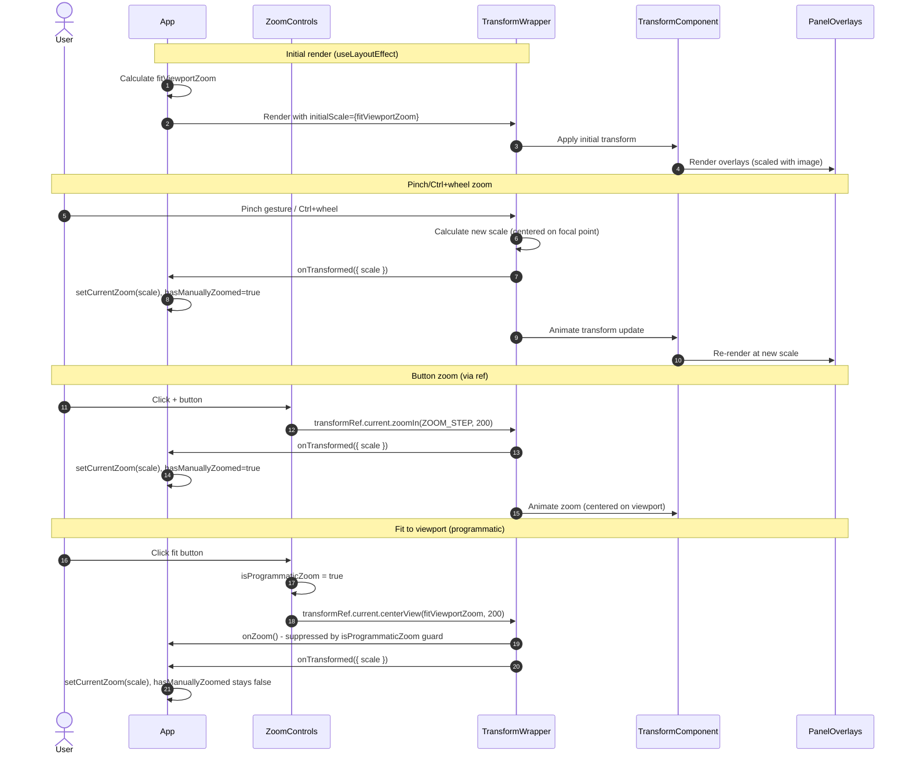

# Smooth Zoom with react-zoom-pan-pinch

Replace the custom zoom implementation with the `react-zoom-pan-pinch` library to provide smooth, native-feeling zoom and pan gestures on both mobile and desktop.

## Motivation

The current zoom implementation has a fundamental timing mismatch that causes jarring visual behavior:

1. **CSS transform with fixed origin**: Zoom uses `transform: scale(zoom)` with `transformOrigin: 'top left'` and a 150ms CSS transition
2. **Instant scroll adjustment**: JavaScript adjusts scroll position synchronously via `scrollLeft`/`scrollTop`
3. **Visual disconnect**: The content visually scales from top-left over 150ms while the viewport position jumps immediately

This creates the appearance of the image "redrawing from top-left" during zoom, which is especially jarring on mobile devices where it causes visible stuttering.

## Functional Requirements

### FR-1: Library Integration

**FR-1.1**: The implementation MUST use `react-zoom-pan-pinch` version `^3.7.0`.

**FR-1.2**: The `TransformWrapper` component MUST wrap the layout content (image + panel overlays).

**FR-1.3**: The `TransformComponent` MUST contain both the layout image and all `PanelOverlay` components as children, preserving their relative positioning.

### FR-2: Zoom Behavior

**FR-2.1**: Pinch-to-zoom on touch devices MUST zoom centered on the pinch focal point.

**FR-2.2**: Mouse wheel zoom MUST require Ctrl (Windows/Linux) or Cmd (macOS) modifier key to activate. Without modifier, wheel events MUST be ignored. This is configured via `wheel.activationKeys: ['Control', 'Meta']`.

**FR-2.3**: Zoom MUST be constrained between `MIN_ZOOM` (0.25) and `MAX_ZOOM` (2.0).

**FR-2.4**: Zoom transitions MUST be smooth and animated (library default behavior).

**FR-2.5**: Double-tap to zoom MUST be disabled to prevent accidental zoom when tapping panel overlays. Configure via `doubleClick={{ disabled: true }}`.

### FR-3: Pan Behavior

**FR-3.1**: Single-finger drag on touch devices MUST pan the view.

**FR-3.2**: Click-and-drag with mouse MUST pan the view.

**FR-3.3**: Two-finger scroll/swipe on trackpad: The desired behavior is to pan (not zoom). This is achieved by requiring modifier keys for wheel zoom (FR-2.2). However, due to known library limitations (GitHub issues #113, #370), this behavior MUST be verified in Phase 0 prototype spike. If `activationKeys` does not work as expected, the fallback is that unmodified wheel/trackpad gestures do nothing (acceptable) rather than zoom (unacceptable).

**FR-3.4**: Panning MUST allow the image to be moved away from screen edges so content beneath UI overlays (mode toggle, zoom controls, tab bar) can be viewed.

**FR-3.5**: Panning MUST NOT conflict with browser back/forward gestures. Apply `overscroll-behavior-x: none` CSS to prevent horizontal pan from triggering browser navigation on Safari/Edge.

### FR-4: Zoom Controls

**FR-4.1**: The existing `ZoomControls` component MUST be preserved with its current visual appearance and position.

**FR-4.2**: The + button MUST zoom in by `ZOOM_STEP` (0.25), centered on the viewport center. The library's `zoomIn(step, animationTime)` method accepts an optional step parameter.

**FR-4.3**: The - button MUST zoom out by `ZOOM_STEP` (0.25), centered on the viewport center. The library's `zoomOut(step, animationTime)` method accepts an optional step parameter.

**FR-4.4**: A "Fit to Viewport" button (existing ⊡ icon) MUST scale and center the image to fit entirely within the visible viewport using `centerView(scale, animationTime)`.

**FR-4.5**: A new "Fit to Width" button MUST be added that scales the image to fill the viewport width, using `setTransform(x, y, scale, animationTime)` with calculated centered X position and Y=0 to allow vertical panning. Fit-to-width MUST also clear `hasManuallyZoomed` so that window resize re-fits appropriately.

**FR-4.6**: The zoom percentage display MUST update in real-time during zoom gestures using the `onTransformed` callback to sync library state to React state.

### FR-5: Content Padding

**FR-5.1**: The zoomable content area MUST include padding on all four sides to allow the image to be panned away from UI overlays.

**FR-5.2**: The padding MUST be sufficient to view any edge of the image without obstruction from:
- Mode toggle header (top)
- Tab navigation (top on desktop, bottom on mobile)
- Zoom controls (bottom-right corner)

**FR-5.3**: The padding MUST be implemented as a wrapper `<div>` with padding OUTSIDE the fixed-size content container. This ensures panel overlay percentage positioning is calculated relative to the image container (LAYOUT_WIDTH × LAYOUT_HEIGHT), not the padded area.

**FR-5.4**: `CONTENT_PADDING` MUST be set to `150` pixels to ensure adequate clearance at minimum zoom (150px × 0.25 = 37.5px visual padding, sufficient for zoom controls ~48px tall after some panning).

### FR-6: Panel Overlay Positioning

**FR-6.1**: Panel overlays MUST remain positioned using percentage-based coordinates (`x_percent`, `y_percent`) relative to the layout image.

**FR-6.2**: Panel overlays MUST scale uniformly with the image during zoom operations.

**FR-6.3**: Panel overlay click/tap targets MUST remain functional at zoom levels ≥ 0.5x. At MIN_ZOOM (0.25x), touch targets become 10×10px which is below accessibility guidelines (44×44px minimum). The implementation MUST document this limitation and testing MUST verify usability. If testing reveals issues, consider raising MIN_ZOOM to 0.5.

### FR-7: State Management

**FR-7.1**: The zoom/pan state MUST be managed by the `react-zoom-pan-pinch` library internally.

**FR-7.2**: External zoom control buttons MUST use the library's ref-based API (`ReactZoomPanPinchRef`) since `ZoomControls` is rendered outside the `TransformWrapper` context. The `useControls()` hook cannot be used outside the wrapper.

**FR-7.3**: Initial zoom level MUST be calculated as "fit to viewport" and applied via `initialScale` prop to avoid a flash of content at wrong scale. For SSR safety, provide a default of `1` and recalculate in `useLayoutEffect`.

**FR-7.4**: On window resize, if the user has not manually zoomed/panned, the view MUST re-fit to viewport. Track manual interaction via `hasManuallyZoomed` ref:
- Set `true` on: user-initiated zoom (button clicks, wheel zoom, pinch zoom) or panning
- Set `false` on: fit-to-viewport OR fit-to-width button clicks
- On resize: only call `centerView()` if `hasManuallyZoomed === false`

**FR-7.5**: Programmatic zoom operations (fit-to-viewport, fit-to-width) MUST NOT trigger `hasManuallyZoomed = true`. Use an `isProgrammaticZoom` ref guard to suppress the `onZoom` callback during programmatic calls.

## Non-Functional Requirements

**NFR-1**: Zoom and pan gestures MUST feel smooth with no visible stuttering or frame drops on mobile devices.

**NFR-2**: The implementation MUST respect the user's `prefers-reduced-motion` preference by disabling animations via the `animation={{ disabled: true }}` prop when preference is set to `reduce`.

**NFR-3**: The bundle size increase from adding the library MUST be less than 20KB gzipped. Verify via:
1. Check bundlephobia (~8-10KB gzipped as of v3.7.0)
2. Run `npm run build` before and after, compare output sizes
3. Optionally use `rollup-plugin-visualizer` for detailed analysis

**NFR-4**: All existing panel overlay functionality (color coding, stale indicators, offline state) MUST continue to work unchanged.

**NFR-5**: The implementation MUST be SSR-safe. All uses of `window` MUST be guarded with `typeof window !== 'undefined'` checks or wrapped in `useEffect`/`useLayoutEffect`.

## High Level Design



### Component Architecture

Since `ZoomControls` is rendered outside `TransformWrapper` (in the fixed UI layer), it cannot use the `useControls()` hook. Instead, we use the ref-based API:

```
App
├── TransformWrapper (ref={transformRef})
│   └── TransformComponent
│       └── PaddingWrapper
│           └── ContentContainer (fixed LAYOUT_WIDTH × LAYOUT_HEIGHT)
│               ├── 
│               └── PanelOverlay[] (percentage positioned)
└── ZoomControls (uses transformRef.current.* methods)
```

### Component Structure

```tsx
// App.tsx - Main component with zoom state management
import { useRef, useState, useLayoutEffect, useCallback } from 'react';
import { ReactZoomPanPinchRef } from 'react-zoom-pan-pinch';
import {
  LAYOUT_WIDTH, LAYOUT_HEIGHT, CONTENT_PADDING,
  MIN_ZOOM, MAX_ZOOM, HEADER_HEIGHT, TAB_HEIGHT, ZOOM_STEP
} from './constants';

function App() {
  const transformRef = useRef<ReactZoomPanPinchRef>(null);
  const [currentZoom, setCurrentZoom] = useState(1);
  const hasManuallyZoomed = useRef(false);
  const isProgrammaticZoom = useRef(false);

  // Calculate fit zoom values (SSR-safe)
  const calculateFitZooms = useCallback(() => {
    if (typeof window === 'undefined') {
      return { fitViewportZoom: 1, fitWidthZoom: 1 };
    }

    const viewportWidth = window.innerWidth;
    const viewportHeight = window.innerHeight - HEADER_HEIGHT - TAB_HEIGHT;

    // Account for padding in calculations
    const contentWidth = LAYOUT_WIDTH + CONTENT_PADDING * 2;
    const contentHeight = LAYOUT_HEIGHT + CONTENT_PADDING * 2;

    // Fit to viewport (contain entire image)
    const fitViewportZoom = Math.min(
      viewportWidth / contentWidth,
      viewportHeight / contentHeight
    );

    // Fit to width (fill width, allow vertical pan)
    const fitWidthZoom = viewportWidth / contentWidth;

    return {
      fitViewportZoom: Math.max(MIN_ZOOM, Math.min(MAX_ZOOM, fitViewportZoom)),
      fitWidthZoom: Math.max(MIN_ZOOM, Math.min(MAX_ZOOM, fitWidthZoom)),
    };
  }, []);

  // SSR-safe initial state
  const [fitZooms, setFitZooms] = useState({ fitViewportZoom: 1, fitWidthZoom: 1 });

  // Calculate on mount (client-side only)
  useLayoutEffect(() => {
    setFitZooms(calculateFitZooms());
  }, [calculateFitZooms]);

  // Handle transform changes from library
  const handleTransformed = useCallback((
    ref: ReactZoomPanPinchRef,
    state: { scale: number; positionX: number; positionY: number }
  ) => {
    setCurrentZoom(state.scale);
  }, []);

  // Handle manual zoom (only for user-initiated actions)
  const handleManualZoom = useCallback(() => {
    if (!isProgrammaticZoom.current) {
      hasManuallyZoomed.current = true;
    }
  }, []);

  // Clear manual zoom flag (for fit buttons)
  const handleFitAction = useCallback(() => {
    hasManuallyZoomed.current = false;
  }, []);

  // Window resize handler
  useLayoutEffect(() => {
    const handleResize = () => {
      const newFitZooms = calculateFitZooms();
      setFitZooms(newFitZooms);

      // Re-fit only if user hasn't manually zoomed
      if (!hasManuallyZoomed.current && transformRef.current) {
        transformRef.current.centerView(newFitZooms.fitViewportZoom, 0);
      }
    };

    window.addEventListener('resize', handleResize);
    return () => window.removeEventListener('resize', handleResize);
  }, [calculateFitZooms]);

  return (
    <>
      <SolarLayout
        panels={panels}
        mode={mode}
        transformRef={transformRef}
        initialScale={fitZooms.fitViewportZoom}
        onTransformed={handleTransformed}
        onManualZoom={handleManualZoom}
      />
      <ZoomControls
        transformRef={transformRef}
        currentZoom={currentZoom}
        fitViewportZoom={fitZooms.fitViewportZoom}
        fitWidthZoom={fitZooms.fitWidthZoom}
        isProgrammaticZoomRef={isProgrammaticZoom}
        onFitAction={handleFitAction}
        onManualZoom={handleManualZoom}
      />
    </>
  );
}
```

```tsx
// SolarLayout.tsx - Layout with TransformWrapper
import {
  TransformWrapper,
  TransformComponent,
  ReactZoomPanPinchRef,
} from 'react-zoom-pan-pinch';

interface SolarLayoutProps {
  panels: PanelData[];
  mode: DisplayMode;
  transformRef: RefObject<ReactZoomPanPinchRef>;
  initialScale: number;
  onTransformed: (
    ref: ReactZoomPanPinchRef,
    state: { scale: number; positionX: number; positionY: number }
  ) => void;
  onManualZoom: () => void;
}

export function SolarLayout({
  panels, mode, transformRef, initialScale, onTransformed, onManualZoom
}: SolarLayoutProps) {
  // SSR-safe media query hook (returns false on server)
  const prefersReducedMotion = useMediaQuery('(prefers-reduced-motion: reduce)');
  const isMobile = useMediaQuery(`(max-width: ${MOBILE_BREAKPOINT}px)`);

  return (
    <TransformWrapper
      ref={transformRef}
      initialScale={initialScale}
      minScale={MIN_ZOOM}
      maxScale={MAX_ZOOM}
      centerOnInit={true}
      onTransformed={onTransformed}
      onPanning={onManualZoom}
      onZoom={onManualZoom}
      wheel={{
        step: 0.1,
        // Require Ctrl/Cmd to zoom with wheel
        activationKeys: ['Control', 'Meta'],
      }}
      doubleClick={{
        disabled: true, // Prevent accidental zoom when tapping panels
      }}
      panning={{
        velocityDisabled: prefersReducedMotion,
      }}
      animation={{
        disabled: prefersReducedMotion,
      }}
    >
      <TransformComponent
        wrapperStyle={{
          width: '100%',
          height: '100%',
          overscrollBehaviorX: 'none', // Prevent browser back gesture
        }}
      >
        {/* Padding wrapper - provides pan clearance around content */}
        <div style={{ padding: CONTENT_PADDING }}>
          {/* Fixed-size container for percentage-based overlay positioning */}
          <div style={{
            width: LAYOUT_WIDTH,
            height: LAYOUT_HEIGHT,
            position: 'relative'
          }}>
            
            {panels.map(panel => (
              <PanelOverlay
                key={panel.display_label}
                panel={panel}
                mode={mode}
                isMobile={isMobile}
              />
            ))}
          </div>
        </div>
      </TransformComponent>
    </TransformWrapper>
  );
}
```

### Zoom Controls with Ref-Based API

```tsx
// ZoomControls.tsx - Uses ref API (outside TransformWrapper context)
import { RefObject, MutableRefObject } from 'react';
import { ReactZoomPanPinchRef } from 'react-zoom-pan-pinch';
import { LAYOUT_WIDTH, CONTENT_PADDING, ZOOM_STEP, MIN_ZOOM, MAX_ZOOM } from '../constants';

interface ZoomControlsProps {
  transformRef: RefObject<ReactZoomPanPinchRef>;
  currentZoom: number;
  fitViewportZoom: number;
  fitWidthZoom: number;
  isProgrammaticZoomRef: MutableRefObject<boolean>;
  onFitAction: () => void;
  onManualZoom: () => void;
}

export function ZoomControls({
  transformRef,
  currentZoom,
  fitViewportZoom,
  fitWidthZoom,
  isProgrammaticZoomRef,
  onFitAction,
  onManualZoom,
}: ZoomControlsProps) {
  const ANIMATION_MS = 200;

  const handleZoomIn = () => {
    if (!transformRef.current) {
      console.warn('ZoomControls: transformRef not ready');
      return;
    }
    onManualZoom();
    transformRef.current.zoomIn(ZOOM_STEP, ANIMATION_MS);
  };

  const handleZoomOut = () => {
    if (!transformRef.current) {
      console.warn('ZoomControls: transformRef not ready');
      return;
    }
    onManualZoom();
    transformRef.current.zoomOut(ZOOM_STEP, ANIMATION_MS);
  };

  const handleFitViewport = () => {
    if (!transformRef.current) {
      console.warn('ZoomControls: transformRef not ready');
      return;
    }
    // Set guard BEFORE calling library method
    isProgrammaticZoomRef.current = true;
    onFitAction(); // Clears hasManuallyZoomed
    transformRef.current.centerView(fitViewportZoom, ANIMATION_MS);
    // Clear guard after animation completes
    setTimeout(() => { isProgrammaticZoomRef.current = false; }, ANIMATION_MS + 50);
  };

  const handleFitWidth = () => {
    if (!transformRef.current) {
      console.warn('ZoomControls: transformRef not ready');
      return;
    }

    // Set guard BEFORE calling library method
    isProgrammaticZoomRef.current = true;
    onFitAction(); // Clears hasManuallyZoomed (fit-to-width should also re-fit on resize)

    // Calculate centered X position for fit-to-width
    const wrapperBounds = transformRef.current.instance.wrapperComponent?.getBoundingClientRect();
    if (!wrapperBounds) {
      isProgrammaticZoomRef.current = false;
      return;
    }

    const contentWidth = (LAYOUT_WIDTH + CONTENT_PADDING * 2) * fitWidthZoom;
    const centerX = (wrapperBounds.width - contentWidth) / 2;

    // Y=0 to start at top, allowing downward pan
    transformRef.current.setTransform(centerX, 0, fitWidthZoom, ANIMATION_MS);

    // Clear guard after animation completes
    setTimeout(() => { isProgrammaticZoomRef.current = false; }, ANIMATION_MS + 50);
  };

  return (
    <div className="zoom-controls">
      <button onClick={handleZoomIn} disabled={currentZoom >= MAX_ZOOM}>+</button>
      <span>{Math.round(currentZoom * 100)}%</span>
      <button onClick={handleFitViewport} aria-label="Fit to viewport">⊡</button>
      <button onClick={handleFitWidth} aria-label="Fit to width">↔</button>
      <button onClick={handleZoomOut} disabled={currentZoom <= MIN_ZOOM}>−</button>
    </div>
  );
}
```

### Content Padding Strategy

Padding is applied via a wrapper div INSIDE `TransformComponent` but OUTSIDE the content container:

```
TransformComponent
└── PaddingWrapper (padding: CONTENT_PADDING)
    └── ContentContainer (width: LAYOUT_WIDTH, height: LAYOUT_HEIGHT, position: relative)
        ├──  (layout.png)
        └── PanelOverlay[] (position: absolute, left/top: X%/Y%)
```

This ensures:
1. Panel overlays use percentage positioning relative to `ContentContainer` (LAYOUT_WIDTH × LAYOUT_HEIGHT)
2. Padding scales proportionally with zoom (at 2x, padding becomes 300px visually)
3. User can pan content away from screen edges to view areas hidden by UI overlays

**Padding value**: `CONTENT_PADDING = 150` pixels (at 1x zoom). This provides:
- At 0.25x zoom: 37.5px visual padding (adequate for UI clearance)
- At 1x zoom: 150px visual padding
- At 2x zoom: 300px visual padding

### Files to Modify

| File | Changes |
|------|---------|
| `package.json` | Add `react-zoom-pan-pinch: ^3.7.0` dependency |
| `constants.ts` | Add `CONTENT_PADDING = 150` constant. Note: `HEADER_HEIGHT`, `TAB_HEIGHT`, `ZOOM_STEP`, `MOBILE_BREAKPOINT`, `LAYOUT_WIDTH`, `LAYOUT_HEIGHT`, `MIN_ZOOM`, `MAX_ZOOM` already exist. |
| `SolarLayout.tsx` | Replace custom zoom logic with `TransformWrapper`/`TransformComponent` |
| `SolarLayout.css` | Add `overscroll-behavior-x: none` to wrapper; verify library handles touch-action |
| `ZoomControls.tsx` | Use ref-based API, add fit-to-width button, receive `currentZoom` as prop |
| `ZoomControls.css` | Style for new fit-to-width button |
| `App.tsx` | Manage zoom state via `onTransformed`, create ref, calculate fit zoom values, add SSR guards |

### Files to Delete

| File | Reason |
|------|--------|
| `hooks/useWheelZoom.ts` | Replaced by library's wheel handling |
| `hooks/usePinchZoom.ts` | Replaced by library's pinch handling |
| `utils/zoom.ts` | Scroll adjustment no longer needed |

## Task Breakdown

### Phase 0: Prototype Spike (REQUIRED before Phase 1)

**Purpose:** Verify `wheel.activationKeys` behavior due to known library limitations (GitHub issues #113, #370).

1. Create minimal prototype with `react-zoom-pan-pinch`
2. Test on multiple browsers/platforms:
   - Chrome on macOS (trackpad)
   - Safari on macOS (trackpad)
   - Firefox on macOS (trackpad)
   - Chrome on Windows (mouse wheel + trackpad laptop)
   - Safari on iOS (pinch)
   - Chrome on Android (pinch)

3. Verify for each:
   - [ ] Ctrl+wheel zooms ✓
   - [ ] Plain wheel does NOT zoom ✓
   - [ ] Trackpad two-finger scroll either pans OR does nothing (NOT zoom) ✓
   - [ ] Pinch-to-zoom works on touch devices ✓

4. **Decision point:**
   - If all pass → Proceed to Phase 1
   - If trackpad zooms without modifier → Implement custom wheel handler or accept limitation
   - Document findings in implementation notes

### Phase 1: Core Implementation

1. **Add dependency**
   - Install `react-zoom-pan-pinch@^3.7.0`
   - Verify bundle size via `npm run build` before/after comparison

2. **Update constants**
   - Add `CONTENT_PADDING = 150` to `constants.ts`

3. **Refactor SolarLayout component**
   - Import library components (`TransformWrapper`, `TransformComponent`, `ReactZoomPanPinchRef`)
   - Wrap content in `TransformWrapper` with props:
     - `ref`, `initialScale`, `minScale`, `maxScale`, `centerOnInit`
     - `wheel.activationKeys: ['Control', 'Meta']`
     - `doubleClick.disabled: true`
     - `animation.disabled` based on reduced-motion preference
     - `onTransformed`, `onPanning`, `onZoom` callbacks
   - Add padding wrapper div around content container
   - Add `overscroll-behavior-x: none` CSS
   - Remove custom zoom/pinch hook usage

4. **Update SolarLayout.css**
   - Verify library sets appropriate `touch-action`
   - Keep or add rules to prevent iOS pull-to-refresh if needed

5. **Update ZoomControls component**
   - Change props to accept `transformRef`, `currentZoom`, fit zoom values, callbacks
   - Use ref-based API: `transformRef.current?.zoomIn()`, etc.
   - Add `isProgrammaticZoom` guard for fit buttons
   - Implement fit-to-width with calculated centered X position
   - Add fit-to-width button (↔ icon)
   - Add defensive logging for null ref

6. **Refactor App component**
   - Add `transformRef` using `useRef<ReactZoomPanPinchRef>(null)`
   - Add `currentZoom` state, `hasManuallyZoomed` ref, `isProgrammaticZoom` ref
   - Implement `calculateFitZooms()` function with SSR guard
   - Add `handleTransformed` callback to sync zoom state
   - Add `handleManualZoom` with programmatic guard check
   - Add window resize handler with manual zoom check
   - Pass all required props to `SolarLayout` and `ZoomControls`

7. **Delete deprecated files**
   - Remove `hooks/useWheelZoom.ts`
   - Remove `hooks/usePinchZoom.ts`
   - Remove `utils/zoom.ts`

### Phase 2: Testing via Playwright MCP

**Desktop (1280x720 viewport):**
- [ ] Ctrl+wheel zooms centered on cursor
- [ ] Plain wheel does NOT zoom (verify: pans or does nothing)
- [ ] Trackpad two-finger scroll does NOT zoom
- [ ] Click-and-drag pans
- [ ] Horizontal pan does NOT trigger browser back gesture (Safari/Edge)
- [ ] Zoom control buttons work (+, -, fit-viewport, fit-width)
- [ ] Zoom percentage updates in real-time during gestures
- [ ] Reduced-motion preference disables animations

**Mobile (375x812 viewport):**
- [ ] Pinch-to-zoom works centered on pinch point
- [ ] Single-finger drag pans
- [ ] Double-tap does NOT zoom (disabled)
- [ ] Panel overlays remain correctly positioned at 0.5x, 1x, 2x zoom
- [ ] Touch targets are usable at 0.5x zoom (document findings at 0.25x)

**Browser-specific:**
- [ ] Safari/macOS trackpad behavior
- [ ] Safari/iOS pinch and pan
- [ ] Firefox/macOS trackpad behavior
- [ ] Edge/Windows trackpad behavior

**Resize behavior:**
- [ ] Window resize re-fits when `hasManuallyZoomed = false`
- [ ] Window resize does NOT re-fit after manual zoom/pan
- [ ] Fit-to-viewport clears manual zoom flag → resize re-fits
- [ ] Fit-to-width clears manual zoom flag → resize re-fits

**Edge cases:**
- [ ] Panel overlays positioned correctly at min/max zoom
- [ ] Panning allows viewing content under all UI overlays
- [ ] Zoom at limits (buttons disabled at MIN_ZOOM/MAX_ZOOM)

## Context / Documentation

### Library Documentation
- [react-zoom-pan-pinch GitHub](https://github.com/BetterTyped/react-zoom-pan-pinch)
- [Storybook Examples](https://bettertyped.github.io/react-zoom-pan-pinch/)

### Known Issues
- [GitHub #113](https://github.com/BetterTyped/react-zoom-pan-pinch/issues/113) - Trackpad gesture handling (open since 2020)
- [GitHub #370](https://github.com/BetterTyped/react-zoom-pan-pinch/issues/370) - Override wheel action (open since 2023)

### Key Library API (v3.7.0)

**TransformWrapper Props:**
```typescript
{
  initialScale?: number;
  minScale?: number;
  maxScale?: number;
  centerOnInit?: boolean;
  wheel?: {
    step?: number;
    smoothStep?: number;
    disabled?: boolean;
    activationKeys?: string[];  // e.g., ['Control', 'Meta']
    excluded?: string[];
  };
  doubleClick?: {
    disabled?: boolean;
    step?: number;
  };
  panning?: {
    disabled?: boolean;
    velocityDisabled?: boolean;
    activationKeys?: string[];
    excluded?: string[];
  };
  animation?: {
    disabled?: boolean;
  };
  onTransformed?: (ref, state) => void;
  onPanning?: () => void;
  onZoom?: () => void;
}
```

**ReactZoomPanPinchRef Methods:**
```typescript
{
  zoomIn: (step?: number, animationTime?: number, animationType?: string) => void;
  zoomOut: (step?: number, animationTime?: number, animationType?: string) => void;
  setTransform: (x: number, y: number, scale: number, animationTime?: number, animationType?: string) => void;
  centerView: (scale?: number, animationTime?: number, animationType?: string) => void;
  resetTransform: (animationTime?: number, animationType?: string) => void;
  instance: { wrapperComponent, transformState: { scale, positionX, positionY } };
}
```

### Existing Implementation Files
- `dashboard/frontend/src/components/SolarLayout.tsx` - Current layout component
- `dashboard/frontend/src/components/ZoomControls.tsx` - Current zoom controls
- `dashboard/frontend/src/hooks/useWheelZoom.ts` - Current wheel zoom (to be removed)
- `dashboard/frontend/src/hooks/usePinchZoom.ts` - Current pinch zoom (to be removed)
- `dashboard/frontend/src/utils/zoom.ts` - Current scroll adjustment (to be removed)
- `dashboard/frontend/src/constants.ts` - Zoom constants

---

**Specification Version:** 1.2
**Last Updated:** January 2026
**Authors:** Claude

## Changelog

### v1.2 (January 2026)
**Summary:** Address second review cycle - add prototype spike, SSR safety, accessibility details

**Changes:**
- Added **Phase 0: Prototype Spike** requirement to verify `activationKeys` behavior before full implementation
- FR-2.5: Added double-tap zoom disable requirement
- FR-3.3: Clarified trackpad behavior with library limitation caveat and fallback acceptance criteria
- FR-3.5: Added browser back gesture prevention via `overscroll-behavior-x: none`
- FR-4.5: Fit-to-width now clears `hasManuallyZoomed` for consistent resize behavior
- FR-5.4: Increased `CONTENT_PADDING` from 100 to 150 for better clearance at min zoom
- FR-6.3: Clarified accessibility limitation at 0.25x zoom with potential MIN_ZOOM increase
- FR-7.3: Added SSR-safe initial state pattern
- FR-7.5: Added `isProgrammaticZoom` ref guard for fit button operations
- NFR-3: Added build comparison and visualizer verification steps
- NFR-5: Added SSR safety requirement
- Added defensive logging in ZoomControls for null ref
- Added Known Issues section with GitHub issue links
- Expanded test matrix with browser-specific and edge case tests
- Updated code examples with SSR guards, programmatic zoom guards, and doubleClick config
- Updated Files to Modify to clarify existing vs new constants

### v1.1 (January 2026)
**Summary:** Address ContextLoop review comments with API corrections and implementation details

**Changes:**
- FR-2.2: Added `wheel.activationKeys: ['Control', 'Meta']` to require modifier for wheel zoom
- FR-3.3: Clarified trackpad pan behavior relies on wheel activation keys
- FR-4.2/4.3: Documented that `zoomIn(step)` and `zoomOut(step)` accept optional step parameter
- FR-4.4: Changed to use `centerView(scale, animationTime)` instead of `setTransform`
- FR-4.5: Added calculation for centered X position in fit-to-width
- FR-4.6: Added `onTransformed` callback pattern for real-time zoom display
- FR-5.3: Changed padding strategy - padding wrapper is now OUTSIDE content container to preserve overlay positioning
- FR-6.3: Added note about touch target size at minimum zoom
- FR-7.2: Changed to ref-based API since ZoomControls is outside TransformWrapper context
- FR-7.3: Changed to use `initialScale` prop with pre-calculated value to avoid flash
- FR-7.4: Added detailed `hasManuallyZoomed` tracking pattern
- NFR-2: Changed to `animation.disabled` prop (correct API)
- NFR-3: Added bundlephobia verification note (~8-10KB gzipped)
- Updated all code examples to use correct APIs
- Added component architecture diagram
- Expanded test cases for trackpad, Safari, resize behavior, touch targets

### v1.0 (January 2026)
**Summary:** Initial specification for smooth zoom implementation

**Changes:**
- Initial specification created
- Defined library integration requirements
- Specified zoom/pan behavior requirements
- Added fit-to-width button requirement
- Specified content padding for UI overlay clearance
