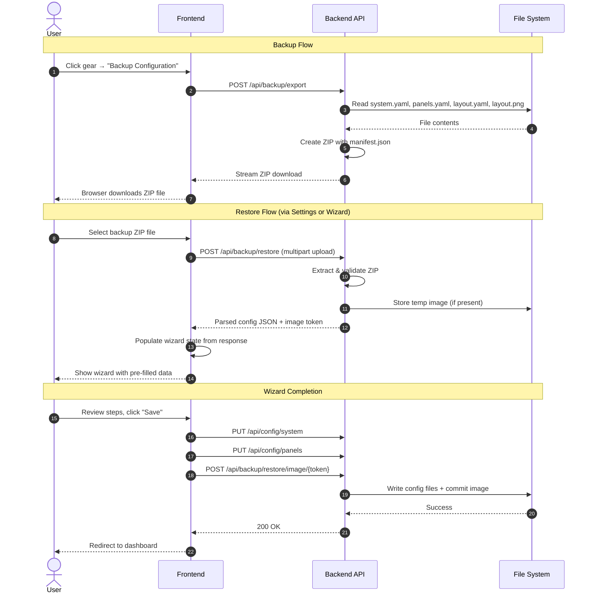

# Backup & Restore

A backup/restore system that allows users to export all dashboard configuration as a versioned ZIP archive and restore it through the setup wizard, enabling safe migration between installations or upgrades.

## Motivation

Users need a way to safely migrate their Solar Tigo Viewer installation to a new machine, recover from failed upgrades, or clone their configuration. Currently there is no way to export or import the dashboard configuration (system topology, panel definitions, translations, layout image, panel positions). This feature provides a single-file backup that captures the complete state and a restore flow that reuses the existing setup wizard for validation.

## Functional Requirements

### FR-1: Backup Export

**FR-1.1:** The backend MUST provide a `POST /api/backup/export` endpoint that generates a ZIP archive containing all configuration data.

**FR-1.2:** The ZIP archive MUST contain the following files:
- `manifest.json` — backup metadata (version, timestamp, source info)
- `system.yaml` — MQTT broker config and CCA/string topology
- `panels.yaml` — panel definitions, translations, and positions
- `layout.yaml` — layout editor configuration (overlay size, image dimensions)
- `assets/layout.png` — the layout background image (if one exists)

**FR-1.3:** The ZIP filename MUST follow the format: `solar-tigo-backup-YYYY-MM-DDTHH-MM-SS.zip` using the server's local time at the moment of export.

**FR-1.4:** The `manifest.json` MUST contain:
```json
{
  "backup_version": 1,
  "created_at": "2026-01-24T14:30:00Z",
  "app_version": "1.0.0",
  "panel_count": 69,
  "has_layout_image": true,
  "has_translations": true
}
```

**FR-1.5:** The `backup_version` field MUST be an integer starting at `1`. This version is incremented when the backup schema changes in a way that requires migration logic during restore.

**FR-1.6:** If the layout image does not exist, the ZIP MUST still be valid — the `assets/` directory is simply omitted and `has_layout_image` is set to `false`.

**FR-1.7:** The endpoint MUST return the ZIP file as a streaming download with `Content-Disposition: attachment; filename="solar-tigo-backup-..."` header.

**FR-1.8:** If no system configuration exists (fresh install, no `system.yaml` or `panels.yaml`), the export endpoint MUST return a 404 response: `{"error": "no_config", "message": "No configuration to export. Complete the setup wizard first."}`.

### FR-2: Backup Restore (Backend)

**FR-2.1:** The backend MUST provide a `POST /api/backup/restore` endpoint that accepts a ZIP file upload.

**FR-2.2:** The endpoint MUST validate the ZIP structure:
- Contains `manifest.json` at the root
- `manifest.json` is valid JSON with a `backup_version` field
- `backup_version` is a supported version (currently only `1`)
- Required config files (`system.yaml`, `panels.yaml`) are present and valid YAML
- If `layout.yaml` references an image, the image file exists in the archive

**FR-2.3:** On validation success, the endpoint MUST return the parsed configuration data as JSON (not write to disk). The response MUST conform to a `BackupRestoreResponse` Pydantic model:
```json
{
  "status": "valid",
  "manifest": { "backup_version": 1, "created_at": "...", ... },
  "system": { "version": 1, "mqtt": {...}, "ccas": [...] },
  "panels": { "panels": [...], "translations": {...} },
  "layout": { "image_width": 1920, "image_height": 1080, "overlay_size": 50, "image_hash": "...", ... },
  "has_image": true,
  "image_token": "uuid-string-or-null"
}
```
Where `system` conforms to `SystemConfig.model_dump()`, `panels` to `PanelsConfig.model_dump()`, and `layout` to `LayoutConfig.model_dump()`. The `image_token` field is a UUID string if the backup contains a layout image (stored temporarily), or `null` if no image is present.

**FR-2.4:** On validation failure, the endpoint MUST return a 422 response with specific error details:
```json
{
  "status": "invalid",
  "errors": [
    {"field": "manifest.backup_version", "message": "Unsupported version: 2"}
  ]
}
```

**FR-2.5:** The restore endpoint MUST NOT modify any existing configuration files. It only validates and returns parsed data. The actual write happens when the user completes the wizard (via existing `/api/config/system` and `/api/config/panels` PUT endpoints).

**FR-2.6:** If the backup contains a layout image, the endpoint MUST temporarily store the image and return a reference token (UUID4). A subsequent `POST /api/backup/restore/image/{token}` endpoint commits the image to the `assets/` directory and updates `layout.yaml` with the image dimensions and SHA256 hash (following the same pattern as `config_service.save_layout_image()`). The commit endpoint MUST return:
```json
{
  "success": true,
  "metadata": { "width": 1920, "height": 1080, "hash": "sha256-hex-string" }
}
```
If the token is invalid or expired, the endpoint MUST return 404 with `{"error": "token_not_found", "message": "Restore image not found or expired."}`.

**FR-2.7:** The restore endpoint MUST protect against ZIP bombs by checking the uncompressed size of each file during extraction (using `ZipInfo.file_size`). Individual config files (YAML/JSON) MUST be rejected if uncompressed size exceeds 1MB. The layout image MUST be rejected if uncompressed size exceeds 20MB. If any file exceeds its limit, the endpoint MUST return 422 with error: `{"field": "archive", "message": "File '<name>' exceeds maximum allowed size."}`.

**FR-2.8:** Temporary restore images MUST be cleaned up after 1 hour if not committed. A background asyncio task started during app lifespan MUST check the temp directory every 10 minutes and delete files with mtime older than 1 hour. The cleanup task is registered in `main.py`'s lifespan handler alongside existing startup tasks.

### FR-3: Version Compatibility

**FR-3.1:** When `backup_version` is less than the current supported version, the backend MUST attempt automatic migration of the data to the current schema.

**FR-3.2:** If migration adds new fields that require user input (no safe default exists), the response MUST include a `warnings` array:
```json
{
  "status": "valid",
  "warnings": [
    {"field": "system.mqtt.tls_enabled", "message": "New field added in v2. Defaulting to false."}
  ]
}
```

**FR-3.3:** If `backup_version` is greater than the current app version, the endpoint MUST reject with a clear error: "This backup was created with a newer version. Please upgrade the application."

### FR-4: Settings Menu (Frontend)

**FR-4.1:** The dashboard header MUST include a gear icon button that opens a settings dropdown menu.

**FR-4.2:** The settings menu MUST contain:
- "Backup Configuration" — triggers backup export download
- "Restore Configuration" — opens a file picker for ZIP upload, then redirects to wizard
- "Re-run Setup Wizard" — navigates to the setup wizard (existing functionality, currently no UI trigger post-setup)

**FR-4.3:** The gear icon MUST be positioned in the mode toggle bar (the white bar at the top containing the Watts/Voltage/Serial toggle), aligned to the right side, after the mode toggle buttons. It is visually distinct from the tab navigation below.

**FR-4.4:** Clicking "Backup Configuration" MUST immediately trigger a file download of the backup ZIP (no confirmation dialog needed — the action is non-destructive). After the download starts, a brief toast notification MUST appear: "Backup includes MQTT credentials in plaintext. Store the file securely." The toast auto-dismisses after 5 seconds and is informational only (does not block the download).

**FR-4.5:** Clicking "Restore Configuration" MUST open a native file picker filtered to `.zip` files. After file selection, the file is uploaded to the restore endpoint. On success, the user is redirected to the setup wizard with all data pre-filled.

### FR-5: Setup Wizard — Restore Entry Point

**FR-5.1:** The setup wizard MUST add a new first step ("Welcome") before the current Step 1 (MQTT Config). This step is handled as a **separate pre-navigation screen** outside the `STEP_ORDER` array — it is NOT added to `WizardStep` type or `STEP_ORDER`. The Welcome screen is shown when `!hasPersistedState` and `!restoredFromBackup`; once the user chooses an action, the wizard transitions to `'mqtt-config'` (the first step in `STEP_ORDER`). The `WizardStepIndicator` does not display the Welcome step. This step presents two options:
- "Fresh Setup" — proceeds to Step 1 (`'mqtt-config'`) as normal (existing behavior)
- "Restore from Backup" — opens a file picker, validates the backup, then pre-fills all subsequent steps and transitions to `'mqtt-config'`

**FR-5.2:** After a successful restore upload, the wizard state MUST be populated with all data from the backup:
- `mqttConfig` — from backup's `system.yaml` MQTT section
- `systemTopology` — from backup's `system.yaml` CCA/strings section
- `discoveredPanels` — synthesized from backup's `panels.yaml` panel list (see FR-5.8 for synthesis logic)
- `translations` — from backup's `panels.yaml` translations
- `validationResults` — auto-generated as all-matched (see FR-5.8 for generation logic)
- `restoredFromBackup` — set to `true`
- `restoreImageToken` — set to the `image_token` from the restore response (or `null`)

The `WizardState` interface MUST be extended with these new fields:
```typescript
interface WizardState {
  // ... existing fields ...
  restoredFromBackup?: boolean;
  restoreImageToken?: string | null;
}
```
These restore-related fields are NOT persisted to localStorage (the `PersistedWizardState` type and version remain unchanged). The `savePersistedState` function MUST strip these fields before serializing: `const { restoredFromBackup, restoreImageToken, ...persistableState } = state;` and only persist `persistableState`. If the page is refreshed during a restore flow, the user returns to the Welcome screen and must re-upload the backup.

**FR-5.3:** When restoring, the wizard MUST skip the discovery and validation steps entirely. The skip mechanism works as follows: the `goNext()` function in `useWizardState` MUST check the `restoredFromBackup` flag and, when advancing from the generate/download step, jump directly to the review-save step (skipping `'panel-discovery'` and `'panel-validation'`). Similarly, `goBack()` from review-save in restore mode jumps back to generate/download. The `WizardStepIndicator` props MUST be extended with `restoredFromBackup?: boolean`; when true, the component filters its internal STEPS array to exclude the discovery and validation entries before rendering, adjusting step numbering accordingly (steps 1-4 instead of 1-6). Additionally, if `restoredFromBackup` is true and `currentStep` is `'panel-discovery'` or `'panel-validation'` (e.g., via a code bug or direct `goToStep` call), `goNext()` MUST advance to `'review-save'` and `goBack()` MUST return to `'generate-download'`. This provides defensive handling for edge cases where navigation lands on a skipped step. The panel data from the backup is treated as already-discovered and already-validated.

**FR-5.3.1:** In restore mode, the `invalidateDownstream` function in `useWizardState` MUST be a no-op. Editing MQTT config or system topology during restore review MUST NOT trigger downstream invalidation of `discoveredPanels` or `validationResults`, since these are pre-populated from the backup and not dependent on live discovery. The `invalidateDownstream` function's `setState` updater MUST check `prev.restoredFromBackup` as its first action and return `prev` unchanged if true. This prevents both downstream data clearing AND `furthestStep` regression.

**FR-5.4:** The wizard MUST set `furthestStep` to the review step, allowing the user to navigate freely between all steps to review/modify pre-filled data.

**FR-5.5:** Each pre-filled wizard step MUST display a subtle indicator (e.g., a small banner or badge) showing "Restored from backup" so the user knows the data came from a restore rather than fresh input.

**FR-5.8:** The `panelsToDiscoveredMap()` helper converts backup panels to the `DiscoveredPanel` format required by the wizard. Uses the `Panel` type from `types/config.ts`:
```typescript
function panelsToDiscoveredMap(panels: Panel[]): Record<string, DiscoveredPanel> {
  return Object.fromEntries(panels.map(p => [p.serial, {
    serial: p.serial,
    cca: p.cca,
    tigo_label: p.tigo_label,
    watts: 0,
    voltage: 0,
    discovered_at: new Date().toISOString(),
    last_seen_at: new Date().toISOString(),
  }]));
}
```
The `generateAutoMatchResults()` helper produces match results where all panels are pre-matched. Returns `MatchResult[]` matching the `WizardState.validationResults` type:
```typescript
function generateAutoMatchResults(panels: Panel[]): MatchResult[] {
  return panels.map(p => ({
    status: 'matched' as const,
    confidence: 'high' as const,
    panel: p,
    tigo_label: p.tigo_label,
  }));
}
```

**FR-5.6:** The generate/download step (Step 3) MUST work normally during restore — the user can regenerate and download tigo-mqtt deployment files based on the restored topology (which may have a different serial device path on the new machine).

**FR-5.7:** When the user reaches the final review step and confirms, the system writes all configuration exactly as in a fresh setup (using existing PUT endpoints), plus commits the restored layout image if present.

### FR-6: Restore via Settings Menu

**FR-6.1:** When restoring via the settings menu (FR-4.5), the app MUST show a confirmation dialog: "Restoring will open the setup wizard with your backed-up configuration. Your current configuration will not be changed until you complete the wizard. Continue?"

**FR-6.2:** On confirmation, the app transitions to the wizard in restore mode (same behavior as FR-5.2 through FR-5.7). The transition is implemented by adding a `startRestore(data: RestoreData)` callback to `AppRouter` that sets `appState = 'wizard'` and passes the `RestoreData` to `SetupWizard` as an initial state prop. The `RestoreData` type is defined as:
```typescript
interface RestoreData {
  system: SystemConfig;
  panels: { panels: Panel[]; translations: Record<string, string> };
  layout?: LayoutConfig;
  image_token?: string;
}
```
`AppRouter` exposes this callback to `Dashboard` via prop drilling (or a shared context if preferred during implementation). The `SetupWizardProps` interface MUST be extended with `initialRestoreData?: RestoreData`. When provided, the wizard MUST skip both the initial `getConfigStatus()` check (which would otherwise redirect to the dashboard for already-configured systems) and the Welcome/resume dialog screens, directly calling `populateWizardFromBackup(initialRestoreData)` on mount.

### FR-7: Backup/Restore Impact Assessment (Process)

**FR-7.1:** The spec skill (`~/.claude/skills/spec/skill.md`) MUST be updated to include a new conditional section: "For Features Adding Persistent Configuration: Backup/Restore Impact." This section prompts the spec author to assess whether the new feature introduces configuration data that must be included in backups.

**FR-7.2:** The spec skill's Review Checklist MUST be updated to include:
- [ ] **Configuration specs**: Backup/restore impact assessed; `backup_version` bump if new fields added

**FR-7.3:** A project-specific `docs/specs/spec-support.md` file MUST be created (or updated if it exists) with backup/restore guidance including:
- The current backup schema version and what it contains
- A checklist for spec authors: "Does this feature add new config files, new fields to existing config files, or new assets that should survive a migration?"
- Instructions for when to bump `backup_version` vs. when a bump is not needed
- A reference to the manifest structure and the config files included in backups

**FR-7.4:** The spec skill conditional section MUST include the following decision framework:

| Change Type | Backup Version Bump? | Action Required |
|-------------|----------------------|-----------------|
| New field with safe default | No | Add field to backup/restore; old backups restore fine without it |
| New field with no safe default | Yes | Bump version; add migration logic that warns user on restore |
| New config file | Yes | Add file to ZIP archive; add migration for old backups missing it |
| Removed field | No | Ignore unknown fields on restore (already handled by YAML/JSON parsers) |
| Changed field semantics | Yes | Bump version; add migration to transform old values |

### FR-8: Comprehensive Testing

#### FR-8.1: Backend Unit Tests

**FR-8.1.1:** The backup service MUST have unit tests covering:
- Backup creation with all config files present
- Backup creation with missing layout image (still produces valid ZIP)
- Backup creation with empty panels list
- Backup creation with translations present
- Manifest content validation (correct panel count, flags, version)
- ZIP structure verification (correct file paths within archive)

**FR-8.1.2:** The restore validation MUST have unit tests covering:
- Valid backup ZIP accepted and parsed correctly
- Missing `manifest.json` rejected with appropriate error
- Invalid JSON in manifest rejected
- Unsupported `backup_version` (future version) rejected with upgrade message
- Missing required files (`system.yaml`, `panels.yaml`) rejected
- Invalid YAML content in config files rejected
- ZIP with layout image correctly stores temp image and returns token
- ZIP without layout image returns `has_image: false`
- Total upload size exceeding 20MB rejected with 413 (NFR-1.3)
- Individual file within ZIP exceeding per-file size limit rejected with 422 (FR-2.7 ZIP bomb protection)
- Non-ZIP file rejected
- ZIP with extra/unknown files accepted (forward compatibility)
- Corrupt ZIP file rejected

**FR-8.1.3:** Version migration MUST have unit tests covering:
- Backup version 1 restores without warnings on current version 1 app
- (Future) Backup version 1 restores on version 2 app with appropriate defaults/warnings
- Backup version newer than app rejects with upgrade message

**FR-8.1.4:** Temp image cleanup MUST have unit tests covering:
- Images older than 1 hour are deleted
- Images younger than 1 hour are preserved
- Commit with valid token moves image to correct path
- Commit with invalid/expired token returns 404

#### FR-8.2: Backend Integration Tests

**FR-8.2.1:** The backup export endpoint MUST have integration tests covering:
- `POST /api/backup/export` returns 200 with ZIP content type
- Response has correct `Content-Disposition` header with timestamp filename
- Returned ZIP is valid and contains expected files
- Export works when system is fully configured
- Export returns appropriate error when no configuration exists

**FR-8.2.2:** The restore endpoint MUST have integration tests covering:
- `POST /api/backup/restore` with valid ZIP returns parsed config JSON
- Restore does NOT modify existing config files on disk
- Restore with image returns valid token
- `POST /api/backup/restore/image/{token}` commits image to assets directory
- Image commit updates layout.yaml with correct dimensions and hash

#### FR-8.3: Round-Trip Tests

**FR-8.3.1:** A round-trip test MUST verify: export backup → restore backup → compare parsed config with original config files. All fields MUST match exactly, including sensitive fields (MQTT password must survive the round-trip without modification).

**FR-8.3.2:** A round-trip test MUST verify: export backup → restore backup → complete wizard save → verify config files on disk match the original export source.

**FR-8.3.3:** A round-trip test with layout image MUST verify: the image bytes in the restored system are identical to the original (verified via SHA256 hash comparison).

#### FR-8.4: Frontend Unit Tests

**FR-8.4.1:** The `populateWizardFromBackup` function MUST have unit tests covering:
- All wizard state fields are correctly populated from restore response
- `restoredFromBackup` flag is set to `true`
- `furthestStep` is set to `review-save`
- `configDownloaded` is set to `false`
- Panel list is correctly converted to `discoveredPanels` map
- Translations are preserved
- Missing optional fields (layout image) handled gracefully
- `restoredFromBackup` and `restoreImageToken` fields are NOT included in localStorage-persisted state

**FR-8.4.2:** The WelcomeStep component MUST have unit tests covering:
- "Fresh Setup" button triggers fresh setup callback
- "Restore from Backup" button opens file picker
- File picker accepts only `.zip` files
- Invalid file upload shows error message
- Successful upload triggers restore callback with parsed data

**FR-8.4.3:** The SettingsMenu component MUST have unit tests covering:
- Menu opens/closes on gear icon click
- "Backup Configuration" triggers download
- "Restore Configuration" opens file picker
- Confirmation dialog shown before restore proceeds
- "Re-run Setup Wizard" navigates to wizard

#### FR-8.5: E2E Tests (Playwright MCP)

**Test Fixture Strategy:** E2E tests MUST first complete a fresh wizard setup (or call `PUT /api/config/system` and `PUT /api/config/panels` directly) to create a known configuration state. Then call `POST /api/backup/export` to generate a valid backup ZIP programmatically. This ZIP is used as the restore fixture, ensuring round-trip correctness without needing pre-built fixture files.

**FR-8.5.1:** Full backup flow test:
1. Start with a fully configured system
2. Open settings menu
3. Click "Backup Configuration"
4. Verify file download triggers (check network response)

**FR-8.5.2:** Full restore flow via wizard:
1. Start with no configuration (fresh install)
2. Navigate to wizard welcome step
3. Upload a known-good backup ZIP
4. Verify MQTT config step is pre-filled with correct values
5. Verify system topology step is pre-filled with correct CCA/string data
6. Verify discovery and validation steps are skipped
7. Navigate to review step
8. Confirm and save
9. Verify dashboard loads with correct panel count

**FR-8.5.3:** Full restore flow via settings:
1. Start with an existing configuration
2. Open settings menu → "Restore Configuration"
3. Verify confirmation dialog appears
4. Upload backup ZIP
5. Verify wizard opens in restore mode with pre-filled data
6. Verify restore banner is visible on each step
7. Complete wizard and verify dashboard reflects restored config

**FR-8.5.4:** Error handling tests:
1. Upload a non-ZIP file → verify error message shown
2. Upload a ZIP without manifest → verify specific error message
3. Upload a ZIP with future backup_version → verify upgrade message shown

## Non-Functional Requirements

**NFR-1.1:** Backup export MUST complete within 5 seconds for configurations with up to 200 panels and a 10MB layout image.

**NFR-1.2:** The backup ZIP MUST use standard ZIP compression (deflate) to minimize file size.

**NFR-1.3:** The restore validation endpoint MUST reject files larger than 20MB with a 413 response.

**NFR-2.1:** The backup format MUST be forward-compatible: older versions of the app that encounter unknown fields in config files MUST ignore them gracefully (YAML/JSON parsers already handle this).

**NFR-2.2:** Sensitive data (MQTT password) is included in the backup as-is (plaintext in YAML). The backup file itself is the user's responsibility to secure. No encryption is applied.

**NFR-3.1:** The settings menu MUST be accessible on both desktop and mobile viewports.

**NFR-3.2:** The welcome step in the wizard MUST load without network requests (no API calls until the user chooses an action).

## High Level Design



### Backend Implementation

#### Backup Service (`dashboard/backend/app/backup_service.py`)

A new service class responsible for creating and validating backup archives:

```python
import io
import json
import zipfile
from datetime import datetime, timezone
from pathlib import Path
from typing import Optional

from .config_service import ConfigService

CURRENT_BACKUP_VERSION = 1
MAX_UPLOAD_SIZE = 20 * 1024 * 1024  # 20MB


class BackupService:
    def __init__(self, config_service: ConfigService):
        self.config_service = config_service

    def create_backup(self) -> tuple[io.BytesIO, str]:
        """Create a backup ZIP archive.

        Returns:
            Tuple of (zip_buffer, filename)
        """
        system = self.config_service.load_system_config()
        panels = self.config_service.load_panels_config()
        layout = self.config_service.load_layout_config()
        image_path = self.config_service.get_layout_image_path()

        manifest = {
            "backup_version": CURRENT_BACKUP_VERSION,
            "created_at": datetime.now(timezone.utc).isoformat(),
            "app_version": "1.0.0",
            "panel_count": len(panels.panels),
            "has_layout_image": image_path is not None,
            "has_translations": bool(panels.translations),
        }

        timestamp = datetime.now().strftime("%Y-%m-%dT%H-%M-%S")
        filename = f"solar-tigo-backup-{timestamp}.zip"

        buf = io.BytesIO()
        with zipfile.ZipFile(buf, 'w', zipfile.ZIP_DEFLATED) as zf:
            zf.writestr("manifest.json", json.dumps(manifest, indent=2))
            # Write YAML files using existing file contents
            zf.write(self.config_service.system_yaml_path, "system.yaml")
            zf.write(self.config_service.panels_yaml_path, "panels.yaml")
            if self.config_service.layout_yaml_path.exists():
                zf.write(self.config_service.layout_yaml_path, "layout.yaml")
            if image_path:
                zf.write(image_path, "assets/layout.png")

        buf.seek(0)
        return buf, filename

    def validate_backup(self, zip_data: bytes) -> dict:
        """Validate and parse a backup ZIP.

        Returns parsed config data or raises ValueError with details.
        """
        # ... validation logic ...
```

#### Backup Router (`dashboard/backend/app/backup_router.py`)

New FastAPI router with two endpoints:

```python
from fastapi import APIRouter, UploadFile, File
from fastapi.responses import StreamingResponse

router = APIRouter(prefix="/api/backup", tags=["backup"])

@router.post("/export")
async def export_backup():
    """Generate and download backup ZIP."""
    ...

@router.post("/restore")
async def restore_backup(file: UploadFile = File(...)):
    """Validate backup ZIP and return parsed config."""
    ...

@router.post("/restore/image/{token}")
async def commit_restore_image(token: str):
    """Commit a temporarily stored restore image."""
    ...
```

#### Temporary Image Storage

Restored images are stored in a temp directory with cryptographically random UUID4 tokens (using Python's `uuid.uuid4()`) to prevent token guessing:

```python
import uuid

RESTORE_TEMP_DIR = Path("/app/data/restore-temp")  # Within app data dir, container-isolated

# Store: save to RESTORE_TEMP_DIR/{uuid4()}.png, return token string
# Commit: move from temp to assets/layout.png, update layout.yaml
# Cleanup: background asyncio task every 10 min, removes files with mtime > 1 hour
```

Note: The temp directory uses the app's data directory rather than `/tmp` to ensure consistent behavior across Docker configurations where `/tmp` may be a size-limited tmpfs.

### Frontend Implementation

#### Settings Menu Component (`dashboard/frontend/src/components/SettingsMenu.tsx`)

A dropdown menu triggered by a gear icon in the header:

```tsx
interface SettingsMenuProps {
  onRestoreComplete: (data: RestoreData) => void;
}

function SettingsMenu({ onRestoreComplete }: SettingsMenuProps) {
  const [isOpen, setIsOpen] = useState(false);

  const handleBackup = async () => {
    const response = await fetch('/api/backup/export', { method: 'POST' });
    const blob = await response.blob();
    // Backend MUST use simple `filename="..."` format (not RFC 5987 filename*)
    const disposition = response.headers.get('Content-Disposition') || '';
    const match = disposition.match(/filename="([^"]+)"/);
    const filename = match?.[1] || 'backup.zip';
    downloadBlob(blob, filename);
  };

  const handleRestore = async (file: File) => {
    const formData = new FormData();
    formData.append('file', file);
    const response = await fetch('/api/backup/restore', {
      method: 'POST',
      body: formData,
    });
    const data = await response.json();
    if (data.status === 'valid') {
      onRestoreComplete(data);
    }
  };
  // ...
}
```

#### Welcome Step Component (`dashboard/frontend/src/components/wizard/steps/WelcomeStep.tsx`)

New first step in the wizard:

```tsx
function WelcomeStep({ onFreshSetup, onRestore }: WelcomeStepProps) {
  return (
    <div className="welcome-step">
      <h2>Welcome to Solar Tigo Viewer</h2>
      <p>Choose how to set up your system:</p>

      <button onClick={onFreshSetup}>
        <PlusCircle />
        Fresh Setup
        <span>Configure everything from scratch</span>
      </button>

      <button onClick={() => fileInputRef.current?.click()}>
        <Upload />
        Restore from Backup
        <span>Import a previously exported configuration</span>
      </button>

      <input
        ref={fileInputRef}
        type="file"
        accept=".zip"
        onChange={handleFileSelect}
        hidden
      />
    </div>
  );
}
```

#### Wizard State Population

When restoring, the wizard state is populated from the backup response. The function returns a complete `WizardState` (including the extended restore fields) and is applied as a **full state replacement** via `setState(populateWizardFromBackup(data))`:

```typescript
function populateWizardFromBackup(data: RestoreData): WizardState {
  return {
    currentStep: 'mqtt-config',  // Start at first config step for review
    furthestStep: 'review-save', // Allow free navigation
    mqttConfig: data.system.mqtt,
    systemTopology: {
      version: data.system.version,
      mqtt: data.system.mqtt,
      ccas: data.system.ccas,
    },
    discoveredPanels: panelsToDiscoveredMap(data.panels.panels),
    translations: data.panels.translations,
    validationResults: generateAutoMatchResults(data.panels.panels),
    configDownloaded: false, // User should re-download for new machine
    restoredFromBackup: true, // Flag for UI indicators + invalidateDownstream bypass
    restoreImageToken: data.image_token || null,
  };
}
```

#### Wizard Step Modifications

Each existing step component checks for `restoredFromBackup` flag to show a restore indicator:

```tsx
function RestoreBanner() {
  return (
    <div className="restore-banner">
      <RefreshCw size={14} />
      <span>Restored from backup — review and confirm</span>
    </div>
  );
}
```

### Wizard Step Flow Comparison

| Step | Fresh Setup | Restore Mode |
|------|-------------|--------------|
| Welcome (new) | Select "Fresh Setup" | Select "Restore from Backup" + upload ZIP |
| MQTT Config | Empty form | Pre-filled from backup, editable |
| System Topology | Empty form | Pre-filled from backup, editable |
| Generate/Download | Generate tigo-mqtt config | Generate tigo-mqtt config (device paths may differ) |
| Discovery | Live MQTT discovery | **Skipped** — panels from backup used directly |
| Validation | Match discovered panels | **Skipped** — all panels pre-validated |
| Review & Save | Review and confirm | Review and confirm + commit restore image |

### File Structure Changes

```
dashboard/
├── backend/
│   └── app/
│       ├── backup_service.py      # NEW - backup creation & validation
│       ├── backup_router.py       # NEW - API endpoints
│       └── main.py                # MODIFIED - register backup router
├── frontend/
│   └── src/
│       ├── components/
│       │   ├── SettingsMenu.tsx    # NEW - gear menu dropdown
│       │   ├── Dashboard.tsx       # MODIFIED - add settings menu to header
│       │   └── wizard/
│       │       ├── SetupWizard.tsx  # MODIFIED - add welcome step, restore mode
│       │       └── steps/
│       │           └── WelcomeStep.tsx  # NEW - fresh vs restore choice
│       ├── api/
│       │   └── backup.ts           # NEW - backup API client functions
│       └── types/
│           └── config.ts           # MODIFIED - add restore-related types
```

## Task Breakdown

### Implementation

1. **Backend: Create backup service** — Implement `BackupService` class with `create_backup()` method that reads config files and creates a ZIP archive with manifest.

2. **Backend: Create restore validation** — Implement `validate_backup()` method that extracts ZIP, validates structure/schema, parses configs, and stores temp image. Include version compatibility checks.

3. **Backend: Create backup router** — Implement `/api/backup/export`, `/api/backup/restore`, and `/api/backup/restore/image/{token}` endpoints. Register router in `main.py`.

4. **Backend: Add temp image cleanup** — Implement background task or startup cleanup that removes restore temp images older than 1 hour.

5. **Frontend: Create Settings menu** — Add gear icon to dashboard header with dropdown containing Backup, Restore, and Re-run Wizard options.

6. **Frontend: Implement backup download** — Wire "Backup Configuration" menu item to call export endpoint and trigger browser download.

7. **Frontend: Create Welcome step** — New wizard step with Fresh Setup / Restore from Backup options and file upload handling.

8. **Frontend: Implement restore flow** — Upload ZIP to restore endpoint, parse response, populate wizard state, handle restore mode flag. Add `restoredFromBackup` to wizard state type.

9. **Frontend: Modify wizard for restore mode** — Update `SetupWizard.tsx` to skip discovery/validation steps in restore mode. Add restore banner to each step. Set `furthestStep` to review on restore.

10. **Frontend: Implement restore via settings** — Wire settings menu restore option to show confirmation dialog, upload file, then transition to wizard in restore mode.

11. **Frontend: Handle image commit on wizard save** — When restore mode includes an image token, call `/api/backup/restore/image/{token}` during the final save step.

### Testing

12. **Backend: Unit tests for backup service** — Test backup creation with various config states (full config, missing image, empty panels, translations present). Verify manifest correctness and ZIP structure.

13. **Backend: Unit tests for restore validation** — Test all validation scenarios: valid ZIP, missing manifest, invalid JSON, future version, missing config files, invalid YAML, oversized files, corrupt ZIP, extra unknown files.

14. **Backend: Unit tests for version migration** — Test current-version restore (no warnings), future-version reject (upgrade message). Add skeleton for version 2 migration tests.

15. **Backend: Unit tests for temp image lifecycle** — Test cleanup of expired images, preservation of fresh images, commit with valid/invalid tokens.

16. **Backend: Integration tests for endpoints** — Test full HTTP request/response cycle for export and restore endpoints. Verify export Content-Disposition headers, restore non-mutation of disk, image commit flow.

17. **Backend: Round-trip tests** — Export → restore → compare: verify all config fields match. Export → restore → wizard save → verify disk files. Verify image integrity via SHA256 hash.

18. **Frontend: Unit tests for wizard restore logic** — Test `populateWizardFromBackup` function, WelcomeStep component interactions, SettingsMenu component behavior.

19. **E2E: Full backup flow** — Playwright MCP test: configured system → settings menu → backup download → verify response.

20. **E2E: Full restore via wizard** — Playwright MCP test: fresh install → welcome step → upload backup → verify pre-filled steps → skip discovery → save → verify dashboard.

21. **E2E: Full restore via settings** — Playwright MCP test: existing config → settings restore → confirmation dialog → upload → wizard restore mode → save → verify.

22. **E2E: Error handling** — Playwright MCP test: non-ZIP upload, missing manifest, future version — verify appropriate error messages shown.

### Process / Tooling

23. **Update spec skill** — Add "For Features Adding Persistent Configuration: Backup/Restore Impact" conditional section to `~/.claude/skills/spec/skill.md`. Add backup/restore checklist item to the Review Checklist.

24. **Create spec-support.md** — Create `docs/specs/spec-support.md` with project-specific backup/restore guidance: current schema version, decision framework for version bumps, reference to backed-up files, and checklist for spec authors.

## Context / Documentation

| Resource | Purpose |
|----------|---------|
| `dashboard/backend/app/config_service.py` | Existing config file read/write patterns (atomic writes, backup creation) |
| `dashboard/backend/app/config_models.py` | Pydantic models for all config types |
| `dashboard/backend/app/config_router.py` | Existing config API endpoints pattern |
| `dashboard/frontend/src/components/wizard/SetupWizard.tsx` | Current wizard structure and step flow |
| `dashboard/frontend/src/hooks/useWizardState.ts` | Wizard state management and localStorage persistence |
| `dashboard/frontend/src/types/config.ts` | TypeScript interfaces for config types |
| `dashboard/frontend/src/components/AppRouter.tsx` | App state routing (wizard vs dashboard) |
| `config/system.yaml` | Example system config with MQTT and CCA topology |
| `config/panels.yaml` | Example panel definitions with translations |
| `config/layout.yaml` | Example layout config with image metadata |
| `~/.claude/skills/spec/skill.md` | Spec skill to update with backup/restore conditional section |
| `docs/specs/spec-support.md` | Project-specific spec guidance (to be created) |

---

**Specification Version:** 1.2
**Last Updated:** January 2026
**Authors:** Ian

## Changelog

### v1.2 (January 2026)
**Summary:** Comprehensive spec review — resolved 32 issues across 3 review iterations

**Changes:**
- FR-1.8: Added 404 response for export when no configuration exists
- FR-2.3: Formal BackupRestoreResponse model with image_token field, fixed LayoutConfig example fields
- FR-2.6: Image commit response body, layout.yaml update, token error handling defined
- FR-2.7: ZIP bomb protection with per-file size limits (1MB config, 20MB image)
- FR-2.8: Background asyncio cleanup task (10-min interval, 1-hour expiry)
- FR-4.3: Gear icon placement specified (mode toggle bar, right-aligned)
- FR-4.4: Toast notification about plaintext credentials in backup
- FR-5.1: Welcome step defined as pre-navigation screen outside STEP_ORDER/WizardStep
- FR-5.2: WizardState interface extension (restoredFromBackup, restoreImageToken); explicit non-persistence mechanism via destructuring in savePersistedState
- FR-5.3: Step skip mechanism (goNext/goBack conditionals, WizardStepIndicator filtering, defensive handling for edge cases)
- FR-5.3.1: invalidateDownstream no-op in restore mode (prev.restoredFromBackup check in updater)
- FR-5.8: Helper functions defined (panelsToDiscoveredMap, generateAutoMatchResults) using correct types (Panel, MatchResult, DiscoveredPanel with cca/tigo_label)
- FR-6.2: AppRouter transition mechanism (startRestore callback, RestoreData type, SetupWizardProps initialRestoreData, getConfigStatus bypass)
- FR-8.1.2: Split 413 vs 422 test cases for upload size vs ZIP bomb
- FR-8.3.1: MQTT password round-trip test
- FR-8.4.1: Test for non-persistence of restore fields
- FR-8.5: E2E test fixture strategy (create config via API, then export)
- Code samples: Fixed deprecated datetime.utcnow(), Content-Disposition regex parsing, temp dir path, UUID4 tokens
- Replaced PanelDef with Panel, ValidationResult with MatchResult in all code samples

**Rationale:** Automated spec review identified ambiguities, type inconsistencies with codebase, missing error handling, security gaps, and incomplete implementation details that would have blocked or confused implementation.

### v1.1 (January 2026)
**Summary:** Added backup/restore impact assessment process, spec-support.md requirement, and comprehensive testing

**Changes:**
- Added FR-7: Backup/Restore Impact Assessment (spec skill update, spec-support.md creation, version bump decision framework)
- Added FR-8: Comprehensive testing requirements (backend unit tests, integration tests, round-trip tests, frontend unit tests, E2E Playwright tests)
- Expanded Task Breakdown into Implementation, Testing, and Process/Tooling sections
- Added spec skill and spec-support.md to Context / Documentation

**Rationale:** Ensures future features that add persistent configuration automatically consider backup/restore compatibility, and that the backup/restore system itself is thoroughly tested.

### v1.0 (January 2026)
**Summary:** Initial specification

**Changes:**
- Initial specification created
