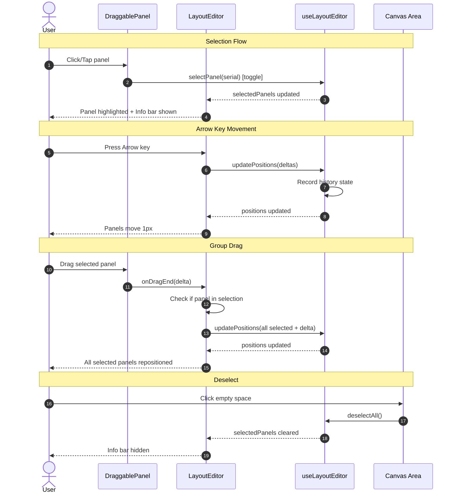

# Panel Selection & Precision Movement

Interactive panel selection with toggle-on-click, arrow key pixel movement, group drag, and a contextual info bar in the Layout Editor.

## Motivation

The current Layout Editor supports drag-and-drop positioning but lacks precision alignment tools. Users need to:
1. Fine-tune panel positions pixel-by-pixel after coarse drag placement
2. Move groups of panels together while maintaining their relative positions
3. Understand available actions through contextual UI guidance

This feature completes FR-3.4 (Keyboard Positioning) and enhances FR-3.5 (Multi-Select) from the Phase 2 spec.

## Functional Requirements

### FR-1: Panel Selection

**FR-1.1: Toggle-on-Click Selection**

Clicking or tapping a panel MUST toggle its selection state:
- Click/tap an unselected panel: adds it to the selection
- Click/tap a selected panel: removes it from the selection
- No modifier keys (Shift/Ctrl/Cmd) required for multi-select
- Modifier keys (Shift/Ctrl/Cmd + Click) also toggle (same behavior as regular click)
- Applies to both positioned panels on the canvas AND unpositioned panels in the sidebar

**FR-1.2: Deselect All**

Clicking/tapping empty canvas space (not on a panel) MUST deselect all panels.

**FR-1.3: Visual Selection State**

Selected panels MUST display:
- 3px solid white border
- Blue glow box-shadow (`0 0 0 2px #4a90d9`)
- Elevated z-index (10) above unselected panels

**FR-1.5: Click vs Drag Discrimination**

The click handler MUST NOT fire when a drag operation occurs:
- Mouse: if movement >= 5px (MouseSensor activation constraint), the interaction is a drag, not a click
- Touch: if hold >= 250ms, the interaction is a drag, not a click

**Implementation:** Pass `activeDragId` from LayoutEditor to DraggablePanel as an `isBeingDragged` prop:
- LayoutEditor already tracks `activeDragId` state via DndContext's `onDragStart`/`onDragEnd` callbacks
- Pass `isBeingDragged={activeDragId === panel.serial}` to each DraggablePanel
- In DraggablePanel's click handler, check `if (isBeingDragged) return;`

**Rationale:** This leverages the existing `activeDragId` state in LayoutEditor rather than adding redundant tracking. The parent component receives drag events directly from DndContext callbacks, which fire synchronously when the sensor activates. This avoids the race condition where useDraggable's `isDragging` state may not update before the click handler runs.

**FR-1.7: Escape Key Behavior**

Pressing Escape MUST follow a two-tier behavior:
- If any panels are selected: deselect all (do NOT exit edit mode)
- If no panels are selected: exit edit mode (existing behavior preserved)

**Implementation:** Update the existing Escape handler in LayoutEditor.tsx:

```typescript
// In the keydown handler, replace the existing Escape case:
if (e.key === 'Escape') {
  e.preventDefault();
  if (editor.selectedPanels.size > 0) {
    // First tier: deselect all, stay in edit mode
    editor.deselectAll();
  } else {
    // Second tier: exit edit mode (existing behavior)
    editor.exitEditMode();
  }
}
```

**FR-1.6: Touch Selection**

On touch devices:
- Quick tap (< 250ms, < 8px movement) toggles selection
- Hold (>= 250ms) initiates drag (does not toggle selection)
- This leverages the existing @dnd-kit TouchSensor activation constraint

**FR-1.6.1: Haptic Feedback on Drag Start**

When a touch-hold activates drag mode, provide haptic feedback:
```typescript
// In handleDragStart (LayoutEditor.tsx)
if (window.navigator.vibrate) {
  window.navigator.vibrate(50);  // 50ms vibration pulse
}
```

This provides tactile confirmation that drag mode has started, helping users distinguish between tap-to-select and hold-to-drag interactions.

### FR-2: Arrow Key Movement

**FR-2.1: Pixel Nudge**

When one or more panels are selected, arrow keys MUST move them:
- ArrowUp: move 1px up (decrease y_percent)
- ArrowDown: move 1px down (increase y_percent)
- ArrowLeft: move 1px left (decrease x_percent)
- ArrowRight: move 1px right (increase x_percent)

**FR-2.2: Percentage Conversion**

Arrow key movement converts 1 pixel to percentage based on image dimensions:
- `dx_percent = (1 / image_width) * 100`
- `dy_percent = (1 / image_height) * 100`

**FR-2.3: Group Movement**

When multiple panels are selected, arrow keys move ALL selected panels by the same delta, preserving their relative positions.

**FR-2.4: Group Boundary Clamping**

When moving multiple panels as a group (arrow keys or drag), boundary clamping MUST preserve relative positions:
- Compute the maximum allowable delta such that NO panel exceeds 0-100% on either axis
- Apply this (possibly reduced) delta uniformly to all selected panels
- This ensures the group moves as a unit and stops together when any panel reaches a boundary
- For single-panel movement, simple per-panel clamping (0-100%) is sufficient

**FR-2.5: Undo/Redo Integration**

Arrow key nudges MUST integrate with undo/redo:
- History state is recorded on `keyup` after a series of arrow key presses, not on every `keydown`
- This means holding an arrow key produces smooth movement, and releasing records a single undo step
- Implementation: track a `heldArrowKeys` ref (a `Set<string>`) that adds keys on keydown and removes on keyup; history is recorded only when the set becomes empty (all arrow keys released)
- This correctly handles simultaneous arrow keys (e.g., holding ArrowRight then pressing ArrowDown): history is recorded only when both are released
- This prevents overflow of the 50-state history buffer during continuous key holds

### FR-3: Group Drag

**FR-3.1: Selected Panel Drag**

When dragging a panel that IS in the current selection:
- All selected panels move together
- Relative positions between selected panels are preserved
- The drag delta (in percentage) is applied uniformly to all selected panels
- Snap-to-align operates on the dragged panel only; any snap offset is included in the delta applied to the entire group (this is intentional — snapping the leader panel to a grid line shifts all selected panels by the same amount, maintaining relative positions)

**FR-3.2: Unselected Panel Drag**

When dragging a panel that is NOT in the current selection:
- All existing selections are cleared before the drag begins
- Only the dragged panel moves
- After drop, no panels are selected (the dragged panel does NOT become selected)
- Standard single-panel drag behavior applies

**Rationale for no post-drop selection:** This allows users to quickly reposition multiple individual panels in sequence without accumulating selections. If the dragged panel became selected, users would need to click empty space between each drag to clear selection. The current behavior optimizes for rapid sequential repositioning. Users who want to continue manipulating the same panel can click it after dropping to select it.

**FR-3.3: Group Drag Visual Feedback**

During group drag:
- The directly-dragged panel shows the standard drag overlay
- Other selected panels remain in their original positions until drag ends (they jump to new positions on drop)
- This is a deliberate v1 simplification that avoids per-frame position recalculation for all selected panels. Real-time preview of group movement during drag may be added as a future enhancement.

### FR-4: Contextual Info Bar

**FR-4.1: Appearance**

When one or more panels are selected, display an info bar:
- Position: between the editor toolbar and the canvas area
- Background: `#1e3a5f` (dark blue, distinct from toolbar's `#1a1a1a`)
- Text: `#e0e0e0` (light gray), font size 13px
- Height: ~36px, horizontally padded 16px
- Icon: info circle icon (from lucide-react `Info`) on the left, color `#ffffff`
- Contrast ratio: text #e0e0e0 on #1e3a5f = ~5.5:1 (passes WCAG AA for normal text)

**FR-4.2: Content**

The info bar MUST display:
- Panel count: "1 panel selected" or "N panels selected" (conditional pluralization)
- Available actions: "Arrow keys to nudge | Drag to reposition | Click panel to deselect | Click empty space to deselect all"

On mobile (viewport < 768px), use shorter text:
- "N selected | Hold to drag | Tap to deselect | Tap empty to clear"

**FR-4.3: Dismissal**

The info bar disappears when:
- All panels are deselected
- No explicit close button needed (it's purely state-driven)

### FR-5: Mobile/Touch Considerations

**FR-5.1: Touch Target Size**

Panel overlays MUST have a minimum touch target of 44x44px regardless of the configured overlay size. If `overlaySize < 44`, the hit area extends beyond the visual boundary while preserving visual positioning.

**Implementation (wrapper div approach):** Use an invisible wrapper div that extends beyond the visual panel:

```typescript
// In DraggablePanel.tsx
const touchTargetSize = Math.max(44, overlaySize);
const offset = (touchTargetSize - overlaySize) / 2;

// Outer wrapper handles drag/click events with extended hit area
<div
  ref={setNodeRef}
  {...attributes}
  {...listeners}
  style={{
    position: 'absolute',
    width: touchTargetSize,
    height: touchTargetSize,
    left: `calc(${position.x_percent}% - ${touchTargetSize / 2}px)`,
    top: `calc(${position.y_percent}% - ${touchTargetSize / 2}px)`,
    cursor: isEditMode ? 'grab' : 'default',
  }}
  onClick={handleClick}
>
  {/* Inner div is the visible panel, centered within touch target */}
  <div
    style={{
      position: 'absolute',
      width: overlaySize,
      height: overlaySize,
      top: offset,
      left: offset,
      // Visual styling: background, border, shadow
    }}
  >
    {/* Panel content */}
  </div>
</div>
```

**Alternative (simpler):** Require `overlaySize >= 44` as a configuration constraint. This avoids the complexity of the wrapper div approach.

**Rationale:** Using `minWidth/minHeight` on a single div would shift the panel's visual center away from its coordinate position. The wrapper div approach preserves visual alignment by centering the visible panel within the larger touch target.

**FR-5.2: Info Bar Responsiveness**

The info bar MUST be readable on mobile:
- Text wraps if needed (no horizontal overflow)
- Shorter action text on viewports < 768px
- Touch-friendly height (minimum 44px on mobile)

**FR-5.3: No Arrow Key Dependency on Mobile**

Arrow key movement is a desktop enhancement. Mobile users rely on drag-and-drop for positioning. The info bar on mobile omits "Arrow keys to nudge" text.

## Non-Functional Requirements

**NFR-1: Arrow Key Responsiveness**

- Arrow key movement SHOULD render within a single animation frame (16ms at 60fps)
- Holding an arrow key for 1 second MUST result in at least 10 position updates (browser key repeat rate varies, but 10/sec is a reasonable floor)
- No single keydown handler execution SHALL exceed 50ms (verifiable via `performance.now()` in dev mode)
- The implementation should avoid expensive computations in the render path (percentage addition is O(n) on selected panels, which is acceptable)

**NFR-2: Group Drag Performance**

- Group drag with up to 50 selected panels MUST maintain 60fps
- Position calculations use simple addition (no spatial index needed for group moves)

**NFR-3: Accessibility**

- Info bar MUST use `role="status"` and `aria-live="polite"` for screen reader announcements
- Selected panel count changes announced to screen readers
- Arrow key movement prevents browser scroll via `e.preventDefault()` only when panels are selected
- Trade-off: users must deselect (Escape or click empty space) to restore arrow key scrolling of the canvas
- Arrow key handlers coexist with existing keyboard shortcuts (Ctrl+Z, Delete, etc.) without conflict since key codes are distinct

## High Level Design



### Component Changes

```
LayoutEditor.tsx
├── EditorToolbar (unchanged)
├── InfoBar (NEW - shown when selectedPanels.size > 0)
│   └── "N panel(s) selected · Arrow keys to nudge · ..."
├── Canvas
│   ├── DraggablePanel[] (click handler changed to always toggle)
│   └── AlignmentGuides
└── UnpositionedPanelsSidebar
```

### DraggablePanel Click Handler (DraggablePanel.tsx)

```typescript
// Updated prop types - single-argument onClick, plus isBeingDragged for click discrimination
interface DraggablePanelProps {
  // ... other props unchanged
  onClick?: (serial: string) => void;  // Was: (serial: string, addToSelection: boolean) => void
  isBeingDragged: boolean;  // NEW: passed from parent, true when activeDragId === panel.serial
}

// Updated click handler - checks isBeingDragged prop (set by parent from activeDragId)
const handleClick = (e: React.MouseEvent) => {
  if (!isEditMode || isBeingDragged) return;
  e.stopPropagation();
  onClick?.(panel.serial);  // Always calls toggle
};
```

In LayoutEditor.tsx, pass the prop:
```typescript
<DraggablePanel
  // ... other props
  isBeingDragged={activeDragId === panel.serial}
  onClick={editor.selectPanel}
/>
```

**BREAKING CHANGE:** The existing `selectPanel(serial, addToSelection)` behavior where `addToSelection=false` replaced the entire selection is removed. All clicks now toggle the clicked panel's selection state. If single-select-replace behavior is needed in the future, a separate function should be added.

The same change applies to `UnpositionedPanel` and `UnpositionedPanelsSidebar`:

```typescript
// UnpositionedPanelsSidebar prop type update
interface UnpositionedPanelsSidebarProps {
  // ... other props unchanged
  onPanelClick: (serial: string) => void;  // Was: (serial: string, addToSelection: boolean) => void
  activeDragId: string | null;  // NEW: for click vs drag discrimination
}

// UnpositionedPanel prop type update
interface UnpositionedPanelProps {
  // ... other props unchanged
  onClick: (serial: string) => void;
  isBeingDragged: boolean;  // NEW: passed from sidebar, true when activeDragId === panel.serial
}

// UnpositionedPanel click handler (same pattern as DraggablePanel)
const handleClick = () => {
  if (isBeingDragged) return;  // Same race condition guard as DraggablePanel
  onClick(panel.serial);
};

// In UnpositionedPanelsSidebar, pass the prop:
<UnpositionedPanel
  // ... other props
  isBeingDragged={activeDragId === panel.serial}
  onClick={onPanelClick}
/>
```

### Selection Logic (useLayoutEditor.ts)

```typescript
// Always toggle - no addToSelection parameter needed
const selectPanel = useCallback((serial: string) => {
  setSelectedPanels(prev => {
    const next = new Set(prev);
    if (next.has(serial)) {
      next.delete(serial);
    } else {
      next.add(serial);
    }
    return next;
  });
}, []);

// Select all positioned panels only (unpositioned panels can't be nudged/dragged)
const selectAll = useCallback(() => {
  const positioned = panels.filter(p => positions[p.serial] != null);
  setSelectedPanels(new Set(positioned.map(p => p.serial)));
}, [panels, positions]);
```

### Arrow Key Handler (LayoutEditor.tsx)

The following code blocks show the complete keyboard handling implementation. Add them in this order:

**1. Ref declaration (at component level, before useEffect hooks):**

```typescript
// Ref to track held arrow keys for undo coalescing (persists across renders)
const heldArrowKeys = useRef<Set<string>>(new Set());
```

**2. Arrow key handling (inside existing handleKeyDown effect):**

```typescript
if (['ArrowUp', 'ArrowDown', 'ArrowLeft', 'ArrowRight'].includes(e.key)) {
  if (editor.selectedPanels.size > 0) {
    // Filter to only positioned panels (unpositioned panels have no coordinates to nudge)
    const positionedSelection = [...editor.selectedPanels].filter(
      s => editor.positions[s] != null
    );
    if (positionedSelection.length === 0) return;

    heldArrowKeys.current.add(e.key);  // Track for keyup coalescing
    e.preventDefault();
    const dx = e.key === 'ArrowLeft' ? -1 : e.key === 'ArrowRight' ? 1 : 0;
    const dy = e.key === 'ArrowUp' ? -1 : e.key === 'ArrowDown' ? 1 : 0;
    let dxPercent = (dx / imageWidth) * 100;
    let dyPercent = (dy / imageHeight) * 100;

    // Group-aware clamping: reduce delta if any panel would exceed bounds
    for (const serial of positionedSelection) {
      const pos = editor.positions[serial]!;  // Safe: filtered above
      const newX = pos.x_percent + dxPercent;
      const newY = pos.y_percent + dyPercent;
      if (newX < 0) dxPercent = Math.max(dxPercent, -pos.x_percent);
      if (newX > 100) dxPercent = Math.min(dxPercent, 100 - pos.x_percent);
      if (newY < 0) dyPercent = Math.max(dyPercent, -pos.y_percent);
      if (newY > 100) dyPercent = Math.min(dyPercent, 100 - pos.y_percent);
    }

    const updates: Record<string, PanelPosition> = {};
    for (const serial of positionedSelection) {
      const pos = editor.positions[serial]!;  // Safe: filtered above
      updates[serial] = {
        x_percent: pos.x_percent + dxPercent,
        y_percent: pos.y_percent + dyPercent,
      };
    }
    editor.updatePositionsWithoutHistory(updates);
  }
}
```

**3. Keyup and blur handlers (separate useEffect in LayoutEditor.tsx):**

```typescript
useEffect(() => {
  const flushArrowKeyHistory = () => {
    if (heldArrowKeys.current.size > 0) {
      heldArrowKeys.current.clear();
      editor.recordCurrentHistoryState();
    }
  };

  const handleKeyUp = (e: KeyboardEvent) => {
    if (['ArrowUp', 'ArrowDown', 'ArrowLeft', 'ArrowRight'].includes(e.key)) {
      heldArrowKeys.current.delete(e.key);
      // Record history only when ALL arrow keys are released
      if (heldArrowKeys.current.size === 0) {
        editor.recordCurrentHistoryState();
      }
    }
  };

  // Flush pending history if user tabs away while holding arrow keys
  const handleBlur = () => {
    flushArrowKeyHistory();
  };

  window.addEventListener('keyup', handleKeyUp);
  window.addEventListener('blur', handleBlur);
  return () => {
    window.removeEventListener('keyup', handleKeyUp);
    window.removeEventListener('blur', handleBlur);
    // Flush on unmount (e.g., edit mode exit while holding keys)
    flushArrowKeyHistory();
  };
}, [editor.recordCurrentHistoryState]);
```

**Undo integration:** Arrow key nudges use `updatePositionsWithoutHistory` (a variant of `updatePositions` that skips the `recordHistoryState` call) during keydown. The keyup listener tracks when all arrow keys are released; on final keyup, it calls `recordHistoryState(positions)` once. The blur handler and cleanup function ensure history is recorded even if the user tabs away or exits edit mode while holding keys. This coalesces continuous key-hold nudges into a single undo step.

```typescript
// In useLayoutEditor.ts - add alongside existing updatePositions

// Ref to track latest positions (avoids stale closure in keyup handler)
const positionsRef = useRef(positions);
useEffect(() => { positionsRef.current = positions; }, [positions]);

const updatePositionsWithoutHistory = useCallback(
  (updates: Record<string, PanelPosition | null>) => {
    setPositions(prev => {
      const next = { ...prev, ...updates };
      // Ref update in updater is safe: useEffect also syncs positionsRef,
      // and keyup handler reads only after state flushes
      positionsRef.current = next;
      return next;
    });
    setHasUnsavedChanges(true);
  },
  []
);

// Expose for keyup handler in LayoutEditor.tsx
const recordCurrentHistoryState = useCallback(() => {
  recordHistoryState(positionsRef.current);
}, [recordHistoryState]);
```

The arrow key handler calls `updatePositionsWithoutHistory` on keydown. The keyup handler calls `editor.recordCurrentHistoryState()` when all arrow keys are released (reads from `positionsRef` internally, avoiding stale closure issues).

Add to the hook's return object:
```typescript
return {
  // ... existing returns
  updatePositionsWithoutHistory,
  recordCurrentHistoryState,
};
```

### Group Drag Logic (LayoutEditor.tsx handleDragEnd)

This block replaces the existing `editor.updatePosition(panel.serial, percentPos)` call at the end of `handleDragEnd`:

```typescript
// percentPos is already computed by the existing code via pixelToPercent(newPosition, ...)
const percentPos = pixelToPercent(newPosition, { width: imageWidth, height: imageHeight });

// Filter to only positioned panels (unpositioned sidebar panels have no coordinates)
const positionedSelection = [...editor.selectedPanels].filter(
  s => editor.positions[s] != null
);

if (editor.selectedPanels.has(panel.serial) && positionedSelection.length > 1) {
  // Group drag: apply same delta to all selected positioned panels
  const oldPos = editor.positions[panel.serial];
  if (oldPos) {
    const deltaX = percentPos.x_percent - oldPos.x_percent;
    const deltaY = percentPos.y_percent - oldPos.y_percent;

    // Compute max allowable delta so no panel exceeds bounds
    let clampedDeltaX = deltaX;
    let clampedDeltaY = deltaY;
    for (const serial of positionedSelection) {
      const pos = editor.positions[serial]!;  // Safe: filtered above
      const newX = pos.x_percent + deltaX;
      const newY = pos.y_percent + deltaY;
      if (newX < 0) clampedDeltaX = Math.max(clampedDeltaX, -pos.x_percent);
      if (newX > 100) clampedDeltaX = Math.min(clampedDeltaX, 100 - pos.x_percent);
      if (newY < 0) clampedDeltaY = Math.max(clampedDeltaY, -pos.y_percent);
      if (newY > 100) clampedDeltaY = Math.min(clampedDeltaY, 100 - pos.y_percent);
    }

    const updates: Record<string, PanelPosition> = {};
    for (const serial of positionedSelection) {
      const pos = editor.positions[serial]!;  // Safe: filtered above
      updates[serial] = {
        x_percent: pos.x_percent + clampedDeltaX,
        y_percent: pos.y_percent + clampedDeltaY,
      };
    }
    editor.updatePositions(updates);
    return; // Skip single-panel update
  }
} else if (!editor.selectedPanels.has(panel.serial)) {
  // Dragging unselected panel: clear selection
  editor.deselectAll();
}

// Single panel update (existing behavior)
editor.updatePosition(panel.serial, percentPos);
```

### Info Bar Component (inline in LayoutEditor.tsx)

```typescript
// isMobile is computed on each render. Since selection changes trigger re-renders,
// this is sufficient for typical use (no resize listener needed).
const isMobile = window.innerWidth < 768;

{editor.selectedPanels.size > 0 && (
  <div style={{
    display: 'flex',
    alignItems: 'center',
    gap: '8px',
    padding: '8px 16px',
    backgroundColor: '#1e3a5f',
    color: '#e0e0e0',
    fontSize: '13px',
    borderBottom: '1px solid #2a4a6f',
    minHeight: isMobile ? '44px' : '36px',
  }}
  role="status"
  aria-live="polite"
  >
    <Info size={16} />
    <span>
      {editor.selectedPanels.size} panel{editor.selectedPanels.size > 1 ? 's' : ''} selected
      {isMobile
        ? ' · Hold to drag · Tap to deselect · Tap empty to clear'
        : ' · Arrow keys to nudge · Drag to reposition · Click panel to deselect · Click empty space to deselect all'
      }
    </span>
  </div>
)}
```

## Task Breakdown

1. **Update selectPanel to always toggle**
   - Remove `addToSelection` parameter from `selectPanel` in useLayoutEditor.ts
   - Update `DraggablePanel.tsx` click handler (both DraggablePanel and UnpositionedPanel) to not pass `addToSelection`
   - Update `onClick` prop type signature in both panel components
   - Update UnpositionedPanelsSidebar's `onPanelClick` prop type

2. **Add arrow key handler and keyboard changes**
   - Add `updatePositionsWithoutHistory` and `recordCurrentHistoryState` to useLayoutEditor.ts (expose in return object)
   - Add `positionsRef` to track latest positions for stale-closure-safe history recording
   - Update `selectAll` to only select positioned panels
   - Change Escape handler: if panels selected → deselect all; else → exit edit mode (FR-1.7)
   - Add ArrowUp/Down/Left/Right handling to existing `handleKeyDown` in LayoutEditor.tsx
   - Convert 1px to percentage using `imageWidth`/`imageHeight`
   - Call `editor.updatePositionsWithoutHistory()` for group movement during keydown
   - Add `keyup` listener with `heldArrowKeys` Set to record history when all arrow keys released
   - Verify boundary clamping (0-100%)

3. **Implement group drag**
   - In `handleDragEnd`, detect if dragged panel is in selection
   - If yes and selection > 1: compute delta, apply to all selected panels
   - If no: call `editor.deselectAll()` before moving single panel
   - Verify relative positions maintained

4. **Add info bar**
   - Add inline info bar div between EditorToolbar and canvas area
   - Conditional render when `editor.selectedPanels.size > 0`
   - Mobile-responsive text (shorter on < 768px viewport)
   - Import `Info` icon from lucide-react
   - Add `role="status"` and `aria-live="polite"`

5. **Touch target and selection support**
   - Implement wrapper div approach in DraggablePanel for touch target extension (see FR-5.1)
   - Outer div sized to `max(44, overlaySize)`, inner visible div centered within
   - Alternative: if all deployments use overlaySize >= 44, document as configuration constraint instead
   - Verify @dnd-kit's existing TouchSensor delay (250ms) allows quick taps to fire click events
   - Test on touch device or emulator

6. **Build and verify**
   - `docker compose up --build -d`
   - Test via Playwright MCP at http://localhost:5174

## Test Scenarios

### E2E Tests (via Playwright MCP)

1. **Click to select**: Click panel A1 → verify selection styles appear (3px white border, blue glow shadow per FR-1.3)
2. **Click to deselect**: Click selected panel A1 → verify highlight removed
3. **Multi-select**: Click A1, then click A2 → verify both highlighted, info bar shows "2 panels selected"
4. **Deselect all**: Click empty canvas → verify all deselected, info bar hidden
5. **Arrow key nudge**: Select A1, press ArrowRight → verify panel moves 1px right
6. **Group arrow nudge**: Select A1 + A2, press ArrowDown → verify both move, relative positions preserved
7. **Group drag**: Select A1 + A2 + A3, drag A1 → verify all three reposition with same delta
8. **Unselected drag**: Select A1, drag unselected A2 → verify A1 deselected, only A2 moves, after drop no panels are selected and info bar is hidden
9. **Boundary clamping**: Move panel to edge, press arrow toward boundary → verify it stops at edge

### Touch-Specific Tests

10. **Quick tap selects**: On touch emulator, tap panel quickly (< 250ms) → verify selection toggles
11. **Hold initiates drag**: Touch-hold panel for > 250ms and move → verify drag occurs, selection NOT toggled, haptic feedback triggered
12. **Drag vs tap discrimination**: Tap-and-release in < 250ms with < 8px movement → verify selection toggles (not drag)

### Keyboard Shortcut Tests

13. **Select all (Ctrl+A)**: Press Ctrl+A → verify all positioned panels are selected, info bar shows correct count
14. **Escape deselects**: Select panels, press Escape → verify all deselected, info bar hidden
15. **Delete unpositions**: Select panel A1, press Delete → verify panel moved to sidebar (unpositioned)

### Boundary & Group Tests

16. **Group boundary clamping**: Select two panels where one is near the right edge, press ArrowRight repeatedly → verify both stop when the rightmost panel reaches the boundary (left panel preserves relative offset)
17. **Sidebar panel selection**: Click unpositioned panel in sidebar → verify it toggles selection (same toggle behavior as canvas panels)

### Undo/Redo Tests

18. **Arrow key undo**: Select panel, press ArrowRight 5 times, release, Ctrl+Z → verify panel returns to position before the nudge series (single undo step)
19. **Group drag undo**: Group drag 3 panels, Ctrl+Z → verify all 3 return to original positions
20. **Multi-key nudge undo**: Hold ArrowRight, then also hold ArrowDown, release both → verify single undo step recorded (not two)

### Edge Case Tests

21. **Mixed selection with unpositioned panel**: Select a canvas panel and a sidebar panel, press ArrowRight → verify only the canvas panel moves (sidebar panel ignored)
22. **Arrow key at boundary**: Move panel to x_percent=100%, press ArrowRight → verify no movement occurs (panel stays at boundary), no error thrown
23. **Snap offset in group drag**: Select 3 panels, drag leader so it snaps to align guide → verify all 3 panels shift by snap amount, relative positions preserved
24. **Tab away while holding arrow**: Select panel, hold ArrowDown, switch browser tabs → verify Ctrl+Z after returning undoes the movement (blur handler recorded history)
25. **Small movement delta**: On a large image (e.g., 5000px wide), press ArrowRight → verify panel moves by 0.02% (1/5000 * 100), position change is visible after multiple presses

## Context / Documentation

| File | Purpose |
|------|---------|
| `dashboard/frontend/src/components/layout-editor/DraggablePanel.tsx` | Panel click handler and visual states |
| `dashboard/frontend/src/components/layout-editor/LayoutEditor.tsx` | Keyboard handler, drag end logic, layout |
| `dashboard/frontend/src/components/layout-editor/useLayoutEditor.ts` | selectPanel, updatePositions, selection state |
| `dashboard/frontend/src/components/layout-editor/types.ts` | PanelPosition, snap types |
| `docs/specs/2026-01-19-multi-user-config-phase2.md` | Parent spec (FR-3.4, FR-3.5) |

### Libraries Used

| Library | Purpose |
|---------|---------|
| `@dnd-kit/core` | Drag and drop (existing) |
| `lucide-react` | Icons - `Info` for info bar (existing dependency) |

---

**Specification Version:** 1.6
**Last Updated:** January 2026
**Authors:** Claude (AI Assistant)

## Changelog

### v1.6 (January 2026)
**Summary:** Comprehensive review pass - 20 issues resolved across 4 iterations

**Changes:**
- FR-1.5: Changed to prop-based isDragging tracking to avoid React state race conditions
- FR-1.7: Added complete Escape key handler code sample
- FR-5.1: Replaced pseudo-element approach with wrapper div approach (React inline styles can't create pseudo-elements)
- FR-1.6.1: Added haptic feedback (navigator.vibrate) specification
- NFR-1: Added measurable performance criteria (10 updates/sec, 50ms max handler time)
- Consolidated all keyboard handling code into numbered, ordered sections
- Added blur event listener for keyup coalescing to handle tab-away and unmount
- Added 5 edge case test scenarios (21-25): mixed selection, boundary, snap offset, blur, zero delta
- Fixed test timing (200ms → 250ms) to match FR-1.6
- Updated mobile info bar text to include "Hold to drag"
- Documented BREAKING CHANGE for selectPanel toggle behavior
- Updated task breakdown to match implementation approaches
- Added positionedSelection filtering in arrow key and group drag handlers

### v1.5 (January 2026)
**Summary:** Review fixes - consistent drag detection across all panel types

**Changes:**
- Added isBeingDragged prop and click guard to UnpositionedPanel (consistent with DraggablePanel)
- Added activeDragId prop to UnpositionedPanelsSidebar to thread through to panels
- Updated UnpositionedPanelProps interface with isBeingDragged

### v1.4 (January 2026)
**Summary:** Review fixes - simplified drag detection, removed duplicate code

**Changes:**
- FR-1.5: Changed from ref-based to prop-based drag detection (isBeingDragged prop from activeDragId)
- Simplified DraggablePanel props - removed onDragStart/onDragEnd, added isBeingDragged
- Removed duplicate keyup handler section (was missing blur handler)
- Fixed test scenario 25 to match actual implementation (no Math.max safeguard needed)

### v1.3 (January 2026)
**Summary:** Review fixes - race conditions, edge cases, measurable requirements, code consolidation

**Changes:**
- FR-1.5: Changed from state-based to ref-based isDragging tracking to avoid React timing race conditions
- FR-1.6.1: Added haptic feedback (navigator.vibrate) on touch drag activation
- FR-3.2: Documented rationale for no post-drop selection (optimizes sequential repositioning)
- FR-5.1: Changed touch target implementation from minWidth/Height to pseudo-element approach
- NFR-1: Added measurable performance criteria (10 updates/sec, 50ms max handler time)
- Consolidated keyboard handling code into ordered, complete snippets with ref declaration
- Added blur event handler to flush arrow key history when user tabs away
- Added pre-filtering of selection to positioned panels only in arrow key and group drag handlers
- Updated mobile info bar text to include "Hold to drag" hint
- Added test scenarios 21-25 for edge cases (mixed selection, boundary, snap, blur, zero delta)
- Fixed test scenario timing: 200ms → 250ms to match FR-1.6
- Documented breaking change: selectPanel now always toggles (was replace when addToSelection=false)
- Added onDragStart/onDragEnd callbacks to DraggablePanel props for ref-based tracking

### v1.2 (January 2026)
**Summary:** Review fixes - stale closure resolution, Escape key behavior, keyup coalescing completeness

**Changes:**
- FR-1.7: Added two-tier Escape behavior (deselect first, exit edit mode second)
- Added `positionsRef` and `recordCurrentHistoryState` to solve stale closure in keyup handler
- Added `updatePositionsWithoutHistory` with safety comment for ref update in setState updater
- Updated `selectAll` to only select positioned panels
- Added complete prop type signatures for DraggablePanel, UnpositionedPanel, and sidebar
- Added `heldArrowKeys.current.add(e.key)` to arrow key handler code block
- Changed keyup useEffect dependency to `[editor.recordCurrentHistoryState]` for stability
- Added keyup handler code snippet and updated return object
- Added test scenarios: group boundary clamping, Ctrl+A, Escape, sidebar, Delete, multi-key undo (20 total)
- Updated test scenario 8 to verify no selection after unselected drag
- FR-3.1: Documented snap offset inclusion in group delta as intentional

### v1.1 (January 2026)
**Summary:** Review fixes - boundary clamping, undo coalescing, click/drag discrimination, test scenarios

**Changes:**
- FR-1.1: Clarified toggle applies to both canvas and sidebar panels
- FR-1.5: Added click vs drag discrimination requirement
- FR-2.4: Changed from per-panel clamping to group-aware boundary clamping
- FR-2.5: Changed from per-keypress history to keyup-based coalescing
- FR-3.3: Documented group drag jump as deliberate v1 simplification
- FR-4.1: Documented contrast ratio, explicit icon color
- FR-5.1: Added touch target implementation approach
- Group drag code: fixed variable naming, added group-aware boundary clamping
- Arrow key code: added group-aware boundary clamping
- Added Test Scenarios section (E2E, touch, undo/redo)
- NFR-1: Softened to SHOULD for 16ms target
- NFR-3: Documented arrow key scroll trade-off
- Task breakdown: added sidebar panel changes and touch target task

### v1.0 (January 2026)
**Summary:** Initial specification for panel selection and precision movement

**Changes:**
- Initial specification created
- Defined toggle-on-click selection model
- Specified arrow key 1px movement
- Specified group drag with relative position preservation
- Added contextual info bar design
- Included mobile/touch considerations
