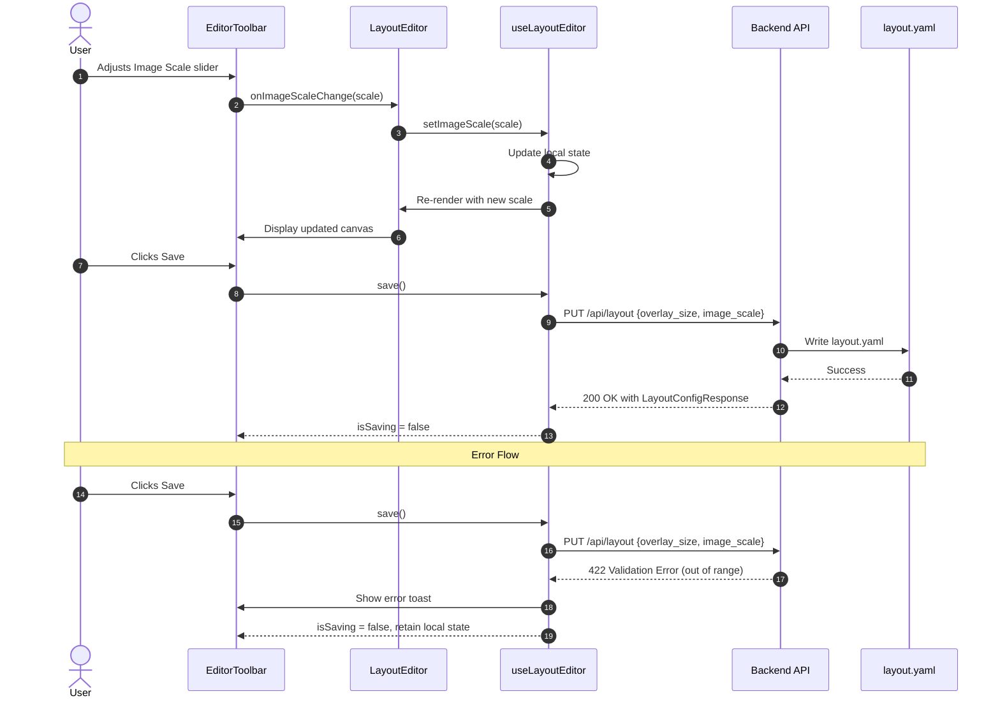

# Layout Editor Size Controls Enhancement

Add independent background image scale and panel overlay size controls with clear labels to the Layout Editor. These settings are persisted to configuration and preserved during backup/restore.

## Motivation

Currently, the Layout Editor has a single "Size:" slider that controls panel overlay size, but:

1. **Unclear labeling** - "Size:" is ambiguous and doesn't indicate it controls panel overlays
2. **No image scaling** - Users cannot scale the background layout image independently of panel overlays
3. **Limited flexibility** - Users with high-resolution layout images or varying panel densities need independent control over both dimensions

This enhancement improves usability by adding clear labels and giving users control over both the background image display scale and the panel overlay size.

## Functional Requirements

### FR-1: Panel Size Slider Label

**FR-1.1:** The existing overlay size slider MUST be labeled "Panel Size" instead of "Size:".

**FR-1.2:** The tooltip MUST read "Panel overlay size in pixels (20-200)".

### FR-2: Image Scale Slider

**FR-2.1:** A new "Image Scale" slider MUST be added to the Layout Editor toolbar.

**FR-2.2:** The slider MUST control the display scale of the background layout image as a percentage (25% to 200%). The slider MUST increment in steps of 5%.

**FR-2.3:** The slider MUST have a numeric input field showing the current percentage value.

**FR-2.4:** The default value MUST be 100% (native image size).

**FR-2.5:** The tooltip MUST read "Background image display scale (25%-200%) - editor only".

**FR-2.6:** The image scale MUST only affect the editor view. The main dashboard view continues to use fit-to-viewport zoom controls.

**FR-2.7:** Numeric input validation MUST behave as follows:
- On blur: clamp value to valid range (25-200)
- If input is empty or non-numeric: reset to 100 (default)
- Values outside range (including negative, zero, or very large numbers) are clamped to 25-200, not rejected
- Non-multiple-of-5 values from numeric input are accepted and stored as-is
- Decimal input (e.g., "150.5") is truncated to integer via `parseInt`; scientific notation (e.g., "1.5e2") parses as 1 with `parseInt` (stops at non-digit). For consistent handling of edge cases, consider: `Math.trunc(Number(value))` which handles scientific notation correctly (1.5e2 -> 150). Current implementation uses `parseInt(value, 10)` for simplicity; edge cases are acceptable given unlikely user input

**FR-2.8:** The slider MUST support keyboard control:
- Left/Down Arrow: decrease by 5%
- Right/Up Arrow: increase by 5%
- Home: jump to 25%
- End: jump to 200%
- Page Up/Page Down: native behavior (browser-dependent, typically larger jumps)
- Focus MUST be visible (2px outline minimum)

**Keyboard and number input interaction:** Number input allows any integer 25-200 (step=1). When slider receives focus after number input set a non-multiple-of-5 value (e.g., 152%), arrow keys move by slider's step (5%), potentially resulting in 155% or 150% depending on browser rounding behavior. This is expected native behavior.

Note: Native `<input type="range">` provides Home/End key support automatically. No custom handlers needed; this requirement leverages browser-native behavior.

**Keyboard history recording:** History is recorded on blur only (when user tabs away from slider). This prevents flooding the 50-state buffer with individual keypress states while ensuring changes are captured before focus moves elsewhere.

**Limitation:** If user makes keyboard changes and clicks Save without blurring (focus stays on slider), the blur doesn't fire and history isn't recorded before save.

**Workaround (implement in save function):**
```typescript
const save = async () => {
  // Record any pending history before save (handles keyboard-change-then-save without blur)
  commitIfPending();

  try {
    await updatePanelPositions(positions);
    // ... rest of save logic
  }
};
```
Alternatively, document this as a known limitation - undo after save reflects the last recorded state, not necessarily the final keyboard adjustment.

### FR-3: Visual Layout

**FR-3.1:** The toolbar controls MUST be arranged in this order (left to right):
1. Undo/Redo buttons
2. Separator
3. Snap toggle
4. Separator
5. Image Scale slider (NEW)
6. Separator
7. Panel Size slider (renamed)
8. Separator
9. Selection info (when applicable)
10. Upload Image button
11. Spacer
12. Discard/Save buttons

**Separator definition:**
- Visual: 1px vertical line, color #ddd, height 24px
- Spacing: 8px margin on each side (total 17px width)
- Accessibility: `role="separator"` `aria-orientation="vertical"`

**Separator implementation:**
```tsx
<div
  role="separator"
  aria-orientation="vertical"
  style={{
    width: '1px',
    height: '24px',
    backgroundColor: '#ddd',
    margin: '0 8px',
  }}
/>
```
Note: Using `role="separator"` allows screen readers to understand toolbar structure. These toolbar separators are structural (grouping related controls), so use `role="separator"`. If adding visual-only separators elsewhere for aesthetics, use `aria-hidden="true"` instead.

**Selection info behavior:**
- Single panel selected: displays "Panel: {id} ({x}%, {y}%)"
- Multiple panels selected: displays "{count} panels selected"
- No selection: element not rendered (not just hidden)

**Selection info styling constraints:**
- Max-width: 200px; min-width: 100px
- Text overflow: ellipsis (for long panel IDs)
- Panel IDs truncated to 20 characters with ellipsis if needed
- Count display has no upper limit (bounded by actual panel count in system)

**FR-3.2:** Each slider group MUST display: `[Label] [Slider] [Input] [Unit]`
- Image Scale: `Image Scale: [slider] [input] %`
- Panel Size: `Panel Size: [slider] [input] px`

### FR-4: Persistence

**FR-4.1:** The image scale value MUST be stored in `config/layout.yaml` as `image_scale` (integer percentage, e.g., 100 for 100%).

**FR-4.2:** The image scale MUST default to 100 if not present in configuration. Both the backend (`LayoutConfig.image_scale = Field(default=100)`) and frontend (`layoutConfig?.image_scale ?? 100`) MUST use the same default value for consistency with legacy data.

**FR-4.3:** The image scale MUST be saved when the user clicks "Save" in the editor.

### FR-5: Backup and Restore

**FR-5.1:** The `image_scale` field MUST be included in backup ZIP files within `layout.yaml`.

**Implementation note:** `LayoutConfig` is serialized via Pydantic's `model_dump()` which automatically includes `image_scale` since it's a defined field. No code change needed in `backup_service.py create_backup()`.

**Requirement:** Pydantic v2 with default config (`extra='ignore'`) for backward compatibility with legacy backups. New fields are automatically serialized; extra fields in older backups are silently ignored during deserialization.

**FR-5.2:** During restore, the `image_scale` value MUST be preserved (following the same pattern as `overlay_size`).

**FR-5.3:** The restore workflow MUST pass `image_scale` to the backend when committing the restore image.

**FR-5.4:** Legacy backup parsing MUST handle edge cases gracefully:
- If `image_scale` is missing/null: default to 100
- If `image_scale` is invalid type: log warning, use 100
- If `image_scale` is out of range (e.g., 500 from manual edit): clamp to 25-200 with warning

```python
# In LayoutConfig model:
import logging

logger = logging.getLogger(__name__)

@field_validator('image_scale', mode='before')
@classmethod
def clamp_image_scale(cls, v):
    if v is None:
        return 100
    try:
        v = int(v)
        if v < 25 or v > 200:
            logger.warning(f"image_scale {v} out of range, clamping to {max(25, min(200, v))}")  # image_scale is not sensitive data; logging original value aids debugging
            return max(25, min(200, v))
        return v
    except (TypeError, ValueError):
        logger.warning(f"image_scale has invalid type {type(v).__name__}, using default 100")
        return 100
```

### FR-6: Editor Behavior

**FR-6.1:** Changing the image scale MUST immediately update the canvas display without requiring save.

**FR-6.2:** Image scale changes MUST be included in the undo/redo history. The existing history mechanism MUST be extended to track both positions and image scale:

```typescript
// PanelPosition type definition (also see Panel Selection spec)
interface PanelPosition {
  x: number;  // 0-100 percentage of image width
  y: number;  // 0-100 percentage of image height
}
// null indicates panel uses auto-layout position (not user-positioned)
// See Panel Selection spec (2026-01-24-panel-selection-movement.md) for null position handling

interface EditorHistoryState {
  positions: Record<string, PanelPosition | null>;
  imageScale: number;
}

// Update EditHistory type to use EditorHistoryState
interface EditHistory {
  states: EditorHistoryState[];
  currentIndex: number;
}

// Derived state for button enablement (recalculated on every render - no memoization needed)
const canUndo = history.currentIndex > 0;
const canRedo = history.currentIndex < history.states.length - 1;

// Return from hook for UI consumption:
// return { canUndo, canRedo, undo, redo, ... };
```

**Implementation changes to useLayoutEditor.ts:**

```typescript
// Update recordHistoryState to capture both positions and imageScale
// Call this on: panel drag END, slider RELEASE (onMouseUp/onTouchEnd), numeric input BLUR
const recordHistoryState = useCallback((
  newPositions: Record<string, PanelPosition | null>,
  newImageScale: number
) => {
  setHistory(prev => {
    const truncated = prev.states.slice(0, prev.currentIndex + 1);
    const newState: EditorHistoryState = {
      positions: { ...newPositions },
      imageScale: newImageScale
    };
    // Truncation strategy:
    // 1. Discard redo states beyond currentIndex (user's new action invalidates forward history)
    // 2. Append new state
    // 3. If exceeds 50, discard oldest states (FIFO)
    // 4. currentIndex always points to the new state
    const newStates = [...truncated, newState].slice(-50);
    return {
      states: newStates,
      currentIndex: newStates.length - 1  // Always point to newest
    };
  });
}, []);

// Update undo to restore both positions and imageScale
// Pattern: Use ref to get current state synchronously, avoiding stale closure issues with rapid clicks
const historyRef = useRef(history);
useEffect(() => { historyRef.current = history; }, [history]);

const undo = useCallback(() => {
  const currentHistory = historyRef.current;
  // Explicit boundary check - distinguishes "at oldest state" from "corrupted history"
  if (currentHistory.currentIndex <= 0) return;
  const stateToRestore = currentHistory.states[currentHistory.currentIndex - 1];

  // Guard uses ref for synchronous check; setState rechecks in case of concurrent updates
  setHistory(prev => {
    if (prev.currentIndex <= 0) return prev;
    return { ...prev, currentIndex: prev.currentIndex - 1 };
  });
  setPositions(stateToRestore.positions);
  setImageScale(stateToRestore.imageScale);
}, []);  // No deps needed - reads from ref

// Update redo to restore both positions and imageScale
// Same ref pattern as undo for consistency
const redo = useCallback(() => {
  const currentHistory = historyRef.current;
  // Explicit boundary check - distinguishes "at newest state" from "corrupted history"
  if (currentHistory.currentIndex >= currentHistory.states.length - 1) return;
  const stateToRestore = currentHistory.states[currentHistory.currentIndex + 1];

  // Guard uses ref for synchronous check; setState rechecks in case of concurrent updates
  setHistory(prev => {
    if (prev.currentIndex >= prev.states.length - 1) return prev;
    return { ...prev, currentIndex: prev.currentIndex + 1 };
  });
  setPositions(stateToRestore.positions);
  setImageScale(stateToRestore.imageScale);
}, []);  // No deps needed - reads from ref

// Update enterEditMode to initialize history with EditorHistoryState shape
const enterEditMode = useCallback(() => {
  setIsEditMode(true);
  const initialState: EditorHistoryState = {
    positions: { ...positions },
    imageScale: imageScale
  };
  setHistory({ states: [initialState], currentIndex: 0 });
}, [positions, imageScale]);
```

**History recording triggers:**
```typescript
// For slider - record on release, not during drag
// Use pending flag to prevent duplicate recordings (release + blur)
// Pending history is lost on unmount, which is acceptable since edit mode exit clears history regardless.
const [pendingHistoryRecord, setPendingHistoryRecord] = useState(false);

// Use refs to avoid stale closure issues - slider onChange sets new value but
// onMouseUp fires before React re-renders, so closure would capture stale values
const positionsRef = useRef(positions);
const imageScaleRef = useRef(imageScale);
// IMPORTANT: These useEffects create a timing gap between setState and ref update.
// Any code path calling setImageScale/setPositions MUST also manually sync the ref
// immediately if the value is needed before the next render (see onChange handler below).
// Consider extracting to a useRefState hook if this pattern causes bugs.
useEffect(() => { positionsRef.current = positions; }, [positions]);
useEffect(() => { imageScaleRef.current = imageScale; }, [imageScale]);

// Note: pendingHistoryRecord in deps causes callback recreation on flag change.
// A ref-based approach (pendingRef.current) would make this stable but harder to debug.
// Current approach is clearer; recreation overhead is negligible for this use case.
const commitIfPending = useCallback(() => {
  if (pendingHistoryRecord) {
    recordHistoryState(positionsRef.current, imageScaleRef.current);
    setPendingHistoryRecord(false);
  }
}, [pendingHistoryRecord, recordHistoryState]);

<input
  type="range"
  onChange={(e) => {
    const newScale = parseInt(e.target.value, 10);
    setImageScale(newScale);
    imageScaleRef.current = newScale;  // Sync ref immediately for onMouseUp
    setPendingHistoryRecord(true);
  }}
  onMouseUp={commitIfPending}
  onTouchEnd={commitIfPending}
  onTouchCancel={commitIfPending}  // Handle touch cancellation (e.g., phone call interruption). Design decision: commit (not discard) interrupted gesture so user's partial progress is preserved.
  onBlur={commitIfPending}
/>
```

This pattern prevents duplicate history entries when user releases slider and then tabs away (which would otherwise trigger both onMouseUp and onBlur).

**Memory considerations:**
- Each history state creates a shallow copy of positions object via `{ ...newPositions }`
- **Important:** Positions must always be updated immutably (create new objects, don't mutate). History corruption examples:
```typescript
// CORRECT - immutable updates:
setPositions(prev => ({...prev, [id]: {...prev[id], x: newX}}));  // Update
setPositions(prev => ({...prev, [newId]: newPosition}));  // Add
setPositions(prev => Object.fromEntries(
  Object.entries(prev).filter(([k]) => k !== id)
));  // Remove

// WRONG - mutations corrupt history:
positions[id].x = newX;  // Mutates in place
delete positions[id];    // Mutates in place
Object.assign(positions, updates);  // Mutates in place
```
Consider using Immer if mutation safety becomes a concern.
- PanelPosition values are shared by reference unless modified (structural sharing)
- Worst case (all panels moved each state): 200 panels x 50 states = 10,000 PanelPosition objects
- Typical case (few panels moved): ~200 + (moves x 50) PanelPosition objects
- Estimated memory: ~500KB worst case, ~50KB typical
- History is cleared on exitEditMode and page navigation
- History is NOT persisted to draft storage (by design - drafts restore last save, not undo history)

On undo/redo, both `positions` and `imageScale` are restored to their previous values.

**FR-6.3:** Panel positions (stored as percentages) MUST remain accurate regardless of image scale.

**Position calculation formulas:**

**Display (percentage to pixels):**
```
pixelX = (position.x / 100) * scaledWidth
pixelY = (position.y / 100) * scaledHeight

where scaledWidth = imageWidth * (imageScale / 100)
      scaledHeight = imageHeight * (imageScale / 100)
```

**Storage (pixels to percentage, for drag operations):**
```
position.x = (pixelX / scaledWidth) * 100
position.y = (pixelY / scaledHeight) * 100

where pixelX/Y is the mouse position relative to the canvas origin.
```

**Clarification on percentage storage:** Stored percentages are relative to the **original** image dimensions (scale-independent). The formulas above convert to/from pixel positions on the *scaled* canvas for display and interaction. When image scale changes, stored percentage values remain unchanged - only the rendered pixel positions change. This ensures panel positions don't drift when scale changes.

**Worked example (proving scale-independence):**
Given: imageWidth=1000px, imageScale=200% (so scaledWidth=2000px)
User clicks at visual center: pixelX = scaledWidth/2 = 1000px
```
position.x = (1000 / 2000) * 100 = 50%  ✓
```
At 50% scale (scaledWidth=500px), same percentage position:
```
pixelX = (50 / 100) * 500 = 250px  (visual center of 500px canvas)  ✓
```
The stored 50% correctly maps to the visual center regardless of scale.

- The panel's top-left corner aligns with (pixelX, pixelY)
- Panel overlay size is independent of image scale (controlled by Panel Size slider)

**FR-6.4:** Alignment guides and snap functionality MUST work correctly at all image scales:
- Snap detection threshold: 10 screen pixels (fixed, does not scale with image scale)
- Guide lines render at exact pixel positions matching snapped percentage
- Snap calculations occur in pixel space, then convert to percentage for storage

**Snap threshold UX tradeoff:** The fixed 10px threshold means snapping feels "stronger" at low zoom (10px = larger percentage) and "weaker" at high zoom (10px = smaller percentage). This matches typical user expectations: at low zoom, coarser control is acceptable; at high zoom, users want precision.

If user feedback indicates the opposite is desired (easier snapping when zoomed in for precision alignment), use a scale-aware threshold:
- `thresholdPixels = 10 * (imageScale / 100)` - At 200% scale: 20px threshold (easier snapping). At 25% scale: 2.5px threshold (harder snapping).
- `thresholdPixels = 10 * (100 / imageScale)` - Inverse: easier snapping at low zoom, harder at high zoom.

**FR-6.5:** Clicking "Discard" MUST:
- Reset imageScale to the value in persisted config (layout.yaml)
- Reset panel positions to persisted values
- Clear undo/redo history
- Exit edit mode

**Note on partial save recovery:** After a partial save failure (positions saved, config failed), "Discard" resets only unsaved changes. Positions remain at server state (which includes the partial save), while settings revert to their pre-edit values. This may create an unusual state where positions and settings reflect different edit sessions.

**UX consideration:** Users may not understand why panel positions persist after clicking "Discard". Options to address:
1. Show confirmation: "Some changes were already saved. Discard will only revert unsaved settings. Continue?"
2. Add "Revert All" button that fetches fresh state from server
3. Document in user help text that partial saves can occur

Current implementation accepts this limitation as it preserves successfully saved work.

## Non-Functional Requirements

**NFR-1:** The image scale slider MUST respond to input within 50ms (smooth dragging).
- Reference hardware: 4-core CPU, 8GB RAM
- Measurement: Chrome DevTools Performance panel, from input event to next frame paint
- Panel count: up to 100 panels on canvas
- If exceeds 50ms with >100 panels, document as known limitation
- Verified via manual testing or performance profiling, not automated tests

**Automated performance testing (out of scope):** Automated CI/CD performance testing is not required for this feature. The 50ms threshold is verified manually before release. Before release, run manual performance test on reference hardware (4-core, 8GB RAM) with 100 panels. Use Chrome DevTools Performance panel to verify slider-to-paint < 50ms. Document result in release notes. If automated testing is desired later, consider a Playwright test measuring slider-to-render latency with a relaxed threshold (100ms) to account for CI variance.

**NFR-2:** The **toolbar layout** MUST not cause horizontal scrolling on viewports 900px or wider.

Note: The canvas area may scroll horizontally when image scale exceeds viewport capacity; this is expected behavior. The 900px minimum refers to toolbar controls only. 768px remains the mobile/desktop UX breakpoint for responsive text.

**NFR-3:** Touch targets for all controls MUST be at least 44x44px on viewports < 768px width:
- Slider thumb: 44x44px minimum hit area (visual can be smaller with padding)
- Numeric input: 44px height minimum
- All buttons: 44x44px minimum
- Reference: WCAG 2.5.5 Target Size (Level AAA), Apple Human Interface Guidelines

**NFR-4:** Accessibility requirements for slider controls:
- Sliders MUST have proper ARIA attributes: `aria-label`, `aria-valuemin`, `aria-valuemax`, `aria-valuenow`
- Labels MUST be associated with inputs via `htmlFor`/`id` or `aria-labelledby`
- Focus indicators MUST be visible (2px outline minimum)
- Reference: WCAG 2.1 Level A - 1.3.1 Info and Relationships

## High Level Design



### Error Handling

If `PUT /api/layout` fails:
- 422 Validation Error: Frontend shows error toast with validation message, retains local state for user to correct. Note: 422 should not occur in normal operation due to frontend validation, but may occur if: (1) browser extension modifies request, (2) API version mismatch between client and server, (3) concurrent session with stale client code, or (4) direct API access bypassing UI validation. Handled defensively.
- 500 Server Error: Frontend shows generic error toast, retains local state for retry
- Network Error (fetch throws, no response): Frontend shows connection error toast, retains local state for retry

**422 Response format (FastAPI default):**
```json
{
  "detail": [
    {"loc": ["body", "image_scale"], "msg": "ensure this value is less than or equal to 200", "type": "value_error.number.not_le"}
  ]
}
```

Frontend parses array format: `Array.isArray(error.detail) ? error.detail.map(e => e.msg).join(', ') : error.detail`

In all error cases, the local `imageScale` state is preserved so the user doesn't lose their changes.

### API Contract

**PUT /api/layout**

Request:
```json
{
  "overlay_size": 50,      // optional, integer 20-200, default 50
  "image_scale": 100       // optional, integer 25-200, default 100
}
```

Response 200 OK:
```json
{
  "image_path": "/assets/layout.png",
  "image_width": 1920,
  "image_height": 1080,
  "image_hash": "abc123",
  "aspect_ratio": 1.78,
  "overlay_size": 50,
  "image_scale": 100,
  "last_modified": "2026-01-26T12:00:00Z"
}
```

Response 422 Validation Error:
```json
{ "detail": [...] }
```

### Backend Changes

#### config_models.py

Add `image_scale` field to `LayoutConfig` and `LayoutConfigResponse`:

```python
class LayoutConfig(BaseModel):
    """Layout editor configuration stored in config/layout.yaml."""
    image_path: Optional[str] = None
    image_width: Optional[int] = None
    image_height: Optional[int] = None
    image_hash: Optional[str] = None
    aspect_ratio: Optional[float] = None
    overlay_size: int = Field(default=50, ge=20, le=200)
    image_scale: int = Field(default=100, ge=25, le=200)  # NEW
    last_modified: Optional[str] = None

class LayoutConfigResponse(BaseModel):
    """Response model for GET /api/layout.

    Note: Response model does not validate since data comes from
    already-validated LayoutConfig internal model. Plain defaults
    are sufficient for serialization.
    """
    image_path: Optional[str] = None
    image_width: Optional[int] = None
    image_height: Optional[int] = None
    image_hash: Optional[str] = None
    aspect_ratio: Optional[float] = None
    overlay_size: int = 50
    image_scale: int = 100  # NEW
    last_modified: Optional[str] = None
```

#### layout_router.py

Update `LayoutUpdateRequest` to accept `image_scale`:

```python
class LayoutUpdateRequest(BaseModel):
    """Request body for PUT /api/layout.

    Both fields are optional with defaults, enabling partial updates.
    """
    overlay_size: int = Field(default=50, ge=20, le=200)
    image_scale: int = Field(default=100, ge=25, le=200)  # NEW
```

#### backup_service.py

Update `commit_temp_image` to accept and preserve `image_scale`:

```python
def commit_temp_image(
    self,
    token: str,
    overlay_size: int | None = None,  # None = preserve existing value
    image_scale: int | None = None     # None = preserve existing value; cannot reset to default via API
) -> dict:
    """Commit a temporary restore image to permanent storage.

    Args:
        token: Temporary file token from restore upload
        overlay_size: Panel overlay size (None = preserve existing)
        image_scale: Image scale percentage (None = preserve existing)

    Note: Passing None preserves existing values. To explicitly set
    the default (100), pass image_scale=100.
    """
    # ... existing validation and temp file logic ...

    # Preserve user's overlay_size and image_scale preferences
    if overlay_size is not None:
        layout_config.overlay_size = overlay_size
    if image_scale is not None:
        layout_config.image_scale = image_scale

    # ... existing file commit and cleanup logic ...
```

#### backup_router.py

Update `CommitImageRequest` to accept `image_scale`:

```python
class CommitImageRequest(BaseModel):
    """Request body for POST /api/backup/restore/image/{token}."""
    overlay_size: Optional[int] = Field(default=None, ge=20, le=200)
    image_scale: Optional[int] = Field(default=None, ge=25, le=200)  # NEW
```

### Frontend Changes

#### types/config.ts

Add `image_scale` to `LayoutConfig` and related types:

```typescript
export interface LayoutConfig {
  image_path: string | null;
  image_width: number | null;
  image_height: number | null;
  image_hash: string | null;
  aspect_ratio: number | null;
  overlay_size: number;
  image_scale: number;  // NEW: 25-200
  last_modified: string | null;
}

export interface WizardState {
  // ... existing fields ...
  restoreImageScale?: number;  // NEW - undefined means "missing from backup", defaults to 100 on commit. Note: null would also be handled gracefully by ?? 100 pattern, but undefined is the semantic intent.
}

// WizardState population during restore:
// In useRestoreWizard.ts, during ZIP parsing step:
// Backend endpoint POST /api/backup/restore/parse extracts layout.yaml and returns
// it as JSON (LayoutConfig interface). Frontend does NOT parse YAML directly.
//
// See Backup & Restore spec (2026-01-24-backup-restore.md) for full restore data flow.

const handleBackupParsed = (response: RestoreParseResponse) => {
  // response.layout contains the parsed LayoutConfig from the backup
  // Use optional chaining - response.layout may be null/undefined for legacy or malformed backups
  setWizardState(prev => ({
    ...prev,
    // Clamp for defense-in-depth (backend validates, but handle edge cases like image_scale: 0)
restoreImageScale: Math.max(25, Math.min(200, response.layout?.image_scale ?? 100))
  }));
};

// In commit step:
await commitRestoreImage(token, {
  overlay_size: wizardState.restoreOverlaySize,
  image_scale: wizardState.restoreImageScale ?? 100
});
```

#### EditorToolbar.tsx

Add `imageScale` prop and new slider control:

```typescript
interface EditorToolbarProps {
  // ... existing props ...
  imageScale: number;
  onImageScaleChange: (scale: number) => void;
  onImageScaleCommit: () => void;  // Called on release to record history
}

// In render:
{/* Image Scale slider */}
<div style={sliderContainerStyle} title="Background image display scale (25%-200%)">
  <label id="image-scale-label" htmlFor="image-scale-slider" style={labelStyle}>Image Scale:</label>
  <input
    type="range"
    id="image-scale-slider"
    aria-labelledby="image-scale-label"  // Intentional redundancy with htmlFor for robust assistive tech compatibility
    aria-valuemin={25}
    aria-valuemax={200}
    aria-valuenow={imageScale}
    min={25}
    max={200}
    step={5}
    value={imageScale}
    onChange={(e) => onImageScaleChange(parseInt(e.target.value, 10))}
    onMouseUp={onImageScaleCommit}
    onTouchEnd={onImageScaleCommit}
    style={sliderStyle}
  />
  <input
    type="number"
    inputMode="numeric"  // Ensures numeric keyboard on mobile (type="number" alone is inconsistent across browsers)
    min={25}
    max={200}
    step={1}  // Allows any integer; browser up/down arrows increment by 1 (differs from slider's step=5, which is intentional - number input allows fine-grained control). Using step="any" would also work but step={1} is more predictable.
    value={imageScale}
    onChange={(e) => {
      // Skip non-numeric input including empty string; onBlur handles reset to default
      const value = parseInt(e.target.value, 10);
      if (!isNaN(value)) onImageScaleChange(value);
    }}
    onBlur={(e) => {
      // Validate on blur: clamp to valid range or reset to default
      const value = parseInt(e.target.value, 10);
      if (isNaN(value)) {
        onImageScaleChange(100);  // Reset to default
      } else {
        onImageScaleChange(Math.min(200, Math.max(25, value)));
      }
      onImageScaleCommit();  // Record history on blur
    }}
    style={sizeInputStyle}
  />
  <span style={{ color: '#888', fontSize: '11px' }}>%</span>
</div>

{/* Panel Size slider (renamed from "Size:") */}
<div style={sliderContainerStyle} title="Panel overlay size in pixels (20-200)">
  <label htmlFor="panel-size-slider" style={labelStyle}>Panel Size:</label>
  {/* ... existing slider code with similar accessibility attributes ... */}
</div>
```

#### LayoutEditor.tsx

Apply image scale to canvas dimensions:

```typescript
// Calculate scaled dimensions
// IMPORTANT: All hooks must be called unconditionally before this guard.
// Violating this causes "rendered fewer hooks than expected" error.
// Example correct placement:
//   const [scale, setScale] = useState(100);
//   const editor = useLayoutEditor();
//   const someOtherHook = useWhatever();
//   // ... all hooks above ...
//
//   // NOW safe to early return
//   if (!imageWidth || !imageHeight) { ... }

// Guard: don't render canvas if image dimensions are missing
if (!imageWidth || !imageHeight) {
  return <div className="no-image-placeholder">No layout image uploaded</div>;
}

// Safe to calculate now that we've verified non-null dimensions
const scaledWidth = (imageWidth * editor.imageScale) / 100;
const scaledHeight = (imageHeight * editor.imageScale) / 100;

// Use in canvas style
const canvasStyle = (width: number, height: number): CSSProperties => ({
  position: 'relative',
  width: `${width}px`,
  height: `${height}px`,
  margin: 'auto',
});

// Render with scaled dimensions
<div style={canvasStyle(scaledWidth, scaledHeight)}>
```

**Canvas container behavior:**
- Canvas is centered via `margin: auto` within a scrollable container
- When scaled canvas exceeds container, horizontal/vertical scroll appears
- Canvas pan/zoom (TransformComponent) wraps the scaled canvas
- At 200% scale on 1920px viewport with 2000px image = 4000px canvas, scroll is expected
- NFR-2's "no horizontal scroll" applies to the toolbar, not the canvas at large scales

#### api/config.ts

**BREAKING CHANGE:** Update `updateLayoutConfig` function signature:

```typescript
// OLD: export async function updateLayoutConfig(overlaySize: number): Promise<void>
// NEW:
export interface LayoutUpdatePayload {
  overlay_size: number;
  image_scale: number;
}

export async function updateLayoutConfig(config: LayoutUpdatePayload): Promise<void> {
  let response: Response;
  try {
    response = await fetch('/api/layout', {
      method: 'PUT',
      headers: { 'Content-Type': 'application/json' },
      body: JSON.stringify(config),
    });
  } catch (error) {
    // Network error (no response received) - preserve original for debugging
    console.error('Network request failed:', error);
    // ES2022 Error cause - supported by all modern browsers (2022+)
    throw new Error('Connection error. Please check your network.', { cause: error });
  }

  if (!response.ok) {
    let message = 'Failed to update layout config';
    try {
      const error = await response.json();
      // Handle FastAPI array format
      const detail = Array.isArray(error.detail)
        ? error.detail.map((e: { msg: string }) => e.msg).join(', ')
        : error.detail;
      message = detail || message;
    } catch {
      // Non-JSON response (e.g., 502 gateway error)
    }
    throw new Error(message);
  }
}
```

**Migration:** All existing callers of `updateLayoutConfig(overlaySize)` must be updated to pass the full config object.

#### useLayoutEditor.ts

Add state and handlers for `imageScale`:

```typescript
// Initialize as undefined to detect loading state
const [imageScale, setImageScale] = useState<number | undefined>(undefined);

// Effective scale for rendering (use default until config loads)
// Fallback chain: local state → config → default (100)
//
// Initial render behavior:
// - If config loads quickly: brief flash at 100%, then jumps to config value
// - If config has image_scale: 25, user sees 100% → 25% jump
// - This is acceptable; for smoother UX, consider a loading state:
//   if (imageScale === undefined && !layoutConfig) return <LoadingSpinner />;
//
// After config loads: local state is source of truth (for unsaved changes)
const effectiveImageScale = imageScale ?? layoutConfig?.image_scale ?? 100;

// Load from config - use nullish coalescing for legacy data compatibility
useEffect(() => {
  if (layoutConfig) {
    setImageScale(layoutConfig.image_scale ?? 100);
  }
}, [layoutConfig]);

// Save handler includes imageScale (partial snippet - existing save logic unchanged)
const save = async () => {
  try {
    // Both operations should succeed
    await updatePanelPositions(positions);
    await updateLayoutConfig({
      overlay_size: overlaySize,
      image_scale: effectiveImageScale
    });
    // Success path: exitEditMode, clearDraft, etc.
  } catch (error) {
    // IMPLEMENTATION PATTERN: Partial save tracking (implement this structure, don't leave commented)
    // Uses project's existing toast system - import { useToast } from '@/hooks/useToast';
    // or import { showToast } from '@/components/Toast'; depending on project convention.
    //
    // let positionsSaved = false;
    // try {
    //   await updatePanelPositions(positions);
    //   positionsSaved = true;
    //   await updateLayoutConfig({ overlay_size, image_scale });
    //   // full success
    // } catch (error) {
    //   if (positionsSaved) {
    //     toast.error("Panel positions saved, but layout settings failed to save. Please try again.");
    //   } else {
    //     toast.error("Failed to save changes. Please try again.");
    //   }
    //   // Edit mode remains active (user can retry)
    //   // If user clicks Discard, positions persist (already saved), settings revert to server state
    //   throw error;
    // }
    throw error;
  }
};

return {
  // ... existing returns ...
  imageScale: effectiveImageScale,
  setImageScale,
};
```

**Note:** The save function retains all existing logic (updatePanelPositions, exitEditMode, clearDraft, initialPositionsRef update). Only the `updateLayoutConfig` call changes to pass the new object format.

**Initial state handling:**
- `imageScale` starts as `undefined` to distinguish "not yet loaded" from "loaded as 100"
- `effectiveImageScale` provides a usable value for rendering
- Slider can be disabled until config loads if desired (check `imageScale === undefined`)

## Task Breakdown

1. **Backend: Add image_scale to LayoutConfig model**
   - Add `image_scale` field to `LayoutConfig` in `config_models.py`
   - Add `image_scale` field to `LayoutConfigResponse`
   - Update `LayoutUpdateRequest` to include optional `image_scale`

2. **Backend: Update layout router**
   - Modify `PUT /api/layout` to save `image_scale`

3. **Backend: Update backup/restore service**
   - Add `image_scale` parameter to `commit_temp_image`
   - Update `CommitImageRequest` model in `backup_router.py`

4. **Frontend: Update TypeScript types**
   - Add `image_scale` to `LayoutConfig` interface
   - Add `restoreImageScale` to `WizardState` interface

5. **Frontend: Update EditorToolbar**
   - Rename "Size:" label to "Panel Size:"
   - Add new "Image Scale:" slider control
   - Reorder controls per FR-3.1

6. **Frontend: Update useLayoutEditor hook**
   - Add `imageScale` state
   - Load initial value from config
   - Include in save operation
   - Add to undo/redo history

7. **Frontend: Update LayoutEditor canvas**
   - Apply image scale to canvas dimensions
   - Ensure panel positions remain accurate (percentages)
   - Verify alignment guides work at different scales

8. **Frontend: Update restore workflow**
   - Store `image_scale` from backup in wizard state
   - Pass `image_scale` when committing restore image

9. **Testing**
   - Verify slider interactions work smoothly
   - Verify save/load preserves both settings
   - Verify backup/restore preserves both settings
   - Verify panel positioning accuracy at different scales
   - Verify undo/redo includes scale changes

## Test Scenarios

### Functional Tests

1. **Slider basic interaction**: Move Image Scale slider → verify canvas updates immediately
2. **Keyboard navigation**: Focus Image Scale slider, press Right Arrow 3 times → verify scale increases by 15% (3x5%). Press Home → verify jumps to 25%. Press End → verify jumps to 200%.
3. **Numeric input**: Type value in input field → verify slider updates, canvas updates
4. **Save/load cycle**: Change scale to 150%, save, refresh page → verify 150% is restored
5. **Default value**: Remove `image_scale` from layout.yaml manually, reload → verify defaults to 100%

### Boundary Tests

6. **Minimum scale (25%)**: Set to 25% → verify canvas shrinks correctly, panels remain positioned
7. **Maximum scale (200%)**: Set to 200% → verify canvas enlarges, no layout overflow on wide viewport
7. **Invalid input (out of range)**: Type 300 in input → verify clamped to 200 on blur (per FR-2.7)
8. **Invalid input (non-numeric)**: Type 'abc' in input field → verify resets to 100 on blur (per FR-2.7)

### Backup/Restore Tests

9. **Backup includes scale**: Export backup with scale=75% → extract ZIP → verify layout.yaml contains `image_scale: 75`
10. **Restore preserves scale**: Import backup with scale=150% → complete wizard → verify editor shows 150%
11. **Legacy backup (no image_scale)**: Import backup created before this feature → verify defaults to 100%

### Undo/Redo Tests

12. **Undo scale change**: Change 100% → 150%, Ctrl+Z → verify returns to 100%
13. **Redo scale change**: After undo, Ctrl+Shift+Z → verify returns to 150%
14. **Mixed undo (sequential operations)**:
    - Initial state (State 0): scale=100%, panel at (50%, 50%)
    - Change scale to 150%, release slider (State 1 recorded): scale=150%, panel at (50%, 50%)
    - Move panel to (60%, 60%), release drag (State 2 recorded): scale=150%, panel at (60%, 60%)
    - First Ctrl+Z (restore State 1) → scale=150%, panel at (50%, 50%)
    - Second Ctrl+Z (restore State 0) → scale=100%, panel at (50%, 50%)
    - First Ctrl+Shift+Z (redo to State 1) → scale=150%, panel at (50%, 50%)
    - Second Ctrl+Shift+Z (redo to State 2) → scale=150%, panel at (60%, 60%)

15. **Redo invalidation (branch)**:
    - From State 2, undo twice to State 0
    - Change scale to 75% (creates new State 1')
    - Verify: Redo button is disabled (States 1, 2 are discarded)
    - Verify: history.states.length === 2 (State 0 and State 1' only)

16. **History truncation at limit**:
    - Perform 50 distinct operations to fill history buffer
    - Perform one more operation
    - Verify: Oldest state was discarded (history.states.length === 50)
    - Verify: Can undo 49 times (not 50)

### Panel Position Tests

17. **Position accuracy at scale**: At 25% and 200%, verify panel positions match percentage coordinates
18. **Drag at scale**: At 50% scale, drag panel from (50%, 50%) to visually ~30% from left edge. Verify:
    - Stored position.x is approximately 30 (within 2% tolerance for snap)
    - Panel visually aligns with 30% mark on scaled canvas
19. **Alignment guides at scale**:
    - At 50% scale, drag panel near another panel's edge
    - Verify: guide line appears when panels are within snap threshold
    - Verify: guide line is positioned at exact alignment point (not offset)
    - Verify: releasing panel snaps to guide position
    - Repeat at 25% and 200% scale to confirm consistent behavior

## Related Specifications

| Spec | Relationship | Notes |
|------|--------------|-------|
| Backup & Restore (`docs/specs/2026-01-24-backup-restore.md`) | extends | Adds `image_scale` field to backup/restore workflow; updates `CommitImageRequest` model |
| Panel Selection & Precision Movement (`docs/specs/2026-01-24-panel-selection-movement.md`) | related | Uses same undo/redo pattern; extends history state to include `imageScale` |

## Context / Documentation

- `dashboard/frontend/src/components/layout-editor/EditorToolbar.tsx` - Current toolbar implementation
- `dashboard/frontend/src/components/layout-editor/LayoutEditor.tsx` - Main editor component
- `dashboard/frontend/src/components/layout-editor/useLayoutEditor.ts` - Editor state management
- `dashboard/backend/app/config_models.py` - Backend configuration models
- `dashboard/backend/app/layout_router.py` - Layout API endpoints
- `dashboard/backend/app/backup_service.py` - Backup/restore logic
- `config/layout.yaml` - Layout configuration file

---

**Specification Version:** 1.7
**Last Updated:** January 2026
**Authors:** Claude Opus 4.5

## Changelog

### v1.7 (January 2026)
**Summary:** Review iteration 7 - addressed 23 review comments focusing on code clarity, documentation completeness, and test coverage

**Key Changes:**
- FR-6.2: Made undo/redo boundary checks explicit with comments explaining intent
- FR-6.2: Added warning about useEffect timing gap for ref synchronization
- FR-6.3: Added worked example proving position calculation scale-independence
- FR-6.4: Clarified snap threshold formula behavior with explicit scale examples
- FR-6.5: Added UX consideration for partial save discard behavior
- Test Scenarios: Added 3 new tests (redo, branch invalidation, history truncation)

**All Changes:**
- FR-2.7: Clarified parseInt vs Number/Math.trunc for scientific notation handling
- FR-2.8: Added Page Up/Page Down and keyboard/number input interaction documentation
- FR-2.8: Added explicit save workaround code for keyboard-then-save limitation
- FR-3.1: Added selection info styling constraints (max-width, truncation, overflow)
- FR-5.4: Changed log message to include original value (not sensitive data)
- FR-6.2: Added explicit boundary checks before state access in undo/redo
- FR-6.2: Added comments explaining double-check pattern for concurrent updates
- FR-6.2: Added warning about ref sync timing gap with useEffect
- FR-6.2: Added note about pendingHistoryRecord callback stability trade-off
- FR-6.2: Added onTouchCancel design decision rationale (commit vs discard)
- FR-6.2: Expanded immutability warning with add/remove/batch examples
- FR-6.3: Added worked example demonstrating scale-independent position storage
- FR-6.4: Rewrote snap threshold documentation with explicit formula behavior
- FR-6.5: Added UX consideration section for partial save discard confusion
- LayoutEditor: Expanded hook guard comment with correct placement example
- WizardState: Added frontend clamping for defense-in-depth
- Error Handling: Updated ES2022 browser compatibility note
- useLayoutEditor: Clarified initial render fallback chain and jump behavior
- Save function: Clarified partial save pattern as implementation requirement with toast import note
- Related Specs: Made spec references consistent with full paths and titles
- Test Scenarios: Added test #15 (redo invalidation/branch)
- Test Scenarios: Added test #16 (history truncation at limit)
- Test Scenarios: Renumbered panel position tests to #17-#19

### v1.6 (January 2026)
**Summary:** Review iteration 6 - addressed 29 review comments focusing on race conditions, stale closures, and documentation improvements

**Key Changes:**
- FR-6.2: Fixed race condition in undo/redo by using refs instead of closure state for rapid click handling
- FR-6.2: Fixed stale closure in commitIfPending by using refs for positions/imageScale
- FR-6.2: Added onTouchCancel handler for touch interruption edge case
- FR-6.4: Corrected snap threshold formula documentation (was inverted)
- Error Handling: Added partial save tracking pattern with positionsSaved flag
- Test Scenarios: Added keyboard navigation test, renumbered test cases, clarified drag test criteria

**All Changes:**
- FR-2.7: Clarified parseInt vs Math.round consistency in spec
- FR-2.8: Added note that Home/End leverage native range input behavior
- FR-2.8: Documented keyboard-to-save limitation with workaround
- FR-3.1: Clarified separator role="separator" is structural, not decorative
- FR-5.4: Removed value from log message for consistency with sensitive field patterns
- FR-6.2: Added historyRef pattern to fix race condition with rapid undo/redo clicks
- FR-6.2: Added positionsRef/imageScaleRef to fix stale closure in slider callbacks
- FR-6.2: Added onTouchCancel handler for completeness
- FR-6.2: Documented pending state unmount behavior
- FR-6.2: Added immutability warning for positions updates
- FR-6.3: Clarified that stored percentages are scale-independent (original image dimensions)
- FR-6.4: Fixed snap threshold formula (imageScale/100, not 100/imageScale)
- FR-6.5: Documented discard behavior after partial save
- NFR-1: Added specific manual testing procedure
- High Level Design: Added ES2022 error cause browser compatibility note
- High Level Design: Expanded 422 error scenarios
- High Level Design: Added partial save tracking code pattern
- Frontend Changes: Added aria-labelledby redundancy comment
- Frontend Changes: Changed step="any" to step={1} with rationale
- Frontend Changes: Added onChange comment for empty string handling
- Frontend Changes: Added guard placement comment
- Frontend Changes: Added optional chaining for response.layout
- Frontend Changes: Added null handling note for restoreImageScale
- Test Scenarios: Added keyboard navigation test (#2)
- Test Scenarios: Added non-numeric input test (#8)
- Test Scenarios: Made drag test (#16) measurable with criteria
- Related Specifications: Added document titles for clarity

### v1.5 (January 2026)
**Summary:** Review iteration 5 - addressed 29 review comments across code correctness, accessibility, completeness, and documentation

**Changes:**
- FR-2.7: Clarified edge cases for negative, zero, and very large numbers; added decimal/scientific notation handling note
- FR-2.8: Added keyboard history recording behavior (record on blur only)
- FR-3.1: Added separator implementation code example with TSX
- FR-5.1: Added Pydantic v2 requirement note for backward compatibility
- FR-5.4: Added logging to field validator as specified (was missing)
- FR-6.2: Replaced queueMicrotask pattern with React-idiomatic synchronous state updates to avoid race conditions
- FR-6.2: Added pending flag pattern to prevent duplicate history recordings (release + blur)
- FR-6.2: Added history truncation strategy comment explaining FIFO behavior
- FR-6.2: Clarified canUndo/canRedo as derived state (no memoization needed)
- FR-6.2: Updated memory considerations with structural sharing explanation and realistic estimates
- FR-6.3: Added reverse calculation formula (pixels to percentage for drag operations)
- FR-6.3: Clarified PanelPosition null semantics with Panel Selection spec reference
- FR-6.4: Added snap threshold UX tradeoff documentation and scale-aware alternative
- NFR-1: Added note that automated CI/CD performance testing is out of scope
- NFR-2: Clarified that "no horizontal scroll" applies to toolbar only, not canvas
- High Level Design: Fixed null guard for image dimensions (guard before calculation)
- High Level Design: Removed empty TypeScript code block
- High Level Design: Added error cause preservation in network catch block
- High Level Design: Updated 422 error example to be more realistic (malformed request)
- High Level Design: Added partial save UX specification (specific error message, edit mode behavior)
- Frontend Changes: Fixed accessibility - replaced aria-label with aria-labelledby for consistent visible/accessible names
- Frontend Changes: Added initial load flicker documentation with loading spinner alternative
- Frontend Changes: Changed numeric input step to "any" to avoid browser validation conflicts with FR-2.7
- Frontend Changes: Added inputMode="numeric" rationale comment
- Frontend Changes: Added WizardState data flow comment with Backup & Restore spec reference
- Types: Clarified restoreImageScale undefined semantics
- Test Scenarios: Added explicit state numbering to test #13 for clarity
- Test Scenarios: Made test #16 specific with verification steps

### v1.4 (January 2026)
**Summary:** Review iteration 4 - comprehensive fixes for 36 review comments

**Changes:**
- FR-2.2: Added step value requirement (5%)
- FR-2.7: Added numeric input validation requirements (clamp on blur, handle empty/non-numeric)
- FR-2.8: Added keyboard control requirements (arrow keys, Home/End)
- FR-3.1: Added separator definition (visual, spacing, accessibility)
- FR-3.1: Added selection info behavior documentation
- FR-5.1: Added implementation note about Pydantic serialization
- FR-5.4: Added legacy backup edge case handling with field validator
- FR-6.2: Refactored undo/redo implementation (queueMicrotask pattern, removed incorrect dependencies)
- FR-6.2: Added PanelPosition type definition
- FR-6.2: Added canUndo/canRedo derived state definitions
- FR-6.2: Added history recording triggers documentation
- FR-6.2: Added memory considerations
- FR-6.2: Simplified currentIndex calculation
- FR-6.3: Added position calculation formula
- FR-6.4: Added specific alignment guide criteria (threshold, pixel vs percentage)
- FR-6.5: Added discard behavior specification
- NFR-1: Added measurement conditions (hardware, DevTools, panel count)
- NFR-3: Clarified mobile viewport threshold (768px) and specific component sizes
- NFR-4: Added accessibility requirements (ARIA, labels, focus)
- High Level Design: Fixed sequence diagram response format
- High Level Design: Added API Contract section with full request/response schemas
- High Level Design: Added 422 response format documentation
- Backend Changes: Made LayoutUpdateRequest fields consistently optional with defaults
- Backend Changes: Added LayoutConfigResponse docstring about validation
- Backend Changes: Added commit_temp_image docstring and parameter documentation
- Frontend Changes: Updated EditorToolbar with accessibility attributes and validation logic
- Frontend Changes: Added canvas container behavior documentation
- Frontend Changes: Added comprehensive error handling (network errors, non-JSON responses)
- Frontend Changes: Added WizardState data flow documentation
- Frontend Changes: Updated useLayoutEditor with undefined initial state pattern and save atomicity handling
- Test Scenarios: Clarified test #7 expected behavior (clamp, not reject)
- Test Scenarios: Made test #13 explicit with step-by-step states

### v1.3 (January 2026)
**Summary:** Review iteration 3 - fixed useCallback dependency arrays

**Changes:**
- FR-6.2: Fixed undo/redo useCallback dependency arrays to include [canUndo] and [canRedo] respectively, matching existing codebase pattern

### v1.2 (January 2026)
**Summary:** Review iteration 2 - completed undo/redo implementation details

**Changes:**
- FR-6.2: Added complete implementation for recordHistoryState, undo, redo, and enterEditMode with EditorHistoryState
- FR-6.2: Added EditHistory type update to use EditorHistoryState[]
- Backend Changes: Added LayoutConfigResponse update with image_scale field
- useLayoutEditor.ts: Clarified save function shows partial snippet with note about unchanged existing logic
- backup_service.py: Added explicit image_scale preservation line in code snippet

### v1.1 (January 2026)
**Summary:** Review fixes - addressed 9 issues across API contracts, testing, undo/redo integration

**Changes:**
- FR-2.5: Updated tooltip to include "(editor only)" clarification
- FR-4.2: Added frontend default handling note for legacy data compatibility
- FR-6.2: Added `EditorHistoryState` interface defining unified history with positions and imageScale
- NFR-1: Added note that 50ms response is verified via manual testing
- NFR-2: Clarified 900px vs 768px breakpoint distinction
- High Level Design: Added error flow sequence and Error Handling section
- Backend Changes: Added `CommitImageRequest` update in backup_router.py
- Frontend Changes: Added `api/config.ts` section with BREAKING CHANGE for updateLayoutConfig signature
- Frontend Changes: Updated useLayoutEditor to use nullish coalescing for default handling
- Added comprehensive Test Scenarios section (16 tests covering functional, boundary, backup/restore, undo/redo)
- Related Specifications: Updated to reference backup-restore and panel-selection-movement specs

### v1.0 (January 2026)
**Summary:** Initial specification

**Changes:**
- Initial specification for Layout Editor size controls enhancement
- Defines image scale slider (25%-200%)
- Defines panel size slider label improvement
- Specifies backup/restore integration
