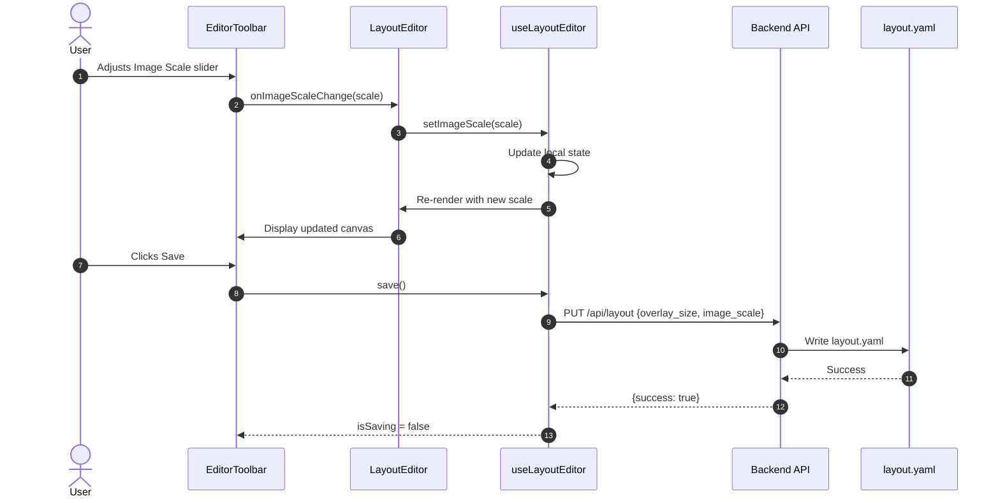

# Layout Editor Size Controls Enhancement

Add independent background image scale and panel overlay size controls with clear labels to the Layout Editor. These settings are persisted to configuration and preserved during backup/restore.

## Motivation

Currently, the Layout Editor has a single "Size:" slider that controls panel overlay size, but:

1. **Unclear labeling** - "Size:" is ambiguous and doesn't indicate it controls panel overlays
2. **No image scaling** - Users cannot scale the background layout image independently of panel overlays
3. **Limited flexibility** - Users with high-resolution layout images or varying panel densities need independent control over both dimensions

This enhancement improves usability by adding clear labels and giving users control over both the background image display scale and the panel overlay size.

## Functional Requirements

### FR-1: Panel Size Slider Label

**FR-1.1:** The existing overlay size slider MUST be labeled "Panel Size" instead of "Size:".

**FR-1.2:** The tooltip MUST read "Panel overlay size in pixels (20-200)".

### FR-2: Image Scale Slider

**FR-2.1:** A new "Image Scale" slider MUST be added to the Layout Editor toolbar.

**FR-2.2:** The slider MUST control the display scale of the background layout image as a percentage (25% to 200%).

**FR-2.3:** The slider MUST have a numeric input field showing the current percentage value.

**FR-2.4:** The default value MUST be 100% (native image size).

**FR-2.5:** The tooltip MUST read "Background image display scale (25%-200%)".

**FR-2.6:** The image scale MUST only affect the editor view. The main dashboard view continues to use fit-to-viewport zoom controls.

### FR-3: Visual Layout

**FR-3.1:** The toolbar controls MUST be arranged in this order (left to right):
1. Undo/Redo buttons
2. Separator
3. Snap toggle
4. Separator
5. Image Scale slider (NEW)
6. Separator
7. Panel Size slider (renamed)
8. Separator
9. Selection info (when applicable)
10. Upload Image button
11. Spacer
12. Discard/Save buttons

**FR-3.2:** Each slider group MUST display: `[Label] [Slider] [Input] [Unit]`
- Image Scale: `Image Scale: [slider] [input] %`
- Panel Size: `Panel Size: [slider] [input] px`

### FR-4: Persistence

**FR-4.1:** The image scale value MUST be stored in `config/layout.yaml` as `image_scale` (integer percentage, e.g., 100 for 100%).

**FR-4.2:** The image scale MUST default to 100 if not present in configuration.

**FR-4.3:** The image scale MUST be saved when the user clicks "Save" in the editor.

### FR-5: Backup and Restore

**FR-5.1:** The `image_scale` field MUST be included in backup ZIP files within `layout.yaml`.

**FR-5.2:** During restore, the `image_scale` value MUST be preserved (following the same pattern as `overlay_size`).

**FR-5.3:** The restore workflow MUST pass `image_scale` to the backend when committing the restore image.

### FR-6: Editor Behavior

**FR-6.1:** Changing the image scale MUST immediately update the canvas display without requiring save.

**FR-6.2:** Image scale changes MUST be included in the undo/redo history.

**FR-6.3:** Panel positions (stored as percentages) MUST remain accurate regardless of image scale.

**FR-6.4:** Alignment guides and snap functionality MUST work correctly at all image scales.

## Non-Functional Requirements

**NFR-1:** The image scale slider MUST respond to input within 50ms (smooth dragging).

**NFR-2:** The layout MUST not cause horizontal scrolling on viewports 900px or wider.

**NFR-3:** Touch targets for all controls MUST be at least 44x44px on mobile viewports.

## High Level Design



### Backend Changes

#### config_models.py

Add `image_scale` field to `LayoutConfig`:

```python
class LayoutConfig(BaseModel):
    """Layout editor configuration stored in config/layout.yaml."""
    image_path: Optional[str] = None
    image_width: Optional[int] = None
    image_height: Optional[int] = None
    image_hash: Optional[str] = None
    aspect_ratio: Optional[float] = None
    overlay_size: int = Field(default=50, ge=20, le=200)
    image_scale: int = Field(default=100, ge=25, le=200)  # NEW
    last_modified: Optional[str] = None
```

#### layout_router.py

Update `LayoutUpdateRequest` to accept `image_scale`:

```python
class LayoutUpdateRequest(BaseModel):
    """Request body for PUT /api/layout."""
    overlay_size: int = Field(..., ge=20, le=200)
    image_scale: int = Field(default=100, ge=25, le=200)  # NEW
```

#### backup_service.py

Update `commit_temp_image` to accept `image_scale`:

```python
def commit_temp_image(
    self,
    token: str,
    overlay_size: int | None = None,
    image_scale: int | None = None  # NEW
) -> dict:
    # ... existing logic ...
    if overlay_size is not None:
        layout_config.overlay_size = overlay_size
    if image_scale is not None:
        layout_config.image_scale = image_scale
```

### Frontend Changes

#### types/config.ts

Add `image_scale` to `LayoutConfig` and related types:

```typescript
export interface LayoutConfig {
  image_path: string | null;
  image_width: number | null;
  image_height: number | null;
  image_hash: string | null;
  aspect_ratio: number | null;
  overlay_size: number;
  image_scale: number;  // NEW: 25-200
  last_modified: string | null;
}

export interface WizardState {
  // ... existing fields ...
  restoreImageScale?: number;  // NEW
}
```

#### EditorToolbar.tsx

Add `imageScale` prop and new slider control:

```typescript
interface EditorToolbarProps {
  // ... existing props ...
  imageScale: number;
  onImageScaleChange: (scale: number) => void;
}

// In render:
{/* Image Scale slider */}
<div style={sliderContainerStyle} title="Background image display scale (25%-200%)">
  <span style={labelStyle}>Image Scale:</span>
  <input
    type="range"
    min={25}
    max={200}
    step={5}
    value={imageScale}
    onChange={(e) => onImageScaleChange(parseInt(e.target.value, 10))}
    style={sliderStyle}
  />
  <input
    type="text"
    value={imageScale}
    onChange={/* validation logic */}
    style={sizeInputStyle}
  />
  <span style={{ color: '#888', fontSize: '11px' }}>%</span>
</div>

{/* Panel Size slider (renamed from "Size:") */}
<div style={sliderContainerStyle} title="Panel overlay size in pixels (20-200)">
  <span style={labelStyle}>Panel Size:</span>
  {/* ... existing slider code ... */}
</div>
```

#### LayoutEditor.tsx

Apply image scale to canvas dimensions:

```typescript
// Calculate scaled dimensions
const scaledWidth = (imageWidth * editor.imageScale) / 100;
const scaledHeight = (imageHeight * editor.imageScale) / 100;

// Use in canvas style
const canvasStyle = (width: number, height: number): CSSProperties => ({
  position: 'relative',
  width: `${width}px`,
  height: `${height}px`,
  margin: 'auto',
});

// Render with scaled dimensions
<div style={canvasStyle(scaledWidth, scaledHeight)}>
```

#### useLayoutEditor.ts

Add state and handlers for `imageScale`:

```typescript
const [imageScale, setImageScale] = useState<number>(100);

// Load from config
useEffect(() => {
  if (layoutConfig?.image_scale) {
    setImageScale(layoutConfig.image_scale);
  }
}, [layoutConfig]);

// Save handler includes imageScale
const save = async () => {
  // ... existing logic ...
  await updateLayoutConfig({
    overlay_size: overlaySize,
    image_scale: imageScale
  });
};

return {
  // ... existing returns ...
  imageScale,
  setImageScale,
};
```

## Task Breakdown

1. **Backend: Add image_scale to LayoutConfig model**
   - Add `image_scale` field to `LayoutConfig` in `config_models.py`
   - Add `image_scale` field to `LayoutConfigResponse`
   - Update `LayoutUpdateRequest` to include optional `image_scale`

2. **Backend: Update layout router**
   - Modify `PUT /api/layout` to save `image_scale`

3. **Backend: Update backup/restore service**
   - Add `image_scale` parameter to `commit_temp_image`
   - Update `CommitImageRequest` model in `backup_router.py`

4. **Frontend: Update TypeScript types**
   - Add `image_scale` to `LayoutConfig` interface
   - Add `restoreImageScale` to `WizardState` interface

5. **Frontend: Update EditorToolbar**
   - Rename "Size:" label to "Panel Size:"
   - Add new "Image Scale:" slider control
   - Reorder controls per FR-3.1

6. **Frontend: Update useLayoutEditor hook**
   - Add `imageScale` state
   - Load initial value from config
   - Include in save operation
   - Add to undo/redo history

7. **Frontend: Update LayoutEditor canvas**
   - Apply image scale to canvas dimensions
   - Ensure panel positions remain accurate (percentages)
   - Verify alignment guides work at different scales

8. **Frontend: Update restore workflow**
   - Store `image_scale` from backup in wizard state
   - Pass `image_scale` when committing restore image

9. **Testing**
   - Verify slider interactions work smoothly
   - Verify save/load preserves both settings
   - Verify backup/restore preserves both settings
   - Verify panel positioning accuracy at different scales
   - Verify undo/redo includes scale changes

## Related Specifications

| Spec | Relationship | Notes |
|------|--------------|-------|
| None | - | This is a standalone enhancement to the existing Layout Editor |

## Context / Documentation

- `dashboard/frontend/src/components/layout-editor/EditorToolbar.tsx` - Current toolbar implementation
- `dashboard/frontend/src/components/layout-editor/LayoutEditor.tsx` - Main editor component
- `dashboard/frontend/src/components/layout-editor/useLayoutEditor.ts` - Editor state management
- `dashboard/backend/app/config_models.py` - Backend configuration models
- `dashboard/backend/app/layout_router.py` - Layout API endpoints
- `dashboard/backend/app/backup_service.py` - Backup/restore logic
- `config/layout.yaml` - Layout configuration file

---

**Specification Version:** 1.0
**Last Updated:** January 2026
**Authors:** Claude Opus 4.5

## Changelog

### v1.0 (January 2026)
**Summary:** Initial specification

**Changes:**
- Initial specification for Layout Editor size controls enhancement
- Defines image scale slider (25%-200%)
- Defines panel size slider label improvement
- Specifies backup/restore integration
