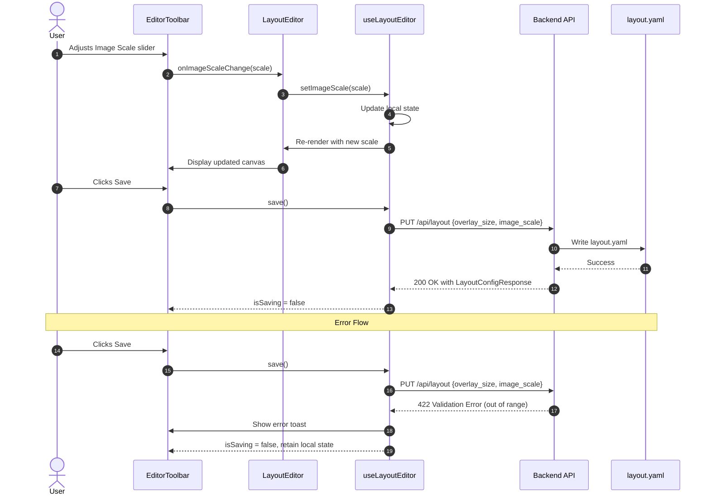

# Layout Editor Size Controls Enhancement

Add independent background image scale and panel overlay size controls with clear labels to the Layout Editor. These settings are persisted to configuration and preserved during backup/restore.

## Motivation

Currently, the Layout Editor has a single "Size:" slider that controls panel overlay size, but:

1. **Unclear labeling** - "Size:" is ambiguous and doesn't indicate it controls panel overlays
2. **No image scaling** - Users cannot scale the background layout image independently of panel overlays
3. **Limited flexibility** - Users with high-resolution layout images or varying panel densities need independent control over both dimensions

This enhancement improves usability by adding clear labels and giving users control over both the background image display scale and the panel overlay size.

## Functional Requirements

### FR-1: Panel Size Slider Label

**FR-1.1:** The existing overlay size slider MUST be labeled "Panel Size" instead of "Size:".

**FR-1.2:** The tooltip MUST read "Panel overlay size in pixels (20-200)".

### FR-2: Image Scale Slider

**FR-2.1:** A new "Image Scale" slider MUST be added to the Layout Editor toolbar.

**FR-2.2:** The slider MUST control the display scale of the background layout image as a percentage (25% to 200%). The slider MUST increment in steps of 5%.

**FR-2.3:** The slider MUST have a numeric input field showing the current percentage value.

**FR-2.4:** The default value MUST be 100% (native image size).

**FR-2.5:** The tooltip MUST read "Background image display scale (25%-200%) - editor only".

**FR-2.6:** The image scale MUST only affect the editor view. The main dashboard view continues to use fit-to-viewport zoom controls.

**FR-2.7:** Numeric input validation MUST behave as follows:
- On blur: clamp value to valid range (25-200)
- If input is empty or non-numeric: reset to 100 (default)
- Values outside range are clamped, not rejected
- Non-multiple-of-5 values from numeric input are accepted and stored as-is

**FR-2.8:** The slider MUST support keyboard control:
- Left/Down Arrow: decrease by 5%
- Right/Up Arrow: increase by 5%
- Home: jump to 25%
- End: jump to 200%
- Focus MUST be visible (2px outline minimum)

### FR-3: Visual Layout

**FR-3.1:** The toolbar controls MUST be arranged in this order (left to right):
1. Undo/Redo buttons
2. Separator
3. Snap toggle
4. Separator
5. Image Scale slider (NEW)
6. Separator
7. Panel Size slider (renamed)
8. Separator
9. Selection info (when applicable)
10. Upload Image button
11. Spacer
12. Discard/Save buttons

**Separator definition:**
- Visual: 1px vertical line, color #ddd, height 24px
- Spacing: 8px margin on each side (total 17px width)
- Accessibility: `role="separator"` `aria-orientation="vertical"`

**Selection info behavior:**
- Single panel selected: displays "Panel: {id} ({x}%, {y}%)"
- Multiple panels selected: displays "{count} panels selected"
- No selection: element not rendered (not just hidden)

**FR-3.2:** Each slider group MUST display: `[Label] [Slider] [Input] [Unit]`
- Image Scale: `Image Scale: [slider] [input] %`
- Panel Size: `Panel Size: [slider] [input] px`

### FR-4: Persistence

**FR-4.1:** The image scale value MUST be stored in `config/layout.yaml` as `image_scale` (integer percentage, e.g., 100 for 100%).

**FR-4.2:** The image scale MUST default to 100 if not present in configuration. Both the backend (`LayoutConfig.image_scale = Field(default=100)`) and frontend (`layoutConfig?.image_scale ?? 100`) MUST use the same default value for consistency with legacy data.

**FR-4.3:** The image scale MUST be saved when the user clicks "Save" in the editor.

### FR-5: Backup and Restore

**FR-5.1:** The `image_scale` field MUST be included in backup ZIP files within `layout.yaml`.

**Implementation note:** `LayoutConfig` is serialized via Pydantic's `model_dump()` which automatically includes `image_scale` since it's a defined field. No code change needed in `backup_service.py create_backup()` - Pydantic handles new fields automatically.

**FR-5.2:** During restore, the `image_scale` value MUST be preserved (following the same pattern as `overlay_size`).

**FR-5.3:** The restore workflow MUST pass `image_scale` to the backend when committing the restore image.

**FR-5.4:** Legacy backup parsing MUST handle edge cases gracefully:
- If `image_scale` is missing/null: default to 100
- If `image_scale` is invalid type: log warning, use 100
- If `image_scale` is out of range (e.g., 500 from manual edit): clamp to 25-200 with warning

```python
# In LayoutConfig model:
@field_validator('image_scale', mode='before')
@classmethod
def clamp_image_scale(cls, v):
    if v is None:
        return 100
    try:
        v = int(v)
        return max(25, min(200, v))
    except (TypeError, ValueError):
        return 100
```

### FR-6: Editor Behavior

**FR-6.1:** Changing the image scale MUST immediately update the canvas display without requiring save.

**FR-6.2:** Image scale changes MUST be included in the undo/redo history. The existing history mechanism MUST be extended to track both positions and image scale:

```typescript
// PanelPosition type definition (also see Panel Selection spec)
interface PanelPosition {
  x: number;  // 0-100 percentage of image width
  y: number;  // 0-100 percentage of image height
}
// null indicates panel should use default/unset position

interface EditorHistoryState {
  positions: Record<string, PanelPosition | null>;
  imageScale: number;
}

// Update EditHistory type to use EditorHistoryState
interface EditHistory {
  states: EditorHistoryState[];
  currentIndex: number;
}

// Derived state for button enablement
const canUndo = history.currentIndex > 0;
const canRedo = history.currentIndex < history.states.length - 1;
```

**Implementation changes to useLayoutEditor.ts:**

```typescript
// Update recordHistoryState to capture both positions and imageScale
// Call this on: panel drag END, slider RELEASE (onMouseUp/onTouchEnd), numeric input BLUR
const recordHistoryState = useCallback((
  newPositions: Record<string, PanelPosition | null>,
  newImageScale: number
) => {
  setHistory(prev => {
    const truncated = prev.states.slice(0, prev.currentIndex + 1);
    const newState: EditorHistoryState = {
      positions: { ...newPositions },
      imageScale: newImageScale
    };
    const newStates = [...truncated, newState].slice(-50); // Keep last 50 states
    return {
      states: newStates,
      currentIndex: newStates.length - 1  // Always point to newest
    };
  });
}, []);

// Update undo to restore both positions and imageScale
// Note: Uses functional update with prev, so no external dependencies needed
const undo = useCallback(() => {
  setHistory(prev => {
    if (prev.currentIndex <= 0) return prev;
    const newIndex = prev.currentIndex - 1;
    const state = prev.states[newIndex];
    // Schedule state updates outside the setter to avoid React warnings
    queueMicrotask(() => {
      setPositions(state.positions);
      setImageScale(state.imageScale);
    });
    return { ...prev, currentIndex: newIndex };
  });
}, []);

// Update redo to restore both positions and imageScale
const redo = useCallback(() => {
  setHistory(prev => {
    if (prev.currentIndex >= prev.states.length - 1) return prev;
    const newIndex = prev.currentIndex + 1;
    const state = prev.states[newIndex];
    queueMicrotask(() => {
      setPositions(state.positions);
      setImageScale(state.imageScale);
    });
    return { ...prev, currentIndex: newIndex };
  });
}, []);

// Update enterEditMode to initialize history with EditorHistoryState shape
const enterEditMode = useCallback(() => {
  setIsEditMode(true);
  const initialState: EditorHistoryState = {
    positions: { ...positions },
    imageScale: imageScale
  };
  setHistory({ states: [initialState], currentIndex: 0 });
}, [positions, imageScale]);
```

**History recording triggers:**
```typescript
// For slider - record on release, not during drag
<input
  type="range"
  onMouseUp={() => recordHistoryState(positions, imageScale)}
  onTouchEnd={() => recordHistoryState(positions, imageScale)}
  onChange={(e) => setImageScale(parseInt(e.target.value, 10))}
/>
```

**Memory considerations:**
- Each history state stores shallow position references (not deep copies unless modified)
- Estimated 200 panels x 50 states = 10,000 position entries max
- History is cleared on exitEditMode and page navigation
- History is NOT persisted to draft storage (by design - drafts restore last save, not undo history)

On undo/redo, both `positions` and `imageScale` are restored to their previous values.

**FR-6.3:** Panel positions (stored as percentages) MUST remain accurate regardless of image scale.

**Position calculation formula:**
```
pixelX = (position.x / 100) * scaledWidth
pixelY = (position.y / 100) * scaledHeight

where scaledWidth = imageWidth * (imageScale / 100)
      scaledHeight = imageHeight * (imageScale / 100)
```

- The panel's top-left corner aligns with (pixelX, pixelY)
- Panel overlay size is independent of image scale (controlled by Panel Size slider)

**FR-6.4:** Alignment guides and snap functionality MUST work correctly at all image scales:
- Snap detection threshold: 10 pixels (fixed, does not scale with image scale)
- Guide lines render at exact pixel positions matching snapped percentage
- Snap calculations occur in pixel space, then convert to percentage for storage

**FR-6.5:** Clicking "Discard" MUST:
- Reset imageScale to the value in persisted config (layout.yaml)
- Reset panel positions to persisted values
- Clear undo/redo history
- Exit edit mode

## Non-Functional Requirements

**NFR-1:** The image scale slider MUST respond to input within 50ms (smooth dragging).
- Reference hardware: 4-core CPU, 8GB RAM
- Measurement: Chrome DevTools Performance panel, from input event to next frame paint
- Panel count: up to 100 panels on canvas
- If exceeds 50ms with >100 panels, document as known limitation
- Verified via manual testing or performance profiling, not automated tests

**NFR-2:** The layout MUST not cause horizontal scrolling on viewports 900px or wider. Note: 900px is the minimum width for no horizontal scroll on the toolbar layout; 768px remains the mobile/desktop UX breakpoint for responsive text.

**NFR-3:** Touch targets for all controls MUST be at least 44x44px on viewports < 768px width:
- Slider thumb: 44x44px minimum hit area (visual can be smaller with padding)
- Numeric input: 44px height minimum
- All buttons: 44x44px minimum
- Reference: WCAG 2.5.5 Target Size (Level AAA), Apple Human Interface Guidelines

**NFR-4:** Accessibility requirements for slider controls:
- Sliders MUST have proper ARIA attributes: `aria-label`, `aria-valuemin`, `aria-valuemax`, `aria-valuenow`
- Labels MUST be associated with inputs via `htmlFor`/`id` or `aria-labelledby`
- Focus indicators MUST be visible (2px outline minimum)
- Reference: WCAG 2.1 Level A - 1.3.1 Info and Relationships

## High Level Design



### Error Handling

If `PUT /api/layout` fails:
- 422 Validation Error (e.g., `image_scale` out of range): Frontend shows error toast with validation message, retains local state for user to correct
- 500 Server Error: Frontend shows generic error toast, retains local state for retry
- Network Error (fetch throws, no response): Frontend shows connection error toast, retains local state for retry

**422 Response format (FastAPI default):**
```json
{
  "detail": [
    {"loc": ["body", "image_scale"], "msg": "ensure this value is less than or equal to 200", "type": "value_error.number.not_le"}
  ]
}
```

Frontend parses array format: `Array.isArray(error.detail) ? error.detail.map(e => e.msg).join(', ') : error.detail`

In all error cases, the local `imageScale` state is preserved so the user doesn't lose their changes.

### API Contract

**PUT /api/layout**

Request:
```json
{
  "overlay_size": 50,      // optional, integer 20-200, default 50
  "image_scale": 100       // optional, integer 25-200, default 100
}
```

Response 200 OK:
```json
{
  "image_path": "/assets/layout.png",
  "image_width": 1920,
  "image_height": 1080,
  "image_hash": "abc123",
  "aspect_ratio": 1.78,
  "overlay_size": 50,
  "image_scale": 100,
  "last_modified": "2026-01-26T12:00:00Z"
}
```

Response 422 Validation Error:
```json
{ "detail": [...] }
```

### Backend Changes

#### config_models.py

Add `image_scale` field to `LayoutConfig` and `LayoutConfigResponse`:

```python
class LayoutConfig(BaseModel):
    """Layout editor configuration stored in config/layout.yaml."""
    image_path: Optional[str] = None
    image_width: Optional[int] = None
    image_height: Optional[int] = None
    image_hash: Optional[str] = None
    aspect_ratio: Optional[float] = None
    overlay_size: int = Field(default=50, ge=20, le=200)
    image_scale: int = Field(default=100, ge=25, le=200)  # NEW
    last_modified: Optional[str] = None

class LayoutConfigResponse(BaseModel):
    """Response model for GET /api/layout.

    Note: Response model does not validate since data comes from
    already-validated LayoutConfig internal model. Plain defaults
    are sufficient for serialization.
    """
    image_path: Optional[str] = None
    image_width: Optional[int] = None
    image_height: Optional[int] = None
    image_hash: Optional[str] = None
    aspect_ratio: Optional[float] = None
    overlay_size: int = 50
    image_scale: int = 100  # NEW
    last_modified: Optional[str] = None
```

#### layout_router.py

Update `LayoutUpdateRequest` to accept `image_scale`:

```python
class LayoutUpdateRequest(BaseModel):
    """Request body for PUT /api/layout.

    Both fields are optional with defaults, enabling partial updates.
    """
    overlay_size: int = Field(default=50, ge=20, le=200)
    image_scale: int = Field(default=100, ge=25, le=200)  # NEW
```

#### backup_service.py

Update `commit_temp_image` to accept and preserve `image_scale`:

```python
def commit_temp_image(
    self,
    token: str,
    overlay_size: int | None = None,  # None = preserve existing value
    image_scale: int | None = None     # None = preserve existing value; cannot reset to default via API
) -> dict:
    """Commit a temporary restore image to permanent storage.

    Args:
        token: Temporary file token from restore upload
        overlay_size: Panel overlay size (None = preserve existing)
        image_scale: Image scale percentage (None = preserve existing)

    Note: Passing None preserves existing values. To explicitly set
    the default (100), pass image_scale=100.
    """
    # ... existing validation and temp file logic ...

    # Preserve user's overlay_size and image_scale preferences
    if overlay_size is not None:
        layout_config.overlay_size = overlay_size
    if image_scale is not None:
        layout_config.image_scale = image_scale

    # ... existing file commit and cleanup logic ...
```

#### backup_router.py

Update `CommitImageRequest` to accept `image_scale`:

```python
class CommitImageRequest(BaseModel):
    """Request body for POST /api/backup/restore/image/{token}."""
    overlay_size: Optional[int] = Field(default=None, ge=20, le=200)
    image_scale: Optional[int] = Field(default=None, ge=25, le=200)  # NEW
```

### Frontend Changes

#### types/config.ts

Add `image_scale` to `LayoutConfig` and related types:

```typescript
export interface LayoutConfig {
  image_path: string | null;
  image_width: number | null;
  image_height: number | null;
  image_hash: string | null;
  aspect_ratio: number | null;
  overlay_size: number;
  image_scale: number;  // NEW: 25-200
  last_modified: string | null;
}

export interface WizardState {
  // ... existing fields ...
  restoreImageScale?: number;  // NEW
}

// WizardState population during restore:
// In backup parsing (e.g., useRestoreWizard.ts):
const parseBackupManifest = (layoutYaml: LayoutConfig) => {
  setWizardState(prev => ({
    ...prev,
    restoreImageScale: layoutYaml.image_scale ?? 100  // Default for legacy backups
  }));
};

// In commit step:
await commitRestoreImage(token, {
  overlay_size: wizardState.restoreOverlaySize,
  image_scale: wizardState.restoreImageScale ?? 100
});
```

#### EditorToolbar.tsx

Add `imageScale` prop and new slider control:

```typescript
interface EditorToolbarProps {
  // ... existing props ...
  imageScale: number;
  onImageScaleChange: (scale: number) => void;
  onImageScaleCommit: () => void;  // Called on release to record history
}

// In render:
{/* Image Scale slider */}
<div style={sliderContainerStyle} title="Background image display scale (25%-200%)">
  <label htmlFor="image-scale-slider" style={labelStyle}>Image Scale:</label>
  <input
    type="range"
    id="image-scale-slider"
    aria-label="Image scale percentage"
    aria-valuemin={25}
    aria-valuemax={200}
    aria-valuenow={imageScale}
    min={25}
    max={200}
    step={5}
    value={imageScale}
    onChange={(e) => onImageScaleChange(parseInt(e.target.value, 10))}
    onMouseUp={onImageScaleCommit}
    onTouchEnd={onImageScaleCommit}
    style={sliderStyle}
  />
  <input
    type="number"
    inputMode="numeric"
    min={25}
    max={200}
    step={5}
    value={imageScale}
    onChange={(e) => {
      const value = parseInt(e.target.value, 10);
      if (!isNaN(value)) onImageScaleChange(value);
    }}
    onBlur={(e) => {
      // Validate on blur: clamp to valid range or reset to default
      const value = parseInt(e.target.value, 10);
      if (isNaN(value)) {
        onImageScaleChange(100);  // Reset to default
      } else {
        onImageScaleChange(Math.min(200, Math.max(25, value)));
      }
      onImageScaleCommit();  // Record history on blur
    }}
    style={sizeInputStyle}
  />
  <span style={{ color: '#888', fontSize: '11px' }}>%</span>
</div>

{/* Panel Size slider (renamed from "Size:") */}
<div style={sliderContainerStyle} title="Panel overlay size in pixels (20-200)">
  <label htmlFor="panel-size-slider" style={labelStyle}>Panel Size:</label>
  {/* ... existing slider code with similar accessibility attributes ... */}
</div>
```

#### LayoutEditor.tsx

Apply image scale to canvas dimensions:

```typescript
// Calculate scaled dimensions
const scaledWidth = (imageWidth * editor.imageScale) / 100;
const scaledHeight = (imageHeight * editor.imageScale) / 100;

// Use in canvas style
const canvasStyle = (width: number, height: number): CSSProperties => ({
  position: 'relative',
  width: `${width}px`,
  height: `${height}px`,
  margin: 'auto',
});

// Render with scaled dimensions
<div style={canvasStyle(scaledWidth, scaledHeight)}>
```

**Canvas container behavior:**
- Canvas is centered via `margin: auto` within a scrollable container
- When scaled canvas exceeds container, horizontal/vertical scroll appears
- Canvas pan/zoom (TransformComponent) wraps the scaled canvas
- At 200% scale on 1920px viewport with 2000px image = 4000px canvas, scroll is expected
- NFR-2's "no horizontal scroll" applies to the toolbar, not the canvas at large scales

```typescript
```

#### api/config.ts

**BREAKING CHANGE:** Update `updateLayoutConfig` function signature:

```typescript
// OLD: export async function updateLayoutConfig(overlaySize: number): Promise<void>
// NEW:
export interface LayoutUpdatePayload {
  overlay_size: number;
  image_scale: number;
}

export async function updateLayoutConfig(config: LayoutUpdatePayload): Promise<void> {
  let response: Response;
  try {
    response = await fetch('/api/layout', {
      method: 'PUT',
      headers: { 'Content-Type': 'application/json' },
      body: JSON.stringify(config),
    });
  } catch (error) {
    // Network error (no response received)
    throw new Error('Connection error. Please check your network.');
  }

  if (!response.ok) {
    let message = 'Failed to update layout config';
    try {
      const error = await response.json();
      // Handle FastAPI array format
      const detail = Array.isArray(error.detail)
        ? error.detail.map((e: { msg: string }) => e.msg).join(', ')
        : error.detail;
      message = detail || message;
    } catch {
      // Non-JSON response (e.g., 502 gateway error)
    }
    throw new Error(message);
  }
}
```

**Migration:** All existing callers of `updateLayoutConfig(overlaySize)` must be updated to pass the full config object.

#### useLayoutEditor.ts

Add state and handlers for `imageScale`:

```typescript
// Initialize as undefined to detect loading state
const [imageScale, setImageScale] = useState<number | undefined>(undefined);

// Effective scale for rendering (use default until config loads)
const effectiveImageScale = imageScale ?? layoutConfig?.image_scale ?? 100;

// Load from config - use nullish coalescing for legacy data compatibility
useEffect(() => {
  if (layoutConfig) {
    setImageScale(layoutConfig.image_scale ?? 100);
  }
}, [layoutConfig]);

// Save handler includes imageScale (partial snippet - existing save logic unchanged)
const save = async () => {
  try {
    // Both operations should succeed
    await updatePanelPositions(positions);
    await updateLayoutConfig({
      overlay_size: overlaySize,
      image_scale: effectiveImageScale
    });
    // Success path: exitEditMode, clearDraft, etc.
  } catch (error) {
    // If updateLayoutConfig fails after updatePanelPositions succeeded:
    // - Positions are saved (acceptable - user's drag work preserved)
    // - Config not saved (show error, user can retry)
    // Show specific error message based on which call failed
    throw error;
  }
};

return {
  // ... existing returns ...
  imageScale: effectiveImageScale,
  setImageScale,
};
```

**Note:** The save function retains all existing logic (updatePanelPositions, exitEditMode, clearDraft, initialPositionsRef update). Only the `updateLayoutConfig` call changes to pass the new object format.

**Initial state handling:**
- `imageScale` starts as `undefined` to distinguish "not yet loaded" from "loaded as 100"
- `effectiveImageScale` provides a usable value for rendering
- Slider can be disabled until config loads if desired (check `imageScale === undefined`)

## Task Breakdown

1. **Backend: Add image_scale to LayoutConfig model**
   - Add `image_scale` field to `LayoutConfig` in `config_models.py`
   - Add `image_scale` field to `LayoutConfigResponse`
   - Update `LayoutUpdateRequest` to include optional `image_scale`

2. **Backend: Update layout router**
   - Modify `PUT /api/layout` to save `image_scale`

3. **Backend: Update backup/restore service**
   - Add `image_scale` parameter to `commit_temp_image`
   - Update `CommitImageRequest` model in `backup_router.py`

4. **Frontend: Update TypeScript types**
   - Add `image_scale` to `LayoutConfig` interface
   - Add `restoreImageScale` to `WizardState` interface

5. **Frontend: Update EditorToolbar**
   - Rename "Size:" label to "Panel Size:"
   - Add new "Image Scale:" slider control
   - Reorder controls per FR-3.1

6. **Frontend: Update useLayoutEditor hook**
   - Add `imageScale` state
   - Load initial value from config
   - Include in save operation
   - Add to undo/redo history

7. **Frontend: Update LayoutEditor canvas**
   - Apply image scale to canvas dimensions
   - Ensure panel positions remain accurate (percentages)
   - Verify alignment guides work at different scales

8. **Frontend: Update restore workflow**
   - Store `image_scale` from backup in wizard state
   - Pass `image_scale` when committing restore image

9. **Testing**
   - Verify slider interactions work smoothly
   - Verify save/load preserves both settings
   - Verify backup/restore preserves both settings
   - Verify panel positioning accuracy at different scales
   - Verify undo/redo includes scale changes

## Test Scenarios

### Functional Tests

1. **Slider basic interaction**: Move Image Scale slider → verify canvas updates immediately
2. **Numeric input**: Type value in input field → verify slider updates, canvas updates
3. **Save/load cycle**: Change scale to 150%, save, refresh page → verify 150% is restored
4. **Default value**: Remove `image_scale` from layout.yaml manually, reload → verify defaults to 100%

### Boundary Tests

5. **Minimum scale (25%)**: Set to 25% → verify canvas shrinks correctly, panels remain positioned
6. **Maximum scale (200%)**: Set to 200% → verify canvas enlarges, no layout overflow on wide viewport
7. **Invalid input**: Type 300 in input → verify clamped to 200 (per FR-2.7, values outside range are clamped)

### Backup/Restore Tests

8. **Backup includes scale**: Export backup with scale=75% → extract ZIP → verify layout.yaml contains `image_scale: 75`
9. **Restore preserves scale**: Import backup with scale=150% → complete wizard → verify editor shows 150%
10. **Legacy backup (no image_scale)**: Import backup created before this feature → verify defaults to 100%

### Undo/Redo Tests

11. **Undo scale change**: Change 100% → 150%, Ctrl+Z → verify returns to 100%
12. **Redo scale change**: After undo, Ctrl+Shift+Z → verify returns to 150%
13. **Mixed undo (sequential operations)**:
    - Initial state: scale=100%, panel at (50%, 50%)
    - Change scale to 150% (release slider to record history)
    - Move panel to (60%, 60%) (release drag to record history)
    - First Ctrl+Z → scale=150%, panel at (50%, 50%)
    - Second Ctrl+Z → scale=100%, panel at (50%, 50%)

### Panel Position Tests

14. **Position accuracy at scale**: At 25% and 200%, verify panel positions match percentage coordinates
15. **Drag at scale**: At 50% scale, drag panel → verify drop position is correct
16. **Alignment guides at scale**: At various scales, verify snap guides appear correctly

## Related Specifications

| Spec | Relationship | Notes |
|------|--------------|-------|
| 2026-01-24-backup-restore.md | extends | Adds `image_scale` field to backup/restore workflow; updates `CommitImageRequest` model |
| 2026-01-24-panel-selection-movement.md | related | Uses same undo/redo pattern; extends history state to include `imageScale` |

## Context / Documentation

- `dashboard/frontend/src/components/layout-editor/EditorToolbar.tsx` - Current toolbar implementation
- `dashboard/frontend/src/components/layout-editor/LayoutEditor.tsx` - Main editor component
- `dashboard/frontend/src/components/layout-editor/useLayoutEditor.ts` - Editor state management
- `dashboard/backend/app/config_models.py` - Backend configuration models
- `dashboard/backend/app/layout_router.py` - Layout API endpoints
- `dashboard/backend/app/backup_service.py` - Backup/restore logic
- `config/layout.yaml` - Layout configuration file

---

**Specification Version:** 1.4
**Last Updated:** January 2026
**Authors:** Claude Opus 4.5

## Changelog

### v1.4 (January 2026)
**Summary:** Review iteration 4 - comprehensive fixes for 36 review comments

**Changes:**
- FR-2.2: Added step value requirement (5%)
- FR-2.7: Added numeric input validation requirements (clamp on blur, handle empty/non-numeric)
- FR-2.8: Added keyboard control requirements (arrow keys, Home/End)
- FR-3.1: Added separator definition (visual, spacing, accessibility)
- FR-3.1: Added selection info behavior documentation
- FR-5.1: Added implementation note about Pydantic serialization
- FR-5.4: Added legacy backup edge case handling with field validator
- FR-6.2: Refactored undo/redo implementation (queueMicrotask pattern, removed incorrect dependencies)
- FR-6.2: Added PanelPosition type definition
- FR-6.2: Added canUndo/canRedo derived state definitions
- FR-6.2: Added history recording triggers documentation
- FR-6.2: Added memory considerations
- FR-6.2: Simplified currentIndex calculation
- FR-6.3: Added position calculation formula
- FR-6.4: Added specific alignment guide criteria (threshold, pixel vs percentage)
- FR-6.5: Added discard behavior specification
- NFR-1: Added measurement conditions (hardware, DevTools, panel count)
- NFR-3: Clarified mobile viewport threshold (768px) and specific component sizes
- NFR-4: Added accessibility requirements (ARIA, labels, focus)
- High Level Design: Fixed sequence diagram response format
- High Level Design: Added API Contract section with full request/response schemas
- High Level Design: Added 422 response format documentation
- Backend Changes: Made LayoutUpdateRequest fields consistently optional with defaults
- Backend Changes: Added LayoutConfigResponse docstring about validation
- Backend Changes: Added commit_temp_image docstring and parameter documentation
- Frontend Changes: Updated EditorToolbar with accessibility attributes and validation logic
- Frontend Changes: Added canvas container behavior documentation
- Frontend Changes: Added comprehensive error handling (network errors, non-JSON responses)
- Frontend Changes: Added WizardState data flow documentation
- Frontend Changes: Updated useLayoutEditor with undefined initial state pattern and save atomicity handling
- Test Scenarios: Clarified test #7 expected behavior (clamp, not reject)
- Test Scenarios: Made test #13 explicit with step-by-step states

### v1.3 (January 2026)
**Summary:** Review iteration 3 - fixed useCallback dependency arrays

**Changes:**
- FR-6.2: Fixed undo/redo useCallback dependency arrays to include [canUndo] and [canRedo] respectively, matching existing codebase pattern

### v1.2 (January 2026)
**Summary:** Review iteration 2 - completed undo/redo implementation details

**Changes:**
- FR-6.2: Added complete implementation for recordHistoryState, undo, redo, and enterEditMode with EditorHistoryState
- FR-6.2: Added EditHistory type update to use EditorHistoryState[]
- Backend Changes: Added LayoutConfigResponse update with image_scale field
- useLayoutEditor.ts: Clarified save function shows partial snippet with note about unchanged existing logic
- backup_service.py: Added explicit image_scale preservation line in code snippet

### v1.1 (January 2026)
**Summary:** Review fixes - addressed 9 issues across API contracts, testing, undo/redo integration

**Changes:**
- FR-2.5: Updated tooltip to include "(editor only)" clarification
- FR-4.2: Added frontend default handling note for legacy data compatibility
- FR-6.2: Added `EditorHistoryState` interface defining unified history with positions and imageScale
- NFR-1: Added note that 50ms response is verified via manual testing
- NFR-2: Clarified 900px vs 768px breakpoint distinction
- High Level Design: Added error flow sequence and Error Handling section
- Backend Changes: Added `CommitImageRequest` update in backup_router.py
- Frontend Changes: Added `api/config.ts` section with BREAKING CHANGE for updateLayoutConfig signature
- Frontend Changes: Updated useLayoutEditor to use nullish coalescing for default handling
- Added comprehensive Test Scenarios section (16 tests covering functional, boundary, backup/restore, undo/redo)
- Related Specifications: Updated to reference backup-restore and panel-selection-movement specs

### v1.0 (January 2026)
**Summary:** Initial specification

**Changes:**
- Initial specification for Layout Editor size controls enhancement
- Defines image scale slider (25%-200%)
- Defines panel size slider label improvement
- Specifies backup/restore integration
