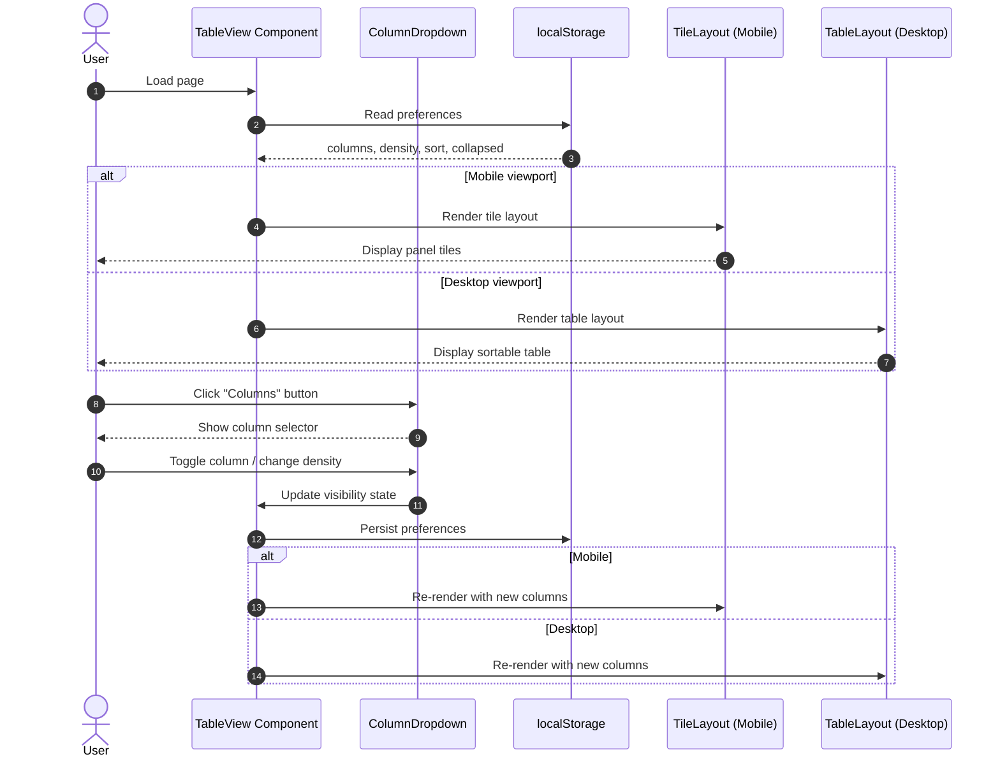

# Table View UX Overhaul

Complete UX overhaul of the TableView component to improve usability on both desktop and mobile. This includes replacing the row of column toggle buttons with a dropdown selector, adding sortable columns on desktop, implementing a configurable tile-based layout for mobile, and improving visual hierarchy with power metric emphasis and mismatch indication.

## Motivation

The current TableView has several UX issues:

1. **Cluttered controls**: 15 column toggle buttons displayed horizontally with cryptic labels (ID, Tigo, Node, SN, CCA, Vin, Vout, Ain, Aout, W, °C, %, dB, kWh, ⚠)
2. **Poor mobile experience**: Column toggles wrap into 3 rows consuming ~150px of vertical space; table requires horizontal scrolling
3. **No sorting**: Users cannot sort data to find outliers or compare panels
4. **Cryptic labels**: Short labels like "Vin" and "Ain" require tooltip hover to understand
5. **Wasted space**: Expand All / Collapse All buttons take significant horizontal space

## Functional Requirements

### FR-1: Dropdown Column Selector

**FR-1.1**: Replace the row of column toggle buttons with a single "Columns" button that opens a dropdown/popover.

**FR-1.2**: The dropdown MUST display human-readable labels organized into categories:
- **Identity**: Panel ID, Tigo ID, Node ID, Serial Number, CCA Source
- **Electrical**: Input Voltage, Output Voltage, Input Current, Output Current, Power (Watts)
- **Status**: Temperature, Duty Cycle, Signal (RSSI), Energy (kWh), Temp ID Warning

**FR-1.3**: Each column MUST be represented by a checkbox that toggles visibility.

**FR-1.4**: The dropdown MUST include preset buttons:
- "Essential" - Panel ID, Power, Input Voltage, Input Current, CCA Source, Temp ID Warning (matches existing DEFAULT_COLUMNS)
- "All" - Enable all columns

**Note:** The Essential preset intentionally matches the existing DEFAULT_COLUMNS from the original tabular-view implementation to maintain backward compatibility with existing user localStorage preferences.

**FR-1.5**: The dropdown MUST include a View Density toggle with two options:
- "Compact" - Reduced padding, smaller text (default)
- "Standard" - More padding, larger text

**Rationale for Compact default:** The existing TableView implementation uses compact styling to maximize data density, which is appropriate for monitoring dashboards where users need to see many panels at once. This preserves backward compatibility with the existing visual appearance.

**FR-1.6**: Column visibility and density preference MUST persist to localStorage.

**FR-1.7**: The dropdown MUST be fully keyboard accessible:
- Enter or Space on the "Columns" button MUST open the dropdown
- Escape MUST close the dropdown immediately and return focus to the trigger button (discarding any active type-ahead buffer)
- Tab MUST navigate forward through checkboxes and preset buttons in document order
- Shift+Tab MUST navigate backward through interactive elements
- Space MUST toggle the currently focused checkbox
- Arrow keys (`↑`/`↓`) MUST move focus between checkboxes within the current category
- Arrow keys (`←`/`→`) MAY move focus between category sections (optional enhancement; not included in Phase 5 test plan)
- Home MUST move focus to the first interactive element in the dropdown
- End MUST move focus to the last interactive element in the dropdown
- When dropdown opens, focus MUST move to the first interactive element
- Focus MUST be trapped within the dropdown while open (Tab on last element wraps to first)
- The trigger button MUST have `aria-expanded`, `aria-haspopup="dialog"`, and `aria-controls` (referencing the dropdown's ID) attributes

**Note:** `aria-haspopup="dialog"` is used instead of `"menu"` because the dropdown contains interactive controls (checkboxes, toggles, buttons) rather than menu actions.

### FR-2: Segmented Expand/Collapse Toggle

**FR-2.1**: Replace the two separate "Expand All" / "Collapse All" buttons with a segmented toggle control.

**FR-2.2**: On desktop, the segmented control MUST display text labels: "Expand" | "Collapse"

**FR-2.3**: On mobile, the segmented control MUST display icons only: "▼▼" | "▲▲" to minimize width.

**FR-2.4**: The segmented toggle MUST visually indicate the current state of string expansion:
- "Expand" segment highlighted when all strings are currently expanded (clicking Collapse would change something)
- "Collapse" segment highlighted when at least one string is currently collapsed (clicking Expand would change something)
- Visual indication via background color differentiation (e.g., active segment has accent color, inactive has muted color)
- On page load with mixed collapsed/expanded strings from localStorage, the "Collapse" segment is highlighted (since not all are expanded)

### FR-3: Sortable Columns (Desktop)

**FR-3.1**: On desktop view, clicking a column header MUST cycle through sort states: unsorted → ascending → descending → unsorted.

**Implementation note:** For numeric columns (power, voltage, current, temperature), consider starting with descending order on first click, as users typically want to identify highest values or outliers. String columns (Panel ID) should start with ascending. This is an optional enhancement; the spec requires the cycle order but does not mandate column-type-specific starting direction.

**FR-3.2**: Sort indicators MUST be displayed in the column header:
- `▲` for ascending
- `▼` for descending
- `↕` (or no indicator) for unsorted/sortable

**FR-3.3**: Only one column MAY be sorted at a time.

**FR-3.4**: Sort state MUST persist to localStorage with the following edge case handling:
- When a sorted column is hidden: Sort MUST be preserved invisibly (data remains sorted, but no visual indicator is shown since the column is hidden)
- When the persisted sort column no longer exists (removed in an update): Reset to unsorted without throwing an error
- When localStorage contains malformed sort data: Reset to unsorted without throwing an error
- When a hidden sorted column is shown again: The sort indicator MUST reappear and sorting MUST continue to apply (no data re-sort needed since it was preserved)

**FR-3.5**: Sorting MUST apply within each string section independently (not globally across all panels).

**FR-3.6**: The Summary row MUST remain at the top of each string table regardless of sort order.

**FR-3.7**: On mobile (tile layout), the sort state MUST be preserved and tiles MUST be sorted according to the current sort setting. When switching from desktop to mobile, the existing sort order applies to tiles.

**FR-3.8**: On mobile, a "Sort by" dropdown MUST be included in the controls bar to allow users to change the sort field:
- The dropdown MUST display the currently selected sort field (or "Unsorted" if none)
- Selecting a field follows this behavior:
  - Selecting an unsorted field sets it to ascending (first click)
  - Re-selecting the currently sorted field advances the cycle (asc→desc→unsorted)
  - Selecting a different field clears the previous sort and sets the new field to ascending
  - Selecting "Unsorted" explicitly clears all sorting
- The dropdown options MUST include all visible data columns plus "Unsorted"
- Sort indicator (`▲`/`▼`) MUST be displayed next to the selected field name
- "Unsorted" appears at the top of the dropdown list
- When "Unsorted" is selected, the dropdown button displays "Sort by" with no indicator
- Only visible columns appear in the sort dropdown (hidden columns cannot be sorted on mobile)
- If the currently sorted column is hidden via column selector, sort automatically resets to default (Panel ID ascending)

**FR-3.9**: The mobile sort dropdown MUST follow the same keyboard accessibility requirements as the column dropdown (FR-1.7), including:
- `aria-expanded`, `aria-haspopup="listbox"`, `aria-controls` attributes
- Escape to close, Arrow keys to navigate options
- Enter/Space to select

**Note:** `aria-haspopup="listbox"` is used for the sort dropdown (simple selection list) vs `"dialog"` for the column dropdown (complex control panel).

**FR-3.10**: Sort state changes MUST be announced to screen readers via an `aria-live="polite"` region with message format: "Table sorted by {column}, {direction}" (e.g., "Table sorted by Power, descending").

### FR-4: Mobile Tile Layout

**FR-4.1**: On mobile viewports (≤768px), panels MUST be displayed as tiles/cards instead of table rows.

**FR-4.2**: Each tile MUST have a two-row compact structure:
- **Row 1 (Identity)**: Panel ID (left), CCA Source (right), Age (far right)
- **Row 2 (Data)**: Selected data fields distributed with equal horizontal spacing

**FR-4.3**: Data fields in Row 2 MUST be distributed with equal width using flexbox.

**FR-4.4**: Data field layout in Row 2 MUST follow these rules:
- **0 fields selected**: Row 2 is hidden entirely (only Row 1 with Panel ID, CCA Source, Age is shown)
- **1-3 fields selected**: Fields use `flex: 1` to auto-distribute with gap handling (flexbox manages spacing automatically)
- **4 fields selected**: Each field is 25% width (4 fields fill one row)
- **5+ fields selected**: Tiles flow to additional rows with maximum 4 fields per row
- **Maximum**: No hard limit, but 8+ fields (3+ rows) may degrade UX; implementers MAY add a soft warning in the column selector
- **Gap handling**: Use CSS flexbox with `gap: 8px` and calculate field widths as `calc(25% - 6px)` (or equivalent) to account for gaps

**FR-4.5**: Power MUST be visually emphasized with bold text and an accent color (e.g., ⚡ icon prefix).

**FR-4.6**: When both Input Voltage AND Output Voltage are selected, labels MUST be shown ("Vin", "Vout") to distinguish them.

**FR-4.7**: When both Input Current AND Output Current are selected, labels MUST be shown ("Ain", "Aout") to distinguish them.

**FR-4.8**: When only one voltage or current field is selected, no label is needed (unit suffix is sufficient).

### FR-5: Tile Configuration

**FR-5.1**: The same column visibility settings from the dropdown MUST control which fields appear in tiles on mobile.

**FR-5.2**: Panel ID and Age MUST always be visible in tiles (not toggleable). CCA Source visibility in Row 1 is controlled by the column visibility setting — if CCA Source is disabled, Row 1 shows only Panel ID (left) and Age (right).

**Age field definition:**
- **Data key**: `age` (computed from `last_updated` timestamp in backend)
- **Meaning**: Seconds since the panel's last data update was received
- **Display format**: Human-readable relative time (e.g., "2s", "1m", "5m", ">10m")
- **Purpose**: Indicates data freshness; stale data (>60s) may indicate communication issues
- **Not toggleable**: Age is critical for monitoring data freshness and is always shown in tile Row 1

**FR-5.3**: Field order in tiles MUST follow a fixed sequence: Power → Voltage(s) → Current(s) → Temperature → Duty → RSSI → Energy.

### FR-6: Mismatch Indication

**FR-6.1**: Mismatched panels MUST be indicated with:
- Border color: `#ff4444` (red)
- Background tint: `#3d2222` (dark red)

**FR-6.2**: Wrong CCA panels MUST be indicated with:
- Border color: `#9944ff` (purple)
- Background tint: `#3d2244` (dark purple)

**FR-6.3**: Temporary ID panels MUST retain the existing yellow tint indication.

**FR-6.4**: These styles MUST apply to both table rows (desktop) and tiles (mobile).

**FR-6.5**: When multiple conditions apply to a panel, use the following style priority (highest to lowest):
1. **Mismatched (red)** - Most critical; indicates data inconsistency requiring investigation
2. **Wrong CCA (purple)** - Configuration issue; panel is reporting to unexpected CCA
3. **Temporary ID (yellow)** - Informational warning; panel is using a temporary identifier

Only the highest-priority style is applied. The following implementation pattern ensures correct priority:

```typescript
const getTileStyle = (panel: PanelData, hasMismatch: boolean): React.CSSProperties => {
  let style = { ...tileStyles.base };

  // Apply in reverse priority order (lowest first, highest overwrites)
  if (panel.isTemporary) {
    style = { ...style, ...tileStyles.temporary };
  }
  if (panel.expectedCcaId && panel.actualCcaId !== panel.expectedCcaId) {
    style = { ...style, ...tileStyles.wrongCca };
  }
  if (hasMismatch) {
    style = { ...style, ...tileStyles.mismatch };
  }

  return style;
};
```

### FR-7: String Summary Preservation

**FR-7.1**: String headers with summary statistics (total power, voltage, current, panel count) MUST be preserved on both desktop and mobile.

**FR-7.2**: String headers MUST remain collapsible with the same behavior as current implementation.

**FR-7.3**: Warning banners for mismatch detection MUST be preserved.

**FR-7.4**: On mobile, each string section MUST display a summary header showing:
- Total power for the string
- Average/total voltage
- Panel count (e.g., "12 panels")
- The summary MUST be visually distinct from panel tiles:
  - Background color: `#1a1a1a` (slightly darker than tile `#252525`)
  - No border (tiles have 2px border)
  - Full-width horizontal layout (not card format)
  - Example: `┌──────────────────────────────────────┐`
             `│ String 1  │ 2.4 kW │ 45V │ 12 panels │ ▼ │`
             `└──────────────────────────────────────┘`
- The summary header is tappable to collapse/expand the string section

## Non-Functional Requirements

**NFR-1.1**: The column dropdown MUST open/close within 100ms.

**NFR-1.2**: Tile layout rendering MUST not cause visible layout shift when transitioning from loading state.

**NFR-2.1**: Touch targets on mobile MUST be at least 44x44px per Apple HIG / Material Design guidelines.

**NFR-2.2**: The controls bar (threshold + columns + expand/collapse) SHOULD target 56-64px height on mobile to accommodate comfortable touch targets. Touch targets MUST be at least 44x44px with a minimum horizontal gap of 12px between adjacent touch targets to prevent accidental taps. If the combined width of controls exceeds the viewport, the bar MAY wrap to multiple rows.

**NFR-2.3**: On touch devices, compact density row height increases to 44px to meet touch target requirements. The 36px compact height only applies to pointer devices with fine precision (detected via `@media (pointer: fine)`). Implementation approach: use padding to extend tap target beyond visual bounds rather than increasing visual height.

**NFR-3.1**: All user preferences (columns, density, sort, collapsed strings) MUST persist across page reloads via localStorage.

**NFR-4.1**: The implementation MUST not add any new npm dependencies. Use native React state and CSS only.

## High Level Design



### Component Structure

```
TableView/
├── TableView.tsx              # Main component, handles state and routing
├── components/
│   ├── ColumnDropdown.tsx     # Dropdown with column toggles and presets
│   ├── ExpandCollapseToggle.tsx # Segmented toggle component
│   ├── TableLayout.tsx        # Desktop table with sortable headers
│   ├── TileLayout.tsx         # Mobile tile/card layout
│   ├── PanelTile.tsx          # Individual panel tile component
│   └── StringSection.tsx      # Wrapper for string header + content
└── hooks/
    └── useTablePreferences.ts # localStorage persistence hook
```

### Column Dropdown Design

```tsx
interface ColumnDropdownProps {
  visibleColumns: Set<string>;
  onToggleColumn: (column: string) => void;
  density: 'compact' | 'standard';
  onDensityChange: (density: 'compact' | 'standard') => void;
  onPreset: (preset: 'essential' | 'all') => void;
}

// Column categories for grouping
// Column categories for grouping in dropdown
// Note: CCA Source (actual_system) is grouped with Identity as it identifies the data source
// This matches FR-1.2 which lists CCA Source under Identity
const COLUMN_CATEGORIES = {
  identity: ['display_label', 'tigo_label', 'node_id', 'sn', 'actual_system'],
  electrical: ['voltage_in', 'voltage_out', 'current_in', 'current_out', 'watts'],
  status: ['temperature', 'duty_cycle', 'rssi', 'energy', 'is_temporary'],
};

// Human-readable category labels for dropdown headers
const CATEGORY_LABELS: Record<string, string> = {
  identity: 'Identity',
  electrical: 'Electrical',
  status: 'Status',
};

// Human-readable labels
const COLUMN_LABELS: Record<string, string> = {
  display_label: 'Panel ID',
  tigo_label: 'Tigo ID',
  node_id: 'Node ID',
  sn: 'Serial Number',
  voltage_in: 'Input Voltage',
  voltage_out: 'Output Voltage',
  current_in: 'Input Current',
  current_out: 'Output Current',
  watts: 'Power (Watts)',
  actual_system: 'CCA Source',
  temperature: 'Temperature',
  duty_cycle: 'Duty Cycle',
  rssi: 'Signal (RSSI)',
  energy: 'Energy (kWh)',
  is_temporary: 'Temp ID Warning',
};
```

### Tile Layout Design

```tsx
// PanelData matches the backend PanelInfo model fields
interface PanelData {
  display_label: string;
  tigo_label?: string;
  node_id?: string;
  sn?: string;
  actual_system?: string;
  voltage_in?: number;
  voltage_out?: number;
  current_in?: number;
  current_out?: number;
  watts?: number;
  temperature?: number;
  duty_cycle?: number;
  rssi?: number;
  energy?: number;
  is_temporary?: boolean;
  age: number; // seconds since last data update (required; display "—" if unavailable)
}

interface PanelTileProps {
  panel: PanelData;
  visibleColumns: Set<string>;
  density: 'compact' | 'standard';
  isMismatched: boolean;
  isWrongCca: boolean;
  isTemporary: boolean;
}

// Field rendering order (fixed sequence)
const FIELD_ORDER = [
  'watts',
  'voltage_in',
  'voltage_out',
  'current_in',
  'current_out',
  'temperature',
  'duty_cycle',
  'rssi',
  'energy',
];

// Determine if labels are needed
function needsLabel(column: string, visibleColumns: Set<string>): boolean {
  if (column === 'voltage_in' && visibleColumns.has('voltage_out')) return true;
  if (column === 'voltage_out' && visibleColumns.has('voltage_in')) return true;
  if (column === 'current_in' && visibleColumns.has('current_out')) return true;
  if (column === 'current_out' && visibleColumns.has('current_in')) return true;
  return false;
}
```

### Sortable Table Headers

```tsx
type SortDirection = 'asc' | 'desc' | null;

interface SortState {
  column: string | null;
  direction: SortDirection;
}

// Sortable header with proper accessibility pattern
// Uses a nested button inside <th> for better screen reader support
function SortableHeader({
  column,
  label,
  sortState,
  onSort
}: {
  column: string;
  label: string;
  sortState: SortState;
  onSort: (column: string) => void;
}) {
  const isActive = sortState.column === column;
  const indicator = isActive
    ? (sortState.direction === 'asc' ? '▲' : '▼')
    : '↕';

  // Determine aria-sort value
  const ariaSort = isActive
    ? (sortState.direction === 'asc' ? 'ascending' : 'descending')
    : 'none';

  // Style to reset button appearance while maintaining clickability
  const buttonResetStyle: CSSProperties = {
    background: 'none',
    border: 'none',
    padding: 0,
    margin: 0,
    font: 'inherit',
    color: 'inherit',
    cursor: 'pointer',
    width: '100%',
    textAlign: 'inherit',
  };

  return (
    <th aria-sort={ariaSort}>
      <button
        onClick={() => onSort(column)}
        style={buttonResetStyle}
        aria-label={isActive
          ? `Sort by ${label}, currently ${sortState.direction === 'asc' ? 'ascending' : 'descending'}`
          : `Sort by ${label}`}
      >
        {label} {indicator}
      </button>
    </th>
  );
}

// Sort cycling logic
function cycleSortDirection(current: SortDirection): SortDirection {
  if (current === null) return 'asc';
  if (current === 'asc') return 'desc';
  return null; // desc -> null (unsorted)
}
```

### Segmented Toggle Component

```tsx
interface ExpandCollapseToggleProps {
  allExpanded: boolean;
  onExpandAll: () => void;
  onCollapseAll: () => void;
  isMobile: boolean;
}

// Style definitions for segmented toggle
const segmentedContainerStyle: CSSProperties = {
  display: 'flex',
  borderRadius: '6px',
  overflow: 'hidden',
  border: '1px solid #444',
};

const segmentButtonStyle: CSSProperties = {
  padding: '8px 12px',
  border: 'none',
  background: '#333',
  color: '#ccc',
  cursor: 'pointer',
  fontSize: '14px',
};

const activeSegmentStyle: CSSProperties = {
  background: '#4a90d9',
  color: '#fff',
};

function ExpandCollapseToggle({
  allExpanded,
  onExpandAll,
  onCollapseAll,
  isMobile
}: ExpandCollapseToggleProps) {
  return (
    <div style={segmentedContainerStyle}>
      <button
        style={{
          ...segmentButtonStyle,
          ...(allExpanded ? activeSegmentStyle : {}),
        }}
        onClick={onExpandAll}
        title="Expand all strings"
      >
        {isMobile ? '▼▼' : 'Expand'}
      </button>
      <button
        style={{
          ...segmentButtonStyle,
          ...(!allExpanded ? activeSegmentStyle : {}),
        }}
        onClick={onCollapseAll}
        title="Collapse all strings"
      >
        {isMobile ? '▲▲' : 'Collapse'}
      </button>
    </div>
  );
}
```

### Tile Styles

```tsx
const tileBaseStyle: CSSProperties = {
  backgroundColor: '#252525',
  borderRadius: '8px',
  padding: '12px', // 'standard' density
  marginBottom: '8px',
  border: '2px solid transparent',
};

const tileCompactStyle: CSSProperties = {
  ...tileBaseStyle,
  padding: '8px',
  marginBottom: '6px',
};

const tileMismatchStyle: CSSProperties = {
  borderColor: '#ff4444',
  backgroundColor: '#3d2222',
};

const tileWrongCcaStyle: CSSProperties = {
  borderColor: '#9944ff',
  backgroundColor: '#3d2244',
};

const tileTemporaryStyle: CSSProperties = {
  borderColor: '#ffaa00',
  backgroundColor: '#3d3d22', // dark yellow tint
};

const powerStyle: CSSProperties = {
  fontWeight: 'bold',
  color: '#4a90d9', // accent color
  fontSize: '1.1em',
};
```

### localStorage Schema

```typescript
interface TableViewPreferences {
  columns: string[];           // Array of visible column keys
  density: 'compact' | 'standard';
  sort: {
    column: string | null;
    direction: 'asc' | 'desc' | null;
  };
  collapsedStrings: string[];  // Array of collapsed string IDs
  mismatchThreshold: number;   // Already exists
}

// Storage keys
const STORAGE_KEYS = {
  columns: 'tableColumns',           // Existing - JSON array of column keys
  density: 'tableDensity',           // New - string: 'compact' | 'standard'
  sort: 'tableSort',                 // New - JSON: { column: string | null, direction: 'asc' | 'desc' | null }
  collapsed: 'collapsedStrings',     // Existing - JSON array of string IDs
  threshold: 'mismatchThreshold',    // Existing - number
};

// Example localStorage values:
// tableColumns: '["display_label","watts","voltage_in","current_in","actual_system","is_temporary"]'
// tableDensity: 'compact'
// tableSort: '{"column":"watts","direction":"desc"}'
// collapsedStrings: '["string-1","string-3"]'

// Migration / defaults for missing or invalid keys:
// - tableColumns: DEFAULT_COLUMNS if missing; filter out invalid column keys silently
// - tableDensity: 'compact' if missing or invalid
// - tableSort: { column: null, direction: null } if missing or malformed
// - collapsedStrings: [] if missing or malformed

// Version key for future migrations (optional but recommended):
// tablePrefsVersion: '1' - allows detecting schema changes in future updates

// localStorage availability handling:
// If localStorage is unavailable (private browsing, storage quota exceeded),
// defaults are used for the session without persistence. No error is shown to the user.
```

## Task Breakdown

### Phase 1: Dropdown Column Selector

1. **Create ColumnDropdown component**
   - Build dropdown UI with open/close state
   - Organize columns into categories (Identity, Electrical, Status)
   - Add checkboxes with human-readable labels
   - Implement preset buttons (Essential, All, Reset)
   - Add View Density toggle (Compact/Standard)

2. **Integrate dropdown into TableView**
   - Replace existing column toggle buttons with Columns button
   - Wire up state management
   - Add localStorage persistence for density preference

3. **Style the dropdown**
   - Dark theme matching existing UI
   - Proper spacing and touch targets
   - Click-outside-to-close behavior

### Phase 2: Segmented Expand/Collapse Toggle

4. **Create ExpandCollapseToggle component**
   - Build segmented button UI
   - Implement desktop (text) and mobile (icon) variants
   - Add active state indication

5. **Integrate toggle into TableView**
   - Replace existing separate buttons
   - Wire up expand/collapse all logic

### Phase 3: Sortable Columns (Desktop)

6. **Add sort state management**
   - Create sort state (column, direction)
   - Implement sort cycling logic
   - Add localStorage persistence

7. **Create SortableHeader component**
   - Clickable headers with sort indicators
   - Visual feedback on hover

8. **Implement sorting logic**
   - Sort panels within each string section
   - Keep Summary row at top regardless of sort
   - Support numeric and string sorting

### Phase 4: Mobile Tile Layout

9. **Create TileLayout component**
   - Container for rendering panels as tiles
   - Responsive to column visibility settings

10. **Create PanelTile component**
    - Two-row layout (Identity + Data)
    - Equal-width field distribution with flexbox
    - Multi-row flow for 5+ fields
    - Conditional labels for Vin/Vout, Ain/Aout
    - Power emphasis styling
    - Mismatch/wrong CCA/temporary indication

11. **Implement density variants**
    - Compact: reduced padding (8px), smaller margins
    - Standard: normal padding (12px), larger margins

12. **Integrate tile layout into TableView**
    - Conditional rendering based on viewport width
    - Ensure string headers and summaries work with tiles

### Phase 5: Polish and Testing

13. **Playwright UX verification**
    - Mobile viewport testing (375x812)
    - Touch target verification (44x44px minimum)
    - Controls bar height verification (≤56px)
    - Verify no horizontal overflow

14. **Dropdown interaction testing**
    - Click "Columns" button opens dropdown
    - Click outside dropdown closes it
    - Escape key closes dropdown and returns focus to trigger button
    - Tab navigates through checkboxes and preset buttons in document order
    - Space/Enter toggles checkbox under focus
    - Verify ARIA attributes: `aria-expanded`, `aria-haspopup="dialog"`, `aria-controls` on trigger button

15. **Sorting feature testing**
    - Click column header cycles through: unsorted → ascending → descending → unsorted
    - Sort indicator (▲/▼/↕) updates correctly
    - Data order changes within string sections
    - Summary row remains at top regardless of sort
    - Sort state persists after page reload (localStorage)
    - Switching columns clears previous sort

16. **Cross-browser testing**
    - Test dropdown positioning
    - Test tile layout flex behavior
    - Verify localStorage persistence

17. **Accessibility audit**
    - Verify dropdown is keyboard accessible (Enter/Space to open, Escape to close)
    - Verify sortable headers have `aria-sort` attribute
    - Verify sortable headers are keyboard activatable (Enter/Space)
    - Add ARIA labels where needed
    - Test with screen reader
    - Verify screen reader announces column sort state changes
    - Verify focus visible outline on all interactive elements

18. **Mobile tile edge cases**
    - 0 data fields selected → verify only Row 1 visible
    - 1 field selected → verify single field fills Row 2
    - 8+ fields selected → verify 3-row layout renders correctly

19. **Sort + column visibility interaction**
    - Hide currently sorted column → verify data remains sorted (no indicator)
    - Show hidden column that was previously sorted → verify indicator reappears

20. **Mismatch style priority**
    - Panel with mismatch AND wrong CCA → verify red (mismatch) style applies
    - Panel with all three conditions → verify red (mismatch) style applies

21. **localStorage migration**
    - Fresh install (no localStorage) → verify defaults applied correctly
    - Existing user with only old keys → verify new keys get defaults
    - Corrupted/malformed localStorage → verify graceful fallback without errors
    - Invalid column keys in tableColumns → verify invalid keys filtered silently

## Related Specifications

| Spec | Relationship | Notes |
|------|--------------|-------|
| [2026-01-17-tabular-view.md](implemented/2026-01-17-tabular-view.md) | extends | This spec extends the original TableView implementation with UX improvements. Preserves existing DEFAULT_COLUMNS and localStorage keys for backward compatibility. |

## Context / Documentation

### Existing Files to Modify

- `dashboard/frontend/src/components/TableView.tsx` - Main component to refactor

### Reference Files

- `dashboard/frontend/src/hooks/useMediaQuery.ts` - Existing mobile detection hook
- `dashboard/frontend/src/utils/mismatchDetection.ts` - Existing mismatch analysis
- `dashboard/frontend/src/constants.ts` - MOBILE_BREAKPOINT constant

### External References

- [MUI DataGrid Column Visibility](https://mui.com/x/react-data-grid/column-visibility/) - Pattern reference
- [DataTables Column Visibility](https://datatables.net/extensions/buttons/examples/column_visibility/) - Pattern reference
- [NN/g Mobile Tables](https://www.nngroup.com/articles/mobile-tables/) - UX best practices

---

**Specification Version:** 1.0
**Last Updated:** January 2026
**Authors:** Claude Opus 4.5

## Changelog

### v1.0 (January 2026)
**Summary:** Initial specification

**Changes:**
- Initial specification created
- Defined dropdown column selector with categories and presets
- Specified segmented expand/collapse toggle
- Defined sortable columns for desktop
- Specified configurable tile layout for mobile
- Defined mismatch indication styling
