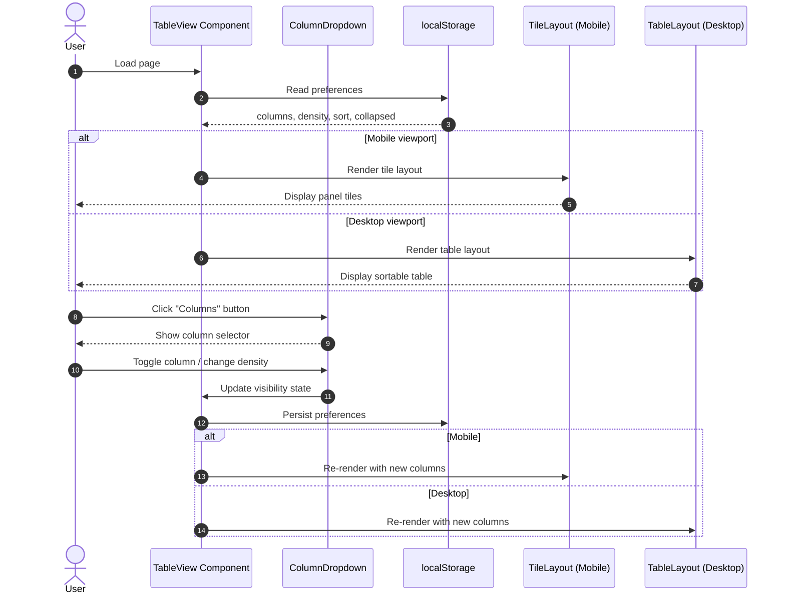

# Table View UX Overhaul

Complete UX overhaul of the TableView component to improve usability on both desktop and mobile. This includes replacing the row of column toggle buttons with a dropdown selector, adding sortable columns on desktop, implementing a configurable tile-based layout for mobile, and improving visual hierarchy with power metric emphasis and mismatch indication.

## Motivation

The current TableView has several UX issues:

1. **Cluttered controls**: 15 column toggle buttons displayed horizontally with cryptic labels (ID, Tigo, Node, SN, CCA, Vin, Vout, Ain, Aout, W, °C, %, dB, kWh, ⚠)
2. **Poor mobile experience**: Column toggles wrap into 3 rows consuming ~150px of vertical space; table requires horizontal scrolling
3. **No sorting**: Users cannot sort data to find outliers or compare panels
4. **Cryptic labels**: Short labels like "Vin" and "Ain" require tooltip hover to understand
5. **Wasted space**: Expand All / Collapse All buttons take significant horizontal space

## Functional Requirements

### FR-1: Dropdown Column Selector

**FR-1.1**: Replace the row of column toggle buttons with a single "Columns" button that opens a dropdown/popover.

**FR-1.2**: The dropdown MUST display human-readable labels organized into categories:
- **Identity**: Panel ID, Tigo ID, Node ID, Serial Number, CCA Source
- **Electrical**: Input Voltage, Output Voltage, Input Current, Output Current, Power (Watts)
- **Status**: Temperature, Duty Cycle, Signal (RSSI), Energy (kWh), Temp ID Warning

**FR-1.3**: Each column MUST be represented by a checkbox that toggles visibility.

**FR-1.4**: The dropdown MUST include preset buttons:
- "Essential" - Panel ID, Power, Input Voltage, Input Current, CCA Source, Temp ID Warning (matches existing DEFAULT_COLUMNS)
- "All" - Enable all columns
- "Reset" - Return to Essential columns (same as clicking "Essential")

**Note:** The Essential preset intentionally matches the existing DEFAULT_COLUMNS from the original tabular-view implementation to maintain backward compatibility with existing user localStorage preferences.

**FR-1.5**: The dropdown MUST include a View Density toggle with two options:
- "Compact" - Reduced padding, smaller text (default)
- "Standard" - More padding, larger text

**FR-1.6**: Column visibility and density preference MUST persist to localStorage.

**FR-1.7**: The dropdown MUST be fully keyboard accessible:
- Enter or Space on the "Columns" button MUST open the dropdown
- Escape MUST close the dropdown and return focus to the trigger button
- Tab MUST navigate through checkboxes and preset buttons in order
- Space MUST toggle the currently focused checkbox
- When dropdown opens, focus MUST move to the first interactive element
- The trigger button MUST have `aria-expanded` and `aria-haspopup="menu"` attributes

### FR-2: Segmented Expand/Collapse Toggle

**FR-2.1**: Replace the two separate "Expand All" / "Collapse All" buttons with a segmented toggle control.

**FR-2.2**: On desktop, the segmented control MUST display text labels: "Expand" | "Collapse"

**FR-2.3**: On mobile, the segmented control MUST display icons only: "▼▼" | "▲▲" to minimize width.

**FR-2.4**: The segmented toggle MUST visually indicate which action was last triggered:
- "Expand" segment highlighted when all strings are expanded (no collapsed strings)
- "Collapse" segment highlighted when any string is collapsed
- Visual indication via background color differentiation (e.g., active segment has accent color, inactive has muted color)

### FR-3: Sortable Columns (Desktop)

**FR-3.1**: On desktop view, clicking a column header MUST cycle through sort states: unsorted → ascending → descending → unsorted.

**FR-3.2**: Sort indicators MUST be displayed in the column header:
- `▲` for ascending
- `▼` for descending
- `↕` (or no indicator) for unsorted/sortable

**FR-3.3**: Only one column MAY be sorted at a time.

**FR-3.4**: Sort state MUST persist to localStorage.

**FR-3.5**: Sorting MUST apply within each string section independently (not globally across all panels).

**FR-3.6**: The Summary row MUST remain at the top of each string table regardless of sort order.

**FR-3.7**: On mobile (tile layout), the sort state MUST be preserved and tiles MUST be sorted according to the current sort setting. When switching from desktop to mobile, the existing sort order applies to tiles. Mobile view does not provide UI to change sort order; users must switch to desktop view (or rotate to landscape on tablet) to modify sorting.

### FR-4: Mobile Tile Layout

**FR-4.1**: On mobile viewports (≤768px), panels MUST be displayed as tiles/cards instead of table rows.

**FR-4.2**: Each tile MUST have a two-row compact structure:
- **Row 1 (Identity)**: Panel ID (left), CCA Source (right), Age (far right)
- **Row 2 (Data)**: Selected data fields distributed with equal horizontal spacing

**FR-4.3**: Data fields in Row 2 MUST be distributed with equal width using flexbox.

**FR-4.4**: If more than 4 data fields are selected, tiles MUST flow to additional rows (maximum 4 fields per row, using CSS flexbox `flex-wrap: wrap` with each field set to `flex: 0 0 25%`).

**FR-4.5**: Power MUST be visually emphasized with bold text and an accent color (e.g., ⚡ icon prefix).

**FR-4.6**: When both Input Voltage AND Output Voltage are selected, labels MUST be shown ("Vin", "Vout") to distinguish them.

**FR-4.7**: When both Input Current AND Output Current are selected, labels MUST be shown ("Ain", "Aout") to distinguish them.

**FR-4.8**: When only one voltage or current field is selected, no label is needed (unit suffix is sufficient).

### FR-5: Tile Configuration

**FR-5.1**: The same column visibility settings from the dropdown MUST control which fields appear in tiles on mobile.

**FR-5.2**: Panel ID and Age MUST always be visible in tiles (not toggleable). CCA Source visibility in Row 1 is controlled by the column visibility setting — if CCA Source is disabled, Row 1 shows only Panel ID (left) and Age (right).

**FR-5.3**: Field order in tiles MUST follow a fixed sequence: Power → Voltage(s) → Current(s) → Temperature → Duty → RSSI → Energy.

### FR-6: Mismatch Indication

**FR-6.1**: Mismatched panels MUST be indicated with:
- Border color: `#ff4444` (red)
- Background tint: `#3d2222` (dark red)

**FR-6.2**: Wrong CCA panels MUST be indicated with:
- Border color: purple
- Background tint: purple tint (existing `#3d2244`)

**FR-6.3**: Temporary ID panels MUST retain the existing yellow tint indication.

**FR-6.4**: These styles MUST apply to both table rows (desktop) and tiles (mobile).

### FR-7: String Summary Preservation

**FR-7.1**: String headers with summary statistics (total power, voltage, current, panel count) MUST be preserved on both desktop and mobile.

**FR-7.2**: String headers MUST remain collapsible with the same behavior as current implementation.

**FR-7.3**: Warning banners for mismatch detection MUST be preserved.

## Non-Functional Requirements

**NFR-1.1**: The column dropdown MUST open/close within 100ms.

**NFR-1.2**: Tile layout rendering MUST not cause visible layout shift when transitioning from loading state.

**NFR-2.1**: Touch targets on mobile MUST be at least 44x44px per Apple HIG / Material Design guidelines.

**NFR-2.2**: The controls bar (threshold + columns + expand/collapse) SHOULD target 48-56px height on mobile. Touch targets within the bar MAY use the full 44px height with minimal vertical padding (2-6px), relying on horizontal spacing between controls to meet accessibility requirements. If 44px touch targets cannot fit within 56px bar height, the bar height MAY be increased to accommodate proper touch targets.

**NFR-3.1**: All user preferences (columns, density, sort, collapsed strings) MUST persist across page reloads via localStorage.

**NFR-4.1**: The implementation MUST not add any new npm dependencies. Use native React state and CSS only.

## High Level Design



### Component Structure

```
TableView/
├── TableView.tsx              # Main component, handles state and routing
├── components/
│   ├── ColumnDropdown.tsx     # Dropdown with column toggles and presets
│   ├── ExpandCollapseToggle.tsx # Segmented toggle component
│   ├── TableLayout.tsx        # Desktop table with sortable headers
│   ├── TileLayout.tsx         # Mobile tile/card layout
│   ├── PanelTile.tsx          # Individual panel tile component
│   └── StringSection.tsx      # Wrapper for string header + content
└── hooks/
    └── useTablePreferences.ts # localStorage persistence hook
```

### Column Dropdown Design

```tsx
interface ColumnDropdownProps {
  visibleColumns: Set<string>;
  onToggleColumn: (column: string) => void;
  density: 'compact' | 'standard';
  onDensityChange: (density: 'compact' | 'standard') => void;
  onPreset: (preset: 'essential' | 'all' | 'reset') => void;
}

// Column categories for grouping
const COLUMN_CATEGORIES = {
  identity: ['display_label', 'tigo_label', 'node_id', 'sn', 'actual_system'],
  electrical: ['voltage_in', 'voltage_out', 'current_in', 'current_out', 'watts'],
  status: ['temperature', 'duty_cycle', 'rssi', 'energy', 'is_temporary'],
};

// Human-readable category labels for dropdown headers
const CATEGORY_LABELS: Record<string, string> = {
  identity: 'Identity',
  electrical: 'Electrical',
  status: 'Status',
};

// Human-readable labels
const COLUMN_LABELS: Record<string, string> = {
  display_label: 'Panel ID',
  tigo_label: 'Tigo ID',
  node_id: 'Node ID',
  sn: 'Serial Number',
  voltage_in: 'Input Voltage',
  voltage_out: 'Output Voltage',
  current_in: 'Input Current',
  current_out: 'Output Current',
  watts: 'Power (Watts)',
  actual_system: 'CCA Source',
  temperature: 'Temperature',
  duty_cycle: 'Duty Cycle',
  rssi: 'Signal (RSSI)',
  energy: 'Energy (kWh)',
  is_temporary: 'Temp ID Warning',
};
```

### Tile Layout Design

```tsx
interface PanelTileProps {
  panel: PanelData;
  visibleColumns: Set<string>;
  density: 'compact' | 'standard';
  isMismatched: boolean;
  isWrongCca: boolean;
  isTemporary: boolean;
}

// Field rendering order (fixed sequence)
const FIELD_ORDER = [
  'watts',
  'voltage_in',
  'voltage_out',
  'current_in',
  'current_out',
  'temperature',
  'duty_cycle',
  'rssi',
  'energy',
];

// Determine if labels are needed
function needsLabel(column: string, visibleColumns: Set<string>): boolean {
  if (column === 'voltage_in' && visibleColumns.has('voltage_out')) return true;
  if (column === 'voltage_out' && visibleColumns.has('voltage_in')) return true;
  if (column === 'current_in' && visibleColumns.has('current_out')) return true;
  if (column === 'current_out' && visibleColumns.has('current_in')) return true;
  return false;
}
```

### Sortable Table Headers

```tsx
type SortDirection = 'asc' | 'desc' | null;

interface SortState {
  column: string | null;
  direction: SortDirection;
}

function SortableHeader({
  column,
  label,
  sortState,
  onSort
}: {
  column: string;
  label: string;
  sortState: SortState;
  onSort: (column: string) => void;
}) {
  const isActive = sortState.column === column;
  const indicator = isActive
    ? (sortState.direction === 'asc' ? '▲' : '▼')
    : '↕';

  // Determine aria-sort value
  const ariaSort = isActive
    ? (sortState.direction === 'asc' ? 'ascending' : 'descending')
    : 'none';

  const handleKeyDown = (e: React.KeyboardEvent) => {
    if (e.key === 'Enter' || e.key === ' ') {
      e.preventDefault();
      onSort(column);
    }
  };

  return (
    <th
      onClick={() => onSort(column)}
      onKeyDown={handleKeyDown}
      tabIndex={0}
      role="columnheader"
      aria-sort={ariaSort}
      style={{ cursor: 'pointer' }}
    >
      {label} {indicator}
    </th>
  );
}

// Sort cycling logic
function cycleSortDirection(current: SortDirection): SortDirection {
  if (current === null) return 'asc';
  if (current === 'asc') return 'desc';
  return null; // desc -> null (unsorted)
}
```

### Segmented Toggle Component

```tsx
interface ExpandCollapseToggleProps {
  allExpanded: boolean;
  onExpandAll: () => void;
  onCollapseAll: () => void;
  isMobile: boolean;
}

function ExpandCollapseToggle({
  allExpanded,
  onExpandAll,
  onCollapseAll,
  isMobile
}: ExpandCollapseToggleProps) {
  return (
    <div style={segmentedContainerStyle}>
      <button
        style={{
          ...segmentButtonStyle,
          ...(allExpanded ? activeSegmentStyle : {}),
        }}
        onClick={onExpandAll}
        title="Expand all strings"
      >
        {isMobile ? '▼▼' : 'Expand'}
      </button>
      <button
        style={{
          ...segmentButtonStyle,
          ...(!allExpanded ? activeSegmentStyle : {}),
        }}
        onClick={onCollapseAll}
        title="Collapse all strings"
      >
        {isMobile ? '▲▲' : 'Collapse'}
      </button>
    </div>
  );
}
```

### Tile Styles

```tsx
const tileBaseStyle: CSSProperties = {
  backgroundColor: '#252525',
  borderRadius: '8px',
  padding: '12px', // 'standard' density
  marginBottom: '8px',
  border: '2px solid transparent',
};

const tileCompactStyle: CSSProperties = {
  ...tileBaseStyle,
  padding: '8px',
  marginBottom: '6px',
};

const tileMismatchStyle: CSSProperties = {
  borderColor: '#ff4444',
  backgroundColor: '#3d2222',
};

const tileWrongCcaStyle: CSSProperties = {
  borderColor: '#9944ff',
  backgroundColor: '#3d2244',
};

const powerStyle: CSSProperties = {
  fontWeight: 'bold',
  color: '#4a90d9', // accent color
  fontSize: '1.1em',
};
```

### localStorage Schema

```typescript
interface TableViewPreferences {
  columns: string[];           // Array of visible column keys
  density: 'compact' | 'standard';
  sort: {
    column: string | null;
    direction: 'asc' | 'desc' | null;
  };
  collapsedStrings: string[];  // Array of collapsed string IDs
  mismatchThreshold: number;   // Already exists
}

// Storage keys
const STORAGE_KEYS = {
  columns: 'tableColumns',           // Existing - JSON array of column keys
  density: 'tableDensity',           // New - string: 'compact' | 'standard'
  sort: 'tableSort',                 // New - JSON: { column: string | null, direction: 'asc' | 'desc' | null }
  collapsed: 'collapsedStrings',     // Existing - JSON array of string IDs
  threshold: 'mismatchThreshold',    // Existing - number
};

// Example localStorage values:
// tableColumns: '["display_label","watts","voltage_in","current_in","actual_system","is_temporary"]'
// tableDensity: 'compact'
// tableSort: '{"column":"watts","direction":"desc"}'
// collapsedStrings: '["string-1","string-3"]'
```

## Task Breakdown

### Phase 1: Dropdown Column Selector

1. **Create ColumnDropdown component**
   - Build dropdown UI with open/close state
   - Organize columns into categories (Identity, Electrical, Status)
   - Add checkboxes with human-readable labels
   - Implement preset buttons (Essential, All, Reset)
   - Add View Density toggle (Compact/Standard)

2. **Integrate dropdown into TableView**
   - Replace existing column toggle buttons with Columns button
   - Wire up state management
   - Add localStorage persistence for density preference

3. **Style the dropdown**
   - Dark theme matching existing UI
   - Proper spacing and touch targets
   - Click-outside-to-close behavior

### Phase 2: Segmented Expand/Collapse Toggle

4. **Create ExpandCollapseToggle component**
   - Build segmented button UI
   - Implement desktop (text) and mobile (icon) variants
   - Add active state indication

5. **Integrate toggle into TableView**
   - Replace existing separate buttons
   - Wire up expand/collapse all logic

### Phase 3: Sortable Columns (Desktop)

6. **Add sort state management**
   - Create sort state (column, direction)
   - Implement sort cycling logic
   - Add localStorage persistence

7. **Create SortableHeader component**
   - Clickable headers with sort indicators
   - Visual feedback on hover

8. **Implement sorting logic**
   - Sort panels within each string section
   - Keep Summary row at top regardless of sort
   - Support numeric and string sorting

### Phase 4: Mobile Tile Layout

9. **Create TileLayout component**
   - Container for rendering panels as tiles
   - Responsive to column visibility settings

10. **Create PanelTile component**
    - Two-row layout (Identity + Data)
    - Equal-width field distribution with flexbox
    - Multi-row flow for 5+ fields
    - Conditional labels for Vin/Vout, Ain/Aout
    - Power emphasis styling
    - Mismatch/wrong CCA/temporary indication

11. **Implement density variants**
    - Compact: reduced padding (8px), smaller margins
    - Standard: normal padding (12px), larger margins

12. **Integrate tile layout into TableView**
    - Conditional rendering based on viewport width
    - Ensure string headers and summaries work with tiles

### Phase 5: Polish and Testing

13. **Playwright UX verification**
    - Mobile viewport testing (375x812)
    - Touch target verification (44x44px minimum)
    - Controls bar height verification (≤56px)
    - Verify no horizontal overflow

14. **Dropdown interaction testing**
    - Click "Columns" button opens dropdown
    - Click outside dropdown closes it
    - Escape key closes dropdown and returns focus to trigger button
    - Tab navigates through checkboxes and preset buttons in document order
    - Space/Enter toggles checkbox under focus
    - Verify ARIA attributes: `aria-expanded`, `aria-haspopup="menu"` on trigger button

15. **Sorting feature testing**
    - Click column header cycles through: unsorted → ascending → descending → unsorted
    - Sort indicator (▲/▼/↕) updates correctly
    - Data order changes within string sections
    - Summary row remains at top regardless of sort
    - Sort state persists after page reload (localStorage)
    - Switching columns clears previous sort

16. **Cross-browser testing**
    - Test dropdown positioning
    - Test tile layout flex behavior
    - Verify localStorage persistence

17. **Accessibility audit**
    - Verify dropdown is keyboard accessible (Enter/Space to open, Escape to close)
    - Verify sortable headers have `aria-sort` attribute
    - Verify sortable headers are keyboard activatable (Enter/Space)
    - Add ARIA labels where needed
    - Test with screen reader

## Related Specifications

| Spec | Relationship | Notes |
|------|--------------|-------|
| [2026-01-17-tabular-view.md](implemented/2026-01-17-tabular-view.md) | extends | This spec extends the original TableView implementation with UX improvements. Preserves existing DEFAULT_COLUMNS and localStorage keys for backward compatibility. |

## Context / Documentation

### Existing Files to Modify

- `dashboard/frontend/src/components/TableView.tsx` - Main component to refactor

### Reference Files

- `dashboard/frontend/src/hooks/useMediaQuery.ts` - Existing mobile detection hook
- `dashboard/frontend/src/utils/mismatchDetection.ts` - Existing mismatch analysis
- `dashboard/frontend/src/constants.ts` - MOBILE_BREAKPOINT constant

### External References

- [MUI DataGrid Column Visibility](https://mui.com/x/react-data-grid/column-visibility/) - Pattern reference
- [DataTables Column Visibility](https://datatables.net/extensions/buttons/examples/column_visibility/) - Pattern reference
- [NN/g Mobile Tables](https://www.nngroup.com/articles/mobile-tables/) - UX best practices

---

**Specification Version:** 1.0
**Last Updated:** January 2026
**Authors:** Claude Opus 4.5

## Changelog

### v1.0 (January 2026)
**Summary:** Initial specification

**Changes:**
- Initial specification created
- Defined dropdown column selector with categories and presets
- Specified segmented expand/collapse toggle
- Defined sortable columns for desktop
- Specified configurable tile layout for mobile
- Defined mismatch indication styling
