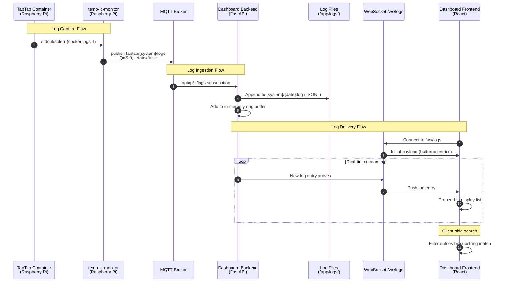

# CCA Log Viewer

Stream and display real-time taptap CCA container logs in the dashboard via MQTT. Adds a fourth "Logs" tab that shows log output from each configured CCA, with per-CCA sub-tabs (when multiple CCAs exist), descending timestamp order, and client-side search.

## Motivation

Currently, CCA logs are only accessible by SSH-ing into the Raspberry Pi and running `docker logs`. This makes it difficult for users to monitor enumeration events, diagnose issues, or verify CCA health without terminal access. By streaming logs over the existing MQTT infrastructure and displaying them in the dashboard, users get immediate visibility into CCA behavior without leaving the browser.

## Functional Requirements

### FR-1: MQTT Log Publishing (tigo-mqtt side)

**FR-1.1:** The `temp-id-monitor` sidecar MUST publish raw log lines from each taptap container to the MQTT topic `taptap/{system}/logs` (e.g., `taptap/primary/logs`, `taptap/secondary/logs`).

**FR-1.2:** Each MQTT log message MUST be a JSON object with the following schema:
```json
{
  "ts": "2026-02-08T14:30:05.123456",
  "line": "Permanently enumerated node id: 3 to node name: C5 and serial: 4-C3F269M"
}
```
- `ts`: ISO 8601 timestamp of when the log line was captured (UTC)
- `line`: The raw, unmodified log line text from the taptap container

**FR-1.3:** Log messages MUST be published with QoS 0 (fire-and-forget) and `retain=false`. Logs are ephemeral and MUST NOT be retained at the broker.

**FR-1.4:** The publisher MUST NOT publish to any topic under the `homeassistant/` prefix. This ensures Home Assistant does not create entities or store log data.

**FR-1.5:** On startup, the publisher MUST replay existing historical container logs (from the current container lifecycle) to the MQTT topic, so the backend can populate its log store even if it connects after the taptap container has been running.

**FR-1.6:** The publisher MUST NOT duplicate log lines. When transitioning from historical log replay (Phase 1) to real-time follow (Phase 2), the publisher MUST use the `--since` flag with a timestamp that avoids re-publishing lines already sent during replay.

### FR-2: Backend Log Ingestion and Persistence

**FR-2.1:** The backend MQTT client MUST subscribe to `taptap/+/logs` and route incoming messages to a log handler.

**FR-2.2:** The backend MUST persist received log lines to disk as append-only log files, one file per CCA system per day:
```
/app/logs/primary/2026-02-08.log
/app/logs/primary/2026-02-09.log
/app/logs/secondary/2026-02-08.log
```

**FR-2.3:** Each line in the log file MUST be stored as a single JSON object (one per line, JSONL format):
```jsonl
{"ts": "2026-02-08T14:30:05.123456", "line": "Permanently enumerated node id: 3 ..."}
{"ts": "2026-02-08T14:30:06.789012", "line": "Node 3 online"}
```

**FR-2.4:** The backend MUST enforce a rolling 7-day retention window. On startup and once daily thereafter, the backend MUST delete log files older than 7 days.

**FR-2.5:** The log directory MUST be mounted as a Docker volume in `docker-compose.yml` so logs persist across container restarts:
```yaml
volumes:
  - ./backend/logs:/app/logs
```

**FR-2.6:** On startup, the backend MUST load all log entries within the 7-day retention window into memory for fast initial delivery to new WebSocket clients. New entries received via MQTT are appended to the in-memory store and persisted to disk simultaneously.

### FR-3: Backend Log API

**FR-3.1:** The backend MUST expose a WebSocket endpoint at `/ws/logs` for streaming log data to the frontend.

**FR-3.2:** When a client connects to `/ws/logs`, the backend MUST immediately send all in-memory log entries (the full 7-day window) as an initial payload:
```json
{
  "type": "initial",
  "systems": ["primary", "secondary"],
  "logs": {
    "primary": [
      {"ts": "2026-02-08T14:30:05.123456", "line": "..."},
      ...
    ],
    "secondary": [
      {"ts": "2026-02-08T14:30:06.789012", "line": "..."},
      ...
    ]
  }
}
```

**FR-3.3:** After the initial payload, new log entries MUST be pushed to connected clients in real-time as they arrive from MQTT:
```json
{
  "type": "log",
  "system": "primary",
  "entry": {"ts": "2026-02-08T14:30:07.345678", "line": "..."}
}
```

**FR-3.4:** The backend MUST expose a REST endpoint `GET /api/logs/{system}` that returns historical logs with pagination support:
```
GET /api/logs/primary?days=3&limit=500&offset=0
```
Response:
```json
{
  "system": "primary",
  "entries": [...],
  "total": 1234,
  "has_more": true
}
```

**FR-3.5:** The backend MUST expose `GET /api/logs/systems` to return the list of CCA systems that have log data available:
```json
{
  "systems": ["primary", "secondary"]
}
```

### FR-4: Frontend Logs Tab

**FR-4.1:** The dashboard MUST add a fourth main tab labeled "Logs" (with a `ScrollText` lucide icon) to the `TabNavigation` component. The `TabType` union MUST be extended to include `'logs'`.

**FR-4.2:** When only one CCA system has log data, the Logs tab MUST display logs directly without sub-tabs.

**FR-4.3:** When multiple CCA systems have log data, the Logs tab MUST display sub-tabs (e.g., "Primary", "Secondary") allowing the user to switch between systems. Sub-tab labels MUST be the capitalized system name.

**FR-4.4:** Log entries MUST be displayed in descending order by timestamp (most recent at top).

**FR-4.5:** Log messages MUST be displayed as raw, unmodified text in a monospace font. No parsing, coloring, or transformation of the log content.

**FR-4.6:** The log view MUST include a search bar at the top that filters displayed log entries client-side. The search MUST be case-insensitive substring matching across the full log line text.

**FR-4.7:** The search bar MUST have a clear button (X) to reset the filter and a placeholder text: "Search logs (MAC, serial, node ID...)".

**FR-4.8:** New log entries arriving via WebSocket MUST be prepended to the top of the list in real-time. If the user has scrolled down, new entries MUST NOT cause the viewport to jump — the scroll position MUST be preserved.

**FR-4.9:** The log view MUST display a count of total entries and filtered entries when a search is active (e.g., "Showing 23 of 456 entries").

**FR-4.10:** Each log entry MUST display the timestamp in the user's local timezone, formatted as `HH:MM:SS.mmm` (hours, minutes, seconds, milliseconds) with the full date shown on hover via a title attribute.

**FR-4.11:** The frontend MUST hold all log entries delivered by the backend (up to the full 7-day retention window). Given the low log volume (~200-500 lines/CCA/day, ~3,500 max per CCA for 7 days), no client-side cap is needed.

### FR-5: Configuration

**FR-5.1:** The backend `Settings` class MUST add a `log_retention_days` configuration option (default: 7).

**FR-5.2:** The backend `Settings` class MUST add a `log_dir` configuration option (default: `/app/logs`).

**FR-5.3:** *(Removed — no buffer size cap needed given low log volume.)*

## Non-Functional Requirements

**NFR-1.1:** Log storage MUST NOT exceed 10 MB total for 7 days of retention across all CCAs. Estimated volume is ~100-150 KB per CCA per day (~1-2 MB total for 7 days with 2 CCAs). This is well within limits.

**NFR-1.2:** The MQTT log publishing MUST NOT impact the performance of the existing panel data flow. Log messages use QoS 0 and are independent of state/temp_nodes/node_mappings topics.

**NFR-1.3:** The frontend log viewer MUST remain responsive with the full 7-day log history (~3,500 entries per CCA max). The search filter MUST respond within 100ms for typical search terms.

**NFR-1.4:** Log persistence MUST be crash-safe: each log line is flushed after append. Partial writes (due to crash mid-line) MUST be handled gracefully on reload (skip malformed trailing line).

**NFR-1.5:** The Logs tab MUST be lazy-loaded (code-split) like the Layout Editor to avoid increasing the initial bundle size.

## High Level Design



### Component Architecture

#### 1. Log Publisher (tigo-mqtt side)

The existing `temp-id-monitor` sidecar already reads `docker logs -f` for each taptap container. The log publishing functionality is added to this sidecar by publishing each raw log line to MQTT as it arrives.

The sidecar's `monitor_container` function already has two phases:
- **Phase 1 (Historical):** Reads all existing logs via `docker logs <container>`
- **Phase 2 (Real-time):** Follows new logs via `docker logs -f --since 0s <container>`

Both phases will be extended to publish log lines to `taptap/{system}/logs` in addition to the existing enumeration event processing. The existing enumeration logic remains unchanged.

```python
# In monitor_container(), during log line processing:
log_entry = json.dumps({
    "ts": datetime.now(timezone.utc).isoformat(),
    "line": line_str,
})
await mqtt.publish(f"taptap/{system}/logs", log_entry, qos=0, retain=False)
```

#### 2. Log Service (backend)

New file: `dashboard/backend/app/log_service.py`

```python
import json
import os
from collections import deque
from datetime import datetime, timedelta, timezone
from pathlib import Path

class LogService:
    """Manages CCA log ingestion, persistence, and retrieval."""

    def __init__(self, log_dir: str, retention_days: int):
        self.log_dir = Path(log_dir)
        self.retention_days = retention_days
        # Per-system log stores (full 7-day window, loaded from disk on startup)
        self._logs: dict[str, list] = {}
        # WebSocket connections for log streaming
        self._connections: list[WebSocket] = []

    def ingest(self, system: str, entry: dict) -> None:
        """Ingest a log entry: persist to disk and store in memory."""
        # Append to daily log file
        date_str = datetime.now(timezone.utc).strftime("%Y-%m-%d")
        log_path = self.log_dir / system / f"{date_str}.log"
        log_path.parent.mkdir(parents=True, exist_ok=True)
        with open(log_path, "a") as f:
            f.write(json.dumps(entry) + "\n")

        # Add to in-memory store
        if system not in self._logs:
            self._logs[system] = []
        self._logs[system].append(entry)

    def get_all_logs(self) -> dict[str, list]:
        """Return all logs by system."""
        return {
            system: list(entries) for system, entries in self._logs.items()
        }

    def get_systems(self) -> list[str]:
        """Return list of systems that have log data."""
        return list(self._logs.keys())

    def prune_old_logs(self) -> int:
        """Delete log files older than retention_days. Returns files deleted."""
        cutoff = datetime.now(timezone.utc) - timedelta(days=self.retention_days)
        deleted = 0
        for system_dir in self.log_dir.iterdir():
            if not system_dir.is_dir():
                continue
            for log_file in system_dir.glob("*.log"):
                try:
                    file_date = datetime.strptime(log_file.stem, "%Y-%m-%d")
                    if file_date.date() < cutoff.date():
                        log_file.unlink()
                        deleted += 1
                except ValueError:
                    pass
        return deleted

    def load_from_disk(self) -> None:
        """On startup, load all log entries within retention window from disk."""
        cutoff = datetime.now(timezone.utc) - timedelta(days=self.retention_days)
        for system_dir in self.log_dir.iterdir():
            if not system_dir.is_dir():
                continue
            system = system_dir.name
            entries = []
            # Read files in chronological order
            log_files = sorted(system_dir.glob("*.log"))
            for log_file in log_files:
                try:
                    file_date = datetime.strptime(log_file.stem, "%Y-%m-%d")
                    if file_date.date() < cutoff.date():
                        continue
                except ValueError:
                    continue
                for raw_line in log_file.read_text().strip().splitlines():
                    try:
                        entries.append(json.loads(raw_line))
                    except json.JSONDecodeError:
                        continue  # Skip malformed lines (NFR-1.4)
            self._logs[system] = entries
```

#### 3. MQTT Integration (backend)

The existing `MQTTClient` class gains a new `on_log` callback parameter and subscribes to `taptap/+/logs`:

```python
# In mqtt_client.py _connect_loop():
logs_topic = f"{settings.mqtt_topic_prefix}/+/logs"
await client.subscribe(logs_topic)

# In message routing:
if topic_str.endswith("/logs"):
    await self._process_log(topic_str, payload)
```

#### 4. WebSocket Endpoint (backend)

New WebSocket endpoint `/ws/logs` in `main.py`:

```python
@app.websocket("/ws/logs")
async def logs_websocket(websocket: WebSocket):
    await websocket.accept()
    log_service.add_connection(websocket)

    # Send all logs within retention window
    initial = {
        "type": "initial",
        "systems": log_service.get_systems(),
        "logs": log_service.get_all_logs(),
    }
    await websocket.send_json(initial)

    try:
        while True:
            await websocket.receive_text()  # Keep alive
    except WebSocketDisconnect:
        log_service.remove_connection(websocket)
```

#### 5. Frontend Log Viewer

New files:
- `dashboard/frontend/src/components/LogViewer.tsx` - Main log viewer component
- `dashboard/frontend/src/hooks/useLogWebSocket.ts` - WebSocket hook for log streaming

The `LogViewer` component structure:

```
┌─────────────────────────────────────┐
│ [Primary] [Secondary]    ← sub-tabs │  (hidden if single CCA)
├─────────────────────────────────────┤
│ 🔍 Search logs (MAC, serial...)  [X]│  ← search bar
├─────────────────────────────────────┤
│ Showing 23 of 456 entries           │  ← entry count
├─────────────────────────────────────┤
│ 14:30:07.345 Permanently enum...    │  ← log entries (newest first)
│ 14:30:06.789 Node 3 online          │
│ 14:30:05.123 Infrastructure re...   │
│ ...                                 │
└─────────────────────────────────────┘
```

The `useLogWebSocket` hook follows the same pattern as the existing `useWebSocket` hook:

```typescript
function getLogWebSocketUrl(): string {
  if (import.meta.env.VITE_WS_URL) {
    // Derive from panel WS URL
    return import.meta.env.VITE_WS_URL.replace('/ws/panels', '/ws/logs');
  }
  const protocol = window.location.protocol === 'https:' ? 'wss:' : 'ws:';
  return `${protocol}//${window.location.host}/ws/logs`;
}
```

### Log File Size Estimates

| Metric | Value |
|--------|-------|
| Avg log line length | ~100 bytes |
| Lines per CCA per day (typical) | ~200-500 |
| Daily file size per CCA | ~20-50 KB |
| 7 days, 2 CCAs | ~280-700 KB |
| Maximum (heavy error days) | ~2-3 MB total |
| In-memory store (full 7 days/CCA) | ~280-700 KB |

## Task Breakdown

### Task 1: Log Publishing in temp-id-monitor

**Files:** `tigo-mqtt/temp-id-monitor/temp_id_monitor.py`

1. Add log line publishing to `monitor_container()` for both Phase 1 (historical) and Phase 2 (real-time)
2. Publish each line as JSON `{"ts": ..., "line": ...}` to `taptap/{system}/logs`
3. Use QoS 0, retain=false
4. Ensure no duplicate lines during phase transition

### Task 2: Backend Log Service

**Files:** `dashboard/backend/app/log_service.py` (new)

1. Create `LogService` class with ingestion, disk persistence, and pruning
2. JSONL file format, one file per system per day
3. Startup: load all entries within 7-day window from disk into memory
4. Daily pruning of files older than 7 days

### Task 3: Backend MQTT + WebSocket Integration

**Files:** `dashboard/backend/app/mqtt_client.py`, `dashboard/backend/app/main.py`, `dashboard/backend/app/config.py`

1. Add `on_log` callback to `MQTTClient` and subscribe to `taptap/+/logs`
2. Add `log_retention_days`, `log_dir` to `Settings`
3. Create `LogService` instance in `main.py` lifespan
4. Add `/ws/logs` WebSocket endpoint with initial payload + real-time push
5. Add `GET /api/logs/systems` and `GET /api/logs/{system}` REST endpoints
6. Add log volume mount to `docker-compose.yml`

### Task 4: Frontend Logs Tab

**Files:** `dashboard/frontend/src/components/LogViewer.tsx` (new), `dashboard/frontend/src/hooks/useLogWebSocket.ts` (new), `dashboard/frontend/src/components/TabNavigation.tsx`, `dashboard/frontend/src/components/Dashboard.tsx`

1. Create `useLogWebSocket` hook following existing `useWebSocket` pattern
2. Create `LogViewer` component with:
   - Sub-tabs for multiple CCA systems (hidden for single CCA)
   - Search bar with clear button
   - Descending timestamp log list in monospace font
   - Entry count display
   - Scroll position preservation on new entries
3. Extend `TabType` to include `'logs'`
4. Add Logs tab to `TabNavigation` (both mobile and desktop)
5. Add Logs tab routing in `Dashboard.tsx` (lazy-loaded)

### Task 5: Playwright Verification

1. Build and deploy containers
2. Navigate to Logs tab, verify it loads
3. Verify search filtering works
4. Verify sub-tab switching (if multiple CCAs)
5. Verify real-time log entry appearance

## Related Specifications

| Spec | Relationship | Notes |
|------|--------------|-------|
| None | — | First spec in this project |

## Context / Documentation

- `tigo-mqtt/temp-id-monitor/temp_id_monitor.py` — Sidecar that reads taptap container logs (will be extended for log publishing)
- `dashboard/backend/app/mqtt_client.py` — Backend MQTT subscription handler (will add `taptap/+/logs`)
- `dashboard/backend/app/main.py` — FastAPI app with lifespan, WebSocket endpoints
- `dashboard/backend/app/websocket_manager.py` — Existing WebSocket broadcast pattern
- `dashboard/backend/app/config.py` — Pydantic settings class
- `dashboard/frontend/src/hooks/useWebSocket.ts` — Existing WebSocket hook pattern to follow
- `dashboard/frontend/src/components/TabNavigation.tsx` — Tab navigation (currently 3 tabs)
- `dashboard/frontend/src/components/Dashboard.tsx` — Main dashboard with tab routing
- `dashboard/docker-compose.yml` — Container orchestration (add log volume mount)
- `tigo-mqtt/docker-compose.yml` — taptap containers (no changes needed, temp-id-monitor already has docker socket access)
- Home Assistant MQTT docs — Confirms HA only creates entities via discovery topics (`homeassistant/...`) or explicit configuration; arbitrary topics like `taptap/*/logs` are invisible to HA

---

**Specification Version:** 1.0
**Last Updated:** February 2026
**Authors:** Ian, Claude

## Changelog

### v1.0 (February 2026)
**Summary:** Initial specification

**Changes:**
- Initial specification created
