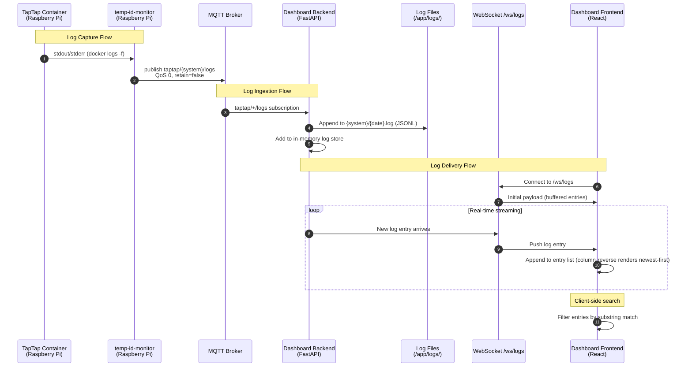

# CCA Log Viewer

Stream and display real-time taptap CCA container logs in the dashboard via MQTT. Adds a fourth "Logs" tab that shows log output from each configured CCA, with per-CCA sub-tabs (when multiple CCAs exist), descending timestamp order, and client-side search.

## Motivation

Currently, CCA logs are only accessible by SSH-ing into the Raspberry Pi and running `docker logs`. This makes it difficult for users to monitor enumeration events, diagnose issues, or verify CCA health without terminal access. By streaming logs over the existing MQTT infrastructure and displaying them in the dashboard, users get immediate visibility into CCA behavior without leaving the browser.

## Functional Requirements

### FR-1: MQTT Log Publishing (tigo-mqtt side)

**FR-1.1:** The `temp-id-monitor` sidecar MUST publish raw log lines from each taptap container to the MQTT topic `{mqtt_topic_prefix}/{system}/logs` (e.g., `taptap/primary/logs`, `taptap/secondary/logs`), where `mqtt_topic_prefix` is the same configurable prefix used by the existing enumeration publishing (currently `taptap`). Both the publisher and backend MUST use this same configurable prefix — the publisher reads it from its environment configuration, and the backend reads it from `settings.mqtt_topic_prefix`.

**FR-1.2:** Each MQTT log message MUST be a JSON object with the following schema:
```json
{
  "ts": "2026-02-08T14:30:05.123456",
  "line": "Permanently enumerated node id: 3 to node name: C5 and serial: 4-C3F269M",
  "seq": 42
}
```
- `ts`: ISO 8601 timestamp (UTC). For real-time logs, this is the capture time (`datetime.now(timezone.utc)`). For historical replay on startup, the publisher MUST assign monotonically incrementing timestamps by adding a microsecond offset per line (e.g., `base_ts + timedelta(microseconds=i)` for line `i`). This preserves the original ordering of historical log lines while making it clear they are replay timestamps (all clustered within the same second). The `seq` field provides a secondary sort key for entries with identical timestamps.
- `line`: The raw log line text from the taptap container, truncated to a maximum of 10,240 bytes (10 KB). Lines exceeding this limit MUST be truncated with a `[truncated]` suffix. This prevents oversized MQTT messages, unbounded memory usage, and rendering issues in the frontend.
- `seq`: Monotonically incrementing sequence number per system, starting from 0 on publisher startup. Used as a tiebreaker for sorting entries with identical timestamps, and enables gap detection on the backend (non-contiguous sequence numbers indicate dropped messages). A `seq` value lower than the previous value for the same system indicates a publisher restart, not dropped messages — the backend MUST detect and log this condition separately from gap detection. See the `_last_seq` tracking in Section 2 (LogService `ingest()`) for the implementation.

**FR-1.3:** Log messages MUST be published with QoS 0 (fire-and-forget) and `retain=false`. Logs are ephemeral and MUST NOT be retained at the broker. QoS 0 means messages may be silently dropped during broker congestion or network hiccups — this is acceptable for log data since the backend persists to disk and the `seq` field enables gap detection. The backend SHOULD NOT attempt to request retransmission of missed messages.

**FR-1.4:** The publisher MUST NOT publish to any topic under the `homeassistant/` prefix. This ensures Home Assistant does not create entities or store log data. This is enforced by construction: the publisher only publishes to `{mqtt_topic_prefix}/{system}/logs`, which uses the same prefix as the existing enumeration topics (currently `taptap`). No additional runtime check is needed since the topic prefix is configured once and does not include `homeassistant/`.

**FR-1.5:** On startup, the publisher MUST replay existing historical container logs (from the current container lifecycle) to the MQTT topic, so the backend can populate its log store even if it connects after the taptap container has been running.

**FR-1.6:** The publisher MUST NOT duplicate log lines. When transitioning from historical log replay (Phase 1) to real-time follow (Phase 2), the publisher MUST use a deduplication strategy that accounts for the time gap between Phase 1 completion and Phase 2 start. The `--since` flag alone is insufficient because Docker's `--since` has only second-level granularity and logs emitted between `last_historical_ts` capture and Phase 2 start may be missed or duplicated. The publisher MUST:
1. Track the last 100 lines seen during Phase 1 in a dedup set, with a `dedup_phase_active` flag to control the transition lifecycle
2. When Phase 2 starts with `--since`, skip any lines that match the dedup set (via `discard()` to drain naturally). Once the set is empty, clear the flag and free memory.
3. Use a `--since` timestamp captured *before* Phase 1 begins (not after), then rely on the deduplication set to filter already-published lines. The natural drain approach (vs. clearing on first non-match) prevents premature clearing when Phase 2 lines interleave with overlap lines.

Note: Content-based dedup may suppress a genuine new line if its text is identical to an unseen historical line still in the dedup set (e.g., a repeated status message like "Waiting for enumeration..."). This is acceptable given the short overlap window and the ephemeral nature of log data.

**FR-1.7:** The publisher MUST truncate individual log lines to a maximum of 10,240 bytes (10 KB) before publishing. Lines exceeding this limit MUST be truncated and suffixed with ` [truncated]`.

### FR-2: Backend Log Ingestion and Persistence

**FR-2.1:** The backend MQTT client MUST subscribe to `{settings.mqtt_topic_prefix}/+/logs` and route incoming messages to a log handler. The system name MUST be extracted from the topic using the configured prefix length (not a hardcoded split index), to support multi-segment prefixes. The handler MUST validate the incoming payload schema before passing to the log service (see Section 3).

**FR-2.2:** The backend MUST persist received log lines to disk as append-only log files, one file per CCA system per day:
```
/app/logs/primary/2026-02-08.log
/app/logs/primary/2026-02-09.log
/app/logs/secondary/2026-02-08.log
```
The system name used in directory paths MUST be validated against an allowlist pattern (`^[a-zA-Z0-9_-]+$`, max 64 chars) before any filesystem operation. Invalid system names MUST be rejected with a warning log. The daily filename is derived from `datetime.now(timezone.utc).strftime("%Y-%m-%d")` — entries arriving around midnight UTC will be written to the file corresponding to their arrival time, which may differ from the `ts` in the entry. This is acceptable since the filename is used only for retention management, not for querying. Concurrent writes from multiple MQTT messages are handled safely by removing `asyncio.to_thread` entirely. Since each log line is small (~200 bytes typical, max 10 KB), the synchronous `open()+write()+flush()` completes in under 0.1ms and does not meaningfully block the event loop. Writing synchronously within the async `ingest()` method guarantees serialization through the single-threaded event loop — only one `_write_line` call executes at a time, with no threading concerns. (Note: the previous approach using `asyncio.to_thread` was incorrect — it dispatched writes to a multi-worker `ThreadPoolExecutor`, which could run concurrent `_write_line` calls on different threads. While POSIX `O_APPEND` provides atomic writes for lines under `PIPE_BUF` (4096 bytes), lines up to 10 KB exceed this guarantee.)

**FR-2.3:** Each line in the log file MUST be stored as a single JSON object (one per line, JSONL format):
```jsonl
{"ts": "2026-02-08T14:30:05.123456", "line": "Permanently enumerated node id: 3 ...", "seq": 42}
{"ts": "2026-02-08T14:30:06.789012", "line": "Node 3 online", "seq": 43}
```

**FR-2.4:** The backend MUST enforce a rolling retention window (default 7 days, configurable via `log_retention_days`). On startup, the backend MUST call `prune_old_logs()` to delete log files older than the retention window. Additionally, the backend MUST schedule a recurring pruning task using `asyncio.create_task(log_service._pruning_loop())`. The pruning loop sleeps for 24 hours between runs (the first scheduled prune occurs 24 hours after startup since startup pruning already handles immediate cleanup). The pruning loop MUST only delete old files and remove corresponding entries from the in-memory store — it MUST NOT call `load_from_disk()` since that would discard any entries received via MQTT but not yet flushed to a new day's file. The pruning task MUST be started during the FastAPI lifespan and cancelled on shutdown (see Section 3 for lifespan code).

**FR-2.5:** The log directory MUST be mounted as a Docker volume in the **dashboard** `docker-compose.yml` so logs persist across container restarts:
```yaml
# In dashboard/docker-compose.yml, under the backend service:
volumes:
  - ./backend/logs:/app/logs
```
The `./backend/logs` path is relative to the `dashboard/docker-compose.yml` file location (i.e., `dashboard/backend/logs/` on the host). The directory will be auto-created by Docker on first run. The backend container process runs as a non-root user and MUST have write permissions to `/app/logs` inside the container — this is ensured by the existing Dockerfile's `USER` directive and the bind mount's default permissions.

**FR-2.6:** On startup, the backend MUST load all log entries within the retention window into memory for fast initial delivery to new WebSocket clients. New entries received via MQTT are appended to the in-memory store and persisted to disk simultaneously. The `load_from_disk()` method MUST only be called during startup (before the MQTT client connects), never during normal operation. Given the expected volume (~3,500 entries per CCA for 7 days, ~700 KB total), the in-memory store is well within acceptable bounds. The `load_from_disk()` method MUST read files line-by-line (not via `read_text()` which loads the entire file into memory at once) to handle potentially large files gracefully.

### FR-3: Backend Log API

**FR-3.1:** The backend MUST expose a WebSocket endpoint at `/ws/logs` for streaming log data to the frontend. The `/ws/logs` protocol is **unidirectional server-push only**: the server sends initial and live log data, and any client-to-server messages are silently ignored (the `receive_text()` loop serves only as a disconnect detection mechanism). Both frontend and backend implementers should rely on this contract.

**FR-3.2:** When a client connects to `/ws/logs`, the backend MUST immediately send all in-memory log entries as an initial payload. Given the expected volume (~7,000 entries total for 2 CCAs over 7 days, ~700 KB JSON), this is sent as a single message. Each entry in the initial payload MUST include its `seq` field (consistent with the MQTT message schema in FR-1.2 and the JSONL storage format in FR-2.3). The `seq` values enable the client to detect gaps if subsequent live entries have non-contiguous sequence numbers:
```json
{
  "type": "initial",
  "systems": ["primary", "secondary"],
  "logs": {
    "primary": [
      {"ts": "2026-02-08T14:30:05.123456", "line": "...", "seq": 41},
      {"ts": "2026-02-08T14:30:05.123457", "line": "...", "seq": 42},
      ...
    ],
    "secondary": [
      {"ts": "2026-02-08T14:30:06.789012", "line": "...", "seq": 17},
      ...
    ]
  }
}
```

**FR-3.3:** After the initial payload, new log entries MUST be pushed to connected clients in real-time as they arrive from MQTT. Each entry includes its `seq` field for gap detection (consistent with FR-1.2 and FR-3.2):
```json
{
  "type": "log",
  "system": "primary",
  "entry": {"ts": "2026-02-08T14:30:07.345678", "line": "...", "seq": 43}
}
```

**FR-3.4:** The backend MUST expose a REST endpoint `GET /api/logs/{system}` that returns historical logs with pagination support.

Request (query string parameters):
```
GET /api/logs/primary?days=3&limit=500&offset=0
```
| Parameter | Type | Default | Max | Description |
|-----------|------|---------|-----|-------------|
| `days` | int | 7 | 30 | Number of days of history to include. Values exceeding `log_retention_days` are accepted but return only data within the retention window (pruned days yield no data, not an error). |
| `limit` | int | 1000 | 5000 | Maximum entries to return |
| `offset` | int | 0 | — | Offset into the filtered result set |

Response (200 OK):
```json
{
  "system": "primary",
  "entries": [...],
  "total": 1234,
  "has_more": true
}
```
- `entries`: Log entries in descending timestamp order (newest first), sliced by `offset` and `limit`
- `total`: Count of all entries within the `days` filter (before pagination)
- `has_more`: `true` if `offset + limit < total`

Error responses:
- `404 Not Found`: Unknown system name — `{"detail": "System not found"}`
- `422 Unprocessable Entity`: Invalid parameter values — uses FastAPI's default validation error format: `{"detail": [{"loc": [...], "msg": "...", "type": "..."}]}`. Note: This project does not currently have a unified 422 error format wrapper; FastAPI's default format is used consistently across all endpoints.
- `503 Service Unavailable`: Log service not initialized — `{"detail": "Log service not available"}`. This is a defensive guard that should not fire in production since `LogService` is created unconditionally at startup. It protects against race conditions during startup or unexpected initialization failures.

The `system` path parameter MUST be validated against the same allowlist pattern used by `LogService.ingest()` (see FR-2.2 system name validation). Invalid system names MUST return 404, not a filesystem error.

The `days` parameter means "entries with timestamps within the last N×24 hours from now." For example, `days=3` returns entries from `now - 72h` to `now`.

**FR-3.5:** The backend MUST expose `GET /api/logs/systems` to return the list of CCA systems that have log data available:
```json
{
  "systems": ["primary", "secondary"]
}
```

### FR-4: Frontend Logs Tab

**FR-4.1:** The dashboard MUST add a fourth main tab labeled "Logs" (with a `ScrollText` lucide icon) to the `TabNavigation` component. The `TabType` union MUST be extended to include `'logs'`.

**FR-4.2:** When only one CCA system has log data, the Logs tab MUST display logs directly without sub-tabs.

**FR-4.3:** When multiple CCA systems have log data, the Logs tab MUST display sub-tabs (e.g., "Primary", "Secondary") allowing the user to switch between systems. Sub-tab labels MUST be the capitalized system name. The list of available systems is determined from the initial WebSocket payload's `systems` array and updated when new systems appear in live log messages. If the currently selected sub-tab's system disappears (e.g., only one system remains), the view MUST fall back to showing the remaining system without sub-tabs. If a new system appears, a new sub-tab MUST be added without disrupting the current view. The frontend MUST treat any `system` value in a `type: "log"` message as a valid system, even if it was not present in the initial `systems` array. A new system appearing in a live message MUST trigger the same sub-tab addition behavior.

**FR-4.4:** Log entries MUST be displayed in descending order by timestamp (most recent at top).

**FR-4.5:** Log messages MUST be displayed as raw, unmodified text in a monospace font. No parsing, coloring, or transformation of the log content.

**FR-4.6:** The log view MUST include a search bar at the top that filters displayed log entries client-side. The search MUST be case-insensitive substring matching across the full log line text.

**FR-4.7:** The search bar MUST have a clear button (X) to reset the filter and a placeholder text: "Search logs (MAC, serial, node ID...)".

**FR-4.8:** New log entries arriving via WebSocket MUST be appended to the end of the DOM list (ascending DOM order) and displayed at the visual top via CSS `flex-direction: column-reverse` (see FR-4.13 for rationale). Scroll position behavior with `column-reverse`:
- **User is at newest entries** (`scrollTop === 0` or `Math.abs(scrollTop) <= 1`): New entries appended to the DOM end automatically appear at the visual top. The browser natively preserves scroll position when items are added at the DOM end (away from the scroll anchor), so no manual `scrollTop` compensation is needed.
- **User has scrolled to older entries** (`scrollTop > 1`): New entries are appended to the DOM end without affecting the user's current scroll position. In a `column-reverse` container, content added at the DOM end appears at the visual top — away from where the user is scrolled — so the browser preserves the viewport position automatically. No `scrollTop` compensation math is required.
- **"New entries" indicator**: When the user is scrolled away from the newest entries (`scrollTop > 1`) and new entries arrive, a floating badge (e.g., "N new entries") SHOULD appear at the top of the log area. Clicking it scrolls to `scrollTop = 0` to reveal new entries.
- **Note on `column-reverse` scroll behavior**: In a `column-reverse` flex container, `scrollTop = 0` corresponds to the visual top (newest entries). Scrolling down (increasing `scrollTop`) moves toward older entries at the DOM start. This is the inverse of normal scroll containers.

**FR-4.9:** The log view MUST display a count of total entries and filtered entries:
- When search is active: "Showing 23 of 456 entries" (filtered count / total for the current system)
- When no search is active: "456 entries" (total for the current system)
- When no entries exist: Display the empty state message from FR-5.4 instead of "0 entries"

**FR-4.10:** Each log entry MUST display the timestamp in the user's local timezone, formatted as `HH:mm:ss.SSS` (24-hour hours, minutes, seconds, period, milliseconds — e.g., `14:30:05.123`). The full ISO 8601 date+time MUST be shown on hover via a `title` attribute (e.g., `title="2026-02-08T14:30:05.123"`). Timestamps MUST be parsed from the ISO 8601 `ts` field using `new Date(ts)`, which handles UTC-to-local conversion automatically. Invalid or missing `ts` values MUST display as `--:--:--.---`.

**FR-4.11:** The frontend MUST hold all log entries delivered by the backend (up to the full 7-day retention window). Given the low log volume (~200-500 lines/CCA/day, ~3,500 max per CCA for 7 days), no client-side cap is needed.

**FR-4.12:** The `VALID_VIEWS` array in `useUrlParams.ts` MUST be extended to include `"logs"`. The URL parameter `?view=logs` MUST correctly restore the Logs tab on page load, consistent with the existing tab URL synchronization behavior.

**FR-4.13:** The log viewer MUST maintain the accessibility standards established by the existing tab navigation:
- Sub-tabs (when shown) MUST use `role="tablist"` and `role="tab"` with `aria-selected`
- The search input MUST have `aria-label="Search logs"`
- The log entry container MUST use `role="log"` with `aria-live="polite"` and CSS `flex-direction: column-reverse` to reconcile WAI-ARIA semantics with the desired visual order. The WAI-ARIA spec mandates that new content in a `role="log"` container is "added only to the end of the log." To comply: entries MUST be stored in ascending DOM order (oldest first, new entries appended to the end of the DOM), and `flex-direction: column-reverse` MUST be used to visually display newest-first. This satisfies the spec (DOM append-to-end) while providing the desired UX (newest entries visually at top). Screen readers read DOM order, so new entries appended to the end will be announced correctly. The `aria-live="polite"` attribute is included explicitly for clarity, even though `role="log"` implies it per the WAI-ARIA spec.
- The clear search button MUST have `aria-label="Clear search"`
- The entry count display MUST use `aria-live="polite"` to announce filter result counts to screen readers
- Log entries are not individually focusable or interactive (they are read-only text), so keyboard navigation within the log list is not required. Standard browser scrolling (arrow keys, Page Up/Down) provides navigation.

**FR-4.14:** The `useLogWebSocket` hook MUST implement reconnection logic following the same pattern as the existing `useWebSocket` hook: automatic reconnect on connection loss with exponential backoff. On reconnect, the hook MUST receive a fresh initial payload from the backend, replacing the stale in-memory entries. A connection status indicator (e.g., "Disconnected — reconnecting...") SHOULD be shown in the log viewer when the WebSocket is not connected.

### FR-5: Configuration

**FR-5.1:** The backend `Settings` class MUST add a `log_retention_days` configuration option (default: 7). The value MUST be validated: minimum 1, maximum 30. Values outside this range MUST cause a startup validation error via Pydantic's `Field(ge=1, le=30)`.

**FR-5.2:** The backend `Settings` class MUST add a `log_dir` configuration option (default: `/app/logs`). The path MUST be validated as an absolute path at startup.

**FR-5.3:** *(Removed — no buffer size cap needed given low log volume.)*

**FR-5.4:** When running in mock mode (`use_mock_data=True`), the `LogService` MUST still be created and load any existing logs from disk. The `/ws/logs` WebSocket endpoint MUST function and return an empty initial payload (`systems: []`) if no log files exist. The Logs tab MUST display an empty state message: "No log data available. Connect to live CCA devices to see logs." No synthetic/mock log generation is needed.

This same empty state message applies in non-mock mode when no log data has been received yet (e.g., the backend just started and no MQTT messages have arrived). The empty state MUST be shown instead of the "0 entries" count or an empty log list. When a single CCA system exists but has no entries, the empty state message MUST be shown for that system (not sub-tabs with empty content).

## Non-Functional Requirements

**NFR-1.1:** Log storage is expected to remain under 3 MB total for 7 days of retention across all CCAs. Estimated volume is ~100-150 KB per CCA per day (~1-2 MB total for 7 days with 2 CCAs). No hard enforcement mechanism is implemented since the retention-based pruning (FR-2.4) and the low expected log volume make runaway growth unlikely. If a CCA enters an error loop producing abnormally high log volume, the per-line size limit (FR-1.7: 10 KB max) and retention window provide natural bounds.

**NFR-1.2:** The MQTT log publishing MUST NOT impact the performance of the existing panel data flow. Log messages use QoS 0, are published on a separate topic hierarchy (`*/logs`), and are processed by a separate handler in the backend. The publisher adds log publishing as an additive operation alongside the existing enumeration logic — if log publishing fails (e.g., MQTT error), it MUST NOT prevent enumeration state from being published.

**NFR-1.3:** The frontend log viewer MUST remain responsive with the full 7-day log history (~3,500 entries per CCA max). The search filter MUST feel instantaneous — specifically, filtering ~3,500 entries by substring match MUST complete within a single animation frame (~16ms). This is easily achievable with a simple `Array.filter()` + `String.includes()` on the expected data volume. No debouncing of the search input is required at this scale, though a 150ms debounce MAY be added as a UX enhancement to avoid filtering on every keystroke.

**NFR-1.4:** Log persistence MUST be crash-safe: each log line MUST be followed by `f.flush()` (Python buffer flush to OS). Full `os.fsync()` is NOT required given the ephemeral nature of log data. Partial writes (due to crash mid-line) MUST be handled gracefully on reload: `load_from_disk()` reads line-by-line and wraps each `json.loads()` in a `try/except json.JSONDecodeError` — malformed lines (including partial writes at the end of the file) are silently skipped with a debug-level log message. This means at most one log entry may be lost per crash, which is acceptable for ephemeral diagnostic data.

**NFR-1.5:** The Logs tab MUST be lazy-loaded (code-split) like the Layout Editor to avoid increasing the initial bundle size.

## High Level Design



### Component Architecture

#### 1. Log Publisher (tigo-mqtt side)

The existing `temp-id-monitor` sidecar already reads `docker logs -f` for each taptap container. The log publishing functionality is added to this sidecar by publishing each raw log line to MQTT as it arrives.

The sidecar's `monitor_container` function currently has two phases:
- **Phase 1 (Historical):** Reads all existing logs via `docker logs <container>` — runs BEFORE the MQTT connection is established
- **Phase 2 (Real-time):** Follows new logs via `docker logs -f --since <timestamp> <container>` — runs inside the `async with aiomqtt.Client(...)` context

**MQTT lifecycle change required:** The existing code creates the MQTT client connection only inside the Phase 2 while-loop (`async with aiomqtt.Client(...) as mqtt:`). To publish during Phase 1 (historical replay per FR-1.5), the MQTT connection MUST be established before Phase 1 begins. The `monitor_container` function MUST be restructured to wrap both phases inside the `async with aiomqtt.Client(...)` context:

```python
MAX_LINE_LENGTH = 10240  # 10 KB max per log line (FR-1.7)

# Restructured monitor_container():
async def monitor_container(container_name: str, system: str):
    seq = 0  # Monotonically incrementing sequence number per system
    log_topic = f"{MQTT_TOPIC_PREFIX}/{system}/logs"  # Use configurable prefix

    # Phase 1: Collect historical logs (no MQTT needed yet)
    historical_lines = []
    # Track last 100 lines for deduplication during phase transition (FR-1.6)
    dedup_set: set[str] | None = None  # Populated after Phase 1
    dedup_phase_active = False  # True during the Phase 1→2 transition
    before_phase1_ts = datetime.now(timezone.utc)  # Captured BEFORE Phase 1

    try:
        process = await asyncio.create_subprocess_exec(
            "docker", "logs", container_name,
            stdout=asyncio.subprocess.PIPE, stderr=asyncio.subprocess.STDOUT
        )
        async for line in process.stdout:
            line_str = line.decode(errors="replace").strip()
            if line_str:
                if len(line_str) > MAX_LINE_LENGTH:
                    line_str = line_str[:MAX_LINE_LENGTH] + " [truncated]"
                historical_lines.append(line_str)
                # Existing enumeration parsing continues here unchanged
    except (FileNotFoundError, PermissionError, OSError) as e:
        logger.error(f"Phase 1 failed for {container_name}: {e}")
        # Continue to Phase 2 even if Phase 1 fails — real-time logs still work

    # Build dedup set from last 100 lines for phase transition
    dedup_set = set(historical_lines[-100:])
    dedup_phase_active = True

    # Phase 2: Connect MQTT, replay historical, then follow real-time
    while True:
        try:
            async with aiomqtt.Client(
                hostname=MQTT_HOST, port=MQTT_PORT,
                username=MQTT_USER, password=MQTT_PASS,
            ) as mqtt:
                # Publish existing enumeration state first (unchanged from existing code)
                # ... existing temp_nodes/node_mappings publishing ...

                # Replay historical lines over MQTT with incrementing timestamps
                base_ts = datetime.now(timezone.utc)
                for i, line_str in enumerate(historical_lines):
                    entry_ts = base_ts + timedelta(microseconds=i)
                    log_entry = json.dumps({
                        "ts": entry_ts.isoformat(),
                        "line": line_str,
                        "seq": seq,
                    })
                    await mqtt.publish(log_topic, log_entry, qos=0, retain=False)
                    seq += 1
                    # Yield control every 50 lines to avoid blocking the event loop
                    if i % 50 == 0:
                        await asyncio.sleep(0)
                historical_lines = []  # Free memory after replay

                # Follow new logs — use before_phase1_ts to avoid gaps,
                # then dedup_set to skip lines already replayed (FR-1.6)
                since_ts = before_phase1_ts.isoformat()
                process = await asyncio.create_subprocess_exec(
                    "docker", "logs", "-f", "--since", since_ts, container_name,
                    stdout=asyncio.subprocess.PIPE, stderr=asyncio.subprocess.STDOUT
                )
                async for line in process.stdout:
                    line_str = line.decode(errors="replace").strip()
                    if line_str:
                        if len(line_str) > MAX_LINE_LENGTH:
                            line_str = line_str[:MAX_LINE_LENGTH] + " [truncated]"
                        # Skip lines already published during replay (FR-1.6)
                        # The dedup set drains naturally via discard() — once
                        # all entries have been discarded, the set is empty and
                        # the flag is cleared. This avoids premature clearing
                        # that could let interleaved duplicates through.
                        if dedup_phase_active and line_str in dedup_set:
                            dedup_set.discard(line_str)
                            continue
                        if dedup_phase_active and not dedup_set:
                            dedup_phase_active = False
                            dedup_set = None  # Free memory
                        log_entry = json.dumps({
                            "ts": datetime.now(timezone.utc).isoformat(),
                            "line": line_str,
                            "seq": seq,
                        })
                        await mqtt.publish(log_topic, log_entry, qos=0, retain=False)
                        seq += 1
                        # Existing enumeration parsing continues here unchanged
                # If process exits (container stopped), wait and retry
                await asyncio.sleep(5)
        except aiomqtt.MqttError as e:
            logger.warning(f"MQTT error for {container_name}: {e}")
            await asyncio.sleep(5)  # Reconnect on MQTT failure
        except (OSError, asyncio.CancelledError):
            raise  # Don't swallow cancellation or fatal OS errors
        except Exception as e:
            logger.exception(f"Unexpected error in monitor_container for {container_name}")
            await asyncio.sleep(5)
```

**Implementation notes:**
- The existing enumeration logic remains unchanged — log publishing is additive. If log publishing raises an exception, it MUST NOT prevent enumeration state updates.
- All existing error handling MUST be preserved: `FileNotFoundError`/`PermissionError` guards, `errors="replace"` in `decode()` calls, and exception wrappers around subprocess operations. See the existing `monitor_container()` for complete error handling patterns.
- Phase 1 enumeration parsing collects `temp_nodes`/`node_mappings` state into data structures (no MQTT publishing for enumeration during Phase 1). The code sample shows `# Existing enumeration parsing continues here unchanged` — this means the existing regex-based parsing of log lines for enumeration events continues inline alongside log publishing.
- Phase 2 MUST publish initial retained state (`temp_nodes`, `node_mappings`) after MQTT connect, as the existing code does. This happens BEFORE the historical log replay.
- MQTT client MUST use keyword arguments matching existing configuration: `aiomqtt.Client(hostname=MQTT_HOST, port=MQTT_PORT, username=MQTT_USER, password=MQTT_PASS)`
- The `MQTT_TOPIC_PREFIX` variable MUST be read from the same environment configuration as the existing enumeration topics.
- Historical replay uses `asyncio.sleep(0)` every 50 lines for cooperative yielding — this prevents event loop starvation during large replays by allowing other pending coroutines (e.g., MQTT message handling, WebSocket sends) to run. Note: this does not limit message throughput; publishing still proceeds as fast as the event loop can iterate. If the broker cannot keep up with the burst (unlikely with QoS 0), it simply drops messages.
- On MQTT reconnection (after the `while True` loop restarts), `historical_lines` is already empty (cleared after first replay). This is correct — the backend persists logs to disk, so historical lines don't need to be re-sent on reconnect.
- If the Phase 2 subprocess exits (container stopped/restarted), the inner loop ends and the `while True` loop will retry after a 5-second delay.

#### 2. Log Service (backend)

New file: `dashboard/backend/app/log_service.py`

```python
import asyncio
import json
import logging
import re
from datetime import datetime, timedelta, timezone
from pathlib import Path
from typing import TypedDict
from fastapi import WebSocket

logger = logging.getLogger(__name__)

# Allowlist pattern for system names — alphanumeric, hyphens, underscores only
VALID_SYSTEM_RE = re.compile(r"^[a-zA-Z0-9_-]+$")


class LogEntry(TypedDict):
    ts: str
    line: str
    seq: int


class LogService:
    """Manages CCA log ingestion, persistence, and retrieval."""

    def __init__(self, log_dir: str, retention_days: int):
        self.log_dir = Path(log_dir)
        self.retention_days = retention_days
        # Per-system log stores (full retention window, loaded from disk on startup)
        self._logs: dict[str, list[LogEntry]] = {}
        # WebSocket connections for log streaming (set for O(1) add/remove)
        self._connections: set[WebSocket] = set()
        # Last seen seq per system for gap/restart detection (FR-1.2)
        self._last_seq: dict[str, int] = {}

    @staticmethod
    def _validate_system(system: str) -> bool:
        """Validate system name against allowlist to prevent path traversal."""
        return bool(VALID_SYSTEM_RE.match(system)) and len(system) <= 64

    async def ingest(self, system: str, entry: dict) -> None:
        """Ingest a log entry: persist to disk, store in memory, broadcast."""
        # Validate system name to prevent path traversal (FR-2.1)
        if not self._validate_system(system):
            logger.warning(f"Rejected log entry with invalid system name: {system!r}")
            return

        # Validate entry schema (must match FR-1.2: {ts, line, seq})
        if (
            not isinstance(entry, dict)
            or "ts" not in entry
            or "line" not in entry
            or "seq" not in entry
            or not isinstance(entry.get("seq"), int)
        ):
            logger.warning(f"Rejected log entry with invalid schema: {entry!r}")
            return

        # Detect seq gaps and publisher restarts (FR-1.2)
        prev = self._last_seq.get(system)
        if prev is not None:
            if entry["seq"] < prev:
                logger.info(f"Publisher restart detected for {system} (seq {entry['seq']} < {prev})")
            elif entry["seq"] != prev + 1:
                logger.warning(f"Seq gap for {system}: expected {prev + 1}, got {entry['seq']}")
        self._last_seq[system] = entry["seq"]

        # Append to daily log file (synchronous — single line writes are <0.1ms
        # and serialization is guaranteed by the single-threaded event loop)
        date_str = datetime.now(timezone.utc).strftime("%Y-%m-%d")
        log_path = self.log_dir / system / f"{date_str}.log"
        log_path.parent.mkdir(parents=True, exist_ok=True)
        line = json.dumps(entry) + "\n"
        try:
            self._write_line(log_path, line)
        except OSError as e:
            logger.error(f"Failed to write log entry to {log_path}: {e}")
            # Continue to add to memory and broadcast even if disk write fails —
            # the entry will be lost on restart but is still useful for live clients

        # Add to in-memory store
        if system not in self._logs:
            self._logs[system] = []
        self._logs[system].append(entry)

        # Broadcast to connected WebSocket clients
        await self._broadcast_entry(system, entry)

    @staticmethod
    def _write_line(path: Path, line: str) -> None:
        """Write a single line to a log file (synchronous, inline on event loop)."""
        with open(path, "a") as f:
            f.write(line)
            f.flush()

    def add_connection(self, ws: WebSocket) -> None:
        """Add a WebSocket client for log streaming."""
        self._connections.add(ws)

    def remove_connection(self, ws: WebSocket) -> None:
        """Remove a WebSocket client."""
        self._connections.discard(ws)

    async def _broadcast_entry(self, system: str, entry: dict) -> None:
        """Push a new log entry to all connected WebSocket clients.

        Uses asyncio.gather for parallel sends to avoid a slow client
        blocking delivery to subsequent clients. Expected client count
        is low (1-3), but this pattern scales correctly.
        """
        msg = json.dumps({"type": "log", "system": system, "entry": entry})
        # Snapshot the set to avoid mutation during iteration
        connections = set(self._connections)
        if not connections:
            return
        results = await asyncio.gather(
            *[ws.send_text(msg) for ws in connections],
            return_exceptions=True,
        )
        for ws, result in zip(connections, results):
            if isinstance(result, Exception):
                self._connections.discard(ws)

    async def _pruning_loop(self) -> None:
        """Delete old log files once per day. First run is 24h after startup."""
        while True:
            try:
                await asyncio.sleep(86400)  # 24 hours
                deleted = self.prune_old_logs()
                if deleted:
                    logger.info(f"Pruned {deleted} old log files")
                # Prune in-memory entries for deleted days (do NOT reload from disk)
                self._prune_memory()
            except asyncio.CancelledError:
                raise
            except Exception:
                logger.exception("Error in pruning loop")
                # Continue loop — don't let a transient error kill the pruning task

    def _prune_memory(self) -> None:
        """Remove in-memory entries older than retention window.

        Uses ISO 8601 string comparison for filtering. This works correctly
        because all timestamps are generated by the same codepath
        (datetime.now(timezone.utc).isoformat()) and have consistent formatting
        (YYYY-MM-DDTHH:MM:SS.ffffff+00:00). If timestamp formats ever diverge
        (e.g., 'Z' suffix, missing microseconds), this should be replaced with
        datetime.fromisoformat() parsing.
        """
        cutoff = datetime.now(timezone.utc) - timedelta(days=self.retention_days)
        cutoff_str = cutoff.isoformat()
        for system in list(self._logs.keys()):
            self._logs[system] = [
                e for e in self._logs[system]
                if e.get("ts", "") >= cutoff_str
            ]
            # Remove empty systems to prevent ghost sub-tabs in the frontend
            if not self._logs[system]:
                del self._logs[system]

    def get_all_logs(self) -> dict[str, list[LogEntry]]:
        """Return all logs by system (shallow copy of lists).

        Note: Returns new list objects but shared LogEntry dicts. This is safe
        because all consumers (json.dumps, send_json) are read-only. Callers
        MUST NOT mutate the returned LogEntry dicts.
        """
        return {
            system: list(entries) for system, entries in self._logs.items()
        }

    def get_logs_for_system(self, system: str) -> list[LogEntry]:
        """Return logs for a single system (copy of list).

        Returns an empty list if system has no data. Callers MUST NOT
        mutate the returned LogEntry dicts.
        """
        return list(self._logs.get(system, []))

    def get_systems(self) -> list[str]:
        """Return list of systems that have log data."""
        return list(self._logs.keys())

    def prune_old_logs(self) -> int:
        """Delete log files older than retention_days. Returns files deleted.

        Uses strict less-than (file_date < cutoff_date), which means the
        cutoff day's file is retained. This results in retaining one extra
        day of files as a safety margin (e.g., retention_days=7 keeps 8 days
        of files: the cutoff day through today). This is intentional — better
        to keep one extra day than risk data loss. Note: _prune_memory() may
        prune some entries from the cutoff day's file from memory while the
        file itself is retained on disk; this is acceptable since the file
        is only used for startup loading and retention management.
        """
        if not self.log_dir.exists():
            return 0
        cutoff = datetime.now(timezone.utc) - timedelta(days=self.retention_days)
        cutoff_date = cutoff.date()
        deleted = 0
        for system_dir in self.log_dir.iterdir():
            if not system_dir.is_dir():
                continue
            for log_file in system_dir.glob("*.log"):
                try:
                    # Parse as date only (no timezone needed for date comparison)
                    file_date = datetime.strptime(log_file.stem, "%Y-%m-%d").date()
                    if file_date < cutoff_date:
                        log_file.unlink()
                        deleted += 1
                except ValueError:
                    pass
        return deleted

    def load_from_disk(self) -> None:
        """On startup, load all log entries within retention window from disk.

        MUST only be called during startup, before MQTT client connects.
        Uses line-by-line reading to avoid loading entire files into memory.
        """
        try:
            self.log_dir.mkdir(parents=True, exist_ok=True)
        except OSError as e:
            logger.error(f"Cannot create log directory {self.log_dir}: {e}")
            return  # Start with empty log store; entries will accumulate via MQTT
        cutoff = datetime.now(timezone.utc) - timedelta(days=self.retention_days)
        cutoff_date = cutoff.date()
        for system_dir in self.log_dir.iterdir():
            if not system_dir.is_dir():
                continue
            system = system_dir.name
            if not self._validate_system(system):
                logger.warning(f"Skipping invalid system directory: {system!r}")
                continue
            entries: list[LogEntry] = []
            # Read files in chronological order
            log_files = sorted(system_dir.glob("*.log"))
            for log_file in log_files:
                try:
                    file_date = datetime.strptime(log_file.stem, "%Y-%m-%d").date()
                    if file_date < cutoff_date:
                        continue
                except ValueError:
                    continue
                # Read line-by-line to avoid loading entire file into memory
                with open(log_file, "r") as f:
                    for raw_line in f:
                        raw_line = raw_line.strip()
                        if not raw_line:
                            continue
                        try:
                            data = json.loads(raw_line)
                        except json.JSONDecodeError:
                            logger.debug(f"Skipping malformed line in {log_file}")
                            continue  # Skip malformed lines (NFR-1.4)
                        # Validate schema (consistent with ingest() validation)
                        if (
                            isinstance(data, dict)
                            and "ts" in data
                            and "line" in data
                            and "seq" in data
                            and isinstance(data.get("seq"), int)
                        ):
                            entries.append(data)
                        else:
                            logger.debug(f"Skipping invalid entry in {log_file}")
            self._logs[system] = entries
```

#### 3. MQTT Integration (backend)

The existing `MQTTClient` class gains a new `on_log` callback parameter and subscribes to `{mqtt_topic_prefix}/+/logs`:

```python
# Add on_log parameter to MQTTClient.__init__ (do NOT change existing param types/optionality):
# on_log: Optional[Callable[[str, dict], Awaitable[None]]] = None
# Store as self.on_log = on_log

# In _connect_loop(), add subscription:
logs_topic = f"{settings.mqtt_topic_prefix}/+/logs"
await client.subscribe(logs_topic)

# In message routing, add log handler as an `elif` BEFORE the existing `else` clause
# (the existing chain is if/elif/elif/else — add this as a new elif):
elif topic_str.endswith("/logs"):
    # Extract system name using prefix length, not hardcoded index
    # e.g., "taptap/primary/logs" with prefix "taptap" -> "primary"
    prefix = settings.mqtt_topic_prefix + "/"
    if topic_str.startswith(prefix):
        remainder = topic_str[len(prefix):]  # "primary/logs"
        parts = remainder.split("/")
        if len(parts) == 2 and parts[1] == "logs":
            system = parts[0]
            # Validate payload is a dict (the message loop decodes JSON,
            # but we verify the type to guard against non-JSON messages)
            if isinstance(payload, dict) and self.on_log:
                await self.on_log(system, payload)
            elif not isinstance(payload, dict):
                logger.warning(f"Non-dict payload on log topic: {type(payload)}")

# At module level in main.py (alongside existing globals like panel_service, ws_manager, mqtt_client):
# log_service: LogService | None = None

# In main.py lifespan — LogService MUST be created BEFORE the mock mode check.
# Startup order: create -> prune old files -> load from disk -> start pruning loop.
# This ensures old files are deleted before loading, and load_from_disk() runs
# synchronously during startup (before the event loop serves requests).
global log_service
log_service = LogService(settings.log_dir, settings.log_retention_days)
log_service.prune_old_logs()   # Delete old files first
log_service.load_from_disk()   # Then load remaining entries into memory
pruning_task = asyncio.create_task(log_service._pruning_loop())

if settings.use_mock_data:
    # ... existing mock setup (no MQTT client, no on_log callback)
    pass
else:
    mqtt_client = MQTTClient(
        on_message=handle_panel_message,
        on_temp_nodes=handle_temp_nodes,
        on_node_mappings=handle_node_mappings,
        on_log=log_service.ingest,  # NEW
    )

# In lifespan cleanup (after yield), cancel the pruning task alongside existing task cleanup:
# pruning_task.cancel()
# try:
#     await pruning_task
# except asyncio.CancelledError:
#     pass
```

#### 4. WebSocket Endpoint (backend)

New WebSocket endpoint `/ws/logs` in `main.py`:

```python
from starlette.websockets import WebSocketDisconnect

@app.websocket("/ws/logs")
async def logs_websocket(websocket: WebSocket):
    # Guard against log_service not being initialized (defensive)
    if log_service is None:
        await websocket.close(code=1011, reason="Log service not available")
        return

    await websocket.accept()
    log_service.add_connection(websocket)

    try:
        # Send all logs within retention window.
        # Note: add_connection() is called before send_json(), so a broadcast
        # could theoretically interleave if send_json() yields. In practice,
        # the single-threaded event loop and buffered WebSocket writes make
        # this extremely unlikely for the expected ~700 KB payload. This
        # matches the existing /ws/panels pattern. If this becomes an issue,
        # move add_connection() after send_json() (accepting that entries
        # during the initial send are missed — they'll arrive on next reconnect).
        initial = {
            "type": "initial",
            "systems": log_service.get_systems(),
            "logs": log_service.get_all_logs(),
        }
        await websocket.send_json(initial)

        # Keep connection alive — receive_text() blocks until client sends
        # or disconnects. The /ws/logs protocol is unidirectional server-push
        # only (see FR-3.1); any client-sent messages are silently discarded.
        # This loop serves as the disconnect detection mechanism —
        # WebSocketDisconnect is raised when the client closes.
        while True:
            await websocket.receive_text()
    except WebSocketDisconnect:
        pass
    except Exception:
        logger.exception("Log WebSocket error")
    finally:
        log_service.remove_connection(websocket)
```

The `/ws/logs` endpoint follows the same authentication model as the existing `/ws/panels` endpoint (currently unauthenticated — both WebSocket endpoints are on a private network). If authentication is added to `/ws/panels` in the future, the same mechanism MUST be applied to `/ws/logs`.

The `/ws/logs` endpoint MUST use `try/except/finally` for error handling, ensuring connection cleanup always occurs in the `finally` block:
- Both `WebSocketDisconnect` and general `Exception` MUST be caught
- Connection removal MUST happen in a `finally` block to prevent leaks
- The existing `ConnectionManager` heartbeat pattern SHOULD be reused or mirrored for log connections to detect dead clients

#### 4b. REST Endpoints (backend)

REST endpoints for log retrieval, also in `main.py`:

```python
from datetime import datetime, timedelta, timezone
from fastapi import HTTPException, Query
# log_service and LogService are available from lifespan setup (Section 3)

@app.get("/api/logs/systems")
async def get_log_systems():
    """Return list of CCA systems with log data."""
    if log_service is None:
        raise HTTPException(status_code=503, detail="Log service not available")
    return {"systems": log_service.get_systems()}


@app.get("/api/logs/{system}")
async def get_logs(
    system: str,
    days: int = Query(default=7, ge=1, le=30),
    limit: int = Query(default=1000, ge=1, le=5000),
    offset: int = Query(default=0, ge=0),
):
    """Return historical logs for a system with pagination."""
    if log_service is None:
        raise HTTPException(status_code=503, detail="Log service not available")

    # Validate system name
    if not LogService._validate_system(system):
        raise HTTPException(status_code=404, detail="System not found")

    systems = log_service.get_systems()
    if system not in systems:
        raise HTTPException(status_code=404, detail="System not found")

    # Filter entries by days
    cutoff = datetime.now(timezone.utc) - timedelta(days=days)
    cutoff_str = cutoff.isoformat()
    all_entries = log_service.get_logs_for_system(system)
    filtered = [e for e in all_entries if e.get("ts", "") >= cutoff_str]

    # Sort descending by timestamp (newest first)
    filtered.sort(key=lambda e: e.get("ts", ""), reverse=True)

    total = len(filtered)
    entries = filtered[offset : offset + limit]

    return {
        "system": system,
        "entries": entries,
        "total": total,
        "has_more": offset + limit < total,
    }
```

#### 5. Frontend Log Viewer

New files:
- `dashboard/frontend/src/components/LogViewer.tsx` - Main log viewer component
- `dashboard/frontend/src/hooks/useLogWebSocket.ts` - WebSocket hook for log streaming

The `LogViewer` component structure:

```
┌─────────────────────────────────────┐
│ [Primary] [Secondary]    ← sub-tabs │  (hidden if single CCA)
├─────────────────────────────────────┤
│ 🔍 Search logs (MAC, serial...)  [X]│  ← search bar
├─────────────────────────────────────┤
│ Showing 23 of 456 entries           │  ← entry count
├─────────────────────────────────────┤
│ 14:30:07.345 Permanently enum...    │  ← log entries (newest first)
│ 14:30:06.789 Node 3 online          │
│ 14:30:05.123 Infrastructure re...   │
│ ...                                 │
└─────────────────────────────────────┘
```

The `useLogWebSocket` hook follows the same pattern as the existing `useWebSocket` hook:

```typescript
function getLogWebSocketUrl(): string {
  if (import.meta.env.VITE_WS_URL) {
    // VITE_WS_URL may be a full WS URL (e.g., ws://host:port/ws/panels)
    // or just a host (e.g., ws://host:port). Strip any /ws/... suffix and append /ws/logs.
    const wsUrl = import.meta.env.VITE_WS_URL;
    const base = wsUrl.replace(/\/ws\/.*$/, '').replace(/\/$/, '');
    // Handle edge case: if VITE_WS_URL has no /ws/ path, base === wsUrl (unchanged)
    return `${base}/ws/logs`;
  }
  const protocol = window.location.protocol === 'https:' ? 'wss:' : 'ws:';
  return `${protocol}//${window.location.host}/ws/logs`;
}
```
Note: The first regex `/\/ws\/.*$/` strips any existing `/ws/...` path suffix, making this robust regardless of whether `VITE_WS_URL` ends with `/ws/panels`, `/ws`, or has no path. The second regex `/\/$/` strips any trailing slash to prevent double-slash URLs (e.g., `ws://host:8080/` would otherwise become `ws://host:8080//ws/logs`). If `VITE_WS_URL` contains no `/ws/` segment and no trailing slash, both regexes are no-ops and the URL is used as-is with `/ws/logs` appended.

The `useLogWebSocket` hook MUST implement the same reconnection pattern as the existing `useWebSocket` hook: automatic reconnect with exponential backoff (e.g., 1s, 2s, 4s, up to 30s max). On reconnect, the hook requests a fresh initial payload, fully replacing the stale log state.

### Log File Size Estimates

| Metric | Value |
|--------|-------|
| Avg log line length | ~100 bytes |
| Lines per CCA per day (typical) | ~200-500 |
| Daily file size per CCA | ~20-50 KB |
| 7 days, 2 CCAs | ~280-700 KB |
| Maximum (heavy error days) | ~2-3 MB total |
| In-memory store (full 7 days/CCA) | ~280-700 KB |

## Task Breakdown

### Task 1: Log Publishing in temp-id-monitor

**Files:** `tigo-mqtt/temp-id-monitor/temp_id_monitor.py`

1. Add log line publishing to `monitor_container()` for both Phase 1 (historical) and Phase 2 (real-time)
2. Publish each line as JSON `{"ts": ..., "line": ...}` to `taptap/{system}/logs`
3. Use QoS 0, retain=false
4. Ensure no duplicate lines during phase transition

### Task 2: Backend Log Service

**Files:** `dashboard/backend/app/log_service.py` (new)

1. Create `LogService` class with ingestion, disk persistence, and pruning
2. JSONL file format, one file per system per day
3. Startup: load all entries within 7-day window from disk into memory
4. Daily pruning of files older than 7 days

### Task 3: Backend MQTT + WebSocket Integration

**Files:** `dashboard/backend/app/mqtt_client.py`, `dashboard/backend/app/main.py`, `dashboard/backend/app/config.py`

1. Add `on_log` callback to `MQTTClient` and subscribe to `taptap/+/logs`
2. Add `log_retention_days`, `log_dir` to `Settings`
3. Create `LogService` instance in `main.py` lifespan
4. Add `/ws/logs` WebSocket endpoint with initial payload + real-time push
5. Add `GET /api/logs/systems` and `GET /api/logs/{system}` REST endpoints
6. Add log volume mount to `docker-compose.yml`

### Task 4: Frontend Logs Tab

**Files:** `dashboard/frontend/src/components/LogViewer.tsx` (new), `dashboard/frontend/src/hooks/useLogWebSocket.ts` (new), `dashboard/frontend/src/components/TabNavigation.tsx`, `dashboard/frontend/src/components/Dashboard.tsx`

1. Create `useLogWebSocket` hook following existing `useWebSocket` pattern
2. Create `LogViewer` component with:
   - Sub-tabs for multiple CCA systems (hidden for single CCA)
   - Search bar with clear button
   - Descending timestamp log list in monospace font
   - Entry count display
   - Scroll position preservation on new entries
3. Extend `TabType` to include `'logs'`
4. Add Logs tab to `TabNavigation` (both mobile and desktop)
5. Add Logs tab routing in `Dashboard.tsx` (lazy-loaded). Note: The existing ternary chain in Dashboard.tsx that renders content based on `activeTab` MUST be updated to explicitly handle all four tab types — the current fallback `else` clause assumes editor, which would incorrectly render the editor for the logs tab.

### Task 5: Playwright Verification

1. Build and deploy containers: `cd dashboard && docker compose up --build -d`
2. Navigate to `http://localhost:5174/?view=logs` — assert the Logs tab is active and the URL param is preserved
3. Assert the entry count is visible (e.g., contains text matching `/\d+ entries/`)
4. Type a search term in the search bar — assert the displayed entries are filtered and the count updates (e.g., "Showing N of M entries")
5. Click the clear button (X) — assert the search is cleared and full entry count is restored
6. If multiple CCAs are present, click a sub-tab — assert it switches to that system's logs
7. Assert log entries are displayed in monospace font and each entry has a timestamp matching `HH:mm:ss.SSS` format
8. Verify the Logs tab shows the empty state message ("No log data available...") when no log data exists (test with mock mode)
9. Call `GET /api/logs/systems` via fetch — assert it returns a JSON object with a `systems` array
10. Call `GET /api/logs/primary?days=7&limit=10&offset=0` via fetch — assert response contains `entries` array, `total` integer, and `has_more` boolean (FR-3.4 pagination)
11. Trigger a new log entry by running `docker exec taptap-primary sh -c 'echo "Playwright test line $(date)"'` (which writes to the container's stdout, picked up by the log publisher). If no live CCA container is available, inject directly via the backend's log service by calling `await page.evaluate(async () => { /* POST to a test-only inject endpoint or use WebSocket */ })`. Assert the new entry appears at the visual top of the log list within 5 seconds without page refresh (FR-4.8 live delivery). Note: In CI environments without live CCA containers, this step requires a test-only `/api/test/inject-log` endpoint (guarded by `USE_MOCK_DATA=true` or a test flag) that calls `log_service.ingest()` directly.
12. Simulate WebSocket disconnect via `page.evaluate` (e.g., close the WebSocket) — assert a reconnection indicator (e.g., "Disconnected") appears in the log viewer (FR-4.14)
13. Navigate away from the Logs tab and back — assert the Logs tab reloads correctly

## Related Specifications

| Spec | Relationship | Notes |
|------|--------------|-------|
| None | — | First spec in this project |

## Context / Documentation

- `tigo-mqtt/temp-id-monitor/temp_id_monitor.py` — Sidecar that reads taptap container logs (will be extended for log publishing)
- `dashboard/backend/app/mqtt_client.py` — Backend MQTT subscription handler (will add `taptap/+/logs`)
- `dashboard/backend/app/main.py` — FastAPI app with lifespan, WebSocket endpoints
- `dashboard/backend/app/websocket_manager.py` — Existing WebSocket broadcast pattern
- `dashboard/backend/app/config.py` — Pydantic settings class
- `dashboard/frontend/src/hooks/useWebSocket.ts` — Existing WebSocket hook pattern to follow
- `dashboard/frontend/src/components/TabNavigation.tsx` — Tab navigation (currently 3 tabs)
- `dashboard/frontend/src/components/Dashboard.tsx` — Main dashboard with tab routing
- `dashboard/docker-compose.yml` — Container orchestration (add log volume mount)
- `tigo-mqtt/docker-compose.yml` — taptap containers (no changes needed, temp-id-monitor already has docker socket access)
- Home Assistant MQTT docs — Confirms HA only creates entities via discovery topics (`homeassistant/...`) or explicit configuration; arbitrary topics like `taptap/*/logs` are invisible to HA

---

**Specification Version:** 1.3
**Last Updated:** February 2026
**Authors:** Ian, Claude

## Changelog

### v1.3 (February 2026)
**Summary:** Address review comments (4 comments from review round 6)

**Changes:**
- FR-1.2: Upgrade seq reset/gap detection from SHOULD to MUST; add cross-reference to LogService implementation
- Section 2 (LogService): Add `_last_seq` dict to `__init__` and seq gap/restart detection logic in `ingest()` (closes spec/code gap for FR-1.2)
- Section 2 (LogService): Add `try/except OSError` around `load_from_disk()` mkdir to degrade gracefully on filesystem errors
- Section 2 (LogService): Clean up empty system entries in `_prune_memory()` to prevent ghost sub-tabs in frontend
- Task 5: Replace vague step 11 ("wait for a new log entry") with concrete trigger mechanisms (`docker exec` and test-only inject endpoint) for CI/local environments

### v1.2 (February 2026)
**Summary:** Address review comments (38 + 9 comments across review rounds 4 and 5)

**Changes:**
- FR-1.2: Document `seq` reset behavior on publisher restart (not a gap detection indication)
- FR-1.6: Replace dedup set eager-clear with flag-based natural drain approach to prevent premature clearing when Phase 2 lines interleave; specify constant 100 instead of generic "N"; add note documenting content-based dedup trade-off (may suppress genuine duplicate-text lines during overlap window)
- FR-2.2: Fix incorrect concurrency reasoning — remove `asyncio.to_thread` in favor of synchronous writes (single-threaded event loop guarantees serialization)
- FR-3.1: Document `/ws/logs` as unidirectional server-push protocol
- FR-3.2: Add `seq` field to initial payload JSON example entries (consistent with FR-1.2 schema)
- FR-3.3: Add `seq` field to live entry JSON example (consistent with FR-1.2 schema)
- FR-3.4: Fix `days` parameter max from `log_retention_days` to `30` (hardcoded); document that values exceeding retention window return less data; add 503 error response documentation
- FR-4.3: Add explicit requirement that frontend MUST handle unknown systems in live `type: "log"` messages
- FR-4.8: Rewrite scroll position behavior for `column-reverse` layout (no manual scrollTop compensation needed)
- FR-4.13: Fix `role="log"` to use ascending DOM order with CSS `flex-direction: column-reverse` for WAI-ARIA compliance
- FR-4.14: Fix "request" to "receive" for consistency with unidirectional server-push protocol
- Section 1 (Publisher): Replace dedup set clearing with flag-based approach; fix "rate limiting" language to "cooperative yielding"
- Section 2 (LogService): Remove `asyncio.to_thread` for synchronous writes; add `get_logs_for_system()` public method; add `seq` validation to `ingest()` schema check; add `seq` validation to `load_from_disk()` schema check (consistent with `ingest()`); fix `_write_line` docstring from "runs in thread" to "synchronous, inline on event loop"; document ISO string comparison assumption in `_prune_memory`; document off-by-one safety margin in `prune_old_logs`; switch `_broadcast_entry` to `asyncio.gather` for parallel sends; add mutation warning to `get_all_logs` docstring
- Section 4 (WebSocket): Add `WebSocketDisconnect` import; add note documenting `add_connection()` ordering relative to initial payload send (race condition analysis)
- Section 4b (REST): Add missing `datetime` imports; use `get_logs_for_system()` instead of private `_logs` access
- Section 5 (Frontend): Fix VITE_WS_URL trailing slash handling
- High Level Design: Fix sequence diagram "Prepend to display list" to "Append to entry list (column-reverse renders newest-first)"
- Task 5: Add REST pagination test step (FR-3.4), live log delivery test step (FR-4.8), WebSocket reconnection indicator test step (FR-4.14)

### v1.1 (February 2026)
**Summary:** Address review comments (98 comments across 3 review rounds)

**Changes:**
- FR-5.3: Removed (no buffer size cap needed given low log volume)
- FR-5.4: Expand empty state handling to cover non-mock mode and single-CCA edge case
- NFR-1.5: Add lazy loading requirement for Logs tab
- FR-1.1: Use configurable `mqtt_topic_prefix` instead of hardcoded `taptap/` for topic consistency
- FR-1.2: Add `seq` field for sort stability and gap detection; use incrementing timestamps for historical replay instead of single timestamp; add 10 KB max line length with truncation
- FR-1.3: Document QoS 0 data loss expectations and clarify backend should not request retransmission
- FR-1.4: Document enforcement-by-construction (topic prefix never includes `homeassistant/`)
- FR-1.6: Replace `--since`-only deduplication with dedup set approach to prevent gaps during phase transition
- FR-1.7: New requirement for 10 KB line truncation limit
- FR-2.1: Add system name validation, payload schema validation, prefix-aware topic parsing
- FR-2.4: Clarify pruning loop behavior — prune memory directly instead of reloading from disk; document 24h first-run delay
- FR-2.5: Clarify volume mount is in dashboard docker-compose.yml; add permissions note
- FR-2.6: Clarify load_from_disk is startup-only; use line-by-line reading instead of read_text()
- FR-3.2: Document expected payload size; add seq tracking for gap detection
- FR-3.4: Add 422 error format details; clarify `days` parameter semantics; add system validation
- FR-4.3: Add dynamic CCA system handling (new systems appear, removed systems fall back)
- FR-4.8: Add detailed scroll position preservation implementation (scrollTop compensation, threshold, "new entries" indicator)
- FR-4.9: Specify display format for all states (search active, no search, no entries)
- FR-4.10: Clarify timestamp format as `HH:mm:ss.SSS` with period separator; add invalid timestamp handling
- FR-4.13: Clarify `role="log"` compatibility with descending sort; add keyboard navigation note
- FR-4.14: New requirement for WebSocket reconnection with exponential backoff
- FR-5.1: Add validation bounds (1-30 days) via Pydantic Field
- FR-5.2: Add absolute path validation
- NFR-1.1: Replace hard 10 MB MUST with realistic estimate; remove unenforceable limit
- NFR-1.2: Add detail on isolation between log publishing and enumeration state
- NFR-1.3: Replace vague 100ms target with specific ~16ms frame budget; note debouncing is optional
- NFR-1.4: Add detail on per-crash data loss scope (at most one entry)
- Section 1 (Publisher): Complete rewrite — add error handling, line truncation, dedup set, incrementing timestamps, configurable prefix, subprocess error handling, cooperative yielding via asyncio.sleep(0)
- Section 2 (LogService): Add system name validation (allowlist regex), LogEntry TypedDict, entry schema validation, _write_line error handling, set-based connections, _prune_memory method, line-by-line file reading, exception handling in pruning loop
- Section 3 (MQTT): Add prefix-aware topic parsing, payload type validation, startup order documentation
- Section 4 (WebSocket): Add log_service null check, authentication model note, receive_text explanation
- Section 4b (REST): New section with complete code for GET /api/logs/systems and GET /api/logs/{system}
- Section 5 (Frontend): Add VITE_WS_URL edge case documentation, reconnection logic requirement
- Task 5: Replace vague verification steps with specific assertions

### v1.0 (February 2026)
**Summary:** Initial specification

**Changes:**
- Initial specification created
