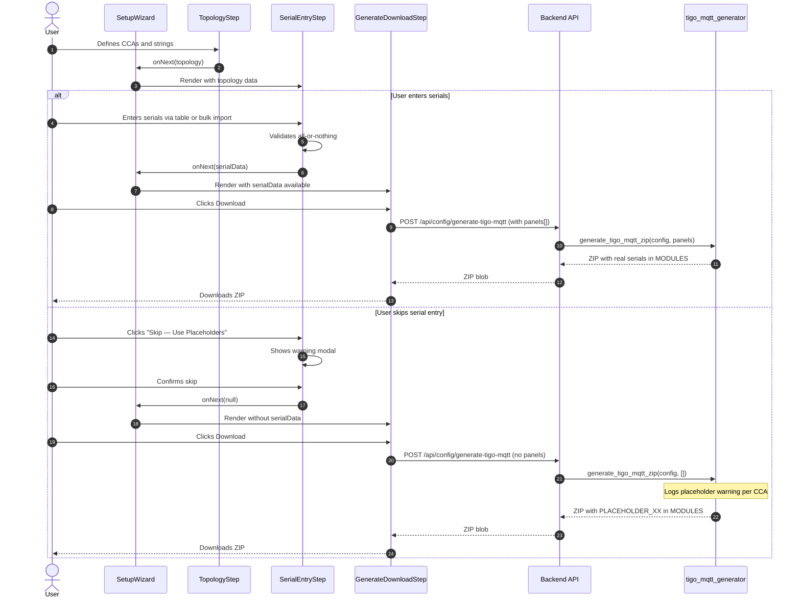

# Wizard Serial Number Entry Step

Add an optional serial number entry step to the setup wizard between the System Topology step and the Generate & Download step. This allows users to enter panel serial numbers directly in the wizard so the generated config files are immediately deployable without manual editing.

## Motivation

Currently, the setup wizard generates config files with `PLACEHOLDER_XX` values in the `MODULES` line of each CCA's INI config. Users must then manually open the INI files and replace every placeholder with real serial numbers before deployment. This is error-prone (easy to misalign serials with positions) and creates friction in the setup experience.

By allowing serial entry in the wizard, users who have their serial numbers available can produce a fully functional config on first download, eliminating the manual editing step entirely.

## Functional Requirements

### FR-1: Serial Entry Step

**FR-1.1:** A new wizard step "Panel Serials" SHALL be inserted between "System Topology" (step 2) and "Generate & Download" (previously step 3, now step 4), making it step 3 of 7 (index 2 in the zero-indexed `STEP_ORDER` array). All subsequent steps shift by one: Generate & Download becomes step 4, Discovery becomes step 5, Validation becomes step 6, and Review & Save becomes step 7. No hardcoded step indices are used — all step navigation is driven by `STEP_ORDER` array lookups. The Backup & Restore spec's `RESTORE_SKIP_STEPS`, step indicator filtering, and `goNext`/`goBack` skip logic (FR-5.3 of that spec) must also be updated to account for 3 skipped steps instead of 2.

**FR-1.2:** The step SHALL display a heading "Panel Serial Numbers" with explanatory text: "Enter the serial numbers for each panel. These are printed on the back of each Tigo optimizer. Serials are typically 8-10 characters (minimum 4, maximum 20) and may contain letters and numbers."

**FR-1.3:** The step SHALL be optional — the user MAY skip it via a "Skip — Use Placeholders" button. If skipped, the existing placeholder behavior is preserved.

**FR-1.4:** The "Next" button label SHALL read "Next: Generate & Download" and SHALL be enabled only when every serial field has status "valid" (per FR-2.4) and no duplicates exist (per FR-2.6). When no serials are entered, the "Next" button SHALL be disabled — users must use the "Skip — Use Placeholders" button to proceed without serials.

### FR-2: Table Entry UI

**FR-2.1:** Panels SHALL be organized by CCA, then by string. Each CCA SHALL be rendered as a card (matching the topology step's card style). Within each CCA card, each string SHALL display as a labeled section.

**FR-2.2:** Each string section SHALL render a table with columns:
- **Position** — read-only, showing the label (e.g., "A1", "A2")
- **Serial Number** — editable text input field

**FR-2.3:** Serial number inputs SHALL accept alphanumeric characters. Lowercase letters SHALL be accepted as input and auto-uppercased on every keystroke via a controlled input pattern (`onChange` handler applies `.toUpperCase()` before setting state). The `input` element SHALL additionally have `style={{ textTransform: 'uppercase' }}` as a CSS-level visual hint so the field always appears uppercase even before the React re-render. The stored and validated value contains only uppercase letters and digits. Maximum length SHALL be 20 characters (`maxLength={20}`). **Note:** The HTML `maxLength` attribute silently truncates pasted values longer than 20 characters with no visual indication. A user pasting a 25-character string will see only the first 20 characters, and the truncated value may still pass validation while representing the wrong serial. This contrasts with the bulk import path, which catches too-long values with an explicit error message. This is accepted as a standard browser behavior — adding a truncation indicator is not required but MAY be implemented as a UX enhancement. The validation regex applied after uppercasing is: `const SERIAL_PATTERN = /^[A-Z0-9]{4,20}$/;` — this pattern is applied only to non-empty values; empty fields are handled by the all-or-nothing logic (FR-4).

**Paste behavior note:** React's `onChange` fires for clipboard paste events in controlled inputs, so the `.toUpperCase()` conversion applies automatically to pasted text. No separate `onPaste` handler is needed. The `textTransform: 'uppercase'` CSS ensures the field displays as uppercase even during the brief window before React re-renders with the uppercased value.

**Security note:** The backend `generate_ini_config` function SHOULD validate that panel serials match `r'^[A-Z0-9]{4,20}$'` (mirroring the frontend's `SERIAL_PATTERN`) before writing to INI, as a defense-in-depth measure against client-side validation bypass. Serial numbers are written into the `MODULES` line of the INI config; INI metacharacters (`;`, `=`, `[`, `]`, newlines) could corrupt the file if not validated server-side.

**FR-2.4:** Serial number inputs SHALL validate that the value is non-empty and at least 4 characters long when filled. Format and length validation SHALL trigger on blur (when the field loses focus) and on Next button press. While the user is actively typing, no min-length or format errors SHALL be shown — only the `maxLength` attribute constrains live input. Fields that have never been focused and blurred SHALL NOT show format/length validation errors. **Exception:** Duplicate detection (FR-2.6) runs on every keystroke as an exception to the blur-only rule, providing immediate feedback when a serial matches another field's value.

**"Entered" definition:** A field is considered "entered" for FR-4.1/FR-4.3 purposes when its value is non-empty (length > 0), independent of blur state or validation status. This means typing even a single character into a field blocks the Skip button immediately, without requiring blur.

A serial field has three states:
- **Empty** (0 characters): Counts as "not entered" for FR-4.1/FR-4.2 all-or-nothing tracking. No validation error shown.
- **Incomplete** (1-3 characters after blur): Shows inline validation error. Counts as "entered" for FR-4.1 (blocks skip).
- **Valid** (4-20 alphanumeric characters after uppercase): No error. Counts as "entered."

Invalid entries SHALL show inline validation with a red border, an error icon (visible indicator beyond color alone per WCAG SC 1.4.1), and specific error message text:
- Too short: "Serial must be at least 4 characters"
- Non-alphanumeric: "Only letters and numbers allowed"
- Duplicate: See FR-2.6 for duplicate-specific message format

**FR-2.5:** The table SHALL show a per-string completion count (e.g., "3 of 8 entered"). Note: the count uses the "entered" definition from FR-2.4 (any non-empty value), so fields with too-short or invalid values still count toward "entered." This means "8 of 8 entered" can display while the Next button is disabled due to validation errors. This is intentional — the completion count tracks data entry progress, not validity. The status banner (FR-4.2) and inline field errors provide the validation feedback.

**FR-2.6:** Serial numbers MUST be unique across all panels globally (not just within a single CCA or string). Duplicate detection SHALL be case-insensitive (all comparisons performed on uppercased values), ensuring consistent behavior regardless of when uppercasing occurs in the pipeline.

When a duplicate is detected, **all** fields with the same serial SHALL show a validation error. For pairwise duplicates, the message for each field SHALL reference the other label. When the duplicate is within the same CCA, the simple label suffices: "Duplicate — also entered for A3". When the duplicate is in a different CCA, the label SHALL be CCA-qualified: "Duplicate — also entered for primary/A3". For three-way or higher duplicates (3+ fields with the same serial), the message SHALL list all other occurrences: "Duplicate — also entered for A1, primary/B2" (mixing short and CCA-qualified labels as appropriate). When any field is changed to resolve a duplicate, the errors on the remaining fields SHALL be immediately re-evaluated — if only one field remains with that serial, its duplicate error SHALL be cleared.

The "Next" button SHALL be disabled while any duplicates exist.

**Implementation:** Global duplicate detection SHALL use a `Map<string, string[]>` (uppercased serial to array of CCA-qualified labels, e.g., `"12345678" -> ["primary/A1", "primary/A3", "secondary/B2"]`) built once on step mount and updated incrementally on each input change. Lookup is O(1) per field change. **Implementation note:** The duplicate map update SHOULD use React's functional state updater pattern (`setDupMap(prev => ...)`) or a ref-based approach to prevent stale-closure issues under rapid input. Since React 18+ batches all state updates (including event handlers), two `onChange` events in the same microtask could both read stale map state if using a direct closure reference. When rendering the error message for a given field, filter out the current field's own label from the array. The display logic strips the CCA prefix when both the current field and the referenced field are in the same CCA (e.g., "primary/A3" renders as "A3" if the current field is also in "primary"). The map SHALL be rebuilt when bulk import populates values.

### FR-3: Bulk Import

**FR-3.1:** Below each CCA card's table UI, a collapsible section labeled "Bulk Import" SHALL be available. The section SHALL be collapsed by default to reduce visual clutter. When expanded, it SHALL show a textarea and an "Import" button.

**FR-3.2:** The textarea SHALL accept serial numbers in CSV format (comma-separated), TSV format (tab-separated, for spreadsheet paste), or newline-separated values. The parser SHALL use a combined split approach: split on any delimiter character (tabs, commas, or newlines) in a single pass using the regex `/[\t,\r\n]+/`, then trim and filter empty values. The `+` quantifier means consecutive delimiters are collapsed into one — e.g., `SER1,,SER3` produces 2 values, not 3 with a blank in between. This handles the common "paste from spreadsheet grid" case where input contains both row separators (newlines) and column separators (tabs or commas). Bare `\r` (old Mac line endings) is also handled by the character class. Serial numbers are alphanumeric-only (per FR-2.3), so they cannot contain delimiter characters. Semicolons are intentionally excluded as delimiters — European-locale CSVs using semicolons as separators will produce concatenated values (e.g., "SER001;SER002") that fail the alphanumeric check. Quoted fields with internal delimiters (e.g., `"123,456"`) are NOT supported — the comma inside quotes will be treated as a delimiter. The help text in the bulk import UI SHALL state: "Paste serial numbers separated by commas, tabs, or newlines (one per line). Empty entries between delimiters are ignored — ensure every slot has a value."

**FR-3.3:** On clicking "Import", the system SHALL first check if the textarea is empty or contains only whitespace. If so, show: "Please paste or type serial numbers before importing." This check occurs before any delimiter detection or parsing. Additionally, if the textarea has content but produces zero values after splitting and filtering (e.g., input consisting entirely of delimiter characters like `",,,\n\t\t,"`), the same "Please paste or type serial numbers before importing" message SHALL be shown instead of a confusing count-mismatch error.

If the textarea has content, the system SHALL parse the input and validate:
- Empty lines at the end of the input SHALL be trimmed before parsing (to handle trailing newlines from copy-paste).
- The number of parsed values MUST exactly match the total panel count for that CCA (sum of all string panel counts). If the count does not match, the import SHALL fail with an error message: "Expected {expected} serial numbers for CCA '{name}', but found {actual}. Please check your input — every panel must have exactly one serial number."
- All validation errors (blanks, non-alphanumeric, too short, too long) SHALL be collected and reported together rather than fail-fast on the first error. The combined error message SHALL list all issues: "{N} invalid entries found:" followed by each error (e.g., "Position 3: blank entry", "Position 7: 'AB@C' is not alphanumeric", "Position 12: too short (2 chars)"). Error values displayed in messages SHALL be truncated to 30 characters with an ellipsis to prevent UI-breaking input.
- The bulk import textarea SHALL have a `maxLength={10000}` attribute to prevent excessively large pastes.
- The Import button SHALL remain disabled from click until the entire import pipeline completes (parse, validate, confirm if needed, populate) or the user cancels. A spinner MAY be shown during parsing. For imports completing under 100ms, the loading state may be imperceptible, which is acceptable. This prevents double-click race conditions — a second click during parsing or during the overwrite confirmation dialog is blocked by the disabled state.

**FR-3.4:** On successful bulk import, the parsed serials SHALL immediately populate the table view above in order: filling string A positions first (A1, A2, ...), then string B positions, etc., following the string order defined in topology. After populating, the global duplicate detection (FR-2.6) SHALL run across all panels (including other CCAs already filled). Any duplicates introduced by the import will be shown as inline validation errors in the table.

Additionally, `parseBulkSerials` SHALL check for duplicates within the imported batch itself before returning success. Duplicate checking is a separate phase that runs after format validation (on the uppercased values). Consistent with the aggregate-errors philosophy of FR-3.3, **all** duplicate groups SHALL be collected and reported together rather than failing on the first pair. For example, if serial "ABCD1234" appears at positions 2, 5, and 7, and serial "WXYZ9999" appears at positions 3 and 8, the error SHALL report: "Duplicate serial 'ABCD1234' found at positions 2, 5, and 7. Duplicate serial 'WXYZ9999' found at positions 3 and 8." If there are both format errors (from the earlier validation phase) and duplicates, the format errors are returned first — duplicates are only checked on format-valid input.

**FR-3.5:** The bulk import pipeline order SHALL be: parse → validate (format + duplicates) → confirm overwrite (if needed) → populate. If a bulk import would overwrite existing non-empty serial values for the CCA, a confirmation SHALL be shown **after** all validation passes: "This will replace {n} existing serial numbers for CCA '{name}'. Continue?" with "Replace" (primary) and "Cancel" (secondary) buttons. Showing confirmation only for valid input avoids wasting the user's confirmation on data that would fail validation anyway. If the user clicks "Cancel", existing values are preserved unchanged. If no existing values are populated (all fields empty), no confirmation is needed. This protects against accidental loss of manually-entered data, since there is no undo mechanism.

**FR-3.6:** A successful bulk import SHALL collapse the bulk import section and show a brief success message (e.g., "Imported 24 serial numbers"). After collapse, focus SHALL move to the first serial input field of the CCA card (since the Import button inside the collapsed section is no longer in the DOM). Since the success message uses `role="status"` (polite), the focus change announcement ("Serial number for panel A1") takes priority, and the success message is queued — avoiding the disorienting rapid-fire announcements that would occur with `role="alert"` (assertive) plus a simultaneous focus change. If the import passed all count/format validation but introduced cross-CCA duplicates detected by global duplicate detection (FR-2.6), the bulk import section SHALL NOT collapse. Instead, display a warning: "Imported {n} serial numbers. {d} duplicates detected with other CCAs — see highlighted fields above." After bulk import triggers global duplicate detection, all CCA cards SHALL re-evaluate their fields against the updated duplicate map, highlighting newly-detected cross-CCA duplicates in previously-valid fields. Focus SHALL move to the first serial input field of the CCA card (same as the success path), since the user needs to review the highlighted duplicate fields in the table above. The pure success message (no duplicates) SHALL use `role="status"` (polite announcement — lower urgency). The warning variant that includes duplicate information SHALL use `role="alert"` (assertive announcement — warrants interruption).

**FR-3.7:** Each parsed value from bulk import SHALL be validated against the same format rules as manual entry: alphanumeric only (FR-2.3), at least 4 characters (FR-2.4), maximum 20 characters (FR-2.3). Surrounding double-quote characters SHALL be stripped iteratively before validation: `while (v.startsWith('"') && v.endsWith('"') && v.length >= 2) v = v.slice(1, -1);`. This handles both single-quoted (`"SER001"`) and double-quoted (`""SER001""`) spreadsheet exports. Only double-quote (`"`) stripping is supported — single quotes (`'`) are treated as literal characters and will fail the alphanumeric validation (e.g., `'SER001'` is rejected). Partial or mismatched double quotes (e.g., `"SER001` without closing quote) are also treated as literal characters and will fail the alphanumeric validation. Note that quote stripping can produce confusing error values in edge cases: input `"""SER001"` strips to `""SER001` which fails alphanumeric validation with the stripped form shown in the error — this is accepted as a rare edge case. Values failing format validation SHALL be included in the aggregated error report (per FR-3.3). Error messages SHALL render as React text nodes (not `dangerouslySetInnerHTML`) to prevent XSS.

### FR-4: All-or-Nothing Validation

**FR-4.1:** Serial entry SHALL be all-or-nothing globally. Either every panel across all CCAs has a serial entered, or no panels have serials (skip entirely).

If the topology defines zero total panels (all CCAs have zero strings or all strings have zero panels), the Serial Entry step SHALL be automatically skipped — the wizard proceeds directly from Topology to Generate & Download. The step SHALL NOT be rendered in this case. **Implementation location:** The zero-panel check SHALL be performed in `SetupWizard`'s step navigation logic (in `goNext` from topology), not inside `SerialEntryStep`. This avoids a render-then-redirect flash and potential re-render loops.

In the mixed case where some CCAs have panels and others have zero panels (e.g., CCA "primary" has 24 panels, CCA "secondary" has 0 panels), the total is non-zero so the step renders. CCA cards with zero total panels across all their strings SHALL NOT be rendered in the Serial Entry step UI — they contribute nothing to the serial entry workflow and would display as confusing empty cards. The bulk import section is also hidden for zero-panel CCAs.

Similarly, within a CCA card, string sections with `panel_count === 0` SHALL NOT be rendered. For example, if CCA "primary" has string A with 8 panels and string B with 0 panels, only string A's table is shown. The bulk import expected count for this CCA is 8 (not 16) — only non-zero strings contribute to the count. The inner loop in `serialEntriesToPanels` (`for (let i = 1; i <= str.panel_count; i++)`) correctly produces zero iterations for zero-count strings, so no panels are created for them.

If the user navigates back and returns to the Serial Entry step with partial data, the state is preserved. The user must either complete all serials, or click "Clear All" before they can skip.

**FR-4.2:** When the step is in a partial-fill state (some but not all panels have serials entered), a persistent inline status banner SHALL be displayed: "Serial numbers must be entered for all {total} panels, or skipped entirely. Currently {entered} of {total} entered." This banner is informational (not error-gated on a button click) since the Next button is already disabled (FR-1.4) and the Skip button is already disabled (FR-4.3) in this state. The banner helps the user understand why neither action is available.

**FR-4.3:** The "Skip — Use Placeholders" button SHALL be disabled if any serials have been entered. A static helper text SHALL appear below the disabled Skip button: "Clear all entered serials to use placeholder mode." This text SHALL be associated with the button via `aria-describedby`.

**FR-4.4:** A "Clear All" button SHALL be provided at the top of the Serial Entry step (after the heading and before the first CCA card) to reset all serial fields across all CCAs, re-enabling the skip option. The button SHALL have `aria-label="Clear all serial numbers for all CCAs"`. Clicking it SHALL show a confirmation dialog: "Clear all {n} entered serial numbers? This cannot be undone." with "Clear All" (destructive, red) and "Cancel" buttons. The confirmation dialog SHALL have `aria-labelledby` referencing its heading text (or `aria-label="Confirm clear all serial numbers"` if no heading element is used). The confirmation modal SHALL trap focus and be dismissible via Escape (equivalent to Cancel). After confirming Clear All, focus SHALL return to the Clear All button (standard modal return-focus pattern). Clear All SHALL also collapse any expanded bulk import sections, resetting the step to its initial visual state. There is no undo mechanism for this action. **State scope:** Clear All SHALL reset all serial fields in the local component state only. The wizard-level `serialEntries` is only updated when the user subsequently clicks Skip (`onNext(null)`) or Next (`onNext(serials)`). This means Clear All does not directly mutate wizard state — it clears the component's working copy. If the user navigates away without clicking Skip or Next (e.g., via the Back button), the wizard state retains the previous `serialEntries` value from the last `onNext` call. This is consistent with the existing pattern where wizard state is committed on step transitions, not on every field change. **Note:** The "cannot be undone" warning is intentionally asymmetric with the skip confirmation (FR-5.1) which has no such warning — skipping preserves serial data in wizard state (FR-7.4), allowing the user to navigate back and find their serials intact, whereas Clear All permanently destroys the component's entered data.

### FR-5: Skip Warning

**FR-5.1:** When the user clicks "Skip — Use Placeholders", a confirmation modal SHALL appear with:
- **Title:** "Config Will Require Manual Editing"
- **Body:** "The downloaded config files will contain placeholder serial numbers (PLACEHOLDER_A1, PLACEHOLDER_A2, etc.) instead of real panel serials. You will need to manually edit each config-\<name\>.ini file to replace placeholders with actual serial numbers before the system will function correctly." (The `<name>` is a generic pattern showing the CCA name substitution, not a template variable — it is rendered as static text.)
- **Buttons:** "Continue with Placeholders" (primary) and "Go Back" (secondary)
- **Dismiss behavior:** Pressing Escape or clicking outside the modal SHALL dismiss it (equivalent to "Go Back"). The modal SHALL use a semi-transparent backdrop overlay and trap focus per NFR-1.5.

**FR-5.2:** If the user confirms the skip, the wizard SHALL call `onNext(null)`, which sets `serialEntries = null` in wizard state (clearing any partial data) and advances to the Generate & Download step. This triggers `invalidateDownstream` for the `panel-serials` step, which clears `configDownloaded` and downstream state. The Generate & Download step sees `serialEntries === null` and uses the existing placeholder behavior.

### FR-6: Placeholder Logging

**FR-6.1:** The log SHALL be emitted in the existing `except TigoMQTTGeneratorError` handler in `generate_tigo_mqtt_zip` when `generate_ini_config` fails due to missing panel data for a CCA. The replacement log message SHALL only apply when the exception is the "no panels configured" case (the original placeholder path). If the exception is from the defense-in-depth validation (e.g., "Invalid serial format"), the original exception message SHALL be preserved in the log to avoid misleading "placeholder serials" messaging for a validation failure. The warning-level message for the placeholder case SHALL be: `logger.warning("Generated tigo-mqtt config with placeholder serials for CCA '%s'. Config requires manual serial number entry before deployment.", cca_name)`. This uses the `tigo_mqtt_generator` module logger and %-style formatting for structured logging compatibility.

**FR-6.2:** This log message SHALL be emitted once per CCA that uses placeholders.

### FR-7: State Management

**FR-7.1:** Serial number entries SHALL be stored in the wizard state and persisted to localStorage alongside existing wizard state.

**FR-7.2:** The serial data SHALL be stored as a `Record<string, string>` mapping panel labels (e.g., "A1", "B3") to serial numbers, namespaced by CCA name. The structure SHALL be: `Record<string, Record<string, string>>` where the outer key is CCA name and inner key is panel label. `Record` (plain object) is used intentionally rather than `Map<string, T>` because `Map` does not serialize with `JSON.stringify()` — a known project pitfall.

**Precondition:** CCA names MUST be unique, as enforced by the System Topology step's validation. This uniqueness guarantee is relied upon for the serial data key structure. CCA name comparison is case-sensitive (the topology step stores names as-entered).

**FR-7.3:** If the user navigates back to the Topology step and clicks Next (submitting the step), the existing `invalidateDownstream` mechanism clears all downstream step state, including `serialEntries`. The explicit `serialEntries = null` in the invalidation code is shown for clarity but is handled automatically by the downstream cascade. The `invalidateDownstream` mechanism fires on any forward navigation from an earlier step, regardless of whether data actually changed. This is a known UX tradeoff: navigating back to topology and proceeding will clear all entered serial numbers even if no topology changes were made. Users should finalize topology before entering serial numbers.

**Note:** This is intentionally unconditional (no shallow comparison of topology data). Implementing change detection would add complexity for a marginal UX improvement. This tradeoff is acceptable because the serial entry step supports bulk import, making re-entry faster.

**FR-7.4:** If the user navigates back to the Serial Entry step after having previously filled it, the previously entered values SHALL be preserved (unless invalidated by topology changes per FR-7.3).

### FR-8: Integration with Config Generation

**FR-8.1:** When serial numbers are provided, the Generate & Download step SHALL pass them as `Panel` objects to the `downloadTigoMqttConfig` API call. Each panel SHALL be constructed as:
```typescript
{
  serial: enteredSerial,
  cca: ccaName,
  string: stringName,       // Short identifier, e.g., "A" — NOT a display name
  tigo_label: label,        // e.g., "A1" — constructed as `${str.name}${i}`
  display_label: label,     // Same as tigo_label (no translation needed)
  // position is OMITTED — it is Optional in both the TS type and Pydantic model
}
```

**Important:** The `string` field value comes from `StringConfig.name` in the topology data, which is a short identifier (e.g., "A", "B"), not a display name. The `tigo_label` is constructed as `${str.name}${i}` (e.g., "A1", "A2"). Verify that `StringConfig.name` in `types/config.ts` matches this assumption. See the `SystemConfig` cross-reference in Component Architecture for the type shape.

**Precondition:** `StringConfig.name` MUST be constrained to single uppercase letters (A-Z) by the Topology step's validation. This constrains each CCA to a maximum of 26 strings (A-Z), which exceeds any practical solar deployment. This is required to prevent label collisions: if string names could be multi-character or numeric (e.g., "A1"), labels would be ambiguous ("A1" + panel 2 = "A12" vs "A" + panel 12 = "A12"), corrupting the `serialEntries` map. If the Topology step does not currently enforce this constraint, it MUST be added as part of this feature's implementation. The `serialEntriesToPanels` function SHALL include a defensive check: `if (!/^[A-Z]$/.test(str.name)) throw new Error(...)` to guard against malformed topology data.

**Note on field naming:** The HTTP request body uses camelCase keys (`tigoLabel`, `displayLabel`) due to the Pydantic model's `alias_generator=to_camel` configuration. The TypeScript API layer handles this conversion. The snake_case names shown above are the logical field names used in the `serialEntriesToPanels` code sample. The API client function (`downloadTigoMqttConfig`) is responsible for converting these to the camelCase wire format before sending the HTTP request.

**TypeScript `Panel` interface** (relevant subset from `types/config.ts`):
```typescript
interface Panel {
  serial: string;
  cca: string;
  string: string;
  tigo_label: string;      // snake_case in TS; API layer converts to tigoLabel for HTTP
  display_label: string;    // snake_case in TS; API layer converts to displayLabel for HTTP
  position?: Position | null;
}
```

**FR-8.2:** When panels are provided to the backend, the existing `generate_ini_config` function SHALL be used (not `generate_placeholder_ini`), producing a fully functional `MODULES` line with real serial numbers.

**FR-8.3:** The generated INI SHALL NOT contain the placeholder comment header ("NOTE: This is a PLACEHOLDER configuration.") when real serials are provided.

**FR-8.4:** If the config generation API returns an error, the error SHALL be handled based on type:
- **Network errors / HTTP 5xx:** Display "Download failed. Please try again." with a "Retry Download" button.
- **HTTP 422 validation errors:** This endpoint uses custom `HTTPException(status_code=422, detail="...")` responses (not Pydantic schema validation errors), so the format is `{"detail": "string"}`. Display the backend error message and show a "Go Back to Fix" button that navigates to the Serial Entry step. Note: Pydantic schema validation errors (which use `{"detail": [...]}` array format) are not expected from this endpoint since the request schema is simple, but the frontend SHOULD handle both formats gracefully (display `detail` if string, display first error message if array).
- **Other HTTP errors (400, 404, etc.):** Display the error status and message with a "Retry Download" button.

All API error messages displayed in the Generate step SHALL be rendered as React text nodes (not `dangerouslySetInnerHTML`), consistent with FR-3.7's requirement for bulk import errors. Backend error messages containing panel serial values SHALL be truncated to 30 characters in the backend `raise` statement to prevent excessively long error messages.

In all cases, serial data SHALL be preserved in wizard state so the user can navigate back to the Serial Entry step to correct issues without re-entering all serials.

### FR-9: Step Indicator Updates

**FR-9.1:** The `WizardStepIndicator` component SHALL be updated to display the new step. The step sequence SHALL be: MQTT Config → System Topology → Panel Serials → Generate & Download → Discovery → Validation → Review & Save.

**FR-9.2:** The step names in the indicator SHALL use short labels for space efficiency. The new step SHALL be labeled "Panel Serials" (the step heading per FR-1.2 uses the full "Panel Serial Numbers"). The `WizardStepIndicator` SHALL accommodate 7 steps without horizontal overflow or label truncation at viewport widths >= 768px. On narrower viewports, the indicator MAY use abbreviated labels or a horizontally scrollable container.

### FR-10: Keyboard Behavior

**FR-10.1:** Enter key in a serial **number input** field (not the bulk import textarea) SHALL advance focus to the next serial input field (same behavior as Tab). In the last serial input field of the entire step (i.e., the last panel of the last string of the last CCA), Enter SHALL advance focus to the Next button. This is consistent with the Enter-to-advance pattern used throughout the serial fields, and the Next button's validation gate (FR-1.4) prevents accidental submission. Enter SHALL NOT trigger form submission in any serial input field. Implementation: use `event.preventDefault()` in the `onKeyDown` handler when `event.key === 'Enter'`, then programmatically focus the next input (or the Next button if this is the last field). Modifier combinations (Shift+Enter, Ctrl+Enter, Meta+Enter) SHALL NOT be intercepted — they SHALL propagate with default browser behavior.

## Non-Functional Requirements

**NFR-1.1:** The serial entry step SHALL handle up to 100 panels per CCA with input latency under 100ms when typing in any serial field. This is a performance target, not a hard limit — the UI does not enforce a maximum panel count, but performance may degrade beyond 100 panels per CCA. Input latency is defined as the React render cycle time from `onChange` to paint — the component re-render triggered by a serial field change SHALL complete in under 100ms with 100 panels mounted, as measured by React DevTools Profiler on a mid-range device (4-core CPU).

**Implementation constraint:** The serial entry component SHALL NOT trigger re-renders of all input fields when a single field changes. Each serial input row SHALL be memoized (`React.memo`) to prevent O(n) re-renders. The duplicate detection map (FR-2.6) enables O(1) lookups per keystroke.

**NFR-1.2:** Bulk import parsing SHALL complete in under 100ms for up to 200 serial numbers.

**NFR-1.3:** The serial entry UI SHALL follow the same visual style (inline CSSProperties objects, same color palette, card layout) as the existing Topology and Generate steps.

**NFR-1.4:** The serial entry step state SHALL be included in the 7-day localStorage persistence. The 50KB storage estimate is for planning purposes only — no runtime enforcement is needed. At ~50 bytes per panel entry (key + value + JSON overhead), 50KB supports approximately 1,000 panels, which far exceeds any real-world deployment. The practical upper bound is constrained by the topology step (which limits CCA and string count). If localStorage persistence fails (quota exceeded, private browsing, or disabled), the existing silent-failure behavior (console warning) is acceptable. Serial data will still be available in the current session's memory but will not survive page reload.

**NFR-1.5:** Accessibility requirements:

- **Input labels:** Serial number input fields SHALL have `aria-label` attributes in the format "Serial number for panel {label}" (e.g., "Serial number for panel A1").
- **Error state:** Serial input fields in an error state SHALL have `aria-invalid="true"` (WCAG SC 4.1.2). This attribute SHALL be removed when the error is resolved.
- **Error association:** Validation error messages SHALL use `aria-describedby` to associate errors with their input fields. When a field with a validation error receives focus, the error SHALL be announced by screen readers.
- **WCAG contrast:** Validation error text and error indicators (borders, icons) SHALL meet WCAG AA contrast ratios (4.5:1 for text, 3:1 for UI components such as error borders and icons).
- **Keyboard navigation:** Serial input fields SHALL be focusable in DOM order (A1, A2, ... per string, then next string within the CCA card). Tab order SHALL follow the visual layout. Standard Tab/Shift+Tab navigation between fields is sufficient. Enter key behavior is specified in FR-10.1. The bulk import collapsible section SHALL be operable via keyboard: the collapse trigger SHALL be focusable and toggleable via Enter/Space, and the textarea and Import button SHALL be reachable via Tab.
- **Error announcements:** Duplicate detection errors (FR-2.6) that appear asynchronously SHALL use `aria-live="polite"` to announce to screen readers. Bulk import success and error messages SHALL use `role="alert"` for immediate announcement.
- **Modals:** The skip confirmation modal (FR-5.1) and Clear All confirmation (FR-4.4) SHALL trap focus and be dismissible via Escape key.
- **Bulk import:** The bulk import textarea SHALL have an `aria-label` of "Paste serial numbers for CCA {name}". The bulk import section SHALL be collapsed by default to reduce visual clutter.
- **Status banner:** The partial-fill status banner (FR-4.2) SHALL use `role="status"` for screen reader awareness.
- **Initial focus:** On step entry (navigating to the Serial Entry step from Topology via Next), focus SHALL move to the step heading element ("Panel Serial Numbers"), which SHALL have `tabIndex={-1}` to be programmatically focusable. This ensures screen reader users hear the step context before interacting with input fields. This is the standard wizard step-entry pattern.

## High Level Design

**Note:** This diagram shows the two primary happy paths (enter serials, skip serials). Additional flows — Clear All (FR-4.4), back-navigation with invalidation (FR-7.3), and error handling (FR-8.4) — are specified in their respective requirement sections but not diagrammed here for clarity.



### Component Architecture

The new step is a single React component `SerialEntryStep` that receives topology data and outputs serial number mappings.

**State shape in wizard:**
```typescript
// Added to WizardState
serialEntries: Record<string, Record<string, string>> | null;
// Example:
// {
//   "primary": { "A1": "12345678", "A2": "23456789", "B1": "34567890" },
//   "secondary": { "A1": "45678901", "A2": "56789012" }
// }
```

**SerialEntryStep component props:**
```typescript
interface SerialEntryStepProps {
  topology: SystemConfig;  // See SystemConfig type in types/config.ts (Phase 1 spec)
  serialEntries: Record<string, Record<string, string>> | null;
  onNext: (serials: Record<string, Record<string, string>> | null) => void;
  onBack: () => void;
}
```

**Bulk import parsing logic:**
```typescript
function parseBulkSerials(input: string, expectedCount: number, ccaName: string):
  { serials: string[] } | { error: string } {
  // 0. Empty input check
  if (!input.trim()) {
    return { error: 'Please paste or type serial numbers before importing.' };
  }

  // 1. Trim trailing empty lines
  const trimmed = input.replace(/[\r\n]+$/, '');

  // 2. Combined split: handle any mix of tabs, commas, and newlines.
  //    The + quantifier collapses consecutive delimiters (e.g., ",," → one split).
  let values = trimmed.split(/[\t,\r\n]+/).map(v => v.trim()).filter(v => v !== '');

  // 2.5. If splitting produced zero values (input was all delimiters), treat as empty
  if (values.length === 0) {
    return { error: 'Please paste or type serial numbers before importing.' };
  }

  // 3. Strip surrounding quotes iteratively (handles double-quoted spreadsheet exports).
  //    Note: this can produce empty strings from values like '""' — these are intentionally
  //    NOT filtered here so they count toward the expected count and are caught as
  //    "blank entry" errors in step 6.
  values = values.map(v => {
    while (v.startsWith('"') && v.endsWith('"') && v.length >= 2) {
      v = v.slice(1, -1);
    }
    return v;
  });

  // 4. Uppercase all values BEFORE validation, so all subsequent steps operate on
  //    normalized values and we can use the canonical SERIAL_PATTERN regex.
  values = values.map(v => v.toUpperCase());

  // 5. Validate count (must match exactly — prevents off-by-one errors)
  if (values.length !== expectedCount) {
    return {
      error: `Expected ${expectedCount} serial numbers for CCA '${ccaName}', but found ${values.length}. Please check your input — every panel must have exactly one serial number.`
    };
  }

  // 6. Collect ALL validation errors (blanks, format, length) — not fail-fast.
  //    Since values are already uppercased (step 4), we use /^[A-Z0-9]+$/ here
  //    (consistent with SERIAL_PATTERN from FR-2.3, minus length which is checked separately
  //    to provide specific error messages for too-short vs too-long).
  const errors: string[] = [];
  values.forEach((v, i) => {
    if (v === '') {
      // Reachable: quote stripping in step 3 can produce empty strings (e.g., '""' → '')
      errors.push(`Position ${i + 1}: blank entry`);
    } else if (!/^[A-Z0-9]+$/.test(v)) {
      const display = v.length > 30 ? v.substring(0, 30) + '...' : v;
      errors.push(`Position ${i + 1}: '${display}' is not alphanumeric`);
    } else if (v.length < 4) {
      errors.push(`Position ${i + 1}: too short (${v.length} chars)`);
    } else if (v.length > 20) {
      errors.push(`Position ${i + 1}: too long (${v.length} chars)`);
    }
  });
  if (errors.length > 0) {
    return { error: `${errors.length} invalid ${errors.length === 1 ? 'entry' : 'entries'} found:\n${errors.join('\n')}` };
  }

  // 7. Check for duplicates within the batch — collect ALL duplicates (not fail-fast).
  //    Note: this is a within-batch index map (serial → list of positions), distinct from
  //    the global Map<string, string[]> in FR-2.6 which maps serial → list of CCA-qualified labels.
  const seen = new Map<string, number[]>();
  for (let i = 0; i < values.length; i++) {
    const positions = seen.get(values[i]);
    if (positions) {
      positions.push(i + 1);
    } else {
      seen.set(values[i], [i + 1]);
    }
  }
  const dupErrors: string[] = [];
  for (const [serial, positions] of seen) {
    if (positions.length > 1) {
      const posStr = positions.length === 2
        ? positions.join(' and ')
        : positions.slice(0, -1).join(', ') + ', and ' + positions[positions.length - 1];
      dupErrors.push(`Duplicate serial '${serial}' found at positions ${posStr}.`);
    }
  }
  if (dupErrors.length > 0) {
    return { error: dupErrors.join('\n') };
  }

  return { serials: values };
}
```

**Panel construction for API call (in GenerateDownloadStep):**
```typescript
function serialEntriesToPanels(
  serials: Record<string, Record<string, string>>,
  topology: SystemConfig
): Panel[] {
  const panels: Panel[] = [];
  for (const cca of topology.ccas) {
    const ccaSerials = serials[cca.name] || {};
    for (const str of cca.strings) {
      // Defensive check: str.name must be a single uppercase letter (see FR-8.1 precondition)
      if (!str.name || !/^[A-Z]$/.test(str.name)) {
        throw new Error(
          `Invalid string name '${str.name}' in CCA ${cca.name}. ` +
          `String names must be single uppercase letters (A-Z).`
        );
      }
      for (let i = 1; i <= str.panel_count; i++) {
        const label = `${str.name}${i}`;
        const serial = ccaSerials[label];
        if (!serial) {
          throw new Error(
            `Missing serial for panel ${label} in CCA ${cca.name}. ` +
            `This indicates a validation bug — FR-4.1 should prevent partial data.`
          );
        }
        panels.push({
          serial,
          cca: cca.name,
          string: str.name,
          tigo_label: label,
          display_label: label,
        });
      }
    }
  }

  // Post-loop assertion: verify count matches topology
  const expectedCount = topology.ccas.reduce((sum, cca) =>
    sum + cca.strings.reduce((s, str) => s + str.panel_count, 0), 0);
  if (panels.length !== expectedCount) {
    throw new Error(
      `Panel count mismatch: expected ${expectedCount}, got ${panels.length}`
    );
  }

  return panels;
}

// NOTE: The throws in serialEntriesToPanels are development-time assertions that should
// never reach production (FR-4.1 prevents partial data). The call site in GenerateDownloadStep
// SHALL wrap this in a try/catch that displays a user-friendly error message:
// "An internal error occurred while preparing panel data. Please go back and verify your
// serial entries." This prevents the component from crashing on an unhandled exception.
```

**`SystemConfig` type reference:** The `topology` parameter uses `SystemConfig` defined in `types/config.ts` (from the Multi-User Config Phase 1 spec). The relevant subset used by this function:
```typescript
interface StringConfig {
  name: string;        // Short identifier, e.g., "A", "B" — NOT a display name
  panel_count: number;
}
interface CCAConfig {
  name: string;        // User-entered CCA name, e.g., "primary"
  serial_device: string;
  strings: StringConfig[];
}
interface SystemConfig {
  ccas: CCAConfig[];
}
```

**Note on field naming for SystemConfig types:** Unlike the `Panel` model which uses `alias_generator = to_camel`, the `SystemConfig`/`CCAConfig`/`StringConfig` types shown above use snake_case field names (`panel_count`, `serial_device`) as their canonical TypeScript representation. The existing Phase 1 implementation stores these as snake_case in both TypeScript and the Pydantic models. If the backend Pydantic models for these types also use `alias_generator = to_camel`, the HTTP wire format would use camelCase (`panelCount`, `serialDevice`), and the frontend API layer would need to handle the conversion. Verify the actual field naming convention used in the existing `types/config.ts` implementation before coding — the code sample above uses snake_case to match the logical field names used in `serialEntriesToPanels`, consistent with how `Panel` fields are documented (snake_case in TS, camelCase on wire).

**`Panel` type:** Uses the existing `Panel` interface from `types/config.ts`. The `position` field is `Optional` (`position?: Position | null`) so omitting it from the object literal is type-safe. Downstream steps (Discovery, Validation) handle `position: null` gracefully — they do not depend on position data from wizard-created panels.

### Wizard State Flow Changes

The `STEP_ORDER` array and `WizardStep` type must be updated. **Note:** `STEP_ORDER` is defined in two locations that must both be updated:

```typescript
// types/config.ts
export type WizardStep =
  | 'mqtt-config'
  | 'system-topology'
  | 'panel-serials'       // NEW
  | 'generate-download'
  | 'discovery'
  | 'validation'
  | 'review-save';

// useWizardState.ts — primary STEP_ORDER
const STEP_ORDER: WizardStep[] = [
  'mqtt-config',
  'system-topology',
  'panel-serials',          // NEW
  'generate-download',
  'discovery',
  'validation',
  'review-save',
];

// SetupWizard.tsx — duplicate STEP_ORDER inside handleGoNext()
// This inline array (used for restore-mode skip logic) MUST also include 'panel-serials'.
// Location: SetupWizard.tsx, handleGoNext callback (~line 183)
```

The invalidation logic in `invalidateDownstream` must clear `serialEntries` when topology changes, and clear download state when serials change:

```typescript
if (changedStep === 'system-topology' || changedStep === 'mqtt-config') {
  newState.serialEntries = null;  // NEW: clear serials when topology changes
  newState.configDownloaded = false;
  newState.discoveredPanels = {};
  newState.validationResults = null;
}

if (changedStep === 'panel-serials') {
  // invalidateDownstream automatically cascades to clear all downstream state:
  // configDownloaded, discoveredPanels, validationResults, etc.
  // The explicit assignment below documents the primary intent.
  newState.configDownloaded = false;  // Invalidate download since serials changed
}
```

**Note:** The `invalidateDownstream` mechanism clears ALL downstream step state automatically. The explicit `serialEntries = null` assignment above is shown for clarity — it is redundant with the cascade but documents the intent. Verify that `invalidateDownstream` includes `serialEntries` in the state fields it clears for the `system-topology` and `mqtt-config` branches.

### Restore-from-Backup Handling

The `panel-serials` step SHALL be added to `RESTORE_SKIP_STEPS` since backup restores already have panel data:

```typescript
const RESTORE_SKIP_STEPS: WizardStep[] = ['panel-serials', 'discovery', 'validation'];
```

**Assumption:** Backup restore assumes the INI files in the backup already contain the desired serial numbers (real or placeholder). During restore-from-backup, the serial entry step is skipped because the backup's panel data is used as-is. If the user needs to change serials after restore, they should run the wizard fresh rather than restoring from backup. Older backups created before this feature existed will not have `serialEntries` in wizard state — this is handled gracefully since `serialEntries` defaults to `null` and the step is skipped during restore regardless.

### Backend Changes

The backend requires minimal changes:

1. **Logging in `generate_tigo_mqtt_zip`:** The `except TigoMQTTGeneratorError` branch in `generate_tigo_mqtt_zip` (line 377) already has `logger.warning(f"Generating placeholder INI for {cca.name}: {e}")`. Replace this message with the user-friendly version specified in FR-6.1: `logger.warning("Generated tigo-mqtt config with placeholder serials for CCA '%s'. Config requires manual serial number entry before deployment.", cca_name)`. The original exception message (`{e}`) is the technical "CCA has no panels configured" message — the new message is more helpful for operators reviewing logs.

2. **Defense-in-depth validation:** Add a format and length check on panel serials in `generate_ini_config` (per FR-2.3 security note) that mirrors the frontend's `SERIAL_PATTERN`: `if not re.match(r'^[A-Z0-9]{4,20}$', panel.serial): raise TigoMQTTGeneratorError("Invalid serial format: %s" % (panel.serial[:30],))`. The regex enforces uppercase alphanumeric, 4-20 characters — matching the frontend validation. The serial value is truncated to 30 characters in the error message to prevent excessively long output. This uses %-style formatting for consistency with the module's logging conventions (per FR-6.1). This prevents INI file corruption if client-side validation is bypassed.

3. No API contract changes — the `GenerateConfigRequest` model already accepts optional `panels`, and the generator already handles both paths (panels present → `generate_ini_config`, panels absent → `generate_placeholder_ini`). The existing `Panel` model in `config_models.py` is used as-is for serial entry panels. No new model is needed.

### API Contract Reference

The existing `POST /api/config/generate-tigo-mqtt` endpoint is reused without changes. For reference, the relevant models:

**Request body** (`GenerateConfigRequest`):
```python
class GenerateConfigRequest(BaseModel):
    config: SystemConfig
    panels: list[Panel] = []  # Optional — empty list triggers placeholder generation
```

**`Panel` model** (existing in `config_models.py`):
```python
class Panel(BaseModel):
    serial: str               # Alphanumeric, 4-20 chars (validated client-side per FR-2.3/FR-2.4,
                              # validated server-side per defense-in-depth: r'^[A-Z0-9]{4,20}$')
    cca: str                  # CCA name, e.g., "primary"
    string: str               # String identifier, e.g., "A"
    tigo_label: str           # Position label, e.g., "A1"
    display_label: str        # Display label (same as tigo_label for wizard-created panels)
    position: Position | None = None  # Optional — null for wizard serial entry panels

    class Config:
        alias_generator = to_camel  # HTTP body uses camelCase keys
```

**Response:** Binary ZIP file on success (`application/zip`). On custom validation error (from `HTTPException`): HTTP 422 with `{"detail": "error message"}` (string). Note: Pydantic schema validation errors (unlikely for this simple schema) would use `{"detail": [...]}` (array format) — the frontend handles both gracefully per FR-8.4. On server error: HTTP 500 with standard error response.

## Task Breakdown

1. **Update types and wizard step definitions**
   - Add `'panel-serials'` to `WizardStep` type union in `types/config.ts`
   - Add `serialEntries` field to `WizardState` interface
   - Update `STEP_ORDER` in `useWizardState.ts`
   - Update the duplicate `STEP_ORDER` array inside `handleGoNext()` in `SetupWizard.tsx` (~line 183)
   - Add `'panel-serials'` to `RESTORE_SKIP_STEPS` in `SetupWizard.tsx`

2. **Update wizard state management**
   - Add `serialEntries` to initial state (`null`)
   - Add `setSerialEntries` setter
   - Add serial invalidation to `invalidateDownstream` when topology changes
   - Include `serialEntries` in localStorage persistence

3. **Create `SerialEntryStep` component**
   - CCA card layout with string tables
   - Serial number input fields with validation
   - Per-string completion counter
   - All-or-nothing validation logic
   - "Skip — Use Placeholders" button with confirmation modal
   - "Clear All" button
   - Sub-task: Bulk import accordion with textarea, delimiter parser, and error display

4. **Wire `SerialEntryStep` into `SetupWizard`**
   - Add case for `'panel-serials'` in `renderStep()`
   - Pass topology and serial state as props
   - Handle `onNext` to store serials and advance

5. **Update `GenerateDownloadStep` to pass serials**
   - Accept `serialEntries` prop
   - Convert serial entries to `Panel[]` array when calling `downloadTigoMqttConfig`
   - Pass panels to API call instead of empty array when serials exist

6. **Update `WizardStepIndicator`**
   - Add "Panel Serials" label for the new step
   - Verify step count and layout handles 7 steps without overflow

7. **Add placeholder logging and validation to backend**
   - Update `logger.warning()` message in `generate_tigo_mqtt_zip` placeholder path
   - Add defense-in-depth alphanumeric validation on panel serials in `generate_ini_config`

8. **Testing via Playwright MCP**
   - Test full serial entry flow (table input → generate → verify INI has real serials)
   - Test bulk import (CSV, TSV, newline-separated, multi-row TSV from spreadsheet)
   - Test bulk import error cases (wrong count, blank entries, values with quotes, non-alphanumeric characters, too-short serials, too-long serials exceeding 20 chars)
   - Test bulk import reports ALL errors at once (not just the first)
   - Test bulk import with empty textarea shows "Please paste or type..." message
   - Test bulk import auto-uppercases all parsed values
   - Test bulk import within-batch duplicate detection
   - Test bulk import overwrite confirmation when existing values are present
   - Test bulk import cross-CCA duplicate warning (import succeeds but section stays open)
   - Test duplicate serial detection (both fields show error, cross-CCA labels are CCA-qualified, Next disabled)
   - Test duplicate detection is case-insensitive
   - Test skip flow (modal appears, Escape dismisses, click-outside dismisses, placeholders generated)
   - Test all-or-nothing validation (partial fill shows status banner, Next disabled, Skip disabled)
   - Test "Clear All" button shows confirmation, resets all serial fields, re-enables Skip
   - Test serial data persists in localStorage across page reload
   - Test step indicator displays 7 steps with correct labels including "Panel Serials" at >= 768px width
   - Test Tab key moves focus between serial input fields within a string table
   - Test topology change invalidates serials (even without actual data change)
   - Test restore-from-backup skips serial entry step
   - Test zero-panels topology skips serial entry step automatically
   - Test single-panel CCA (degenerate case: 1 string, 1 panel)
   - Test validation fires on blur, not on keystroke (no "too short" error while typing)
   - Test error handling: network error shows "Retry", 422 error shows "Go Back to Fix"
   - Test `serialEntriesToPanels` throws on missing serial (validation bug detection)
   - Test triple+ duplicate scenario: 3 fields with same serial shows all references in error messages
   - Test bulk import overwrite confirmation → Cancel preserves existing values unchanged
   - Test bulk import of value `""` (just two quote chars) produces "blank entry" error after quote stripping
   - Test bulk import with values that become duplicates after uppercasing (e.g., `abc123` and `ABC123`)
   - Test bulk import with delimiter-only input (e.g., `",,,\n\t"`) shows "Please paste or type..." message
   - Test backend defense-in-depth: `generate_ini_config` rejects non-alphanumeric or out-of-length serial
   - Test CCA with zero panels alongside CCAs with panels: empty CCA card not rendered
   - Test rapid double-click on Import button does not cause duplicate import or stale duplicate state
   - Test complete bulk import flow using keyboard-only navigation (open collapsible, paste, import, verify focus after collapse)
   - Test "entered" tracking works for fields with content that haven't been blurred (type "A" then click Skip — Skip should be disabled)
   - Test focus management: after successful bulk import collapse, focus moves to first serial input
   - Test focus management: after Clear All confirmation, focus returns to Clear All button
   - Test `serialEntriesToPanels` throws on invalid `str.name` (non-single-letter)
   - Test bulk import section defaults to collapsed state (FR-3.1)
   - Test navigate forward past Serials to Generate, then back to Serials — verify entered values preserved (FR-7.4)
   - Test generated INI with real serials omits the "PLACEHOLDER configuration" header comment (FR-8.3)
   - Test Enter key in serial field advances focus to the next serial input (FR-10.1)
   - Test Enter key in the last serial field of the step advances focus to Next button (FR-10.1)
   - Test Enter key does not submit the form when fields are incomplete (FR-10.1)
   - Test Enter key in bulk import textarea inserts newline, does not advance focus (FR-10.1)
   - Test Shift+Enter and Ctrl+Enter are not intercepted in serial fields (FR-10.1)
   - Test typing lowercase in a serial input field auto-uppercases on keystroke (FR-2.3)
   - Test per-string completion count displays "3 of 8 entered" correctly (FR-2.5)
   - Test on step entry, focus moves to the step heading (NFR-1.5)
   - Test CCA with zero-panel strings alongside non-zero strings: only non-zero string sections rendered (FR-4.1)
   - Test grammar: single validation error shows "1 invalid entry found" (not "entries")

## Related Specifications

| Spec | Relationship | Notes |
|------|--------------|-------|
| Multi-User Configuration - Phase 1 | Modifies | Adds step to wizard, extends `WizardStep`/`WizardState` types, modifies `invalidateDownstream`, uses `Panel` model and `downloadTigoMqttConfig` API |
| Backup & Restore | Modifies | Adds `'panel-serials'` to `RESTORE_SKIP_STEPS`. Restore skip logic (FR-5.3 of that spec) and step indicator filtering must be updated for 3 skipped steps instead of 2 |
| Multi-User Configuration - Phase 2 | Sibling | Layout Editor uses a different `Panel` representation (fields: `serial, label, string, position` for `PUT /api/config/panels`) than this spec's `POST /generate-tigo-mqtt` endpoint (fields: `serial, cca, string, tigo_label, display_label, position`). These are distinct schemas for different endpoints, not the same model. Verify `position: null` compatibility for wizard-created panels in both endpoints |

## Context / Documentation

- `dashboard/frontend/src/components/wizard/steps/TopologyStep.tsx` — Visual style reference and topology data model
- `dashboard/frontend/src/components/wizard/steps/GenerateDownloadStep.tsx` — Download flow and API integration
- `dashboard/frontend/src/components/wizard/SetupWizard.tsx` — Step wiring and restore-mode skip logic
- `dashboard/frontend/src/hooks/useWizardState.ts` — State management, persistence, and invalidation
- `dashboard/frontend/src/types/config.ts` — Type definitions for wizard state and config models
- `dashboard/frontend/src/api/config.ts` — `downloadTigoMqttConfig` API function
- `dashboard/backend/app/tigo_mqtt_generator.py` — INI generation and placeholder logic
- `dashboard/backend/app/config_models.py` — `GenerateConfigRequest`, `Panel`, `parse_tigo_label`
- `dashboard/backend/app/config_router.py` — `/api/config/generate-tigo-mqtt` endpoint

---

**Specification Version:** 1.5
**Last Updated:** February 2026
**Authors:** Claude, Ian

## Changelog

### v1.5 (February 2026)
**Summary:** Address review iteration 5 findings — code/prose consistency, accessibility refinements, missing edge cases, state management clarifications, and comprehensive test coverage expansion

**Changes:**
- Added maximum length ("maximum 20") to user-facing help text (FR-1.2)
- Documented silent paste truncation from `maxLength={20}` as accepted limitation (FR-2.3)
- Documented that per-string completion count includes invalid "entered" values, with rationale (FR-2.5)
- Added implementation note for duplicate map: functional state updater or ref to prevent stale closures (FR-2.6)
- Import button stays disabled through entire pipeline (parse, validate, confirm, populate), not just parsing (FR-3.3)
- Fixed bulk import success message from `role="alert"` to `role="status"` for polite announcement; warning variant keeps `role="alert"` (FR-3.6)
- Added screen reader interaction note: `role="status"` avoids disorienting rapid-fire announcements on focus change after collapse (FR-3.6)
- Added explicit focus target for cross-CCA duplicate warning path: first serial input of CCA card (FR-3.6)
- Added zero-panel string rendering rule: strings with `panel_count === 0` not rendered within CCA card (FR-4.1)
- Clarified Clear All state scope: resets local component state only, wizard state updated on next step transition (FR-4.4)
- Scoped FR-10.1 to serial number input fields only, explicitly excluding bulk import textarea (FR-10.1)
- Changed last-field Enter behavior from ambiguous "no-op or advance" to definitive "advance to Next button" (FR-10.1)
- Clarified "last field of the step" means last panel of last string of last CCA (FR-10.1)
- Added Shift+Enter, Ctrl+Enter, Meta+Enter pass-through: modifier combinations not intercepted (FR-10.1)
- Added 26-string-per-CCA ceiling note on single-letter constraint (FR-8.1)
- Added SystemConfig/CCAConfig/StringConfig field naming note: snake_case vs camelCase wire format (component architecture)
- Added initial step focus: heading receives focus on step entry with `tabIndex={-1}` (NFR-1.5)
- Fixed code: `positions.join(', ')` replaced with Oxford comma helper matching FR-3.4 prose (parseBulkSerials)
- Fixed code comment: "step 5" corrected to "step 6" for blank-entry error reference (parseBulkSerials)
- Fixed code: singular grammar for "1 invalid entry found" vs "N invalid entries found" (parseBulkSerials)
- Fixed sequence diagram: `POST /generate-tigo-mqtt` changed to full path `/api/config/generate-tigo-mqtt` (diagram)
- Expanded test matrix: 51 test cases (was 37) — added 14 new cases for FR-3.1, FR-7.4, FR-8.3, FR-10.1 keyboard behavior, FR-2.3 auto-uppercase, FR-2.5 count display, initial focus, zero-panel strings, and grammar

### v1.4 (February 2026)
**Summary:** Address review iteration 4 findings — critical code bug fixes, multi-way duplicate support, aggregate error consistency, accessibility gaps, and comprehensive edge case documentation

**Changes:**
- Added zero-indexed array parenthetical to step numbering to prevent off-by-one confusion (FR-1.1)
- Updated help text to include minimum length: "typically 8-10 characters (minimum 4)" (FR-1.2)
- Changed Next button label from "Next: Generate Config" to "Next: Generate & Download" for consistency with step name (FR-1.4)
- Clarified Next button enablement: "every serial field has status 'valid'" instead of ambiguous "populated and valid" (FR-1.4)
- Added paste behavior note: React onChange fires for paste, no separate onPaste handler needed (FR-2.3)
- Added SERIAL_PATTERN applicability note: only applied to non-empty values (FR-2.3)
- Added explicit "entered" definition: non-empty value regardless of blur state (FR-2.4)
- Added exception: duplicate detection runs on every keystroke, not just blur (FR-2.4)
- Added error icon requirement alongside red border for WCAG SC 1.4.1 color-only compliance (FR-2.4)
- Fixed terminology: "filled" changed to "entered" in FR-4.2 status banner for consistency (FR-4.2)
- Changed `Map<string, string>` to `Map<string, string[]>` for multi-way duplicate support (FR-2.6)
- Added three-way+ duplicate message format with all occurrence references (FR-2.6)
- Documented display-stripping logic for CCA prefix in same-CCA duplicates (FR-2.6)
- Specified bulk import section collapsed by default (FR-3.1)
- Documented `+` quantifier delimiter collapsing behavior and semicolon exclusion rationale (FR-3.2)
- Documented bare `\r` handling in delimiter regex (FR-3.2)
- Updated help text to note empty entries between delimiters are ignored (FR-3.2)
- Added delimiter-only input check (zero values after split) returning empty-input message (FR-3.3)
- Resolved contradiction: changed within-batch duplicate detection from fail-fast to aggregate-all, consistent with FR-3.3 philosophy (FR-3.4)
- Specified bulk import pipeline order: parse -> validate -> confirm -> populate (FR-3.5)
- Documented Cancel button preserves existing values (FR-3.5)
- Added focus management after bulk import collapse: focus moves to first serial input (FR-3.6)
- Added cross-CCA re-evaluation: all CCA cards re-evaluate fields after bulk import (FR-3.6)
- Documented single-quote exclusion: only double-quotes stripped (FR-3.7)
- Documented quote stripping edge case: confusing error values accepted as rare (FR-3.7)
- Specified zero-panel auto-skip implementation location: SetupWizard's goNext, not SerialEntryStep (FR-4.1)
- Added mixed-case zero-panel CCA: cards with zero panels not rendered (FR-4.1)
- Added Clear All: collapses bulk import sections, dialog has aria-labelledby, focus returns to button (FR-4.4)
- Documented Clear All vs Skip asymmetry is intentional (FR-4.4 note)
- Clarified FR-5.2: onNext(null) sets serialEntries=null, triggers invalidateDownstream (FR-5.2)
- Scoped FR-6.1 log replacement: only for "no panels configured" case, not validation failures (FR-6.1)
- Added TypeScript Panel interface definition with snake_case/camelCase conversion note (FR-8.1)
- Added StringConfig.name precondition: must be single uppercase letter A-Z (FR-8.1)
- Added defensive str.name check in serialEntriesToPanels (FR-8.1)
- Clarified 422 error format: custom HTTPException (string) vs Pydantic (array), frontend handles both (FR-8.4)
- Added API error rendering safety: React text nodes, backend serial truncation (FR-8.4)
- Added FR-10: Enter key advances focus to next field, does not submit form (FR-10.1)
- Clarified NFR-1.1: performance target, not hard limit (NFR-1.1)
- Added aria-invalid="true" for error-state inputs (NFR-1.5)
- Added WCAG AA contrast ratios for error text and UI components (NFR-1.5)
- Added keyboard operability for bulk import collapsible section (NFR-1.5)
- Specified bulk import section default state: collapsed (NFR-1.5)
- Rewrote parseBulkSerials code: uppercase before validate (step 4), canonical regex, blank-entry comment, aggregate all duplicates with Map<string, number[]>, delimiter-only check (step 2.5)
- Added serialEntriesToPanels: str.name defensive check, try/catch guidance for call site
- Added invalidation code comment about automatic downstream cascade
- Added sequence diagram note about non-diagrammed flows
- Updated backend regex to `r'^[A-Z0-9]{4,20}$'` with truncated error values and %-style formatting
- Updated Related Specifications: clarified Phase 2 uses distinct Panel schema, not same model
- Updated API Contract Reference: Panel model shows server-side validation, 422 format clarified
- Expanded test matrix: 37 test cases (was 25) — added 12 new cases for multi-way duplicates, keyboard flows, focus management, edge cases, and backend validation

### v1.3 (February 2026)
**Summary:** Address review iteration 3 findings — comprehensive clarifications, bug fixes, and completeness improvements

**Changes:**
- Clarified step numbering: explicitly stated all step renumbering and Backup & Restore spec impact (FR-1.1)
- Fixed help text: "8-10 digit numbers" changed to "8-10 characters, may contain letters and numbers" (FR-1.2)
- Specified auto-uppercase timing: on every keystroke via controlled input with CSS visual hint (FR-2.3)
- Added backend defense-in-depth alphanumeric validation for INI file safety (FR-2.3 security note)
- Added explicit validation regex `SERIAL_PATTERN = /^[A-Z0-9]{4,20}$/` for manual input (FR-2.3)
- Defined validation timing: on blur and on Next press, not on keystroke (FR-2.4)
- Defined three field states (empty, incomplete, valid) and their all-or-nothing implications (FR-2.4)
- Specified inline error message text for too-short and non-alphanumeric errors (FR-2.4)
- Made duplicate detection show errors on BOTH fields with CCA-qualified labels for cross-CCA duplicates (FR-2.6)
- Specified case-insensitive duplicate detection (FR-2.6)
- Added O(1) `Map<string, string>` implementation for duplicate detection performance (FR-2.6)
- Replaced delimiter auto-detection with combined split on `/[\t,\r\n]+/` to handle multi-row pastes (FR-3.2)
- Documented that quoted fields with internal delimiters are not supported (FR-3.2)
- Added empty textarea check before parsing (FR-3.3)
- Changed to aggregate all validation errors instead of fail-fast (FR-3.3)
- Added `maxLength={10000}` on bulk import textarea (FR-3.3)
- Added error value truncation to 30 chars in error messages (FR-3.3)
- Added within-batch duplicate detection to `parseBulkSerials` (FR-3.4)
- Added overwrite confirmation when bulk import replaces existing values (FR-3.5)
- Added cross-CCA duplicate warning: import section stays open with warning (FR-3.6)
- Changed quote stripping to iterative loop for double-quoted exports (FR-3.7)
- Specified error messages render as React text nodes, not dangerouslySetInnerHTML (FR-3.7)
- Added zero-panels auto-skip behavior (FR-4.1)
- Added back-navigation UX note for partial data (FR-4.1)
- Changed FR-4.2 from button-click error to persistent inline status banner (resolves FR-1.4 contradiction)
- Changed Skip button hint from tooltip to static helper text with aria-describedby (FR-4.3)
- Added Clear All placement, confirmation dialog, and no-undo documentation (FR-4.4)
- Clarified skip modal body text: `<name>` is generic pattern, not template variable (FR-5.1)
- Added Escape and click-outside dismiss behavior for skip modal (FR-5.1)
- Aligned FR-6.1 with backend code path (except TigoMQTTGeneratorError handler) and logger format (FR-6.1)
- Added CCA name uniqueness precondition and Record vs Map design note (FR-7.2)
- Documented unconditional invalidation behavior and design tradeoff rationale (FR-7.3)
- Added camelCase/snake_case field naming note for API requests (FR-8.1)
- Added SystemConfig/StringConfig/CCAConfig type definitions (FR-8.1)
- Specified error handling by type: network/5xx vs 422 vs other (FR-8.4)
- Added step indicator label distinction note and viewport overflow handling (FR-9.2)
- Defined input latency measurement method and memoization constraint (NFR-1.1)
- Clarified 50KB is planning estimate, not enforced limit (NFR-1.4)
- Expanded NFR-1.5 with keyboard nav, aria-live announcements, error focus, modal parity (NFR-1.5)
- Updated parseBulkSerials code sample: combined delimiter split, iterative quote strip, aggregate errors, batch duplicates, empty input check
- Updated serialEntriesToPanels: assertion instead of silent skip, count verification, SystemConfig type reference
- Added panel-serials invalidation branch for configDownloaded
- Added restore-from-backup assumption documentation
- Added API Contract Reference section with Panel model and response schemas
- Added backend defense-in-depth validation
- Updated Related Specifications: now references Phase 1, Backup & Restore, and Phase 2 specs
- Expanded test matrix: 25 test cases (was 13)

### v1.2 (February 2026)
**Summary:** Address review iteration 2 findings — bulk import validation completeness

**Changes:**
- Added maxLength=20 validation to parseBulkSerials code sample (matching FR-2.3 constraint)
- Documented that bulk import triggers global duplicate detection post-import (FR-3.4)
- Expanded test cases to cover all FR-3.7 validation paths (non-alphanumeric, too-short, too-long)

### v1.1 (February 2026)
**Summary:** Address review findings — fix contradictions, add validation/accessibility/error handling

**Changes:**
- Fixed Next/Skip button contradiction: Next requires all serials filled, Skip is the only empty-state path (FR-1.4)
- Added duplicate serial number detection across all panels (FR-2.6)
- Added serial max length of 20 characters (FR-2.3)
- Added bulk import format validation matching manual entry rules (FR-3.7)
- Updated parseBulkSerials code sample: added ccaName param, quote stripping, format validation, error messages matching FR text
- Documented duplicate STEP_ORDER in SetupWizard.tsx that must also be updated
- Clarified backend log message replaces existing logger.warning, not adds alongside it
- Added error handling for failed config generation with serial data (FR-8.4)
- Documented Panel model reuse (no new backend model needed)
- Clarified invalidation behavior: any topology change clears serials (FR-7.3)
- Added accessibility requirements: aria-labels, aria-describedby, focus trapping (NFR-1.5)
- Documented localStorage silent-failure behavior as acceptable (NFR-1.4)
- Made NFR-1.1 measurable: "under 100ms input latency"
- Expanded Playwright test cases for Clear All, localStorage, step indicator, keyboard nav, duplicates

### v1.0 (February 2026)
**Summary:** Initial specification

**Changes:**
- Initial specification created
