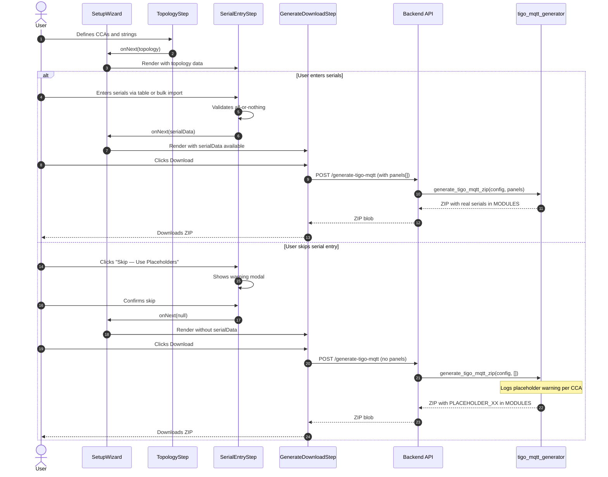

# Wizard Serial Number Entry Step

Add an optional serial number entry step to the setup wizard between the System Topology step and the Generate & Download step. This allows users to enter panel serial numbers directly in the wizard so the generated config files are immediately deployable without manual editing.

## Motivation

Currently, the setup wizard generates config files with `PLACEHOLDER_XX` values in the `MODULES` line of each CCA's INI config. Users must then manually open the INI files and replace every placeholder with real serial numbers before deployment. This is error-prone (easy to misalign serials with positions) and creates friction in the setup experience.

By allowing serial entry in the wizard, users who have their serial numbers available can produce a fully functional config on first download, eliminating the manual editing step entirely.

## Functional Requirements

### FR-1: Serial Entry Step

**FR-1.1:** A new wizard step "Panel Serials" SHALL be inserted between "System Topology" (step 2) and "Generate & Download" (step 3), making it step 3 of 7.

**FR-1.2:** The step SHALL display a heading "Panel Serial Numbers" with explanatory text: "Enter the serial numbers for each panel. These are printed on the back of each Tigo optimizer and are typically 8-10 digit numbers."

**FR-1.3:** The step SHALL be optional — the user MAY skip it via a "Skip — Use Placeholders" button. If skipped, the existing placeholder behavior is preserved.

**FR-1.4:** The "Next" button label SHALL read "Next: Generate Config" and SHALL be enabled only when all serial fields are populated and valid (including no duplicates per FR-2.6). When no serials are entered, the "Next" button SHALL be disabled — users must use the "Skip — Use Placeholders" button to proceed without serials.

### FR-2: Table Entry UI

**FR-2.1:** Panels SHALL be organized by CCA, then by string. Each CCA SHALL be rendered as a card (matching the topology step's card style). Within each CCA card, each string SHALL display as a labeled section.

**FR-2.2:** Each string section SHALL render a table with columns:
- **Position** — read-only, showing the label (e.g., "A1", "A2")
- **Serial Number** — editable text input field

**FR-2.3:** Serial number inputs SHALL accept alphanumeric characters (uppercase letters and digits). Input SHALL be auto-uppercased. Maximum length SHALL be 20 characters (`maxLength={20}`).

**FR-2.4:** Serial number inputs SHALL validate that the value is non-empty and at least 4 characters long when filled. Invalid entries SHALL show inline validation (red border + message).

**FR-2.5:** The table SHALL show a per-string completion count (e.g., "3 of 8 entered").

**FR-2.6:** Serial numbers MUST be unique across all panels globally (not just within a single CCA or string). If a duplicate is detected, the input field SHALL show an inline validation error: "Duplicate — this serial is already entered for {other_label}" (e.g., "Duplicate — this serial is already entered for A3"). The "Next" button SHALL be disabled while any duplicates exist.

### FR-3: Bulk Import

**FR-3.1:** Below each CCA card's table UI, a collapsible section labeled "Bulk Import" SHALL be available. When expanded, it SHALL show a textarea and an "Import" button.

**FR-3.2:** The textarea SHALL accept serial numbers in CSV format (comma-separated) or TSV format (tab-separated, for spreadsheet paste). Newline-separated values SHALL also be accepted. The parser SHALL auto-detect the delimiter by checking for tabs first, then commas, then treating each line as a single value. Serial numbers are alphanumeric-only (per FR-2.3), so they cannot contain delimiter characters (commas, tabs, newlines). If a parsed value contains a delimiter character after splitting, it is treated as-is and will fail the alphanumeric validation in FR-3.7.

**FR-3.3:** On clicking "Import", the system SHALL parse the input and validate:
- The number of parsed values MUST exactly match the total panel count for that CCA (sum of all string panel counts). If the count does not match, the import SHALL fail with an error message: "Expected {expected} serial numbers for CCA '{name}', but found {actual}. Please check your input — every panel must have exactly one serial number."
- Each parsed value MUST be non-empty after trimming whitespace. Blank entries SHALL cause a failure: "Found blank entry at position {n}. All values must be non-empty."
- Empty lines at the end of the input SHALL be trimmed before parsing (to handle trailing newlines from copy-paste).

**FR-3.4:** On successful bulk import, the parsed serials SHALL immediately populate the table view above in order: filling string A positions first (A1, A2, ...), then string B positions, etc., following the string order defined in topology. After populating, the global duplicate detection (FR-2.6) SHALL run across all panels (including other CCAs already filled). Any duplicates introduced by the import will be shown as inline validation errors in the table.

**FR-3.5:** If a bulk import overwrites existing manually-entered serials, no confirmation is needed — the import replaces all values for that CCA.

**FR-3.6:** A successful bulk import SHALL collapse the bulk import section and show a brief success message (e.g., "Imported 24 serial numbers").

**FR-3.7:** Each parsed value from bulk import SHALL be validated against the same format rules as manual entry: alphanumeric only (FR-2.3), at least 4 characters (FR-2.4), maximum 20 characters (FR-2.3). Surrounding double-quote characters SHALL be stripped before validation (to handle spreadsheet copy-paste of quoted fields). Values failing format validation SHALL cause the import to fail with a descriptive error (e.g., "Invalid serial at position 5: 'AB@C'. Serials must be alphanumeric only.").

### FR-4: All-or-Nothing Validation

**FR-4.1:** Serial entry SHALL be all-or-nothing globally. Either every panel across all CCAs has a serial entered, or no panels have serials (skip entirely).

**FR-4.2:** If the user has entered serials for some but not all panels and attempts to proceed, the step SHALL display a validation error: "Serial numbers must be entered for all {total} panels, or skipped entirely. Currently {entered} of {total} are filled."

**FR-4.3:** The "Skip — Use Placeholders" button SHALL be disabled if any serials have been entered. A tooltip or hint SHALL explain: "Clear all entered serials to use placeholder mode."

**FR-4.4:** A "Clear All" button SHALL be provided to reset all serial fields across all CCAs, re-enabling the skip option.

### FR-5: Skip Warning

**FR-5.1:** When the user clicks "Skip — Use Placeholders", a confirmation modal SHALL appear with:
- **Title:** "Config Will Require Manual Editing"
- **Body:** "The downloaded config files will contain placeholder serial numbers (PLACEHOLDER_A1, PLACEHOLDER_A2, etc.) instead of real panel serials. You will need to manually edit each config-{name}.ini file to replace placeholders with actual serial numbers before the system will function correctly."
- **Buttons:** "Continue with Placeholders" (primary) and "Go Back" (secondary)

**FR-5.2:** If the user confirms the skip, the wizard SHALL proceed to the Generate & Download step with no serial data (existing placeholder behavior).

### FR-6: Placeholder Logging

**FR-6.1:** When the backend generates a config ZIP with placeholder serials (no panels provided or empty panels list), it SHALL log a warning-level message: `"Generated tigo-mqtt config with placeholder serials for CCA '{cca_name}'. Config requires manual serial number entry before deployment."`

**FR-6.2:** This log message SHALL be emitted once per CCA that uses placeholders.

### FR-7: State Management

**FR-7.1:** Serial number entries SHALL be stored in the wizard state and persisted to localStorage alongside existing wizard state.

**FR-7.2:** The serial data SHALL be stored as a `Record<string, string>` mapping panel labels (e.g., "A1", "B3") to serial numbers, namespaced by CCA name. The structure SHALL be: `Record<string, Record<string, string>>` where the outer key is CCA name and inner key is panel label.

**FR-7.3:** If the user navigates back to the Topology step and submits any change (including CCA name, serial device, string names, or panel counts), the serial data SHALL be invalidated (cleared). This is by design: since CCA names are used as keys in the serial data structure, any topology change may invalidate the mapping. The existing `invalidateDownstream` mechanism is reused — it clears all downstream state when any prior step changes. Users should finalize topology before entering serial numbers.

**FR-7.4:** If the user navigates back to the Serial Entry step after having previously filled it, the previously entered values SHALL be preserved (unless invalidated by topology changes per FR-7.3).

### FR-8: Integration with Config Generation

**FR-8.1:** When serial numbers are provided, the Generate & Download step SHALL pass them as `Panel` objects to the `downloadTigoMqttConfig` API call. Each panel SHALL be constructed as:
```typescript
{
  serial: enteredSerial,
  cca: ccaName,
  string: stringName,       // e.g., "A"
  tigo_label: label,        // e.g., "A1"
  display_label: label,     // Same as tigo_label (no translation needed)
}
```

**FR-8.2:** When panels are provided to the backend, the existing `generate_ini_config` function SHALL be used (not `generate_placeholder_ini`), producing a fully functional `MODULES` line with real serial numbers.

**FR-8.3:** The generated INI SHALL NOT contain the placeholder comment header ("NOTE: This is a PLACEHOLDER configuration.") when real serials are provided.

**FR-8.4:** If the config generation API returns an error (network failure or backend validation error), the error message SHALL be displayed on the Generate & Download step. Serial data SHALL be preserved in wizard state so the user can navigate back to the Serial Entry step to correct issues without re-entering all serials. The "Download" button SHALL remain available for retry after transient errors.

### FR-9: Step Indicator Updates

**FR-9.1:** The `WizardStepIndicator` component SHALL be updated to display the new step. The step sequence SHALL be: MQTT Config → System Topology → Panel Serials → Generate & Download → Discovery → Validation → Review & Save.

**FR-9.2:** The step names in the indicator SHALL use short labels for space efficiency. The new step SHALL be labeled "Panel Serials".

## Non-Functional Requirements

**NFR-1.1:** The serial entry step SHALL handle up to 100 panels per CCA with input latency under 100ms when typing in any serial field.

**NFR-1.2:** Bulk import parsing SHALL complete in under 100ms for up to 200 serial numbers.

**NFR-1.3:** The serial entry UI SHALL follow the same visual style (inline CSSProperties objects, same color palette, card layout) as the existing Topology and Generate steps.

**NFR-1.4:** The serial entry step state SHALL be included in the 7-day localStorage persistence. Serial data SHALL NOT exceed 50KB of storage (sufficient for hundreds of serials). If localStorage persistence fails (quota exceeded, private browsing, or disabled), the existing silent-failure behavior (console warning) is acceptable. Serial data will still be available in the current session's memory but will not survive page reload.

**NFR-1.5:** Serial number input fields SHALL have `aria-label` attributes in the format "Serial number for panel {label}" (e.g., "Serial number for panel A1"). Validation error messages SHALL use `aria-describedby` to associate errors with their input fields. The skip confirmation modal (FR-5.1) SHALL trap focus and be dismissible via Escape key. The bulk import textarea SHALL have an `aria-label` of "Paste serial numbers for CCA {name}".

## High Level Design



### Component Architecture

The new step is a single React component `SerialEntryStep` that receives topology data and outputs serial number mappings.

**State shape in wizard:**
```typescript
// Added to WizardState
serialEntries: Record<string, Record<string, string>> | null;
// Example:
// {
//   "primary": { "A1": "12345678", "A2": "23456789", "B1": "34567890" },
//   "secondary": { "A1": "45678901", "A2": "56789012" }
// }
```

**SerialEntryStep component props:**
```typescript
interface SerialEntryStepProps {
  topology: SystemConfig;
  serialEntries: Record<string, Record<string, string>> | null;
  onNext: (serials: Record<string, Record<string, string>> | null) => void;
  onBack: () => void;
}
```

**Bulk import parsing logic:**
```typescript
function parseBulkSerials(input: string, expectedCount: number, ccaName: string):
  { serials: string[] } | { error: string } {
  // 1. Trim trailing empty lines
  const trimmed = input.replace(/[\r\n]+$/, '');

  // 2. Auto-detect delimiter: tabs > commas > newlines
  let values: string[];
  if (trimmed.includes('\t')) {
    values = trimmed.split(/\t/).map(v => v.trim());
  } else if (trimmed.includes(',')) {
    values = trimmed.split(',').map(v => v.trim());
  } else {
    values = trimmed.split(/\r?\n/).map(v => v.trim());
  }

  // 3. Strip surrounding quotes (handles spreadsheet copy-paste)
  values = values.map(v => v.replace(/^"(.*)"$/, '$1'));

  // 4. Validate count (must match exactly — prevents off-by-one errors)
  if (values.length !== expectedCount) {
    return {
      error: `Expected ${expectedCount} serial numbers for CCA '${ccaName}', but found ${values.length}. Please check your input — every panel must have exactly one serial number.`
    };
  }

  // 5. Check for blanks
  const blankIndex = values.findIndex(v => v === '');
  if (blankIndex !== -1) {
    return { error: `Found blank entry at position ${blankIndex + 1}. All values must be non-empty.` };
  }

  // 6. Validate alphanumeric format (FR-2.3) and min length (FR-2.4)
  const invalidIndex = values.findIndex(v => !/^[A-Za-z0-9]+$/.test(v));
  if (invalidIndex !== -1) {
    return {
      error: `Invalid serial at position ${invalidIndex + 1}: "${values[invalidIndex]}". Serials must be alphanumeric only.`
    };
  }
  const shortIndex = values.findIndex(v => v.length < 4);
  if (shortIndex !== -1) {
    return {
      error: `Serial at position ${shortIndex + 1} is too short (${values[shortIndex].length} chars). Minimum length is 4 characters.`
    };
  }
  const longIndex = values.findIndex(v => v.length > 20);
  if (longIndex !== -1) {
    return {
      error: `Serial at position ${longIndex + 1} is too long (${values[longIndex].length} chars). Maximum length is 20 characters.`
    };
  }

  return { serials: values.map(v => v.toUpperCase()) };
}
```

**Panel construction for API call (in GenerateDownloadStep):**
```typescript
function serialEntriesToPanels(
  serials: Record<string, Record<string, string>>,
  topology: SystemConfig
): Panel[] {
  const panels: Panel[] = [];
  for (const cca of topology.ccas) {
    const ccaSerials = serials[cca.name] || {};
    for (const str of cca.strings) {
      for (let i = 1; i <= str.panel_count; i++) {
        const label = `${str.name}${i}`;
        const serial = ccaSerials[label];
        if (serial) {
          panels.push({
            serial,
            cca: cca.name,
            string: str.name,
            tigo_label: label,
            display_label: label,
          });
        }
      }
    }
  }
  return panels;
}
```

### Wizard State Flow Changes

The `STEP_ORDER` array and `WizardStep` type must be updated. **Note:** `STEP_ORDER` is defined in two locations that must both be updated:

```typescript
// types/config.ts
export type WizardStep =
  | 'mqtt-config'
  | 'system-topology'
  | 'panel-serials'       // NEW
  | 'generate-download'
  | 'discovery'
  | 'validation'
  | 'review-save';

// useWizardState.ts — primary STEP_ORDER
const STEP_ORDER: WizardStep[] = [
  'mqtt-config',
  'system-topology',
  'panel-serials',          // NEW
  'generate-download',
  'discovery',
  'validation',
  'review-save',
];

// SetupWizard.tsx — duplicate STEP_ORDER inside handleGoNext()
// This inline array (used for restore-mode skip logic) MUST also include 'panel-serials'.
// Location: SetupWizard.tsx, handleGoNext callback (~line 183)
```

The invalidation logic in `invalidateDownstream` must clear `serialEntries` when topology changes:

```typescript
if (changedStep === 'system-topology' || changedStep === 'mqtt-config') {
  newState.serialEntries = null;  // NEW: clear serials when topology changes
  newState.configDownloaded = false;
  newState.discoveredPanels = {};
  newState.validationResults = null;
}
```

### Restore-from-Backup Handling

The `panel-serials` step SHALL be added to `RESTORE_SKIP_STEPS` since backup restores already have panel data:

```typescript
const RESTORE_SKIP_STEPS: WizardStep[] = ['panel-serials', 'discovery', 'validation'];
```

### Backend Changes

The backend requires minimal changes:

1. **Logging in `generate_tigo_mqtt_zip`:** The `except TigoMQTTGeneratorError` branch in `generate_tigo_mqtt_zip` (line 377) already has `logger.warning(f"Generating placeholder INI for {cca.name}: {e}")`. Replace this message with the user-friendly version specified in FR-6.1: `logger.warning(f"Generated tigo-mqtt config with placeholder serials for CCA '{cca.name}'. Config requires manual serial number entry before deployment.")`. The original exception message (`{e}`) is the technical "CCA has no panels configured" message — the new message is more helpful for operators reviewing logs.

2. No API contract changes — the `GenerateConfigRequest` model already accepts optional `panels`, and the generator already handles both paths (panels present → `generate_ini_config`, panels absent → `generate_placeholder_ini`). The existing `Panel` model in `config_models.py` is used as-is for serial entry panels. No new model is needed. The `position` field should be omitted (defaults to `null`) since layout positions are not set during wizard serial entry.

## Task Breakdown

1. **Update types and wizard step definitions**
   - Add `'panel-serials'` to `WizardStep` type union in `types/config.ts`
   - Add `serialEntries` field to `WizardState` interface
   - Update `STEP_ORDER` in `useWizardState.ts`
   - Update the duplicate `STEP_ORDER` array inside `handleGoNext()` in `SetupWizard.tsx` (~line 183)
   - Add `'panel-serials'` to `RESTORE_SKIP_STEPS` in `SetupWizard.tsx`

2. **Update wizard state management**
   - Add `serialEntries` to initial state (`null`)
   - Add `setSerialEntries` setter
   - Add serial invalidation to `invalidateDownstream` when topology changes
   - Include `serialEntries` in localStorage persistence

3. **Create `SerialEntryStep` component**
   - CCA card layout with string tables
   - Serial number input fields with validation
   - Per-string completion counter
   - All-or-nothing validation logic
   - "Skip — Use Placeholders" button with confirmation modal
   - "Clear All" button
   - Sub-task: Bulk import accordion with textarea, delimiter parser, and error display

4. **Wire `SerialEntryStep` into `SetupWizard`**
   - Add case for `'panel-serials'` in `renderStep()`
   - Pass topology and serial state as props
   - Handle `onNext` to store serials and advance

5. **Update `GenerateDownloadStep` to pass serials**
   - Accept `serialEntries` prop
   - Convert serial entries to `Panel[]` array when calling `downloadTigoMqttConfig`
   - Pass panels to API call instead of empty array when serials exist

6. **Update `WizardStepIndicator`**
   - Add "Panel Serials" label for the new step
   - Verify step count and layout handles 7 steps without overflow

7. **Add placeholder logging to backend**
   - Add `logger.warning()` in `generate_tigo_mqtt_zip` when placeholder INI is generated

8. **Testing via Playwright MCP**
   - Test full serial entry flow (table input → generate → verify INI has real serials)
   - Test bulk import (CSV, TSV, newline-separated)
   - Test bulk import error cases (wrong count, blank entries, values with quotes, non-alphanumeric characters, too-short serials, too-long serials exceeding 20 chars)
   - Test bulk import auto-uppercases all parsed values
   - Test duplicate serial detection (inline error shown, Next disabled)
   - Test skip flow (modal appears, placeholders generated)
   - Test all-or-nothing validation (partial fill blocked)
   - Test "Clear All" button resets all serial fields and re-enables Skip
   - Test serial data persists in localStorage across page reload
   - Test step indicator displays 7 steps with correct labels including "Panel Serials"
   - Test Tab key moves focus between serial input fields within a string table
   - Test topology change invalidates serials
   - Test restore-from-backup skips serial entry step

## Related Specifications

| Spec | Relationship | Notes |
|------|--------------|-------|
| None | — | This is a standalone enhancement to the existing setup wizard |

## Context / Documentation

- `dashboard/frontend/src/components/wizard/steps/TopologyStep.tsx` — Visual style reference and topology data model
- `dashboard/frontend/src/components/wizard/steps/GenerateDownloadStep.tsx` — Download flow and API integration
- `dashboard/frontend/src/components/wizard/SetupWizard.tsx` — Step wiring and restore-mode skip logic
- `dashboard/frontend/src/hooks/useWizardState.ts` — State management, persistence, and invalidation
- `dashboard/frontend/src/types/config.ts` — Type definitions for wizard state and config models
- `dashboard/frontend/src/api/config.ts` — `downloadTigoMqttConfig` API function
- `dashboard/backend/app/tigo_mqtt_generator.py` — INI generation and placeholder logic
- `dashboard/backend/app/config_models.py` — `GenerateConfigRequest`, `Panel`, `parse_tigo_label`
- `dashboard/backend/app/config_router.py` — `/api/config/generate-tigo-mqtt` endpoint

---

**Specification Version:** 1.2
**Last Updated:** February 2026
**Authors:** Claude, Ian

## Changelog

### v1.2 (February 2026)
**Summary:** Address review iteration 2 findings — bulk import validation completeness

**Changes:**
- Added maxLength=20 validation to parseBulkSerials code sample (matching FR-2.3 constraint)
- Documented that bulk import triggers global duplicate detection post-import (FR-3.4)
- Expanded test cases to cover all FR-3.7 validation paths (non-alphanumeric, too-short, too-long)

### v1.1 (February 2026)
**Summary:** Address review findings — fix contradictions, add validation/accessibility/error handling

**Changes:**
- Fixed Next/Skip button contradiction: Next requires all serials filled, Skip is the only empty-state path (FR-1.4)
- Added duplicate serial number detection across all panels (FR-2.6)
- Added serial max length of 20 characters (FR-2.3)
- Added bulk import format validation matching manual entry rules (FR-3.7)
- Updated parseBulkSerials code sample: added ccaName param, quote stripping, format validation, error messages matching FR text
- Documented duplicate STEP_ORDER in SetupWizard.tsx that must also be updated
- Clarified backend log message replaces existing logger.warning, not adds alongside it
- Added error handling for failed config generation with serial data (FR-8.4)
- Documented Panel model reuse (no new backend model needed)
- Clarified invalidation behavior: any topology change clears serials (FR-7.3)
- Added accessibility requirements: aria-labels, aria-describedby, focus trapping (NFR-1.5)
- Documented localStorage silent-failure behavior as acceptable (NFR-1.4)
- Made NFR-1.1 measurable: "under 100ms input latency"
- Expanded Playwright test cases for Clear All, localStorage, step indicator, keyboard nav, duplicates

### v1.0 (February 2026)
**Summary:** Initial specification

**Changes:**
- Initial specification created
