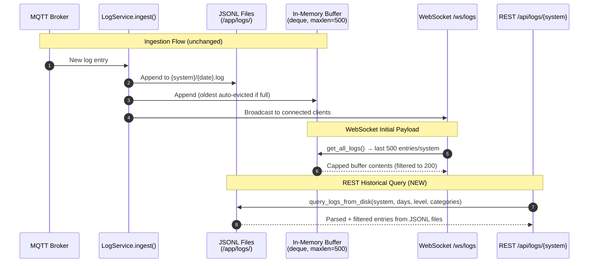

# Disk-Backed Log Storage

Refactor `LogService` to minimize backend memory usage by capping the in-memory buffer to a small ring buffer and reading from disk-based JSONL files for REST/historical queries. Add a Docker volume mount for log persistence across container restarts.

## Motivation

The current `LogService` stores **every log entry within the retention window in memory** (`self._logs: dict[str, list[LogEntry]]`). This happens unconditionally on MQTT message receipt — regardless of whether any client is viewing the Logs tab. On a Raspberry Pi with only 2 GB of RAM, this unbounded in-memory accumulation competes with the Python runtime, MQTT client, FastAPI, and the OS itself.

Key problems with the current architecture:

1. **Unbounded memory growth**: The in-memory list has no size cap — only a daily TTL prune (every 24 hours). If a taptap container enters an error loop, thousands of entries accumulate in RAM before the next prune cycle.
2. **Duplicate storage**: Every entry exists in both memory AND on disk (JSONL files). The disk copy is write-only — it is loaded into memory at startup but never read during normal operation.
3. **No volume mount**: The log directory (`/app/logs`) is inside the container's ephemeral filesystem. Logs are lost on every container restart or rebuild, forcing a full re-accumulation from MQTT replay.
4. **REST reads from memory**: The `GET /api/logs/{system}` endpoint reads from `self._logs` (the full in-memory store), making the disk files redundant during normal operation.

The fix: cap the in-memory buffer to a fixed number of recent entries (for WebSocket initial payloads and live broadcast), and have the REST endpoint read directly from disk files. Add a Docker volume so logs persist across restarts.

## Functional Requirements

### FR-1: Capped In-Memory Buffer

**FR-1.1:** The `LogService` MUST replace the unbounded `self._logs: dict[str, list[LogEntry]]` with a capped ring buffer per system using `collections.deque(maxlen=N)`. The default buffer size MUST be 500 entries per system, configurable via the `LOG_BUFFER_SIZE` environment variable (minimum 100, maximum 5000).

**FR-1.2:** When a new entry is ingested and the buffer is full, the oldest entry MUST be silently dropped from the in-memory buffer. The entry remains on disk (per existing JSONL persistence).

**FR-1.3:** The `get_all_logs()` method (used by the WebSocket initial payload) MUST return entries from the capped buffer only. The existing `WS_INITIAL_LOG_LIMIT = 200` in `main.py` continues to apply on top of the buffer — the WebSocket sends `min(200, buffer_size)` filtered entries per system.

**FR-1.4:** The `_prune_memory()` method MUST be updated to work with deques. Since deques auto-evict old entries, TTL-based pruning is no longer needed for size management. However, `_prune_memory()` MUST still remove entries older than `retention_days` and clean up empty system entries (to prevent ghost sub-tabs). The method iterates the deque and rebuilds it with only non-expired entries.

**FR-1.5:** The `load_from_disk()` method MUST populate each system's deque with only the **most recent `buffer_size` entries** (not the entire retention window). It reads files in chronological order and keeps a running deque per system — old entries naturally fall off as new ones are appended. This ensures startup memory usage matches steady-state usage.

### FR-2: Disk-Backed REST Queries

**FR-2.1:** The `GET /api/logs/{system}` REST endpoint MUST read log entries directly from JSONL files on disk instead of the in-memory buffer. This is the core change that decouples REST query capability from memory usage.

**FR-2.2:** A new method `query_logs_from_disk(system, days, min_level, excluded_categories)` MUST be added to `LogService`. This method:
1. Identifies all JSONL files for the system within the `days` window (files named `YYYY-MM-DD.log`)
2. Reads each file line-by-line (no full-file loading)
3. Parses each JSON line and validates the entry schema
4. Applies level filtering (`filter_by_level`) and category filtering (`filter_by_category`)
5. Returns the filtered entries as a list, sorted by timestamp descending (newest first)

**FR-2.3:** The `query_logs_from_disk()` method MUST handle malformed lines gracefully (skip with debug log), consistent with `load_from_disk()` behavior. Files that don't match the `YYYY-MM-DD.log` naming pattern MUST be skipped.

**FR-2.4:** The `query_logs_from_disk()` method MUST parse level and category from each disk entry using `_parse_level()` and `_classify_category()` if the stored entry does not already contain these fields. This ensures backward compatibility with log files written before level/category classification was added.

**FR-2.5:** The REST endpoint MUST continue to support `limit` and `offset` pagination parameters. Since entries are read from disk, the endpoint applies pagination after filtering and sorting. The `total` count in the response reflects the full filtered count (before pagination).

**FR-2.6:** The `GET /api/logs/systems` endpoint MUST derive the system list from **both** the in-memory buffer keys AND the disk directory listing. A system that has disk-only data (entries older than the buffer window) MUST still appear in the systems list. The merged list is deduplicated.

### FR-3: Docker Volume Mount

**FR-3.1:** The `dashboard/docker-compose.yml` MUST add a bind mount for the log directory:
```yaml
volumes:
  - ./backend/logs:/app/logs
```
This persists logs across container restarts and rebuilds. The `./backend/logs` path is relative to the `dashboard/` directory (i.e., `dashboard/backend/logs/` on the host).

**FR-3.2:** The directory `dashboard/backend/logs/` MUST be added to `.gitignore` (it contains runtime data, not source code).

**FR-3.3:** The `dashboard/backend/logs/` directory MUST be added to the frontend's `.dockerignore` to prevent it from being included in the frontend build context (if the frontend Dockerfile's context includes parent directories).

### FR-4: Configuration

**FR-4.1:** The `Settings` class MUST add a `log_buffer_size` configuration option:
```python
log_buffer_size: int = Field(default=500, ge=100, le=5000)
```
Configurable via the `LOG_BUFFER_SIZE` environment variable.

### FR-5: WebSocket Total Counts

**FR-5.1:** The WebSocket initial payload currently includes `total_counts` per system (the count of ALL filtered entries, not just the 200 sent). With the capped buffer, `total_counts` MUST reflect the buffer contents only — i.e., `total_counts[sys] = len(filtered_buffer_entries)`. This is a behavioral change: previously `total_counts` reflected the full retention window; now it reflects only the buffer window. The frontend already handles this correctly since it displays "N entries" based on what it receives, not the `total` field.

**FR-5.2:** If the frontend needs the true historical total (e.g., for a "Load more" feature), it can call the REST endpoint `GET /api/logs/{system}?days=N&limit=0&offset=0` which returns `total` from disk. This is not required for the current implementation but is available as a future extension point.

## Non-Functional Requirements

**NFR-1.1:** Steady-state memory usage for log storage MUST be bounded at approximately `buffer_size * avg_entry_size * num_systems`. With defaults (500 entries, ~400 bytes/entry, 2 systems), this is ~400 KB — down from potentially unbounded growth.

**NFR-1.2:** REST query latency for `GET /api/logs/{system}` with default parameters (`days=7, limit=1000`) MUST complete within 500ms for typical log volumes (~3,500 entries per CCA for 7 days). Reading and parsing ~350 KB of JSONL per system is well within this budget on both Pi and server hardware.

**NFR-1.3:** The refactor MUST NOT change the MQTT ingestion flow. Every entry is still written to disk AND appended to the in-memory buffer AND broadcast to WebSocket clients. The only change is that the in-memory buffer is capped.

**NFR-1.4:** The refactor MUST NOT change the WebSocket live streaming behavior. New entries continue to be pushed to connected clients in real-time as they arrive.

**NFR-1.5:** The refactor MUST NOT change the log file format (JSONL with `ts`, `line`, `seq`, `level`, `category` fields). Existing log files on disk remain valid and readable.

## High Level Design



### Data Flow Summary

| Operation | Source | Memory Impact |
|-----------|--------|---------------|
| MQTT ingest | → Disk + Buffer + WS broadcast | Bounded (deque maxlen) |
| WS initial payload | ← Buffer (last N entries) | No additional allocation |
| WS live stream | ← Broadcast from ingest | No storage (fire-and-forget) |
| REST query | ← Disk files (JSONL) | Temporary (GC'd after response) |
| Startup load | Disk → Buffer (last N only) | Bounded (deque maxlen) |

### LogService Changes

```python
from collections import deque

class LogService:
    def __init__(self, log_dir: str, retention_days: int, buffer_size: int = 500):
        self.log_dir = Path(log_dir)
        self.retention_days = retention_days
        self.buffer_size = buffer_size
        # CHANGED: bounded deque instead of unbounded list
        self._logs: dict[str, deque[LogEntry]] = {}
        self._connections: dict[WebSocket, tuple[int, set[str]]] = {}
        self._last_seq: dict[str, int] = {}
        self._has_debug: dict[str, bool] = {}

    async def ingest(self, system: str, entry: dict) -> bool:
        # ... validation unchanged ...
        # ... disk write unchanged ...

        # CHANGED: use deque with maxlen
        if system not in self._logs:
            self._logs[system] = deque(maxlen=self.buffer_size)
        self._logs[system].append(entry)

        await self._broadcast_entry(system, entry)
        return True

    def query_logs_from_disk(
        self,
        system: str,
        days: int = 7,
        min_level: str = "info",
        excluded_categories: set[str] | None = None,
    ) -> list[LogEntry]:
        """Read and filter log entries from JSONL files on disk.

        Returns entries sorted by timestamp descending (newest first).
        """
        if not self._validate_system(system):
            return []
        system_dir = self.log_dir / system
        if not system_dir.is_dir():
            return []

        cutoff = datetime.now(timezone.utc) - timedelta(days=days)
        cutoff_date = cutoff.date()
        cutoff_str = cutoff.isoformat()
        excluded = excluded_categories or set()

        entries: list[LogEntry] = []
        for log_file in sorted(system_dir.glob("*.log")):
            try:
                file_date = datetime.strptime(log_file.stem, "%Y-%m-%d").date()
                if file_date < cutoff_date:
                    continue
            except ValueError:
                continue
            with open(log_file, "r") as f:
                for raw_line in f:
                    raw_line = raw_line.strip()
                    if not raw_line:
                        continue
                    try:
                        data = json.loads(raw_line)
                    except json.JSONDecodeError:
                        logger.debug(f"Skipping malformed line in {log_file}")
                        continue
                    if not (
                        isinstance(data, dict)
                        and isinstance(data.get("ts"), str)
                        and data.get("ts")
                        and isinstance(data.get("line"), str)
                        and isinstance(data.get("seq"), int)
                        and data.get("seq") >= 0
                    ):
                        continue
                    # Ensure level and category exist
                    if not data.get("level"):
                        data["level"] = self._parse_level(data.get("line", ""))
                    if not data.get("category"):
                        data["category"] = self._classify_category(data.get("line", ""))
                    # Apply timestamp cutoff
                    if data.get("ts", "") < cutoff_str:
                        continue
                    # Apply level filter
                    entry_level_val = LEVEL_VALUES.get(data.get("level", "info"), 20)
                    min_level_val = LEVEL_VALUES.get(min_level, 20)
                    if entry_level_val < min_level_val:
                        continue
                    # Apply category filter
                    entry_cat = data.get("category", CATEGORY_GENERAL)
                    if entry_cat in ALWAYS_HIDDEN or entry_cat in excluded:
                        continue
                    entries.append(data)

        # Sort newest first
        entries.sort(key=lambda e: e.get("ts", ""), reverse=True)
        return entries

    def get_disk_systems(self) -> list[str]:
        """Return system names that have log directories on disk."""
        if not self.log_dir.exists():
            return []
        systems = []
        for d in self.log_dir.iterdir():
            if d.is_dir() and self._validate_system(d.name):
                # Only include if directory has .log files
                if any(d.glob("*.log")):
                    systems.append(d.name)
        return systems

    def get_systems(self) -> list[str]:
        """Return merged system list from buffer + disk."""
        buffer_systems = set(self._logs.keys())
        disk_systems = set(self.get_disk_systems())
        return sorted(buffer_systems | disk_systems)

    def load_from_disk(self) -> None:
        """On startup, populate the capped buffer with the most recent entries."""
        try:
            self.log_dir.mkdir(parents=True, exist_ok=True)
        except OSError as e:
            logger.error(f"Cannot create log directory {self.log_dir}: {e}")
            return
        cutoff = datetime.now(timezone.utc) - timedelta(days=self.retention_days)
        cutoff_date = cutoff.date()
        for system_dir in self.log_dir.iterdir():
            if not system_dir.is_dir():
                continue
            system = system_dir.name
            if not self._validate_system(system):
                continue
            buf = deque(maxlen=self.buffer_size)
            has_debug = False
            for log_file in sorted(system_dir.glob("*.log")):
                try:
                    file_date = datetime.strptime(log_file.stem, "%Y-%m-%d").date()
                    if file_date < cutoff_date:
                        continue
                except ValueError:
                    continue
                with open(log_file, "r") as f:
                    for raw_line in f:
                        raw_line = raw_line.strip()
                        if not raw_line:
                            continue
                        try:
                            data = json.loads(raw_line)
                        except json.JSONDecodeError:
                            continue
                        if (
                            isinstance(data, dict)
                            and isinstance(data.get("ts"), str)
                            and data.get("ts")
                            and isinstance(data.get("line"), str)
                            and isinstance(data.get("seq"), int)
                            and data.get("seq") >= 0
                        ):
                            data["level"] = self._parse_level(data.get("line", ""))
                            if data["level"] == "debug":
                                has_debug = True
                            data["category"] = self._classify_category(data.get("line", ""))
                            buf.append(data)  # deque auto-evicts oldest
            if buf:
                self._logs[system] = buf
                if has_debug:
                    self._has_debug[system] = True
```

### REST Endpoint Changes

```python
@app.get("/api/logs/{system}")
async def get_logs(
    system: str,
    days: int = Query(default=7, ge=1, le=30),
    limit: int = Query(default=1000, ge=1, le=5000),
    offset: int = Query(default=0, ge=0),
    level: str = Query(default="info"),
    exclude: str = Query(default=""),
):
    if log_service is None:
        raise HTTPException(status_code=503, detail="Log service not available")
    if not LogService._validate_system(system):
        raise HTTPException(status_code=404, detail="System not found")

    # CHANGED: Check both buffer and disk for system existence
    if system not in log_service.get_systems():
        raise HTTPException(status_code=404, detail="System not found")

    req_level = level.lower() if level.lower() in VALID_LOG_LEVELS else "info"
    excluded = {c.strip() for c in exclude.split(",") if c.strip()}
    excluded = excluded & set(FILTERABLE_CATEGORIES.keys())

    # CHANGED: Read from disk instead of memory
    all_filtered = log_service.query_logs_from_disk(
        system, days=days, min_level=req_level, excluded_categories=excluded
    )

    total = len(all_filtered)
    entries = all_filtered[offset : offset + limit]

    return {
        "system": system,
        "entries": entries,
        "total": total,
        "has_more": offset + limit < total,
    }
```

### Docker Compose Changes

```yaml
# In dashboard/docker-compose.yml, backend service:
volumes:
  - ../config:/app/config
  - ./backend/assets:/app/assets
  - ../tigo-mqtt/data/primary:/app/state/primary:ro
  - ../tigo-mqtt/data/secondary:/app/state/secondary:ro
  - ./backend/logs:/app/logs  # NEW: persist logs across restarts
```

## Task Breakdown

### Task 1: Add Docker Volume Mount and Gitignore

**Files:** `dashboard/docker-compose.yml`, `dashboard/backend/.dockerignore` (if exists), `.gitignore`

1. Add `./backend/logs:/app/logs` volume mount to the backend service in `docker-compose.yml`
2. Add `dashboard/backend/logs/` to `.gitignore`
3. Verify the frontend `.dockerignore` excludes `../backend/logs` (check if the frontend build context could include it)

### Task 2: Add `log_buffer_size` Configuration

**Files:** `dashboard/backend/app/config.py`

1. Add `log_buffer_size: int = Field(default=500, ge=100, le=5000)` to `Settings`
2. Optionally add `LOG_BUFFER_SIZE=500` to `docker-compose.yml` environment for documentation clarity

### Task 3: Refactor LogService In-Memory Storage

**Files:** `dashboard/backend/app/log_service.py`

1. Import `collections.deque`
2. Change `__init__` to accept `buffer_size` parameter
3. Change `self._logs` type from `dict[str, list[LogEntry]]` to `dict[str, deque[LogEntry]]`
4. Update `ingest()` to create `deque(maxlen=self.buffer_size)` per system
5. Update `_prune_memory()` to work with deques (rebuild deque with non-expired entries)
6. Update `load_from_disk()` to populate deques with only the most recent `buffer_size` entries
7. Update `get_all_logs()` to return `list(entries)` from deques (already returns list copies)
8. Update `get_logs_for_system()` similarly

### Task 4: Add Disk-Backed Query Method

**Files:** `dashboard/backend/app/log_service.py`

1. Add `query_logs_from_disk()` method that reads JSONL files, filters, and returns sorted entries
2. Add `get_disk_systems()` method that lists system directories with `.log` files
3. Update `get_systems()` to merge buffer keys with disk directory listing

### Task 5: Update REST Endpoint to Read from Disk

**Files:** `dashboard/backend/app/main.py`

1. Update `get_logs()` to call `log_service.query_logs_from_disk()` instead of `log_service.get_logs_for_system()`
2. Remove the manual level/category filtering in the endpoint (now handled by `query_logs_from_disk()`)
3. Update system existence check to use the merged `get_systems()` list

### Task 6: Update LogService Initialization in Lifespan

**Files:** `dashboard/backend/app/main.py`

1. Pass `settings.log_buffer_size` to `LogService()` constructor

### Task 7: Build, Deploy, and Verify

1. Rebuild containers: `cd dashboard && docker compose up --build -d`
2. Verify logs directory is mounted: `ls -la dashboard/backend/logs/`
3. Verify the backend starts correctly and the WebSocket serves the initial payload
4. Verify the REST endpoint returns results from disk
5. Verify that after container restart, logs persist and are loaded into the buffer

## Related Specifications

| Spec | Relationship | Notes |
|------|--------------|-------|
| [CCA Log Viewer](2026-02-08-cca-log-viewer.md) | extends | This spec refactors the log storage architecture introduced by the CCA Log Viewer spec. All external interfaces (WebSocket protocol, REST API, frontend behavior) remain unchanged. |

## Context / Documentation

- `dashboard/backend/app/log_service.py` — Current implementation with unbounded in-memory storage (the primary file being refactored)
- `dashboard/backend/app/main.py` — WebSocket and REST endpoints for logs (lines 386-474)
- `dashboard/backend/app/config.py` — Pydantic settings class (add `log_buffer_size`)
- `dashboard/docker-compose.yml` — Container orchestration (add volume mount)
- `docs/specs/2026-02-08-cca-log-viewer.md` — Original CCA Log Viewer spec (v1.6) that defined the current architecture
- Python `collections.deque` — https://docs.python.org/3/library/collections.html#collections.deque

---

**Specification Version:** 1.0
**Last Updated:** February 2026
**Authors:** Ian, Claude

## Changelog

### v1.0 (February 2026)
**Summary:** Initial specification

**Changes:**
- Initial specification created
