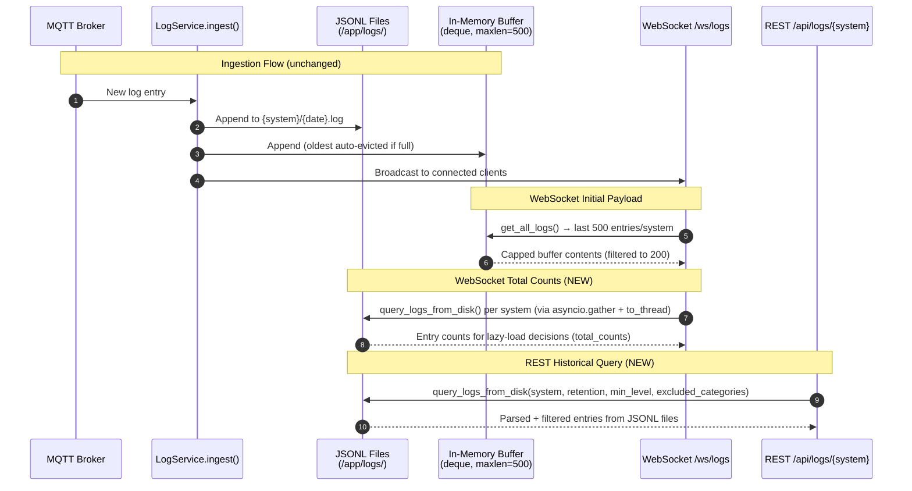

# Disk-Backed Log Storage

Refactor `LogService` to minimize backend memory usage by capping the in-memory buffer to a small ring buffer and reading from disk-based JSONL files for REST/historical queries. Add a Docker volume mount for log persistence across container restarts.

## Motivation

The current `LogService` stores **every log entry within the retention window in memory** (`self._logs: dict[str, list[LogEntry]]`). This happens unconditionally on MQTT message receipt — regardless of whether any client is viewing the Logs tab. On a Raspberry Pi with only 2 GB of RAM, this unbounded in-memory accumulation competes with the Python runtime, MQTT client, FastAPI, and the OS itself.

Key problems with the current architecture:

1. **Unbounded memory growth**: The in-memory list has no size cap — only a daily TTL prune (every 24 hours). If a taptap container enters an error loop, thousands of entries accumulate in RAM before the next prune cycle.
2. **Duplicate storage**: Every entry exists in both memory AND on disk (JSONL files). The disk copy is write-only — it is loaded into memory at startup but never read during normal operation.
3. **No volume mount**: The log directory (`/app/logs`) is inside the container's ephemeral filesystem. Logs are lost on every container restart or rebuild, forcing a full re-accumulation from MQTT replay.
4. **REST reads from memory**: The `GET /api/logs/{system}` endpoint reads from `self._logs` (the full in-memory store), making the disk files redundant during normal operation.

The fix: cap the in-memory buffer to a fixed number of recent entries (for WebSocket initial payloads and live broadcast), and have the REST endpoint read directly from disk files. Add a Docker volume so logs persist across restarts.

## Functional Requirements

### FR-1: Capped In-Memory Buffer

**FR-1.1:** The `LogService` MUST replace the unbounded `self._logs: dict[str, list[LogEntry]]` with a capped ring buffer per system using `collections.deque(maxlen=N)`. The default buffer size MUST be 500 entries per system, configurable via the `LOG_BUFFER_SIZE` environment variable (minimum 100, maximum 5000). Values outside this range or non-integer values MUST cause a validation error at startup, preventing the service from starting with an invalid configuration.

**FR-1.2:** When a new entry is ingested and the buffer is full, the oldest entry MUST be silently dropped from the in-memory buffer. The entry remains on disk (per existing JSONL persistence).

**FR-1.3:** The `get_all_logs()` method (used by the WebSocket initial payload) MUST return entries from the capped buffer only. The existing WebSocket pipeline applies in order: (1) read from capped buffer (up to `buffer_size` entries per system), (2) apply the connection's level and category filters, (3) take the last `WS_INITIAL_LOG_LIMIT` (200) entries from the filtered set, (4) send to client. The 200 limit applies to post-filtered entries, not to the buffer size.

**FR-1.4:** The `_prune_memory()` method MUST be updated to work with deques. Since deques auto-evict old entries, TTL-based pruning is no longer needed for size management. However, `_prune_memory()` MUST still remove entries older than the configured retention period and clean up empty system entries (to prevent ghost sub-tabs). **Concurrency invariant:** `_prune_memory()` MUST remain synchronous and MUST NOT be wrapped in `asyncio.to_thread()`. Because it runs on the asyncio event loop, it cannot interleave with `ingest()` (also on the event loop), which guarantees no entries are lost during pruning. A future developer must not "optimize" this into a thread, as that would introduce a data race with `ingest()` mutating `self._logs`. The method iterates the deque and rebuilds it with only non-expired entries. **Timestamp format requirement:** All timestamps stored by `ingest()` MUST use a consistent ISO 8601 format with `+00:00` suffix (never `Z`), ensuring lexicographic string comparison is valid for cutoff checks. The `datetime.now(timezone.utc).isoformat()` call in Python produces this format by default. **Note on entries with missing/empty timestamps:** In practice, entries with `ts=""` cannot reach the buffer via `load_from_disk()` or `query_logs_from_disk()` — both validate `data.get("ts")` for truthiness, rejecting empty strings. The `ingest()` method (validation defined in the CCA Log Viewer spec) also validates `ts` as a non-empty string before appending. However, if an entry with an empty or non-ISO timestamp somehow enters the buffer (e.g., future code path, manual injection into the deque), `_prune_memory()` will **drop** it: empty string `""` < any valid timestamp, so `"" >= cutoff_str` is `False`. This is the correct defensive behavior — entries without valid timestamps should not persist indefinitely. **Note:** In practice, `_prune_memory()` is unlikely to remove entries from a 500-entry buffer since all buffered entries will be recent (~1 day). However, the method MUST be preserved as a defensive measure for correctness if `buffer_size` is set very large (e.g., 5000), if entries have timestamps far in the past (e.g., from historical replay), and as the cleanup mechanism for empty system entries. **Critical implementation detail:** The pruned result MUST be wrapped in `deque(..., maxlen=self.buffer_size)`, NOT left as a plain list — see code sample below.

**FR-1.5:** The `load_from_disk()` method MUST populate each system's deque with only the **most recent `buffer_size` entries** (not the entire retention window). It reads files in chronological order and keeps a running deque per system — old entries naturally fall off as new ones are appended. Additionally, `load_from_disk()` MUST apply a per-entry timestamp cutoff (`cutoff_str`) to skip entries older than the retention period, consistent with `query_logs_from_disk()` behavior. This prevents the buffer from containing entries outside the retention window when using sub-day retention (e.g., `8h`), which would create an inconsistency where the same entry appears in the WebSocket initial payload but not in REST results. This ensures startup memory usage matches steady-state usage.

### FR-2: Disk-Backed REST Queries

**FR-2.1:** The `GET /api/logs/{system}` REST endpoint MUST read log entries directly from JSONL files on disk instead of the in-memory buffer. This is the core change that decouples REST query capability from memory usage. The synchronous `query_logs_from_disk()` call MUST be wrapped in `asyncio.to_thread()` in the async REST handler to avoid blocking the event loop during file I/O (critical on Raspberry Pi with slow SD card storage).

**FR-2.2:** A new method `query_logs_from_disk(system, retention, min_level, excluded_categories)` MUST be added to `LogService`. The `retention` parameter is an optional `timedelta`; if `None`, `self.retention` is used. This method:
1. Identifies all JSONL files for the system within the `retention` window (files named `YYYY-MM-DD.log`)
2. Reads each file line-by-line (no full-file loading)
3. Parses each JSON line and validates the entry schema
4. Applies level filtering (`filter_by_level`) and category filtering (`filter_by_category`)
5. Returns a tuple `(entries, capped)` where `entries` is the filtered list sorted by timestamp descending (newest first) and `capped` is `True` if the 50,000 entry cap was reached

**REST Response Schema** (produced by the REST handler in `main.py`, not by `query_logs_from_disk()` directly):

| Status | Response |
|--------|----------|
| 200 | `{"system": str, "entries": list[LogEntry], "total": int, "has_more": bool, "capped": bool}` — `total` is the full filtered count (capped at 50,000), `has_more` is `true` if `offset + limit < total`, `capped` is `true` when the 50,000 entry cap was reached (actual disk total may be higher). The `capped` field allows clients and debugging operators to detect truncated results. |
| 400 | `{"detail": "Invalid system name format"}` — returned when `_validate_system()` rejects the system name |
| 404 | `{"detail": "System not found"}` — returned when the system name is valid but does not exist in buffer or on disk |
| 422 | `{"detail": "Invalid level: 'waring'. Valid: ['debug', 'error', 'info', 'warning']"}` — returned for invalid query parameter values (e.g., misspelled `level`) |
| 503 | `{"detail": "Log service not available"}` — returned when log service is not initialized |
| 500 | `{"detail": "Failed to read log files"}` — returned on unexpected disk I/O errors |

**FR-2.3:** The `query_logs_from_disk()` method MUST handle malformed lines gracefully (skip with debug log), consistent with `load_from_disk()` behavior. Files that don't match the `YYYY-MM-DD.log` naming pattern MUST be skipped. File-open errors (e.g., `OSError`) MUST be caught and logged as warnings, continuing to the next file. This is critical because `query_logs_from_disk()` runs in a thread (via `asyncio.to_thread`) and may race with the pruning loop — a file could be deleted between `glob()` and `open()`. Additionally, a concurrent `ingest()` write on the event loop may produce a partially-written JSON line visible to the reader thread. The `JSONDecodeError` handler skips such partial lines, which will be complete and readable on the next query.

**FR-2.4:** The `query_logs_from_disk()` method MUST always re-parse level and category from each disk entry using `_parse_level()` and `_classify_category()`, consistent with `load_from_disk()` behavior. This ensures entries are classified identically whether viewed via WebSocket (from buffer, populated by `load_from_disk()`) or REST (from disk, via `query_logs_from_disk()`). It also provides defensive handling for entries that may lack these fields (e.g., manually created entries, partially written entries, or entries from future format changes).

**FR-2.5:** The REST endpoint's `days` query parameter is always capped by the server's configured retention (`min(requested, server_retention)`). With sub-day retention (e.g., `8h`), `days=1` effectively returns only 8 hours of data. The minimum is `days=1` (24 hours or server retention, whichever is smaller). Sub-day client requests are not supported — this is acceptable because the primary use case is "last N days" and the server's retention already bounds the query. The REST endpoint MUST continue to support `limit` and `offset` pagination parameters. Since entries are read from disk, the endpoint applies pagination after filtering and sorting. The `total` count in the response reflects the full filtered count (before pagination). **Known limitation:** Since new entries may arrive between paginated requests, offset-based pagination may return duplicate entries or skip entries. The frontend deduplicates by `seq` field (existing behavior in `fetchOlderLogs()`: `existingSeqs.has(e.seq)`), which mitigates duplicates. Skipped entries are acceptable for this use case given the low log volume.

**FR-2.6:** The `GET /api/logs/systems` endpoint MUST derive the system list from **both** the in-memory buffer keys AND the disk directory listing. A system that has disk-only data (entries older than the buffer window) MUST still appear in the systems list. The merged list is deduplicated. Response schema:

| Status | Response |
|--------|----------|
| 200 | `{"systems": list[str]}` — a sorted, deduplicated list of system names |
| 503 | `{"detail": "Log service not available"}` — returned when log service is not initialized |

### FR-3: Docker Volume Mount

**FR-3.1:** The `dashboard/docker-compose.yml` MUST add a bind mount for the log directory:
```yaml
volumes:
  - ./backend/logs:/app/logs
```
This persists logs across container restarts and rebuilds. The `./backend/logs` path is relative to the `dashboard/` directory (i.e., `dashboard/backend/logs/` on the host).

**FR-3.2:** The directory `dashboard/backend/logs/` MUST be added to `.gitignore` (it contains runtime data, not source code).

**FR-3.3:** The host directory `dashboard/backend/logs/` SHOULD be created before first run with permissions matching the container's runtime UID. If the directory does not exist, Docker will create it with root ownership, which may cause `PermissionError` if the backend runs as a non-root user. If `load_from_disk()` or `ingest()` encounters a `PermissionError` when creating directories or writing files, the error MUST be logged and the service MUST continue operating with degraded disk functionality (buffer and WebSocket still work; REST queries return empty results).

### FR-4: Configuration

**FR-4.1:** The `Settings` class MUST add a `log_buffer_size` configuration option:
```python
log_buffer_size: int = Field(default=500, ge=100, le=5000)
```
Configurable via the `LOG_BUFFER_SIZE` environment variable.

**FR-4.2:** The `LOG_RETENTION_DAYS` environment variable MUST be replaced by `LOG_RETENTION`. **Migration:** If the deprecated `LOG_RETENTION_DAYS` environment variable is set, the application MUST log a startup warning: `"LOG_RETENTION_DAYS is deprecated, use LOG_RETENTION instead"`. The deprecated variable MUST NOT be silently ignored — the warning ensures operators discover the rename during upgrades. The `Settings` class MAY support reading the old name as a fallback via Pydantic's `alias` mechanism, but `LOG_RETENTION` takes precedence if both are set.

`LOG_RETENTION` accepts a duration string with a unit suffix:
- `"7d"` — 7 days (default)
- `"8h"` — 8 hours
- `"30m"` — 30 minutes

If no unit suffix is provided, the value is treated as days for backward compatibility (e.g., `"7"` = `"7d"`). The parsed value MUST be stored internally as a `timedelta`. The minimum retention is 10 minutes; the maximum is 30 days. Values outside this range MUST raise a validation error at startup.

The `Settings` class MUST replace `log_retention_days: int` with:
```python
log_retention: str = Field(default="7d")

@field_validator("log_retention")
@classmethod
def validate_retention(cls, v: str) -> str:
    """Parse duration string like '7d', '8h', '30m'. Plain int treated as days.
    Bounds checking (10m–30d) is handled by parse_retention()."""
    parse_retention(v)  # raises ValueError if invalid/out of bounds
    return v

@property
def retention_timedelta(self) -> timedelta:
    """Parsed retention as timedelta. Centralizes the parse so callers
    don't need to call parse_retention() separately."""
    return parse_retention(self.log_retention)
```

A helper function `parse_retention(value: str) -> timedelta` MUST be added:
```python
import re

def parse_retention(value: str) -> timedelta:
    """Parse a duration string into a timedelta.

    Supported formats: '7d' (days), '8h' (hours), '30m' (minutes).
    Plain integers are treated as days for backward compatibility.
    Validates bounds: minimum 10 minutes, maximum 30 days.
    """
    value = value.strip().lower()
    # Accepts leading zeros (e.g., "007d" → 7 days) and optional whitespace
    # between digits and unit (e.g., "7 d"). Both are harmless edge cases.
    match = re.fullmatch(r"(\d+)\s*([dhm])?", value)
    if not match:
        raise ValueError(f"Invalid retention format: {value!r}. Use e.g. '7d', '8h', '30m'")
    amount = int(match.group(1))
    if amount == 0:
        raise ValueError("Retention must be greater than zero")
    unit = match.group(2) or "d"
    if unit == "d":
        td = timedelta(days=amount)
    elif unit == "h":
        td = timedelta(hours=amount)
    elif unit == "m":
        td = timedelta(minutes=amount)
    else:
        raise ValueError(f"Unknown unit: {unit}")
    if td < timedelta(minutes=10):
        raise ValueError("LOG_RETENTION must be at least 10m")
    if td > timedelta(days=30):
        raise ValueError("LOG_RETENTION must be at most 30d")
    return td
```

**FR-4.3:** `LogService` MUST accept a `retention: timedelta` parameter instead of `retention_days: int`. All internal cutoff calculations MUST use this timedelta directly:
```python
cutoff = datetime.now(timezone.utc) - self.retention
```
This replaces the current `timedelta(days=self.retention_days)` pattern.

### FR-5: WebSocket Total Counts

**FR-5.1:** The WebSocket initial payload currently includes `total_counts` per system. The frontend uses `total_counts` to determine whether older entries exist for lazy loading (`hasOlder[sys] = loaded < total`). With the capped buffer, `total_counts` MUST still provide totals from disk to preserve the lazy-loading feature. The WebSocket handler MUST compute totals by calling `query_logs_from_disk()` for each system, wrapped in `asyncio.to_thread()` to avoid blocking the event loop (consistent with FR-2.1). This adds a disk read during WebSocket connect, but log files are small (~350 KB) and this happens only once per connection. **Performance note:** For efficiency, all per-system disk reads SHOULD be parallelized using `asyncio.gather()` rather than awaited sequentially, reducing connect latency from `N * disk_read_time` to approximately `1 * disk_read_time`. **Scaling concern:** If the number of systems grows significantly (10+), consider adding a lightweight `count_logs_on_disk()` method that counts matching lines without building full entry lists, or caching counts for 60 seconds. For the current 2-system deployment, the full `query_logs_from_disk()` approach is acceptable. **Note:** When the 50,000 entry cap in `query_logs_from_disk()` triggers, `total_counts` reflects the capped count, not the true disk total. This is acceptable because the cap only triggers during extreme error loops (>50K entries), and the REST endpoint's `has_more` field still enables pagination.

**FR-5.2:** The initial payload entries continue to come from the capped buffer (via `get_all_logs()`, filtered to `WS_INITIAL_LOG_LIMIT = 200`). Only the `total_counts` values are sourced from disk. This means: buffer provides the fast initial entries, disk provides the accurate total for lazy-load decisions, and the REST endpoint handles lazy-load data requests.

**FR-5.3:** For disk-only systems (in the systems list but not in the buffer), the WebSocket initial payload MUST include the system with an empty entry array and a disk-based total count. This allows the frontend to show the system sub-tab and trigger lazy loading. The WebSocket handler pseudocode:

```python
all_systems = log_service.get_systems()  # buffer + disk merged
buffer_logs = log_service.get_all_logs()  # buffer only
filtered_logs = {}

# Prepare buffer entries per system
for sys in all_systems:
    entries = buffer_logs.get(sys, [])  # empty for disk-only systems
    filtered = LogService.filter_by_level(entries, req_level)
    filtered = LogService.filter_by_category(filtered, excluded)
    filtered_logs[sys] = filtered[-WS_INITIAL_LOG_LIMIT:]

# Disk-based totals for lazy-loading — parallelized across systems
# to reduce WebSocket connect latency (N reads in ~1 disk-read-time)
async def _count_system(s: str) -> tuple[str, int]:
    try:
        # Note: builds full list just to take len(). This is a known optimization
        # target — the sort inside query_logs_from_disk() is wasted work when
        # only the count is needed. A future count_only parameter or dedicated
        # count_logs_on_disk() method could skip the sort (O(n log n) on up to
        # 50K entries). Acceptable for v1 with 2 systems.
        entries, _ = await asyncio.to_thread(
            log_service.query_logs_from_disk,
            s, None, req_level, excluded,  # None = use configured retention
        )
        count = len(entries)
        return (s, count)
    except Exception:
        logger.warning(f"Failed to count logs for {s}, defaulting to 0")
        return (s, 0)

count_results = await asyncio.gather(*[_count_system(s) for s in all_systems])
total_counts = dict(count_results)
```

### FR-6: Disk Pruning and Background Maintenance

**FR-6.1:** The existing `prune_old_logs()` method MUST delete `.log` files from disk whose date (parsed from the `YYYY-MM-DD.log` filename) is older than the retention period. Empty system directories MUST be removed after pruning. This method is synchronous and operates on the filesystem directly.

**FR-6.2:** The existing `_pruning_loop()` background task MUST run on a **scaled interval** based on the retention period:
- Retention >= 1 day: prune every 24 hours (current behavior)
- Retention >= 1 hour but < 1 day: prune every hour
- Retention < 1 hour: prune every 10 minutes

For retention >= 1 day, this ensures disk storage is bounded at approximately `retention + one_prune_interval` worth of data. For sub-day retention, the file-level granularity (one file per day) means up to ~2 days of files may be retained on disk (today + yesterday), though read-time filtering ensures only entries within the retention window are returned. See FR-6.5 and the "Known limitation" note for details. The prune interval MUST be computed once at startup:

```python
# Method of LogService
def _compute_prune_interval(self) -> float:
    """Return prune loop sleep interval in seconds."""
    total_seconds = self.retention.total_seconds()
    if total_seconds >= 86400:  # >= 1 day
        return 86400.0  # prune daily
    elif total_seconds >= 3600:  # >= 1 hour
        return 3600.0  # prune hourly
    else:
        return 600.0  # prune every 10 minutes
```

**FR-6.3:** The `_pruning_loop()` MUST call both `prune_old_logs()` (disk cleanup) and `_prune_memory()` (buffer cleanup) each cycle:
```python
async def _pruning_loop(self) -> None:
    interval = self._compute_prune_interval()
    while True:
        try:
            await asyncio.sleep(interval)
            deleted = self.prune_old_logs()
            if deleted:
                logger.info(f"Pruned {deleted} old log files")
            self._prune_memory()
        except asyncio.CancelledError:
            raise
        except Exception:
            logger.exception("Error in pruning loop")
```

**FR-6.4:** At startup, `prune_old_logs()` MUST run **before** `load_from_disk()` to avoid loading stale data into the buffer only to immediately discard it. This is the existing behavior and MUST be preserved. The full startup sequence is: (1) construct `LogService`, (2) `prune_old_logs()`, (3) `load_from_disk()`, (4) `asyncio.create_task(_pruning_loop())`. See the Lifespan Initialization code sample for the complete sequence.

**FR-6.5:** For sub-day retention periods, `prune_old_logs()` MUST use the full timestamp cutoff (not just the date) when deciding whether to delete a file. Since log files are named by date (`YYYY-MM-DD.log`), a file from today may contain entries both within and outside an 8-hour retention window. Only files whose filename date is **at least 2 days before** the cutoff date are deleted (i.e., `file_date < cutoff_date - 1 day`). This one-day safety margin ensures that entries straddling midnight are not lost. Entries within retained files that are older than the retention period are filtered out at read time by `query_logs_from_disk()` and `_prune_memory()`.

**Known limitation:** With sub-day retention (e.g., `8h`), today's log file may contain entries outside the retention window that are not deleted from disk until the file's date passes the cutoff. This is acceptable because: (1) a single day's log file is small (~50 KB per CCA for typical volumes), (2) read-time filtering ensures only entries within the retention window are returned, and (3) the file will be deleted on the next day's prune cycle.

**`prune_old_logs()` code sample:**

```python
def prune_old_logs(self) -> int:
    """Delete log files older than the retention period from disk.

    Returns the number of files deleted. Uses a 1-day safety margin
    for sub-day retention to avoid deleting files with straddling entries.
    """
    if not self.log_dir.exists():
        return 0
    cutoff = datetime.now(timezone.utc) - self.retention
    # Safety margin: never delete files from cutoff_date or the day before
    safe_cutoff_date = cutoff.date() - timedelta(days=1)
    deleted = 0
    empty_dirs = []
    for system_dir in self.log_dir.iterdir():
        if not system_dir.is_dir():
            continue
        if not self._validate_system(system_dir.name):
            continue
        for log_file in list(system_dir.glob("*.log")):
            try:
                file_date = datetime.strptime(log_file.stem, "%Y-%m-%d").date()
            except ValueError:
                continue
            if file_date < safe_cutoff_date:
                try:
                    log_file.unlink()
                    deleted += 1
                except OSError:
                    logger.warning(f"Cannot delete {log_file}")
        # Remove empty system directories
        if not any(system_dir.iterdir()):
            try:
                system_dir.rmdir()
                empty_dirs.append(system_dir.name)
            except OSError:
                pass
    return deleted
```

## Non-Functional Requirements

**NFR-1.1:** Steady-state memory usage for log storage MUST be bounded at `O(buffer_size * num_systems)`. With defaults (500 entries, 2 systems), the Python object overhead (dict headers, interned keys, PyObject wrappers) means actual memory is approximately 2-4 MB — significantly more than raw JSON byte size but still bounded and predictable, down from potentially unbounded growth. This can be verified via `tracemalloc` in integration tests. **Acceptance criterion:** Steady-state RSS increase MUST be < 10 MB for 2 systems with default buffer size (500).

**NFR-1.2:** Server-side processing time for `GET /api/logs/{system}` with default parameters (`retention=7d, limit=1000`) MUST be < 500ms on Raspberry Pi 4 (2 GB RAM, SD card) with <= 5,000 entries per system. For the 50,000-entry cap case, server-side latency MUST be < 2 seconds. "Server-side" means time from receiving the HTTP request to sending the response, excluding network round-trip. Reading and parsing ~350 KB of JSONL per system is well within this budget on both Pi and server hardware. **Error-loop protection:** The `query_logs_from_disk()` method MUST enforce a hard cap of 50,000 filtered entries. If the cap is reached during file reading, the method stops reading and returns the entries collected so far. This prevents memory exhaustion when a CCA enters an error loop (the spec's primary motivation) producing tens of thousands of entries. The `total` count in this case reflects the capped result, not the true disk total.

**NFR-1.3:** The refactor MUST NOT change the MQTT ingestion flow. Every entry is still written to disk AND appended to the in-memory buffer AND broadcast to WebSocket clients. The only change is that the in-memory buffer is capped. **Disk write failure handling:** If the disk write in `ingest()` fails (e.g., `OSError` due to full disk), the entry MUST still be appended to the in-memory buffer and broadcast to WebSocket clients. The disk write failure MUST be logged as a warning. Repeated disk failures within a 60-second window SHOULD be rate-limited to avoid log flooding. Implementation hint: track `_last_disk_warning_time: float` (global, not per-system) and only log if `time.monotonic() - last > 60`. The timer advances only on logged warnings (not reset on successful writes). Suppressed failures are silently dropped (no summary count needed).

**NFR-1.4:** The refactor MUST NOT change the WebSocket live streaming behavior. New entries continue to be pushed to connected clients in real-time as they arrive. The `_broadcast_entry()` method's per-connection level and category filtering MUST be preserved — each connection's `min_level` and `excluded_categories` (stored in `self._connections: dict[WebSocket, tuple[int, set[str]]]`) are applied before sending.

**NFR-1.5:** The refactor MUST NOT change the log file format (JSONL with `ts`, `line`, `seq`, `level`, `category` fields). Existing log files on disk remain valid and readable.

## Types and Constants

### LogEntry Type

`LogEntry` describes the **post-enrichment** shape of a log entry — i.e., after `ingest()` or `load_from_disk()` has added `level` and `category`. Raw disk entries (before re-enrichment in `query_logs_from_disk()`) are plain `dict[str, Any]` and may lack these fields.

```python
from typing import NotRequired  # Python 3.11+; use typing_extensions for 3.8+

class LogEntry(TypedDict):
    ts: str          # ISO 8601 UTC timestamp (always +00:00, never Z)
    line: str        # raw log line text
    seq: int         # monotonic sequence number (>= 0, must be int not bool)
    level: NotRequired[str]    # parsed log level: "debug" | "info" | "warning" | "error"
                               # Added by ingest()/load_from_disk(); raw disk entries may lack this
    category: NotRequired[str] # classified category (e.g., "general", "mqtt", "heartbeat")
                               # Added by ingest()/load_from_disk(); raw disk entries may lack this
```

At runtime, `LogEntry` is used as a type annotation only — actual entries are `dict[str, Any]` instances. Code samples use `.get()` with fallback defaults (e.g., `data.get("level", "info")`) because raw disk entries may not have enrichment fields until re-parsed.

Additional fields MAY be present and MUST be preserved (pass-through). The `system` name is NOT included in the entry — it is derived from the directory path or buffer key.

### Constants (cross-reference)

These constants are defined in `log_service.py` per the CCA Log Viewer spec and MUST be used consistently:

```python
LEVEL_VALUES: dict[str, int] = {"debug": 10, "info": 20, "warning": 30, "error": 40}
VALID_LOG_LEVELS: set[str] = set(LEVEL_VALUES.keys())
CATEGORY_GENERAL: str = "general"        # default category for unclassified entries
ALWAYS_HIDDEN: set[str] = {"heartbeat"}  # categories always filtered from display
FILTERABLE_CATEGORIES: dict[str, str] = {  # user-visible categories with display names
    "mqtt": "MQTT",
    "tigo": "Tigo",
    "system": "System",
}
WS_INITIAL_LOG_LIMIT: int = 200          # max entries per system in WebSocket initial payload
MAX_DISK_QUERY_ENTRIES: int = 50_000     # hard cap for query_logs_from_disk() results
# Defined in log_service.py per the CCA Log Viewer spec. See that spec for the
# authoritative list. The REST endpoint's `exclude` parameter silently intersects
# with these keys — unknown categories are ignored.
# Note: `CATEGORY_GENERAL` ("general") is intentionally NOT in FILTERABLE_CATEGORIES.
# This means general-category entries cannot be excluded via the REST `exclude`
# parameter — `exclude=general` is silently ignored. This is by design: "general"
# is the catch-all default category and should always be visible.
```

### `_validate_system()` Method

`_validate_system(name: str) -> bool` is a `@staticmethod` that returns `True` if the system name matches the allowlist pattern `^[a-zA-Z0-9_-]+$` (no path separators, dots, or special characters). This prevents path traversal attacks when system names are used to construct file paths. Defined in the CCA Log Viewer spec; all call sites in this spec MUST use it as `LogService._validate_system(name)` (static method call).

## High Level Design



### Data Flow Summary

| Operation | Source | Memory Impact |
|-----------|--------|---------------|
| MQTT ingest | → Disk + Buffer + WS broadcast | Bounded (deque maxlen) |
| WS initial payload | ← Buffer (last N entries) | No additional allocation |
| WS total_counts | ← Disk (query per system via gather) | Temporary (list allocated then `len()` taken, GC'd) |
| WS live stream | ← Broadcast from ingest | No storage (fire-and-forget) |
| REST query | ← Disk files (JSONL) | Temporary (GC'd after response) |
| Startup prune | Disk (delete old files) | None (file deletion only) |
| Startup load | Disk → Buffer (last N only) | Bounded (deque maxlen) |
| Disk pruning (loop) | Disk (delete old files) | None (file deletion only) |
| Memory pruning (loop) | Buffer (rebuild deques in-place) | May reduce (drops expired entries) |

### LogService Changes

```python
from collections import deque

class LogService:
    def __init__(self, log_dir: str, retention: timedelta, buffer_size: int = 500):
        self.log_dir = Path(log_dir)
        self.retention = retention
        self.buffer_size = buffer_size
        # CHANGED: bounded deque instead of unbounded list
        self._logs: dict[str, deque[LogEntry]] = {}
        self._connections: dict[WebSocket, tuple[int, set[str]]] = {}
        self._last_seq: dict[str, int] = {}
        # _has_debug reflects buffer state only. The REST endpoint does not need
        # this flag because the client explicitly requests a level filter.
        # Disk-only debug entries are accessible via REST with level=debug
        # regardless of _has_debug.
        self._has_debug: dict[str, bool] = {}
        self._last_disk_warning_time: float = 0.0  # for NFR-1.3 rate-limited disk warnings

    async def ingest(self, system: str, entry: dict) -> bool:
        """Ingest a log entry. Returns True if accepted; False if rejected
        (invalid system name, schema validation failure, or duplicate seq)."""
        # Validation (unchanged from CCA Log Viewer spec):
        # 1. _validate_system(system) — rejects invalid system names
        # 2. Schema validation — requires ts (str), line (str), seq (int)
        # 3. Dedup via _last_seq — if system has a _last_seq entry, seq must
        #    be > last known seq. If _last_seq is missing (system was pruned
        #    or is new), the entry is always accepted (no dedup check).

        # Enrich entry with level, category, debug tracking (PRESERVED)
        entry["level"] = self._parse_level(entry.get("line", ""))
        if entry["level"] == "debug":
            self._has_debug[system] = True
        entry["category"] = self._classify_category(entry.get("line", ""))

        # Disk write — append enriched entry to JSONL (unchanged logic).
        # Wrapped in try/except per NFR-1.3: disk failure must not prevent
        # buffer append or WebSocket broadcast.
        try:
            # ... existing disk write logic (mkdir, open, json.dumps, write) ...
            pass
        except OSError:
            # Rate-limited warning: only log if >60s since last disk warning
            now = time.monotonic()
            if now - self._last_disk_warning_time > 60:
                logger.warning(f"Disk write failed for {system}, continuing in-memory only")
                self._last_disk_warning_time = now
            # Entry is NOT written to disk, but continues to buffer + broadcast below

        # CHANGED: use deque with maxlen (was: unbounded list)
        if system not in self._logs:
            self._logs[system] = deque(maxlen=self.buffer_size)
        self._logs[system].append(entry)

        # Per-connection filtering in _broadcast_entry() is PRESERVED:
        # each connection's (min_level, excluded_categories) from
        # self._connections dict is checked before sending.
        await self._broadcast_entry(system, entry)
        return True

    def _prune_memory(self) -> None:
        """Remove expired entries and clean up empty systems.

        CRITICAL: Must rebuild as deque(maxlen=...), NOT a list.
        Using a list comprehension without wrapping in deque() would
        silently revert to unbounded memory growth.
        """
        cutoff = datetime.now(timezone.utc) - self.retention
        cutoff_str = cutoff.isoformat()
        empty_systems = []
        for system, buf in self._logs.items():
            pruned = deque(
                (e for e in buf if e.get("ts", "") >= cutoff_str),
                maxlen=self.buffer_size,
            )
            self._logs[system] = pruned
            if not pruned:
                empty_systems.append(system)
        for system in empty_systems:
            del self._logs[system]
            self._has_debug.pop(system, None)  # Only cleared for empty systems.
            # _has_debug is NOT recalculated for systems that still have entries —
            # it may remain True after all debug entries expire from the buffer.
            # This is acceptable because the flag only controls UI hint visibility
            # (the frontend may show a "debug" toggle that produces no results
            # until new debug entries arrive). Recalculating would require scanning
            # the entire deque on every prune cycle, which is unnecessary overhead.
            # Note: removing _last_seq means the next ingest() for this system
            # treats it as new (re-initializing _last_seq). If restart detection
            # depends on _last_seq, this reset may produce a false "restart
            # detected" event. This is acceptable — the system genuinely went
            # inactive long enough to be fully pruned.
            self._last_seq.pop(system, None)

    def query_logs_from_disk(
        self,
        system: str,
        retention: timedelta | None = None,
        min_level: str = "info",
        excluded_categories: set[str] | None = None,
    ) -> tuple[list[LogEntry], bool]:
        """Read and filter log entries from JSONL files on disk.

        Returns a tuple of (entries sorted by timestamp descending, capped)
        where `capped` is True if the 50,000 entry cap was reached.
        If retention is None, uses self.retention.
        """
        # Returns [] for invalid system names. Callers from get_systems() are
        # pre-validated; the REST handler validates separately and raises 400.
        # Direct callers must pre-validate or accept [] as "no data."
        if not self._validate_system(system):
            return ([], False)
        system_dir = self.log_dir / system
        if not system_dir.is_dir():
            return ([], False)

        cutoff = datetime.now(timezone.utc) - (retention or self.retention)
        cutoff_date = cutoff.date()
        cutoff_str = cutoff.isoformat()
        excluded = excluded_categories or set()

        MAX_ENTRIES = MAX_DISK_QUERY_ENTRIES  # Hard cap to prevent memory exhaustion from error loops
        entries: list[LogEntry] = []
        # Read files in REVERSE chronological order (newest first) so that
        # if the 50K cap triggers, we keep the most recent entries — the ones
        # most useful for debugging error loops. Note: within each file, lines
        # are read top-to-bottom (oldest to newest), so if the cap triggers
        # mid-file, the selected entries from that file are biased toward the
        # beginning (oldest) of the file. The final sort corrects ordering.
        for log_file in sorted(system_dir.glob("*.log"), reverse=True):
            try:
                file_date = datetime.strptime(log_file.stem, "%Y-%m-%d").date()
                if file_date < cutoff_date:
                    continue
            except ValueError:
                continue
            try:
                f = open(log_file, "r")
            except OSError:
                logger.warning(f"Cannot open {log_file}, skipping")
                continue
            with f:
                for raw_line in f:
                    raw_line = raw_line.strip()
                    if not raw_line:
                        continue
                    try:
                        data = json.loads(raw_line)
                    except json.JSONDecodeError:
                        logger.debug(f"Skipping malformed line in {log_file}")
                        continue
                    if not (
                        isinstance(data, dict)
                        and isinstance(data.get("ts"), str)
                        and data.get("ts")
                        and isinstance(data.get("line"), str)
                        and type(data.get("seq")) is int  # excludes bool (isinstance(True, int) is True)
                        and data.get("seq") >= 0
                    ):
                        continue
                    # Always re-parse level and category for consistency
                    # with load_from_disk() — ensures classification logic
                    # changes apply uniformly to buffer and REST views.
                    data["level"] = self._parse_level(data.get("line", ""))
                    data["category"] = self._classify_category(data.get("line", ""))
                    # Apply timestamp cutoff
                    if data.get("ts", "") < cutoff_str:
                        continue
                    # Apply level filter
                    entry_level_val = LEVEL_VALUES.get(data.get("level", "info"), 20)
                    min_level_val = LEVEL_VALUES.get(min_level, 20)
                    if entry_level_val < min_level_val:
                        continue
                    # Apply category filter
                    entry_cat = data.get("category", CATEGORY_GENERAL)
                    if entry_cat in ALWAYS_HIDDEN or entry_cat in excluded:
                        continue
                    entries.append(data)
                    if len(entries) >= MAX_ENTRIES:
                        break
            if len(entries) >= MAX_ENTRIES:
                break

        capped = len(entries) >= MAX_ENTRIES
        # Sort newest first
        entries.sort(key=lambda e: e.get("ts", ""), reverse=True)
        return entries, capped

    def get_disk_systems(self) -> list[str]:
        """Return system names that have log directories on disk."""
        if not self.log_dir.exists():
            return []
        systems = []
        for d in self.log_dir.iterdir():
            if d.is_dir() and self._validate_system(d.name):
                # Only include if directory has .log files.
                # Note: glob("*.log") matches ANY .log file, including non-date-named
                # files (e.g., "error.log"). Such files are skipped by query_logs_from_disk()
                # (which only processes YYYY-MM-DD.log), so a system with only non-date
                # .log files would appear in the list with 0 entries. This is unlikely
                # in practice and acceptable as a minor UX inconsistency.
                if any(d.glob("*.log")):
                    systems.append(d.name)
        return systems

    def get_systems(self) -> list[str]:
        """Return merged system list from buffer + disk."""
        buffer_systems = set(self._logs.keys())
        disk_systems = set(self.get_disk_systems())
        return sorted(buffer_systems | disk_systems)

    def load_from_disk(self) -> None:
        """On startup, populate the capped buffer with the most recent entries."""
        # Bootstrap: create log directory on first run. This is intentionally here
        # (not in __init__) because load_from_disk() is the startup entry point that
        # needs the directory to exist. query_logs_from_disk() does NOT create
        # directories — it returns [] if the directory is missing, which is correct
        # for a read-only query path.
        try:
            self.log_dir.mkdir(parents=True, exist_ok=True)
        except OSError as e:
            logger.error(f"Cannot create log directory {self.log_dir}: {e}")
            return
        cutoff = datetime.now(timezone.utc) - self.retention
        cutoff_date = cutoff.date()
        for system_dir in self.log_dir.iterdir():
            if not system_dir.is_dir():
                continue
            system = system_dir.name
            if not self._validate_system(system):
                continue
            buf = deque(maxlen=self.buffer_size)
            has_debug = False
            cutoff_str = cutoff.isoformat()
            # Files are read in forward chronological order so that the deque
            # naturally retains the most recent buffer_size entries. With sub-day
            # retention (e.g., 30m at 00:15), yesterday's file is read first and
            # most of its entries are parsed then dropped by the per-entry cutoff
            # check below. This is wasted I/O but not a correctness issue — the
            # deque evicts old entries as new ones are appended, and the cutoff_str
            # filter ensures only in-retention entries survive.
            for log_file in sorted(system_dir.glob("*.log")):
                try:
                    file_date = datetime.strptime(log_file.stem, "%Y-%m-%d").date()
                    if file_date < cutoff_date:
                        continue
                except ValueError:
                    continue
                try:
                    f = open(log_file, "r")
                except OSError:
                    logger.warning(f"Cannot open {log_file}, skipping")
                    continue
                with f:
                    for raw_line in f:
                        raw_line = raw_line.strip()
                        if not raw_line:
                            continue
                        try:
                            data = json.loads(raw_line)
                        except json.JSONDecodeError:
                            logger.debug(f"Skipping malformed line in {log_file}")
                            continue
                        if (
                            isinstance(data, dict)
                            and isinstance(data.get("ts"), str)
                            and data.get("ts")
                            and isinstance(data.get("line"), str)
                            and type(data.get("seq")) is int
                            and data.get("seq") >= 0
                        ):
                            # Per-entry timestamp cutoff for sub-day retention consistency
                            if data.get("ts", "") < cutoff_str:
                                continue
                            data["level"] = self._parse_level(data.get("line", ""))
                            if data["level"] == "debug":
                                has_debug = True
                            data["category"] = self._classify_category(data.get("line", ""))
                            buf.append(data)  # deque auto-evicts oldest
            if buf:
                self._logs[system] = buf
                # Restore _last_seq from the most recent entry in the buffer.
                # This prevents duplicate entries from MQTT replay after restart:
                # ingest() checks seq > _last_seq, so replayed entries with
                # seq <= last known are rejected.
                last_entry = buf[-1]  # most recent entry (deque is chronological)
                self._last_seq[system] = last_entry["seq"]  # safe: validation guarantees seq exists and is int
                if has_debug:
                    self._has_debug[system] = True
```

### REST Endpoint Changes

```python
@app.get("/api/logs/{system}")
async def get_logs(
    system: str,
    days: int = Query(default=7, ge=1, le=30),  # Always capped by server retention; with sub-day
                                                 # retention (e.g., 8h), days=1 returns only 8h of data.
                                                 # The response `total` may reflect less time than requested.
    limit: int = Query(default=1000, ge=1, le=5000),
    offset: int = Query(default=0, ge=0),
    level: str = Query(default="info"),
    exclude: str = Query(default=""),  # comma-separated category slugs, e.g. "mqtt,heartbeat"
):
    if log_service is None:
        raise HTTPException(status_code=503, detail="Log service not available")
    if not LogService._validate_system(system):
        raise HTTPException(status_code=400, detail="Invalid system name format")

    # CHANGED: Check both buffer and disk for system existence.
    # Note: TOCTOU race — a prune cycle could delete the last file between this
    # check and query_logs_from_disk(), producing an empty result instead of 404.
    # This is acceptable (non-crashable). The get_systems() call does filesystem
    # I/O (glob per system dir); caching with a short TTL is a future optimization.
    if system not in log_service.get_systems():
        raise HTTPException(status_code=404, detail="System not found")

    req_level = level.lower()
    if req_level not in VALID_LOG_LEVELS:
        raise HTTPException(status_code=422, detail=f"Invalid level: {level!r}. Valid: {sorted(VALID_LOG_LEVELS)}")
    # exclude is comma-separated category slugs (e.g., "mqtt,heartbeat").
    # Leading/trailing whitespace per segment is trimmed. Unknown categories
    # are silently ignored (intersected with FILTERABLE_CATEGORIES).
    excluded = {c.strip() for c in exclude.split(",") if c.strip()}
    # Unlike `level` (which returns 422 for invalid values), `exclude` silently
    # ignores unknown categories. This asymmetry is intentional: the comma-separated
    # format makes strict validation brittle (categories may be added/removed between
    # frontend and backend deployments), while `level` is a single enum value.
    excluded = excluded & set(FILTERABLE_CATEGORIES.keys())

    # CHANGED: Read from disk instead of memory.
    # Wrapped in to_thread to avoid blocking the asyncio event loop
    # during file I/O on Raspberry Pi hardware.
    # Convert client-requested days to timedelta, capped by server retention.
    requested = timedelta(days=days)
    retention = min(requested, log_service.retention)
    try:
        all_filtered, capped = await asyncio.to_thread(
            log_service.query_logs_from_disk,
            system, retention, req_level, excluded,
        )
    except Exception:
        logger.exception(f"Failed to query logs for {system}")
        raise HTTPException(status_code=500, detail="Failed to read log files")

    total = len(all_filtered)
    entries = all_filtered[offset : offset + limit]

    return {
        "system": system,
        "entries": entries,
        "total": total,
        "has_more": offset + limit < total,
        "capped": capped,  # True when 50K entry cap was reached; actual disk total may be higher
    }
```

### Lifespan Initialization Changes

```python
# In main.py lifespan function — updated LogService construction:

log_service = LogService(
    settings.log_dir,
    retention=settings.retention_timedelta,  # NEW: timedelta via @property
    buffer_size=settings.log_buffer_size,  # NEW parameter
)
# Startup sequence (FR-6.4): prune stale files BEFORE loading into buffer
try:
    log_service.prune_old_logs()
except Exception:
    logger.exception("Initial prune failed, continuing with stale files")
log_service.load_from_disk()
asyncio.create_task(log_service._pruning_loop())

# Deprecation warning for old env var.
# Note: This checks os.environ directly, so it only detects shell-level env vars.
# If the deprecated var is set via a .env file loaded only by Pydantic, this check
# will miss it. For more robust detection, the check could be moved into the
# Settings validator — but os.environ covers the common case (docker-compose
# environment section, shell exports).
import os
if os.environ.get("LOG_RETENTION_DAYS"):
    logger.warning("LOG_RETENTION_DAYS is deprecated, use LOG_RETENTION instead")
```

### Docker Compose Changes

```yaml
# In dashboard/docker-compose.yml, backend service:
volumes:
  - ../config:/app/config
  - ./backend/assets:/app/assets
  - ../tigo-mqtt/data/primary:/app/state/primary:ro
  - ../tigo-mqtt/data/secondary:/app/state/secondary:ro
  - ./backend/logs:/app/logs  # NEW: persist logs across restarts
```

## Task Breakdown

### Task 1: Add Docker Volume Mount and Gitignore

**Files:** `dashboard/docker-compose.yml`, `.gitignore`

1. Add `./backend/logs:/app/logs` volume mount to the backend service in `docker-compose.yml`
2. Add `dashboard/backend/logs/` to `.gitignore`

### Task 2: Update Configuration (Buffer Size + Retention Duration)

**Files:** `dashboard/backend/app/config.py`

1. Add `log_buffer_size: int = Field(default=500, ge=100, le=5000)` to `Settings`
2. Replace `log_retention_days: int = Field(default=7, ge=1, le=30)` with `log_retention: str = Field(default="7d")`
3. Add `parse_retention()` helper function and `validate_retention` field validator
4. MAY add `LOG_BUFFER_SIZE=500` and `LOG_RETENTION=7d` to `docker-compose.yml` environment for documentation clarity

### Task 3: Refactor LogService In-Memory Storage

**Files:** `dashboard/backend/app/log_service.py`

1. Import `collections.deque` and `timedelta`
2. Change `__init__` to accept `retention: timedelta` and `buffer_size: int` parameters (replacing `retention_days: int`)
3. Change `self._logs` type from `dict[str, list[LogEntry]]` to `dict[str, deque[LogEntry]]`
4. Update `ingest()` to create `deque(maxlen=self.buffer_size)` per system
5. Update `_prune_memory()` to work with deques (rebuild deque with non-expired entries)
6. Update `load_from_disk()` to populate deques with only the most recent `buffer_size` entries
7. Update `_pruning_loop()` to use `_compute_prune_interval()` for adaptive prune scheduling
8. Verify `get_all_logs()` already returns list copies (via `list()` constructor), which works correctly with deques — no code changes needed. **Note:** `get_all_logs()` returns `{system: list(deque)}` — the `list()` wrapping ensures callers receive a snapshot, not a live reference to the deque. This method is not shown in this spec (it is defined by the CCA Log Viewer spec) but is used by the WebSocket initial payload (FR-1.3, FR-5.2).
9. Verify `get_logs_for_system()` similarly — `list()` on deque works identically to `list()` on list. This method is being replaced by `query_logs_from_disk()` for the REST path (Task 5) but may still be referenced by other callers.

### Task 4: Add Disk-Backed Query Method

**Files:** `dashboard/backend/app/log_service.py`

1. Add new `query_logs_from_disk(system, retention: timedelta | None, min_level, excluded_categories)` method that reads JSONL files, filters, and returns sorted entries
2. Add `get_disk_systems()` method that lists system directories with `.log` files
3. Update `get_systems()` to merge buffer keys with disk directory listing

### Task 5: Update REST Endpoint to Read from Disk

**Files:** `dashboard/backend/app/main.py`

1. Update `get_logs()` to call `log_service.query_logs_from_disk()` instead of `log_service.get_logs_for_system()`
2. Remove the manual level/category filtering in the endpoint (now handled by `query_logs_from_disk()`)
3. Update system existence check to use the merged `get_systems()` list

### Task 6: Update LogService Initialization in Lifespan

**Files:** `dashboard/backend/app/main.py`

1. Pass `retention=settings.retention_timedelta` and `buffer_size=settings.log_buffer_size` to `LogService()` constructor
2. Call `prune_old_logs()` before `load_from_disk()` (FR-6.4)
3. Start `_pruning_loop()` as background task
4. Add deprecation warning if `LOG_RETENTION_DAYS` env var is set

### Task 7: Build, Deploy, and Verify

**Basic functionality:**
1. Rebuild containers: `cd dashboard && docker compose up --build -d`
2. Verify logs directory is mounted: `ls -la dashboard/backend/logs/`
3. **Buffer cap test:** Inject 600+ entries via `POST /api/test/inject-log`, then verify:
   - WebSocket initial payload has <= 500 entries per system
   - REST `GET /api/logs/{system}` returns all 600+ entries (from disk)
   - `total` in REST response matches the actual count on disk
4. **Lazy-load test:** Open Logs tab, verify "Load more" triggers and loads older entries from REST endpoint
5. **Persistence test:** Restart container (`docker compose restart backend`), then verify:
   - REST endpoint returns persisted entries
   - WebSocket initial payload is populated from disk (not empty)
   - `dashboard/backend/logs/` contains JSONL files on host
6. **Restart dedup test:** Inject entries with seq 1-10, restart the container, re-inject entries with seq 1-5 (simulating MQTT replay). Verify two things separately: (a) `ingest()` returns `False` for replayed seq values (seq 1-5), confirming the `_last_seq` guard rejects them, and (b) the JSONL file on disk does NOT contain duplicate seq entries. This two-step verification catches both the dedup guard and any gap where `ingest()` might accept but write a duplicate. This also verifies that `_last_seq` is restored from disk on startup.

**Error handling and edge cases:**
7. **Malformed file test:** Manually add a file with invalid JSON lines to the logs directory, verify `query_logs_from_disk()` skips them without returning a 500 error
8. **Prune/query race test (unit test):** Verify that `query_logs_from_disk()` returns a successful (possibly partial) result when a `.log` file referenced by the initial glob is deleted before it can be opened. Test by mocking `open()` to raise `OSError` for one specific file while leaving other files readable. This exercises the real race condition (file deleted between `glob()` and `open()`) in a reproducible way, validating the `OSError` handling documented in FR-2.3.
9. **Merged systems test:** Manually create a system directory with a `.log` file on the volume mount, verify it appears in `GET /api/logs/systems`
10. **Empty log directory test:** Delete all log files, verify the service starts cleanly with no errors
11. **Disk-only system test:** Stop a CCA, let its buffer empty via `_prune_memory()`, verify it still appears in systems list and WebSocket payload with empty entries and a disk-based total_count
12. **Disk write failure test:** Make the log directory read-only (e.g., `chmod 444`), send an MQTT message, verify the entry appears in the WebSocket stream and in-memory buffer despite the disk write failure. Verify a warning is logged. Restore permissions and verify disk writes resume.

**Configuration and validation:**
13. **Sub-day retention test:** Set `LOG_RETENTION=30m`, verify that entries older than 30 minutes are excluded from REST queries and that the prune interval is 10 minutes
14. **Duration parsing edge cases:** Verify these all fail at startup with validation errors: `LOG_RETENTION=0`, `LOG_RETENTION=abc`, `LOG_RETENTION=31d` (over max), `LOG_RETENTION=5m` (under min)
15. **Invalid level test:** Verify `GET /api/logs/{system}?level=waring` returns 422, not a silent fallback to info
16. **Deprecated env var test:** Set `LOG_RETENTION_DAYS=7` without `LOG_RETENTION`, verify startup warning is logged. If `LOG_RETENTION_DAYS` fallback is implemented (FR-4.2 MAY), also verify: (a) `LOG_RETENTION_DAYS=3` (without `LOG_RETENTION`) produces 3-day retention, and (b) `LOG_RETENTION=2d` + `LOG_RETENTION_DAYS=5` produces 2-day retention (new var takes precedence)

**Performance:**
17. **NFR-1.1 memory test:** Inject entries for 2 systems at default buffer size (500), verify steady-state RSS increase < 10 MB via `tracemalloc` or container stats
18. **NFR-1.2 latency test:** With ~5,000 entries per system, verify REST endpoint responds in < 500ms (server-side)
19. **50K cap test:** Inject 60,000+ entries for one system, verify `GET /api/logs/{system}` returns `total` <= 50,000, `has_more` is `true`, and server-side latency is < 2 seconds

## Related Specifications

| Spec | Relationship | Notes |
|------|--------------|-------|
| [CCA Log Viewer](2026-02-08-cca-log-viewer.md) | extends | This spec refactors the log storage architecture introduced by the CCA Log Viewer spec. All external interfaces (WebSocket protocol, REST API, frontend behavior) remain unchanged. |

## Context / Documentation

- `dashboard/backend/app/log_service.py` — Current implementation with unbounded in-memory storage (the primary file being refactored)
- `dashboard/backend/app/main.py` — WebSocket and REST endpoints for logs (lines 386-474)
- `dashboard/backend/app/config.py` — Pydantic settings class (replace `log_retention_days` with `log_retention` duration string, add `log_buffer_size`)
- `dashboard/docker-compose.yml` — Container orchestration (add volume mount)
- `docs/specs/2026-02-08-cca-log-viewer.md` — Original CCA Log Viewer spec (v1.6) that defined the current architecture
- Python `collections.deque` — https://docs.python.org/3/library/collections.html#collections.deque

---

**Specification Version:** 1.8
**Last Updated:** February 2026
**Authors:** Ian, Claude

## Changelog

### v1.8 (February 2026)
**Summary:** Address review findings (iteration 7: 11 new comments, 4 fixes + 7 verified)

**Changes:**
- Aligned `_count_system` in FR-5.3 pseudocode to use direct method reference (`log_service.query_logs_from_disk, s, None, ...`) instead of lambda wrapper, consistent with REST handler pattern
- Changed NFR-1.3 disk-warning timer prose from "first successful write resets the timer" to "timer advances only on logged warnings" to match the `ingest()` code sample (which only sets the timer on failure)
- Added `WS_INITIAL_LOG_LIMIT` and `MAX_DISK_QUERY_ENTRIES` to the Constants cross-reference section; updated `query_logs_from_disk()` code sample to reference `MAX_DISK_QUERY_ENTRIES` instead of inline `50_000`
- Added notes to Task 3 steps 8-9 documenting `get_all_logs()` return shape (`{system: list(deque)}`) and `get_logs_for_system()` replacement context, since neither method has a code sample in this spec
- Verified: `cutoff_str` computation in `load_from_disk()` is correct (runs once at startup)
- Verified: `logger.debug` consistency between `load_from_disk()` and `query_logs_from_disk()`
- Verified: `([], False)` tuple returns traced to all callers (REST + WebSocket)
- Verified: `_last_disk_warning_time = 0.0` initialization is acceptable (first-failure-at-boot suppression extremely unlikely)
- Verified: `query_logs_from_disk()` return asymmetry with `load_from_disk()` is correct (different signatures)
- Verified: FR-4.2 migration path is intentional (warning fires, old value ignored without alias)
- Verified: Overall consistency across all 7 prior versions — spec is implementation-ready

### v1.7 (February 2026)
**Summary:** Address review findings (iteration 6: 7 new comments, 3 fixes + 4 verified)

**Changes:**
- Fixed `query_logs_from_disk()` early returns from bare `return []` to `return ([], False)` to match declared `tuple[list[LogEntry], bool]` return type (bug: caused `ValueError` on tuple unpacking in REST and WebSocket callers)
- Added `self._last_disk_warning_time: float = 0.0` to `LogService.__init__` code sample (was referenced in `ingest()` but never declared, would cause `AttributeError` on first disk write failure)
- Added `logger.debug(f"Skipping malformed line in {log_file}")` to `load_from_disk()` `JSONDecodeError` handler for consistency with `query_logs_from_disk()` (both methods now log at debug level)
- Verified: FR-1.4 empty-timestamp rewrite is accurate (all three entry paths reject `ts=""`)
- Verified: `capped` field is consistent across all touchpoints and backward-compatible
- Verified: `ingest()` disk-write `try/except` aligns with NFR-1.3 graceful degradation
- Verified: `_last_seq` direct key access (`["seq"]` not `.get("seq", 0)`) is correct

### v1.6 (February 2026)
**Summary:** Address review findings (iteration 5: 14 new comments)

**Changes:**
- Added `from typing import NotRequired` import to `LogEntry` TypedDict code sample
- Changed `_last_seq` restoration from `last_entry.get("seq", 0)` to `last_entry["seq"]` (validation guarantees field exists; removes ambiguous fallback)
- Fixed FR-1.4 "conservatively retained" contradiction: rewrote empty-timestamp note to clarify entries are **dropped** (not retained), and documented that `ingest()` validates `ts` non-emptiness (making the scenario near-impossible)
- Added `_has_debug` staleness note in `_prune_memory()`: flag may remain `True` after all debug entries expire, acceptable for UI hint
- Added note that `CATEGORY_GENERAL` ("general") is intentionally not in `FILTERABLE_CATEGORIES` (cannot be excluded via REST `exclude` parameter)
- Added `get_disk_systems()` edge case note: `glob("*.log")` may match non-date-named files, producing systems with 0 entries
- Added `load_from_disk()` bootstrap comment explaining directory creation placement (intentional asymmetry with `query_logs_from_disk()`)
- Changed `query_logs_from_disk()` return type to `tuple[list[LogEntry], bool]` and added `capped` field to REST 200 response schema, allowing clients to detect 50K truncation
- Updated REST handler and WebSocket pseudocode to unpack new tuple return type
- Added explicit `try/except OSError` around disk write in `ingest()` code sample (per NFR-1.3 graceful degradation)
- Reframed prune/query race test (#8) as a unit test with `open()` mocking for reproducibility
- Split restart dedup test (#6) into two verification steps: (a) `ingest()` returns False, (b) JSONL has no duplicates
- Expanded deprecated env var test (#16) to cover fallback value and precedence if implemented
- Clarified changelog v1.5 "28 comments" to "28 new comments"

### v1.5 (February 2026)
**Summary:** Address review findings (iteration 4: 28 new comments)

**Changes:**
- Fixed `LogEntry` TypedDict: marked `level` and `category` as `NotRequired`, removed contradictory "type alias for dict" sentence, clarified post-enrichment vs raw disk shape
- Added concrete `FILTERABLE_CATEGORIES` values and cross-reference note
- Moved REST response schema attribution note ("produced by REST handler, not query_logs_from_disk")
- Split 400 and 404 descriptions: 400 for invalid format only, 404 for non-existent system only
- Added 422 row to REST response schema table (invalid query parameters)
- Added `/api/logs/systems` endpoint error response schema (503 case)
- Added `load_from_disk()` forward-order I/O note for sub-day retention performance
- Fixed `load_from_disk()` to restore `_last_seq` from the most recent buffered entry (prevents duplicate entries from MQTT replay after restart)
- Added note to `query_logs_from_disk()` about silent `return []` for invalid system names (callers must pre-validate)
- Corrected FR-6.2 disk bound claim for sub-day retention (up to ~2 days of files, not retention + prune interval)
- Added `parse_retention()` note about leading zeros and whitespace acceptance
- Simplified FR-6.5 prose: "at least 2 days before the cutoff date" instead of dual MUST NOT/SHOULD formulation
- Added error handling to `asyncio.gather()` in FR-5.3 pseudocode (try/except returns 0 on failure)
- Added code comment noting `query_logs_from_disk()` sort is wasted work for count-only usage (optimization target)
- Added `exclude` vs `level` validation asymmetry note (intentional design decision)
- Added TOCTOU race note to REST system existence check (acceptable, future optimization target)
- Added 4 new acceptance tests: restart dedup (#6), prune/query race (#8), disk write failure (#12), 50K cap (#19)
- Added disk write failure rate-limiting implementation hint (global `_last_disk_warning_time`)
- Fixed FR-4.2 grammatical splice ("., which" split into two sentences)
- Added `ingest()` return type documentation (True=accepted, False=rejected)
- Added try/except around lifespan `prune_old_logs()` call (prevents startup failure on permission errors)
- Added deprecation warning placement note (os.environ only detects shell-level vars)
- Added `# Method of LogService` comment to `_compute_prune_interval()`
- Fixed HLD sequence diagram: `days, level, categories` -> `retention, min_level, excluded_categories`
- Moved Task 3 step 8 to Task 4 (query_logs_from_disk is a new method, not an existing one)
- Fixed Task 7 test numbering (duplicate "7." entries)
- Added `days` parameter sub-day behavior note to REST code sample

### v1.4 (February 2026)
**Summary:** Address review findings (iteration 3: 36 issues)

**Changes:**
- Added explicit validation error behavior for invalid `LOG_BUFFER_SIZE` (FR-1.1)
- Added concurrency invariant for `_prune_memory()` — must remain synchronous (FR-1.4)
- Added timestamp format requirement: consistent `+00:00` suffix for string comparisons (FR-1.4)
- Added per-entry timestamp cutoff to `load_from_disk()` for sub-day retention consistency (FR-1.5)
- Updated `load_from_disk()` code sample: added `try/except OSError`, per-entry cutoff, `type() is int` for seq
- Fixed FR-2.2 "days window" wording to "retention window"
- Added REST response schema (200/400/404/422/500/503) to FR-2.2
- Documented partial-write race in FR-2.3 (concurrent ingest + query_logs_from_disk)
- Added systems endpoint response schema to FR-2.6
- Documented `days` parameter capping behavior in FR-2.5
- Added FR-3.3: volume mount permissions and `PermissionError` graceful degradation
- Moved bounds checking into `parse_retention()` (rejects zero, enforces 10m–30d range)
- Added `Settings.retention_timedelta` property to centralize parse (reduces double-parse fragility)
- Added `LOG_RETENTION_DAYS` deprecation warning and migration path (FR-4.2)
- Updated lifespan code sample: uses `retention_timedelta` property, shows full startup sequence, deprecation warning
- Added WebSocket `asyncio.gather()` parallelization for total_counts (FR-5.1)
- Added scaling concern note for 10+ systems (FR-5.1)
- Updated FR-5.3 pseudocode to use `asyncio.gather` instead of sequential `to_thread`
- Clarified FR-6.5 date boundary rule: `file_date < (cutoff_date - 1 day)` instead of ambiguous "today/yesterday"
- Added `prune_old_logs()` code sample with safety margin logic (FR-6)
- Documented full startup sequence in FR-6.4
- Updated NFR-1.1: realistic memory estimate (2-4 MB vs 400 KB), acceptance criterion (< 10 MB RSS)
- Updated NFR-1.2: specific hardware target (Pi 4), separate 50K-cap latency target (< 2s)
- Added disk write failure handling to NFR-1.3 (graceful degradation, rate-limited warnings)
- Added "Types and Constants" section: `LogEntry` TypedDict, `_validate_system()` contract, constants cross-reference
- Added `_has_debug` documentation: reflects buffer state only, REST uses explicit level filter
- Added `_last_seq` cleanup note: pruned system treated as new on next ingest
- Documented `ingest()` validation flow including `_last_seq` dedup behavior
- Fixed `seq` validation: `type() is int` excludes `bool` in both code samples
- Added mid-file bias note for 50K cap in `query_logs_from_disk()`
- Changed REST system format validation to return 400 (not 404) for invalid names
- Changed REST invalid `level` to return 422 (not silent fallback)
- Added `try/except` around `query_logs_from_disk()` in REST handler (returns 500)
- Documented `exclude` parameter format (comma-separated slugs, unknown silently ignored)
- Added HLD sequence diagram flow for WebSocket total_counts
- Expanded data flow table: added WS total_counts, startup prune, disk pruning, memory pruning rows
- Expanded Task 7: added 8 new acceptance tests (sub-day retention, parsing edge cases, invalid level, deprecated env var, memory, latency, disk-only system, empty directory)

### v1.3 (February 2026)
**Summary:** Add disk pruning requirements and duration-string retention configuration

**Changes:**
- Added FR-4.2: Replace `LOG_RETENTION_DAYS` (int) with `LOG_RETENTION` (duration string supporting `"7d"`, `"8h"`, `"30m"`)
- Added FR-4.3: `LogService` accepts `retention: timedelta` instead of `retention_days: int`
- Added FR-6: Disk Pruning and Background Maintenance (FR-6.1 through FR-6.5)
- Added adaptive prune interval that scales with retention period (daily for days, hourly for hours, every 10 min for minutes)
- Documented known limitation: sub-day retention cannot prune entries within the current day's log file
- Updated all code samples to use `timedelta` instead of `retention_days: int`
- Updated `query_logs_from_disk()` signature to accept `retention: timedelta | None`
- Updated task breakdown for new configuration and pruning tasks

### v1.2 (February 2026)
**Summary:** Address review findings (iteration 2: 5 issues)

**Changes:**
- Fixed 50K entry cap to read files in reverse chronological order (newest first), ensuring error-loop diagnostics return recent entries
- Added `asyncio.to_thread()` wrapping for disk reads in WebSocket handler (consistent with REST handler)
- Added WebSocket handler pseudocode for FR-5.3 disk-only system handling
- Documented 50K cap interaction with total_counts accuracy in FR-5.1
- Clarified Task 3 steps 7-8 as verification-only (no code changes needed)

### v1.1 (February 2026)
**Summary:** Address review findings (iteration 1: 19 issues)

**Changes:**
- Expanded `ingest()` code sample to show preserved `_parse_level()`, `_classify_category()`, and `_has_debug` tracking
- Added `_prune_memory()` code sample showing proper deque reconstruction (prevents silent list regression)
- Fixed FR-5 to provide disk-based `total_counts` in WebSocket payload, preserving frontend lazy-loading
- Added FR-5.3 for disk-only system handling in WebSocket initial payload
- Clarified FR-1.3 filtering pipeline (buffer → filter → take last 200)
- Added `asyncio.to_thread()` wrapping for `query_logs_from_disk()` in REST handler
- Made level/category parsing consistent between `load_from_disk()` and `query_logs_from_disk()` (always re-parse)
- Added `try/except OSError` around file opens in `query_logs_from_disk()`
- Added 50,000 entry hard cap to `query_logs_from_disk()` for error-loop protection
- Documented offset-based pagination instability and existing `seq` deduplication
- Documented `_broadcast_entry()` per-connection filtering in NFR-1.4
- Documented pruning/query race condition when using `asyncio.to_thread()`
- Added `_prune_memory()` rationale for deque buffers
- Added lifespan initialization code sample
- Expanded Task 7 with specific acceptance test scenarios
- Removed unnecessary FR-3.3 (frontend build context doesn't include backend/logs)
- Reframed FR-2.4 from "backward compatibility" to "defensive handling"
- Changed "Optionally add" to "MAY add" for RFC 2119 consistency

### v1.0 (February 2026)
**Summary:** Initial specification

**Changes:**
- Initial specification created
