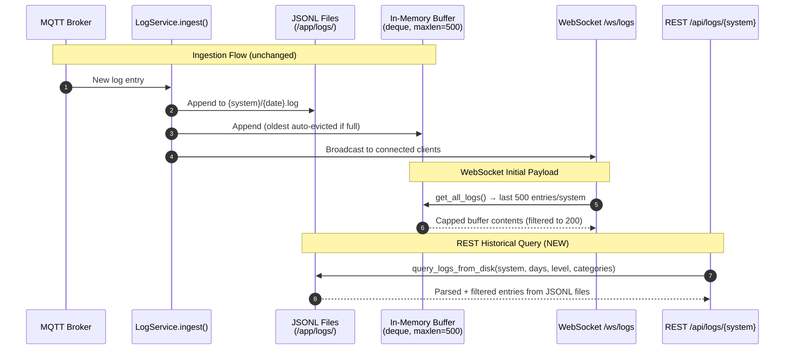

# Disk-Backed Log Storage

Refactor `LogService` to minimize backend memory usage by capping the in-memory buffer to a small ring buffer and reading from disk-based JSONL files for REST/historical queries. Add a Docker volume mount for log persistence across container restarts.

## Motivation

The current `LogService` stores **every log entry within the retention window in memory** (`self._logs: dict[str, list[LogEntry]]`). This happens unconditionally on MQTT message receipt — regardless of whether any client is viewing the Logs tab. On a Raspberry Pi with only 2 GB of RAM, this unbounded in-memory accumulation competes with the Python runtime, MQTT client, FastAPI, and the OS itself.

Key problems with the current architecture:

1. **Unbounded memory growth**: The in-memory list has no size cap — only a daily TTL prune (every 24 hours). If a taptap container enters an error loop, thousands of entries accumulate in RAM before the next prune cycle.
2. **Duplicate storage**: Every entry exists in both memory AND on disk (JSONL files). The disk copy is write-only — it is loaded into memory at startup but never read during normal operation.
3. **No volume mount**: The log directory (`/app/logs`) is inside the container's ephemeral filesystem. Logs are lost on every container restart or rebuild, forcing a full re-accumulation from MQTT replay.
4. **REST reads from memory**: The `GET /api/logs/{system}` endpoint reads from `self._logs` (the full in-memory store), making the disk files redundant during normal operation.

The fix: cap the in-memory buffer to a fixed number of recent entries (for WebSocket initial payloads and live broadcast), and have the REST endpoint read directly from disk files. Add a Docker volume so logs persist across restarts.

## Functional Requirements

### FR-1: Capped In-Memory Buffer

**FR-1.1:** The `LogService` MUST replace the unbounded `self._logs: dict[str, list[LogEntry]]` with a capped ring buffer per system using `collections.deque(maxlen=N)`. The default buffer size MUST be 500 entries per system, configurable via the `LOG_BUFFER_SIZE` environment variable (minimum 100, maximum 5000).

**FR-1.2:** When a new entry is ingested and the buffer is full, the oldest entry MUST be silently dropped from the in-memory buffer. The entry remains on disk (per existing JSONL persistence).

**FR-1.3:** The `get_all_logs()` method (used by the WebSocket initial payload) MUST return entries from the capped buffer only. The existing WebSocket pipeline applies in order: (1) read from capped buffer (up to `buffer_size` entries per system), (2) apply the connection's level and category filters, (3) take the last `WS_INITIAL_LOG_LIMIT` (200) entries from the filtered set, (4) send to client. The 200 limit applies to post-filtered entries, not to the buffer size.

**FR-1.4:** The `_prune_memory()` method MUST be updated to work with deques. Since deques auto-evict old entries, TTL-based pruning is no longer needed for size management. However, `_prune_memory()` MUST still remove entries older than the configured retention period and clean up empty system entries (to prevent ghost sub-tabs). The method iterates the deque and rebuilds it with only non-expired entries. **Note:** In practice, `_prune_memory()` is unlikely to remove entries from a 500-entry buffer since all buffered entries will be recent (~1 day). However, the method MUST be preserved as a defensive measure for correctness if `buffer_size` is set very large (e.g., 5000), if entries have timestamps far in the past (e.g., from historical replay), and as the cleanup mechanism for empty system entries. **Critical implementation detail:** The pruned result MUST be wrapped in `deque(..., maxlen=self.buffer_size)`, NOT left as a plain list — see code sample below.

**FR-1.5:** The `load_from_disk()` method MUST populate each system's deque with only the **most recent `buffer_size` entries** (not the entire retention window). It reads files in chronological order and keeps a running deque per system — old entries naturally fall off as new ones are appended. This ensures startup memory usage matches steady-state usage.

### FR-2: Disk-Backed REST Queries

**FR-2.1:** The `GET /api/logs/{system}` REST endpoint MUST read log entries directly from JSONL files on disk instead of the in-memory buffer. This is the core change that decouples REST query capability from memory usage. The synchronous `query_logs_from_disk()` call MUST be wrapped in `asyncio.to_thread()` in the async REST handler to avoid blocking the event loop during file I/O (critical on Raspberry Pi with slow SD card storage).

**FR-2.2:** A new method `query_logs_from_disk(system, retention, min_level, excluded_categories)` MUST be added to `LogService`. The `retention` parameter is an optional `timedelta`; if `None`, `self.retention` is used. This method:
1. Identifies all JSONL files for the system within the `days` window (files named `YYYY-MM-DD.log`)
2. Reads each file line-by-line (no full-file loading)
3. Parses each JSON line and validates the entry schema
4. Applies level filtering (`filter_by_level`) and category filtering (`filter_by_category`)
5. Returns the filtered entries as a list, sorted by timestamp descending (newest first)

**FR-2.3:** The `query_logs_from_disk()` method MUST handle malformed lines gracefully (skip with debug log), consistent with `load_from_disk()` behavior. Files that don't match the `YYYY-MM-DD.log` naming pattern MUST be skipped. File-open errors (e.g., `OSError`) MUST be caught and logged as warnings, continuing to the next file. This is critical because `query_logs_from_disk()` runs in a thread (via `asyncio.to_thread`) and may race with the pruning loop — a file could be deleted between `glob()` and `open()`.

**FR-2.4:** The `query_logs_from_disk()` method MUST always re-parse level and category from each disk entry using `_parse_level()` and `_classify_category()`, consistent with `load_from_disk()` behavior. This ensures entries are classified identically whether viewed via WebSocket (from buffer, populated by `load_from_disk()`) or REST (from disk, via `query_logs_from_disk()`). It also provides defensive handling for entries that may lack these fields (e.g., manually created entries, partially written entries, or entries from future format changes).

**FR-2.5:** The REST endpoint MUST continue to support `limit` and `offset` pagination parameters. Since entries are read from disk, the endpoint applies pagination after filtering and sorting. The `total` count in the response reflects the full filtered count (before pagination). **Known limitation:** Since new entries may arrive between paginated requests, offset-based pagination may return duplicate entries or skip entries. The frontend deduplicates by `seq` field (existing behavior in `fetchOlderLogs()`: `existingSeqs.has(e.seq)`), which mitigates duplicates. Skipped entries are acceptable for this use case given the low log volume.

**FR-2.6:** The `GET /api/logs/systems` endpoint MUST derive the system list from **both** the in-memory buffer keys AND the disk directory listing. A system that has disk-only data (entries older than the buffer window) MUST still appear in the systems list. The merged list is deduplicated.

### FR-3: Docker Volume Mount

**FR-3.1:** The `dashboard/docker-compose.yml` MUST add a bind mount for the log directory:
```yaml
volumes:
  - ./backend/logs:/app/logs
```
This persists logs across container restarts and rebuilds. The `./backend/logs` path is relative to the `dashboard/` directory (i.e., `dashboard/backend/logs/` on the host).

**FR-3.2:** The directory `dashboard/backend/logs/` MUST be added to `.gitignore` (it contains runtime data, not source code).

### FR-4: Configuration

**FR-4.1:** The `Settings` class MUST add a `log_buffer_size` configuration option:
```python
log_buffer_size: int = Field(default=500, ge=100, le=5000)
```
Configurable via the `LOG_BUFFER_SIZE` environment variable.

**FR-4.2:** The `LOG_RETENTION_DAYS` environment variable MUST be replaced by `LOG_RETENTION`, which accepts a duration string with a unit suffix:
- `"7d"` — 7 days (default)
- `"8h"` — 8 hours
- `"30m"` — 30 minutes

If no unit suffix is provided, the value is treated as days for backward compatibility (e.g., `"7"` = `"7d"`). The parsed value MUST be stored internally as a `timedelta`. The minimum retention is 10 minutes; the maximum is 30 days. Values outside this range MUST raise a validation error at startup.

The `Settings` class MUST replace `log_retention_days: int` with:
```python
log_retention: str = Field(default="7d")

@field_validator("log_retention")
@classmethod
def validate_retention(cls, v: str) -> str:
    """Parse duration string like '7d', '8h', '30m'. Plain int treated as days."""
    td = parse_retention(v)
    if td < timedelta(minutes=10):
        raise ValueError("LOG_RETENTION must be at least 10m")
    if td > timedelta(days=30):
        raise ValueError("LOG_RETENTION must be at most 30d")
    return v
```

A helper function `parse_retention(value: str) -> timedelta` MUST be added:
```python
import re

def parse_retention(value: str) -> timedelta:
    """Parse a duration string into a timedelta.

    Supported formats: '7d' (days), '8h' (hours), '30m' (minutes).
    Plain integers are treated as days for backward compatibility.
    """
    value = value.strip().lower()
    match = re.fullmatch(r"(\d+)\s*([dhm])?", value)
    if not match:
        raise ValueError(f"Invalid retention format: {value!r}. Use e.g. '7d', '8h', '30m'")
    amount = int(match.group(1))
    unit = match.group(2) or "d"
    if unit == "d":
        return timedelta(days=amount)
    elif unit == "h":
        return timedelta(hours=amount)
    elif unit == "m":
        return timedelta(minutes=amount)
    raise ValueError(f"Unknown unit: {unit}")
```

**FR-4.3:** `LogService` MUST accept a `retention: timedelta` parameter instead of `retention_days: int`. All internal cutoff calculations MUST use this timedelta directly:
```python
cutoff = datetime.now(timezone.utc) - self.retention
```
This replaces the current `timedelta(days=self.retention_days)` pattern.

### FR-5: WebSocket Total Counts

**FR-5.1:** The WebSocket initial payload currently includes `total_counts` per system. The frontend uses `total_counts` to determine whether older entries exist for lazy loading (`hasOlder[sys] = loaded < total`). With the capped buffer, `total_counts` MUST still provide totals from disk to preserve the lazy-loading feature. The WebSocket handler MUST compute totals by calling `query_logs_from_disk()` for each system, wrapped in `asyncio.to_thread()` to avoid blocking the event loop (consistent with FR-2.1). This adds a disk read during WebSocket connect, but log files are small (~350 KB) and this happens only once per connection. **Note:** When the 50,000 entry cap in `query_logs_from_disk()` triggers, `total_counts` reflects the capped count, not the true disk total. This is acceptable because the cap only triggers during extreme error loops (>50K entries), and the REST endpoint's `has_more` field still enables pagination.

**FR-5.2:** The initial payload entries continue to come from the capped buffer (via `get_all_logs()`, filtered to `WS_INITIAL_LOG_LIMIT = 200`). Only the `total_counts` values are sourced from disk. This means: buffer provides the fast initial entries, disk provides the accurate total for lazy-load decisions, and the REST endpoint handles lazy-load data requests.

**FR-5.3:** For disk-only systems (in the systems list but not in the buffer), the WebSocket initial payload MUST include the system with an empty entry array and a disk-based total count. This allows the frontend to show the system sub-tab and trigger lazy loading. The WebSocket handler pseudocode:

```python
all_systems = log_service.get_systems()  # buffer + disk merged
buffer_logs = log_service.get_all_logs()  # buffer only
filtered_logs = {}
total_counts = {}
for sys in all_systems:
    entries = buffer_logs.get(sys, [])  # empty for disk-only systems
    filtered = LogService.filter_by_level(entries, req_level)
    filtered = LogService.filter_by_category(filtered, excluded)
    filtered_logs[sys] = filtered[-WS_INITIAL_LOG_LIMIT:]
    # Disk-based total for lazy-loading (wrapped in to_thread per FR-2.1)
    disk_total = await asyncio.to_thread(
        lambda s=sys: len(log_service.query_logs_from_disk(
            s, None, req_level, excluded  # None = use configured retention
        ))
    )
    total_counts[sys] = disk_total
```

### FR-6: Disk Pruning and Background Maintenance

**FR-6.1:** The existing `prune_old_logs()` method MUST delete `.log` files from disk whose date (parsed from the `YYYY-MM-DD.log` filename) is older than the retention period. Empty system directories MUST be removed after pruning. This method is synchronous and operates on the filesystem directly.

**FR-6.2:** The existing `_pruning_loop()` background task MUST run on a **scaled interval** based on the retention period:
- Retention >= 1 day: prune every 24 hours (current behavior)
- Retention >= 1 hour but < 1 day: prune every hour
- Retention < 1 hour: prune every 10 minutes

This ensures disk storage is bounded at approximately `retention + one_prune_interval` worth of data at worst. The prune interval MUST be computed once at startup:

```python
def _compute_prune_interval(self) -> float:
    """Return prune loop sleep interval in seconds."""
    total_seconds = self.retention.total_seconds()
    if total_seconds >= 86400:  # >= 1 day
        return 86400.0  # prune daily
    elif total_seconds >= 3600:  # >= 1 hour
        return 3600.0  # prune hourly
    else:
        return 600.0  # prune every 10 minutes
```

**FR-6.3:** The `_pruning_loop()` MUST call both `prune_old_logs()` (disk cleanup) and `_prune_memory()` (buffer cleanup) each cycle:
```python
async def _pruning_loop(self) -> None:
    interval = self._compute_prune_interval()
    while True:
        try:
            await asyncio.sleep(interval)
            deleted = self.prune_old_logs()
            if deleted:
                logger.info(f"Pruned {deleted} old log files")
            self._prune_memory()
        except asyncio.CancelledError:
            raise
        except Exception:
            logger.exception("Error in pruning loop")
```

**FR-6.4:** At startup, `prune_old_logs()` MUST run **before** `load_from_disk()` to avoid loading stale data into the buffer only to immediately discard it. This is the existing behavior and MUST be preserved.

**FR-6.5:** For sub-day retention periods, `prune_old_logs()` MUST use the full timestamp cutoff (not just the date) when deciding whether to delete a file. Since log files are named by date (`YYYY-MM-DD.log`), a file from today may contain entries both within and outside an 8-hour retention window. The method MUST NOT delete files whose date is today or yesterday (relative to the retention cutoff). Only files whose entire date is older than the cutoff date SHOULD be deleted. Entries within retained files that are older than the retention period are filtered out at read time by `query_logs_from_disk()` and `_prune_memory()`.

**Known limitation:** With sub-day retention (e.g., `8h`), today's log file may contain entries outside the retention window that are not deleted from disk until the file's date passes the cutoff. This is acceptable because: (1) a single day's log file is small (~50 KB per CCA for typical volumes), (2) read-time filtering ensures only entries within the retention window are returned, and (3) the file will be deleted on the next day's prune cycle.

## Non-Functional Requirements

**NFR-1.1:** Steady-state memory usage for log storage MUST be bounded at approximately `buffer_size * avg_entry_size * num_systems`. With defaults (500 entries, ~400 bytes/entry, 2 systems), this is ~400 KB — down from potentially unbounded growth.

**NFR-1.2:** REST query latency for `GET /api/logs/{system}` with default parameters (`retention=7d, limit=1000`) MUST complete within 500ms for typical log volumes (~3,500 entries per CCA for 7 days). Reading and parsing ~350 KB of JSONL per system is well within this budget on both Pi and server hardware. **Error-loop protection:** The `query_logs_from_disk()` method MUST enforce a hard cap of 50,000 filtered entries. If the cap is reached during file reading, the method stops reading and returns the entries collected so far. This prevents memory exhaustion when a CCA enters an error loop (the spec's primary motivation) producing tens of thousands of entries. The `total` count in this case reflects the capped result, not the true disk total.

**NFR-1.3:** The refactor MUST NOT change the MQTT ingestion flow. Every entry is still written to disk AND appended to the in-memory buffer AND broadcast to WebSocket clients. The only change is that the in-memory buffer is capped.

**NFR-1.4:** The refactor MUST NOT change the WebSocket live streaming behavior. New entries continue to be pushed to connected clients in real-time as they arrive. The `_broadcast_entry()` method's per-connection level and category filtering MUST be preserved — each connection's `min_level` and `excluded_categories` (stored in `self._connections: dict[WebSocket, tuple[int, set[str]]]`) are applied before sending.

**NFR-1.5:** The refactor MUST NOT change the log file format (JSONL with `ts`, `line`, `seq`, `level`, `category` fields). Existing log files on disk remain valid and readable.

## High Level Design



### Data Flow Summary

| Operation | Source | Memory Impact |
|-----------|--------|---------------|
| MQTT ingest | → Disk + Buffer + WS broadcast | Bounded (deque maxlen) |
| WS initial payload | ← Buffer (last N entries) | No additional allocation |
| WS live stream | ← Broadcast from ingest | No storage (fire-and-forget) |
| REST query | ← Disk files (JSONL) | Temporary (GC'd after response) |
| Startup load | Disk → Buffer (last N only) | Bounded (deque maxlen) |

### LogService Changes

```python
from collections import deque

class LogService:
    def __init__(self, log_dir: str, retention: timedelta, buffer_size: int = 500):
        self.log_dir = Path(log_dir)
        self.retention = retention
        self.buffer_size = buffer_size
        # CHANGED: bounded deque instead of unbounded list
        self._logs: dict[str, deque[LogEntry]] = {}
        self._connections: dict[WebSocket, tuple[int, set[str]]] = {}
        self._last_seq: dict[str, int] = {}
        self._has_debug: dict[str, bool] = {}

    async def ingest(self, system: str, entry: dict) -> bool:
        # ... validation unchanged ...

        # Enrich entry with level, category, debug tracking (PRESERVED)
        entry["level"] = self._parse_level(entry.get("line", ""))
        if entry["level"] == "debug":
            self._has_debug[system] = True
        entry["category"] = self._classify_category(entry.get("line", ""))

        # ... disk write unchanged (append enriched entry to JSONL) ...

        # CHANGED: use deque with maxlen (was: unbounded list)
        if system not in self._logs:
            self._logs[system] = deque(maxlen=self.buffer_size)
        self._logs[system].append(entry)

        # Per-connection filtering in _broadcast_entry() is PRESERVED:
        # each connection's (min_level, excluded_categories) from
        # self._connections dict is checked before sending.
        await self._broadcast_entry(system, entry)
        return True

    def _prune_memory(self) -> None:
        """Remove expired entries and clean up empty systems.

        CRITICAL: Must rebuild as deque(maxlen=...), NOT a list.
        Using a list comprehension without wrapping in deque() would
        silently revert to unbounded memory growth.
        """
        cutoff = datetime.now(timezone.utc) - self.retention
        cutoff_str = cutoff.isoformat()
        empty_systems = []
        for system, buf in self._logs.items():
            pruned = deque(
                (e for e in buf if e.get("ts", "") >= cutoff_str),
                maxlen=self.buffer_size,
            )
            self._logs[system] = pruned
            if not pruned:
                empty_systems.append(system)
        for system in empty_systems:
            del self._logs[system]
            self._has_debug.pop(system, None)
            self._last_seq.pop(system, None)

    def query_logs_from_disk(
        self,
        system: str,
        retention: timedelta | None = None,
        min_level: str = "info",
        excluded_categories: set[str] | None = None,
    ) -> list[LogEntry]:
        """Read and filter log entries from JSONL files on disk.

        Returns entries sorted by timestamp descending (newest first).
        If retention is None, uses self.retention.
        """
        if not self._validate_system(system):
            return []
        system_dir = self.log_dir / system
        if not system_dir.is_dir():
            return []

        cutoff = datetime.now(timezone.utc) - (retention or self.retention)
        cutoff_date = cutoff.date()
        cutoff_str = cutoff.isoformat()
        excluded = excluded_categories or set()

        MAX_ENTRIES = 50_000  # Hard cap to prevent memory exhaustion from error loops
        entries: list[LogEntry] = []
        # Read files in REVERSE chronological order (newest first) so that
        # if the 50K cap triggers, we keep the most recent entries — the ones
        # most useful for debugging error loops.
        for log_file in sorted(system_dir.glob("*.log"), reverse=True):
            try:
                file_date = datetime.strptime(log_file.stem, "%Y-%m-%d").date()
                if file_date < cutoff_date:
                    continue
            except ValueError:
                continue
            try:
                f = open(log_file, "r")
            except OSError:
                logger.warning(f"Cannot open {log_file}, skipping")
                continue
            with f:
                for raw_line in f:
                    raw_line = raw_line.strip()
                    if not raw_line:
                        continue
                    try:
                        data = json.loads(raw_line)
                    except json.JSONDecodeError:
                        logger.debug(f"Skipping malformed line in {log_file}")
                        continue
                    if not (
                        isinstance(data, dict)
                        and isinstance(data.get("ts"), str)
                        and data.get("ts")
                        and isinstance(data.get("line"), str)
                        and isinstance(data.get("seq"), int)
                        and data.get("seq") >= 0
                    ):
                        continue
                    # Always re-parse level and category for consistency
                    # with load_from_disk() — ensures classification logic
                    # changes apply uniformly to buffer and REST views.
                    data["level"] = self._parse_level(data.get("line", ""))
                    data["category"] = self._classify_category(data.get("line", ""))
                    # Apply timestamp cutoff
                    if data.get("ts", "") < cutoff_str:
                        continue
                    # Apply level filter
                    entry_level_val = LEVEL_VALUES.get(data.get("level", "info"), 20)
                    min_level_val = LEVEL_VALUES.get(min_level, 20)
                    if entry_level_val < min_level_val:
                        continue
                    # Apply category filter
                    entry_cat = data.get("category", CATEGORY_GENERAL)
                    if entry_cat in ALWAYS_HIDDEN or entry_cat in excluded:
                        continue
                    entries.append(data)
                    if len(entries) >= MAX_ENTRIES:
                        break
            if len(entries) >= MAX_ENTRIES:
                break

        # Sort newest first
        entries.sort(key=lambda e: e.get("ts", ""), reverse=True)
        return entries

    def get_disk_systems(self) -> list[str]:
        """Return system names that have log directories on disk."""
        if not self.log_dir.exists():
            return []
        systems = []
        for d in self.log_dir.iterdir():
            if d.is_dir() and self._validate_system(d.name):
                # Only include if directory has .log files
                if any(d.glob("*.log")):
                    systems.append(d.name)
        return systems

    def get_systems(self) -> list[str]:
        """Return merged system list from buffer + disk."""
        buffer_systems = set(self._logs.keys())
        disk_systems = set(self.get_disk_systems())
        return sorted(buffer_systems | disk_systems)

    def load_from_disk(self) -> None:
        """On startup, populate the capped buffer with the most recent entries."""
        try:
            self.log_dir.mkdir(parents=True, exist_ok=True)
        except OSError as e:
            logger.error(f"Cannot create log directory {self.log_dir}: {e}")
            return
        cutoff = datetime.now(timezone.utc) - self.retention
        cutoff_date = cutoff.date()
        for system_dir in self.log_dir.iterdir():
            if not system_dir.is_dir():
                continue
            system = system_dir.name
            if not self._validate_system(system):
                continue
            buf = deque(maxlen=self.buffer_size)
            has_debug = False
            for log_file in sorted(system_dir.glob("*.log")):
                try:
                    file_date = datetime.strptime(log_file.stem, "%Y-%m-%d").date()
                    if file_date < cutoff_date:
                        continue
                except ValueError:
                    continue
                with open(log_file, "r") as f:
                    for raw_line in f:
                        raw_line = raw_line.strip()
                        if not raw_line:
                            continue
                        try:
                            data = json.loads(raw_line)
                        except json.JSONDecodeError:
                            continue
                        if (
                            isinstance(data, dict)
                            and isinstance(data.get("ts"), str)
                            and data.get("ts")
                            and isinstance(data.get("line"), str)
                            and isinstance(data.get("seq"), int)
                            and data.get("seq") >= 0
                        ):
                            data["level"] = self._parse_level(data.get("line", ""))
                            if data["level"] == "debug":
                                has_debug = True
                            data["category"] = self._classify_category(data.get("line", ""))
                            buf.append(data)  # deque auto-evicts oldest
            if buf:
                self._logs[system] = buf
                if has_debug:
                    self._has_debug[system] = True
```

### REST Endpoint Changes

```python
@app.get("/api/logs/{system}")
async def get_logs(
    system: str,
    days: int = Query(default=7, ge=1, le=30),
    limit: int = Query(default=1000, ge=1, le=5000),
    offset: int = Query(default=0, ge=0),
    level: str = Query(default="info"),
    exclude: str = Query(default=""),
):
    if log_service is None:
        raise HTTPException(status_code=503, detail="Log service not available")
    if not LogService._validate_system(system):
        raise HTTPException(status_code=404, detail="System not found")

    # CHANGED: Check both buffer and disk for system existence
    if system not in log_service.get_systems():
        raise HTTPException(status_code=404, detail="System not found")

    req_level = level.lower() if level.lower() in VALID_LOG_LEVELS else "info"
    excluded = {c.strip() for c in exclude.split(",") if c.strip()}
    excluded = excluded & set(FILTERABLE_CATEGORIES.keys())

    # CHANGED: Read from disk instead of memory.
    # Wrapped in to_thread to avoid blocking the asyncio event loop
    # during file I/O on Raspberry Pi hardware.
    # Convert client-requested days to timedelta, capped by server retention.
    requested = timedelta(days=days)
    retention = min(requested, log_service.retention)
    all_filtered = await asyncio.to_thread(
        log_service.query_logs_from_disk,
        system, retention, req_level, excluded,
    )

    total = len(all_filtered)
    entries = all_filtered[offset : offset + limit]

    return {
        "system": system,
        "entries": entries,
        "total": total,
        "has_more": offset + limit < total,
    }
```

### Lifespan Initialization Changes

```python
# In main.py lifespan function — updated LogService construction:
from config import parse_retention

log_service = LogService(
    settings.log_dir,
    retention=parse_retention(settings.log_retention),  # NEW: timedelta
    buffer_size=settings.log_buffer_size,  # NEW parameter
)
```

### Docker Compose Changes

```yaml
# In dashboard/docker-compose.yml, backend service:
volumes:
  - ../config:/app/config
  - ./backend/assets:/app/assets
  - ../tigo-mqtt/data/primary:/app/state/primary:ro
  - ../tigo-mqtt/data/secondary:/app/state/secondary:ro
  - ./backend/logs:/app/logs  # NEW: persist logs across restarts
```

## Task Breakdown

### Task 1: Add Docker Volume Mount and Gitignore

**Files:** `dashboard/docker-compose.yml`, `.gitignore`

1. Add `./backend/logs:/app/logs` volume mount to the backend service in `docker-compose.yml`
2. Add `dashboard/backend/logs/` to `.gitignore`

### Task 2: Update Configuration (Buffer Size + Retention Duration)

**Files:** `dashboard/backend/app/config.py`

1. Add `log_buffer_size: int = Field(default=500, ge=100, le=5000)` to `Settings`
2. Replace `log_retention_days: int = Field(default=7, ge=1, le=30)` with `log_retention: str = Field(default="7d")`
3. Add `parse_retention()` helper function and `validate_retention` field validator
4. MAY add `LOG_BUFFER_SIZE=500` and `LOG_RETENTION=7d` to `docker-compose.yml` environment for documentation clarity

### Task 3: Refactor LogService In-Memory Storage

**Files:** `dashboard/backend/app/log_service.py`

1. Import `collections.deque` and `timedelta`
2. Change `__init__` to accept `retention: timedelta` and `buffer_size: int` parameters (replacing `retention_days: int`)
3. Change `self._logs` type from `dict[str, list[LogEntry]]` to `dict[str, deque[LogEntry]]`
4. Update `ingest()` to create `deque(maxlen=self.buffer_size)` per system
5. Update `_prune_memory()` to work with deques (rebuild deque with non-expired entries)
6. Update `load_from_disk()` to populate deques with only the most recent `buffer_size` entries
7. Update `_pruning_loop()` to use `_compute_prune_interval()` for adaptive prune scheduling
8. Update `query_logs_from_disk()` signature to accept `retention: timedelta | None` instead of `days: int`
9. Verify `get_all_logs()` already returns list copies (via `list()` constructor), which works correctly with deques — no code changes needed
10. Verify `get_logs_for_system()` similarly — `list()` on deque works identically to `list()` on list

### Task 4: Add Disk-Backed Query Method

**Files:** `dashboard/backend/app/log_service.py`

1. Add `query_logs_from_disk()` method that reads JSONL files, filters, and returns sorted entries
2. Add `get_disk_systems()` method that lists system directories with `.log` files
3. Update `get_systems()` to merge buffer keys with disk directory listing

### Task 5: Update REST Endpoint to Read from Disk

**Files:** `dashboard/backend/app/main.py`

1. Update `get_logs()` to call `log_service.query_logs_from_disk()` instead of `log_service.get_logs_for_system()`
2. Remove the manual level/category filtering in the endpoint (now handled by `query_logs_from_disk()`)
3. Update system existence check to use the merged `get_systems()` list

### Task 6: Update LogService Initialization in Lifespan

**Files:** `dashboard/backend/app/main.py`

1. Import `parse_retention` from config
2. Pass `retention=parse_retention(settings.log_retention)` and `buffer_size=settings.log_buffer_size` to `LogService()` constructor

### Task 7: Build, Deploy, and Verify

1. Rebuild containers: `cd dashboard && docker compose up --build -d`
2. Verify logs directory is mounted: `ls -la dashboard/backend/logs/`
3. **Buffer cap test:** Inject 600+ entries via `POST /api/test/inject-log`, then verify:
   - WebSocket initial payload has <= 500 entries per system
   - REST `GET /api/logs/{system}` returns all 600+ entries (from disk)
   - `total` in REST response matches the actual count on disk
4. **Lazy-load test:** Open Logs tab, verify "Load more" triggers and loads older entries from REST endpoint
5. **Persistence test:** Restart container (`docker compose restart backend`), then verify:
   - REST endpoint returns persisted entries
   - WebSocket initial payload is populated from disk (not empty)
   - `dashboard/backend/logs/` contains JSONL files on host
6. **Malformed file test:** Manually add a file with invalid JSON lines to the logs directory, verify `query_logs_from_disk()` skips them without returning a 500 error
7. **Merged systems test:** Manually create a system directory with a `.log` file on the volume mount, verify it appears in `GET /api/logs/systems`

## Related Specifications

| Spec | Relationship | Notes |
|------|--------------|-------|
| [CCA Log Viewer](2026-02-08-cca-log-viewer.md) | extends | This spec refactors the log storage architecture introduced by the CCA Log Viewer spec. All external interfaces (WebSocket protocol, REST API, frontend behavior) remain unchanged. |

## Context / Documentation

- `dashboard/backend/app/log_service.py` — Current implementation with unbounded in-memory storage (the primary file being refactored)
- `dashboard/backend/app/main.py` — WebSocket and REST endpoints for logs (lines 386-474)
- `dashboard/backend/app/config.py` — Pydantic settings class (replace `log_retention_days` with `log_retention` duration string, add `log_buffer_size`)
- `dashboard/docker-compose.yml` — Container orchestration (add volume mount)
- `docs/specs/2026-02-08-cca-log-viewer.md` — Original CCA Log Viewer spec (v1.6) that defined the current architecture
- Python `collections.deque` — https://docs.python.org/3/library/collections.html#collections.deque

---

**Specification Version:** 1.3
**Last Updated:** February 2026
**Authors:** Ian, Claude

## Changelog

### v1.3 (February 2026)
**Summary:** Add disk pruning requirements and duration-string retention configuration

**Changes:**
- Added FR-4.2: Replace `LOG_RETENTION_DAYS` (int) with `LOG_RETENTION` (duration string supporting `"7d"`, `"8h"`, `"30m"`)
- Added FR-4.3: `LogService` accepts `retention: timedelta` instead of `retention_days: int`
- Added FR-6: Disk Pruning and Background Maintenance (FR-6.1 through FR-6.5)
- Added adaptive prune interval that scales with retention period (daily for days, hourly for hours, every 10 min for minutes)
- Documented known limitation: sub-day retention cannot prune entries within the current day's log file
- Updated all code samples to use `timedelta` instead of `retention_days: int`
- Updated `query_logs_from_disk()` signature to accept `retention: timedelta | None`
- Updated task breakdown for new configuration and pruning tasks

### v1.2 (February 2026)
**Summary:** Address review findings (iteration 2: 5 issues)

**Changes:**
- Fixed 50K entry cap to read files in reverse chronological order (newest first), ensuring error-loop diagnostics return recent entries
- Added `asyncio.to_thread()` wrapping for disk reads in WebSocket handler (consistent with REST handler)
- Added WebSocket handler pseudocode for FR-5.3 disk-only system handling
- Documented 50K cap interaction with total_counts accuracy in FR-5.1
- Clarified Task 3 steps 7-8 as verification-only (no code changes needed)

### v1.1 (February 2026)
**Summary:** Address review findings (iteration 1: 19 issues)

**Changes:**
- Expanded `ingest()` code sample to show preserved `_parse_level()`, `_classify_category()`, and `_has_debug` tracking
- Added `_prune_memory()` code sample showing proper deque reconstruction (prevents silent list regression)
- Fixed FR-5 to provide disk-based `total_counts` in WebSocket payload, preserving frontend lazy-loading
- Added FR-5.3 for disk-only system handling in WebSocket initial payload
- Clarified FR-1.3 filtering pipeline (buffer → filter → take last 200)
- Added `asyncio.to_thread()` wrapping for `query_logs_from_disk()` in REST handler
- Made level/category parsing consistent between `load_from_disk()` and `query_logs_from_disk()` (always re-parse)
- Added `try/except OSError` around file opens in `query_logs_from_disk()`
- Added 50,000 entry hard cap to `query_logs_from_disk()` for error-loop protection
- Documented offset-based pagination instability and existing `seq` deduplication
- Documented `_broadcast_entry()` per-connection filtering in NFR-1.4
- Documented pruning/query race condition when using `asyncio.to_thread()`
- Added `_prune_memory()` rationale for deque buffers
- Added lifespan initialization code sample
- Expanded Task 7 with specific acceptance test scenarios
- Removed unnecessary FR-3.3 (frontend build context doesn't include backend/logs)
- Reframed FR-2.4 from "backward compatibility" to "defensive handling"
- Changed "Optionally add" to "MAY add" for RFC 2119 consistency

### v1.0 (February 2026)
**Summary:** Initial specification

**Changes:**
- Initial specification created
