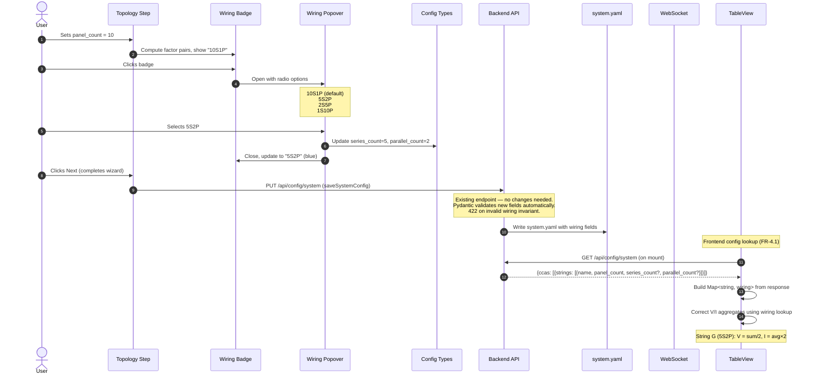

# String Series-Parallel Wiring Configuration

Add support for specifying the electrical wiring topology (series-parallel configuration) of each panel string during setup, and use it to correctly calculate string-level and system-level voltage and current aggregates in the TableView.

## Motivation

Solar panel strings can be wired in different series-parallel configurations. The most common is all-series (e.g., 10S1P), where all panel voltages are additive and current is uniform. However, some strings use series-parallel configurations like 5S2P (two parallel groups of 5 panels in series), which halves the string voltage and doubles the current.

Currently, the system assumes all strings are wired in pure series. The TableView calculates string-level voltage as the sum of all panel voltages and current as the average. For strings with non-standard wiring (e.g., String G in the user's installation, which is 5S2P), these aggregates are incorrect — the displayed voltage is double the actual string voltage, and the current display does not reflect the parallel grouping.

The `xSyP` notation is a widely-used convention in the solar, battery, and electronics industries for describing series-parallel configurations, where S = panels in series per group and P = number of parallel groups. While not codified in a single formal standard, this notation appears extensively in solar installer documentation, inverter datasheets (e.g., SMA, Enphase, SolarEdge string sizing guides), and battery pack design references. See also IEC 62548 (Photovoltaic arrays — Design requirements) for the underlying series-parallel topology concepts.

## Functional Requirements

### FR-1: StringConfig Data Model Extension

**FR-1.1:** The `StringConfig` type (frontend `types/config.ts` and backend `config_models.py`) SHALL be extended with two optional fields:

```typescript
// Frontend uses snake_case to match the backend JSON response directly.
// The backend Pydantic model uses snake_case natively, and the API
// serializes with snake_case field names. No alias mapping is needed.
interface StringConfig {
  name: string;
  panel_count: number;
  series_count?: number;    // S — panels in series per group
  parallel_count?: number;  // P — number of parallel groups
}
```

> **Naming Convention:** The frontend TypeScript types use `snake_case` (e.g., `panel_count`, `series_count`) to match the backend API's JSON serialization format. This is consistent with the existing `StringConfig` interface in `types/config.ts`. No camelCase aliasing or `alias_generator` is involved for these config types.

**FR-1.2:** When `series_count` and `parallel_count` are both omitted or null, the string SHALL be treated as all-series: `series_count = panel_count`, `parallel_count = 1`. This ensures backward compatibility with existing configs. The backend Pydantic model enforces `ge=1` on both fields, rejecting zero or negative values at the validation layer. The frontend does not need independent constraint validation — the UI only offers valid factor pairs via the popover (FR-2), making invalid values unrepresentable through normal interaction. The backend is the single validation boundary for direct API calls or manual YAML edits.

> **Note — String Name Constraint Dependency:** `StringConfig.name` is constrained to a single uppercase letter (A-Z) in the current implementation (`max_length=1`, regex `^[A-Z]$`), despite the Phase 1 multi-user config spec allowing 1-2 letters. This spec depends on the single-letter constraint for correct wiring badge display and string-to-wiring lookup by name.
>
> **Lookup mechanism:** The wiring config lookup uses a `Map<string, {series_count, parallel_count}>` keyed by string name (case-sensitive, exact match). Duplicate string names are prevented by the existing topology step validation (which rejects duplicate names). The 26-string maximum (A-Z) is an implicit system limit inherited from the current naming scheme.
>
> **Migration path:** If string names are expanded to multi-character in the future, the wiring badge display needs only minor CSS adjustment (the badge already uses `white-space: nowrap`), and the lookup map key type (`string`) requires no change. The coupling is limited to badge visual sizing, not architectural.

**FR-1.3:** The invariant `series_count * parallel_count === panel_count` MUST hold. The backend SHALL enforce this via a Pydantic model validator. The `PUT /api/config/system` endpoint SHALL reject any `SystemConfig` where this invariant is violated, returning HTTP 422 with the standard error response shape (`{"detail": [{"loc": [...], "msg": "...", "type": "value_error"}]}`). This format matches Pydantic's default `ValidationError` serialization as used by FastAPI's built-in request validation handler. If the project has a custom error envelope middleware that wraps Pydantic errors, that middleware applies here too — the spec describes the pre-middleware Pydantic shape. The frontend SHALL prevent invalid states through constrained UI controls (FR-2), but the backend is the authoritative validation boundary — direct API submissions and manual `system.yaml` edits are validated on load.

**FR-1.4:** The YAML serialization SHALL omit `series_count` and `parallel_count` when they equal the all-series default (`series_count == panel_count` and `parallel_count == 1`), keeping existing config files clean. This is a conscious design decision: if a user explicitly selects the default configuration (e.g., `10S1P` for a 10-panel string), their explicit choice is normalized to the implicit default on save. The round-trip behavior is functionally identical — the string behaves as all-series in both cases — but the user's intent to "confirm the default" is not preserved in YAML. This keeps config files minimal and avoids false diffs.

### FR-2: Topology Step UI — Wiring Badge with Popover

**FR-2.1:** Each string row in the Topology Step SHALL display a **wiring badge** after the "panels" label. The badge shows the current configuration in `xSyP` shorthand notation (e.g., `10S1P`, `5S2P`). The WiringBadge SHALL treat `undefined`, `null`, and omitted `series_count`/`parallel_count` identically — all cases default to all-series (`series_count = panel_count`, `parallel_count = 1`). This ensures correct behavior for newly added strings which are created without wiring fields.

**FR-2.2:** The wiring badge SHALL have two visual states:

- **Default (all-series):** Muted appearance — light gray background (`#f0f0f0`), dark gray text (`#666`), 12px font, 4px border-radius. Indicates no customization. Contrast ratio: ~5.7:1 (passes WCAG AA).
- **Customized (non-default):** Highlighted appearance — light blue background (`#e3f2fd`), blue text (`#1565c0`), same size. Immediately signals that this string has non-standard wiring. Contrast ratio: ~5.6:1 (passes WCAG AA with comfortable margin at 12px small text).

> **Dark mode:** Dark mode is not currently supported by the dashboard. If dark mode support is added in the future, these badge colors will need dark-mode variants. This is out of scope for this spec.

**FR-2.3:** Clicking the wiring badge SHALL open a **popover** anchored below the badge, containing:

- A title: "Wiring for String {name}" (e.g., "Wiring for String G")
- A radio group listing all valid wiring configurations for the current `panel_count`
- Each radio option SHALL display:
  - The `xSyP` notation in bold
  - A human-readable description (e.g., "2 parallel groups of 5 in series")
  - The all-series option (`P = 1`) SHALL be annotated with "(default)"
  - The all-parallel option (`S = 1, P > 1`) SHALL be annotated with "(uncommon)". This annotation is driven by an `isUncommon` field on `WiringOption` (see Factor Pair Computation).
  - For `panel_count = 2`, the popover shows two radio options (`2S1P`, `1S2P`) — a radio group is acceptable for binary choices and is consistent with larger counts.

**FR-2.4:** Valid wiring configurations SHALL be computed as all factor pairs `(S, P)` of the `panel_count` where `S * P = panel_count`, `S >= 1`, `P >= 1`, ordered by descending `S` (series-first ordering):

| panel_count | Valid Configurations |
|------------|---------------------|
| 1 | 1S1P |
| 7 (prime) | 7S1P, 1S7P |
| 8 | 8S1P, 4S2P, 2S4P, 1S8P |
| 10 | 10S1P, 5S2P, 2S5P, 1S10P |
| 12 | 12S1P, 6S2P, 4S3P, 3S4P, 2S6P, 1S12P |

**FR-2.4.1:** If the number of wiring options exceeds 6, the radio group within the popover SHALL be scrollable with a `max-height` of 300px and `overflow-y: auto`. In practice, solar strings rarely have more than 20 panels, and most panel counts have few factor pairs, so this is an edge case for highly composite numbers (e.g., 48, 60).

**FR-2.5:** Selecting a radio option SHALL immediately update the string's `series_count` and `parallel_count`, close the popover after a 200ms delay (to show the selection visually), and update the badge text. Re-selecting the already-active option SHALL close the popover immediately without the 200ms delay (no state change occurs, so no visual confirmation is needed). During the 200ms close delay:
- The radio group becomes read-only (further option selections are ignored).
- The badge click handler SHALL be a no-op (clicking the badge does not cancel or restart the close sequence).
- If the user clicks outside the popover during the delay, the popover closes immediately (the selection is already applied, so no data is lost).
- The close timer SHALL be cleaned up on component unmount (via `useEffect` cleanup or equivalent) to prevent setting state on an unmounted component.
- If the popover is somehow reopened before the timer completes (e.g., via keyboard), the timer SHALL be cancelled.

**FR-2.6:** For `panel_count = 1`, the badge SHALL show `1S1P` in muted style and SHALL NOT be clickable (no popover, `cursor: default`, no hover effect). There is only one possible configuration.

**FR-2.7:** When the user changes a string's `panel_count`:

- If the current `(series_count, parallel_count)` pair is still a valid factor pair of the new `panel_count`, it SHALL be preserved.
- If the current pair is no longer valid, the wiring SHALL silently reset to all-series (`series_count = new_panel_count`, `parallel_count = 1`) and the badge SHALL update accordingly.
- If `panel_count` changes to 1, the wiring resets to `1S1P` and the badge becomes non-clickable per FR-2.6.
- If `panel_count` is transiently invalid (e.g., user is typing and the input briefly shows `0` or empty), the wiring badge SHALL not render until `panel_count >= 1`. The `getWiringOptions()` function returns an empty array for `panel_count < 1`.
- If the popover is open during a panel count change, it SHALL close.
- When a string is removed entirely from the topology, its wiring configuration is discarded with the rest of its `StringConfig` state — no special garbage collection is needed.
- Wiring configuration changes do not trigger downstream wizard step invalidation. Wiring is cosmetic metadata that affects only TableView display calculations, not panel assignment or serial entry. The implementer SHALL verify that the existing topology step invalidation logic compares only `name` and `panel_count` fields (ignoring `series_count` and `parallel_count`). If the invalidation check uses deep equality on the full `StringConfig` object, it must be updated to exclude wiring fields — otherwise any wiring change would incorrectly invalidate downstream steps like serial entry.

**FR-2.8:** The string row layout SHALL be:

```
[ A ] : [ 10 ] panels  [10S1P]  [×]
```

The badge SHALL have `min-width: 48px`, `text-align: center`, and `white-space: nowrap` to prevent text wrapping within the badge. On viewports narrower than 480px, the badge SHALL wrap below the "panels" label within the flex row (`flex-wrap: wrap` on the row container with `gap: 4px`). The delete button `[x]` SHALL have `margin-left: auto` to stay pinned to the right end of the first row, producing the wrapped layout: `[Name] [Count] panels [x]` on the first line and `[Badge]` on the second line.

### FR-3: Popover Behavior and Accessibility

**FR-3.1:** The popover SHALL close when:
- The user selects an option (after 200ms delay per FR-2.5)
- The user clicks outside the popover
- The user presses Escape
- The user scrolls the page (the popover SHALL close on scroll — this is the simplest and most predictable behavior, avoiding the jank of scroll-driven repositioning)

**FR-3.2:** Only one popover SHALL be open at a time. Opening a popover for one string SHALL close any other open popover.

**FR-3.3:** The popover SHALL be rendered via `ReactDOM.createPortal` to `document.body` to avoid clipping by overflow containers (the TopologyStep form may be scrollable). The popover position SHALL be calculated from the badge's `getBoundingClientRect()` and applied as `position: fixed` relative to the viewport. If the available space below the badge is less than the popover's rendered height (measured after initial mount via `getBoundingClientRect` on the popover element), the popover SHALL flip to open above it.

> **CSS Transform Caveat:** The `position: fixed` + `getBoundingClientRect()` approach assumes no CSS `transform` ancestors between the badge and `document.body`. The current TopologyStep does not use CSS transforms. If transforms are introduced in the future, the positioning calculation must account for the transform offset. The `createPortal` to `document.body` mitigates most cases since the portal escapes the transform context.

**FR-3.4:** The wiring badge SHALL be keyboard-accessible per the WAI-ARIA `radiogroup` pattern:
- The badge SHALL have `tabIndex={0}`, `role="button"`, `aria-haspopup="dialog"`, and `aria-expanded` reflecting popover state (`true`/`false`).
- Enter/Space opens the popover.
- When the popover opens, focus SHALL move to the currently-selected radio option (per WAI-ARIA radio group pattern). If no option is selected, focus lands on the first option.
- Arrow Up/Down keys navigate radio options within the popover. Home/End keys move to the first/last option respectively.
- Escape closes the popover and returns focus to the badge.
- The popover is NOT a focus trap — Tab moves focus out of the popover, and the popover closes on focus leaving it (blur). This matches standard popover behavior (not dialog behavior). The popover currently contains only the radiogroup. If additional focusable elements are added in the future (e.g., a "Learn more" link or close button), the Tab order within the popover must be explicitly specified at that time.

**FR-3.5:** The badge SHALL have a dynamically-constructed `aria-label` describing the current configuration. The label SHALL use plural "groups" when P > 1 and singular "group" when P = 1, and use device-agnostic activation language:
- Default (all-series): `"String A wiring: 10 panels in series, 1 parallel group. Activate to change."`
- Customized: `"String G wiring: 5 panels in series, 2 parallel groups. Activate to change."`
- Single panel (non-interactive): `"String X wiring: 1 panel, 1 parallel group."`

**FR-3.6:** The popover radio group SHALL use `role="radiogroup"` with `aria-label="Wiring configuration for String A"`.

### FR-4: TableView Voltage and Current Corrections

**FR-4.1:** The wiring configuration SHALL be made available to the TableView via **frontend config lookup**. The frontend SHALL load the `SystemConfig` (via `GET /api/config/system`, which already includes all `StringConfig` fields in its response) and build a lookup `Map<string, {series_count, parallel_count}>` keyed by string name. String names are unique across the entire `SystemConfig` (not just per-CCA) — the existing topology step validation enforces global uniqueness across all CCAs, so a flat `Map<string, wiring>` is safe with no key collisions. The Map is built by iterating all `ccas[].strings[]` and inserting each string's name and wiring fields. The `StringSection` and `TableView` components SHALL use this map to look up wiring config by the panel's `string` field. This avoids adding per-panel fields to every WebSocket broadcast and avoids modifying `panel_service`'s data flow.

**Stale config handling:** The `SystemConfig` is fetched once on TableView mount. If the user changes wiring configuration in the setup wizard (in the same or another tab), or if an admin edits `system.yaml` directly on disk, the TableView will use stale config until page refresh. The `PUT /api/config/system` endpoint writes to `system.yaml` AND updates the backend's in-memory config state, ensuring subsequent `GET` requests from any client return the new values immediately (no backend restart needed for wizard saves). Direct YAML edits on disk are NOT picked up until backend restart, since the backend reads `system.yaml` into memory at startup. This is acceptable because: (a) wiring config changes are rare (initial setup only), (b) the wizard requires completing all steps and saving before changes take effect, (c) direct YAML edits require a backend restart for the backend to pick up changes, and (d) adding a config-change polling or WebSocket event is out of scope for this feature. A manual page refresh after wizard completion is the expected flow.

> **Rejected alternative — Backend injection:** The backend's `panel_service` could inject `series_count`/`parallel_count` into each `PanelData` on every WebSocket broadcast. This was rejected because it increases message size by ~34 bytes per panel (2.3KB for 69 panels per broadcast), requires modifying the `panel_service` data flow, and couples panel broadcast logic to config state. The frontend lookup approach is simpler and has no runtime cost beyond the initial config fetch.

**FR-4.2:** The `StringSection` component's summary calculation SHALL use the wiring configuration to compute correct aggregates. Display formatting:
- Corrected voltage: 1 decimal place (e.g., "175.9V"), consistent with existing voltage display
- Corrected current: 1 decimal place (e.g., "16.2A"), consistent with existing current display
- The summary computation returns raw `number` values. Display formatting (`.toFixed(1)`) is applied in the JSX render layer, not in the `useMemo` computation (e.g., `{summary.voltage.toFixed(1)}V`). This preserves numeric precision for any downstream arithmetic such as system-level aggregation
- Individual panel rows continue to show raw (uncorrected) values — only string-level and system-level summaries apply wiring correction
- No visual indicator is added to distinguish corrected vs uncorrected summaries — for P=1 strings, the values are identical to the pre-feature calculation, and for P>1 strings the corrected values ARE the correct values (not an alternate view)

**For a string with configuration `SsPp` (S panels in series, P parallel groups):**

- **String Voltage** = Sum of all online panel voltages / P
  - Rationale: The string output voltage equals the voltage across one series group (S panels in series). Since the monitoring system does not track which physical panels belong to which parallel group, we approximate by dividing the total voltage sum by P. This assumes approximately uniform voltage distribution across parallel groups, which holds under normal operating conditions. Mathematically, Sum(all) / P = Sum(one group of S) when groups are balanced.
  - **Approximation limitations:** This formula's accuracy degrades when panels are offline. For P=1 (all-series), offline panels simply reduce the voltage sum proportionally — the approximation is still representative. For P>1, offline panels may be unevenly distributed across parallel groups, causing the formula to over- or under-estimate string voltage. Example: 10 panels as 5S2P, 2 panels offline from the same group → formula gives `Sum(8 voltages) / 2`, but the actual string voltage is clamped to the lower-voltage group.
  - The system does not know which panels belong to which parallel group, so no corrective calculation is possible. The approximation is acceptable for monitoring purposes — the primary use case is identifying anomalies, not precise electrical measurement.
- **String Current** = Average of all online panel `current_in` values × P
  - Rationale: In a series circuit, the same current flows through all panels — the current at any point equals the current at every other point. Therefore, averaging the panel-level current readings gives the best estimate of the current through one series group. Multiplying by P accounts for the parallel groups whose currents add at the string output.
  - For P=1 (all-series): String Current = Average of panel currents (identical to the existing calculation — no behavioral change on deployment).
  - For P>1: String Current = Average × P. Example: 10 panels as 5S2P, each reading ~8A → average = 8A, string current = 8A × 2 = 16A.
  - **`current_in` availability:** The `current_in` field is part of the extended WebSocket format. If `current_in` is `null` or `undefined` for a panel (e.g., panel hasn't reported extended metrics yet), that panel is excluded from the current average. If ALL panels in a string have null `current_in`, the string current displays as null (no fallback derivation from `watts / voltage` is performed — the derived value would reflect optimizer I/O, not string-level current, and could be misleading).
  - Note: This formula is an approximation assuming the optimizer-reported currents are representative of the current at each panel's position. With DC-DC optimizers, the actual current at each panel output may differ from the optimizer input current.
- **String Power** = Sum of all online panel watts (unchanged — power is always additive regardless of wiring topology)

**FR-4.3:** The system-level summary (Primary System / Secondary System headers) SHALL use a two-level aggregation — first computing per-string corrected values, then aggregating to the system level:

1. **For each string in the system**, compute:
   - `corrected_voltage = sum(panel voltages in string) / P_string`
   - `corrected_current = avg(panel currents in string) × P_string`
2. **System Voltage** = Sum of all `corrected_voltage` values across strings in the system. This assumes strings are connected in series to the inverter input, which matches the standard string inverter topology used in this installation. For systems with parallel string inputs or micro-inverters, summing string voltages is not electrically meaningful — but this matches the existing (pre-feature) calculation behavior and is preserved for consistency.
3. **System Current** = Average of all `corrected_current` values across strings. This is a monitoring convenience metric — averaging currents across strings with different configurations (e.g., one 5S2P and one 10S1P) does not represent a single physical measurement, but provides a useful per-string current indicator for the inverter. If the strings array is empty (no strings in system), system current SHALL display as null/dash rather than NaN. Guard: `strings.length > 0 ? sum / strings.length : null`.
4. **System Power** = Sum of all panel watts across all strings (unchanged — power is always additive)

This replaces the current flat-reduce pattern (which iterates over all panels in a system without string-level grouping) with a two-pass approach: group panels by string, compute per-string summaries, then aggregate. Panels without a `string` field (undefined or null) are excluded from string-level grouping and do not contribute to system-level aggregates.

```typescript
// System-level aggregation — in TableView systemSummaries computation
// wiringMap: Map<string, {series_count?, parallel_count?}> from config fetch
function computeSystemSummary(
  systemPanels: PanelData[],
  wiringMap: Map<string, { series_count?: number | null; parallel_count?: number | null }>
) {
  // Step 1: Group panels by string name (exclude panels without a string field)
  const byString = new Map<string, PanelData[]>();
  for (const panel of systemPanels) {
    if (panel.string == null) continue; // Skip ungroupable panels
    const existing = byString.get(panel.string) ?? [];
    existing.push(panel);
    byString.set(panel.string, existing);
  }

  // Step 2: Compute per-string corrected summaries
  const stringSummaries: { voltage: number; current: number | null; power: number }[] = [];
  for (const [stringName, panels] of byString) {
    const wiring = wiringMap.get(stringName);
    const { parallel: P } = getEffectiveWiring(wiring ?? {});
    const onlinePanels = panels.filter(p => p.online !== false);

    const voltage = onlinePanels.reduce(
      (sum, p) => sum + ((p.voltage_in ?? p.voltage) ?? 0), 0
    ) / P;

    const currents = onlinePanels
      .map(p => p.current_in)
      .filter((c): c is number => c != null);
    const current = currents.length > 0
      ? (currents.reduce((a, b) => a + b, 0) / currents.length) * P
      : null;

    const power = onlinePanels.reduce((sum, p) => sum + (p.watts ?? 0), 0);
    stringSummaries.push({ voltage, current, power });
  }

  // Step 3: Aggregate to system level
  const systemVoltage = stringSummaries.reduce((sum, s) => sum + s.voltage, 0);
  const validCurrents = stringSummaries.filter(s => s.current != null);
  const systemCurrent = validCurrents.length > 0
    ? validCurrents.reduce((sum, s) => sum + s.current!, 0) / validCurrents.length
    : null;
  const systemPower = stringSummaries.reduce((sum, s) => sum + s.power, 0);

  return { voltage: systemVoltage, current: systemCurrent, power: systemPower };
}
```

> **Note:** The existing `STRING_TO_INVERTER` hardcoded mapping in `TableView.tsx` determines which strings belong to which system. This is a pre-existing issue outside the scope of this spec — the mapping should eventually be replaced with the `panel.system` field from MQTT data. Implementers should be aware that system-level grouping currently depends on this mapping.

**FR-4.4:** When wiring configuration is not available for a string (e.g., during the transition period before config is updated, or while the `GET /api/config/system` fetch is in-flight), the calculation SHALL fall back to the all-series assumption (`P = 1`): voltage = sum of panel voltages, current = average of panel currents. This matches both the current behavior and the corrected formula for P=1, ensuring no visible change in displayed values when the feature is deployed without configuration changes.

**Initial load sequence:** On TableView mount, the config fetch and first WebSocket data may arrive in any order. If WebSocket data arrives before config: summaries render with P=1 fallback, then update with corrected values once config loads. For P=1 strings (the majority), there is no visible change. For P>1 strings, there may be a brief value correction on config load. This is acceptable — adding a loading state for summary rows is not warranted since the config fetch is typically <100ms and the P=1 fallback produces reasonable (not broken) values.

### FR-5: Backup and Restore Compatibility

**FR-5.1:** The backup export SHALL include `series_count` and `parallel_count` in the `SystemConfig` portion of the backup manifest when they differ from the all-series default.

**FR-5.2:** On restore, if `series_count` and `parallel_count` are absent from the backup data, the system SHALL treat the string as all-series (backward compatibility with pre-feature backups). On restore, the backend SHALL validate the invariant `series_count * parallel_count == panel_count` for each string via the existing Pydantic model validation (the restore deserializes through `SystemConfig` model via `SystemConfig.model_validate()`, which validates all strings in a single pass). If validation fails, the restore SHALL reject the entire backup atomically (no partial application) with a descriptive error that includes the string name and specific invariant violation (e.g., "String G: series_count (5) x parallel_count (3) does not equal panel_count (10)"). The Pydantic `ValidationError` is surfaced to the restore API response — the frontend displays the error message from the response body.

**FR-5.3:** The backup version number SHALL NOT be incremented — the new fields are optional and additive, requiring no migration. This relies on the existing `SystemConfig` model using Pydantic's default `extra='ignore'` behavior, which silently ignores unknown fields during deserialization.

**Test case (FR-5.3-T1):** Deserialize a `SystemConfig` JSON containing an unknown field (e.g., `{"future_field": true}` added to a `StringConfig` entry) using `SystemConfig.model_validate()`. Verify the unknown field is silently ignored and the model is valid. If this test fails, `extra='forbid'` is set somewhere in the model hierarchy and must be changed to `extra='ignore'` before this feature can ship. This test SHALL be included in Task 12 (unit tests).

### FR-6: Configuration File Persistence

**FR-6.1:** When the setup wizard saves `system.yaml`, the `series_count` and `parallel_count` fields SHALL be written for strings with non-default wiring configurations. Strings using the default all-series configuration SHALL omit these fields. This relies on the existing `save_system_config()` mechanism which uses atomic write (write-to-temp + rename) and last-write-wins semantics. No additional concurrency protection is introduced — concurrent wizard saves from multiple tabs result in the last save overwriting the previous, consistent with existing behavior.

**FR-6.2:** Example `system.yaml` with mixed configurations:

```yaml
ccas:
  - name: "primary"
    serial_device: "/dev/ttyACM2"
    strings:
      - name: "A"
        panel_count: 10
        # series_count and parallel_count omitted = all-series (10S1P)
      - name: "B"
        panel_count: 8
  - name: "secondary"
    serial_device: "/dev/ttyACM3"
    strings:
      - name: "G"
        panel_count: 10
        series_count: 5
        parallel_count: 2
        # Explicitly stored because 5S2P ≠ default 10S1P
```

## Non-Functional Requirements

**NFR-1:** The wiring badge SHALL meet the 44x44px minimum touch target size (consistent with existing NFR-2.1 in the TableView spec). The touch target SHALL be extended using the established project pattern: a `::after` pseudo-element with `min-height: 44px; min-width: 44px` for touch devices, with `@media (pointer: fine)` reducing to the visual badge size on mouse-driven interfaces. This keeps the visual badge compact (~36px height) while meeting touch accessibility requirements.

**NFR-2:** The popover SHALL be visible within 100ms of the badge click event (no loading spinner or skeleton is needed). Factor pair computation is O(N) where N is `panel_count` (iterating all potential divisors) and completes in microseconds for realistic panel counts (<=60). The portal mount + position measurement may take 1-2 frames (~32ms), well within the 100ms budget. Testable via Playwright `expect(popover).toBeVisible({ timeout: 1000 })` — the 1000ms Playwright timeout provides headroom for CI environments while the 100ms requirement defines the user-facing performance contract.

**NFR-3:** Since FR-4.1 mandates the frontend lookup approach, the WebSocket message size is unchanged by this feature. No per-panel wiring fields are added to the broadcast.

**NFR-4:** The wiring badge and popover SHALL be implemented without adding external **runtime** dependencies. Dev dependencies (e.g., testing utilities like `@testing-library/user-event`) are acceptable. The popover uses `ReactDOM.createPortal` (built-in React API) with standard DOM positioning (`getBoundingClientRect` + fixed positioning).

**NFR-5:** The popover SHALL be usable on mobile viewports (375px+). On viewports narrower than 480px (same breakpoint as the badge wrapping in FR-2.8), the popover SHALL render as a portal with `position: fixed; left: 0; width: 100%; max-height: 50vh; overflow-y: auto` anchored below the badge's vertical position (via `getBoundingClientRect().bottom`). The flip-above logic (FR-3.3) SHALL NOT apply on the mobile path — if insufficient space exists below, the popover SHALL scroll within its `max-height` rather than flipping above (flipping on small screens risks pushing the popover off-screen entirely). A single 480px breakpoint governs both badge wrapping and popover rendering mode, avoiding awkward intermediate states.

## High Level Design



### Factor Pair Computation

A utility function computes valid wiring configurations:

```typescript
interface WiringOption {
  series: number;
  parallel: number;
  label: string;       // e.g., "5S2P"
  description: string; // e.g., "2 parallel groups of 5 in series"
  isDefault: boolean;  // true when P === 1 (all-series)
  isUncommon: boolean;  // true when S === 1 && P > 1 (all-parallel)
}

function getWiringOptions(panelCount: number): WiringOption[] {
  // For panelCount = 1, returns a single-element array [{label: '1S1P', ...}].
  // The badge uses `options.length > 1` (not `> 0`) to determine clickability,
  // since a single option means no choice is available (FR-2.6).
  if (panelCount < 1) return [];
  const options: WiringOption[] = [];
  for (let s = panelCount; s >= 1; s--) {
    if (panelCount % s === 0) {
      const p = panelCount / s;
      let description: string;
      if (p === 1) description = 'all in series';
      else if (s === 1) description = 'all in parallel';
      else description = `${p} parallel groups of ${s} in series`;

      options.push({
        series: s,
        parallel: p,
        label: `${s}S${p}P`,
        description,
        isDefault: p === 1,
        isUncommon: s === 1 && p > 1,
      });
    }
  }
  return options;
}
// Note: This iterates all values from panelCount to 1 (O(N)), not O(sqrt(N)).
// For realistic panel counts (<=60), performance is identical. The O(N) approach
// naturally produces the desired descending-S ordering without a separate sort.
```

### Corrected String Summary Calculation

```typescript
// In StringSection.tsx summary computation
// wiringConfig is looked up from SystemConfig by string name (see FR-4.1)
//
// Note on field names: The WebSocket message uses `voltage_in` and `current_in`
// for the extended format. The frontend PanelData type includes both `voltage`
// (legacy alias) and `voltage_in`. The `??` fallback handles both naming
// conventions. All numeric coalescing uses `?? 0` consistently (not `||`)
// to correctly handle legitimate zero values.
const summary = useMemo(() => {
  // Includes panels where online is true, undefined, or null (see note below).
  // Stale panels (online=true, stale=true) are included — excluding them would
  // cause summary values to drop suddenly when staleness triggers. The existing
  // StringSection behavior includes stale panels, and this spec preserves that.
  const onlinePanels = panels.filter(p => p.online !== false);
  // Null-handling note: Panels with null/undefined voltage contribute 0 to the
  // voltage sum (neutral — adding 0 doesn't distort a sum). Panels with null
  // `current_in` are excluded from the current average (to avoid diluting the
  // average with zeros, which would undercount string current). This asymmetry
  // is intentional and matches the mathematical properties of sum vs average.
  const totalVoltageRaw = onlinePanels.reduce(
    (sum, p) => sum + ((p.voltage_in ?? p.voltage) ?? 0), 0
  );
  const totalPower = onlinePanels.reduce(
    (sum, p) => sum + (p.watts ?? 0), 0
  );
  const currents = onlinePanels
    .map(p => p.current_in)
    .filter((c): c is number => c != null);
  const avgCurrent = currents.length > 0
    ? currents.reduce((a, b) => a + b, 0) / currents.length
    : null;

  // Get wiring config — default to all-series if not configured.
  // Uses getEffectiveWiring for DRY defaulting (see utility definition above).
  // Math.max inside getEffectiveWiring guards against a hypothetical
  // parallel_count of 0 (which Pydantic prevents with ge=1, but
  // defense-in-depth avoids division by zero).
  const { parallel: parallelCount } = getEffectiveWiring(wiringConfig ?? {});

  return {
    voltage: totalVoltageRaw / parallelCount,       // Divide by parallel groups
    power: totalPower,
    current: avgCurrent != null
      ? avgCurrent * parallelCount                  // Average × P
      : null,
    onlineCount: onlinePanels.length,
    totalCount: panels.length,
  };
}, [panels, wiringConfig]);
// Note: `panels` must be a new array reference on each WebSocket update for the
// memo to recompute. The existing WebSocket handler creates a new array via
// spread/map, so this is satisfied. If the data flow changes to mutate the array
// in place, the memo would produce stale results.
```

### Backend Model Changes

```python
# config_models.py
class StringConfig(BaseModel):
    """A string of panels with optional series-parallel wiring config."""
    name: str = Field(..., min_length=1, max_length=1)
    panel_count: int = Field(..., ge=1)
    series_count: Optional[int] = Field(default=None, ge=1)
    parallel_count: Optional[int] = Field(default=None, ge=1)

    @model_validator(mode='after')
    def validate_wiring(self) -> 'StringConfig':
        # Validate invariant only when both fields are explicitly provided.
        # Do NOT mutate None → defaults here — preserving None allows
        # the @model_serializer to omit default wiring fields in YAML.
        if self.series_count is not None and self.parallel_count is not None:
            if self.series_count * self.parallel_count != self.panel_count:
                raise ValueError(
                    f"series_count ({self.series_count}) * parallel_count "
                    f"({self.parallel_count}) must equal panel_count ({self.panel_count})"
                )
        elif self.series_count is not None or self.parallel_count is not None:
            # One provided without the other — derive the missing field.
            # This convenience behavior fills in the complement automatically,
            # e.g., series_count=5 on a 10-panel string → parallel_count=2.
            # The alternative (requiring both or rejecting one-without-the-other)
            # was considered but rejected for better YAML authoring ergonomics.
            #
            # Note: This creates a non-idempotent save — loading a YAML file
            # with only `series_count: 5` and saving it will produce both
            # `series_count: 5` and `parallel_count: 2`. This is acceptable
            # since the derived field is deterministic and the resulting config
            # is functionally identical. Users who diff system.yaml after a
            # save cycle may see the added field.
            if self.series_count is not None:
                if self.panel_count % self.series_count != 0:
                    raise ValueError(
                        f"series_count ({self.series_count}) must evenly divide "
                        f"panel_count ({self.panel_count})"
                    )
                self.parallel_count = self.panel_count // self.series_count
            else:
                if self.panel_count % self.parallel_count != 0:
                    raise ValueError(
                        f"parallel_count ({self.parallel_count}) must evenly divide "
                        f"panel_count ({self.panel_count})"
                    )
                self.series_count = self.panel_count // self.parallel_count
        # When both are None, the string is all-series. Consumers apply defaults
        # at read time: series_count ?? panel_count, parallel_count ?? 1.
        #
        # Note: This validator mutates self directly. StringConfig must NOT use
        # model_config = ConfigDict(frozen=True). If immutability is needed in
        # the future, convert to mode='before' (dict mutation) instead.
        return self

    @property
    def effective_series(self) -> int:
        """Series count with default applied."""
        return self.series_count if self.series_count is not None else self.panel_count

    @property
    def effective_parallel(self) -> int:
        """Parallel count with default applied."""
        return self.parallel_count if self.parallel_count is not None else 1
```

The `effective_series` and `effective_parallel` properties provide default-applied values for use in calculations, while keeping the raw fields as `None` for clean serialization via the `@model_serializer` (see YAML Serialization below).

> **Implementation note:** Backend code that needs wiring values should use `effective_series`/`effective_parallel` properties on the model instance, NOT dict access on `model_dump()` output. The `@model_serializer` strips default wiring fields from the serialized dict, so `config.model_dump()['series_count']` will raise `KeyError` for default-wiring strings. The properties work on the model instance and always return correct values.

A corresponding frontend utility SHALL be defined in `src/utils/wiringConfig.ts` alongside `getWiringOptions`:

```typescript
/** Returns effective wiring values with defaults applied. Single source of truth
 *  for the defaulting logic (mirrors backend effective_series/effective_parallel).
 *
 *  Accepts either a full StringConfig or a partial wiring entry from the lookup Map.
 *  When called from StringSection (which has the Map entry but not panel_count),
 *  only `parallel` is used — `series` requires panel_count for the default. */
function getEffectiveWiring(
  config: { panel_count?: number; series_count?: number | null; parallel_count?: number | null }
): { series: number | null; parallel: number } {
  return {
    series: config.series_count ?? config.panel_count ?? null,
    parallel: Math.max(config.parallel_count ?? 1, 1),
  };
}
// Note: The summary calculation only uses `parallel` from the effective wiring.
// `series` is available for future use (e.g., per-group voltage display) but
// requires `panel_count` for the default, which the lookup Map entry may not include.
```

Since FR-4.1 uses the frontend lookup approach, the backend `PanelData` model does NOT need `series_count`/`parallel_count` fields. The WebSocket broadcast format is unchanged.

**Frontend PanelData type reference** (existing fields relevant to summary calculation):

```typescript
// Existing type in the frontend — NOT modified by this spec.
// The `voltage_in` and `current_in` fields were added by the WebSocket
// extended format migration. The `string` field is populated by the backend
// from panel-to-string assignment. Panels without a `string` field should
// not appear in practice (all discovered panels are assigned to a string),
// but if they do, they are excluded from wiring-corrected calculations.
interface PanelData {
  watts: number;
  voltage: number;        // Legacy field name (may be aliased from voltage_in)
  voltage_in?: number;    // Optimizer input voltage (extended format)
  current_in?: number;    // Optimizer input current (extended format)
  online: boolean;
  stale: boolean;
  string?: string;        // String name (e.g., "A", "G") — used for wiring lookup
  // ... other fields omitted for brevity
}
```

### YAML Serialization

Since the model_validator preserves `None` for default wiring configurations (see Backend Model Changes above), serialization must omit None-valued wiring fields without affecting other Optional fields in the `SystemConfig` hierarchy (e.g., `MQTTConfig.username`, `MQTTConfig.password`).

The approach uses Pydantic v2's `@model_serializer(mode='wrap')` decorator on `StringConfig`, which integrates with the compiled Rust serialization pipeline and is invoked during nested serialization from parent `model_dump()` calls:

```python
from pydantic import model_serializer

# config_models.py — StringConfig addition
class StringConfig(BaseModel):
    # ... existing fields and validator ...

    @model_serializer(mode='wrap')
    def _serialize(self, handler):
        d = handler(self)
        # Remove wiring fields when they represent the all-series default.
        #
        # After model_validator runs, the possible states are:
        #   Case A: Both None (user omitted both) — all-series default
        #   Case B: Both non-None, s==pc and p==1 — explicitly set to default
        #   Case C: Both non-None, non-default (e.g., s=5, p=2) — preserve
        #
        # Note: The "one-field-provided" validator path always fills the
        # missing field, so after validation both are either None (Case A)
        # or both non-None (Case B or C). The `s is None` check only fires
        # for Case A. The `s == pc and p == 1` check fires for Case B.
        # Case C passes both conditions as False → fields preserved. ✅
        s = d.get('series_count')
        p = d.get('parallel_count')
        pc = d.get('panel_count')
        if s is None or (s == pc and p == 1):
            d.pop('series_count', None)
        if p is None or (s == pc and p == 1):
            d.pop('parallel_count', None)
        return d
```

**Why `@model_serializer` and not `model_dump()` override:** Pydantic v2 uses a pre-compiled Rust serializer for nested models. Overriding `model_dump()` on a child class does NOT affect serialization when the parent's `model_dump()` is called — the Rust serializer bypasses Python-level method overrides. The `@model_serializer` decorator correctly hooks into this pipeline.

**Serialization paths:** The `@model_serializer` is invoked in all three serialization contexts:
1. **YAML save/load** — `config.model_dump()` → YAML write. On reload, absent fields become `None` → validator's "both None" path.
2. **API PUT/GET** — FastAPI's response serialization calls `model_dump()` on the `SystemConfig` response model, which invokes the `@model_serializer` on nested `StringConfig` instances. The `GET /api/config/system` response therefore omits wiring fields for default configs and includes them for non-default configs, consistent with YAML behavior. The frontend wiring lookup Map receives `series_count`/`parallel_count` only for non-default strings.
3. **Backup export/restore** — Uses `model_dump()` for export (serializer strips defaults) and `model_validate()` for restore (validator fills gaps). Pre-feature backups (no wiring fields) round-trip correctly via the "both None" path.

The round-trip is lossy but functionally equivalent for default configs (explicitly-set defaults are normalized to omitted — see FR-1.4). Non-default configs round-trip with full fidelity.

This scoped approach ensures:
- `StringConfig` serialization omits `series_count`/`parallel_count` when they are `None` (all-series default)
- Other `Optional` fields elsewhere in `SystemConfig` (like `MQTTConfig.username: null`) continue to serialize as before
- The existing `save_system_config()` call (`config.model_dump()`) requires no change

## Task Breakdown

1. **Extend backend `StringConfig` model** — Add `series_count` and `parallel_count` optional fields with model validator. Update YAML serialization to conditionally include fields.

2. **Wire up wiring config access in frontend** — Fetch `SystemConfig` via `getSystemConfig()` on TableView mount and build a `Map<string, {series_count, parallel_count}>` lookup for use by `StringSection` and `TableView` (per FR-4.1 frontend lookup approach).

3. **Extend frontend `StringConfig` type** — Add optional `series_count` and `parallel_count` to `types/config.ts`.

4. **Implement `getWiringOptions` utility** — Create `src/utils/wiringConfig.ts` with factor pair computation and types.

5. **Build `WiringBadge` component** — Inline badge that displays xSyP notation with default/customized styling. Clickable to open popover.

6. **Build `WiringPopover` component** — Positioned popover with radio group for selecting wiring configuration. Handles keyboard navigation, outside click, and escape-to-close.

7. **Integrate badge into `TopologyStep`** — Add `WiringBadge` to each string row. Wire up state updates for `series_count` and `parallel_count`. Handle panel count changes (revalidation/reset logic).

8. **Fix `StringSection` summary calculation** — Use wiring config to correct voltage (divide by P) and current (average × P) aggregates per FR-4.2.

9. **Fix system-level summary in `TableView`** — Update `systemSummaries` computation to use corrected per-string values.

10. **Update backup/restore** — Ensure `series_count` and `parallel_count` round-trip through backup export and restore. Verify backward compatibility with pre-feature backups. Specifically test: restore a backup created before this feature (no `series_count`/`parallel_count` in `StringConfig`) and verify the restored config has correct all-series defaults applied (both fields are `None`, effective values are `panel_count`/`1`).

11. **Verify API contract** — Confirm that the existing `PUT /api/config/system` and `GET /api/config/system` endpoints handle the new `series_count` and `parallel_count` fields correctly via Pydantic model validation. Verify 422 error response for invalid invariants. No endpoint code changes should be needed.

12. **Unit tests** — Write unit tests for:
    - `getWiringOptions()`:
      - Edge cases: `panel_count` of 1, primes, large composites, and 0
      - Ordering: verify strictly descending by `S` for all cases
      - `isDefault`: true for exactly one option (the first, P=1)
      - `isUncommon`: true for at most one option (S=1, only when P>1)
      - `label`: format matches `${S}S${P}P` pattern
      - `description`: correct text for all three branches (all-series, all-parallel, mixed)
    - `StringConfig` model validator: all branches (both fields present, one present, neither present, invalid invariant, non-divisor)
    - `StringConfig` serializer: verify default wiring fields are omitted, non-default fields are preserved, forward compatibility with unknown fields (FR-5.3-T1)
    - String-level summary calculation:
      - Voltage/current formulas with P=1 and P=2
      - All panels offline → zero voltage, null current
      - Empty panels array
      - Mixed online/offline panels in P>1 string (approximation limitation)
      - All panels have `current_in: null` → string current is null
      - Some panels have `current_in: null`, others non-null → average excludes nulls
      - `voltage_in` present vs absent (fallback to `voltage` field)
      - `wiringConfig` is `undefined` (lookup miss) → P=1 fallback
    - System-level aggregation:
      - Single string system
      - Multiple strings with mixed P values
      - Empty strings array → null current (not NaN)
      - Panels without `string` field excluded from grouping

13. **Playwright verification** — Test the full flow: set a string to 5S2P in the wizard, verify badge appearance, verify corrected voltage/current in TableView. Test at mobile viewport (375px). Verify touch target size by running the mobile viewport test with `hasTouch: true` and confirming that clicks at the edge of the 44px boundary around the badge register correctly (via `elementHandle.boundingBox()` or by clicking at offset coordinates near the badge edge).

14. **Rollback safety verification** — Confirm that `system.yaml` files with wiring fields are safely ignored by a pre-feature version of the backend (i.e., unknown fields in YAML don't cause errors). This is a manual verification step during implementation.

## Related Specifications

| Spec | Relationship | Notes |
|------|-------------|-------|
| [Multi-User Config Phase 1](implemented/2026-01-19-multi-user-config-phase1.md) | extends | Extends `StringConfig` and `SystemConfig` types; modifies TopologyStep UI and YAML serialization |
| [Backup & Restore](implemented/2026-01-24-backup-restore.md) | compatible | New optional fields round-trip through backup; no version bump needed (FR-7.4 safe-default rule) |
| [Table View UX Overhaul](implemented/2026-01-26-table-view-ux-overhaul.md) | modifies | Changes `StringSection` summary calculations (voltage/current formulas) |
| [Wizard Serial Entry](2026-02-08-wizard-serial-entry.md) | related | Serial entry step follows topology step where wiring is configured |

## Context / Documentation

- `dashboard/frontend/src/components/wizard/steps/TopologyStep.tsx` — Wizard step where wiring badge is added
- `dashboard/frontend/src/components/TableView.tsx` — System-level summary calculations to fix
- `dashboard/frontend/src/components/TableView/StringSection.tsx` — String-level summary calculations to fix
- `dashboard/frontend/src/types/config.ts` — Frontend type definitions to extend
- `dashboard/backend/app/config_models.py` — Backend Pydantic models to extend
- `dashboard/backend/app/models.py` — PanelData model (no changes needed — wiring uses frontend lookup per FR-4.1)
- Industry reference: `xSyP` notation — Series (S) × Parallel (P) = Total panels

---

**Specification Version:** 1.3
**Last Updated:** February 2026
**Authors:** Claude (Lead Architect), Claude (UX Designer)

## Changelog

### v1.3 (February 2026)
**Summary:** Third review pass — addressed 25 comments covering code-prose consistency, Pydantic round-trip verification, breakpoint details, backup/restore error handling, frontend data flow, NFR testability, and edge cases.

**Changes:**
- **[HIGH]** Added explicit case enumeration to `@model_serializer` code comments tracing all validator→serializer state paths
- **[HIGH]** Added three serialization path verification (YAML, API, Backup) with behavioral guarantees for each
- **[HIGH]** Clarified cross-CCA string name uniqueness guarantees for flat wiring lookup Map (FR-4.1)
- **[HIGH]** Added system-level aggregation code sample with panel grouping, per-string correction, and system rollup (FR-4.3)
- **[HIGH]** Expanded backup restore error handling: atomic rejection, descriptive error with string name, Pydantic ValidationError surfacing (FR-5.2)
- **[HIGH]** Expanded unit test matrix with 15+ additional scenarios across getWiringOptions, summary calculation, and system aggregation (Task 12)
- **[MEDIUM]** Added voltage vs current null-handling asymmetry explanation in summary calculation code comments
- **[MEDIUM]** Added `getWiringOptions(1)` behavior note: returns single-element array, badge uses `options.length > 1` for clickability
- **[MEDIUM]** Added non-idempotent save behavior note for one-field-provided validator path
- **[MEDIUM]** Added `model_dump()` dict access footgun warning — use `effective_*` properties instead
- **[MEDIUM]** Added mobile popover rendering details: `position: fixed; left: 0; width: 100%; max-height: 50vh`, no flip-above on mobile (NFR-5)
- **[MEDIUM]** Added wrapped row visual order clarification: delete button stays pinned right on first row (FR-2.8)
- **[MEDIUM]** Elevated FR-5.3 `extra='ignore'` verification to testable requirement with explicit test case (FR-5.3-T1)
- **[MEDIUM]** Fixed `getEffectiveWiring` type signature to accept partial wiring entries from lookup Map
- **[MEDIUM]** Updated summary calculation code to use `getEffectiveWiring` for DRY defaulting
- **[MEDIUM]** Added PUT endpoint behavior clarification: writes disk AND updates in-memory config (FR-4.1 stale config)
- **[MEDIUM]** Fixed NFR-2 testability: 100ms user-facing contract, 1000ms Playwright timeout
- **[MEDIUM]** Added touch target Playwright test instructions with `hasTouch: true` (Task 13)
- **[MEDIUM]** Clarified NFR-4: no external **runtime** dependencies (dev deps acceptable)
- **[MEDIUM]** Added 422 error format consistency note with FastAPI middleware context (FR-1.3)
- **[MEDIUM]** Added display formatting architecture note: raw numbers in useMemo, `.toFixed(1)` in JSX (FR-4.2)
- **[MEDIUM]** Added PanelData field provenance notes and string-undefined exclusion behavior
- **[MEDIUM]** Added wizard invalidation cascade verification requirement for wiring fields (FR-2.7)
- **[MEDIUM]** Removed residual Option B reference from Task Breakdown item 2
- **[MEDIUM]** Updated Context/Documentation: models.py entry now notes "no changes needed"
- **[MEDIUM]** Added re-selecting same option behavior: immediate close without 200ms delay (FR-2.5)
- **[LOW]** Updated sequence diagram: removed Option B residual, added API response shape
- **[LOW]** Fixed changelog v1.2 entry: "rejected alternatives section" → "inline rejected alternative note"
- **[LOW]** Added future-proofing note about Tab order if popover gains additional focusable elements (FR-3.4)
- **[LOW]** Added panels without `string` field exclusion from system-level grouping (FR-4.3)

### v1.2 (February 2026)
**Summary:** Second review pass — addressed 38 comments covering architecture decisions, code correctness, accessibility, edge cases, and completeness gaps.

**Changes:**
- **[CRITICAL]** Added approximation limitation discussion for voltage formula with offline panels in P>1 strings (FR-4.2)
- **[HIGH]** Mandated Option A (frontend lookup) for FR-4.1 — removed implementer choice, documented Option B rationale in inline "Rejected alternative" note under FR-4.1
- **[HIGH]** Added stale config handling and initial load race condition discussion (FR-4.1, FR-4.4)
- **[HIGH]** Added API enforcement boundary — `PUT /api/config/system` returns 422 on invalid wiring invariant (FR-1.3)
- **[HIGH]** Expanded FR-2.5 with comprehensive 200ms delay edge cases: badge click lock, outside click, unmount cleanup
- **[HIGH]** Expanded FR-2.7 with panel_count=1 behavior, panel_count<1 guard, string deletion, and downstream invalidation notes
- **[HIGH]** Added WAI-ARIA compliant keyboard interaction: focus management, Home/End keys, aria-haspopup, aria-expanded, popover-not-trap behavior (FR-3.4)
- **[HIGH]** Added `current_in` field availability discussion and null fallback behavior (FR-4.2)
- **[HIGH]** Added missing task breakdown items: API contract verification, unit tests, rollback safety verification
- **[HIGH]** Added sequence diagram note about API contract (no endpoint changes needed)
- **[HIGH]** Fixed code: `|| 0` → `?? 0` for consistent nullish coalescing, added `Math.max(parallelCount, 1)` division-by-zero guard
- **[HIGH]** Fixed code: added `isUncommon` field to `WiringOption` interface and `getWiringOptions` implementation
- **[HIGH]** Added frontend `PanelData` type reference for summary calculation context
- **[HIGH]** Added online/stale panel interaction note — stale panels included in calculations (matches existing behavior)
- **[HIGH]** Fixed backup restore validation — Pydantic validates invariant on restore, rejects corrupted backups (FR-5.2)
- **[MEDIUM]** Added xSyP notation citation with IEC 62548 reference and industry documentation sources
- **[MEDIUM]** Added snake_case naming convention note for frontend TypeScript types
- **[MEDIUM]** Added frontend validation boundary clarification — backend is single validation authority (FR-1.2)
- **[MEDIUM]** Added string name lookup mechanism details: Map key type, duplicate prevention, migration path (FR-1 Note)
- **[MEDIUM]** Added explicit default stripping design decision note (FR-1.4)
- **[MEDIUM]** Fixed blue text color from `#1976d2` to `#1565c0` for WCAG AA compliance at 12px, added contrast ratios (FR-2.2)
- **[MEDIUM]** Added popover description for `panel_count=2` edge case and `isUncommon` annotation source (FR-2.3)
- **[MEDIUM]** Changed scroll behavior from "optional" to definitive "SHALL close on scroll" (FR-3.1)
- **[MEDIUM]** Added CSS transform caveat and flip threshold measurement detail (FR-3.3)
- **[MEDIUM]** Improved aria-label: device-agnostic language ("Activate" not "Click"), plural grammar, dynamic construction (FR-3.5)
- **[MEDIUM]** Added system voltage/current formula assumptions and limitations (FR-4.3)
- **[MEDIUM]** Added empty strings array guard for system current calculation (FR-4.3)
- **[MEDIUM]** Added display formatting spec: 1 decimal place for voltage/current, raw values for individual panels (FR-4.2)
- **[MEDIUM]** Added backup version compatibility verification requirement for `extra='ignore'` (FR-5.3)
- **[MEDIUM]** Added concurrent writes and atomicity notes for YAML persistence (FR-6.1)
- **[MEDIUM]** Added touch target implementation pattern: `::after` pseudo-element with `pointer: fine` media query (NFR-1)
- **[MEDIUM]** Updated NFR-3 to reflect mandated frontend lookup approach (no WebSocket size change)
- **[MEDIUM]** Unified mobile breakpoints: 480px for both badge wrapping and popover rendering (NFR-5)
- **[MEDIUM]** Added `getEffectiveWiring()` frontend utility function for DRY defaulting logic
- **[MEDIUM]** Fixed serializer to omit explicitly-set default values per FR-1.4 (not just None)
- **[MEDIUM]** Added model_validator mutation note: StringConfig must not be frozen
- **[MEDIUM]** Removed Option B from sequence diagram, added config reload note
- **[MEDIUM]** Added hot reload / direct YAML edit behavior note
- **[LOW]** Fixed related spec links to match actual file paths in docs/specs/implemented/
- **[LOW]** Corrected O(sqrt(N)) claim to O(N) in NFR-2, aligned code comment
- **[LOW]** Changed NFR-2 from unmeasurable "16ms" to testable "no perceptible delay"
- **[LOW]** Changed badge width from "approximately 60px" to concrete CSS properties
- **[LOW]** Changed narrow viewport from MAY wrap to SHALL wrap with flex-wrap specification
- **[LOW]** Added `useMemo` dependency array note about array reference immutability

### v1.1 (February 2026)
**Summary:** Review fixes — corrected electrical formulas, improved architecture

**Changes:**
- **[CRITICAL]** Fixed string current formula from `sum(all currents)` to `avg(currents) × P` — the original was electrically incorrect (would display N× actual value for series strings)
- **[HIGH]** Added approximation disclaimer to voltage formula rationale
- **[HIGH]** Introduced two implementation options for wiring config lookup (FR-4.1): frontend config lookup (recommended) vs backend PanelData injection
- **[HIGH]** Added two-level aggregation pseudocode for system-level summaries (FR-4.3)
- **[HIGH]** Added note about single-letter string name constraint dependency
- **[MEDIUM]** Changed model_validator to preserve None for default wiring (no mutation when both fields omitted; one-field-provided still derives the other), added `effective_series`/`effective_parallel` properties, added `@model_serializer(mode='wrap')` on StringConfig to omit None wiring fields in YAML
- **[MEDIUM]** Changed popover to use `ReactDOM.createPortal` with fixed positioning to avoid overflow clipping
- **[MEDIUM]** Added scrollability for popover radio group when >6 options (FR-2.4.1)
- **[MEDIUM]** Added undefined field handling for WiringBadge (FR-2.1)
- **[MEDIUM]** Expanded Related Specifications table with multi-user-config, backup-restore, and table-view-ux-overhaul specs
- **[LOW]** Added click lock during popover close delay, pre-feature backup test case, out-of-scope note for STRING_TO_INVERTER mapping

### v1.0 (February 2026)
**Summary:** Initial specification

**Changes:**
- Initial specification created
- UX approach: Smart Badge with Popover (recommended by UX research over inline dropdown, expandable detail row, and dedicated sub-step alternatives)
- Defined data model extensions with backward compatibility
- Specified corrected voltage/current aggregation formulas
- Included accessibility requirements for badge and popover
