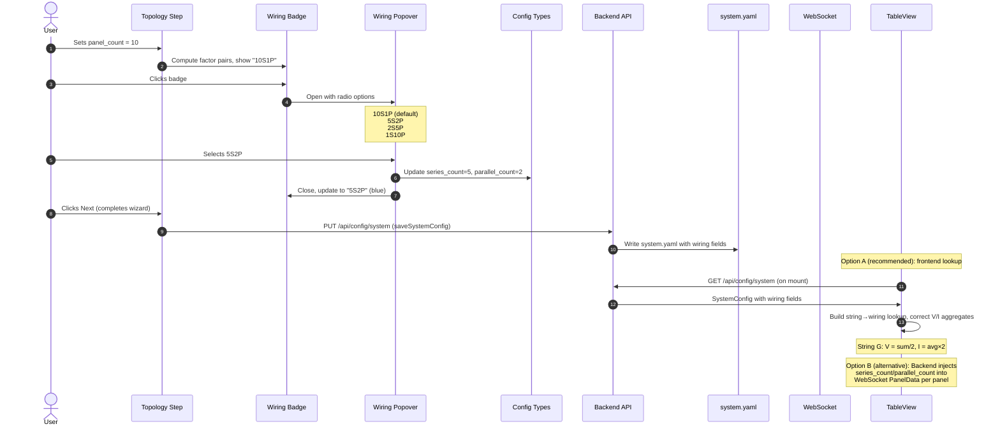

# String Series-Parallel Wiring Configuration

Add support for specifying the electrical wiring topology (series-parallel configuration) of each panel string during setup, and use it to correctly calculate string-level and system-level voltage and current aggregates in the TableView.

## Motivation

Solar panel strings can be wired in different series-parallel configurations. The most common is all-series (e.g., 10S1P), where all panel voltages are additive and current is uniform. However, some strings use series-parallel configurations like 5S2P (two parallel groups of 5 panels in series), which halves the string voltage and doubles the current.

Currently, the system assumes all strings are wired in pure series. The TableView calculates string-level voltage as the sum of all panel voltages and current as the average. For strings with non-standard wiring (e.g., String G in the user's installation, which is 5S2P), these aggregates are incorrect — the displayed voltage is double the actual string voltage, and the current display does not reflect the parallel grouping.

The `xSyP` notation is an established industry standard used across solar, battery, and electronics domains, where S = panels in series per group and P = number of parallel groups.

## Functional Requirements

### FR-1: StringConfig Data Model Extension

**FR-1.1:** The `StringConfig` type (frontend `types/config.ts` and backend `config_models.py`) SHALL be extended with two optional fields:

```typescript
interface StringConfig {
  name: string;
  panel_count: number;
  series_count?: number;    // S — panels in series per group
  parallel_count?: number;  // P — number of parallel groups
}
```

**FR-1.2:** When `series_count` and `parallel_count` are both omitted or null, the string SHALL be treated as all-series: `series_count = panel_count`, `parallel_count = 1`. This ensures backward compatibility with existing configs.

> **Note:** `StringConfig.name` is constrained to a single uppercase letter (A-Z) in the current implementation (`max_length=1`, regex `^[A-Z]$`), despite the Phase 1 multi-user config spec allowing 1-2 letters. This spec depends on the single-letter constraint for correct wiring badge display and string-to-wiring lookup by name.

**FR-1.3:** The invariant `series_count * parallel_count === panel_count` MUST hold. The backend SHALL enforce this via a Pydantic model validator. The frontend SHALL prevent invalid states through constrained UI controls (FR-2).

**FR-1.4:** The YAML serialization SHALL omit `series_count` and `parallel_count` when they equal the all-series default (`series_count == panel_count` and `parallel_count == 1`), keeping existing config files clean.

### FR-2: Topology Step UI — Wiring Badge with Popover

**FR-2.1:** Each string row in the Topology Step SHALL display a **wiring badge** after the "panels" label. The badge shows the current configuration in `xSyP` shorthand notation (e.g., `10S1P`, `5S2P`). The WiringBadge SHALL treat `undefined`, `null`, and omitted `series_count`/`parallel_count` identically — all cases default to all-series (`series_count = panel_count`, `parallel_count = 1`). This ensures correct behavior for newly added strings which are created without wiring fields.

**FR-2.2:** The wiring badge SHALL have two visual states:

- **Default (all-series):** Muted appearance — light gray background (`#f0f0f0`), dark gray text (`#666`), 12px font, 4px border-radius. Indicates no customization.
- **Customized (non-default):** Highlighted appearance — light blue background (`#e3f2fd`), blue text (`#1976d2`), same size. Immediately signals that this string has non-standard wiring.

**FR-2.3:** Clicking the wiring badge SHALL open a **popover** anchored below the badge, containing:

- A title: "Wiring for String {name}" (e.g., "Wiring for String G")
- A radio group listing all valid wiring configurations for the current `panel_count`
- Each radio option SHALL display:
  - The `xSyP` notation in bold
  - A human-readable description (e.g., "2 parallel groups of 5 in series")
  - The all-series option SHALL be annotated with "(default)"
  - The all-parallel option SHALL be annotated with "(uncommon)"

**FR-2.4:** Valid wiring configurations SHALL be computed as all factor pairs `(S, P)` of the `panel_count` where `S * P = panel_count`, `S >= 1`, `P >= 1`, ordered by descending `S` (series-first ordering):

| panel_count | Valid Configurations |
|------------|---------------------|
| 1 | 1S1P |
| 7 (prime) | 7S1P, 1S7P |
| 8 | 8S1P, 4S2P, 2S4P, 1S8P |
| 10 | 10S1P, 5S2P, 2S5P, 1S10P |
| 12 | 12S1P, 6S2P, 4S3P, 3S4P, 2S6P, 1S12P |

**FR-2.4.1:** If the number of wiring options exceeds 6, the radio group within the popover SHALL be scrollable with a `max-height` of 300px and `overflow-y: auto`. In practice, solar strings rarely have more than 20 panels, and most panel counts have few factor pairs, so this is an edge case for highly composite numbers (e.g., 48, 60).

**FR-2.5:** Selecting a radio option SHALL immediately update the string's `series_count` and `parallel_count`, close the popover after a 200ms delay (to show the selection visually), and update the badge text. During the 200ms close delay, further option selections SHALL be ignored (the radio group becomes read-only). If the popover is reopened before the timer completes, the timer SHALL be cancelled.

**FR-2.6:** For `panel_count = 1`, the badge SHALL show `1S1P` in muted style and SHALL NOT be clickable (no popover, `cursor: default`, no hover effect). There is only one possible configuration.

**FR-2.7:** When the user changes a string's `panel_count`:

- If the current `(series_count, parallel_count)` pair is still a valid factor pair of the new `panel_count`, it SHALL be preserved.
- If the current pair is no longer valid, the wiring SHALL silently reset to all-series (`series_count = new_panel_count`, `parallel_count = 1`) and the badge SHALL update accordingly.
- If the popover is open during a panel count change, it SHALL close.

**FR-2.8:** The string row layout SHALL be:

```
[ A ] : [ 10 ] panels  [10S1P]  [×]
```

The badge occupies approximately 60px of horizontal width. On viewports narrower than 480px, the badge MAY wrap below the "panels" label within the flex row.

### FR-3: Popover Behavior and Accessibility

**FR-3.1:** The popover SHALL close when:
- The user selects an option (after 200ms delay per FR-2.5)
- The user clicks outside the popover
- The user presses Escape
- The user scrolls the page (optional — may keep open if popover repositions)

**FR-3.2:** Only one popover SHALL be open at a time. Opening a popover for one string SHALL close any other open popover.

**FR-3.3:** The popover SHALL be rendered via `ReactDOM.createPortal` to `document.body` to avoid clipping by overflow containers (the TopologyStep form may be scrollable). The popover position SHALL be calculated from the badge's `getBoundingClientRect()` and applied as `position: fixed` relative to the viewport. If insufficient space exists below the badge, the popover SHALL flip to open above it.

**FR-3.4:** The wiring badge SHALL be keyboard-accessible:
- `tabIndex={0}` for focus
- Enter/Space opens the popover
- Arrow keys navigate radio options within the popover
- Escape closes the popover and returns focus to the badge

**FR-3.5:** The badge SHALL have an `aria-label` describing the current configuration, e.g., "String A wiring: 10 panels in series, 1 parallel group. Click to change."

**FR-3.6:** The popover radio group SHALL use `role="radiogroup"` with `aria-label="Wiring configuration for String A"`.

### FR-4: TableView Voltage and Current Corrections

**FR-4.1:** The wiring configuration SHALL be made available to the TableView for summary calculations. Two approaches are viable:

- **Option A (Recommended): Frontend lookup.** The frontend SHALL load the `SystemConfig` (already available via `GET /api/config/system`) and build a lookup map of string name → `{series_count, parallel_count}`. The `StringSection` and `TableView` components SHALL use this map to look up wiring config by the panel's `string` field. This avoids adding per-panel fields to every WebSocket broadcast.

- **Option B: Backend injection.** The backend's `panel_service` SHALL load `StringConfig` data from `system.yaml` via `config_service` on startup and config reload, cache it as a `dict[str, StringConfig]` keyed by string name, and populate `series_count`/`parallel_count` on each `PanelData` instance in `_load_yaml_config()` and `update_panel()` by looking up the panel's string name. The fields SHALL be added to the `PanelData` model as optional integers.

The implementer SHALL choose one approach. Option A is recommended because it avoids increasing WebSocket message size and doesn't require modifying `panel_service`'s data flow.

**FR-4.2:** The `StringSection` component's summary calculation SHALL use the wiring configuration to compute correct aggregates:

**For a string with configuration `SsPp` (S panels in series, P parallel groups):**

- **String Voltage** = Sum of all online panel voltages / P
  - Rationale: The string output voltage equals the voltage across one series group (S panels in series). Since the monitoring system does not track which physical panels belong to which parallel group, we approximate by dividing the total voltage sum by P. This assumes approximately uniform voltage distribution across parallel groups, which holds under normal operating conditions. Mathematically, Sum(all) / P = Sum(one group of S) when groups are balanced.
  - Note: This is an approximation. If panels in one parallel group are significantly shaded while another group is not, the actual string voltage may differ from this estimate.
- **String Current** = Average of all online panel currents × P
  - Rationale: In a series circuit, the same current flows through all panels — the current at any point equals the current at every other point. Therefore, averaging the panel-level current readings gives the best estimate of the current through one series group. Multiplying by P accounts for the parallel groups whose currents add at the string output.
  - For P=1 (all-series): String Current = Average of panel currents (identical to the existing calculation — no behavioral change on deployment).
  - For P>1: String Current = Average × P. Example: 10 panels as 5S2P, each reading ~8A → average = 8A, string current = 8A × 2 = 16A.
  - Note: This formula is an approximation assuming the optimizer-reported currents are representative of the current at each panel's position. With DC-DC optimizers, the actual current at each panel output may differ from the optimizer input current.
- **String Power** = Sum of all online panel watts (unchanged — power is always additive regardless of wiring topology)

**FR-4.3:** The system-level summary (Primary System / Secondary System headers) SHALL use a two-level aggregation — first computing per-string corrected values, then aggregating to the system level:

1. **For each string in the system**, compute:
   - `corrected_voltage = sum(panel voltages in string) / P_string`
   - `corrected_current = avg(panel currents in string) × P_string`
2. **System Voltage** = Sum of all `corrected_voltage` values across strings in the system
3. **System Current** = Average of all `corrected_current` values across strings (since strings connect to the inverter independently, averaging reflects the per-string current the inverter sees)
4. **System Power** = Sum of all panel watts across all strings (unchanged — power is always additive)

This replaces the current flat-reduce pattern (which iterates over all panels in a system without string-level grouping) with a two-pass approach: group panels by string, compute per-string summaries, then aggregate.

> **Note:** The existing `STRING_TO_INVERTER` hardcoded mapping in `TableView.tsx` determines which strings belong to which system. This is a pre-existing issue outside the scope of this spec — the mapping should eventually be replaced with the `panel.system` field from MQTT data. Implementers should be aware that system-level grouping currently depends on this mapping.

**FR-4.4:** When wiring configuration is not available for a string (e.g., during the transition period before config is updated), the calculation SHALL fall back to the all-series assumption (`P = 1`): voltage = sum of panel voltages, current = average of panel currents. This matches both the current behavior and the corrected formula for P=1, ensuring no visible change in displayed values when the feature is deployed without configuration changes.

### FR-5: Backup and Restore Compatibility

**FR-5.1:** The backup export SHALL include `series_count` and `parallel_count` in the `SystemConfig` portion of the backup manifest when they differ from the all-series default.

**FR-5.2:** On restore, if `series_count` and `parallel_count` are absent from the backup data, the system SHALL treat the string as all-series (backward compatibility with pre-feature backups).

**FR-5.3:** The backup version number SHALL NOT be incremented — the new fields are optional and additive, requiring no migration.

### FR-6: Configuration File Persistence

**FR-6.1:** When the setup wizard saves `system.yaml`, the `series_count` and `parallel_count` fields SHALL be written for strings with non-default wiring configurations. Strings using the default all-series configuration SHALL omit these fields.

**FR-6.2:** Example `system.yaml` with mixed configurations:

```yaml
ccas:
  - name: "primary"
    serial_device: "/dev/ttyACM2"
    strings:
      - name: "A"
        panel_count: 10
        # series_count and parallel_count omitted = all-series (10S1P)
      - name: "B"
        panel_count: 8
  - name: "secondary"
    serial_device: "/dev/ttyACM3"
    strings:
      - name: "G"
        panel_count: 10
        series_count: 5
        parallel_count: 2
        # Explicitly stored because 5S2P ≠ default 10S1P
```

## Non-Functional Requirements

**NFR-1:** The wiring badge SHALL meet the 44x44px minimum touch target size (consistent with existing NFR-2.1 in the TableView spec). CSS padding SHALL achieve this without increasing the visual badge size.

**NFR-2:** The popover SHALL render within 16ms of click (single frame). No loading state is needed — factor pair computation is O(sqrt(N)) and completes in microseconds.

**NFR-3:** If FR-4.1 Option B (backend injection) is chosen, the feature SHALL not increase the WebSocket message size by more than 20 bytes per panel (two small integer fields). For a 69-panel system, this is ~1.4KB additional per broadcast — negligible. If FR-4.1 Option A (frontend lookup) is chosen, WebSocket message size is unchanged.

**NFR-4:** The wiring badge and popover SHALL be implemented without adding external dependencies. The popover uses `ReactDOM.createPortal` (built-in React API) with standard DOM positioning (`getBoundingClientRect` + fixed positioning).

**NFR-5:** The popover SHALL be usable on mobile viewports (375px+). On viewports narrower than 640px, the popover MAY render as a full-width element below the string row rather than an absolutely-positioned overlay, to avoid horizontal overflow.

## High Level Design



### Factor Pair Computation

A utility function computes valid wiring configurations:

```typescript
interface WiringOption {
  series: number;
  parallel: number;
  label: string;       // e.g., "5S2P"
  description: string; // e.g., "2 parallel groups of 5 in series"
  isDefault: boolean;
}

function getWiringOptions(panelCount: number): WiringOption[] {
  const options: WiringOption[] = [];
  for (let s = panelCount; s >= 1; s--) {
    if (panelCount % s === 0) {
      const p = panelCount / s;
      let description: string;
      if (p === 1) description = 'all in series';
      else if (s === 1) description = 'all in parallel';
      else description = `${p} parallel groups of ${s} in series`;

      options.push({
        series: s,
        parallel: p,
        label: `${s}S${p}P`,
        description,
        isDefault: p === 1,
      });
    }
  }
  return options;
}
```

### Corrected String Summary Calculation

```typescript
// In StringSection.tsx summary computation
// wiringConfig is looked up from SystemConfig by string name (see FR-4.1 Option A)
const summary = useMemo(() => {
  const onlinePanels = panels.filter(p => p.online !== false);
  const totalVoltageRaw = onlinePanels.reduce(
    (sum, p) => sum + ((p.voltage_in ?? p.voltage) || 0), 0
  );
  const totalPower = onlinePanels.reduce(
    (sum, p) => sum + (p.watts || 0), 0
  );
  const currents = onlinePanels
    .map(p => p.current_in)
    .filter((c): c is number => c != null);
  const avgCurrent = currents.length > 0
    ? currents.reduce((a, b) => a + b, 0) / currents.length
    : null;

  // Get wiring config — default to all-series if not configured
  const parallelCount = wiringConfig?.parallel_count ?? 1;

  return {
    voltage: totalVoltageRaw / parallelCount,       // Divide by parallel groups
    power: totalPower,
    current: avgCurrent != null
      ? avgCurrent * parallelCount                  // Average × P
      : null,
    onlineCount: onlinePanels.length,
    totalCount: panels.length,
  };
}, [panels, wiringConfig]);
```

### Backend Model Changes

```python
# config_models.py
class StringConfig(BaseModel):
    """A string of panels with optional series-parallel wiring config."""
    name: str = Field(..., min_length=1, max_length=1)
    panel_count: int = Field(..., ge=1)
    series_count: Optional[int] = Field(default=None, ge=1)
    parallel_count: Optional[int] = Field(default=None, ge=1)

    @model_validator(mode='after')
    def validate_wiring(self) -> 'StringConfig':
        # Validate invariant only when both fields are explicitly provided.
        # Do NOT mutate None → defaults here — preserving None allows
        # the @model_serializer to omit default wiring fields in YAML.
        if self.series_count is not None and self.parallel_count is not None:
            if self.series_count * self.parallel_count != self.panel_count:
                raise ValueError(
                    f"series_count ({self.series_count}) * parallel_count "
                    f"({self.parallel_count}) must equal panel_count ({self.panel_count})"
                )
        elif self.series_count is not None or self.parallel_count is not None:
            # One provided without the other — fill the missing one
            if self.series_count is not None:
                if self.panel_count % self.series_count != 0:
                    raise ValueError(
                        f"series_count ({self.series_count}) must evenly divide "
                        f"panel_count ({self.panel_count})"
                    )
                self.parallel_count = self.panel_count // self.series_count
            else:
                if self.panel_count % self.parallel_count != 0:
                    raise ValueError(
                        f"parallel_count ({self.parallel_count}) must evenly divide "
                        f"panel_count ({self.panel_count})"
                    )
                self.series_count = self.panel_count // self.parallel_count
        # When both are None, the string is all-series. Consumers apply defaults
        # at read time: series_count ?? panel_count, parallel_count ?? 1.
        return self

    @property
    def effective_series(self) -> int:
        """Series count with default applied."""
        return self.series_count if self.series_count is not None else self.panel_count

    @property
    def effective_parallel(self) -> int:
        """Parallel count with default applied."""
        return self.parallel_count if self.parallel_count is not None else 1
```

The `effective_series` and `effective_parallel` properties provide default-applied values for use in calculations, while keeping the raw fields as `None` for clean serialization via the `@model_serializer` (see YAML Serialization below).

```python
# models.py — PanelData extension (only needed if using FR-4.1 Option B)
# If using Option A (frontend lookup), PanelData does not need these fields.
class PanelData(BaseModel):
    # ... existing fields ...
    series_count: Optional[int] = None    # From string config
    parallel_count: Optional[int] = None  # From string config
```

### YAML Serialization

Since the model_validator preserves `None` for default wiring configurations (see Backend Model Changes above), serialization must omit None-valued wiring fields without affecting other Optional fields in the `SystemConfig` hierarchy (e.g., `MQTTConfig.username`, `MQTTConfig.password`).

The approach uses Pydantic v2's `@model_serializer(mode='wrap')` decorator on `StringConfig`, which integrates with the compiled Rust serialization pipeline and is invoked during nested serialization from parent `model_dump()` calls:

```python
from pydantic import model_serializer

# config_models.py — StringConfig addition
class StringConfig(BaseModel):
    # ... existing fields and validator ...

    @model_serializer(mode='wrap')
    def _serialize(self, handler):
        d = handler(self)
        # Remove None wiring fields (all-series defaults)
        if d.get('series_count') is None:
            d.pop('series_count', None)
        if d.get('parallel_count') is None:
            d.pop('parallel_count', None)
        return d
```

**Why `@model_serializer` and not `model_dump()` override:** Pydantic v2 uses a pre-compiled Rust serializer for nested models. Overriding `model_dump()` on a child class does NOT affect serialization when the parent's `model_dump()` is called — the Rust serializer bypasses Python-level method overrides. The `@model_serializer` decorator correctly hooks into this pipeline.

This scoped approach ensures:
- `StringConfig` serialization omits `series_count`/`parallel_count` when they are `None` (all-series default)
- Other `Optional` fields elsewhere in `SystemConfig` (like `MQTTConfig.username: null`) continue to serialize as before
- The existing `save_system_config()` call (`config.model_dump()`) requires no change

## Task Breakdown

1. **Extend backend `StringConfig` model** — Add `series_count` and `parallel_count` optional fields with model validator. Update YAML serialization to conditionally include fields.

2. **Wire up wiring config access in frontend** — If using FR-4.1 Option A (recommended): fetch `SystemConfig` via `getSystemConfig()` and build a string-name-to-wiring lookup map for use by `StringSection` and `TableView`. If using FR-4.1 Option B: extend `PanelData` model with `series_count` and `parallel_count` fields, populate from string config in `panel_service.py`.

3. **Extend frontend `StringConfig` type** — Add optional `series_count` and `parallel_count` to `types/config.ts`.

4. **Implement `getWiringOptions` utility** — Create `src/utils/wiringConfig.ts` with factor pair computation and types.

5. **Build `WiringBadge` component** — Inline badge that displays xSyP notation with default/customized styling. Clickable to open popover.

6. **Build `WiringPopover` component** — Positioned popover with radio group for selecting wiring configuration. Handles keyboard navigation, outside click, and escape-to-close.

7. **Integrate badge into `TopologyStep`** — Add `WiringBadge` to each string row. Wire up state updates for `series_count` and `parallel_count`. Handle panel count changes (revalidation/reset logic).

8. **Fix `StringSection` summary calculation** — Use wiring config to correct voltage (divide by P) and current (average × P) aggregates per FR-4.2.

9. **Fix system-level summary in `TableView`** — Update `systemSummaries` computation to use corrected per-string values.

10. **Update backup/restore** — Ensure `series_count` and `parallel_count` round-trip through backup export and restore. Verify backward compatibility with pre-feature backups. Specifically test: restore a backup created before this feature (no `series_count`/`parallel_count` in `StringConfig`) and verify the restored config has correct all-series defaults applied (both fields are `None`, effective values are `panel_count`/`1`).

11. **Playwright verification** — Test the full flow: set a string to 5S2P in the wizard, verify badge appearance, verify corrected voltage/current in TableView. Test at mobile viewport (375px).

## Related Specifications

| Spec | Relationship | Notes |
|------|-------------|-------|
| [Multi-User Config Phase 1](implemented/2026-01-17-multi-user-config-phase1.md) | extends | Extends `StringConfig` and `SystemConfig` types; modifies TopologyStep UI and YAML serialization |
| [Backup & Restore](implemented/2026-01-24-backup-restore.md) | compatible | New optional fields round-trip through backup; no version bump needed (FR-7.4 safe-default rule) |
| [Table View UX Overhaul](implemented/2026-01-31-table-view-ux-overhaul.md) | modifies | Changes `StringSection` summary calculations (voltage/current formulas) |
| [Wizard Serial Entry](2026-02-08-wizard-serial-entry.md) | related | Serial entry step follows topology step where wiring is configured |

## Context / Documentation

- `dashboard/frontend/src/components/wizard/steps/TopologyStep.tsx` — Wizard step where wiring badge is added
- `dashboard/frontend/src/components/TableView.tsx` — System-level summary calculations to fix
- `dashboard/frontend/src/components/TableView/StringSection.tsx` — String-level summary calculations to fix
- `dashboard/frontend/src/types/config.ts` — Frontend type definitions to extend
- `dashboard/backend/app/config_models.py` — Backend Pydantic models to extend
- `dashboard/backend/app/models.py` — PanelData model to extend
- Industry reference: `xSyP` notation — Series (S) × Parallel (P) = Total panels

---

**Specification Version:** 1.1
**Last Updated:** February 2026
**Authors:** Claude (Lead Architect), Claude (UX Designer)

## Changelog

### v1.1 (February 2026)
**Summary:** Review fixes — corrected electrical formulas, improved architecture

**Changes:**
- **[CRITICAL]** Fixed string current formula from `sum(all currents)` to `avg(currents) × P` — the original was electrically incorrect (would display N× actual value for series strings)
- **[HIGH]** Added approximation disclaimer to voltage formula rationale
- **[HIGH]** Introduced two implementation options for wiring config lookup (FR-4.1): frontend config lookup (recommended) vs backend PanelData injection
- **[HIGH]** Added two-level aggregation pseudocode for system-level summaries (FR-4.3)
- **[HIGH]** Added note about single-letter string name constraint dependency
- **[MEDIUM]** Changed model_validator to preserve None for default wiring (no mutation when both fields omitted; one-field-provided still derives the other), added `effective_series`/`effective_parallel` properties, added `@model_serializer(mode='wrap')` on StringConfig to omit None wiring fields in YAML
- **[MEDIUM]** Changed popover to use `ReactDOM.createPortal` with fixed positioning to avoid overflow clipping
- **[MEDIUM]** Added scrollability for popover radio group when >6 options (FR-2.4.1)
- **[MEDIUM]** Added undefined field handling for WiringBadge (FR-2.1)
- **[MEDIUM]** Expanded Related Specifications table with multi-user-config, backup-restore, and table-view-ux-overhaul specs
- **[LOW]** Added click lock during popover close delay, pre-feature backup test case, out-of-scope note for STRING_TO_INVERTER mapping

### v1.0 (February 2026)
**Summary:** Initial specification

**Changes:**
- Initial specification created
- UX approach: Smart Badge with Popover (recommended by UX research over inline dropdown, expandable detail row, and dedicated sub-step alternatives)
- Defined data model extensions with backward compatibility
- Specified corrected voltage/current aggregation formulas
- Included accessibility requirements for badge and popover
