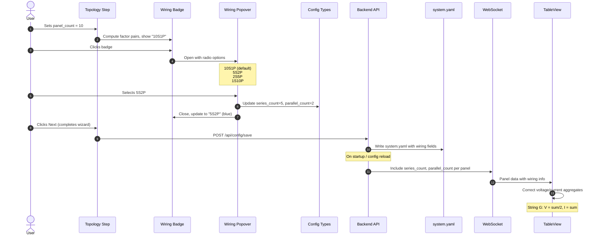

# String Series-Parallel Wiring Configuration

Add support for specifying the electrical wiring topology (series-parallel configuration) of each panel string during setup, and use it to correctly calculate string-level and system-level voltage and current aggregates in the TableView.

## Motivation

Solar panel strings can be wired in different series-parallel configurations. The most common is all-series (e.g., 10S1P), where all panel voltages are additive and current is uniform. However, some strings use series-parallel configurations like 5S2P (two parallel groups of 5 panels in series), which halves the string voltage and doubles the current.

Currently, the system assumes all strings are wired in pure series. The TableView calculates string-level voltage as the sum of all panel voltages and current as the average. For strings with non-standard wiring (e.g., String G in the user's installation, which is 5S2P), these aggregates are incorrect — the displayed voltage is double the actual string voltage, and the current display does not reflect the parallel grouping.

The `xSyP` notation is an established industry standard used across solar, battery, and electronics domains, where S = panels in series per group and P = number of parallel groups.

## Functional Requirements

### FR-1: StringConfig Data Model Extension

**FR-1.1:** The `StringConfig` type (frontend `types/config.ts` and backend `config_models.py`) SHALL be extended with two optional fields:

```typescript
interface StringConfig {
  name: string;
  panel_count: number;
  series_count?: number;    // S — panels in series per group
  parallel_count?: number;  // P — number of parallel groups
}
```

**FR-1.2:** When `series_count` and `parallel_count` are both omitted or null, the string SHALL be treated as all-series: `series_count = panel_count`, `parallel_count = 1`. This ensures backward compatibility with existing configs.

**FR-1.3:** The invariant `series_count * parallel_count === panel_count` MUST hold. The backend SHALL enforce this via a Pydantic model validator. The frontend SHALL prevent invalid states through constrained UI controls (FR-2).

**FR-1.4:** The YAML serialization SHALL omit `series_count` and `parallel_count` when they equal the all-series default (`series_count == panel_count` and `parallel_count == 1`), keeping existing config files clean.

### FR-2: Topology Step UI — Wiring Badge with Popover

**FR-2.1:** Each string row in the Topology Step SHALL display a **wiring badge** after the "panels" label. The badge shows the current configuration in `xSyP` shorthand notation (e.g., `10S1P`, `5S2P`).

**FR-2.2:** The wiring badge SHALL have two visual states:

- **Default (all-series):** Muted appearance — light gray background (`#f0f0f0`), dark gray text (`#666`), 12px font, 4px border-radius. Indicates no customization.
- **Customized (non-default):** Highlighted appearance — light blue background (`#e3f2fd`), blue text (`#1976d2`), same size. Immediately signals that this string has non-standard wiring.

**FR-2.3:** Clicking the wiring badge SHALL open a **popover** anchored below the badge, containing:

- A title: "Wiring for String {name}" (e.g., "Wiring for String G")
- A radio group listing all valid wiring configurations for the current `panel_count`
- Each radio option SHALL display:
  - The `xSyP` notation in bold
  - A human-readable description (e.g., "2 parallel groups of 5 in series")
  - The all-series option SHALL be annotated with "(default)"
  - The all-parallel option SHALL be annotated with "(uncommon)"

**FR-2.4:** Valid wiring configurations SHALL be computed as all factor pairs `(S, P)` of the `panel_count` where `S * P = panel_count`, `S >= 1`, `P >= 1`, ordered by descending `S` (series-first ordering):

| panel_count | Valid Configurations |
|------------|---------------------|
| 1 | 1S1P |
| 7 (prime) | 7S1P, 1S7P |
| 8 | 8S1P, 4S2P, 2S4P, 1S8P |
| 10 | 10S1P, 5S2P, 2S5P, 1S10P |
| 12 | 12S1P, 6S2P, 4S3P, 3S4P, 2S6P, 1S12P |

**FR-2.5:** Selecting a radio option SHALL immediately update the string's `series_count` and `parallel_count`, close the popover after a 200ms delay (to show the selection visually), and update the badge text.

**FR-2.6:** For `panel_count = 1`, the badge SHALL show `1S1P` in muted style and SHALL NOT be clickable (no popover, `cursor: default`, no hover effect). There is only one possible configuration.

**FR-2.7:** When the user changes a string's `panel_count`:

- If the current `(series_count, parallel_count)` pair is still a valid factor pair of the new `panel_count`, it SHALL be preserved.
- If the current pair is no longer valid, the wiring SHALL silently reset to all-series (`series_count = new_panel_count`, `parallel_count = 1`) and the badge SHALL update accordingly.
- If the popover is open during a panel count change, it SHALL close.

**FR-2.8:** The string row layout SHALL be:

```
[ A ] : [ 10 ] panels  [10S1P]  [×]
```

The badge occupies approximately 60px of horizontal width. On viewports narrower than 480px, the badge MAY wrap below the "panels" label within the flex row.

### FR-3: Popover Behavior and Accessibility

**FR-3.1:** The popover SHALL close when:
- The user selects an option (after 200ms delay per FR-2.5)
- The user clicks outside the popover
- The user presses Escape
- The user scrolls the page (optional — may keep open if popover repositions)

**FR-3.2:** Only one popover SHALL be open at a time. Opening a popover for one string SHALL close any other open popover.

**FR-3.3:** The popover SHALL be rendered as a positioned `div` with `position: absolute`, anchored below the badge. If insufficient space exists below (badge is near the bottom of the viewport), the popover SHALL flip to open above the badge.

**FR-3.4:** The wiring badge SHALL be keyboard-accessible:
- `tabIndex={0}` for focus
- Enter/Space opens the popover
- Arrow keys navigate radio options within the popover
- Escape closes the popover and returns focus to the badge

**FR-3.5:** The badge SHALL have an `aria-label` describing the current configuration, e.g., "String A wiring: 10 panels in series, 1 parallel group. Click to change."

**FR-3.6:** The popover radio group SHALL use `role="radiogroup"` with `aria-label="Wiring configuration for String A"`.

### FR-4: TableView Voltage and Current Corrections

**FR-4.1:** The backend SHALL include `series_count` and `parallel_count` in the WebSocket message for each panel, sourced from the string's configuration. These fields SHALL be added to the `PanelData` model.

**FR-4.2:** The `StringSection` component's summary calculation SHALL use the wiring configuration to compute correct aggregates:

**For a string with configuration `SsPp` (S panels in series, P parallel groups):**

- **String Voltage** = Sum of all online panel voltages / P
  - Rationale: Total voltage across all panels divided by the number of parallel groups gives the voltage of one series leg, which equals the string's output voltage.
- **String Current** = Sum of all online panel currents
  - Rationale: In a series-parallel configuration, the string's output current is the sum of the currents from each parallel group. Since individual panel currents are measured at the optimizer level, summing them gives the total output current.
  - Note: This replaces the current "average" calculation. For a pure series string (P=1), the sum of all currents equals N times the average — but the sum is the physically correct value (all panels carry the same current, and the string carries that same current). The average was a simplification that happened to be close for display but was not electrically accurate. For P>1, the sum correctly reflects parallel addition.
- **String Power** = Sum of all online panel watts (unchanged — power is always additive regardless of wiring topology)

**FR-4.3:** The system-level summary (Primary System / Secondary System headers) SHALL apply the same corrections, summing the corrected string voltages and currents across all strings in the system:

- **System Voltage** = Sum of corrected string voltages
- **System Current** = Average of corrected string currents (since strings connect to the inverter independently, averaging reflects the per-string current the inverter sees)
- **System Power** = Sum of all panel watts (unchanged)

**FR-4.4:** When `series_count` and `parallel_count` are not present on panel data (e.g., during the transition period before config is updated), the calculation SHALL fall back to the current behavior (all-series assumption): voltage = sum, current = average.

### FR-5: Backup and Restore Compatibility

**FR-5.1:** The backup export SHALL include `series_count` and `parallel_count` in the `SystemConfig` portion of the backup manifest when they differ from the all-series default.

**FR-5.2:** On restore, if `series_count` and `parallel_count` are absent from the backup data, the system SHALL treat the string as all-series (backward compatibility with pre-feature backups).

**FR-5.3:** The backup version number SHALL NOT be incremented — the new fields are optional and additive, requiring no migration.

### FR-6: Configuration File Persistence

**FR-6.1:** When the setup wizard saves `system.yaml`, the `series_count` and `parallel_count` fields SHALL be written for strings with non-default wiring configurations. Strings using the default all-series configuration SHALL omit these fields.

**FR-6.2:** Example `system.yaml` with mixed configurations:

```yaml
ccas:
  - name: "primary"
    serial_device: "/dev/ttyACM2"
    strings:
      - name: "A"
        panel_count: 10
        # series_count and parallel_count omitted = all-series (10S1P)
      - name: "B"
        panel_count: 8
  - name: "secondary"
    serial_device: "/dev/ttyACM3"
    strings:
      - name: "G"
        panel_count: 10
        series_count: 5
        parallel_count: 2
        # Explicitly stored because 5S2P ≠ default 10S1P
```

## Non-Functional Requirements

**NFR-1:** The wiring badge SHALL meet the 44x44px minimum touch target size (consistent with existing NFR-2.1 in the TableView spec). CSS padding SHALL achieve this without increasing the visual badge size.

**NFR-2:** The popover SHALL render within 16ms of click (single frame). No loading state is needed — factor pair computation is O(sqrt(N)) and completes in microseconds.

**NFR-3:** The feature SHALL not increase the WebSocket message size by more than 20 bytes per panel (two small integer fields). For a 69-panel system, this is ~1.4KB additional per broadcast — negligible.

**NFR-4:** The wiring badge and popover SHALL be implemented without adding external dependencies. The popover uses standard DOM positioning (`getBoundingClientRect` + absolute positioning).

**NFR-5:** The popover SHALL be usable on mobile viewports (375px+). On viewports narrower than 640px, the popover MAY render as a full-width element below the string row rather than an absolutely-positioned overlay, to avoid horizontal overflow.

## High Level Design



### Factor Pair Computation

A utility function computes valid wiring configurations:

```typescript
interface WiringOption {
  series: number;
  parallel: number;
  label: string;       // e.g., "5S2P"
  description: string; // e.g., "2 parallel groups of 5 in series"
  isDefault: boolean;
}

function getWiringOptions(panelCount: number): WiringOption[] {
  const options: WiringOption[] = [];
  for (let s = panelCount; s >= 1; s--) {
    if (panelCount % s === 0) {
      const p = panelCount / s;
      let description: string;
      if (p === 1) description = 'all in series';
      else if (s === 1) description = 'all in parallel';
      else description = `${p} parallel groups of ${s} in series`;

      options.push({
        series: s,
        parallel: p,
        label: `${s}S${p}P`,
        description,
        isDefault: p === 1,
      });
    }
  }
  return options;
}
```

### Corrected String Summary Calculation

```typescript
// In StringSection.tsx summary computation
const summary = useMemo(() => {
  const onlinePanels = panels.filter(p => p.online !== false);
  const totalVoltageRaw = onlinePanels.reduce(
    (sum, p) => sum + ((p.voltage_in ?? p.voltage) || 0), 0
  );
  const totalPower = onlinePanels.reduce(
    (sum, p) => sum + (p.watts || 0), 0
  );
  const totalCurrentRaw = onlinePanels
    .map(p => p.current_in)
    .filter(c => c != null)
    .reduce((sum, c) => sum + c, 0);

  // Get wiring config from first panel (all panels in a string share it)
  const parallelCount = onlinePanels[0]?.parallel_count ?? 1;

  return {
    voltage: totalVoltageRaw / parallelCount,  // Divide by parallel groups
    power: totalPower,
    current: totalCurrentRaw,                   // Sum (not average)
    onlineCount: onlinePanels.length,
    totalCount: panels.length,
  };
}, [panels]);
```

### Backend Model Changes

```python
# config_models.py
class StringConfig(BaseModel):
    """A string of panels with optional series-parallel wiring config."""
    name: str = Field(..., min_length=1, max_length=1)
    panel_count: int = Field(..., ge=1)
    series_count: Optional[int] = Field(default=None, ge=1)
    parallel_count: Optional[int] = Field(default=None, ge=1)

    @model_validator(mode='after')
    def validate_wiring(self) -> 'StringConfig':
        # Apply defaults
        if self.series_count is None:
            self.series_count = self.panel_count
        if self.parallel_count is None:
            self.parallel_count = 1
        # Validate invariant
        if self.series_count * self.parallel_count != self.panel_count:
            raise ValueError(
                f"series_count ({self.series_count}) * parallel_count "
                f"({self.parallel_count}) must equal panel_count ({self.panel_count})"
            )
        return self
```

```python
# models.py — PanelData extension
class PanelData(BaseModel):
    # ... existing fields ...
    series_count: Optional[int] = None    # From string config
    parallel_count: Optional[int] = None  # From string config
```

### YAML Serialization

```python
# In config saving logic — exclude defaults to keep YAML clean
def serialize_string_config(sc: StringConfig) -> dict:
    d = {"name": sc.name, "panel_count": sc.panel_count}
    # Only include wiring fields when non-default
    if sc.parallel_count and sc.parallel_count > 1:
        d["series_count"] = sc.series_count
        d["parallel_count"] = sc.parallel_count
    return d
```

## Task Breakdown

1. **Extend backend `StringConfig` model** — Add `series_count` and `parallel_count` optional fields with model validator. Update YAML serialization to conditionally include fields.

2. **Extend `PanelData` model** — Add `series_count` and `parallel_count` fields. Populate from string config in `panel_service.py` when building panel data for WebSocket broadcast.

3. **Extend frontend `StringConfig` type** — Add optional `series_count` and `parallel_count` to `types/config.ts`.

4. **Implement `getWiringOptions` utility** — Create `src/utils/wiringConfig.ts` with factor pair computation and types.

5. **Build `WiringBadge` component** — Inline badge that displays xSyP notation with default/customized styling. Clickable to open popover.

6. **Build `WiringPopover` component** — Positioned popover with radio group for selecting wiring configuration. Handles keyboard navigation, outside click, and escape-to-close.

7. **Integrate badge into `TopologyStep`** — Add `WiringBadge` to each string row. Wire up state updates for `series_count` and `parallel_count`. Handle panel count changes (revalidation/reset logic).

8. **Fix `StringSection` summary calculation** — Use `parallel_count` from panel data to correct voltage division and switch current from average to sum.

9. **Fix system-level summary in `TableView`** — Update `systemSummaries` computation to use corrected per-string values.

10. **Update backup/restore** — Ensure `series_count` and `parallel_count` round-trip through backup export and restore. Verify backward compatibility with pre-feature backups.

11. **Playwright verification** — Test the full flow: set a string to 5S2P in the wizard, verify badge appearance, verify corrected voltage/current in TableView. Test at mobile viewport (375px).

## Related Specifications

| Spec | Relationship | Notes |
|------|-------------|-------|
| [Wizard Serial Entry](2026-02-08-wizard-serial-entry.md) | related | Serial entry step follows topology step where wiring is configured |

## Context / Documentation

- `dashboard/frontend/src/components/wizard/steps/TopologyStep.tsx` — Wizard step where wiring badge is added
- `dashboard/frontend/src/components/TableView.tsx` — System-level summary calculations to fix
- `dashboard/frontend/src/components/TableView/StringSection.tsx` — String-level summary calculations to fix
- `dashboard/frontend/src/types/config.ts` — Frontend type definitions to extend
- `dashboard/backend/app/config_models.py` — Backend Pydantic models to extend
- `dashboard/backend/app/models.py` — PanelData model to extend
- Industry reference: `xSyP` notation — Series (S) × Parallel (P) = Total panels

---

**Specification Version:** 1.0
**Last Updated:** February 2026
**Authors:** Claude (Lead Architect), Claude (UX Designer)

## Changelog

### v1.0 (February 2026)
**Summary:** Initial specification

**Changes:**
- Initial specification created
- UX approach: Smart Badge with Popover (recommended by UX research over inline dropdown, expandable detail row, and dedicated sub-step alternatives)
- Defined data model extensions with backward compatibility
- Specified corrected voltage/current aggregation formulas
- Included accessibility requirements for badge and popover
