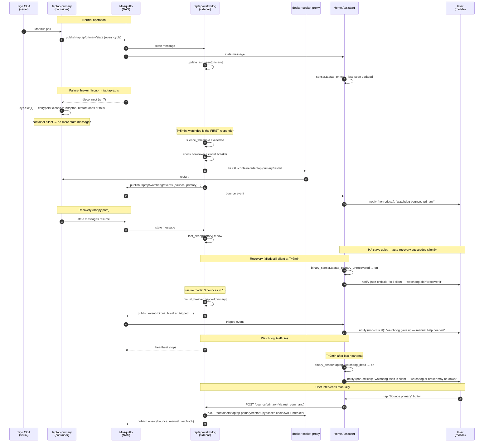

**Status:** Draft
**Date:** 2026-05-02

> **Placeholder convention.** This spec is checked into a public GitHub repository. Environment-specific values are written as angle-bracketed placeholders that the implementer substitutes from `.claude/env`, `secrets.yaml`, or compose env files at deploy time. None of these values are committed in plaintext. The placeholders used:
>
> | Placeholder | Meaning | Source |
> |---|---|---|
> | `<PI_HOST>` | LAN IP/hostname of the Raspberry Pi running tigo-mqtt | `.claude/env` `PI_HOST` |
> | `<MQTT_BROKER_HOST>` | LAN IP/hostname of the MQTT broker | `tigo-mqtt/.env` `MQTT_SERVER` |
> | `<HA_HOST>` | LAN IP/hostname of the Home Assistant instance | operator-supplied |
> | `<NAS_HOST>` | SSH alias / hostname of the NAS where the broker and HA configs live | operator-supplied (`~/.ssh/config`) |
> | `<your-dashboard-host>` | Public DNS for the deployed dashboard frontend (e.g. behind a reverse proxy) | operator-supplied |
> | `<HA_CONFIG_ROOT>` | Operator's local path to the Home Assistant config directory | operator-supplied |
> | `<HA_DASHBOARDS_DIR>` | Path to the HA dashboards directory under `<HA_CONFIG_ROOT>` | derived |
> | `<HA_CONFIG_MOUNT>` | SMB/local mount point used by HA push scripts | operator-supplied |
> | `<MQTT_BROKER_CONFIG_DIR>` | Operator's local path to the Mosquitto config directory | operator-supplied |
>
> Implementations and deployed configs SHALL parameterize all of the above via environment variables or secrets management — never hardcode an operator-specific value into a tracked file. See FR-5.5 for enforcement.

# Tigo MQTT Self-Healing System

A four-layer system that detects when the `taptap-{primary,secondary}` containers stop publishing to MQTT and recovers automatically: (1) root-cause hardening of the entrypoint, (2) static MQTT client IDs for log mineability, (3) a Pi-side watchdog sidecar that auto-restarts silent containers with circuit-breaker safety rails, and (4) Home Assistant integration that surfaces silence and bounce events as non-critical mobile notifications and exposes a manual bounce button.

## Motivation

On 2026-04-20 16:00:13 CDT both `taptap-primary` and `taptap-secondary` containers exited and stayed dead for 12 days, silently. The dashboard showed no panel data the entire time. Recovery required manual intervention.

The fault chain was:

1. The MQTT broker disconnected both clients at the exact same millisecond (broker- or network-side event, rc=7 from paho).
2. taptap-mqtt called `sys.exit(1)` rather than reconnecting.
3. The entrypoint fix in commit `6c903f8` only removed `/run/taptap/taptap.run` — the file. The `/run/taptap` *directory* persists across in-place restarts (it's created at image-build time by the `Dockerfile`). On the next startup, taptap-mqtt called `os.makedirs("/run/taptap")` without `exist_ok=True` and crashed with `[Errno 17] File exists: '/run/taptap'`.
4. The container's `restart: always` policy did not loop the restart out of this state — the cause is undetermined and is part of FR-1.
5. No alerting existed; the user discovered the outage 12 days later by looking at the dashboard.

The system needs three things it currently lacks:

- A correct entrypoint that handles directory-vs-file and unknown-state recovery.
- Independent detection of MQTT silence with autonomous recovery action.
- External alerting so a recurrence is noticed in minutes, not days.

A fourth observability gap is also addressed: the running taptap-mqtt clients use paho's auto-generated random client IDs, which means the 6 GB Mosquitto broker log on the NAS contains zero matches for "taptap" — historical disconnect frequency cannot be quantified retroactively.

## Functional Requirements

### FR-1: Root Cause Investigation and Hardening

**FR-1.1: Entrypoint hardening.** `tigo-mqtt/entrypoint.sh` SHALL replace the current `rm -f /run/taptap/taptap.run` line with a sequence that clears the `/run/taptap` contents (handling both file and directory conflicts) without removing the bind-mount point itself:

```sh
# Clear /run/taptap contents — handles file-vs-directory conflicts that blocked
# the 2026-04-20 startup. The bind mount from ./run/{primary,secondary} on the
# host is preserved (we clear contents, not the directory itself).
rm -rf /run/taptap/* /run/taptap/.[!.]* 2>/dev/null || true
mkdir -p /run/taptap
```

The `2>/dev/null || true` prevents the script from aborting if `/run/taptap` is empty (the glob `*` doesn't match anything). The dotfile glob `.[!.]*` covers hidden files except `.` and `..`. Note: the `/run/taptap` directory itself is bind-mounted from `./run/{primary,secondary}` on the host (per `docker-compose.sample.yml`), so clearing only its contents preserves the mount and avoids accidentally affecting the host filesystem layout. The directory is treated as exclusive scratch space for taptap; any files there will be removed on each container startup.

**FR-1.2: Restart-policy investigation.** Before changing watchdog behavior, the implementer SHALL determine why `restart: always` did not loop the container after the 2026-04-20 exit. Required diagnostic steps:

- Run `docker inspect taptap-{primary,secondary} --format '{{.RestartCount}}'` and record the value.
- Run `journalctl -u docker --since '2026-04-20 15:00' --until '2026-04-20 17:00'` on the Pi and capture any restart-related log entries.
- Run `docker events --since '2026-04-20T15:00:00' --until '2026-04-20T17:00:00'` if event history is retained.

The findings SHALL be recorded in `docs/TROUBLESHOOTING.md` under a new "Container Restart Policy" section. Three possible outcomes:

1. **Cause found and fixable** (e.g., `docker stop` was issued by an admin and never undone, or a malformed compose entry): apply the fix and document.
2. **Cause found but not fixable** (e.g., Docker daemon backoff cap, kernel-level OOM kill that prevented restart): the watchdog (FR-3) is the authoritative recovery mechanism and `restart: always` is best-effort. Document the limitation.
3. **Cause indeterminate** (logs rolled over, journalctl history insufficient, docker events history not retained): document as "cause indeterminate due to log retention" in TROUBLESHOOTING.md. Proceed under the working hypothesis that FR-1.1's stale `/run/taptap` directory was the proximate cause, AND treat the watchdog (FR-3) as the authoritative recovery layer regardless of the underlying Docker behavior.

In all three outcomes, FR-1.1's entrypoint hardening still ships and the watchdog still ships. FR-1.2 is satisfied by completing the diagnostic steps and recording outcome 1, 2, or 3.

**FR-1.3: Image rebuild verification.** After FR-1.1, the implementer SHALL rebuild the `tigo-mqtt` image on the Pi and verify the new `entrypoint.sh` is present in the running container by running `docker exec taptap-primary cat /app/entrypoint.sh | grep -F 'rm -rf /run/taptap/*'` (the `-F` ensures the glob is matched literally, not interpreted by grep).

### FR-2: Static MQTT Client IDs

**FR-2.1: Config field.** `tigo-mqtt/config-template.ini` SHALL gain a new `CLIENT_ID` key under the `[MQTT]` section. The template default value SHALL be `${MQTT_CLIENT_ID}`. The deployed `config-primary.ini` and `config-secondary.ini` SHALL set `CLIENT_ID` to `taptap-primary` and `taptap-secondary` respectively.

**FR-2.2: Environment plumbing.** `tigo-mqtt/entrypoint.sh` SHALL substitute `${MQTT_CLIENT_ID}` from the environment in addition to the existing substitutions. The `tigo-mqtt/docker-compose.yml` (deployed on the Pi, not tracked in git) SHALL set `MQTT_CLIENT_ID=taptap-primary` and `MQTT_CLIENT_ID=taptap-secondary` for the two services. The sample `tigo-mqtt/docker-compose.sample.yml` (tracked in git) SHALL include the same.

**FR-2.3: Upstream patch.** Because upstream `taptap-mqtt.py` (pinned to commit `c656d6b31247e906bf7186f28df36385018c8979`) constructs `mqtt.Client()` with no arguments, the `tigo-mqtt/Dockerfile` SHALL apply a `sed` patch during build that rewrites the constructor to:

```python
mqtt.Client(client_id=config.get('MQTT', 'CLIENT_ID', fallback=''))
```

The patch SHALL be applied immediately after the upstream tarball is extracted and before `pip install`. The patch SHALL **fail loudly** (non-zero exit, build aborts) if the expected pre-patch substring is not found — silent no-op behavior is forbidden because it would mask upstream changes that move or rewrite the constructor line.

**Exact Dockerfile commands** (both apply and verify in one chained step):

```dockerfile
# Patch upstream taptap-mqtt.py to support a configurable MQTT client_id.
# Fails the build if the expected pre-patch line is absent (i.e., upstream changed),
# AND fails if post-patch verification doesn't find the new line.
RUN cp taptap-mqtt.py taptap-mqtt.py.bak \
 && sed -i 's|mqtt.Client()|mqtt.Client(client_id=config.get("MQTT", "CLIENT_ID", fallback=""))|' taptap-mqtt.py \
 && if diff -q taptap-mqtt.py taptap-mqtt.py.bak > /dev/null; then \
        echo "ERROR: sed patch did not modify taptap-mqtt.py — upstream may have changed the mqtt.Client() line" >&2; \
        exit 1; \
    fi \
 && grep -q 'mqtt.Client(client_id=config.get("MQTT", "CLIENT_ID"' taptap-mqtt.py \
 && rm taptap-mqtt.py.bak
```

**FR-2.4: Patch verification at build.** The verification is integrated into FR-2.3's command chain above (the `diff -q ... && grep -q ...`). The `grep` matches the **exact** patched substring `mqtt.Client(client_id=config.get("MQTT", "CLIENT_ID"`, not a loose pattern, so a partial or wrong patch fails the build. Idempotency is achieved because (a) re-running on an already-patched file fails the `diff -q` check (file unchanged after sed → exit 1), making the Dockerfile build fail loudly rather than silently no-op.

**FR-2.5: Setup wizard sync.** The setup wizard's config generator (`dashboard/backend/app/services/tigo_mqtt_generator.py`) and the CI sync check (`scripts/check-config-sync.py`) SHALL be updated to include `CLIENT_ID` so wizard-generated configs and the template stay in sync.

The wizard SHALL default `CLIENT_ID` to `taptap-{slug(TOPIC_NAME)}`, where `slug()` lowercases the input, replaces any character not in `[a-z0-9_-]` with `-`, collapses runs of `-`, strips leading/trailing `-`, and truncates to 23 characters total (the `taptap-` prefix is 7 chars, leaving 16 for the slug — room for the longest expected names plus headroom). MQTT 3.1.1 servers MUST accept client IDs of 23 chars [A-Za-z0-9]; many brokers accept longer/more lenient strings, but 23 is the safe baseline. Mosquitto specifically allows up to 65535 chars and a wider charset, but the slug ensures portability.

Examples:
- `TOPIC_NAME = "primary"` → `CLIENT_ID = "taptap-primary"`
- `TOPIC_NAME = "House Roof"` → `CLIENT_ID = "taptap-house-roof"`
- `TOPIC_NAME = "Backyard #2"` → `CLIENT_ID = "taptap-backyard-2"`

**FR-2.6: Backward compatibility.** A `CLIENT_ID` value of empty string SHALL be treated as "no client_id" — paho will then auto-generate as before. Per the [paho-mqtt 1.6.1 source](https://github.com/eclipse/paho.mqtt.python/blob/v1.6.1/src/paho/mqtt/client.py), the `Client(client_id, ...)` constructor checks `if not client_id:` and falls through to a generated ID using `clean_session=True` semantics. Empty string and `None` both trigger this branch. This preserves behavior for any deployments that don't supply the env var.

### FR-3: Watchdog Sidecar Container

**FR-3.1: New service.** `tigo-mqtt/docker-compose.yml` and `tigo-mqtt/docker-compose.sample.yml` SHALL gain a new service `taptap-watchdog`. The image SHALL be built from a new directory `tigo-mqtt/watchdog/` containing a `Dockerfile`, `app.py`, and `requirements.txt`.

**FR-3.2: Liveness signal.** The watchdog SHALL subscribe to MQTT topics `taptap/primary/state` and `taptap/secondary/state`. These topics are published every taptap update cycle (every few seconds) regardless of panel power output, making them suitable as a 24/7 heartbeat. The watchdog SHALL NOT use `taptap/{primary,secondary}/nodes/#` data as a liveness signal because panel data may legitimately stop at night.

**FR-3.3: Per-CCA last-seen tracking.** The watchdog SHALL maintain in-memory state `{primary: last_seen_ts, secondary: last_seen_ts}`, updated on every state-topic message. On startup, both timestamps SHALL be initialized to the current time (grace period — don't bounce immediately on startup).

**FR-3.4: Bounce trigger.** When a CCA's `now - last_seen_ts > 300` seconds (5 minutes), the watchdog SHALL initiate a bounce of that CCA's container, subject to FR-3.6 and FR-3.7.

**FR-3.5: Bounce action.** A bounce SHALL execute `POST /containers/{name}/restart` against the Docker socket (via `docker-socket-proxy`, see NFR-1.2 for network topology), where `{name}` resolves from environment variables `PRIMARY_CONTAINER` (default `taptap-primary`) and `SECONDARY_CONTAINER` (default `taptap-secondary`). This mirrors the existing pattern in `tigo-mqtt/temp-id-monitor` and lets the user rename the taptap containers without breaking the watchdog. The bounce SHALL log the event with timestamp, container name, and trigger reason (`silence_threshold` or `manual_webhook`).

**FR-3.6: Cooldown.** After a bounce of a CCA's container, the watchdog SHALL NOT bounce that same container again for 15 minutes (`COOLDOWN_SEC=900`), regardless of trigger source — except a manual webhook (FR-3.10), which overrides the cooldown. **Cooldown clock start:** the cooldown timer starts when the docker-socket-proxy returns success (HTTP 2xx) for the restart call, NOT when the container has finished restarting and republishing. The 15-minute cooldown is a wide enough margin that this distinction (~30s of restart time) is negligible.

**FR-3.7: Circuit breaker.** If the watchdog has executed `CIRCUIT_BREAKER_BOUNCES` (default 3) or more **automatic** bounces of a single container within the trailing `CIRCUIT_BREAKER_WINDOW_SEC` (default 60 min) window, the watchdog SHALL trip a circuit breaker for that container. Tripped state means: no further automatic bounces of that container until the breaker untrips.

**Implementation: implicit trip/untrip via SQL count.** The breaker has no separate state row; it is computed on demand from the bounces table. On every bounce attempt, the watchdog computes `recent_bounces(container)` (see FR-3.13) and treats `>= CIRCUIT_BREAKER_BOUNCES` as "tripped". The breaker therefore "resets" automatically when older bounce rows age past the window or are pruned. This means the breaker survives watchdog restarts correctly without storing extra state.

**Trip event publishing.** The first time `recent_bounces` first reaches the threshold during a bounce attempt (i.e., on a transition from "would have bounced" to "blocked"), the watchdog SHALL publish `circuit_breaker_tripped` (QoS 1, retain=true). Subsequent attempts in the tripped state SHALL NOT republish the same event (track an in-memory `breaker_tripped: set[str]` flag and only publish on transition closed→open). On the first attempt where `recent_bounces < CIRCUIT_BREAKER_BOUNCES` after being tripped, publish `circuit_breaker_reset` (also retain=true) and clear the in-memory flag.

**Manual webhook bypass.** Manual webhook bounces (FR-3.10) bypass the breaker (do not increment it via the `reason='manual_webhook'` SQL filter in `recent_bounces`). They are still recorded as rows for audit but excluded from the rolling-window count.

**FR-3.8: Bounce events.** Each bounce SHALL publish a JSON message to MQTT topic `taptap/watchdog/events` with this shape:

```json
{
  "event": "bounce",
  "container": "taptap-primary",
  "reason": "silence_threshold",
  "silent_seconds": 312,
  "ts": "2026-05-02T18:30:42.123Z"
}
```

`reason` is one of `silence_threshold`, `manual_webhook`. Messages SHALL be published with QoS 1, retain=false.

**FR-3.9: Circuit-breaker events.** Circuit-breaker trip and reset events SHALL be published to MQTT topic `taptap/watchdog/events` with the same envelope and `event` values of `circuit_breaker_tripped` and `circuit_breaker_reset`. Trip events SHALL include `bounces_in_window: 3`. These events SHALL be published with retain=true so a subscriber connecting later sees the current state.

**FR-3.9b: Bounce-failed events.** When a bounce attempt fails (the docker-socket-proxy returns non-2xx, times out, or is unreachable), the watchdog SHALL publish an event to `taptap/watchdog/events`:

```json
{
  "event": "bounce_failed",
  "container": "taptap-primary",
  "error_class": "HTTPStatusError",
  "error_message": "Server error '503 Service Unavailable' for url ...",
  "ts": "2026-05-02T18:30:42.123Z"
}
```

QoS 1, retain=false. Per FR-3.13, a `bounce_failed` does NOT update the cooldown clock and is NOT recorded as a `bounces` row, so it does not contribute to circuit-breaker trip counts (the breaker is for "bounces that happened too often", not "bounces that failed"). The next silence-check loop iteration retries normally.

`reason` enum values across all events: `silence_threshold` | `manual_webhook` (in `bounce` events only). `event` enum values: `bounce` | `bounce_failed` | `circuit_breaker_tripped` | `circuit_breaker_reset` | `reconnect_grace_applied` (the last from FR-3.12).

**FR-3.10: Manual webhook.** The watchdog SHALL expose an HTTP endpoint `POST /bounce/{primary|secondary}` on port 8080 (configurable via env). This endpoint SHALL:

- Bypass cooldown (FR-3.6) and circuit breaker (FR-3.7).
- Bounce the requested container.
- Publish a bounce event with `reason=manual_webhook`.
- Return `{"ok": true, "bounced": "<container>"}` with HTTP 200 on success.
- Return HTTP 404 if the path parameter is not `primary` or `secondary` (use FastAPI `Path(pattern='^(primary|secondary)$')` — `pattern` replaces the deprecated `regex` keyword in pydantic v2 / FastAPI 0.100+. FastAPI's default 422 on pattern-fail SHOULD be customized to 404 via an exception handler so the response is REST-idiomatic).
- Return HTTP 500 with the error message if the Docker call fails.
- Return HTTP 401 if the `X-Bounce-Token` header is absent or does not match the configured token.

**Authentication.** Because the webhook port is LAN-reachable under host networking, the endpoint SHALL require a shared-secret token. The watchdog reads `BOUNCE_TOKEN` from its env (loaded from `.env` per existing convention). Every `POST /bounce/...` request SHALL be rejected with HTTP 401 if the `X-Bounce-Token` request header does not match `BOUNCE_TOKEN` exactly (constant-time compare via `hmac.compare_digest`). Token MUST be at least 32 random bytes (e.g., output of `openssl rand -hex 32`). This protects against any LAN device (guest Wi-Fi, IoT, compromised device) issuing unauthorized bounces.

The `GET /healthz` endpoint SHALL remain unauthenticated (read-only state, useful for unprotected monitoring scrapers).

**FR-3.11: Health endpoint.** The watchdog SHALL expose `GET /healthz` on the same port returning JSON:

```json
{
  "status": "ok",
  "ccas": {
    "primary":   { "last_seen": "2026-05-02T18:30:42.123Z", "silent_seconds": 4, "circuit_breaker": "closed", "bounces_last_hour": 0 },
    "secondary": { "last_seen": "2026-05-02T18:30:41.987Z", "silent_seconds": 4, "circuit_breaker": "closed", "bounces_last_hour": 0 }
  },
  "mqtt": { "connected": true, "last_message_at": "2026-05-02T18:30:42.123Z" }
}
```

`status` SHALL be `"ok"` if MQTT is connected and no circuit breaker is tripped, `"degraded"` if MQTT is connected but at least one circuit breaker is tripped, or `"down"` if MQTT is disconnected. **Precedence (most severe wins):** if MQTT is disconnected AND a breaker is tripped, `status="down"` (the broker outage subsumes everything else).

**FR-3.12: Broker-disconnect safety.** When the watchdog itself loses its MQTT connection to the broker, it SHALL NOT initiate any bounces. Rationale: a broker outage means we can't see liveness signals at all, and bouncing the taptap containers won't help — the broker is the problem. The watchdog SHALL keep retrying its own connection (paho's `loop_forever()` with default reconnect behavior).

**Reconnect behavior (avoiding masked outages).** The watchdog cannot distinguish a broker outage (where every client is disconnected) from a watchdog-side network blip (where only the watchdog is offline, but the broker is fine and taptap may have ALSO died during that window). To avoid silently masking the latter:

- If the disconnect duration was **short (≤ 60 seconds)**: treat as a watchdog-side hiccup. Do NOT reset `last_seen_ts` — preserve pre-disconnect timestamps so any genuine ongoing silence still triggers normally after threshold.
- If the disconnect duration was **long (> 60 seconds)**: treat as ambiguous (likely broker outage). Reset `last_seen_ts` for both CCAs to `now()` (grace period) AND publish an event `event=reconnect_grace_applied` with envelope `{event, disconnect_seconds, ts}` for observability. After this grace period, the next genuine silence triggers a bounce normally at threshold + 5 min.

The 60-second cutoff is configurable via `MQTT_RECONNECT_GRACE_CUTOFF_SEC` (default 60). The watchdog SHALL track the disconnect timestamp (when paho's `on_disconnect` callback fires) and compare to reconnect time (`on_connect` callback) to compute the duration.

**FR-3.13: State persistence.** The watchdog SHALL persist bounce history (timestamp + container + reason) to `/data/watchdog.db` (SQLite) so that the circuit-breaker rolling window survives a watchdog restart. On startup, the watchdog SHALL load bounce history from SQLite and reconstruct the rolling-window counters. Schema:

```sql
CREATE TABLE IF NOT EXISTS bounces (
  id INTEGER PRIMARY KEY AUTOINCREMENT,
  container TEXT NOT NULL,
  reason TEXT NOT NULL,        -- 'silence_threshold' | 'manual_webhook' | 'bounce_failed'
  ts INTEGER NOT NULL           -- unix epoch seconds
);
CREATE INDEX IF NOT EXISTS idx_bounces_ts ON bounces(ts);
```

The watchdog SHALL prune rows older than 24 hours on startup AND every silence-check loop iteration (~30s) so the table remains bounded during long-running operation.

**Volume mount.** The watchdog compose service SHALL mount a dedicated host directory `./watchdog-data:/data` for SQLite persistence. This volume SHALL NOT overlap with `tigo-mqtt/data/{primary,secondary}` (state files — see NFR-1.1).

**Concurrency.** The watchdog has multiple async paths (MQTT message callbacks, FastAPI webhook handler, silence-check loop). All SQLite writes SHALL go through `asyncio.to_thread(...)` calls so the event loop is never blocked, with a single `sqlite3.Connection` opened with `check_same_thread=False` and serialized via an `asyncio.Lock`. Alternatively, `aiosqlite==0.20.0` MAY be used to avoid the manual locking — pick one approach in implementation and document. The default (FR-3.13's reference implementation) is `sqlite3 + asyncio.Lock` to minimize dependencies.

**Operation ordering and helper signatures.** A bounce attempt SHALL execute in this exact order:

1. **Precondition checks** (in-memory + SQLite):
   - Cooldown check: `now - state.last_bounce[container] < COOLDOWN_SEC` → return `{skipped: "cooldown"}` (no SQLite write, no MQTT publish).
   - Circuit breaker check: `recent_bounces(container) >= CIRCUIT_BREAKER_BOUNCES` → publish `circuit_breaker_tripped` event, return `{skipped: "circuit_breaker"}` (no bounce row written; the trip is implicit from the existing rows).
   - Both checks bypassed when `override=True` (manual webhook).
2. **Attempt Docker restart**: `httpx.post(f"{DOCKER_PROXY_URL}/containers/{container_name}/restart", timeout=10.0)`. On HTTP 2xx → continue; on any other outcome (connection error, timeout, non-2xx) → go to step 5b (failure path).
3. **On success** (atomic-ish — log if any sub-step raises):
   - SQLite INSERT into `bounces`.
   - Update `state.last_bounce[container] = now`.
   - Publish MQTT event with `event=bounce`, full envelope per FR-3.8.
4. **Return success** to the caller (webhook or silence loop): `{ok: True, bounced: <name>}`.
5. **Failure path (5b)**: log error at WARN level. Publish MQTT event with `event=bounce_failed` (envelope: `{event, container, error_class, error_message, ts}`, QoS 1, retain=false). Do NOT update cooldown. Do NOT increment circuit-breaker count (so a series of bounce_failed don't trip the breaker prematurely). The next silence-check iteration retries normally (subject to cooldown if a prior success exists).

**Helper signatures** (used in the implementation sketch and the unit tests):

```python
def recent_bounces(container: str, window_sec: int = CIRCUIT_BREAKER_WINDOW_SEC) -> int:
    """Count bounces of `container` in the last `window_sec` seconds.
    Excludes manual_webhook bounces — those bypass the breaker per FR-3.7."""
    cutoff = int(time.time()) - window_sec
    cur = db.execute(
        "SELECT COUNT(*) FROM bounces WHERE container=? AND ts > ? AND reason != 'manual_webhook'",
        (container, cutoff))
    return cur.fetchone()[0]

def record_bounce(container: str, reason: str) -> None:
    """Insert a bounce row. Called only on successful Docker restart."""
    db.execute("INSERT INTO bounces (container, reason, ts) VALUES (?, ?, ?)",
               (container, reason, int(time.time())))
    db.commit()

def publish_event(event: str, container: str, **fields) -> None:
    """Publish a JSON event to taptap/watchdog/events. Retain=true for circuit_breaker_*,
    retain=false for bounce/bounce_failed. QoS 1 for all."""
    payload = {"event": event, "container": container,
               "ts": datetime.now(timezone.utc).isoformat().replace("+00:00", "Z"), **fields}
    retain = event.startswith("circuit_breaker_")
    mqtt_client.publish("taptap/watchdog/events", json.dumps(payload), qos=1, retain=retain)
```

**FR-3.14: Watchdog restart policy.** The watchdog container SHALL have `restart: unless-stopped` in `docker-compose.yml`. Rationale: if the watchdog itself crashes, we want it back up; if the operator explicitly stopped it, we want it to stay stopped.

**FR-3.15: Logging.** The watchdog SHALL log to stdout (captured by Docker) at `INFO` level by default. Bounce decisions, MQTT connect/disconnect, and circuit-breaker state changes SHALL log at `INFO`. Per-message liveness updates SHALL log at `DEBUG` only.

**FR-3.16: Heartbeat.** The watchdog SHALL publish a heartbeat to MQTT topic `taptap/watchdog/heartbeat` every 30 seconds with `retain=true` and `QoS=0` (best-effort; losing one heartbeat is harmless because another fires in 30s — QoS 1 would generate broker ACK traffic for no benefit). Payload:

```json
{ "ts": "2026-05-02T18:30:42.123Z", "uptime_seconds": 12345 }
```

`uptime_seconds` is an integer (process wall-clock seconds since startup, no sub-second precision needed).

This allows external observers (HA in particular) to detect when the watchdog *itself* has gone silent — a failure mode the watchdog cannot self-report. The retain flag ensures a subscriber connecting after a watchdog outage immediately sees the stale timestamp (HA must extract `value_json.ts` per FR-4.1, not use receipt time).

**Known limitation: broker-outage false positives.** If the broker goes down (the watchdog's MQTT loop_forever() is disconnected), heartbeat publishes are dropped silently. After 2 minutes, HA's `binary_sensor.taptap_watchdog_dead` flips to `on` and FR-4.5b fires "watchdog itself is silent" — even though the watchdog process may be fully alive. Once the broker recovers, the next heartbeat publishes within 30s and the binary_sensor returns to `off`. This false-positive is acceptable because (a) a broker outage IS a user-visible failure (no panel data), so paging the user is appropriate either way; (b) HA itself cannot publish notifications during the broker outage, so the alert won't actually fire until the broker comes back, at which point user impact has typically already self-resolved.

### FR-4: Home Assistant Integration

**Design intent.** HA is *not* the first responder. The watchdog (FR-3) handles common failures autonomously; HA only fires for events the watchdog cannot handle silently or cannot detect at all. Specifically: (a) post-fact bounce confirmations, (b) recovery-failed escalations, and (c) watchdog-itself-dead detection. The watchdog's 5-minute bounce threshold (FR-3.4) is the *first* automated response to silence; HA notifications all happen at or after that point.

**FR-4.1: MQTT sensors.** Three HA `sensor` entities SHALL track timestamps via the MQTT integration. Two of these capture *receipt time* of taptap state messages (because `taptap/{primary,secondary}/state` is published by upstream taptap-mqtt and its payload format — likely `online`/`offline` strings or a Home Assistant availability JSON — does not contain a self-reported timestamp). The watchdog heartbeat sensor extracts the embedded timestamp from the JSON payload.

**Important:** Because `taptap/watchdog/heartbeat` is published with `retain=true` (FR-3.16), HA receives the *last* heartbeat message immediately on every reconnect. If we used the message *receipt time* as the sensor value, a stale retained heartbeat would always look fresh and silently break watchdog-dead detection. Extracting the embedded `ts` field via `value_template` avoids this trap.

```yaml
mqtt:
  sensor:
    # Primary CCA last-seen — uses message receipt time; payload format from upstream taptap-mqtt.
    - name: "taptap_primary_last_seen"
      state_topic: "taptap/primary/state"
      value_template: "{{ now().isoformat() }}"  # overwrite state with ingest time on each receipt
      device_class: timestamp
      unique_id: taptap_primary_last_seen

    # Secondary CCA last-seen — same pattern.
    - name: "taptap_secondary_last_seen"
      state_topic: "taptap/secondary/state"
      value_template: "{{ now().isoformat() }}"
      device_class: timestamp
      unique_id: taptap_secondary_last_seen

    # Watchdog heartbeat — extract embedded ts from the JSON payload (do NOT use receipt time
    # because the heartbeat is retain=true and a stale retained value would look fresh on HA restart).
    - name: "taptap_watchdog_last_seen"
      state_topic: "taptap/watchdog/heartbeat"
      value_template: "{{ value_json.ts }}"
      device_class: timestamp
      unique_id: taptap_watchdog_last_seen
```

The MQTT integration's `last_changed` semantics combined with `device_class: timestamp` allow the binary_sensors in FR-4.2 to compute staleness via `(now() - states('sensor.taptap_primary_last_seen') | as_datetime)`.

**Caveat on the receipt-time approach (state sensors):** if HA itself disconnects from the broker for a period, on reconnect it does NOT receive missed non-retained messages, so the sensor stops updating until the next live message arrives. This is acceptable: HA's broker-disconnect is itself the failure being detected (the user would see no panel data either way), and the watchdog is still acting independently.

**FR-4.2: Binary sensors.** Three HA template `binary_sensor` entities SHALL evaluate to `on` (problem) based on staleness of the corresponding sensor in FR-4.1:

- `binary_sensor.taptap_primary_unrecovered` — `on` when `sensor.taptap_primary_last_seen` is more than **420 seconds** (7 min) old. This threshold is intentionally 2 minutes after the watchdog's 5-minute bounce trigger, giving the bounce time to take effect. If silence persists past 7 min, the watchdog either didn't fire or didn't help.
- `binary_sensor.taptap_secondary_unrecovered` — same logic for secondary.
- `binary_sensor.taptap_watchdog_dead` — `on` when `sensor.taptap_watchdog_last_seen` is more than **120 seconds** (2 min) old. The watchdog beats every 30 seconds (FR-3.16), so 2 min indicates real failure (4 missed beats).

All three use `device_class: problem`.

**FR-4.3: Watchdog-failed-to-recover automation.** An HA automation SHALL trigger when either `binary_sensor.taptap_*_unrecovered` from FR-4.2 changes to `on` and stays on `for: 30 seconds` (debounce). The 30s debounce filters single-message flicker (e.g., a late state message arriving right at the 7-min boundary). Persistent failures fire correctly because the binary_sensor stays `on` indefinitely once the underlying staleness exceeds the threshold. The automation SHALL call `notify.mobile_app_<device>` with:

- Title: `Tigo: <which> CCA still silent — watchdog didn't recover it`
- Body: `Silent for <N> minutes. Watchdog should have bounced at 5 min. Check watchdog logs and CCA hardware.`
- Data: `{"push": {"interruption-level": "active"}}` for iOS, `{"channel": "default", "importance": "default"}` for Android. **The notification SHALL NOT be marked as critical/time-sensitive/high-importance** — this is an explicit user requirement.

The exact `notify.mobile_app_*` entity name is deployment-specific. The implementer SHALL discover it via `python3 dashboards/scripts/query_entities.py --filter mobile_app` against the user's HA instance and substitute it into the automation YAML.

**FR-4.4: Bounce-confirmation automation.** An HA automation SHALL subscribe to MQTT topic `taptap/watchdog/events` and trigger when `event == "bounce"`. The automation SHALL call the same `notify.mobile_app_<device>` service with:

- Title: `Tigo: watchdog bounced <container>`
- Body: `Reason: <reason>. Silent for <silent_seconds>s.`
- Same non-critical notification level as FR-4.3.

This is informational ("the system self-healed"), not an alert. It exists so the user knows recovery happened without having to check the dashboard.

**FR-4.5: Circuit-breaker escalation automation.** An HA automation SHALL subscribe to MQTT topic `taptap/watchdog/events` and trigger when `event == "circuit_breaker_tripped"`. The automation SHALL call `notify.mobile_app_<device>` with:

- Title: `Tigo: watchdog gave up on <container>`
- Body: `3 bounces in the last hour didn't fix it. Manual investigation needed.`
- Same non-critical notification level as FR-4.3 (the user has explicitly opted out of critical priority — escalation is via wording in the message body, not via notification importance).

**FR-4.5b: Watchdog-dead automation.** An HA automation SHALL trigger when `binary_sensor.taptap_watchdog_dead` (FR-4.2) changes to `on` and stays on `for: 30 seconds` (debounce). The automation SHALL call `notify.mobile_app_<device>` with:

- Title: `Tigo: watchdog itself is silent`
- Body: `No heartbeat for >2 min. Watchdog or broker may be down. Check container logs.`
- Same non-critical notification level as FR-4.3.

This is the only failure mode the watchdog cannot self-report — without HA monitoring the heartbeat, watchdog death would go undetected.

**FR-4.6: Manual bounce dashboard buttons.** The buttons SHALL be added to the **Panels page of the Solar dashboard**, located at `<HA_DASHBOARDS_DIR>/solar_dashboard.yaml`, in the view with `path: panels` (currently around line 4151).

The Panels view is currently `type: panel`, which permits only one card. The existing `custom:addon-iframe-card` (pointing to `https://<your-dashboard-host>/?view=layout&mode=watts`) SHALL be wrapped in a `vertical-stack` card so the iframe and the bounce buttons can both live in the single allowed slot. Layout:

```yaml
  - title: Panels
    path: panels
    type: panel
    cards:
      - type: vertical-stack
        cards:
          - type: custom:addon-iframe-card
            url: "https://<your-dashboard-host>/?view=layout&mode=watts"
            aspect_ratio: "150%"
          - type: horizontal-stack
            cards:
              - type: button
                name: Bounce Primary
                icon: mdi:restart
                tap_action:
                  action: call-service
                  service: rest_command.taptap_bounce_primary
                  confirmation:
                    text: "Force-restart taptap-primary? This bypasses cooldown and circuit-breaker."
              - type: button
                name: Bounce Secondary
                icon: mdi:restart
                tap_action:
                  action: call-service
                  service: rest_command.taptap_bounce_secondary
                  confirmation:
                    text: "Force-restart taptap-secondary? This bypasses cooldown and circuit-breaker."
```

The `confirmation` field is required on both buttons — manual bounce is a state-changing action and the user should be required to confirm before triggering. The buttons SHALL NOT have visual treatment that suggests urgency (no red coloring, warning icons, etc.).

**FR-4.7: REST commands.** HA's `configuration.yaml` (via the existing `command_line: !include templates/command_line_sensors.yaml` pattern, or an inline `rest_command:` block) SHALL define two REST commands. Use HA's secrets file (`secrets.yaml`) for the Pi address and the bounce token (FR-3.10) so configuration is portable:

```yaml
# In secrets.yaml (NOT committed to the repo if it contains real credentials):
# pi_host: "<PI_HOST>"
# bounce_token: "<long random string matching the watchdog's BOUNCE_TOKEN env var>"

rest_command:
  taptap_bounce_primary:
    url: !secret tigo_bounce_primary_url   # e.g. "http://<PI_HOST>:8080/bounce/primary"
    method: POST
    headers:
      X-Bounce-Token: !secret tigo_bounce_token
    timeout: 10
  taptap_bounce_secondary:
    url: !secret tigo_bounce_secondary_url
    method: POST
    headers:
      X-Bounce-Token: !secret tigo_bounce_token
    timeout: 10
```

**Deploy procedure.** A one-time setup step SHALL append entries to HA's `secrets.yaml`:

```yaml
tigo_bounce_primary_url:   "http://<PI_HOST>:8080/bounce/primary"
tigo_bounce_secondary_url: "http://<PI_HOST>:8080/bounce/secondary"
tigo_bounce_token:         "<BOUNCE_TOKEN value from tigo-mqtt/.env on the Pi>"
```

The substitution from `.claude/env` SHALL be performed by `dashboards/scripts/push_dashboard.py` (or a sibling script) at deploy time using `PI_HOST` and `BOUNCE_TOKEN` env vars. If the user uses HA OS or a different HA deployment, they may hand-edit `secrets.yaml` and document the values.

**Timeout note.** The 10-second `timeout` is for the watchdog's HTTP response, not the container restart itself. Per NFR-2.4, the webhook responds in <5s; the container restart proceeds asynchronously after the response.

**FR-4.8: Notification opt-out.** Each notification automation SHALL have a corresponding `input_boolean` that, when off, suppresses that notification. The automations SHALL gate on these booleans via condition. This lets the user mute alerts during planned maintenance.

| Automation | Opt-out boolean |
|---|---|
| FR-4.3 (CCA unrecovered) | `input_boolean.tigo_unrecovered_alerts` |
| FR-4.4 (bounce confirmation) | `input_boolean.tigo_bounce_alerts` |
| FR-4.5 (circuit breaker) | `input_boolean.tigo_escalation_alerts` |
| FR-4.5b (watchdog dead) | `input_boolean.tigo_watchdog_alerts` |

All four input_booleans SHALL default to `on` (alerts enabled).

### FR-5: Documentation

**FR-5.1: CLAUDE.md updates.** `CLAUDE.md` SHALL gain a new section "Self-Healing System" documenting:
- The watchdog's purpose and thresholds
- How to view watchdog logs: `sudo docker logs taptap-watchdog`
- How to view watchdog state: `curl http://<PI_HOST>:8080/healthz | jq`
- How to manually trigger a bounce: `curl -X POST http://<PI_HOST>:8080/bounce/primary`
- How to disable the watchdog (compose stop) for planned maintenance

**FR-5.2: Troubleshooting.** `docs/TROUBLESHOOTING.md` SHALL gain entries for:
- "taptap container is dead and won't restart" (the FR-1.2 finding)
- "Watchdog circuit breaker tripped"
- "HA notifications not arriving"

**FR-5.3: README updates.** `README.md` at the repository root SHALL gain a new top-level section **"Self-Healing System"** placed after the existing operational sections. Required content:

- One-paragraph overview of what the watchdog does and why it exists (mention the 5-minute silence threshold, autonomous bounce, circuit breaker).
- Subsection **"Configuration"**: a table listing every watchdog environment variable (name, default, description) — at minimum `SILENCE_THRESHOLD_SEC`, `COOLDOWN_SEC`, `CIRCUIT_BREAKER_BOUNCES`, `CIRCUIT_BREAKER_WINDOW_SEC`, `MQTT_RECONNECT_GRACE_CUTOFF_SEC`, `BOUNCE_TOKEN`, `MQTT_CLIENT_ID`, `DOCKER_PROXY_URL`, `MQTT_SERVER`/`MQTT_USER`/`MQTT_PASS`. The table SHALL use placeholder values (e.g., `<PI_HOST>`) for any host-specific examples — see FR-5.5.
- Subsection **"Operating the watchdog"**: how to view logs (`sudo docker logs taptap-watchdog`), how to query state (`curl http://<PI_HOST>:8080/healthz | jq`), how to manually bounce (with `BOUNCE_TOKEN` example via `-H 'X-Bounce-Token: ...'`), and how to disable for planned maintenance (`docker compose stop taptap-watchdog`).
- Subsection **"Optional Home Assistant integration"**: short description of the alerting flow, with a link to a new setup guide at `docs/guides/ha-integration.md`. The README itself SHALL NOT contain step-by-step HA YAML — that lives in the guide.

The README SHALL NOT include any photographs, screenshots, or example URLs that identify a specific deployment. Where an example URL is helpful, use the placeholder `<your-dashboard-host>`.

**FR-5.4: HA integration setup guide.** A new file `docs/guides/ha-integration.md` SHALL document, with placeholder values throughout, how to wire up the HA side: the MQTT sensor blocks, template binary_sensors, automations, rest_commands, secrets entries, and dashboard buttons. The guide SHALL include a "What you'll need" checklist (HA running, MQTT broker reachable from HA, watchdog running, your `BOUNCE_TOKEN` and `<PI_HOST>` known) and SHALL NOT contain operator-specific values.

**FR-5.5: Public-repo cleanliness (enforcement).** No file checked into the repository SHALL contain operator-specific values (LAN IPs, public hostnames, personal paths, SSH aliases, secret tokens). Examples SHALL use the placeholder convention from the spec preamble.

This requirement applies to: source code, Dockerfile, `docker-compose.sample.yml`, `config-template.ini`, scripts under `scripts/`, all files under `docs/` (including new specs and guides added by this implementation), README.md, CLAUDE.md, and any HA YAML examples.

To verify before committing each PR, the implementer SHALL run a check (manually or via a pre-commit hook):

```bash
# Find any IPs, common personal paths, or SSH aliases in tracked files.
git ls-files \
  | xargs grep -InE '\b192\.168\.[0-9]+\.[0-9]+\b|\b10\.[0-9]+\.[0-9]+\.[0-9]+\b|\.casadesco\.|/Users/[a-z]+|/home/[a-z]+|~/code/' \
  | grep -vE '^\.gitignore|^\.claude/'
```

This grep SHALL produce no output before the PR is merged. If a placeholder must contain a literal IP for context (e.g., a default value documented in the README), prefix it with the placeholder name in the same line so it's clearly marked as an example, e.g., `<PI_HOST>  # e.g. 192.168.1.50`.

The existing `.gitignore` already excludes `.claude/`, which is the canonical location for operator-specific values.

## Non-Functional Requirements

### NFR-1: Safety

**NFR-1.1: State files MUST NEVER be touched.** No watchdog code path, entrypoint change, or compose change SHALL read, write, move, or delete files under `tigo-mqtt/data/{primary,secondary}/taptap.state`. The watchdog container SHALL NOT mount the data volume.

**NFR-1.2: Least-privilege Docker access.** The watchdog SHALL NOT mount `/var/run/docker.sock` directly. It SHALL communicate with `docker-socket-proxy` (image: `tecnativa/docker-socket-proxy:0.3.0`), which exposes only specific Docker API endpoints. Required endpoints: `CONTAINERS=1`, `POST=1`. All other endpoints (`IMAGES`, `NETWORKS`, `VOLUMES`, `EXEC`, `BUILD`, etc.) SHALL be `0`. The proxy SHALL NOT be reachable from the LAN.

**Network topology (resolves the host-vs-bridge tension).** The existing tigo-mqtt services (`taptap-primary`, `taptap-secondary`, `temp-id-monitor`) use `network_mode: host` because they need access to the local-network MQTT broker on the NAS without DNS gymnastics. The watchdog and `docker-socket-proxy` SHALL also use `network_mode: host` for consistency. To preserve the LAN-isolation requirement for the proxy:

- `docker-socket-proxy` SHALL bind to `127.0.0.1:2375` only (loopback). With host networking, this means it is reachable only from processes on the Pi itself, never from any LAN device. Set the compose service's command/env to bind explicitly: `ports: ["127.0.0.1:2375:2375"]` is NOT used (no `ports:` mapping at all under host networking — the bind is controlled by the proxy image's `LISTEN` env var or equivalent). The proxy image binds 0.0.0.0:2375 by default — the watchdog SHALL set `command: ["-listen", "127.0.0.1:2375"]` or whichever the upstream image supports to force loopback-only binding. If upstream doesn't support loopback binding, fall back to a dedicated bridge network (see alternative below).
- The watchdog SHALL connect to the proxy via `DOCKER_PROXY_URL=http://127.0.0.1:2375`.
- The watchdog's webhook SHALL bind to all interfaces on port 8080 (default behavior under host networking) so HA on a different LAN host can reach `http://<PI_HOST>:8080/bounce/...`. Authentication is required because port 8080 is LAN-reachable; see FR-3.10.

**Alternative if loopback binding is unavailable in the proxy image:** Move both `taptap-watchdog` and `docker-socket-proxy` to a dedicated bridge network (e.g., `watchdog_net`). The watchdog connects to the proxy by service name (`http://docker-socket-proxy:2375`). The watchdog still needs access to the host MQTT broker — either dual-attach to host network (not supported in compose) or set `MQTT_SERVER` to the Pi's LAN IP (e.g., `<PI_HOST>`) and rely on the bridge → host route. The webhook port 8080 must be exposed via `ports: ["8080:8080"]`. Document the chosen approach in the deployed `docker-compose.yml` comments.

**NFR-1.3: Bounce audit trail.** Every bounce action (autonomous or manual) SHALL be persisted to SQLite (FR-3.13) and published to MQTT (FR-3.8). Loss of one signal SHALL NOT lose the audit record.

**NFR-1.4: No state-file recovery.** If the watchdog detects the state file is missing or zero-byte (it will not, because NFR-1.1 forbids reading it — but defense-in-depth), it SHALL NOT take any recovery action and SHALL escalate via FR-4.5. State file recovery is a manual operator task per existing `CLAUDE.md` documentation.

### NFR-2: Reliability

**NFR-2.1: Watchdog survives its own restart.** Bounce history SHALL persist to SQLite (FR-3.13) so circuit-breaker decisions are consistent across watchdog restarts.

**NFR-2.2: Broker outage handling.** When the watchdog cannot reach the MQTT broker, it SHALL NOT bounce containers (FR-3.12).

**NFR-2.3: Timer accuracy.** The silence-detection loop SHALL run at least every 30 seconds. With a 5-minute threshold, this gives at most 30 seconds of additional latency beyond the threshold.

**NFR-2.4: Webhook latency.** The webhook endpoint SHALL respond within 5 seconds for the success path. The Docker `restart` API call typically completes in 1-3 seconds.

### NFR-3: Observability

**NFR-3.1: Health endpoint exposes everything operators need.** Per FR-3.11, all relevant state is in `GET /healthz`.

**NFR-3.2: Logs are timestamped.** All watchdog logs SHALL include ISO-8601 UTC timestamps.

**NFR-3.3: MQTT events are durable.** Bounce events use QoS 1; circuit-breaker events use QoS 1 + retain=true.

### NFR-4: Resource Budget

**NFR-4.1: Memory.** The watchdog container's RSS SHALL stay below 50 MB under steady-state operation.

**NFR-4.2: CPU.** The watchdog SHALL consume less than 1% CPU on the Raspberry Pi under steady state.

**NFR-4.3: Disk.** The SQLite DB SHALL be bounded by the 24-hour retention (FR-3.13). Expected size: <100 KB.

### NFR-5: Maintainability

**NFR-5.1: All thresholds and identifiers via env.** All operational thresholds and container identifiers SHALL be configurable via environment variables. Defaults shown:

| Env var                          | Default            | Used by   | Purpose                                              |
|----------------------------------|--------------------|-----------|------------------------------------------------------|
| `SILENCE_THRESHOLD_SEC`          | `300`              | FR-3.4    | Silence before auto-bounce                           |
| `COOLDOWN_SEC`                   | `900`              | FR-3.6    | Per-container cooldown between auto-bounces          |
| `CIRCUIT_BREAKER_BOUNCES`        | `3`                | FR-3.7    | Trip threshold per rolling window                    |
| `CIRCUIT_BREAKER_WINDOW_SEC`     | `3600`             | FR-3.7    | Rolling window length                                |
| `MQTT_RECONNECT_GRACE_CUTOFF_SEC`| `60`               | FR-3.12   | Disconnect duration above which last_seen resets     |
| `PRIMARY_CONTAINER`              | `taptap-primary`   | FR-3.5    | Container name for primary CCA                       |
| `SECONDARY_CONTAINER`            | `taptap-secondary` | FR-3.5    | Container name for secondary CCA                     |
| `BOUNCE_TOKEN`                   | (required, no default) | FR-3.10 | Shared secret for webhook auth                     |
| `DOCKER_PROXY_URL`               | `http://127.0.0.1:2375` | FR-3.5/NFR-1.2 | docker-socket-proxy endpoint                  |
| `MQTT_SERVER`, `MQTT_USER`, `MQTT_PASS` | (required) | implementation | MQTT broker connection                          |
| `WEBHOOK_PORT`                   | `8080`             | FR-3.10   | Webhook listen port                                  |

**NFR-5.2: Static client IDs are an enabler.** Future debugging SHALL be able to grep `/volume1/docker/mosquitto/log/mosquitto.log` for `taptap-primary` and `taptap-secondary` to find connect/disconnect history. After this spec is implemented, the user SHALL be able to verify this by running `ssh <NAS_HOST> "tail -10000 /volume1/docker/mosquitto/log/mosquitto.log | grep taptap"` and seeing connect events.

## High Level Design

### Sequence diagram



### Architecture

```
┌─────────────────────────── Raspberry Pi ───────────────────────────┐
│                                                                    │
│  ┌──────────────┐   ┌──────────────┐                               │
│  │ taptap-      │   │ taptap-      │                               │
│  │ primary      │   │ secondary    │                               │
│  │              │   │              │                               │
│  │ client_id =  │   │ client_id =  │                               │
│  │  "taptap-    │   │  "taptap-    │                               │
│  │   primary"   │   │   secondary" │                               │
│  └──────┬───────┘   └──────┬───────┘                               │
│         │ MQTT             │ MQTT                                  │
│         │ (state, nodes)   │ (state, nodes)                        │
│         │                  │                                       │
│  ┌──────┴──────────────────┴──────┐                                │
│  │  Mosquitto broker on NAS       │                                │
│  │  <MQTT_BROKER_HOST>:1883            │◀──────────┐                    │
│  └──────┬─────────────────────────┘           │                    │
│         │                                     │                    │
│         │ subscribe state + watchdog events   │ publish events     │
│         ▼                                     │                    │
│  ┌─────────────────┐    HTTP    ┌─────────────┴─────┐              │
│  │ taptap-watchdog │───────────▶│ docker-socket-    │              │
│  │  (FastAPI :8080)│  Docker    │ proxy             │──┐           │
│  │                 │  API       │ (CONTAINERS only) │  │           │
│  │  /healthz       │            └───────────────────┘  │           │
│  │  /bounce/{id}   │                                   │ /var/run/ │
│  │                 │                                   │ docker.sk │
│  │  SQLite (state) │                                   ▼           │
│  └─────────────────┘                            [Docker daemon]    │
│         ▲                                                          │
└─────────│──────────────────────────────────────────────────────────┘
          │ POST /bounce (rest_command)
          │ subscribe taptap/watchdog/events (mqtt sensor)
          │
   ┌──────┴────────────┐
   │ Home Assistant    │
   │ <HA_HOST>:8123 │
   │                   │     mobile_app push (NOT critical)
   │  - sensors        │────────────────────────▶  📱 user
   │  - binary_sensors │
   │  - automations    │
   │  - rest_commands  │
   │  - input_booleans │
   └───────────────────┘
```

LAN addresses shown (Pi `<PI_HOST>`, NAS broker `<MQTT_BROKER_HOST>`, HA `<HA_HOST>`) are this deployment's. Substitute for your environment; the Pi address comes from `.claude/env`'s `PI_HOST`.

### Watchdog implementation sketch

Pinned dependencies:
- Python: `python:3.11-slim-bookworm` (matches existing tigo-mqtt image)
- `paho-mqtt==1.6.1` (matches existing taptap-mqtt to avoid version drift)
- `fastapi==0.115.4`
- `uvicorn[standard]==0.32.0`
- `httpx==0.27.2` (for talking to docker-socket-proxy)

Versions verified current as of 2026-05-02. Use `pip index versions <pkg>` at implementation time to confirm latest.

```python
# tigo-mqtt/watchdog/app.py (sketch — full implementation in Phase 3)
import asyncio, json, os, sqlite3, time
from contextlib import asynccontextmanager
from fastapi import FastAPI, HTTPException
import httpx
import paho.mqtt.client as mqtt

SILENCE_THRESHOLD_SEC          = int(os.environ.get("SILENCE_THRESHOLD_SEC", "300"))
COOLDOWN_SEC                   = int(os.environ.get("COOLDOWN_SEC", "900"))
CIRCUIT_BREAKER_BOUNCES        = int(os.environ.get("CIRCUIT_BREAKER_BOUNCES", "3"))
CIRCUIT_BREAKER_WINDOW_SEC     = int(os.environ.get("CIRCUIT_BREAKER_WINDOW_SEC", "3600"))
MQTT_RECONNECT_GRACE_CUTOFF_SEC = int(os.environ.get("MQTT_RECONNECT_GRACE_CUTOFF_SEC", "60"))
PRIMARY_CONTAINER              = os.environ.get("PRIMARY_CONTAINER", "taptap-primary")
SECONDARY_CONTAINER            = os.environ.get("SECONDARY_CONTAINER", "taptap-secondary")
WEBHOOK_PORT                   = int(os.environ.get("WEBHOOK_PORT", "8080"))

DOCKER_PROXY  = os.environ.get("DOCKER_PROXY_URL", "http://127.0.0.1:2375")
MQTT_HOST     = os.environ["MQTT_SERVER"]
MQTT_USER     = os.environ["MQTT_USER"]
MQTT_PASS     = os.environ["MQTT_PASS"]
BOUNCE_TOKEN  = os.environ["BOUNCE_TOKEN"]   # required; no default

DB_PATH = "/data/watchdog.db"

class State:
    last_seen = {"primary": time.time(), "secondary": time.time()}
    last_bounce = {"primary": 0, "secondary": 0}
    mqtt_connected = False
    mqtt_last_msg_at = None

state = State()

def init_db():
    conn = sqlite3.connect(DB_PATH)
    conn.executescript("""
      CREATE TABLE IF NOT EXISTS bounces (
        id INTEGER PRIMARY KEY AUTOINCREMENT,
        container TEXT NOT NULL,
        reason TEXT NOT NULL,
        ts INTEGER NOT NULL
      );
      CREATE INDEX IF NOT EXISTS idx_bounces_ts ON bounces(ts);
    """)
    conn.execute("DELETE FROM bounces WHERE ts < ?", (int(time.time()) - 86400,))
    conn.commit()
    return conn

def bounce(container: str, reason: str, override: bool = False) -> dict:
    """Bounce a container. override=True bypasses cooldown + circuit breaker."""
    now = time.time()
    if not override:
        if now - state.last_bounce[container] < COOLDOWN_SEC:
            return {"skipped": "cooldown", "container": container}
        recent = recent_bounces(container, CIRCUIT_BREAKER_WINDOW_SEC)
        if recent >= CIRCUIT_BREAKER_BOUNCES:
            publish_event("circuit_breaker_tripped", container, bounces_in_window=recent)
            return {"skipped": "circuit_breaker", "container": container}

    name = PRIMARY_CONTAINER if container == "primary" else SECONDARY_CONTAINER
    try:
        r = httpx.post(f"{DOCKER_PROXY}/containers/{name}/restart", timeout=10.0)
        r.raise_for_status()
    except httpx.HTTPError as exc:
        publish_event("bounce_failed", container,
                      error_class=type(exc).__name__, error_message=str(exc))
        return {"ok": False, "error": str(exc)}

    state.last_bounce[container] = now
    record_bounce(container, reason)
    publish_event("bounce", container, reason=reason,
                  silent_seconds=int(now - state.last_seen[container]))
    return {"ok": True, "bounced": name}

# ... mqtt callbacks, FastAPI routes, silence-check loop ...
```

**Webhook auth middleware** (referenced by FR-3.10):

```python
from fastapi import Depends, FastAPI, Header, HTTPException, Path
from fastapi.exceptions import RequestValidationError
from fastapi.responses import JSONResponse
import hmac

app = FastAPI()

@app.exception_handler(RequestValidationError)
async def remap_validation_to_404(request, exc):
    """Per FR-3.10: invalid CCA path parameter returns 404, not 422."""
    return JSONResponse(status_code=404, content={"detail": "unknown CCA"})

def require_token(x_bounce_token: str = Header(default="")):
    if not hmac.compare_digest(x_bounce_token, BOUNCE_TOKEN):
        raise HTTPException(status_code=401, detail="invalid bounce token")

@app.post("/bounce/{cca}", dependencies=[Depends(require_token)])
def manual_bounce(cca: str = Path(pattern="^(primary|secondary)$")):
    # NOTE: FastAPI returns 422 on pattern-fail by default. Add an exception
    # handler at app level to remap to 404 so the contract in FR-3.10 holds.
    result = bounce(cca, reason="manual_webhook", override=True)
    if not result.get("ok"):
        raise HTTPException(status_code=500, detail=result.get("error"))
    return result
```

### Threshold reference

Sequence (silent failure path, no user intervention):

| T+    | Trigger                                  | Layer    | Action                                              |
|-------|------------------------------------------|----------|-----------------------------------------------------|
| 0:00       | CCA stops publishing                       | —        | (nothing yet)                                                |
| 5:00–5:30  | Auto-bounce silence threshold (loop slop)  | Watchdog | `docker restart` via socket proxy. Bounce fires anywhere in this 30s window because the silence-check loop runs every 30s (NFR-2.3). |
| ~5:30      | Bounce event published to MQTT             | Watchdog | publish `taptap/watchdog/events` `{event: bounce}`           |
| ~5:31      | Bounce-confirmation push                   | HA       | "FYI: bounced primary"                                       |
| ~5:30–6:00 | (recovery succeeds) CCA state resumes      | taptap   | `last_seen[primary]` updates on next state message; watchdog quiet |
| 7:00       | (recovery failed) `*_unrecovered` → on     | HA       | binary_sensor flips (still silent at 7 min)                  |
| 7:30       | Unrecovered alert push                     | HA       | "still silent — watchdog didn't recover it"                  |
| ...        | repeated bounces, 3rd in 1 hour            | Watchdog | trip circuit breaker; publish event (retain=true)            |
| event      | Circuit-breaker escalation push            | HA       | "watchdog gave up — manual help needed"                      |

Other thresholds:

| Trigger                             | Layer    | Threshold     | Action                                       |
|-------------------------------------|----------|---------------|----------------------------------------------|
| Cooldown after bounce               | Watchdog | 15 min        | Skip subsequent auto-bounces. Clock starts on docker-socket-proxy 2xx. |
| Circuit-breaker bounces in window   | Watchdog | 3             | Trip; stop auto-bouncing (manual webhook bypasses) |
| Circuit-breaker rolling window      | Watchdog | 60 min        | Window for counting bounces                  |
| Manual webhook                      | HA → WD  | on demand     | Bypass cooldown + circuit breaker            |
| Silence-check loop frequency        | Watchdog | 30 s          | How often to evaluate thresholds             |
| Watchdog heartbeat                  | Watchdog | 30 s          | Publish `taptap/watchdog/heartbeat` (QoS 0 retain=true) |
| Watchdog SQLite retention           | Watchdog | 24 h          | Old bounce records pruned on startup AND each loop |
| Watchdog grace period after start   | Watchdog | initialize    | last_seen=now to avoid first-bounce          |
| MQTT reconnect grace cutoff         | Watchdog | 60 s          | Disconnects > cutoff reset last_seen; ≤ cutoff preserve it |
| Watchdog-dead detection             | HA       | 2 min         | binary_sensor + push (only HA can detect)    |
| Webhook auth                        | HA → WD  | every request | `X-Bounce-Token` header (HMAC compared)      |

### Trade-off analysis

**Watchdog state persistence: SQLite vs in-memory only**

- *In-memory only*: simpler. Loses circuit-breaker state on watchdog restart, which can cause repeated bounce loops if the watchdog itself crashes during a bounce storm.
- *SQLite (selected)*: small overhead (single file, ~100 KB), survives restart. The circuit breaker is the primary safety rail against bounce loops, so its persistence matters.

Selected: SQLite.

**Docker socket access: raw socket vs docker-socket-proxy**

- *Raw socket*: trivial setup, but the watchdog gains effective root on the Pi (`docker run` access can mount any host path).
- *docker-socket-proxy (selected)*: an extra container, but limits the watchdog to only `POST /containers/<name>/restart`. Compromise of the watchdog cannot escalate to host root.

Selected: docker-socket-proxy. The minor extra complexity is worth the privilege boundary.

**HA detection: MQTT topic age vs separate watchdog ping**

- *Topic age (selected)*: HA already speaks MQTT, no extra moving parts. Same liveness signal as the watchdog so they agree on what "silent" means.
- *Watchdog ping*: HA polls `/healthz` directly. More moving parts, more failure modes, no advantage.

Selected: MQTT topic age.

**Static client IDs: fork upstream vs in-Dockerfile sed patch**

- *Fork upstream*: cleanest in source, but adds a maintenance burden — every upstream update means rebasing.
- *In-Dockerfile sed patch (selected)*: small, contained, visible in git history, cheap to update if upstream changes the constructor line. The build-time verification (FR-2.4) catches regressions.

Selected: in-Dockerfile sed patch.

### Edge cases

- **Both CCAs silent simultaneously.** Each container has independent cooldown and circuit-breaker counters. Both will bounce. If both trip their breakers, two escalation notifications arrive — that is intended.
- **Watchdog can't reach docker-socket-proxy.** `httpx.post` raises; the watchdog publishes `event=bounce_failed` per FR-3.9b. Subsequent silence will retry on the next loop iteration. Because failed bounces don't update the cooldown clock or counter, the retry is immediate (subject only to silence-loop cadence ~30s).
- **MQTT broker on NAS is the silent one (whole broker outage).** Both CCAs' last_seen will go stale, but the watchdog also can't connect to the broker. Per FR-3.12, the watchdog suspends auto-bouncing until it reconnects. Recovery: when the broker comes back, the watchdog reconnects, resets last_seen=now, and auto-bouncing resumes — with the next genuine silence triggering normally after the threshold.
- **HA is down when a bounce happens.** The watchdog acts autonomously; HA just doesn't see the events. When HA reconnects, retained circuit-breaker state messages (FR-3.9) catch it up. Bounce events (retain=false) are lost — that's acceptable since they are informational only.
- **Manual bounce while in cooldown.** Honored. Manual is an explicit user override.
- **Manual bounce of a non-existent container path.** Webhook returns HTTP 400.
- **Watchdog clock skew.** The watchdog uses `time.time()` (system clock). The Pi runs NTP, so skew should be small. If the clock jumps backward, last_seen times in the future could prevent bouncing — acceptable risk.

## Task Breakdown

Tasks are grouped into PRs. Each PR is independently reviewable, mergeable, and testable.

### PR 1: Root cause hardening + static client IDs

Small, low-risk. Land first to fix the immediate fragility.

1. **FR-1.1**: Update `tigo-mqtt/entrypoint.sh` to clear `/run/taptap` contents (preserving the bind-mount directory itself): `rm -rf /run/taptap/* /run/taptap/.[!.]* 2>/dev/null || true; mkdir -p /run/taptap`.
2. **FR-1.2**: Run the diagnostic commands and record findings in `docs/TROUBLESHOOTING.md` under one of the three branches (cause-found-fixable, cause-found-unfixable, cause-indeterminate). Apply any fix in the first branch.
3. **FR-1.3**: Rebuild the tigo-mqtt image on the Pi and verify the new entrypoint is in the running container with `docker exec taptap-primary cat /app/entrypoint.sh | grep -F 'rm -rf /run/taptap/*'`.
4. **FR-2.1, FR-2.2, FR-2.6**: Add `CLIENT_ID = ${MQTT_CLIENT_ID}` to `config-template.ini`; add env-var substitution to `entrypoint.sh`.
5. **FR-2.3, FR-2.4**: Add the fail-loud sed patch (with `diff -q` idempotency check) and `grep -q` post-verification to `Dockerfile`.
6. **FR-2.5**: Update `dashboard/backend/app/services/tigo_mqtt_generator.py` (with TOPIC_NAME → CLIENT_ID slugification) and `scripts/check-config-sync.py`.
7. Update the deployed `docker-compose.yml` on the Pi with `MQTT_CLIENT_ID` env vars; mirror in `docker-compose.sample.yml`.
8. Verify in mosquitto broker logs: `ssh <NAS_HOST> "tail -1000 /volume1/docker/mosquitto/log/mosquitto.log | grep taptap"` SHALL show connect events with the new client IDs.

### PR 2: Watchdog sidecar

Medium. The bulk of the new code.

1. Create `tigo-mqtt/watchdog/` directory with:
   - `Dockerfile` (FROM python:3.11-slim-bookworm, install pinned deps)
   - `app.py` (FastAPI app + paho-mqtt client + SQLite + silence loop)
   - `requirements.txt` (pinned versions per High Level Design)
2. Implement FR-3.1 through FR-3.16, including:
   - FR-3.5/FR-3.10: env-driven `PRIMARY_CONTAINER` / `SECONDARY_CONTAINER` for the docker-restart target
   - FR-3.10: `BOUNCE_TOKEN` env var loaded as a required value; `X-Bounce-Token` header validation via `hmac.compare_digest`
   - FR-3.12: short-vs-long disconnect distinction with `MQTT_RECONNECT_GRACE_CUTOFF_SEC` (default 60s)
   - FR-3.9b: `bounce_failed` event emission on docker-socket-proxy errors (no cooldown/breaker side effects)
   - FR-3.13: dedicated `./watchdog-data:/data` host volume; SQLite via `asyncio.Lock` (or `aiosqlite`) for concurrency
   - FR-3.16: heartbeat at QoS 0, retain=true
3. Add `taptap-watchdog` and `docker-socket-proxy` services to `tigo-mqtt/docker-compose.yml` and `docker-compose.sample.yml` per NFR-1.2 (host networking; proxy bound to 127.0.0.1:2375).
4. Generate a `BOUNCE_TOKEN` (e.g., `openssl rand -hex 32`) and add it to the Pi's `.env` (NOT git-committed). Add `BOUNCE_TOKEN=...` placeholder to `tigo-mqtt/.env.example`.
5. Add unit tests in `tigo-mqtt/watchdog/tests/`:
   - Cooldown logic (clock starts on 2xx response)
   - Circuit-breaker logic (trip on 3rd, implicit reset via SQL count, manual webhook excluded from count)
   - SQLite persistence (restart watchdog, verify state survives)
   - MQTT-disconnect-suspends-bouncing (FR-3.12)
   - Reconnect-grace short vs long disconnect behavior (FR-3.12)
   - Manual webhook bypasses cooldown + breaker (FR-3.10)
   - Webhook auth: 401 on missing/wrong token; 404 on invalid CCA path (FR-3.10)
   - `bounce_failed` event on docker-socket-proxy 5xx (FR-3.9b)
   - TOPIC_NAME slugification (FR-2.5; testable in the wizard generator unit tests)
6. Add an integration test or manual smoke-test runbook: stop a taptap container manually, verify watchdog bounces it within 5–6 minutes.
7. Documentation per FR-5.1 and FR-5.2.

### PR 3: Home Assistant integration

Small to medium. Depends on PR 2.

1. Discover the user's `notify.mobile_app_<device>` entity via `query_entities.py` and substitute it into the automations.
2. Add MQTT sensors (FR-4.1) with the explicit `value_template` for each (`now().isoformat()` for state topics; `value_json.ts` for the heartbeat) and template binary_sensors (FR-4.2) to HA configuration. The exact YAML location depends on the user's HA config layout — likely `templates/binary_sensors.yaml` or similar.
3. Add automations (FR-4.3, FR-4.4, FR-4.5, FR-4.5b) to `automations.yaml`. Confirm the four input_boolean conditions are present per FR-4.8.
4. Append the Pi address and bounce token to HA `secrets.yaml` (per FR-4.7):
   ```yaml
   tigo_bounce_primary_url:   "http://<PI_HOST>:8080/bounce/primary"
   tigo_bounce_secondary_url: "http://<PI_HOST>:8080/bounce/secondary"
   tigo_bounce_token:         "<BOUNCE_TOKEN value from tigo-mqtt/.env on the Pi>"
   ```
5. Add `rest_command` definitions (FR-4.7) referencing the secrets to `configuration.yaml`.
6. Add `input_boolean` entries for opt-out (FR-4.8) — four total.
7. Add dashboard buttons (FR-4.6) to the Panels view of `<HA_DASHBOARDS_DIR>/solar_dashboard.yaml`, wrapping the existing `addon-iframe-card` in a `vertical-stack` so both the iframe and the buttons fit in the single allowed slot.
8. Push to HA via the existing `dashboards/scripts/push_dashboard.py` (or equivalent for non-dashboard YAML). If `push_dashboard.py` does not yet support `secrets.yaml` substitution, add a minimal shim that templates `<PI_HOST>` from `.claude/env`.
9. Manual test: stop a taptap container, verify the bounce-confirmation notification arrives at ~5 min and the `*_unrecovered` notification does NOT arrive (because recovery succeeded). Verify they are non-critical (no banner-style takeover, no critical-tone audio).
10. Manual test: tap the dashboard button (with the new "Force-restart" confirmation copy), verify HTTP 200 from watchdog, verify the manual-webhook bounce event arrives at HA.
11. Manual test: send a request without `X-Bounce-Token` header to confirm it returns 401.

### PR 4: Documentation and public-repo cleanliness

Small. Can ship after PR 1 even if PR 2 and PR 3 are still in flight (the README parts that reference the watchdog won't be true yet, but they describe what the system *will* do once PR 2 is deployed).

1. Update `README.md` per FR-5.3 (overview paragraph, configuration table, operating subsection, optional HA integration link).
2. Create `docs/guides/ha-integration.md` per FR-5.4 with placeholder values throughout.
3. Update `CLAUDE.md` per FR-5.1.
4. Update `docs/TROUBLESHOOTING.md` per FR-5.2.
5. Run the FR-5.5 grep check on the entire tracked tree and resolve any matches before merging:
   ```bash
   git ls-files | xargs grep -InE '\b192\.168\.[0-9]+\.[0-9]+\b|\b10\.[0-9]+\.[0-9]+\.[0-9]+\b|\.casadesco\.|/Users/[a-z]+|/home/[a-z]+|~/code/' | grep -vE '^\.gitignore|^\.claude/'
   ```
   Expected output: empty. Any matches in tracked files SHALL be either replaced with placeholders or removed before merge.
6. (Optional but recommended) Add a pre-commit hook implementing the same check so future commits don't reintroduce hardcoded values.

## Related Specifications

| Spec | Relationship | Notes |
|------|--------------|-------|
| [CCA Log Viewer](2026-02-08-cca-log-viewer.md) | related | Surfaces taptap container logs in the dashboard. The watchdog's bounce events could optionally be displayed there in the future. Not a dependency for this spec. |
| [Disk-Backed Log Storage](2026-02-09-disk-backed-log-storage.md) | related | Persists log data; out of scope for the watchdog itself. |

No specs are blocking dependencies. No specs are superseded.

## Context / Documentation

Files that the implementer will read or modify:

**Modified:**
- `tigo-mqtt/entrypoint.sh` (FR-1.1, FR-2.2)
- `tigo-mqtt/Dockerfile` (FR-2.3, FR-2.4)
- `tigo-mqtt/config-template.ini` (FR-2.1)
- `tigo-mqtt/docker-compose.sample.yml` (FR-2.2, FR-3.1, NFR-1.2)
- `dashboard/backend/app/services/tigo_mqtt_generator.py` (FR-2.5)
- `scripts/check-config-sync.py` (FR-2.5)
- `README.md` (FR-5.3)
- `CLAUDE.md` (FR-5.1)
- `docs/TROUBLESHOOTING.md` (FR-1.2, FR-5.2)
- `tigo-mqtt/docker-compose.yml` on the Pi (NOT in git — modified out-of-tree per existing convention)

**Created:**
- `tigo-mqtt/watchdog/Dockerfile`
- `tigo-mqtt/watchdog/app.py`
- `tigo-mqtt/watchdog/requirements.txt`
- `tigo-mqtt/watchdog/tests/test_*.py`
- `docs/guides/ha-integration.md` (FR-5.4)
- HA YAML additions (location depends on operator's HA config layout — described in `docs/guides/ha-integration.md`)

**Read-only references:**
- Upstream taptap-mqtt: https://github.com/litinoveweedle/taptap-mqtt (commit `c656d6b31247e906bf7186f28df36385018c8979`)
- paho-mqtt 1.6.1 docs: https://eclipse.dev/paho/files/paho.mqtt.python/html/index.html
- docker-socket-proxy: https://github.com/Tecnativa/docker-socket-proxy
- HA mobile_app notifications: https://companion.home-assistant.io/docs/notifications/notifications-basic
- HA `rest_command`: https://www.home-assistant.io/integrations/rest_command/
- Mosquitto broker config on NAS: `<MQTT_BROKER_CONFIG_DIR>/`
- HA config root: `<HA_CONFIG_ROOT>/` and SMB mount `<HA_CONFIG_MOUNT>`
- Pi credentials env: `.claude/env` (PI_HOST, PI_USER, PI_PASS)

State files (NEVER MODIFIED — see NFR-1.1):
- `tigo-mqtt/data/{primary,secondary}/taptap.state` on the Pi NAS

---

**Specification Version:** 1.3
**Last Updated:** 2026-05-02
**Authors:** Ian Scofield (with Claude)

## Changelog

### v1.3 (May 2026)

**Summary:** Public-repo readiness — placeholder convention for environment-specific values, explicit README and HA-integration guide requirements, automated grep check before merge.

**Changes:**
- Added a placeholder-convention preamble at the top of the spec listing all `<PLACEHOLDER>` values used throughout (PI_HOST, MQTT_BROKER_HOST, HA_HOST, NAS_HOST, your-dashboard-host, HA_CONFIG_ROOT, HA_DASHBOARDS_DIR, HA_CONFIG_MOUNT, MQTT_BROKER_CONFIG_DIR) and where the implementer sources each from.
- FR-5.3 expanded from "one-paragraph mention" to a full README structure: overview + Configuration table (env vars) + Operating subsection + optional HA integration link.
- New FR-5.4 added: `docs/guides/ha-integration.md` setup guide with placeholder values throughout, separating HA setup detail from the README.
- New FR-5.5 added: enforcement requirement — no operator-specific values in any tracked file. Includes a `git ls-files | grep` check that SHALL produce no output before any PR merges. Optional pre-commit hook recommended.
- New PR 4 added to the Task Breakdown for documentation and the public-repo cleanliness sweep. Can ship after PR 1 even if PR 2/3 are still in flight.
- Context/Documentation section: README.md added to "Modified", `docs/guides/ha-integration.md` added to "Created".

**Rationale:**
- Repository is publicly hosted on GitHub. Operator-specific values (LAN IPs, public hostnames, personal directory paths, SSH aliases) leaking into tracked files is both a privacy concern and a usability concern for downstream forks.
- Existing CLAUDE.md already uses `<PI_HOST>` as a placeholder; v1.3 generalizes that convention across the spec and codifies it as a requirement (FR-5.5) rather than a habit.

**Impact:**
- Implementer adds a fourth small PR (or interleaves the cleanup into the earlier PRs). The grep check is the gate.
- Existing tracked files with environment-specific values (if any are found by the grep) need replacement with placeholders before this work merges. The operator-specific values continue to live in `.claude/env`, `tigo-mqtt/.env`, and HA `secrets.yaml` — none of which are tracked.

### v1.2 (May 2026)

**Summary:** Review-driven hardening of the watchdog spec — networking topology, security, atomicity, and HA sensor correctness.

**Changes:**
- NFR-1.2 reworked: explicit network topology (host networking for consistency with existing services; `127.0.0.1:2375` loopback bind for docker-socket-proxy; alternative bridge-network path documented).
- FR-3.12 expanded: short-disconnect (≤60s) preserves last_seen, long-disconnect (>60s) resets — avoids masking outages during watchdog-side network blips. New `reconnect_grace_applied` event.
- FR-3.13 expanded: explicit operation ordering for bounce attempts (precondition → docker → SQLite + in-memory + MQTT, atomic-ish), helper signatures for `recent_bounces`, `record_bounce`, `publish_event`, dedicated `/data` volume mount, asyncio concurrency model, periodic prune.
- FR-3.7 expanded: implicit trip/untrip via SQL count; in-memory `breaker_tripped` flag prevents republished trip events.
- FR-3.9b added: `bounce_failed` events when docker-socket-proxy fails — promoted from Edge Cases.
- FR-2.3 / FR-2.4 merged into a single fail-loud Dockerfile patch; idempotency via `diff -q` rather than ambiguous "no-op or fail".
- FR-2.5 expanded: TOPIC_NAME → CLIENT_ID slugification with examples.
- FR-2.6 expanded: cited paho-mqtt 1.6.1 source for empty-string client_id behavior.
- FR-3.10 expanded: webhook authentication via `X-Bounce-Token` header (constant-time compare); 404 for unknown CCA path.
- FR-3.5 / FR-3.10: container names configurable via `PRIMARY_CONTAINER` / `SECONDARY_CONTAINER` env vars (matches temp-id-monitor pattern).
- FR-3.16: heartbeat downgraded to QoS 0 (retain=true); known-limitation note for broker-outage false-positive watchdog-dead alerts.
- FR-1.1: `rm -rf /run/taptap/*` + dotfile glob instead of removing the bind-mount itself.
- FR-1.2: explicit branch for "cause indeterminate" (logs rolled over).
- FR-4.1: explicit MQTT sensor blocks with `value_template` — receipt-time for state topics, embedded `ts` for heartbeat (avoids stale-retained-message false freshness).
- FR-4.7: secrets-file-driven URLs and bounce token; deploy substitution via existing dashboard push script.
- FR-4.6 confirmation text updated to disclose cooldown / circuit-breaker bypass.
- NFR-5.1: full env-var table.
- Architecture diagram: LAN address note.
- README and `bounce_failed` event added to FR scope.

**Rationale:**
- The original v1.1 specified a watchdog-on-bridge-network design that conflicted with the existing services' host networking; this had to be reconciled before implementation.
- Several requirements ("LAN-only via Docker network exposure", "patch SHALL be idempotent") were ambiguous enough that two implementers would have diverged. The v1.2 specifies which option to use.
- HA sensor configuration was the largest implementation gap — `device_class: timestamp` requires the *value* to be a timestamp, which the original payload did not provide. The v1.2 specifies the value_template for each sensor explicitly, including the critical retain-stale trap for the heartbeat.

**Impact:**
- Implementer cost increases moderately (token validation, secrets file, slugification) but each change is small and well-bounded.
- Breaking from v1.1 to v1.2: BOUNCE_TOKEN becomes a required env var; HA `rest_command` URLs migrate to secrets file references; webhook returns 404 (was 400) for invalid CCA paths.
- No state files touched (NFR-1.1 still upheld throughout).

### v1.1 (May 2026)

**Summary:** Inverted alerting model — watchdog is now the first responder, HA reacts to events.

**Changes:**
- FR-3.16 added: watchdog publishes a 30-second heartbeat to `taptap/watchdog/heartbeat` (retain=true).
- FR-4.1 expanded: third sensor for watchdog heartbeat timestamp.
- FR-4.2 reworked: binary_sensors now detect "still silent at 7 min" (after watchdog should have acted) and "watchdog dead at 2 min" — not "silent at 2 min".
- FR-4.3 reworked: the 2-min early-warning automation removed; replaced with "watchdog-failed-to-recover" automation that fires at 7 min.
- FR-4.5b added: HA-only detection of watchdog death.
- FR-4.6 specified: bounce buttons placed inside a `vertical-stack` wrapping the existing iframe in the Panels view of `solar_dashboard.yaml` (around line 4151), with confirmation dialogs.
- FR-4.8 expanded: four opt-out booleans matching the four automations.
- Threshold table and Mermaid sequence diagram updated to reflect the new ordering.

**Rationale:**
- Original v1.0 had HA firing at 2 min and watchdog at 5 min. User correctly pointed out this is backwards: the watchdog is closer to the failure (same Pi, no network/HA dependency) and should be the first automated response. HA alerting before the watchdog means the user gets pinged for transient events the watchdog would have silently fixed.
- Self-healing systems should auto-recover silently and only alert humans when the system *can't* fix itself. The new model embodies that: watchdog acts at 5 min, HA fires confirmation post-fact, escalates only if recovery fails or watchdog itself is dead.
- A heartbeat is required because the watchdog cannot self-report its own death; only HA's external view can detect it.

**Impact:**
- Implementer notes for PR 3 change: HA gains 3 sensors (was 2), 3 binary_sensors (was 2), 4 automations (was 3), 4 input_booleans (was 3). The 2-min "early warning silence" automation that was in v1.0 is gone — do not implement it.

### v1.0 (May 2026)

**Summary:** Initial specification.

**Changes:**
- Initial specification created covering root-cause entrypoint fix, static MQTT client IDs, Pi-side watchdog sidecar with circuit breaker, and Home Assistant alerting integration.

**Rationale:**
- 12-day silent outage on 2026-04-20 made detection + auto-recovery a hard requirement.
- Lack of static client IDs blocked retroactive analysis of broker disconnect frequency from the 6 GB Mosquitto log.
- User explicitly required: state files must never be touched, HA notifications must NOT be critical, watchdog and HA must use staggered (non-simultaneous) thresholds.

**Impact:**
- One new sidecar container, one new infrastructure container (docker-socket-proxy) on the Pi.
- HA gains sensors, binary_sensors, automations, rest_commands, input_booleans, and dashboard buttons.
- Mosquitto log will show meaningful client IDs going forward (existing log entries unchanged).
