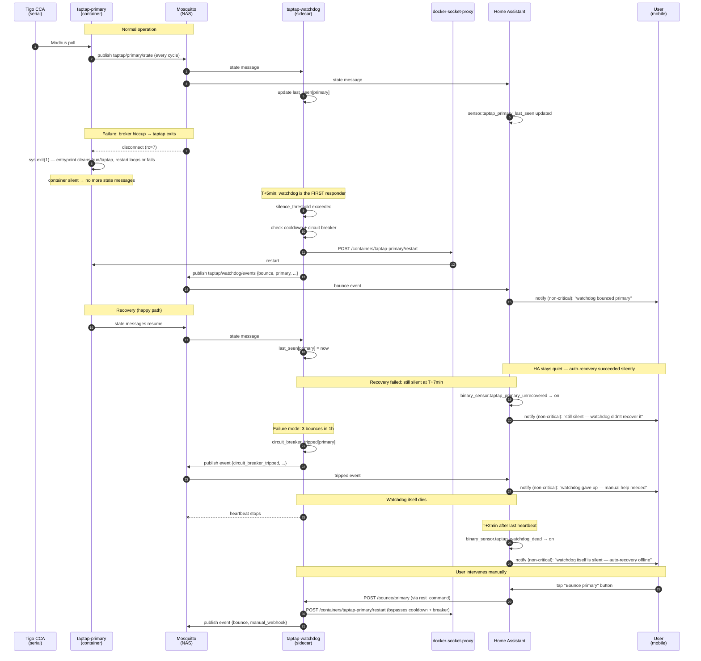

**Status:** Draft
**Date:** 2026-05-02

# Tigo MQTT Self-Healing System

A four-layer system that detects when the `taptap-{primary,secondary}` containers stop publishing to MQTT and recovers automatically: (1) root-cause hardening of the entrypoint, (2) static MQTT client IDs for log mineability, (3) a Pi-side watchdog sidecar that auto-restarts silent containers with circuit-breaker safety rails, and (4) Home Assistant integration that surfaces silence and bounce events as non-critical mobile notifications and exposes a manual bounce button.

## Motivation

On 2026-04-20 16:00:13 CDT both `taptap-primary` and `taptap-secondary` containers exited and stayed dead for 12 days, silently. The dashboard showed no panel data the entire time. Recovery required manual intervention.

The fault chain was:

1. The MQTT broker disconnected both clients at the exact same millisecond (broker- or network-side event, rc=7 from paho).
2. taptap-mqtt called `sys.exit(1)` rather than reconnecting.
3. The entrypoint fix in commit `6c903f8` only removed `/run/taptap/taptap.run` — the file. The `/run/taptap` *directory* persists across in-place restarts (it's created at image-build time by the `Dockerfile`). On the next startup, taptap-mqtt called `os.makedirs("/run/taptap")` without `exist_ok=True` and crashed with `[Errno 17] File exists: '/run/taptap'`.
4. The container's `restart: always` policy did not loop the restart out of this state — the cause is undetermined and is part of FR-1.
5. No alerting existed; the user discovered the outage 12 days later by looking at the dashboard.

The system needs three things it currently lacks:

- A correct entrypoint that handles directory-vs-file and unknown-state recovery.
- Independent detection of MQTT silence with autonomous recovery action.
- External alerting so a recurrence is noticed in minutes, not days.

A fourth observability gap is also addressed: the running taptap-mqtt clients use paho's auto-generated random client IDs, which means the 6 GB Mosquitto broker log on the NAS contains zero matches for "taptap" — historical disconnect frequency cannot be quantified retroactively.

## Functional Requirements

### FR-1: Root Cause Investigation and Hardening

**FR-1.1: Entrypoint hardening.** `tigo-mqtt/entrypoint.sh` SHALL replace the current `rm -f /run/taptap/taptap.run` line with `rm -rf /run/taptap` followed by `mkdir -p /run/taptap`. This handles both file and directory conflicts and creates a known-clean state regardless of what the previous instance left behind.

**FR-1.2: Restart-policy investigation.** Before changing watchdog behavior, the implementer SHALL determine why `restart: always` did not loop the container after the 2026-04-20 exit. Required diagnostic steps:

- Run `docker inspect taptap-{primary,secondary} --format '{{.RestartCount}}'` and record the value.
- Run `journalctl -u docker --since '2026-04-20 15:00' --until '2026-04-20 17:00'` on the Pi and capture any restart-related log entries.
- Run `docker events --since '2026-04-20T15:00:00' --until '2026-04-20T17:00:00'` if event history is retained.

The findings SHALL be recorded in `docs/TROUBLESHOOTING.md` under a new "Container Restart Policy" section. If the cause is determined to be a Docker daemon limitation (e.g., backoff cap), the watchdog (FR-3) is the authoritative recovery mechanism and `restart: always` is best-effort. If the cause is fixable (e.g., a `docker stop` was issued by an admin and never undone), the fix SHALL be applied.

**FR-1.3: Image rebuild verification.** After FR-1.1, the implementer SHALL rebuild the `tigo-mqtt` image on the Pi and verify the new `entrypoint.sh` is present in the running container by running `docker exec taptap-primary cat /app/entrypoint.sh | grep 'rm -rf /run/taptap'`.

### FR-2: Static MQTT Client IDs

**FR-2.1: Config field.** `tigo-mqtt/config-template.ini` SHALL gain a new `CLIENT_ID` key under the `[MQTT]` section. The template default value SHALL be `${MQTT_CLIENT_ID}`. The deployed `config-primary.ini` and `config-secondary.ini` SHALL set `CLIENT_ID` to `taptap-primary` and `taptap-secondary` respectively.

**FR-2.2: Environment plumbing.** `tigo-mqtt/entrypoint.sh` SHALL substitute `${MQTT_CLIENT_ID}` from the environment in addition to the existing substitutions. The `tigo-mqtt/docker-compose.yml` (deployed on the Pi, not tracked in git) SHALL set `MQTT_CLIENT_ID=taptap-primary` and `MQTT_CLIENT_ID=taptap-secondary` for the two services. The sample `tigo-mqtt/docker-compose.sample.yml` (tracked in git) SHALL include the same.

**FR-2.3: Upstream patch.** Because upstream `taptap-mqtt.py` (pinned to commit `c656d6b31247e906bf7186f28df36385018c8979`) constructs `mqtt.Client()` with no arguments, the `tigo-mqtt/Dockerfile` SHALL apply a `sed` patch during build that rewrites the constructor to:

```python
mqtt.Client(client_id=config.get('MQTT', 'CLIENT_ID', fallback=''))
```

The patch SHALL be applied immediately after the upstream tarball is extracted and before `pip install`. The patch SHALL be idempotent (a second application against an already-patched file SHALL be a no-op or fail loudly, not silently corrupt).

**FR-2.4: Patch verification at build.** The Dockerfile SHALL include a verification step (`grep -q "client_id=config.get" taptap-mqtt.py`) that fails the build if the patch did not apply. This catches upstream commit changes that move the `mqtt.Client()` line.

**FR-2.5: Setup wizard sync.** The setup wizard's config generator (`dashboard/backend/app/services/tigo_mqtt_generator.py`) and the CI sync check (`scripts/check-config-sync.py`) SHALL be updated to include `CLIENT_ID` so wizard-generated configs and the template stay in sync. The wizard SHALL default `CLIENT_ID` to `taptap-${TOPIC_NAME}`.

**FR-2.6: Backward compatibility.** A `CLIENT_ID` value of empty string SHALL be treated as "no client_id" — paho will then auto-generate as before. This preserves behavior for any deployments that don't supply the env var.

### FR-3: Watchdog Sidecar Container

**FR-3.1: New service.** `tigo-mqtt/docker-compose.yml` and `tigo-mqtt/docker-compose.sample.yml` SHALL gain a new service `taptap-watchdog`. The image SHALL be built from a new directory `tigo-mqtt/watchdog/` containing a `Dockerfile`, `app.py`, and `requirements.txt`.

**FR-3.2: Liveness signal.** The watchdog SHALL subscribe to MQTT topics `taptap/primary/state` and `taptap/secondary/state`. These topics are published every taptap update cycle (every few seconds) regardless of panel power output, making them suitable as a 24/7 heartbeat. The watchdog SHALL NOT use `taptap/{primary,secondary}/nodes/#` data as a liveness signal because panel data may legitimately stop at night.

**FR-3.3: Per-CCA last-seen tracking.** The watchdog SHALL maintain in-memory state `{primary: last_seen_ts, secondary: last_seen_ts}`, updated on every state-topic message. On startup, both timestamps SHALL be initialized to the current time (grace period — don't bounce immediately on startup).

**FR-3.4: Bounce trigger.** When a CCA's `now - last_seen_ts > 300` seconds (5 minutes), the watchdog SHALL initiate a bounce of that CCA's container, subject to FR-3.6 and FR-3.7.

**FR-3.5: Bounce action.** A bounce SHALL execute `POST /containers/{name}/restart` against the Docker socket (via `docker-socket-proxy`, see FR-3.10), where `{name}` is `taptap-primary` or `taptap-secondary`. The bounce SHALL log the event with timestamp, container name, and trigger reason (`silence_threshold` or `manual_webhook`).

**FR-3.6: Cooldown.** After a bounce of a CCA's container completes, the watchdog SHALL NOT bounce that same container again for 15 minutes (`COOLDOWN_SEC=900`), regardless of trigger source — except a manual webhook (FR-3.10), which overrides the cooldown.

**FR-3.7: Circuit breaker.** If the watchdog has executed 3 or more bounces of a single container within the trailing 60-minute window, the watchdog SHALL trip a circuit breaker for that container. Tripped state means: no further automatic bounces of that container until the circuit breaker resets. The circuit breaker SHALL reset when no bounces have occurred in the trailing 60-minute window. Manual webhook bounces (FR-3.10) bypass the circuit breaker.

**FR-3.8: Bounce events.** Each bounce SHALL publish a JSON message to MQTT topic `taptap/watchdog/events` with this shape:

```json
{
  "event": "bounce",
  "container": "taptap-primary",
  "reason": "silence_threshold",
  "silent_seconds": 312,
  "ts": "2026-05-02T18:30:42.123Z"
}
```

`reason` is one of `silence_threshold`, `manual_webhook`. Messages SHALL be published with QoS 1, retain=false.

**FR-3.9: Circuit-breaker events.** Circuit-breaker trip and reset events SHALL be published to MQTT topic `taptap/watchdog/events` with the same envelope and `event` values of `circuit_breaker_tripped` and `circuit_breaker_reset`. Trip events SHALL include `bounces_in_window: 3`. These events SHALL be published with retain=true so a subscriber connecting later sees the current state.

**FR-3.10: Manual webhook.** The watchdog SHALL expose an HTTP endpoint `POST /bounce/{primary|secondary}` on port 8080 (configurable via env). This endpoint SHALL:

- Bypass cooldown (FR-3.6) and circuit breaker (FR-3.7).
- Bounce the requested container.
- Publish a bounce event with `reason=manual_webhook`.
- Return `{"ok": true, "bounced": "<container>"}` with HTTP 200 on success.
- Return HTTP 400 if the path parameter is not `primary` or `secondary`.
- Return HTTP 500 with the error message if the Docker call fails.
- Be unauthenticated (LAN-only via Docker network exposure; see NFR-1.2).

**FR-3.11: Health endpoint.** The watchdog SHALL expose `GET /healthz` on the same port returning JSON:

```json
{
  "status": "ok",
  "ccas": {
    "primary":   { "last_seen": "2026-05-02T18:30:42.123Z", "silent_seconds": 4, "circuit_breaker": "closed", "bounces_last_hour": 0 },
    "secondary": { "last_seen": "2026-05-02T18:30:41.987Z", "silent_seconds": 4, "circuit_breaker": "closed", "bounces_last_hour": 0 }
  },
  "mqtt": { "connected": true, "last_message_at": "2026-05-02T18:30:42.123Z" }
}
```

`status` SHALL be `"ok"` if MQTT is connected and no circuit breaker is tripped, `"degraded"` if any circuit breaker is tripped, or `"down"` if MQTT is disconnected.

**FR-3.12: Broker-disconnect safety.** When the watchdog itself loses its MQTT connection to the broker, it SHALL NOT initiate any bounces. Rationale: a broker outage means we can't see liveness signals at all, and bouncing the taptap containers won't help — the broker is the problem. The watchdog SHALL keep retrying its own connection (paho's `loop_forever()` with default reconnect behavior). When MQTT reconnects, the per-CCA `last_seen_ts` values SHALL be reset to the current time (grace period — don't immediately bounce containers that *might* have been silent during the broker outage).

**FR-3.13: State persistence.** The watchdog SHALL persist bounce history (timestamp + container) to `/data/watchdog.db` (SQLite) so that the circuit-breaker rolling window survives a watchdog restart. On startup, the watchdog SHALL load bounce history from SQLite and reconstruct the rolling-window counters. Schema:

```sql
CREATE TABLE IF NOT EXISTS bounces (
  id INTEGER PRIMARY KEY AUTOINCREMENT,
  container TEXT NOT NULL,
  reason TEXT NOT NULL,
  ts INTEGER NOT NULL  -- unix epoch seconds
);
CREATE INDEX IF NOT EXISTS idx_bounces_ts ON bounces(ts);
```

The watchdog SHALL prune rows older than 24 hours on startup.

**FR-3.14: Watchdog restart policy.** The watchdog container SHALL have `restart: unless-stopped` in `docker-compose.yml`. Rationale: if the watchdog itself crashes, we want it back up; if the operator explicitly stopped it, we want it to stay stopped.

**FR-3.15: Logging.** The watchdog SHALL log to stdout (captured by Docker) at `INFO` level by default. Bounce decisions, MQTT connect/disconnect, and circuit-breaker state changes SHALL log at `INFO`. Per-message liveness updates SHALL log at `DEBUG` only.

**FR-3.16: Heartbeat.** The watchdog SHALL publish a heartbeat to MQTT topic `taptap/watchdog/heartbeat` every 30 seconds with `retain=true` and QoS 1. Payload:

```json
{ "ts": "2026-05-02T18:30:42.123Z", "uptime_seconds": 12345 }
```

This allows external observers (HA in particular) to detect when the watchdog *itself* has gone silent — a failure mode the watchdog cannot self-report. The retain flag ensures a subscriber connecting after a watchdog outage immediately sees the stale timestamp.

### FR-4: Home Assistant Integration

**Design intent.** HA is *not* the first responder. The watchdog (FR-3) handles common failures autonomously; HA only fires for events the watchdog cannot handle silently or cannot detect at all. Specifically: (a) post-fact bounce confirmations, (b) recovery-failed escalations, and (c) watchdog-itself-dead detection. The watchdog's 5-minute bounce threshold (FR-3.4) is the *first* automated response to silence; HA notifications all happen at or after that point.

**FR-4.1: MQTT sensors.** Three HA `sensor` entities SHALL track timestamps via the MQTT integration:

- `sensor.taptap_primary_last_seen` — fed by `taptap/primary/state` message receipts
- `sensor.taptap_secondary_last_seen` — fed by `taptap/secondary/state` message receipts
- `sensor.taptap_watchdog_last_seen` — fed by `taptap/watchdog/heartbeat` message receipts (per FR-3.16)

All three use `device_class: timestamp`.

**FR-4.2: Binary sensors.** Three HA template `binary_sensor` entities SHALL evaluate to `on` (problem) based on staleness of the corresponding sensor in FR-4.1:

- `binary_sensor.taptap_primary_unrecovered` — `on` when `sensor.taptap_primary_last_seen` is more than **420 seconds** (7 min) old. This threshold is intentionally 2 minutes after the watchdog's 5-minute bounce trigger, giving the bounce time to take effect. If silence persists past 7 min, the watchdog either didn't fire or didn't help.
- `binary_sensor.taptap_secondary_unrecovered` — same logic for secondary.
- `binary_sensor.taptap_watchdog_dead` — `on` when `sensor.taptap_watchdog_last_seen` is more than **120 seconds** (2 min) old. The watchdog beats every 30 seconds (FR-3.16), so 2 min indicates real failure (4 missed beats).

All three use `device_class: problem`.

**FR-4.3: Watchdog-failed-to-recover automation.** An HA automation SHALL trigger when either `binary_sensor.taptap_*_unrecovered` from FR-4.2 changes to `on` and stays on `for: 30 seconds` (debounce). The automation SHALL call `notify.mobile_app_<device>` with:

- Title: `Tigo: <which> CCA still silent — watchdog didn't recover it`
- Body: `Silent for <N> minutes. Watchdog should have bounced at 5 min. Check watchdog logs and CCA hardware.`
- Data: `{"push": {"interruption-level": "active"}}` for iOS, `{"channel": "default", "importance": "default"}` for Android. **The notification SHALL NOT be marked as critical/time-sensitive/high-importance** — this is an explicit user requirement.

The exact `notify.mobile_app_*` entity name is deployment-specific. The implementer SHALL discover it via `python3 dashboards/scripts/query_entities.py --filter mobile_app` against the user's HA instance and substitute it into the automation YAML.

**FR-4.4: Bounce-confirmation automation.** An HA automation SHALL subscribe to MQTT topic `taptap/watchdog/events` and trigger when `event == "bounce"`. The automation SHALL call the same `notify.mobile_app_<device>` service with:

- Title: `Tigo: watchdog bounced <container>`
- Body: `Reason: <reason>. Silent for <silent_seconds>s.`
- Same non-critical notification level as FR-4.3.

This is informational ("the system self-healed"), not an alert. It exists so the user knows recovery happened without having to check the dashboard.

**FR-4.5: Circuit-breaker escalation automation.** An HA automation SHALL subscribe to MQTT topic `taptap/watchdog/events` and trigger when `event == "circuit_breaker_tripped"`. The automation SHALL call `notify.mobile_app_<device>` with:

- Title: `Tigo: watchdog gave up on <container>`
- Body: `3 bounces in the last hour didn't fix it. Manual investigation needed.`
- Same non-critical notification level as FR-4.3 (the user has explicitly opted out of critical priority — escalation is via wording in the message body, not via notification importance).

**FR-4.5b: Watchdog-dead automation.** An HA automation SHALL trigger when `binary_sensor.taptap_watchdog_dead` (FR-4.2) changes to `on` and stays on `for: 30 seconds` (debounce). The automation SHALL call `notify.mobile_app_<device>` with:

- Title: `Tigo: watchdog itself is silent`
- Body: `No heartbeat for >2 min. Auto-recovery is offline. Check the watchdog container.`
- Same non-critical notification level as FR-4.3.

This is the only failure mode the watchdog cannot self-report — without HA monitoring the heartbeat, watchdog death would go undetected.

**FR-4.6: Manual bounce dashboard buttons.** The buttons SHALL be added to the **Panels page of the Solar dashboard**, located at `~/code/nas_docker/solar_assistant/dashboards/solar_dashboard.yaml`, in the view with `path: panels` (currently around line 4151).

The Panels view is currently `type: panel`, which permits only one card. The existing `custom:addon-iframe-card` (pointing to `https://tigo.casadesco.com/?view=layout&mode=watts`) SHALL be wrapped in a `vertical-stack` card so the iframe and the bounce buttons can both live in the single allowed slot. Layout:

```yaml
  - title: Panels
    path: panels
    type: panel
    cards:
      - type: vertical-stack
        cards:
          - type: custom:addon-iframe-card
            url: "https://tigo.casadesco.com/?view=layout&mode=watts"
            aspect_ratio: "150%"
          - type: horizontal-stack
            cards:
              - type: button
                name: Bounce Primary
                icon: mdi:restart
                tap_action:
                  action: call-service
                  service: rest_command.taptap_bounce_primary
                  confirmation:
                    text: "Restart taptap-primary container?"
              - type: button
                name: Bounce Secondary
                icon: mdi:restart
                tap_action:
                  action: call-service
                  service: rest_command.taptap_bounce_secondary
                  confirmation:
                    text: "Restart taptap-secondary container?"
```

The `confirmation` field is required on both buttons — manual bounce is a state-changing action and the user should be required to confirm before triggering. The buttons SHALL NOT have visual treatment that suggests urgency (no red coloring, warning icons, etc.).

**FR-4.7: REST commands.** HA's `configuration.yaml` (via the existing `command_line: !include templates/command_line_sensors.yaml` pattern, or an inline `rest_command:` block) SHALL define two REST commands:

```yaml
rest_command:
  taptap_bounce_primary:
    url: "http://192.168.2.93:8080/bounce/primary"
    method: POST
    timeout: 10
  taptap_bounce_secondary:
    url: "http://192.168.2.93:8080/bounce/secondary"
    method: POST
    timeout: 10
```

The Pi LAN IP `192.168.2.93` SHALL be substituted from `.claude/env`'s `PI_HOST` at deploy time.

**FR-4.8: Notification opt-out.** Each notification automation SHALL have a corresponding `input_boolean` that, when off, suppresses that notification. The automations SHALL gate on these booleans via condition. This lets the user mute alerts during planned maintenance.

| Automation | Opt-out boolean |
|---|---|
| FR-4.3 (CCA unrecovered) | `input_boolean.tigo_unrecovered_alerts` |
| FR-4.4 (bounce confirmation) | `input_boolean.tigo_bounce_alerts` |
| FR-4.5 (circuit breaker) | `input_boolean.tigo_escalation_alerts` |
| FR-4.5b (watchdog dead) | `input_boolean.tigo_watchdog_alerts` |

All four input_booleans SHALL default to `on` (alerts enabled).

### FR-5: Documentation

**FR-5.1: CLAUDE.md updates.** `CLAUDE.md` SHALL gain a new section "Self-Healing System" documenting:
- The watchdog's purpose and thresholds
- How to view watchdog logs: `sudo docker logs taptap-watchdog`
- How to view watchdog state: `curl http://192.168.2.93:8080/healthz | jq`
- How to manually trigger a bounce: `curl -X POST http://192.168.2.93:8080/bounce/primary`
- How to disable the watchdog (compose stop) for planned maintenance

**FR-5.2: Troubleshooting.** `docs/TROUBLESHOOTING.md` SHALL gain entries for:
- "taptap container is dead and won't restart" (the FR-1.2 finding)
- "Watchdog circuit breaker tripped"
- "HA notifications not arriving"

**FR-5.3: README quick reference.** Add a one-paragraph mention of the watchdog and HA integration to the project README (if one exists; if not, this requirement is moot).

## Non-Functional Requirements

### NFR-1: Safety

**NFR-1.1: State files MUST NEVER be touched.** No watchdog code path, entrypoint change, or compose change SHALL read, write, move, or delete files under `tigo-mqtt/data/{primary,secondary}/taptap.state`. The watchdog container SHALL NOT mount the data volume.

**NFR-1.2: Least-privilege Docker access.** The watchdog SHALL NOT mount `/var/run/docker.sock` directly. It SHALL communicate with `docker-socket-proxy` (image: `tecnativa/docker-socket-proxy:0.3.0`), which exposes only specific Docker API endpoints over a TCP port on the compose-internal network. Required endpoints: `CONTAINERS=1`, `POST=1`. All other endpoints (`IMAGES`, `NETWORKS`, `VOLUMES`, `EXEC`, `BUILD`, etc.) SHALL be `0`. The proxy SHALL bind only to the compose-internal network and SHALL NOT be exposed to the LAN.

**NFR-1.3: Bounce audit trail.** Every bounce action (autonomous or manual) SHALL be persisted to SQLite (FR-3.13) and published to MQTT (FR-3.8). Loss of one signal SHALL NOT lose the audit record.

**NFR-1.4: No state-file recovery.** If the watchdog detects the state file is missing or zero-byte (it will not, because NFR-1.1 forbids reading it — but defense-in-depth), it SHALL NOT take any recovery action and SHALL escalate via FR-4.5. State file recovery is a manual operator task per existing `CLAUDE.md` documentation.

### NFR-2: Reliability

**NFR-2.1: Watchdog survives its own restart.** Bounce history SHALL persist to SQLite (FR-3.13) so circuit-breaker decisions are consistent across watchdog restarts.

**NFR-2.2: Broker outage handling.** When the watchdog cannot reach the MQTT broker, it SHALL NOT bounce containers (FR-3.12).

**NFR-2.3: Timer accuracy.** The silence-detection loop SHALL run at least every 30 seconds. With a 5-minute threshold, this gives at most 30 seconds of additional latency beyond the threshold.

**NFR-2.4: Webhook latency.** The webhook endpoint SHALL respond within 5 seconds for the success path. The Docker `restart` API call typically completes in 1-3 seconds.

### NFR-3: Observability

**NFR-3.1: Health endpoint exposes everything operators need.** Per FR-3.11, all relevant state is in `GET /healthz`.

**NFR-3.2: Logs are timestamped.** All watchdog logs SHALL include ISO-8601 UTC timestamps.

**NFR-3.3: MQTT events are durable.** Bounce events use QoS 1; circuit-breaker events use QoS 1 + retain=true.

### NFR-4: Resource Budget

**NFR-4.1: Memory.** The watchdog container's RSS SHALL stay below 50 MB under steady-state operation.

**NFR-4.2: CPU.** The watchdog SHALL consume less than 1% CPU on the Raspberry Pi under steady state.

**NFR-4.3: Disk.** The SQLite DB SHALL be bounded by the 24-hour retention (FR-3.13). Expected size: <100 KB.

### NFR-5: Maintainability

**NFR-5.1: All thresholds via env.** The 5-minute silence threshold, 15-minute cooldown, 3-bounces/hour circuit breaker, and 60-minute rolling window SHALL be configurable via environment variables (`SILENCE_THRESHOLD_SEC`, `COOLDOWN_SEC`, `CIRCUIT_BREAKER_BOUNCES`, `CIRCUIT_BREAKER_WINDOW_SEC`) with the default values listed.

**NFR-5.2: Static client IDs are an enabler.** Future debugging SHALL be able to grep `/volume1/docker/mosquitto/log/mosquitto.log` for `taptap-primary` and `taptap-secondary` to find connect/disconnect history. After this spec is implemented, the user SHALL be able to verify this by running `ssh nas1 "tail -10000 /volume1/docker/mosquitto/log/mosquitto.log | grep taptap"` and seeing connect events.

## High Level Design

### Sequence diagram



### Architecture

```
┌─────────────────────────── Raspberry Pi ───────────────────────────┐
│                                                                    │
│  ┌──────────────┐   ┌──────────────┐                               │
│  │ taptap-      │   │ taptap-      │                               │
│  │ primary      │   │ secondary    │                               │
│  │              │   │              │                               │
│  │ client_id =  │   │ client_id =  │                               │
│  │  "taptap-    │   │  "taptap-    │                               │
│  │   primary"   │   │   secondary" │                               │
│  └──────┬───────┘   └──────┬───────┘                               │
│         │ MQTT             │ MQTT                                  │
│         │ (state, nodes)   │ (state, nodes)                        │
│         │                  │                                       │
│  ┌──────┴──────────────────┴──────┐                                │
│  │  Mosquitto broker on NAS       │                                │
│  │  192.168.2.199:1883            │◀──────────┐                    │
│  └──────┬─────────────────────────┘           │                    │
│         │                                     │                    │
│         │ subscribe state + watchdog events   │ publish events     │
│         ▼                                     │                    │
│  ┌─────────────────┐    HTTP    ┌─────────────┴─────┐              │
│  │ taptap-watchdog │───────────▶│ docker-socket-    │              │
│  │  (FastAPI :8080)│  Docker    │ proxy             │──┐           │
│  │                 │  API       │ (CONTAINERS only) │  │           │
│  │  /healthz       │            └───────────────────┘  │           │
│  │  /bounce/{id}   │                                   │ /var/run/ │
│  │                 │                                   │ docker.sk │
│  │  SQLite (state) │                                   ▼           │
│  └─────────────────┘                            [Docker daemon]    │
│         ▲                                                          │
└─────────│──────────────────────────────────────────────────────────┘
          │ POST /bounce (rest_command)
          │ subscribe taptap/watchdog/events (mqtt sensor)
          │
   ┌──────┴────────────┐
   │ Home Assistant    │
   │ 192.168.2.25:8123 │
   │                   │     mobile_app push (NOT critical)
   │  - sensors        │────────────────────────▶  📱 user
   │  - binary_sensors │
   │  - automations    │
   │  - rest_commands  │
   │  - input_booleans │
   └───────────────────┘
```

### Watchdog implementation sketch

Pinned dependencies:
- Python: `python:3.11-slim-bookworm` (matches existing tigo-mqtt image)
- `paho-mqtt==1.6.1` (matches existing taptap-mqtt to avoid version drift)
- `fastapi==0.115.4`
- `uvicorn[standard]==0.32.0`
- `httpx==0.27.2` (for talking to docker-socket-proxy)

Versions verified current as of 2026-05-02. Use `pip index versions <pkg>` at implementation time to confirm latest.

```python
# tigo-mqtt/watchdog/app.py (sketch — full implementation in Phase 3)
import asyncio, json, os, sqlite3, time
from contextlib import asynccontextmanager
from fastapi import FastAPI, HTTPException
import httpx
import paho.mqtt.client as mqtt

SILENCE_THRESHOLD_SEC      = int(os.environ.get("SILENCE_THRESHOLD_SEC", "300"))
COOLDOWN_SEC               = int(os.environ.get("COOLDOWN_SEC", "900"))
CIRCUIT_BREAKER_BOUNCES    = int(os.environ.get("CIRCUIT_BREAKER_BOUNCES", "3"))
CIRCUIT_BREAKER_WINDOW_SEC = int(os.environ.get("CIRCUIT_BREAKER_WINDOW_SEC", "3600"))

DOCKER_PROXY = os.environ["DOCKER_PROXY_URL"]      # e.g. http://docker-socket-proxy:2375
MQTT_HOST    = os.environ["MQTT_SERVER"]
MQTT_USER    = os.environ["MQTT_USER"]
MQTT_PASS    = os.environ["MQTT_PASS"]

DB_PATH = "/data/watchdog.db"

class State:
    last_seen = {"primary": time.time(), "secondary": time.time()}
    last_bounce = {"primary": 0, "secondary": 0}
    mqtt_connected = False
    mqtt_last_msg_at = None

state = State()

def init_db():
    conn = sqlite3.connect(DB_PATH)
    conn.executescript("""
      CREATE TABLE IF NOT EXISTS bounces (
        id INTEGER PRIMARY KEY AUTOINCREMENT,
        container TEXT NOT NULL,
        reason TEXT NOT NULL,
        ts INTEGER NOT NULL
      );
      CREATE INDEX IF NOT EXISTS idx_bounces_ts ON bounces(ts);
    """)
    conn.execute("DELETE FROM bounces WHERE ts < ?", (int(time.time()) - 86400,))
    conn.commit()
    return conn

def bounce(container: str, reason: str, override: bool = False) -> dict:
    """Bounce a container. override=True bypasses cooldown + circuit breaker."""
    now = time.time()
    if not override:
        if now - state.last_bounce[container] < COOLDOWN_SEC:
            return {"skipped": "cooldown", "container": container}
        recent = recent_bounces(container, CIRCUIT_BREAKER_WINDOW_SEC)
        if recent >= CIRCUIT_BREAKER_BOUNCES:
            publish_event("circuit_breaker_tripped", container, bounces_in_window=recent)
            return {"skipped": "circuit_breaker", "container": container}

    name = f"taptap-{container}"
    r = httpx.post(f"{DOCKER_PROXY}/containers/{name}/restart", timeout=10.0)
    r.raise_for_status()

    state.last_bounce[container] = now
    record_bounce(container, reason)
    publish_event("bounce", container, reason=reason, silent_seconds=int(now - state.last_seen[container]))
    return {"ok": True, "bounced": name}

# ... mqtt callbacks, FastAPI routes, silence-check loop ...
```

### Threshold reference

Sequence (silent failure path, no user intervention):

| T+    | Trigger                                  | Layer    | Action                                              |
|-------|------------------------------------------|----------|-----------------------------------------------------|
| 0:00  | CCA stops publishing                     | —        | (nothing yet)                                       |
| 5:00  | Auto-bounce silence threshold            | Watchdog | `docker restart` via socket proxy                   |
| 5:01  | Bounce event published to MQTT           | Watchdog | publish `taptap/watchdog/events`                    |
| 5:02  | Bounce-confirmation push                 | HA       | "FYI: bounced primary"                              |
| 5:30  | (recovery succeeds) heartbeat resumes    | —        | done                                                |
| 7:00  | (recovery failed) `*_unrecovered` → on   | HA       | binary_sensor flips                                 |
| 7:30  | Unrecovered alert push                   | HA       | "still silent — watchdog didn't recover it"         |
| ...   | repeated bounces, 3rd in 1 hour          | Watchdog | trip circuit breaker; publish event                 |
| event | Circuit-breaker escalation push          | HA       | "watchdog gave up — manual help needed"             |

Other thresholds:

| Trigger                             | Layer    | Threshold     | Action                                       |
|-------------------------------------|----------|---------------|----------------------------------------------|
| Cooldown after bounce               | Watchdog | 15 min        | Skip subsequent auto-bounces                 |
| Circuit-breaker bounces in window   | Watchdog | 3             | Trip; stop auto-bouncing                     |
| Circuit-breaker rolling window      | Watchdog | 60 min        | Window for counting bounces                  |
| Manual webhook                      | HA → WD  | on demand     | Bypass cooldown + circuit breaker            |
| Silence-check loop frequency        | Watchdog | 30 s          | How often to evaluate thresholds             |
| Watchdog heartbeat                  | Watchdog | 30 s          | Publish `taptap/watchdog/heartbeat`          |
| Watchdog SQLite retention           | Watchdog | 24 h          | Old bounce records pruned on startup         |
| Watchdog grace period after start   | Watchdog | initialize    | last_seen=now to avoid first-bounce          |
| Watchdog-dead detection             | HA       | 2 min         | binary_sensor + push (only HA can detect)    |

### Trade-off analysis

**Watchdog state persistence: SQLite vs in-memory only**

- *In-memory only*: simpler. Loses circuit-breaker state on watchdog restart, which can cause repeated bounce loops if the watchdog itself crashes during a bounce storm.
- *SQLite (selected)*: small overhead (single file, ~100 KB), survives restart. The circuit breaker is the primary safety rail against bounce loops, so its persistence matters.

Selected: SQLite.

**Docker socket access: raw socket vs docker-socket-proxy**

- *Raw socket*: trivial setup, but the watchdog gains effective root on the Pi (`docker run` access can mount any host path).
- *docker-socket-proxy (selected)*: an extra container, but limits the watchdog to only `POST /containers/<name>/restart`. Compromise of the watchdog cannot escalate to host root.

Selected: docker-socket-proxy. The minor extra complexity is worth the privilege boundary.

**HA detection: MQTT topic age vs separate watchdog ping**

- *Topic age (selected)*: HA already speaks MQTT, no extra moving parts. Same liveness signal as the watchdog so they agree on what "silent" means.
- *Watchdog ping*: HA polls `/healthz` directly. More moving parts, more failure modes, no advantage.

Selected: MQTT topic age.

**Static client IDs: fork upstream vs in-Dockerfile sed patch**

- *Fork upstream*: cleanest in source, but adds a maintenance burden — every upstream update means rebasing.
- *In-Dockerfile sed patch (selected)*: small, contained, visible in git history, cheap to update if upstream changes the constructor line. The build-time verification (FR-2.4) catches regressions.

Selected: in-Dockerfile sed patch.

### Edge cases

- **Both CCAs silent simultaneously.** Each container has independent cooldown and circuit-breaker counters. Both will bounce. If both trip their breakers, two escalation notifications arrive — that is intended.
- **Watchdog can't reach docker-socket-proxy.** `httpx.post` raises; the bounce event records `event=bounce_failed` (not specified above as a separate FR — added here as an implementation requirement). Subsequent silence will retry on the next loop iteration, subject to cooldown.
- **MQTT broker on NAS is the silent one (whole broker outage).** Both CCAs' last_seen will go stale, but the watchdog also can't connect to the broker. Per FR-3.12, the watchdog suspends auto-bouncing until it reconnects. Recovery: when the broker comes back, the watchdog reconnects, resets last_seen=now, and auto-bouncing resumes — with the next genuine silence triggering normally after the threshold.
- **HA is down when a bounce happens.** The watchdog acts autonomously; HA just doesn't see the events. When HA reconnects, retained circuit-breaker state messages (FR-3.9) catch it up. Bounce events (retain=false) are lost — that's acceptable since they are informational only.
- **Manual bounce while in cooldown.** Honored. Manual is an explicit user override.
- **Manual bounce of a non-existent container path.** Webhook returns HTTP 400.
- **Watchdog clock skew.** The watchdog uses `time.time()` (system clock). The Pi runs NTP, so skew should be small. If the clock jumps backward, last_seen times in the future could prevent bouncing — acceptable risk.

## Task Breakdown

Tasks are grouped into PRs. Each PR is independently reviewable, mergeable, and testable.

### PR 1: Root cause hardening + static client IDs

Small, low-risk. Land first to fix the immediate fragility.

1. **FR-1.1**: Update `tigo-mqtt/entrypoint.sh` to `rm -rf /run/taptap && mkdir -p /run/taptap`.
2. **FR-1.2**: Run the diagnostic commands and record findings in `docs/TROUBLESHOOTING.md`. If a fixable cause is found, apply the fix.
3. **FR-1.3**: Rebuild the tigo-mqtt image on the Pi and verify the new entrypoint is in the running container.
4. **FR-2.1, FR-2.2, FR-2.6**: Add `CLIENT_ID = ${MQTT_CLIENT_ID}` to `config-template.ini`; add env-var substitution to `entrypoint.sh`.
5. **FR-2.3, FR-2.4**: Add the sed patch and build-time verification to `Dockerfile`.
6. **FR-2.5**: Update `dashboard/backend/app/services/tigo_mqtt_generator.py` and `scripts/check-config-sync.py`.
7. Update the deployed `docker-compose.yml` on the Pi with `MQTT_CLIENT_ID` env vars; mirror in `docker-compose.sample.yml`.
8. Verify in mosquitto broker logs: `ssh nas1 "tail -1000 /volume1/docker/mosquitto/log/mosquitto.log | grep taptap"` SHALL show connect events with the new client IDs.

### PR 2: Watchdog sidecar

Medium. The bulk of the new code.

1. Create `tigo-mqtt/watchdog/` directory with:
   - `Dockerfile` (FROM python:3.11-slim-bookworm, install pinned deps)
   - `app.py` (FastAPI app + paho-mqtt client + SQLite + silence loop)
   - `requirements.txt` (pinned versions per High Level Design)
2. Implement FR-3.2 through FR-3.15.
3. Add `taptap-watchdog` and `docker-socket-proxy` services to `tigo-mqtt/docker-compose.yml` and `docker-compose.sample.yml` per NFR-1.2.
4. Add unit tests in `tigo-mqtt/watchdog/tests/`:
   - Cooldown logic
   - Circuit-breaker logic (trip on 3rd, reset after window)
   - SQLite persistence (restart watchdog, verify state)
   - MQTT-disconnect-suspends-bouncing
   - Manual webhook bypass
5. Add an integration test or manual smoke-test runbook: stop a taptap container manually, verify watchdog bounces it within 5–6 minutes.
6. Documentation per FR-5.1 and FR-5.2.

### PR 3: Home Assistant integration

Small to medium. Depends on PR 2.

1. Discover the user's `notify.mobile_app_<device>` entity via `query_entities.py`.
2. Add MQTT sensors (FR-4.1) and template binary_sensors (FR-4.2) to HA configuration. The exact YAML location depends on the user's HA config layout — likely `templates/binary_sensors.yaml` or similar.
3. Add automations (FR-4.3, FR-4.4, FR-4.5) to `automations.yaml`.
4. Add `rest_command` definitions (FR-4.7) to `configuration.yaml`.
5. Add `input_boolean` entries for opt-out (FR-4.8).
6. Add dashboard buttons (FR-4.6) to one of the existing dashboards.
7. Push to HA via the existing `dashboards/scripts/push_dashboard.py` (or equivalent for non-dashboard YAML).
8. Manual test: stop a taptap container, verify both notifications arrive (HA at 2 min, bounce confirmation at 5 min). Verify they are non-critical (no banner-style takeover, no critical-tone audio).
9. Manual test: tap the dashboard button, verify the bounce happens and the manual-webhook event arrives.

## Related Specifications

| Spec | Relationship | Notes |
|------|--------------|-------|
| [CCA Log Viewer](2026-02-08-cca-log-viewer.md) | related | Surfaces taptap container logs in the dashboard. The watchdog's bounce events could optionally be displayed there in the future. Not a dependency for this spec. |
| [Disk-Backed Log Storage](2026-02-09-disk-backed-log-storage.md) | related | Persists log data; out of scope for the watchdog itself. |

No specs are blocking dependencies. No specs are superseded.

## Context / Documentation

Files that the implementer will read or modify:

**Modified:**
- `tigo-mqtt/entrypoint.sh` (FR-1.1, FR-2.2)
- `tigo-mqtt/Dockerfile` (FR-2.3, FR-2.4)
- `tigo-mqtt/config-template.ini` (FR-2.1)
- `tigo-mqtt/docker-compose.sample.yml` (FR-2.2, FR-3.1, NFR-1.2)
- `dashboard/backend/app/services/tigo_mqtt_generator.py` (FR-2.5)
- `scripts/check-config-sync.py` (FR-2.5)
- `CLAUDE.md` (FR-5.1)
- `docs/TROUBLESHOOTING.md` (FR-1.2, FR-5.2)
- `tigo-mqtt/docker-compose.yml` on the Pi (NOT in git — modified out-of-tree per existing convention)

**Created:**
- `tigo-mqtt/watchdog/Dockerfile`
- `tigo-mqtt/watchdog/app.py`
- `tigo-mqtt/watchdog/requirements.txt`
- `tigo-mqtt/watchdog/tests/test_*.py`
- HA YAML additions (location depends on user's HA config layout)

**Read-only references:**
- Upstream taptap-mqtt: https://github.com/litinoveweedle/taptap-mqtt (commit `c656d6b31247e906bf7186f28df36385018c8979`)
- paho-mqtt 1.6.1 docs: https://eclipse.dev/paho/files/paho.mqtt.python/html/index.html
- docker-socket-proxy: https://github.com/Tecnativa/docker-socket-proxy
- HA mobile_app notifications: https://companion.home-assistant.io/docs/notifications/notifications-basic
- HA `rest_command`: https://www.home-assistant.io/integrations/rest_command/
- Mosquitto broker config on NAS: `~/code/nas_docker/mosquitto/`
- HA config root: `~/code/nas_docker/home_assistant/` and SMB mount `~/ha_config_mount`
- Pi credentials env: `.claude/env` (PI_HOST, PI_USER, PI_PASS)

State files (NEVER MODIFIED — see NFR-1.1):
- `tigo-mqtt/data/{primary,secondary}/taptap.state` on the Pi NAS

---

**Specification Version:** 1.1
**Last Updated:** May 2026
**Authors:** Ian Scofield (with Claude)

## Changelog

### v1.1 (May 2026)

**Summary:** Inverted alerting model — watchdog is now the first responder, HA reacts to events.

**Changes:**
- FR-3.16 added: watchdog publishes a 30-second heartbeat to `taptap/watchdog/heartbeat` (retain=true).
- FR-4.1 expanded: third sensor for watchdog heartbeat timestamp.
- FR-4.2 reworked: binary_sensors now detect "still silent at 7 min" (after watchdog should have acted) and "watchdog dead at 2 min" — not "silent at 2 min".
- FR-4.3 reworked: the 2-min early-warning automation removed; replaced with "watchdog-failed-to-recover" automation that fires at 7 min.
- FR-4.5b added: HA-only detection of watchdog death.
- FR-4.6 specified: bounce buttons placed inside a `vertical-stack` wrapping the existing iframe in the Panels view of `solar_dashboard.yaml` (around line 4151), with confirmation dialogs.
- FR-4.8 expanded: four opt-out booleans matching the four automations.
- Threshold table and Mermaid sequence diagram updated to reflect the new ordering.

**Rationale:**
- Original v1.0 had HA firing at 2 min and watchdog at 5 min. User correctly pointed out this is backwards: the watchdog is closer to the failure (same Pi, no network/HA dependency) and should be the first automated response. HA alerting before the watchdog means the user gets pinged for transient events the watchdog would have silently fixed.
- Self-healing systems should auto-recover silently and only alert humans when the system *can't* fix itself. The new model embodies that: watchdog acts at 5 min, HA fires confirmation post-fact, escalates only if recovery fails or watchdog itself is dead.
- A heartbeat is required because the watchdog cannot self-report its own death; only HA's external view can detect it.

**Impact:**
- Implementer notes for PR 3 change: HA gains 3 sensors (was 2), 3 binary_sensors (was 2), 4 automations (was 3), 4 input_booleans (was 3). The 2-min "early warning silence" automation that was in v1.0 is gone — do not implement it.

### v1.0 (May 2026)

**Summary:** Initial specification.

**Changes:**
- Initial specification created covering root-cause entrypoint fix, static MQTT client IDs, Pi-side watchdog sidecar with circuit breaker, and Home Assistant alerting integration.

**Rationale:**
- 12-day silent outage on 2026-04-20 made detection + auto-recovery a hard requirement.
- Lack of static client IDs blocked retroactive analysis of broker disconnect frequency from the 6 GB Mosquitto log.
- User explicitly required: state files must never be touched, HA notifications must NOT be critical, watchdog and HA must use staggered (non-simultaneous) thresholds.

**Impact:**
- One new sidecar container, one new infrastructure container (docker-socket-proxy) on the Pi.
- HA gains sensors, binary_sensors, automations, rest_commands, input_booleans, and dashboard buttons.
- Mosquitto log will show meaningful client IDs going forward (existing log entries unchanged).
