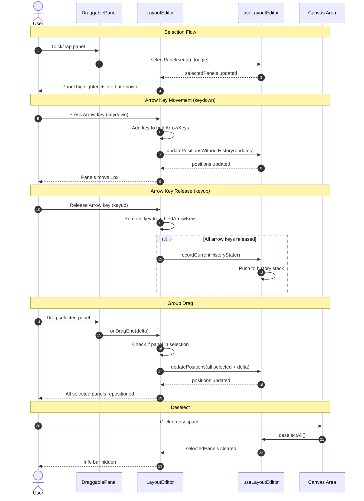

# Panel Selection & Precision Movement

Interactive panel selection with toggle-on-click, arrow key pixel movement, group drag, and a contextual info bar in the Layout Editor.

## Motivation

The current Layout Editor supports drag-and-drop positioning but lacks precision alignment tools. Users need to:
1. Fine-tune panel positions pixel-by-pixel after coarse drag placement
2. Move groups of panels together while maintaining their relative positions
3. Understand available actions through contextual UI guidance

This feature completes FR-3.4 (Keyboard Positioning) and enhances FR-3.5 (Multi-Select) from the Phase 2 spec.

## Scope

### In Scope (v1)
- Toggle-on-click panel selection
- Arrow key precision movement (1px/keypress)
- Group drag with relative position preservation
- Contextual info bar
- Basic accessibility (ARIA attributes, keyboard navigation)

### Deferred to Future Spec
- **Click-to-position mode ([WCAG 2.5.7](https://www.w3.org/WAI/WCAG22/Understanding/dragging-movements.html)):** A single-pointer alternative to drag positioning where users select a panel, then click a destination to move it. This would provide full WCAG 2.5.7 Level AA compliance. Arrow key movement partially addresses this accessibility need but requires panel selection first. Note: Full Level AA compliance for dragging operations is blocked until this feature is implemented.
- **Real-time group drag preview:** Showing all selected panels moving during drag (currently they jump on drop)
- **Haptic feedback preferences:** User setting to disable vibration
- **Shift + Arrow keys (10px movement):** Phase 2 FR-3.4 specifies Shift+Arrow for larger movement increments. Deferred to avoid keyboard modifier conflicts with browser shortcuts and to keep v1 implementation simple.
- **Tab/Shift+Tab panel cycling:** Phase 2 FR-3.4 specifies Tab/Shift+Tab for cycling selection between panels. This conflicts with FR-2.0's "Not trap focus" requirement (Tab must move focus out of the editor for accessibility). Deferred pending alternative key design (e.g., `]`/`[` or `J`/`K` for panel cycling).

## Functional Requirements

### FR-1: Panel Selection

**FR-1.1: Toggle-on-Click Selection**

Clicking or tapping a panel MUST toggle its selection state:
- Click/tap an unselected panel: adds it to the selection
- Click/tap a selected panel: removes it from the selection
- No modifier keys (Shift/Ctrl/Cmd) required for multi-select
- Modifier keys (Shift/Ctrl/Cmd + Click) also toggle (same behavior as regular click)
- Applies to both positioned panels on the canvas AND unpositioned panels in the sidebar

**FR-1.2: Deselect All**

Clicking/tapping empty canvas space (not on a panel) MUST deselect all panels.

**Implementation:**
```typescript
// Canvas container click handler (LayoutEditor.tsx)
const handleCanvasClick = (e: React.MouseEvent) => {
  // Only deselect if click target is the canvas itself, not a child element
  // Panel clicks have stopPropagation(), so this only fires on empty space
  if (e.target === e.currentTarget) {
    editor.deselectAll();
  }
};

// In JSX:
<div
  ref={canvasRef}
  tabIndex={0}
  onClick={handleCanvasClick}
  onKeyDown={handleKeyDown}
  // ... other props
>
  {/* Panel overlays */}
</div>
```

**FR-1.3: Visual Selection State**

Selected panels MUST display:
- 3px solid white border
- Blue glow box-shadow (`0 0 0 2px #4a90d9`)
- Elevated z-index (10) above unselected panels

**FR-1.4: Select All (Ctrl+A/Cmd+A)**

Pressing Ctrl+A (Windows/Linux) or Cmd+A (macOS) MUST select all positioned panels on the canvas. Unpositioned sidebar panels are NOT included in select-all. If focus is in a text input field (not the canvas), normal browser select-all behavior applies.

**Implementation:**
```typescript
// In the canvas keydown handler (LayoutEditor.tsx)
if (e.key === 'a' && (e.ctrlKey || e.metaKey)) {
  // Check if focus is in a text input - let browser handle it
  const activeElement = document.activeElement;
  const isTextInput = activeElement instanceof HTMLInputElement ||
                      activeElement instanceof HTMLTextAreaElement ||
                      activeElement?.getAttribute('contenteditable') === 'true';

  if (isTextInput) {
    return; // Let browser handle Ctrl+A in text inputs
  }

  e.preventDefault();
  editor.selectAll();
}
```

Note: This check is technically redundant if the handler is attached to the canvas element (text inputs would have their own focus), but it's included as a safety guard for edge cases like contenteditable elements within the canvas.

**FR-1.5: Click vs Drag Discrimination**

The click handler MUST NOT fire when a drag operation occurs:
- Mouse: if movement >= 5px (MouseSensor activation constraint), the interaction is a drag, not a click
- Touch: if hold >= 250ms, the interaction is a drag, not a click

**Implementation:** Pass `activeDragId` from LayoutEditor to DraggablePanel as an `isBeingDragged` prop:
- LayoutEditor already tracks `activeDragId` state via DndContext's `onDragStart`/`onDragEnd` callbacks
- Pass `isBeingDragged={activeDragId === panel.serial}` to each DraggablePanel
- In DraggablePanel's click handler, check `if (isBeingDragged) return;`

**Rationale:** This leverages the existing `activeDragId` state in LayoutEditor rather than adding redundant tracking. The parent component receives drag events directly from DndContext callbacks, which fire synchronously when the sensor activates. This avoids the race condition where useDraggable's `isDragging` state may not update before the click handler runs.

**FR-1.6: Touch Selection**

On touch devices:
- Quick tap (< 250ms AND < 8px movement) toggles selection
- Hold (>= 250ms) OR movement (>= 8px) initiates drag (does not toggle selection)
- At exactly 250ms with < 8px movement, the interaction becomes a drag (>= means 250ms is the threshold)
- This leverages the existing @dnd-kit TouchSensor activation constraint

**FR-1.6.1: Haptic Feedback on Drag Start**

When a touch-hold activates drag mode, provide haptic feedback:
```typescript
// In handleDragStart (LayoutEditor.tsx)
if (window.navigator.vibrate) {
  window.navigator.vibrate(50);  // 50ms vibration pulse
}
```

This provides tactile confirmation that drag mode has started, helping users distinguish between tap-to-select and hold-to-drag interactions.

**Security Note:** Use defensive checks for SSR safety and error handling:
```typescript
if (typeof navigator !== 'undefined' && navigator.vibrate) {
  try {
    navigator.vibrate(50);
  } catch (e) {
    // Some browsers throw in certain contexts (e.g., iframe restrictions)
    console.debug('Haptic feedback unavailable', e);
  }
}
```

**FR-1.7: Escape Key Behavior**

Pressing Escape MUST follow a two-tier behavior:
- If any panels are selected: deselect all (do NOT exit edit mode)
- If no panels are selected: exit edit mode (existing behavior preserved)

**Implementation:** Update the existing Escape handler in LayoutEditor.tsx:

```typescript
// In the keydown handler, replace the existing Escape case:
// editor is the return value of useLayoutEditor() hook
if (e.key === 'Escape') {
  e.preventDefault();
  if (editor.selectedPanels.size > 0) {
    // First tier: deselect all, stay in edit mode
    editor.deselectAll();
  } else {
    // Second tier: exit edit mode (existing behavior)
    editor.exitEditMode();
  }
}
```

**FR-1.8: Initial Selection State**

When entering edit mode, no panels are selected. Selection state is NOT persisted across:
- Page refreshes
- Navigation away from the Layout Editor
- Switching between configurations

Each edit session starts with a fresh, empty selection.

### FR-2: Arrow Key Movement

**FR-2.0: Editor Focus Requirement**

Arrow key movement requires keyboard focus on the editor canvas. The keyboard handler is attached to the canvas element's `onKeyDown` prop, making focus implicit when the handler fires. The canvas container MUST:
- Have `tabIndex={0}` to be focusable
- Display a visible focus indicator when focused (e.g., 2px blue outline) per WCAG 2.4.7
- Receive focus automatically when a panel is clicked
- Not trap focus (Tab should move to next focusable element outside the editor)

```typescript
// Canvas container focus handling
<div
  ref={canvasRef}
  tabIndex={0}
  onFocus={() => setCanvasFocused(true)}
  onBlur={() => setCanvasFocused(false)}
  style={{
    outline: canvasFocused ? '2px solid #4a90d9' : 'none',
    outlineOffset: '-2px',
  }}
>
  {/* Canvas content */}
</div>

// In LayoutEditor.tsx - this is passed as the onClick prop to DraggablePanel
// Auto-focus canvas when panel is clicked
const handlePanelClick = (serial: string) => {
  canvasRef.current?.focus();
  editor.selectPanel(serial);
};
// Usage in JSX: <DraggablePanel onClick={handlePanelClick} ... />
```

**Null handling:** The optional chaining (`?.`) silently handles cases where `canvasRef.current` is null (e.g., during initial render or if the ref is not yet attached). This is acceptable degradation - focus will simply not be set, and arrow keys will require the user to manually focus the canvas.

**FR-2.1: Pixel Nudge**

When one or more panels are selected, arrow keys MUST move them:
- ArrowUp: move 1px up (decrease y_percent)
- ArrowDown: move 1px down (increase y_percent)
- ArrowLeft: move 1px left (decrease x_percent)
- ArrowRight: move 1px right (increase x_percent)

**FR-2.2: Percentage Conversion**

Arrow key movement converts 1 pixel to percentage based on image dimensions:
- `dx_percent = (1 / image_width) * 100`
- `dy_percent = (1 / image_height) * 100`

**Image dimensions** are obtained from the LayoutEditor context:
```typescript
// Image dimensions from layout configuration
const { imageWidth, imageHeight } = useLayoutContext();

// Guard against unloaded image or invalid dimensions
// Using !(x > 0) catches null, undefined, zero, negative, and NaN values defensively
if (imageWidth == null || imageHeight == null || !(imageWidth > 0) || !(imageHeight > 0)) {
  console.warn('Cannot calculate movement: image dimensions unavailable');
  return; // Skip movement if image not loaded
}
```

These are the **natural dimensions** of the layout image (the original image size, not the rendered size). This ensures percentage calculations are consistent regardless of zoom level or viewport size.

**FR-2.3: Group Movement**

When multiple panels are selected, arrow keys move ALL selected panels by the same delta, preserving their relative positions.

**Note:** Arrow key movement only affects **positioned panels** (those on the canvas). Unpositioned panels in the sidebar remain in the selection but are not moved. This allows users to position sidebar panels via drag without unexpected behavior from arrow keys.

**FR-2.4: Group Boundary Clamping**

When moving multiple panels as a group (arrow keys or drag), boundary clamping MUST preserve relative positions:
- Compute the maximum allowable delta such that NO panel exceeds 0-100% on either axis
- Apply this (possibly reduced) delta uniformly to all selected panels
- This ensures the group moves as a unit and stops together when any panel reaches a boundary
- For single-panel movement, simple per-panel clamping (0-100%) is sufficient

**Algorithm:**
```typescript
function computeClampedDelta(
  selectedPanels: Panel[],
  requestedDelta: { dx: number; dy: number }
): { dx: number; dy: number } {
  let clampedDx = requestedDelta.dx;
  let clampedDy = requestedDelta.dy;

  for (const panel of selectedPanels) {
    // For positive delta, check upper bound (100%)
    if (requestedDelta.dx > 0) {
      clampedDx = Math.min(clampedDx, 100 - panel.x_percent);
    } else if (requestedDelta.dx < 0) {
      // For negative delta, check lower bound (0%)
      clampedDx = Math.max(clampedDx, -panel.x_percent);
    }

    if (requestedDelta.dy > 0) {
      clampedDy = Math.min(clampedDy, 100 - panel.y_percent);
    } else if (requestedDelta.dy < 0) {
      clampedDy = Math.max(clampedDy, -panel.y_percent);
    }
  }

  return { dx: clampedDx, dy: clampedDy };
}
```

**Acceptance Criteria for Relative Position Preservation:**
After group movement, the relative distance between any two selected panels MUST remain identical within 0.0001% tolerance (to account for floating-point representation). Relative positions are measured in **percentage space**, not pixel space.

**FR-2.5: Undo/Redo Integration**

Arrow key nudges MUST integrate with undo/redo:
- History state is recorded on `keyup` after a series of arrow key presses, not on every `keydown`
- This means holding an arrow key produces smooth movement, and releasing records a single undo step
- Implementation: track a `heldArrowKeys` ref (a `Set<string>`) that adds keys on keydown and removes on keyup; history is recorded only when the set becomes empty (all arrow keys released)
- This correctly handles simultaneous arrow keys (e.g., holding ArrowRight then pressing ArrowDown): history is recorded only when both are released
- This prevents overflow of the 50-state history buffer during continuous key holds

**FR-2.5.1: Focus Loss During Arrow Movement**

When the window or editor loses focus while arrow keys are held:
- The `blur` event handler MUST record history immediately (as if all keys were released)
- The `heldArrowKeys` set MUST be cleared
- This prevents lost undo states when users Alt+Tab away

**FR-2.6: Keyboard Shortcut Priority**

Keyboard shortcuts (Ctrl+Z, Delete) take precedence over arrow key movement. If Ctrl+Z is pressed while an arrow key is held:
1. The in-progress arrow movement is immediately committed to history
2. The undo operation is then executed
3. The `heldArrowKeys` set is cleared

This ensures predictable behavior when mixing shortcuts with arrow key holds.

**Implementation:**
```typescript
// In the canvas keydown handler (LayoutEditor.tsx)
// heldArrowKeys ref is accessible in this scope

if (e.key === 'z' && (e.ctrlKey || e.metaKey) && !e.shiftKey) {
  e.preventDefault();

  // Flush any in-progress arrow key movement before undoing
  if (heldArrowKeys.current.size > 0) {
    heldArrowKeys.current.clear();
    editor.recordCurrentHistoryState();
  }

  editor.undo();
  return;
}

// Redo (Ctrl+Shift+Z or Ctrl+Y)
if ((e.key === 'z' && (e.ctrlKey || e.metaKey) && e.shiftKey) ||
    (e.key === 'y' && (e.ctrlKey || e.metaKey))) {
  e.preventDefault();

  // Flush any in-progress arrow key movement before redoing
  if (heldArrowKeys.current.size > 0) {
    heldArrowKeys.current.clear();
    editor.recordCurrentHistoryState();
  }

  editor.redo();
  return;
}
```

This ensures the current arrow key movement is committed to history before the undo/redo operation, preventing the user from undoing into an inconsistent state.

### FR-3: Group Drag

**FR-3.1: Selected Panel Drag**

When dragging a panel that IS in the current selection:
- All selected panels move together
- Relative positions between selected panels are preserved
- The drag delta (in percentage) is applied uniformly to all selected panels
- Snap-to-align operates on the dragged panel (leader) only; any snap offset is included in the delta applied to the entire group
- Snap considers ONLY the leader panel's position, not other selected panels

**Implementation Note:** Use `active.rect.current.translated` (not `activeRect.left`) when computing snap offset to avoid visual misalignment between snap guides and actual panel positions. This addresses a known coordinate calculation issue where the modifier may calculate position differently than the callback.

**FR-3.2: Unselected Panel Drag**

When dragging a panel that is NOT in the current selection:
- All existing selections are cleared in the `onDragStart` callback (after sensor activation threshold is met)
- Only the dragged panel moves
- After drop, no panels are selected (the dragged panel does NOT become selected)
- Standard single-panel drag behavior applies

**Timing clarification:** Selection is cleared in `onDragStart`, not on mousedown/touchstart. This means:
- If the user clicks and releases without exceeding the 5px/250ms threshold, selection is NOT cleared
- The clearing happens only after @dnd-kit confirms a drag operation has started

```typescript
// In onDragStart callback
const draggedPanel = panels.find(p => p.serial === active.id);
if (draggedPanel && !selectedPanels.has(draggedPanel.serial)) {
  deselectAll();
}
```

**Rationale for no post-drop selection:** This allows users to quickly reposition multiple individual panels in sequence without accumulating selections. If the dragged panel became selected, users would need to click empty space between each drag to clear selection. The current behavior optimizes for rapid sequential repositioning. Users who want to continue manipulating the same panel can click it after dropping to select it.

**FR-3.3: Group Drag Visual Feedback**

During group drag:
- The directly-dragged panel shows the standard drag overlay
- Other selected panels remain in their original positions until drag ends (they jump to new positions on drop)
- This is a deliberate v1 simplification that avoids per-frame position recalculation for all selected panels

**Known UX Limitation:** The "jump on drop" behavior may be visually jarring. This is documented as a v1 compromise for performance. Future enhancements MAY include:
- Ghost outlines showing where other selected panels will land during drag
- Brief CSS transition (100-200ms) when panels snap to new positions on drop
- Info bar hint: "Other selected panels will move on drop" during group drag

For v1, the jump behavior is acceptable as the alternative (real-time multi-panel drag preview) adds significant complexity.

### FR-4: Contextual Info Bar

**FR-4.1: Appearance**

When one or more panels are selected, display an info bar:
- Position: between the editor toolbar and the canvas area (pushes canvas down, not overlay)
- Background: `#1e3a5f` (dark blue, distinct from toolbar's `#1a1a1a`)
- Text: `#e0e0e0` (light gray), font size 13px
- Height: ~36px, horizontally padded 16px
- Icon: info circle icon (from lucide-react `Info`) on the left, color `#ffffff`
- Contrast ratio: text #e0e0e0 on #1e3a5f = ~5.5:1 (passes WCAG AA for normal text)

**Layout behavior:** The info bar is inserted in the DOM flow, pushing the canvas down. To minimize visual disruption, the info bar SHOULD use a CSS transition (150ms height or opacity) when appearing/disappearing. This causes panels to shift relative to the viewport, which is acceptable as the shift is predictable and brief.

**FR-4.2: Content**

The info bar MUST display:
- Panel count: "1 panel selected" or "N panels selected" (conditional pluralization)
- Available actions: "Arrow keys to nudge | Drag to reposition | Click panel to deselect | Click empty space to deselect all"

On mobile (viewport < 768px), use shorter text:
- "N selected | Hold to drag | Tap to deselect | Tap empty to clear"

**FR-4.3: Dismissal**

The info bar disappears when:
- All panels are deselected
- No explicit close button needed (it's purely state-driven)

### FR-5: Mobile/Touch Considerations

**FR-5.1: Touch Target Size**

Panel overlays MUST have a minimum touch target of 44x44px regardless of the configured overlay size. If `overlaySize < 44`, the hit area extends beyond the visual boundary while preserving visual positioning.

**Implementation (wrapper div approach):** Use an invisible wrapper div that extends beyond the visual panel:

```typescript
// In DraggablePanel.tsx
const touchTargetSize = Math.max(44, overlaySize);
const offset = (touchTargetSize - overlaySize) / 2;

// Outer wrapper handles drag/click events with extended hit area
<div
  ref={setNodeRef}
  {...attributes}
  {...listeners}
  style={{
    position: 'absolute',
    width: touchTargetSize,
    height: touchTargetSize,
    left: `calc(${position.x_percent}% - ${touchTargetSize / 2}px)`,
    top: `calc(${position.y_percent}% - ${touchTargetSize / 2}px)`,
    cursor: isEditMode ? 'grab' : 'default',
  }}
  onClick={handleClick}
>
  {/* Inner div is the visible panel, centered within touch target */}
  <div
    style={{
      position: 'absolute',
      width: overlaySize,
      height: overlaySize,
      top: offset,
      left: offset,
      // Visual styling: background, border, shadow
    }}
  >
    {/* Panel content */}
  </div>
</div>
```

**Alternative (simpler):** Require `overlaySize >= 44` as a configuration constraint. This avoids the complexity of the wrapper div approach.

**Decision: Use the wrapper div approach** for v1 implementation. This preserves flexibility for users who want smaller visual overlays while maintaining accessibility. The minimum visual size with the wrapper approach is 10px (any smaller becomes impractical to see). If `overlaySize < 10`, clamp to 10px for the visual element.

**Rationale:** Using `minWidth/minHeight` on a single div would shift the panel's visual center away from its coordinate position. The wrapper div approach preserves visual alignment by centering the visible panel within the larger touch target.

**FR-5.2: Info Bar Responsiveness**

The info bar MUST be readable on mobile:
- Text wraps if needed (no horizontal overflow)
- Shorter action text on viewports < 768px
- Touch-friendly height (minimum 44px on mobile)

**FR-5.3: No Arrow Key Dependency on Mobile**

Arrow key movement is a desktop enhancement. Mobile users rely on drag-and-drop for positioning. The info bar on mobile omits "Arrow keys to nudge" text.

## Non-Functional Requirements

**NFR-1: Arrow Key Responsiveness**

- Arrow key movement SHOULD render within a single animation frame (16ms at 60fps)
- The implementation MUST process all `keydown` events generated by browser key repeat without debouncing or throttling
- No single keydown handler execution SHALL exceed 50ms (verifiable via `performance.now()` in dev mode)
- The implementation should avoid expensive computations in the render path (percentage addition is O(n) on selected panels, which is acceptable)

**Testing Note:** The exact number of updates during key hold depends on OS-level key repeat rate (not controllable in tests). Tests should mock keyboard events at known intervals rather than relying on real key repeat timing.

**NFR-2: Group Drag Performance**

- Group drag with up to 50 selected panels MUST maintain 60fps
- Position calculations use simple addition (no spatial index needed for group moves)

**NFR-3: Accessibility**

- Info bar MUST use `role="status"` and `aria-live="polite"` for screen reader announcements
- Selected panel count changes announced to screen readers
- Arrow key movement prevents browser scroll via `e.preventDefault()` only when panels are selected
- Trade-off: users must deselect (Escape or click empty space) to restore arrow key scrolling of the canvas
- Arrow key handlers coexist with existing keyboard shortcuts (Ctrl+Z, Delete, etc.) without conflict since key codes are distinct
- ArrowLeft/ArrowRight are captured with `e.preventDefault()` in edit mode when panels are selected, preventing browser back/forward navigation in some browser configurations

## Error Handling

### Image Dimension Errors
If `imageWidth` or `imageHeight` is 0, undefined, or NaN:
- Arrow key movement is silently skipped (no error toast)
- Console warning logged for debugging
- User can still drag panels (drag doesn't depend on these values for percentage calculation)

### Position Save Failures
Position changes are auto-saved via the existing debounced save mechanism. If a save fails:
- Existing behavior applies (error toast shown, user can retry manually)
- Selection state is NOT affected by save failures
- User can continue editing; changes remain in local state

### Conflict Resolution
If two users edit the same layout simultaneously:
- This spec does not add new conflict resolution (uses existing Phase 2 behavior)
- Last write wins at the panel level
- Future enhancement: optimistic locking or real-time collaboration

### Out-of-Scope Error Scenarios
The following error scenarios are handled by existing Phase 2 behavior and are not modified by this spec:
- **Network disconnection during drag**: Local position state is retained in React state and auto-saved to localStorage via the existing draft mechanism. Explicit save to server follows standard HTTP error handling (user sees error toast, can retry manually)
- **Stale panel data**: If another user deletes a selected panel, selection references become stale (deferred to future real-time collaboration spec)
- **Version mismatch**: Panel list changes by other users are handled by Phase 2's refresh mechanism

## Data Model

### Position Types

```typescript
/**
 * Represents a panel's position as percentages relative to the layout image.
 * Used as the value type in LayoutEditorState.positions during editing.
 */
interface PanelPosition {
  x_percent: number;
  y_percent: number;
}
```

### Panel Identifiers

**Position Data Relationship:**
- `Panel` is the **persisted/API model**. Its `x_percent`/`y_percent` fields are nullable because unpositioned panels (in the sidebar) have no coordinates.
- `LayoutEditorState.positions` is the **runtime editing state**. During editing, this is the authoritative source for panel positions. It uses `Record<string, PanelPosition | null>` where `null` indicates an unpositioned panel.
- **On save:** Positions from `LayoutEditorState.positions` are written back to `Panel` objects and persisted to the backend.
- **On load:** `Panel` coordinates from the API are used to initialize `LayoutEditorState.positions`.

```typescript
interface Panel {
  serial: string;        // Unique identifier (e.g., "12345678"), used as @dnd-kit draggable id
  x_percent: number | null;  // null for unpositioned (sidebar) panels
  y_percent: number | null;
  // ... other fields
}

// Selection state
type SelectedPanels = Set<string>;  // Set of panel serial numbers

// @dnd-kit active.id equals panel.serial (configured via draggable id prop)
```

### Editor State Interface

```typescript
interface LayoutEditorState {
  selectedPanels: Set<string>;       // Currently selected panel serials
  positions: Record<string, PanelPosition | null>;  // Panel positions by serial
  deselectAll(): void;
  selectPanel(serial: string): void; // Toggle selection
  selectAll(): void;                 // Select all positioned panels
  exitEditMode(): void;
  updatePositions(updates: Record<string, PanelPosition>): void;
  // Convenience wrapper: updatePosition(serial, pos) is equivalent to updatePositions({ [serial]: pos })
  updatePosition(serial: string, position: PanelPosition): void;
  updatePositionsWithoutHistory(updates: Record<string, PanelPosition | null>): void;
  recordCurrentHistoryState(): void;
  getPositionedSelection(): string[];  // Returns serials of positioned panels in selection
  undo(): void;                      // Undo last position change
  redo(): void;                      // Redo last undone change
}

// The editor state is provided by the useLayoutEditor hook
const editor = useLayoutEditor();
```

### Z-Index Hierarchy

```typescript
const Z_INDEX = {
  CANVAS_BACKGROUND: 0,
  UNSELECTED_PANEL: 1,
  SELECTED_PANEL: 10,
  DRAG_OVERLAY: 100,   // @dnd-kit DragOverlay
  // INFO_BAR: N/A - In document flow (position: static), z-index does not apply
} as const;
```

When two selected panels overlap, they share the same z-index (10). The stacking order among selected panels is determined by DOM order (source order in the panels array). Selection order does NOT affect stacking.

## High Level Design



### Component Changes

```
LayoutEditor.tsx
├── EditorToolbar (unchanged)
├── InfoBar (NEW - shown when selectedPanels.size > 0)
│   └── "N panel(s) selected · Arrow keys to nudge · ..."
├── Canvas
│   ├── DraggablePanel[] (click handler changed to always toggle)
│   └── AlignmentGuides
└── UnpositionedPanelsSidebar
```

### DraggablePanel Click Handler (DraggablePanel.tsx)

```typescript
// Complete prop types for DraggablePanel
interface DraggablePanelProps {
  panel: Panel;
  position: PanelPosition;  // Position from parent's positions[panel.serial]
  overlaySize: number;
  isEditMode: boolean;
  isSelected: boolean;
  isBeingDragged: boolean;  // true when activeDragId === panel.serial
  onClick?: (serial: string) => void;
}

// Updated click handler - checks isBeingDragged prop (set by parent from activeDragId)
const handleClick = (e: React.MouseEvent) => {
  if (!isEditMode || isBeingDragged) return;
  e.stopPropagation();  // Prevent canvas deselect-all from firing
  onClick?.(panel.serial);  // Delegates to handlePanelClick which calls editor.selectPanel (toggles internally)
};

// Error handling for invalid position data
const position = positions[panel.serial];
if (!position ||
    typeof position.x_percent !== 'number' || isNaN(position.x_percent) ||
    typeof position.y_percent !== 'number' || isNaN(position.y_percent)) {
  console.warn(`Invalid position for panel ${panel.serial}`);
  // Return null to skip rendering. Note: The parent should filter the panels array
  // before mapping to avoid React key warnings from sparse arrays. Alternatively,
  // render an invisible placeholder to maintain array structure.
  return null;
}
```

In LayoutEditor.tsx, pass the prop:
```typescript
<DraggablePanel
  // ... other props
  isBeingDragged={activeDragId === panel.serial}
  onClick={handlePanelClick}  // Uses handlePanelClick from FR-2.0 (focuses canvas + selects)
/>
```

**BREAKING CHANGE:** The existing `selectPanel(serial, addToSelection)` behavior where `addToSelection=false` replaced the entire selection is removed. All clicks now toggle the clicked panel's selection state.

**Known callers of selectPanel:**
- `DraggablePanel.tsx` - onClick handler for positioned panels
- `UnpositionedPanel.tsx` - onClick handler for sidebar panels
- `LayoutEditor.tsx` - handlePanelClick wrapper (adds canvas focus)

**Migration steps:**
1. Remove the `addToSelection` parameter from all `selectPanel` calls
2. Update prop type signatures in DraggablePanel, UnpositionedPanel, and UnpositionedPanelsSidebar
3. If single-select-replace behavior is needed, add a new `replaceSelection(serial: string)` function

**Workaround for single-select-replace (if needed immediately):**
```typescript
// Call deselectAll before selectPanel
editor.deselectAll();
editor.selectPanel(serial);
```

The same change applies to `UnpositionedPanel` and `UnpositionedPanelsSidebar`:

```typescript
// UnpositionedPanelsSidebar prop type update
interface UnpositionedPanelsSidebarProps {
  // ... other props unchanged
  onPanelClick: (serial: string) => void;  // Was: (serial: string, addToSelection: boolean) => void
  activeDragId: string | null;  // NEW: for click vs drag discrimination
}

// UnpositionedPanel prop type update
interface UnpositionedPanelProps {
  // ... other props unchanged
  onClick: (serial: string) => void;
  isBeingDragged: boolean;  // NEW: passed from sidebar, true when activeDragId === panel.serial
}

// UnpositionedPanel click handler (same pattern as DraggablePanel)
const handleClick = () => {
  if (isBeingDragged) return;  // Same race condition guard as DraggablePanel
  onClick(panel.serial);
};

// In UnpositionedPanelsSidebar, pass the prop:
<UnpositionedPanel
  // ... other props
  isBeingDragged={activeDragId === panel.serial}
  onClick={onPanelClick}
/>
```

### Selection Logic (useLayoutEditor.ts)

```typescript
// Always toggle - no addToSelection parameter needed
const selectPanel = useCallback((serial: string) => {
  setSelectedPanels(prev => {
    const next = new Set(prev);
    if (next.has(serial)) {
      next.delete(serial);
    } else {
      next.add(serial);
    }
    return next;
  });
}, []);

// Helper to get only positioned panels from selection (unpositioned panels ignored)
// Use this in arrow key handler, group drag, and selectAll to avoid code duplication
const getPositionedSelection = useCallback(() => {
  return [...selectedPanels].filter(s => positions[s] != null);
}, [selectedPanels, positions]);

// Select all positioned panels only (unpositioned panels can't be nudged/dragged)
// `panels` is the full panel list from useLayoutContext() - includes both positioned and unpositioned
const selectAll = useCallback(() => {
  const positioned = panels.filter(p => positions[p.serial] != null);
  setSelectedPanels(new Set(positioned.map(p => p.serial)));
}, [panels, positions]);
```

Add `getPositionedSelection` to the hook's return object alongside `updatePositionsWithoutHistory` and `recordCurrentHistoryState`.

### Arrow Key Handler (LayoutEditor.tsx)

The following code blocks show the complete keyboard handling implementation. Add them in this order:

**1. Ref declaration (at component level, before useEffect hooks):**

```typescript
// Ref to track held arrow keys for undo coalescing (persists across renders)
const heldArrowKeys = useRef<Set<string>>(new Set());
```

**2. Arrow key handling (inside existing handleKeyDown effect):**

```typescript
// This handler is attached to the canvas element's onKeyDown, not window.
// Focus is implicit - if this handler fires, the canvas has focus.
if (['ArrowUp', 'ArrowDown', 'ArrowLeft', 'ArrowRight'].includes(e.key)) {
  // Canvas has focus (implicit from handler attachment), check for selected panels
  if (editor.selectedPanels.size > 0) {
    // Filter to only positioned panels (unpositioned panels have no coordinates to nudge)
    const positionedSelection = editor.getPositionedSelection();
    if (positionedSelection.length === 0) return;

    heldArrowKeys.current.add(e.key);  // Track for keyup coalescing
    e.preventDefault();
    const dx = e.key === 'ArrowLeft' ? -1 : e.key === 'ArrowRight' ? 1 : 0;
    const dy = e.key === 'ArrowUp' ? -1 : e.key === 'ArrowDown' ? 1 : 0;
    let dxPercent = (dx / imageWidth) * 100;
    let dyPercent = (dy / imageHeight) * 100;

    // Group-aware clamping: reduce delta if any panel would exceed bounds
    for (const serial of positionedSelection) {
      const pos = editor.positions[serial]!;  // Safe: filtered above
      const newX = pos.x_percent + dxPercent;
      const newY = pos.y_percent + dyPercent;
      if (newX < 0) dxPercent = Math.max(dxPercent, -pos.x_percent);
      if (newX > 100) dxPercent = Math.min(dxPercent, 100 - pos.x_percent);
      if (newY < 0) dyPercent = Math.max(dyPercent, -pos.y_percent);
      if (newY > 100) dyPercent = Math.min(dyPercent, 100 - pos.y_percent);
    }

    const updates: Record<string, PanelPosition> = {};
    for (const serial of positionedSelection) {
      const pos = editor.positions[serial]!;  // Safe: filtered above
      updates[serial] = {
        x_percent: pos.x_percent + dxPercent,
        y_percent: pos.y_percent + dyPercent,
      };
    }
    editor.updatePositionsWithoutHistory(updates);
  }
}
```

**3. Keyup and blur handlers (separate useEffect in LayoutEditor.tsx):**

```typescript
/**
 * Keyup is attached to window (not canvas) intentionally:
 * - Catches key releases that occur after focus loss (Alt+Tab while holding arrow)
 * - Safe because heldArrowKeys.delete() is a no-op for keys never added
 * - Keydown is canvas-scoped (onKeyDown prop), keyup is window-scoped
 */
useEffect(() => {
  const flushArrowKeyHistory = () => {
    if (heldArrowKeys.current.size > 0) {
      heldArrowKeys.current.clear();
      editor.recordCurrentHistoryState();
    }
  };

  const handleKeyUp = (e: KeyboardEvent) => {
    if (['ArrowUp', 'ArrowDown', 'ArrowLeft', 'ArrowRight'].includes(e.key)) {
      // Safe even if keydown was ignored (no focus): Set.delete returns false for missing keys
      // We use window-level keyup to catch key releases that happen after focus loss
      // (e.g., user holds arrow, tabs away, releases key in another window)
      heldArrowKeys.current.delete(e.key);
      // Record history only when ALL arrow keys are released
      if (heldArrowKeys.current.size === 0) {
        editor.recordCurrentHistoryState();
      }
    }
  };

  // Flush pending history if user tabs away while holding arrow keys
  const handleBlur = () => {
    flushArrowKeyHistory();
  };

  window.addEventListener('keyup', handleKeyUp);
  window.addEventListener('blur', handleBlur);
  return () => {
    window.removeEventListener('keyup', handleKeyUp);
    window.removeEventListener('blur', handleBlur);
    // Flush on unmount (e.g., edit mode exit while holding keys)
    flushArrowKeyHistory();
  };
}, [editor.recordCurrentHistoryState]);
```

**Undo integration:** Arrow key nudges use `updatePositionsWithoutHistory` (a variant of `updatePositions` that skips the `recordHistoryState` call) during keydown. The keyup listener tracks when all arrow keys are released; on final keyup, it calls `recordHistoryState(positions)` once. The blur handler and cleanup function ensure history is recorded even if the user tabs away or exits edit mode while holding keys. This coalesces continuous key-hold nudges into a single undo step.

```typescript
// In useLayoutEditor.ts - add alongside existing updatePositions

// Ref to track latest positions (avoids stale closure in keyup handler)
const positionsRef = useRef(positions);
useEffect(() => { positionsRef.current = positions; }, [positions]);

const updatePositionsWithoutHistory = useCallback(
  (updates: Record<string, PanelPosition | null>) => {
    setPositions(prev => {
      const next = { ...prev, ...updates };
      // Ref update in updater is safe: useEffect also syncs positionsRef,
      // and keyup handler reads only after state flushes
      positionsRef.current = next;
      return next;
    });
    setHasUnsavedChanges(true);
  },
  []
);

// Expose for keyup handler in LayoutEditor.tsx
const recordCurrentHistoryState = useCallback(() => {
  recordHistoryState(positionsRef.current);
}, [recordHistoryState]);
```

The arrow key handler calls `updatePositionsWithoutHistory` on keydown. The keyup handler calls `editor.recordCurrentHistoryState()` when all arrow keys are released (reads from `positionsRef` internally, avoiding stale closure issues).

Add to the hook's return object:
```typescript
return {
  // ... existing returns
  updatePositionsWithoutHistory,
  recordCurrentHistoryState,
};
```

### Group Drag Logic (LayoutEditor.tsx handleDragEnd)

This block replaces the existing `editor.updatePosition(panel.serial, percentPos)` call at the end of `handleDragEnd`:

```typescript
// percentPos is already computed by the existing code via pixelToPercent(newPosition, ...)
const percentPos = pixelToPercent(newPosition, { width: imageWidth, height: imageHeight });

// Filter to only positioned panels (unpositioned sidebar panels have no coordinates)
const positionedSelection = editor.getPositionedSelection();

if (editor.selectedPanels.has(panel.serial) && positionedSelection.length > 1) {
  // Group drag: apply same delta to all selected positioned panels
  const oldPos = editor.positions[panel.serial];
  if (oldPos) {
    const deltaX = percentPos.x_percent - oldPos.x_percent;
    const deltaY = percentPos.y_percent - oldPos.y_percent;

    // Compute max allowable delta so no panel exceeds bounds
    let clampedDeltaX = deltaX;
    let clampedDeltaY = deltaY;
    for (const serial of positionedSelection) {
      const pos = editor.positions[serial]!;  // Safe: filtered above
      const newX = pos.x_percent + deltaX;
      const newY = pos.y_percent + deltaY;
      if (newX < 0) clampedDeltaX = Math.max(clampedDeltaX, -pos.x_percent);
      if (newX > 100) clampedDeltaX = Math.min(clampedDeltaX, 100 - pos.x_percent);
      if (newY < 0) clampedDeltaY = Math.max(clampedDeltaY, -pos.y_percent);
      if (newY > 100) clampedDeltaY = Math.min(clampedDeltaY, 100 - pos.y_percent);
    }

    const updates: Record<string, PanelPosition> = {};
    for (const serial of positionedSelection) {
      const pos = editor.positions[serial]!;  // Safe: filtered above
      updates[serial] = {
        x_percent: pos.x_percent + clampedDeltaX,
        y_percent: pos.y_percent + clampedDeltaY,
      };
    }
    editor.updatePositions(updates);
    return; // Skip single-panel update
  } else {
    // Defensive: panel in selection but has no position entry (should not happen for canvas-dragged panels)
    console.warn(`Group drag: panel ${panel.serial} has no position, falling back to single update`);
    // Falls through to single-panel update below
  }
} else if (!editor.selectedPanels.has(panel.serial)) {
  // Dragging unselected panel: clear selection
  editor.deselectAll();
}

// Single panel update (existing behavior)
editor.updatePosition(panel.serial, percentPos);
```

### Info Bar Component (inline in LayoutEditor.tsx)

```typescript
// isMobile is computed on each render. SSR-safe check.
// Known limitation: users who resize their browser won't see the mobile text switch until
// a re-render is triggered (e.g., selection change). Acceptable for v1 as resize during
// active editing is an edge case.
const isMobile = typeof window !== 'undefined' && window.innerWidth < 768;

{editor.selectedPanels.size > 0 && (
  <div style={{
    display: 'flex',
    alignItems: 'center',
    gap: '8px',
    padding: '8px 16px',
    backgroundColor: '#1e3a5f',
    color: '#e0e0e0',
    fontSize: '13px',
    borderBottom: '1px solid #2a4a6f',
    minHeight: isMobile ? '44px' : '36px',
  }}
  role="status"
  aria-live="polite"
  >
    <Info size={16} />
    <span>
      {editor.selectedPanels.size} panel{editor.selectedPanels.size > 1 ? 's' : ''} selected
      {isMobile
        ? ' · Hold to drag · Tap to deselect · Tap empty to clear'
        : ' · Arrow keys to nudge · Drag to reposition · Click panel to deselect · Click empty space to deselect all'
      }
    </span>
  </div>
)}
```

## Task Breakdown

1. **Update selectPanel to always toggle**
   - Remove `addToSelection` parameter from `selectPanel` in useLayoutEditor.ts
   - Update `DraggablePanel.tsx` click handler (both DraggablePanel and UnpositionedPanel) to not pass `addToSelection`
   - Update `onClick` prop type signature in both panel components
   - Update UnpositionedPanelsSidebar's `onPanelClick` prop type

2. **Add arrow key handler and keyboard changes**
   - Add `updatePositionsWithoutHistory` and `recordCurrentHistoryState` to useLayoutEditor.ts (expose in return object)
   - Add `positionsRef` to track latest positions for stale-closure-safe history recording
   - Update `selectAll` to only select positioned panels
   - Change Escape handler: if panels selected → deselect all; else → exit edit mode (FR-1.7)
   - Add ArrowUp/Down/Left/Right handling to existing `handleKeyDown` in LayoutEditor.tsx
   - Convert 1px to percentage using `imageWidth`/`imageHeight`
   - Call `editor.updatePositionsWithoutHistory()` for group movement during keydown
   - Add `keyup` listener with `heldArrowKeys` Set to record history when all arrow keys released
   - Verify boundary clamping (0-100%)

3. **Implement group drag**
   - In `handleDragEnd`, detect if dragged panel is in selection
   - If yes and selection > 1: compute delta, apply to all selected panels
   - If no: call `editor.deselectAll()` before moving single panel
   - Verify relative positions maintained

4. **Add info bar**
   - Add inline info bar div between EditorToolbar and canvas area
   - Conditional render when `editor.selectedPanels.size > 0`
   - Mobile-responsive text (shorter on < 768px viewport)
   - Import `Info` icon from lucide-react
   - Add `role="status"` and `aria-live="polite"`

5. **Touch target and selection support**
   - Implement wrapper div approach in DraggablePanel for touch target extension (see FR-5.1)
   - Outer div sized to `max(44, overlaySize)`, inner visible div centered within
   - Alternative: if all deployments use overlaySize >= 44, document as configuration constraint instead
   - Verify @dnd-kit's existing TouchSensor delay (250ms) allows quick taps to fire click events
   - Test on touch device or emulator

6. **Build and verify**
   - `docker compose up --build -d`
   - Test via Playwright MCP at http://localhost:5174

## Test Scenarios

### E2E Tests (via Playwright MCP)

1. **Click to select**: Click panel A1 → verify selection styles appear (3px white border, blue glow shadow per FR-1.3)
2. **Click to deselect**: Click selected panel A1 → verify highlight removed
3. **Multi-select**: Click A1, then click A2 → verify both highlighted, info bar shows "2 panels selected"
4. **Deselect all**: Click empty canvas → verify all deselected, info bar hidden
5. **Arrow key nudge**: Select A1, press ArrowRight → verify panel moves 1px right
6. **Group arrow nudge**: Select A1 + A2, press ArrowDown → verify both move, relative positions preserved
7. **Group drag**: Select A1 + A2 + A3, drag A1 → verify all three reposition with same delta
8. **Unselected drag**: Select A1, drag unselected A2 → verify A1 deselected, only A2 moves, after drop no panels are selected and info bar is hidden
9. **Boundary clamping**: Move panel to edge, press arrow toward boundary → verify it stops at edge

### Touch-Specific Tests

10. **Quick tap selects**: On touch emulator, tap panel quickly (< 250ms) → verify selection toggles
11. **Hold initiates drag**: Touch-hold panel for > 250ms and move → verify drag occurs, selection NOT toggled
    - **Unit test (separate):** Mock `navigator.vibrate` and verify it's called with `50` on drag start:
      ```typescript
      const vibrateSpy = vi.spyOn(navigator, 'vibrate').mockReturnValue(true);
      // ... trigger touch hold drag start ...
      expect(vibrateSpy).toHaveBeenCalledWith(50);
      ```
12. **Drag vs tap discrimination**: Tap-and-release in < 250ms with < 8px movement → verify selection toggles (not drag)

### Keyboard Shortcut Tests

13. **Select all (Ctrl+A)**: Press Ctrl+A → verify all **positioned** panels are selected (sidebar panels excluded), info bar shows correct count
14. **Escape deselects**: Select panels, press Escape → verify all deselected, info bar hidden
15. **Delete unpositions**: Select panel A1, press Delete → verify panel moved to sidebar (unpositioned)

### Boundary & Group Tests

16. **Group boundary clamping**: Select two panels where one is near the right edge, press ArrowRight repeatedly → verify both stop when the rightmost panel reaches the boundary (left panel preserves relative offset)
17. **Sidebar panel selection**: Click unpositioned panel in sidebar → verify it toggles selection (same toggle behavior as canvas panels)

### Undo/Redo Tests

18. **Arrow key undo**: Select panel, press ArrowRight 5 times, release, Ctrl+Z → verify panel returns to position before the nudge series (single undo step)
19. **Group drag undo**: Group drag 3 panels, Ctrl+Z → verify all 3 return to original positions
20. **Multi-key nudge undo**: Hold ArrowRight, then also hold ArrowDown, release both → verify single undo step recorded (not two)

### Edge Case Tests

21. **Mixed selection with unpositioned panel**: Select a canvas panel and a sidebar panel, press ArrowRight → verify only the canvas panel moves (sidebar panel position unchanged), sidebar panel remains in selection set, info bar still shows "2 panels selected"
22. **Arrow key at boundary**: Move panel to x_percent=100%, press ArrowRight → verify no movement occurs (panel stays at boundary), no error thrown
23. **Snap offset in group drag**: Select 3 panels, drag leader so it snaps to align guide → verify all 3 panels shift by snap amount, relative positions preserved
24. **Focus loss while holding arrow**: Select panel, hold ArrowDown, trigger blur (Alt+Tab, click other window, or switch tabs) → verify Ctrl+Z after returning undoes the movement (blur handler records history). Note: All blur scenarios should behave identically.
25. **Small movement delta**: On a large image (e.g., 5000px wide), press ArrowRight → verify panel moves by 0.02% (1/5000 * 100), position change is visible after multiple presses

### Initial State Tests

26. **Initial selection state (FR-1.8)**: On page load/refresh or entering edit mode → verify `selectedPanels.size === 0` and info bar is not visible

### Canvas Focus Tests

27. **Canvas focus on panel click**: Click a panel → verify canvas element has focus (document.activeElement) and visible 2px blue outline appears
28. **No arrow movement without focus**: Click panel to select it, press Tab to move focus away from canvas, press ArrowRight → verify panel does NOT move (position unchanged)
29. **Focus indicator visibility**: Use Tab key to navigate to canvas → verify 2px blue outline visible per WCAG 2.4.7 (outline: 2px solid #4a90d9)
30. **No focus trap**: With canvas focused, press Tab → verify focus moves to next focusable element outside the editor (e.g., Save button in toolbar). Shift+Tab → verify focus moves to previous focusable element. Canvas does NOT trap keyboard focus.

## Context / Documentation

| File | Purpose |
|------|---------|
| `dashboard/frontend/src/components/layout-editor/DraggablePanel.tsx` | Panel click handler and visual states |
| `dashboard/frontend/src/components/layout-editor/LayoutEditor.tsx` | Keyboard handler, drag end logic, layout |
| `dashboard/frontend/src/components/layout-editor/useLayoutEditor.ts` | selectPanel, updatePositions, selection state |
| `dashboard/frontend/src/components/layout-editor/types.ts` | PanelPosition, snap types |
| `dashboard/frontend/src/components/layout-editor/LayoutContext.tsx` | useLayoutContext hook (provides imageWidth, imageHeight) - existing from Phase 2 |
| `docs/specs/2026-01-19-multi-user-config-phase2.md` | Parent spec (FR-3.4, FR-3.5) |

### Libraries Used

| Library | Purpose |
|---------|---------|
| `@dnd-kit/core` | Drag and drop (existing) |
| `lucide-react` | Icons - `Info` for info bar (existing dependency) |

---

**Specification Version:** 2.1
**Last Updated:** January 2026
**Authors:** Claude (AI Assistant)

## Changelog

### v2.1 (January 2026)
**Summary:** Final polish - addressed 3 optional improvement suggestions from ContextLoop review

**Changes:**
- Improved onClick comment clarity: Now explicitly states delegation to handlePanelClick
- Enhanced NaN safety: Changed dimension check from `<= 0` to `!(x > 0)` pattern to catch NaN values
- Added Test 26 for FR-1.8 initial selection state verification
- Renumbered Canvas Focus Tests to 27-30 (was 26-29)

### v2.0 (January 2026)
**Summary:** ContextLoop review round 2 - 7 comments addressed for interface and code completeness

**Interface Completeness:**
- Added `selectAll()`, `undo()`, `redo()` methods to `LayoutEditorState` interface
- Added `position: PanelPosition` to `DraggablePanelProps` interface (was mentioned in comment but not in interface)

**Code Sample Improvements:**
- Fixed onClick handler inconsistency: now uses `handlePanelClick` (from FR-2.0) instead of `editor.selectPanel`
- Added FR-1.2 implementation code for canvas click handler (deselect all)
- Simplified redundant dimension check (`!x || x === 0` → `x == null || x <= 0`)
- Added explicit else branch with logging in group drag for defensive handling
- Documented `panels` array source in selectAll implementation (comes from useLayoutContext)

### v1.9 (January 2026)
**Summary:** ContextLoop review - 12 comments addressed for consistency and completeness

**Interface/Implementation Fixes:**
- Fixed `updatePositionsWithoutHistory` signature to accept `| null` matching implementation
- Added `getPositionedSelection(): string[]` to `LayoutEditorState` interface

**Code Consistency:**
- Updated arrow key handler, group drag, and selection logic to use `editor.getPositionedSelection()` helper instead of inline filtering

**Clarifications:**
- Error Handling: Replaced "save retry logic from Phase 2" with accurate description of localStorage draft + manual retry behavior
- Test 21: Expanded to verify sidebar panel remains in selection and info bar shows correct count
- Added Test 29 for focus trap verification (FR-2.0 compliance)
- Added `useLayoutContext` hook to Context/Documentation table

**Scope Updates:**
- Added Shift+Arrow (10px movement) to Deferred section with rationale
- Added Tab/Shift+Tab panel cycling to Deferred section with conflict explanation

**Known Limitations:**
- Documented minor edge case: Ctrl+Z immediately after arrow keydown may create duplicate history state (functionally correct, low priority optimization)

### v1.8 (January 2026)
**Summary:** ContextLoop review - 18 comments addressed for completeness and consistency

**Additions:**
- Added `PanelPosition` type definition to Data Model section with relationship documentation
- Added `getPositionedSelection` helper function to reduce code duplication
- Added FR-2.6 implementation code for Ctrl+Z interrupt behavior during arrow hold
- Added FR-1.4 Ctrl+A implementation code with text input exception handling
- Added canvas focus tests (26-28) for FR-2.0 focus requirement
- Added Out-of-Scope Error Scenarios section (network disconnect, stale data, version mismatch)
- Added WCAG 2.5.7 specification link and AA compliance note to Scope section

**Clarifications:**
- FR-2.0: Documented that keyboard handler is attached to canvas element (focus implicit)
- Arrow key handler: Added comments explaining canvas-scoped focus handling
- Keyup handler: Documented window-level attachment rationale and safety
- Z-index hierarchy: Fixed INFO_BAR entry to note z-index doesn't apply to static positioning
- Test 24: Clarified blur test covers all blur scenarios (Alt+Tab, window click, tab switch)
- handlePanelClick: Added integration comment and documented null handling for canvasRef

**Code Improvements:**
- Added SSR guard to isMobile check (`typeof window !== 'undefined'`)
- Documented resize handling limitation for mobile text switch
- Added `updatePosition` (singular) to LayoutEditorState interface for consistency
- Updated position validation to check both x_percent and y_percent
- Added React key warning note for null return in mapped components
- Added migration path for selectPanel breaking change with known callers
- Updated sequence diagram to show keydown/keyup flow with history recording

### v1.7 (January 2026)
**Summary:** ContextLoop review - 26 comments addressed, major additions for production readiness

**Additions:**
- FR-1.4: Added Select All (Ctrl+A) requirement (was only a test assumption)
- FR-1.8: Added Initial Selection State requirement
- FR-2.0: Added Editor Focus Requirement with WCAG 2.4.7 visible focus indicator
- FR-2.5.1: Added Focus Loss During Arrow Movement requirement
- FR-2.6: Added Keyboard Shortcut Priority requirement
- New **Scope** section documenting what's in/out and WCAG 2.5.7 deferral
- New **Data Model** section with Panel interface, SelectedPanels type, and z-index hierarchy
- New **Error Handling** section for image dimensions, save failures, and conflicts

**Clarifications:**
- FR-1.6: Clarified 250ms boundary condition (>= means 250ms is a drag)
- FR-2.2: Added image dimension source (LayoutEditor context) and guard for zero dimensions
- FR-2.3: Documented that arrow keys only affect positioned panels (sidebar panels ignored)
- FR-2.4: Added explicit algorithm for group boundary clamping and acceptance criteria
- FR-3.1: Added snap coordinate implementation note to avoid known bug pattern
- FR-3.2: Clarified selection clear timing (onDragStart, not mousedown)
- FR-3.3: Documented UX limitation of jump-on-drop as v1 compromise
- FR-4.1: Clarified info bar layout behavior (push, not overlay)
- FR-5.1: Made decision to use wrapper div approach, added minimum visual size (10px)
- NFR-1: Removed untestable "10 updates per second" metric, added testing note
- NFR-3: Added note about capturing ArrowLeft/Right to prevent browser navigation

**Code Improvements:**
- Added complete DraggablePanelProps interface with all fields
- Added defensive navigator.vibrate check for SSR safety
- Added error handling for invalid position data
- Clarified `editor` is from useLayoutEditor() hook

**Test Updates:**
- Test 11: Split haptic feedback verification into unit test (mock-based)
- Test 13: Clarified Ctrl+A excludes sidebar panels

### v1.6 (January 2026)
**Summary:** Comprehensive review pass - 20 issues resolved across 4 iterations

**Changes:**
- FR-1.5: Changed to prop-based isDragging tracking to avoid React state race conditions
- FR-1.7: Added complete Escape key handler code sample
- FR-5.1: Replaced pseudo-element approach with wrapper div approach (React inline styles can't create pseudo-elements)
- FR-1.6.1: Added haptic feedback (navigator.vibrate) specification
- NFR-1: Added measurable performance criteria (10 updates/sec, 50ms max handler time)
- Consolidated all keyboard handling code into numbered, ordered sections
- Added blur event listener for keyup coalescing to handle tab-away and unmount
- Added 5 edge case test scenarios (21-25): mixed selection, boundary, snap offset, blur, zero delta
- Fixed test timing (200ms → 250ms) to match FR-1.6
- Updated mobile info bar text to include "Hold to drag"
- Documented BREAKING CHANGE for selectPanel toggle behavior
- Updated task breakdown to match implementation approaches
- Added positionedSelection filtering in arrow key and group drag handlers

### v1.5 (January 2026)
**Summary:** Review fixes - consistent drag detection across all panel types

**Changes:**
- Added isBeingDragged prop and click guard to UnpositionedPanel (consistent with DraggablePanel)
- Added activeDragId prop to UnpositionedPanelsSidebar to thread through to panels
- Updated UnpositionedPanelProps interface with isBeingDragged

### v1.4 (January 2026)
**Summary:** Review fixes - simplified drag detection, removed duplicate code

**Changes:**
- FR-1.5: Changed from ref-based to prop-based drag detection (isBeingDragged prop from activeDragId)
- Simplified DraggablePanel props - removed onDragStart/onDragEnd, added isBeingDragged
- Removed duplicate keyup handler section (was missing blur handler)
- Fixed test scenario 25 to match actual implementation (no Math.max safeguard needed)

### v1.3 (January 2026)
**Summary:** Review fixes - race conditions, edge cases, measurable requirements, code consolidation

**Changes:**
- FR-1.5: Changed from state-based to ref-based isDragging tracking to avoid React timing race conditions
- FR-1.6.1: Added haptic feedback (navigator.vibrate) on touch drag activation
- FR-3.2: Documented rationale for no post-drop selection (optimizes sequential repositioning)
- FR-5.1: Changed touch target implementation from minWidth/Height to pseudo-element approach
- NFR-1: Added measurable performance criteria (10 updates/sec, 50ms max handler time)
- Consolidated keyboard handling code into ordered, complete snippets with ref declaration
- Added blur event handler to flush arrow key history when user tabs away
- Added pre-filtering of selection to positioned panels only in arrow key and group drag handlers
- Updated mobile info bar text to include "Hold to drag" hint
- Added test scenarios 21-25 for edge cases (mixed selection, boundary, snap, blur, zero delta)
- Fixed test scenario timing: 200ms → 250ms to match FR-1.6
- Documented breaking change: selectPanel now always toggles (was replace when addToSelection=false)
- Added onDragStart/onDragEnd callbacks to DraggablePanel props for ref-based tracking

### v1.2 (January 2026)
**Summary:** Review fixes - stale closure resolution, Escape key behavior, keyup coalescing completeness

**Changes:**
- FR-1.7: Added two-tier Escape behavior (deselect first, exit edit mode second)
- Added `positionsRef` and `recordCurrentHistoryState` to solve stale closure in keyup handler
- Added `updatePositionsWithoutHistory` with safety comment for ref update in setState updater
- Updated `selectAll` to only select positioned panels
- Added complete prop type signatures for DraggablePanel, UnpositionedPanel, and sidebar
- Added `heldArrowKeys.current.add(e.key)` to arrow key handler code block
- Changed keyup useEffect dependency to `[editor.recordCurrentHistoryState]` for stability
- Added keyup handler code snippet and updated return object
- Added test scenarios: group boundary clamping, Ctrl+A, Escape, sidebar, Delete, multi-key undo (20 total)
- Updated test scenario 8 to verify no selection after unselected drag
- FR-3.1: Documented snap offset inclusion in group delta as intentional

### v1.1 (January 2026)
**Summary:** Review fixes - boundary clamping, undo coalescing, click/drag discrimination, test scenarios

**Changes:**
- FR-1.1: Clarified toggle applies to both canvas and sidebar panels
- FR-1.5: Added click vs drag discrimination requirement
- FR-2.4: Changed from per-panel clamping to group-aware boundary clamping
- FR-2.5: Changed from per-keypress history to keyup-based coalescing
- FR-3.3: Documented group drag jump as deliberate v1 simplification
- FR-4.1: Documented contrast ratio, explicit icon color
- FR-5.1: Added touch target implementation approach
- Group drag code: fixed variable naming, added group-aware boundary clamping
- Arrow key code: added group-aware boundary clamping
- Added Test Scenarios section (E2E, touch, undo/redo)
- NFR-1: Softened to SHOULD for 16ms target
- NFR-3: Documented arrow key scroll trade-off
- Task breakdown: added sidebar panel changes and touch target task

### v1.0 (January 2026)
**Summary:** Initial specification for panel selection and precision movement

**Changes:**
- Initial specification created
- Defined toggle-on-click selection model
- Specified arrow key 1px movement
- Specified group drag with relative position preservation
- Added contextual info bar design
- Included mobile/touch considerations
